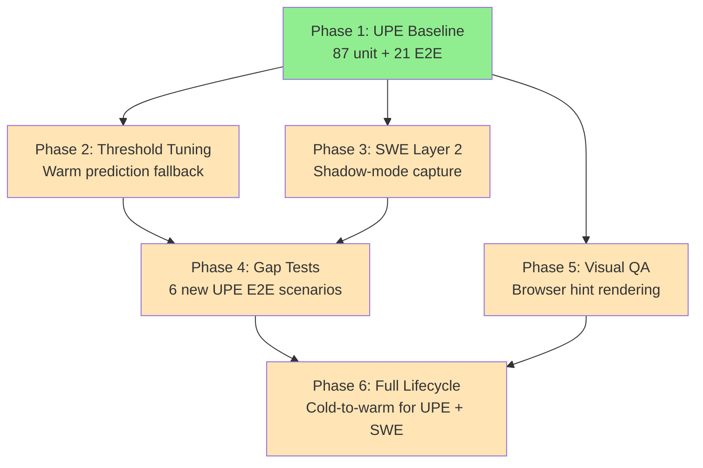

# Prediction System Validation Campaign

**Date**: 2026-03-25 | **Session**: 373 | **Last Updated**: 2026-03-25

---

## 1. Context — Why 3 TODOs Became 2

Three TODO items shared the same CBR/LanceDB/embedding infrastructure but were tracked separately:

1. **Trust Proxy Documentation Update** — Update `proxy-admin-guide.md` for Phases 3-4 of preference learning
2. **UPE Live E2E Validation** — 5-phase validation of Universal Prediction Engine (7 slices)
3. **SWE Team Proxy Layer 2** — Shadow-mode capture + simulation harness

**Decision**: Consolidate into 2 items:
- **Item A**: "Prediction System Validation Campaign" — unified validation of UPE + SWE proxy
- **Item B**: "Trust & Prediction Documentation Update" — deferred until Item A completes (can't document behavior not yet validated)

### Shared Infrastructure

| Component | UPE Validation | SWE Proxy L2 | Doc Update |
|-----------|---------------|--------------|------------|
| CBR engine (`prediction_engine.py`) | Direct | Via proxy decisions | Documents it |
| LanceDB embeddings | Similarity search | `find_similar()` + `data_origin` filter | Documents it |
| `prediction_log` DB table | Records predictions | Records shadow captures | Documents schema |
| Trust tracker (L1-L5) | Accuracy feeds trust | Shadow mode = L1 operation | Documents progression |
| `proxy_decision_repository.py` | Reads/writes predictions | `log_shadow()` path | Documents API |

---

## 2. Directory Map — Where Everything Lives

```
src/rnd/
  2026.02.14-swe-team-phase-4-decision-proxy-architecture/   SWE architecture (8 files)
    00-index.md .......................... Navigation hub
    01-implementation-current.md ......... Phase tracker (Phases 0-8 ALL DONE)
    02-disconnected-surfaces-audit.md .... Built-but-unwired surfaces
    03-config-wiring-reference.md ........ 18 INI keys mapping
    04-ui-design-ratification-dashboard.md  Wireframes
    05-notification-integration.md ....... Proxy events via POST /api/notify
    06-testing-validation.md ............. Test results + regression baselines
    2026.02.14-*-original.md ............ Original 4-layer plan (archived)

  2026.02.23-trust-proxy-preference-learning/                 UPE + trust proxy (12 files)
    00-index.md .......................... Navigation hub (NEW)
    2026.02.23-*-take-I.md ............... Preference learning analysis round 1
    2026.02.23-*-take-II.md .............. Preference learning analysis round 2
    2026.02.24-*-take-III-synthesis.md .... Synthesis of rounds 1-2
    2026.02.24-phase-2-*.md .............. BLR + Thompson Sampling
    2026.02.24-phase-3-*.md .............. Conformal + ICRL
    2026.02.24-*-seed-data-plan.md ....... Seed data strategy
    2026.02.27-*-overview.md ............. Full conceptual walkthrough
    2026.02.27-*-prediction-engine-plan.md  UPE master plan (7 slices)
    2026.03.02-slice-6-*.md .............. Slice 6 UI rendering plan
    2026.03.02-slices-4-5-*.md ........... Slices 4-5 open-ended plan
    2026.03.11-*-validation-plan.md ...... Original UPE validation (5 phases)
    2026.03.25-*-validation-campaign.md .. THIS FILE (umbrella)

  Standalone SWE files (3 scattered in src/rnd/ root):
    2026.02.23-swe-team-ui-bugfixes-dry-run-proxy-decisions.md
    2026.02.25-swe-proxy-data-origin-and-workload-generator.md   ← Layer 1 doc
    2026.02.25-unbounded-vs-swe-team-comparative-analysis.md

  Production docs:
    src/docs/proxy-admin-guide.md ........ Admin guide (Item B target)
```

---

## 3. Item A: Prediction System Validation Campaign (6 Phases)

### Dependency Graph



### Phase 1: UPE Baseline — DONE (Session 373)

**Goal**: Run all existing tests and record pass/fail as starting point.

**Results** (2026-03-25):

| Test Category | Count | Result | Time |
|---|---|---|---|
| Unit — qualifier | 20 | 20/20 PASS | 0.25s |
| Unit — multiple choice | 48 | 48/48 PASS | (combined) |
| Unit — open ended | 36 | 36/36 PASS | (combined) |
| Smoke — prediction_result | 5 | 5/5 PASS | <1s |
| Smoke — accuracy_comparators | 15 | 15/15 PASS | <1s |
| E2E — integration | 21 | 21/21 SKIP | 0.03s |
| **Total** | **145** | **124 pass, 21 skip** | |

**Key Finding**: Unit test count is **104** (not 87 as originally estimated). All 21 E2E integration tests are `@pytest.mark.skip` with reason: "Requires prediction engine server-side state (LanceDB + prediction_log table init) — deferred to UPE live E2E validation." Un-skipping these tests is Phase 2+ work.

**Commands used**:
```bash
pytest src/tests/unit/test_prediction_engine_qualifier.py \
       src/tests/unit/test_prediction_engine_multiple_choice.py \
       src/tests/unit/test_prediction_engine_open_ended.py -v
PYTHONPATH=src python -m cosa.agents.prediction_engine.prediction_result
PYTHONPATH=src python -m cosa.agents.prediction_engine.accuracy_comparators
pytest src/tests/integration/test_prediction_engine_e2e.py -v
```

**Tests**: 145 total (104 unit + 20 smoke + 21 E2E skip)
**Success criteria**: MET — all executable tests green, skip baseline documented.

---

### Phase 2: UPE Threshold Tuning — IN PROGRESS (Session 373)

**Goal**: Determine why warm tests sometimes fall back to `cold_start`; fix if needed.

#### Phase 2 Blocker: E2E Tests Require WebSocket Connection (Session 373)

**Root cause discovered**: All 21 E2E tests fail because the test user has no WebSocket connection. The notification router's offline detection (line 505 of `notifications.py`) hits an **early return** that bypasses the prediction engine hooks entirely:

```
POST /api/notify → is_connected check → OFFLINE → return default immediately
                                                    ↑ Skips Hook 1 (predict)
                                                    ↑ Skips Hook 2 (record_outcome)
                                                    ↑ Returns before prediction_log entry created
```

**Evidence**: Server logs show `[NOTIFY] User offline - returning default immediately` for test notifications but zero `[PREDICTION]` messages.

**Fix options**:
- **Option A (test fix)**: Add a WebSocket connection fixture to E2E tests — connect the test user to `/ws/queue/{session_id}` before sending notifications. This is the correct approach since the prediction engine is designed for online users.
- **Option B (architecture change)**: Move prediction hooks before the offline check. This would make predictions fire for all notifications regardless of user state. More invasive but enables offline prediction analytics.

**Recommendation**: Option A — add WebSocket fixture. The prediction engine's value is in real-time hint rendering, which only matters for connected users.

#### Phase 2 Fix Applied: WebSocket Fixture (Session 373)

**Status**: WebSocket fixture implemented and working. Prediction engine hooks now fire successfully.

**Changes**:
- `src/tests/integration/conftest.py`: Added `ws_connection` fixture (background thread with asyncio event loop, connects to `/ws/queue/test+penguin`, authenticates with test user JWT)
- `src/tests/integration/test_prediction_engine_e2e.py`: Both test classes updated to use `ws_connection` instead of `create_test_user`. Fixed `DetachedInstanceError` in `_get_prediction_log()` and `_get_all_prediction_logs()` via `session.refresh()` + `make_transient()`.

**New finding**: Cold-start tests fail because the **production LanceDB table** has accumulated decisions — the prediction engine returns `cbr_majority_vote` instead of `cold_start`. Tests need LanceDB isolation (use `TEST_LANCEDB_TABLE = "prediction_decisions_test"` from line 34, or clear production table before tests). This is Phase 2 threshold tuning scope.

**Steps**:
1. **Diagnostic**: Generate embeddings for seed vs query questions, compute pairwise cosine similarities, verify they cross the 0.75 threshold
2. **Category mismatch check**: Verify `NotificationCategoryClassifier` assigns same category to seed and query questions
3. **Threshold tuning** (if needed):
   - Option A (preferred): Lower threshold from 0.75 to 0.65 in INI
   - Option B: Adjust seed question phrasing to be closer to queries
4. **Re-run warm tests with debug**:
   ```bash
   pytest src/tests/integration/test_prediction_engine_e2e.py::TestPredictionEngineWarm -v -s
   ```

**Tests**: 0 new
**Success criteria**: >= 80% of warm tests achieve CBR strategy instead of `cold_start`.
**Critical files**:
- `src/cosa/agents/prediction_engine/prediction_engine.py` (~line 262: `find_similar`, ~line 289: confidence calc)
- `src/cosa/agents/prediction_engine/notification_category_classifier.py`
- `src/conf/lupin-app.ini` (threshold config keys)

---

### Phase 3: SWE Layer 2 Shadow-Mode Capture

**Goal**: Collect organic training data via live shadow-mode execution.

**Steps**:
1. **Review Layer 1 output**: Examine dry-run JSONL manifests in `io/decision-proxies/`
2. **Run Layer 2 live shadow-mode**:
   ```bash
   python src/scripts/swe_workload_runner.py --live --trust-mode shadow
   ```
3. **Verify shadow decisions**: Check PostgreSQL `proxy_decisions` table for entries with `data_origin=synthetic_generated`
4. **Verify LanceDB**: Confirm shadow decisions stored with correct embeddings and `data_origin` filter
5. **Run existing integration tests**:
   ```bash
   pytest src/tests/integration/test_swe_team_pipeline.py -v
   ```
   Expected: 7/7 pass.
6. **Test SWE with small scoped jobs**: Validate orchestration end-to-end with small tasks (absorbed from separate TODO item)

**Tests**: 7 existing integration tests
**Success criteria**: Shadow JSONL produced, decisions in `proxy_decisions` table with correct `data_origin`, 7/7 integration tests pass.
**Blocker**: Requires running FastAPI server on port 7999.
**Source doc**: [`src/rnd/2026.02.25-swe-proxy-data-origin-and-workload-generator.md`](../2026.02.25-swe-proxy-data-origin-and-workload-generator.md)

---

### Phase 4: Gap Tests

**Goal**: Add 6 new E2E scenarios to fill identified coverage gaps.

**New tests** in `src/tests/integration/test_prediction_engine_e2e.py`:

| # | Test Name | Covers |
|---|-----------|--------|
| 1 | `test_qualifier_accuracy` | yes_no with qualifiers — verify `accuracy_detail` contains qualifier fields |
| 2 | `test_warm_mc_single_accuracy` | MC single-select — verify `accuracy_match` correct |
| 3 | `test_warm_open_ended_batch_accuracy` | Batch answers — verify per-header comparison |
| 4 | `test_confidence_threshold_suppression` | Mixed votes (low confidence) — verify hint not generated |
| 5 | `test_organic_cold_to_warm_cycle` | 3 cold-start decisions → same question → verify CBR fires on 4th |
| 6 | `test_warm_open_ended_llm_accuracy` | LLM synthesis accuracy (Phi-4 dependent, skips if unavailable) |

**Tests**: +6 new (total 27 E2E)
**Success criteria**: 27/27 E2E tests pass (21 existing + 6 new).

---

### Phase 5: Visual QA

**Goal**: Verify prediction hints render correctly in browser UI.

**Steps**:
1. Run visual QA test:
   ```bash
   python src/tests/smoke/test_prediction_hint_visual_qa.py --delay 12
   ```
2. Visual checklist (human in browser at localhost:7999):

   | # | Scenario | Expected |
   |---|----------|----------|
   | 0 | Cold start | Gray ghost box: "Learning, no prediction yet" |
   | 1 | Warm yes_no | Purple box: "Predicted: Yes (85%)" + strategy label |
   | 2 | Qualified yes_no | Purple box with qualifier text in quotes |
   | 3 | MC single | Answer shown: "Database: PostgreSQL" |
   | 4 | MC multi | List format: "[Dark mode, Notifications]" |
   | 5 | Open-ended | Quoted text prediction |
   | 6 | Open-ended batch | Multi-header compound answer |

3. CSS class verification: `.prediction-hint`, `.prediction-hint-cold`, `.prediction-hint-label`, `.prediction-hint-strategy`

**Tests**: 7 visual scenarios
**Success criteria**: All 7 scenarios render correctly in browser.
**Blocker**: Slice 6 UI rendering must be code-complete — check for `buildPredictionHintSection()` in `notifications.js`.
**Critical files**:
- `src/tests/smoke/test_prediction_hint_visual_qa.py`
- `src/fastapi_app/static/js/notifications.js` (~line 11159)
- `src/fastapi_app/static/css/notifications.css`

---

### Phase 6: Full Lifecycle Validation

**Goal**: Validate complete organic lifecycle end-to-end for both UPE and SWE proxy.

**UPE Lifecycle**:
1. Clean LanceDB slate (drop test table)
2. **yes_no cold start** (3 iterations): Send semantically similar deployment questions, all respond "yes". Verify `strategy == "cold_start"`, decision stored in LanceDB, `prediction_log` row created.
3. **yes_no warm prediction** (iteration 4): Same question. Verify `strategy == "cbr_majority_vote"`, `predicted_value == "yes"`, `confidence > 0.60`.
4. **Accuracy mismatch**: Send similar question, respond "no". Verify `accuracy_match == False`.
5. **Accuracy summary**: Query `get_accuracy_summary( window_days=1 )`. Verify totals and mixed accuracy rate.
6. **Repeat for open_ended**: 3 cold + 1 warm + accuracy check.
7. **Repeat for multiple_choice**: 3 cold + 1 warm + accuracy check.

**SWE Lifecycle**:
1. Run workload catalog tasks through shadow mode
2. Verify decisions accumulate in `proxy_decisions` with correct `data_origin`
3. Verify trust level remains L1 during shadow (shadow mode must not escalate trust)

**Tests**: Covered by Phase 4 gap tests + manual verification
**Success criteria**:
- Organic cold-to-warm transition demonstrated for all 3 UPE response types
- Accuracy tracking produces correct summaries
- SWE shadow mode produces valid decision corpus without affecting trust levels

---

## 4. Item B: Trust & Prediction Documentation Update (Deferred)

**Blocked by**: Item A completion (can't accurately document unvalidated behavior).

### Updates to `src/docs/proxy-admin-guide.md`

| Section | Change | Source |
|---------|--------|--------|
| Section 7 (Trust Feedback Loop) | Add Phase 3 conformal/ICRL algorithms, how they feed trust escalation | Phase 3 plan doc |
| New Section 9 | "Prediction Engine" — how UPE hints appear in cards, strategies (CBR majority vote, CBR retrieval, LLM synthesis), accuracy tracking | UPE master plan + validation results |
| New Section 10 | "Shadow Mode Operations" — how to run SWE proxy in shadow mode, review captured decisions, transition L1 to L2 | SWE Layer 2 doc + validation results |
| Header | Update "Last Updated" date | — |

### New Documents to Create

- `src/docs/prediction-engine-reference.md` — API-level reference for prediction engine (strategies, thresholds, accuracy comparators, config keys)

### Updates to Existing Docs

- `src/docs/README.md` — Add links to new prediction engine reference doc
- `src/rnd/2026.02.23-trust-proxy-preference-learning/00-index.md` — Cross-reference admin guide

---

## 5. Remaining Work Inventory

Every task from the 3 original TODOs, mapped to a phase:

| Original TODO Item | Original Source | Mapped To |
|---|---|---|
| Run 87 UPE unit tests baseline | UPE validation | Item A, Phase 1 |
| Run 21 UPE E2E tests baseline | UPE validation | Item A, Phase 1 |
| Warm prediction threshold investigation | UPE validation | Item A, Phase 2 |
| 6 new gap-filling E2E tests | UPE validation | Item A, Phase 4 |
| Browser visual QA for hint rendering | UPE validation | Item A, Phase 5 |
| Full cold-to-warm lifecycle | UPE validation | Item A, Phase 6 |
| Review Layer 1 dry-run JSONL | SWE proxy L2 | Item A, Phase 3 |
| Run Layer 2 live shadow-mode | SWE proxy L2 | Item A, Phase 3 |
| Build simulation harness | SWE proxy L2 | Item A, Phase 3 |
| Test SWE with small jobs | SWE proxy L2 | Item A, Phase 3 |
| Update proxy-admin-guide.md | Trust doc update | Item B |
| Create prediction-engine-reference.md | Trust doc update | Item B |
| Update docs/README.md links | Trust doc update | Item B |

---

## 6. Dependencies & Blockers

| Dependency | Blocks | Status |
|---|---|---|
| FastAPI server running on 7999 | Phases 1, 3, 5, 6 | Manual start |
| Slice 6 UI rendering code-complete | Phase 5 | Check `buildPredictionHintSection()` in `notifications.js` |
| Phi-4 LLM available | Phase 4 test #6 only | Optional (test skips if unavailable) |
| Phase 3 conformal/ICRL implemented | Item B documentation | DONE (Session 266) |
| Phase 4 UPE implemented | Item B documentation | DONE (7 slices code-complete) |
| LanceDB + PostgreSQL accessible | All phases | Requires running server |

---

## 7. Test Count Summary

| Category | Existing | New | Total |
|---|---|---|---|
| UPE unit tests | 104 | 0 | 104 |
| UPE module smoke tests | 20 | 0 | 20 |
| UPE E2E tests | 21 | 6 | 27 |
| SWE integration tests | 7 | 0 | 7 |
| Data origin unit tests | 14 | 0 | 14 |
| Visual QA scenarios | 7 | 0 | 7 |
| **Grand total** | **173** | **6** | **179** |
