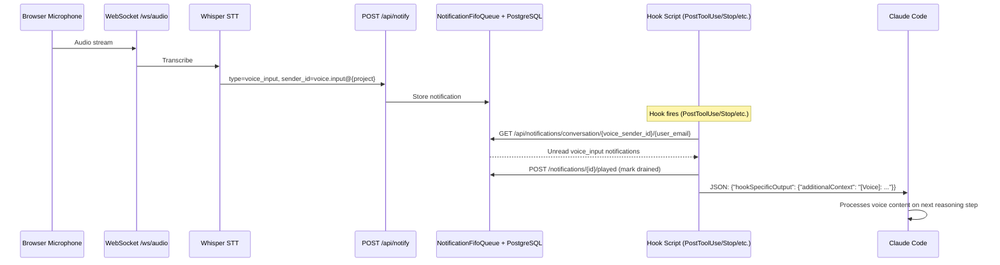

# Voice I/O Integration with Claude Code System Hooks

## Context

Lupin already has a production voice I/O system (cosa-voice MCP server v0.3.0) that delivers TTS notifications and collects voice responses via WebSocket. However, it only fires when Claude explicitly calls MCP tools -- there is no integration with Claude Code's **18 system hook events** that fire automatically at lifecycle boundaries (before/after every tool call, at stops, at permission requests, etc.).

The research document at [2026.02.25-voice-io-integration-with-cc-system-hooks-research.md](2026.02.25-voice-io-integration-with-cc-system-hooks-research.md) maps the complete I/O contract for all 18 hooks. This plan exploits those contracts to build **opportunistic voice injection** -- evaluating every hook event as a potential voice I/O integration point.

**Goal**: Full bidirectional voice loop -- voice-driven approvals, richer progress notifications via TTS, and the ability to speak to redirect/interrupt Claude at any lifecycle boundary, not just the Stop hook.

**Pattern**: 6 (Research-Driven Implementation) | **Timeline**: 6-8 weeks

---

## Hook-by-Hook Voice I/O Suitability Matrix

### Tier 1: High-Value (Build First)

| Hook | Voice OUT (TTS) | Voice IN (inject) | Voice BLOCK (approval) | Mechanism |
|------|---|---|---|---|
| **PostToolUse** | "File saved" / "Tests passed" | `additionalContext` | No (tool already ran) | **Primary voice drain point** -- fires after every tool call |
| **Stop** | "Claude wants to stop" | `decision:"block"` + `reason` (NO additionalContext) | Yes | Voice redirect: "wait, also fix tests" becomes `reason` |
| **PreToolUse** | "About to run Bash: npm test" | `additionalContext` + `updatedInput` | Yes (`allow`/`deny`/`ask`) | Conditional drain for explicit approval/denial patterns |
| **PermissionRequest** | "Claude needs permission to run X" | `updatedInput` | Yes (`allow`/`deny` + `interrupt`) | Natural voice yes/no approval |
| **Notification** | Relay CC notifications to TTS | No (observation only) | No | Bridge: `permission_prompt`, `idle_prompt`, `elicitation_dialog` |

### Tier 2: Medium-Value (Build Second)

| Hook | Voice OUT | Voice IN | Voice BLOCK | Notes |
|------|---|---|---|---|
| **UserPromptSubmit** | No | `additionalContext` | Yes (block prompt) | Prepend voice context to typed prompts |
| **PostToolUseFailure** | "Error: tests failed" (urgent) | `additionalContext` | No | Voice guidance on failures |
| **SessionStart** | "Session started, ready" | `additionalContext` (priming) | No | Command-only handler |
| **TaskCompleted** | "Task X completed" | Exit codes only | Yes (exit 2) | Multi-agent teams only |
| **SubagentStop** | "Subagent finishing" | `reason` only | Yes (known bug #20221) | Same as Stop but unreliable blocking |

### Tier 3: Awareness Only

SessionEnd, PreCompact (`customInstructions`), TeammateIdle, SubagentStart, ConfigChange, Setup, WorktreeCreate/Remove -- low voice value, implement only if time permits.

---

## "Opportunistic Voice Drain" Architecture

### Core Concept

Between Claude's tool calls, the user speaks at any time. Speech is captured, transcribed, and pushed into the **existing notification system** as a new `voice_input` notification type. At hook invocation points, hook scripts query the notification API for unread voice inputs and inject them as context.

**No new queue infrastructure needed** -- the existing notification API (`POST /api/notify`, `GET /notifications/conversation/...`, `POST /notifications/{id}/played`) handles storage, delivery, and lifecycle.

### Data Flow (Using Existing Notification API)



### Existing Infrastructure Reuse

| Need | Existing API | How Hook Scripts Use It |
|------|-------------|------------------------|
| **Voice OUTPUT (TTS)** | `notify_user_async()` / `POST /api/notify` | Fire-and-forget TTS announcement |
| **Voice BLOCKING** | `notify_user_sync()` / `POST /api/notify` (response_requested=true) | Ask question, block on SSE for voice/text response |
| **Voice DRAIN (accumulation)** | `POST /api/notify` (type=voice_input) + `GET /notifications/conversation/...` | Browser pushes transcriptions, hooks query + mark played |
| **Session tracking** | `GET /notifications/project-sessions/{project}/{user_email}` | Multi-instance awareness |
| **Auth** | Existing API key + JWT dual auth | Hook scripts use API key from config_loader |

### Minimal Extensions Required

1. **New `NotificationType.VOICE_INPUT`** enum value in `src/cosa/cli/notification_types.py`
2. **Voice sender_id convention**: `voice.input@{project}.deepily.ai#{cc_session_id}` -- browser uses this when pushing transcriptions
3. **Drain helper in `hook_common.py`**: Thin wrapper that queries `GET /notifications/conversation/{voice_sender_id}/{user_email}`, filters unplayed, marks played after drain

### Drain Priority

| Hook | Drain Role | Behavior |
|------|-----------|----------|
| **PostToolUse** | PRIMARY | Always drain. Inject as `additionalContext`. |
| **Stop** | SECONDARY | Query first. If unread voice_input exists, drain + `decision:"block"` with voice as `reason`. Check `stop_hook_active` to prevent infinite loops. |
| **PreToolUse** | CONDITIONAL | Only drain if voice matches approval/denial keywords. Otherwise leave for PostToolUse. |
| **PermissionRequest** | CONDITIONAL | Only drain if voice is "yes"/"no". Map to `allow`/`deny`. |

**Drain-once semantics**: Hook scripts mark drained notifications as `played` via existing `POST /notifications/{id}/played`. Other hooks checking later see zero unplayed items.

### Infinite Loop Prevention (Stop Hook)

```python
if input_data.get( "stop_hook_active", False ):
    sys.exit( 0 )  # Already blocked once, let Claude stop

voice_messages = drain_voice_input( session_id )  # Uses existing notification API
if voice_messages:
    print( json.dumps( { "decision": "block", "reason": f"User said: {voice_messages}" } ) )
else:
    print( json.dumps( {} ) )  # Allow stop
```

Additional safety: block counter in `/tmp/claude-hook-stop-count-{session_id}`, max 3 blocks.

---

## Implementation Phases

### Phase 0: Hook Contract Validation (Week 1, first half)

Create minimal "hello world" hooks to validate the research empirically.

- Create `src/scripts/claude_code/hooks/` directory structure
- Write test hooks for PostToolUse, Stop, Notification, PermissionRequest
- Register in `.claude/settings.local.json` under new `hooks` key
- Log actual JSON payloads received (validate research doc claims)
- Test `stop_hook_active` behavior
- Measure hook execution latency

**Deliverables**: 4 test hooks, empirical payload documentation, latency benchmarks

### Phase 1: Notification System Extensions (Week 1 second half + Week 2)

Extend the existing notification API for voice input accumulation. **No new queue classes or routers needed.**

- Add `VOICE_INPUT` to `NotificationType` enum in `src/cosa/cli/notification_types.py`
- Add corresponding Pydantic model support in `src/cosa/cli/notification_models.py`
- Establish voice sender_id convention: `voice.input@{project}.deepily.ai#{cc_session_id}`
- Test voice input flow end-to-end with existing endpoints:
  - Push: `POST /api/notify` (type=voice_input, sender_id=voice.input@..., target_user=...)
  - Query: `GET /notifications/conversation/{voice_sender_id}/{user_email}`
  - Drain: `POST /notifications/{id}/played` (mark as played after consumption)
- Config keys in `lupin-app.ini` + splainer: `voice hooks enabled`, `voice drain confidence threshold`
- Unit tests (10+), smoke test via existing `LivePipelineTestBase`

**Key files to modify**: `src/cosa/cli/notification_types.py`, `src/cosa/cli/notification_models.py`, `src/conf/lupin-app.ini`, `src/conf/lupin-app-splainer.ini`

**Key files to REUSE (not modify)**: `src/cosa/rest/routers/notifications.py` (17 existing endpoints), `src/cosa/rest/notification_fifo_queue.py`, `src/cosa/cli/notify_user_async.py`, `src/cosa/cli/notify_user_sync.py`

### Phase 2: Hook Script Infrastructure (Week 2-3)

Build the shared library all hooks import. **Wraps existing CLI clients, not new endpoints.**

- `src/scripts/claude_code/hooks/lib/hook_common.py`:
  - `read_hook_input()` -- JSON from stdin, extracts `session_id`, `hook_event_name`, etc.
  - `drain_voice_input( session_id )` -- queries existing `GET /notifications/conversation/{voice_sender_id}/{user_email}`, filters unplayed `voice_input` type, marks played via `POST /notifications/{id}/played`
  - `send_tts( message, priority )` -- wraps existing `notify_user_async()` from `src/cosa/cli/notify_user_async.py`
  - `ask_and_wait( message, response_type, timeout )` -- wraps existing `notify_user_sync()` from `src/cosa/cli/notify_user_sync.py`
  - `emit_json()` -- stdout
  - `load_config()` / `get_api_key()` -- reuses `src/cosa/utils/config_loader.py`
- `src/scripts/claude_code/hooks/conf/hooks.ini` -- voice drain enabled, TTS enabled, approval timeout, max stop blocks, log level
- Unit tests (12+)

### Phase 3: Voice Output Hooks -- TTS Notifications (Week 3-4)

Hook into lifecycle events to announce status via TTS.

- `notification_hook.py` -- relay `permission_prompt`, `idle_prompt`, `elicitation_dialog` to TTS
- `session_start_hook.py` / `session_end_hook.py` -- greetings/farewells
- `post_tool_use_hook.py` -- announce Bash/Write/Edit completions (filter Read/Grep/Glob for noise)
- `post_tool_use_failure_hook.py` -- urgent TTS on failures
- `task_completed_hook.py` -- multi-agent task announcements
- Register all in `.claude/settings.local.json`
- Smoke tests (10+), manual E2E verification

### Phase 4: Voice Input Hooks -- Queue Drain + Context Injection (Week 4-5)

Drain voice queue at hook boundaries and inject content.

- Enhance `post_tool_use_hook.py` with voice drain -> `additionalContext`
- Create `stop_hook.py` with voice drain -> `decision:"block"` + `reason`, loop prevention
- Enhance `pre_tool_use_hook.py` with conditional drain (approval/denial keywords)
- Create `user_prompt_submit_hook.py` with optional voice prepend
- Create `pre_compact_hook.py` with `customInstructions` injection
- Integration tests (15+): drain verification, Stop loop prevention, empty queue passthrough

### Phase 5: Voice-Driven Approvals (Week 5-6)

PermissionRequest hook with real-time voice yes/no.

- `permission_request_hook.py`: TTS the request -> poll voice queue (500ms intervals, 30s timeout) -> map yes/no -> JSON decision
- Config: `approval_default_on_timeout = deny`, `approval_auto_allow_tools = Read,Grep,Glob`, `approval_always_ask_tools = Bash,Write,Edit`
- Integration with Decision Proxy (defer to proxy when running, voice when live)
- Edge cases: ambiguous response re-ask, "yes but change to X" -> `updatedInput`
- Tests (10+)

### Phase 6: Browser Voice Capture (Week 6-7)

Wire browser microphone to the voice input queue.

- Enhance `audio-recorder.js` with push-to-talk mode -> audio -> `/ws/audio` -> Whisper STT -> `VoiceInputQueue.push()`
- New WebSocket message type `voice_input_transcribed` for UI feedback
- UI: microphone toggle, transcript bubble, queue depth indicator
- Optional: always-on VAD mode (opt-in, battery warning)

### Phase 7: Testing + Polish (Week 7-8)

- Comprehensive E2E test suite across all hooks
- `src/docs/voice-hooks-guide.md` -- installation, configuration, troubleshooting
- Update `CLAUDE.md` with voice hooks section
- Update `src/docs/notification-api.md` with voice queue endpoints
- Performance: target <500ms speech-end -> hook-drain
- Pre-merge gate: unit + smoke + WebSocket + integration all passing

---

## Architecture Decisions

| ID | Decision | Rationale |
|----|----------|-----------|
| **AD-1** | Hook scripts use existing notification CLI clients (`notify_user_async.py`, `notify_user_sync.py`) and REST API (not MCP tools) | Hooks run as subprocesses, cannot access MCP stdio transport. CLI clients already handle auth, retry, SSE parsing. Pattern: `src/cosa/cli/notify_user_async.py`, `src/cosa/cli/notify_user_sync.py` |
| **AD-2** | Voice input uses existing notification API with new `VOICE_INPUT` type (no new queue) | Existing `POST /api/notify` handles storage, `GET /notifications/conversation/...` handles query, `POST /notifications/{id}/played` handles drain lifecycle. `NotificationFifoQueue` + PostgreSQL already provide in-memory speed + persistence. |
| **AD-3** | Synchronous hooks for output/drain (~20ms), configurable 30s timeout for approval hooks | Output hooks are fast HTTP calls. PermissionRequest needs voice wait. Set `"timeout": 30000` in settings. |
| **AD-4** | Custom hook scripts in `settings.local.json` (not Hookify rules) | Direct Python scripts give full control. Hookify adds indirection. No existing Hookify rules in project. `settings.local.json` is gitignored. |
| **AD-5** | PostToolUse is primary drain, Stop is secondary | PostToolUse fires most frequently (after every tool). Stop only fires at end. Drain-once semantics prevent double-injection. |
| **AD-6** | Multi-instance session routing via CC's native `session_id` from hook JSON payload | See detailed section below. |

### AD-6: Multi-Instance Session Routing (Deep Dive)

**Problem**: When multiple CC instances run in separate terminal tabs, hook scripts need to route notifications to the correct CC instance and drain the correct voice queue. The MCP server generates its own `SESSION_ID` (uuid hex), while CC provides a different `session_id` in every hook payload. These are independent IDs with no built-in correlation.

**CC provides in hook JSON payload**: `session_id`, `transcript_path`, `cwd`, `permission_mode`, `hook_event_name`
**CC provides as env vars**: `CLAUDE_PROJECT_DIR`, `CLAUDE_CODE_REMOTE`, `CLAUDE_PLUGIN_ROOT` (NO session ID env var)
**MCP server generates**: `SESSION_ID = uuid.uuid4().hex[:8]` (line 178, `cosa_voice_mcp.py`)

**Solution**: Two-part approach:

**Part 1 -- Hook-originated notifications use CC's `session_id` as routing key**:
- Hook scripts extract `session_id` from stdin JSON payload
- Construct sender_id: `claude.code@{project}.deepily.ai#{cc_session_id}`
- Pass this sender_id + target_user email to `/api/notify`
- Notifications route to the user and are grouped by sender_id in UI

**Part 2 -- Voice queue is partitioned by CC `session_id`**:
- `VoiceInputQueue` stores items keyed by `cc_session_id`
- REST endpoints require `?session_id={cc_session_id}` parameter:
  - `GET /api/voice-queue/drain?session_id=abc123`
  - `POST /api/voice-queue/push?session_id=abc123`
- Hook scripts pass their CC `session_id` when draining

**Part 3 -- SessionStart hook registers CC session with Lupin server**:
- SessionStart hook fires on startup, calls `POST /api/voice-session/register` with:
  - CC's `session_id`, `cwd`, `transcript_path`
- Lupin server creates a `VoiceSession` record
- MCP server's `get_session_info()` returns its own `session_id` + `sender_id`
- Claude calls `get_session_info()` early -> the MCP sender_id enters the transcript
- SessionStart hook + MCP registration together give the server a complete picture

**Part 4 -- Browser voice input targeting**:
- Browser UI shows active CC sessions (from `/api/voice-session/list`)
- User selects which CC instance receives voice input (dropdown/tabs)
- Default: most-recently-active session
- Voice push includes the target CC `session_id`

**Leverages existing endpoints**:
- `GET /notifications/project-sessions/{project}/{user_email}` -- already tracks sessions by project
- `POST /api/notify` with sender_id `claude.code@{project}.deepily.ai#{cc_session_id}` -- SessionStart hook sends a "session started" notification, which auto-registers the session in PostgreSQL via existing sender tracking
- Browser queries active sessions via existing sender analytics endpoints

---

## Risk Assessment

| Risk | Severity | Mitigation |
|------|----------|------------|
| Stop hook infinite loop | CRITICAL | Check `stop_hook_active` flag + max 3 blocks counter in temp file. Phase 0 validates empirically. |
| SubagentStop may not block (#20221) | MEDIUM | Treat as Tier 2. Implement output notifications but don't rely on blocking. |
| SKILL.md Stop hooks may not fire (#19225) | MEDIUM | Register all hooks in `settings.local.json` only, never SKILL.md. |
| STT transcription quality | MEDIUM | Confidence threshold (0.7), `[Voice]:` prefix for Claude, UI review of queued text. |
| Stale voice queue messages | LOW | TTL on queue items (60s default), max depth (50 items). |
| Parallel hook race on drain | LOW | Atomic drain endpoint (read+clear under lock). First hook wins. |
| Multi-instance session correlation | MEDIUM | CC `session_id` from hook payload is the canonical key. SessionStart hook registers with server. Phase 0 captures actual session_id format. |
| Browser voice targeting with multiple CC instances | LOW | Default to most-recently-active session. UI session selector for explicit targeting. |

---

## File Organization

```
src/scripts/claude_code/hooks/
    conf/hooks.ini
    lib/hook_common.py
    lib/__init__.py
    logs/                            (gitignored)
    notification_hook.py             (Tier 1)
    post_tool_use_hook.py            (Tier 1)
    stop_hook.py                     (Tier 1)
    pre_tool_use_hook.py             (Tier 1)
    permission_request_hook.py       (Tier 1)
    post_tool_use_failure_hook.py    (Tier 2)
    session_start_hook.py            (Tier 2)
    session_end_hook.py              (Tier 3)
    user_prompt_submit_hook.py       (Tier 2)
    pre_compact_hook.py              (Tier 3)
    task_completed_hook.py           (Tier 2)

src/cosa/cli/
    notification_types.py            (modify - add VOICE_INPUT enum value)
    notification_models.py           (modify - add voice input model support)

src/tests/
    unit/test_hook_common.py
    smoke/test_voice_input_flow.py   (push -> query -> drain via existing notification API)
    smoke/test_hook_post_tool_use.py
    smoke/test_hook_stop.py
    smoke/test_hook_permission.py

src/docs/voice-hooks-guide.md       (new)
```

---

## Verification Plan

1. **Phase 0 gate**: All 4 test hooks receive expected JSON payloads, `stop_hook_active` works as documented
2. **Phase 1 gate**: `VOICE_INPUT` type works through existing notification API (push -> query -> mark played), 10+ tests pass
3. **Phase 2 gate**: Hook common library loads config, drains queue, sends notifications -- 12+ tests pass
4. **Phase 3 gate**: Manual E2E: run Claude Code session, hear TTS for tool completions and failures
5. **Phase 4 gate**: Push voice text via REST, verify Claude receives `[Voice]: ...` as additionalContext
6. **Phase 5 gate**: Push "yes"/"no" to voice queue, verify PermissionRequest hook returns correct allow/deny
7. **Phase 6 gate**: Browser push-to-talk -> STT -> queue -> hook drain -> Claude context, <500ms latency
8. **Final gate**: Full pre-merge suite (`pytest unit/ + WebSocket + integration`) 100% pass
