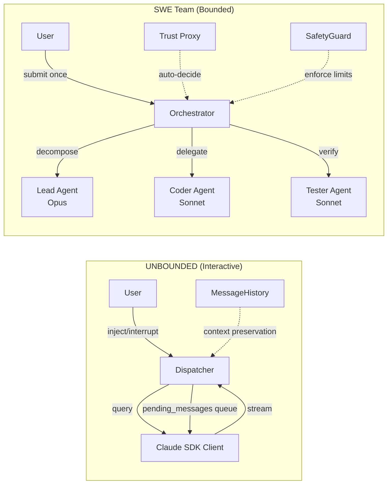

# Comparative Analysis: CJ Flow UNBOUNDED (Interactive) vs SWE Team (Bounded Multi-Agent)

**Date**: 2026-02-25
**Type**: Research & Analysis
**Author**: Claude Code (Session 268)
**Status**: Complete

---

## Executive Summary

Lupin's CJ Flow supports two distinct architectures for autonomous coding work: **UNBOUNDED (Interactive)** Claude Code sessions with human-in-the-loop control, and **SWE Team (Bounded)** multi-agent orchestration with trust proxy decision-making. This document provides a rigorous comparative analysis grounded in the actual codebase and community research to guide UNBOUNDED dry-run testing design and future architectural decisions.

**Key finding**: These are complementary, not competing, approaches. UNBOUNDED excels at tasks requiring human judgment (exploratory refactoring, unfamiliar codebases, security-sensitive changes). SWE Team excels at well-specified, decomposable tasks that can run to completion autonomously (feature implementation, CI/CD tasks, overnight work).

---

## 1. Architecture Overview

### 1.1 Codebase Footprint

| Component | UNBOUNDED (Interactive) | SWE Team (Bounded) |
|-----------|------------------------|---------------------|
| **Job class** | `src/cosa/agents/claude_code/job.py` (537 lines) | `src/cosa/agents/swe_team/job.py` (526 lines) |
| **Dispatcher / Orchestrator** | `src/cosa/orchestration/claude_code/dispatcher.py` (838 lines) | `src/cosa/agents/swe_team/orchestrator.py` (1,823 lines) |
| **State management** | `MessageHistory` (260 lines) + `active_sessions` dict | `OrchestratorState` enum + Pydantic models in `state.py` (317 lines) |
| **Safety** | Claude Code CLI built-in permission modes | `safety_limits.py` (302 lines): iteration, token, timeout, file-change guards |
| **Trust/Proxy** | N/A (human decides) | `proxy/engineering_strategy.py` (603 lines): Thompson Sampling + BLR + Conformal + ICRL |
| **Total package** | ~722 lines | ~6,673 lines |
| **Complexity ratio** | 1x | ~9.2x |

### 1.2 Shared Infrastructure

Both approaches share the same foundational infrastructure:

```
AgenticJobBase (src/cosa/agents/agentic_job_base.py, 447 lines)
    ├── ClaudeCodeJob      → ClaudeCodeDispatcher
    └── SweTeamJob         → SweTeamOrchestrator

Common pipeline:
    agentic_job_factory.py → TodoFifoQueue → RunningFifoQueue → done/dead
    ↕ cosa-voice MCP notifications ↕ WebSocket session routing
```

Both use:
- **Same queue protocol**: `QueueableJob` → CJ Flow lifecycle (todo → running → done/dead)
- **Same notification system**: cosa-voice MCP tools (`notify()`, `ask_yes_no()`, `converse()`)
- **Same factory**: `agentic_job_factory.py` creates both job types
- **Same REST pattern**: `/api/claude-code/queue/submit` vs `/api/swe-team/submit`
- **Same WebSocket routing**: Session-based event delivery with job card association
- **Same dry-run pattern**: Breadcrumb notifications with mock results

### 1.3 Key Architectural Differences



---

## 2. Autonomy Spectrum

```
← More Human Control                    More Agent Autonomy →

  UNBOUNDED/INTERACTIVE          SWE Team BOUNDED
  ┌─────────────────────┐        ┌─────────────────────┐
  │ Human injects        │        │ Trust proxy handles  │
  │ messages at any      │        │ all decisions after  │
  │ point via inject(),  │        │ submission. Agent    │
  │ interrupt(),         │        │ runs to completion.  │
  │ end_session().       │        │                      │
  │                      │        │ SafetyGuard enforces │
  │ dispatcher.py:511    │        │ hard limits:         │
  │ dispatcher.py:564    │        │ • 10 iterations      │
  │ dispatcher.py:582    │        │ • 500K tokens        │
  │                      │        │ • 1800s timeout      │
  │ Agent pauses, asks,  │        │ • 20 file changes    │
  │ waits for input.     │        │ • 3 consecutive fails│
  └─────────────────────┘        └─────────────────────┘
       ↑                              ↑
  Copilot model                  Autopilot model
```

**Community validation**: Anthropic's Feb 2026 research on Claude Code usage shows experienced users (750+ sessions) auto-approve >40% of actions AND interrupt more strategically (9% vs 5% for newer users). This validates having BOTH modes — users graduate from INTERACTIVE to BOUNDED as trust builds.

---

## 3. When to Use Each

| Scenario | Best Approach | Why |
|----------|--------------|-----|
| **Exploratory refactoring** | UNBOUNDED | Needs human architectural judgment at decision points |
| **Well-specified feature from task spec** | SWE Team | Decomposable, testable, autonomous via Lead→Coder→Tester |
| **Bug fix in well-understood code** | UNBOUNDED | Quick feedback loop, human verifies fix direction |
| **Multi-file feature with tests** | SWE Team | Lead decomposes, Coder implements, Tester verifies automatically |
| **Unfamiliar codebase navigation** | UNBOUNDED | Human guides exploration, corrects wrong turns |
| **CI/CD pipeline tasks** | SWE Team (or BOUNDED Claude Code) | Sandboxed, deterministic, no user needed |
| **Security-sensitive changes** | UNBOUNDED | Human must approve each significant decision |
| **Long-running overnight tasks** | SWE Team | No human available; trust proxy + SafetyGuard gate decisions |
| **Quick one-off tasks** | BOUNDED Claude Code | Simpler than SWE Team, no decomposition overhead |

---

## 4. Architectural Pros & Cons

### 4.1 UNBOUNDED (Interactive Claude Code)

**Pros**:
- **Highest fidelity control**: `inject()` (dispatcher.py:511), `interrupt()` (dispatcher.py:564), `end_session()` (dispatcher.py:582) give real-time steering
- **Context preservation**: `MessageHistory` (message_history.py) tracks full conversation; user can course-correct with full context via `get_context_prompt()`
- **Lowest risk**: Human approves each significant decision via cosa-voice notifications
- **Simplicity**: Single agent with tools — 722 lines total, no coordination overhead. Validates the "mini-swe-agent principle" (community finding: 100 lines of scaffolding can match complex multi-agent systems)
- **Flexible scope**: Can pivot mid-task when requirements change; user injects new direction
- **Community validated**: Anthropic's data shows this "supervised autonomous" pattern is the most common mode for experienced users

**Cons**:
- **Blocks on human availability**: If user is away, session stalls in `pending_messages` queue (dispatcher.py:443, asyncio.Queue)
- **Context degradation**: Effective context is ~50-60% of stated maximum (community finding). Long interactive sessions degrade quality. The `max_chars_per_message=500` truncation in MessageHistory (message_history.py:100) mitigates but doesn't eliminate this.
- **Not scalable**: One human, one session at a time — limited by human availability
- **Single point of failure**: One agent, one session — no redundancy or retry logic
- **Token cost**: Community reference data shows 234K tokens for a reference task vs Codex's 72.5K for equivalent bounded work

### 4.2 SWE Team (Bounded Multi-Agent)

**Pros**:
- **Fully autonomous post-submission**: Runs to completion without human intervention. `orchestrator.py` manages the full lifecycle.
- **Role specialization**: 3 active agents — Lead (Opus, task decomposition), Coder (Sonnet, implementation), Tester (Sonnet, verification). Mirrors the proven Planner-Worker-Judge pattern.
- **Trust proxy replaces human**: `engineering_strategy.py` (603 lines) implements Thompson Sampling + Bayesian Linear Regression + Conformal Prediction + Inverse Constraint Reinforcement Learning. Trust mode progression: `shadow` → `suggest` → `active`.
- **Scalable**: Multiple SWE Team jobs can run concurrently via the queue system
- **Predictable cost**: Budget parameter in `SweTeamConfig` (config.py) enforces spending limits
- **Safety guard**: `SafetyGuard` class (safety_limits.py:89) enforces iteration limits (10), token limits (500K), wall-clock timeout (1800s), file change quotas (20), dangerous command blocking (16 patterns)
- **Coder-Tester loop**: `MAX_VERIFICATION_ITERATIONS = 3` (orchestrator.py:65) enables automatic retry of implementation errors without human intervention
- **Future expansion**: 6 roles defined (lead, architect, coder, reviewer, tester, debugger) — 3 active now, 3 planned for Phase 5 (agent_definitions.py:175,191,207)

**Cons**:
- **Error amplification risk**: DeepMind research shows unstructured multi-agent systems amplify errors up to 17x. The hierarchical Lead→Coder→Tester topology mitigates this, but coordination bugs across 1,823 lines of orchestrator code are harder to debug than single-agent issues.
- **No mid-course correction**: If the Lead's task decomposition is wrong (`TaskSpec` in state.py:64), the entire run produces wrong output. No human to catch a bad plan.
- **Trust proxy is experimental**: Phase 4 just completed; the proxy's decisions haven't been battle-tested at scale. The `shadow` → `suggest` → `active` progression (job.py:220-229) is exactly right but needs production validation.
- **Higher complexity**: 6,673 total lines (~9.2x the Claude Code package). More surface area for bugs.
- **Context isolation trade-off**: Each subagent gets fresh context (good for clarity, bad for holistic understanding of cross-cutting concerns)
- **Multi-model cost**: Lead uses Opus, Workers use Sonnet — multi-model cost compounds across delegations

---

## 5. Community Research Applied

### 5.1 The "Five Laws" Applied to Your Architecture

| Law | UNBOUNDED | SWE Team |
|-----|-----------|----------|
| **Fresh Context Beats Long Context** | Vulnerable — long sessions degrade. `MessageHistory.get_context_prompt()` truncates at 500 chars/msg but doesn't solve fundamental context window degradation. | Naturally fresh — each subagent gets clean context per delegation. Validates this law. |
| **Topology Trumps Agent Count** | N/A (single agent) | Lead→Coder→Tester hierarchy IS the validated topology. Phase 5 adds 3 more roles — watch for the 4+ active agent threshold where coordination costs may dominate. |
| **Verification Is the Real Bottleneck** | Human verifies manually (highest quality, lowest throughput) | `test_runner.py` + Coder-Tester loop (up to 3 iterations) automate verification |
| **Trust Is Earned Incrementally** | Natural — user controls everything from day one | Trust proxy must earn user confidence. `shadow` → `suggest` → `active` mode progression is exactly the right pattern. |
| **Infrastructure Must Be Rigorous** | CJ Flow queue + WebSocket notifications + cosa-voice provide rigor | Same queue system + SafetyGuard + typed state management (Pydantic models) |

### 5.2 The Ralph Loop Relevance

The Ralph loop pattern (fresh context per task) validates SWE Team's per-delegation fresh context model. But community data also warns: these systems excel at greenfield tasks (~90% completion rates) but struggle with legacy code archaeology. SWE Team is most appropriate for well-specified tasks with clear acceptance criteria.

### 5.3 Cursor's Lessons Applied

Cursor's winning Planner-Worker-Judge maps directly to Lead-Coder-Tester. Their key insight — "Many improvements came from removing complexity, not adding it" — is a strong caution for Phase 5. Adding Architect, Reviewer, and Debugger should be done only if measurable improvement is demonstrated per-role, not all at once.

---

## 6. Maximum Autonomous Work Comparison

| Dimension | UNBOUNDED | SWE Team |
|-----------|-----------|----------|
| **Max autonomous duration** | Minutes (until human needed) | 30+ minutes (full run) |
| **Multi-file output** | Yes (with human approval per step) | Yes (Lead decomposes, Coder implements across files) |
| **Automated test verification** | No (human reviews) | Yes (Tester agent + `run_pytest()`) |
| **Concurrent jobs** | 1 per human | Multiple (queue-based) |
| **Error recovery** | Human guides | Coder-Tester retry loop (3 iterations) |
| **Cost predictability** | Variable (depends on session length) | Budget-capped via `SweTeamConfig` |

**SWE Team wins on autonomous throughput** — once submitted, it runs for 30+ minutes producing multi-file implementations with automated test verification. No human needed.

**UNBOUNDED wins on autonomous quality** — human-in-the-loop catches errors that automated verification misses. Community data shows 67.3% of fully AI-generated PRs get rejected in review — human involvement during generation significantly improves acceptance rates.

**The honest synthesis**: For a task you'd trust a junior developer with (clear spec, good test coverage, well-scoped), SWE Team delivers more autonomous work per unit time. For anything requiring judgment, UNBOUNDED's human-in-the-loop produces higher-quality results.

---

## 7. The UNBOUNDED Dry-Run Gap

### 7.1 Current State

The `_execute_dry_run()` method in `job.py` (lines 309-402) is **shared between BOUNDED and INTERACTIVE modes** — it always simulates BOUNDED behavior regardless of `task_type`:

```python
# job.py:327 — only difference is display string
task_type_display = "Bounded" if self.task_type == "BOUNDED" else "Interactive"
```

The dry-run sends 5 breadcrumb notifications with 1.0s delays, sets mock results with `$0.00` cost, and returns. It does NOT exercise:

1. The `pending_messages` asyncio.Queue (dispatcher.py:443)
2. The `inject()` method (dispatcher.py:511)
3. The `MessageHistory` context preservation (message_history.py)
4. The session loop's check-for-pending-messages logic (dispatcher.py:477-484)
5. The `end_session()` graceful termination (dispatcher.py:582)

### 7.2 What an UNBOUNDED Dry-Run Should Simulate

An UNBOUNDED-specific dry-run should validate the bidirectional control flow without requiring the actual Claude CLI:

| Phase | What to Simulate | What It Validates |
|-------|-----------------|-------------------|
| 1. Initial prompt | Send prompt, stream mock response | Basic session lifecycle |
| 2. Pause for input | Queue enters waiting state | `pending_messages` queue behavior |
| 3. Injected message | Mock `inject()` with context preservation | `MessageHistory.get_context_prompt()` |
| 4. Resume execution | Process injected message, stream response | Session loop continuation (dispatcher.py:454-484) |
| 5. Graceful end | Call `end_session()`, verify cleanup | `running=False` flag, session dict cleanup |

### 7.3 Contrast with SWE Team Dry-Run

The SWE Team dry-run (job.py:324-454) is more comprehensive:

- 10 phases with labeled milestones matching real workflow stages
- Configurable phase count and delay (`dry_run_phases`, `dry_run_delay`)
- Inserts 3 mock proxy decisions into the database (testing/deployment/destructive categories)
- Sets cost summary with simulated duration metrics
- Exercises the `voice_io` notification path with `queue_name="run"` routing

This asymmetry means SWE Team dry-runs validate more of the actual execution path than UNBOUNDED dry-runs currently do.

---

## 8. State Management Comparison

### 8.1 UNBOUNDED Session State

```python
# dispatcher.py:441-446 — simple dict per session
self.active_sessions[task.id] = {
    "client"           : client,           # ClaudeSDKClient
    "pending_messages" : asyncio.Queue(),  # Injected messages
    "running"          : True,             # Session loop flag
    "history"          : history           # MessageHistory
}
```

**Characteristics**: Ephemeral (in-memory only), no persistence across process restarts, no serialization. Simple but fragile — if the process dies, session state is lost.

### 8.2 SWE Team Orchestrator State

```python
# state.py:14-44 — 15-state enum with typed transitions
class OrchestratorState( Enum ):
    # Active: INITIALIZING, DECOMPOSING, DELEGATING, CODING, TESTING, REVIEWING, DEBUGGING
    # Waiting: WAITING_CONFIRMATION, WAITING_DECISION, WAITING_FEEDBACK
    # Terminal: COMPLETED, FAILED
    # External: PAUSED, STOPPED
```

Plus Pydantic models for structured data:
- `TaskSpec` (state.py:64): task decomposition with priority and dependencies
- `DelegationResult`: coder output with success/failure tracking
- `VerificationResult`: tester output with pass/fail
- `SweTeamState` (TypedDict): full workflow state including all of the above

**Characteristics**: Typed, validatable, supports phase tracking and sub-state management (`JobSubState` enum in state.py:46). The `OrchestratorNotificationClient` (notification_client.py, 382 lines) enables user message injection via WebSocket even in bounded mode.

---

## 9. Recommendations

### 9.1 Immediate: Fix the UNBOUNDED Dry-Run Gap

Design an UNBOUNDED-specific `_execute_dry_run_interactive()` method that simulates the 5-phase bidirectional flow described in Section 7.2. This is prerequisite to testing UNBOUNDED mode end-to-end.

### 9.2 Short-Term: Graduated Trust Model

Implement a user-facing graduation path:
1. **Start with UNBOUNDED** for new task types — build trust
2. **Graduate to BOUNDED Claude Code** for well-understood patterns — reduced overhead
3. **Graduate to SWE Team** for decomposable multi-file tasks — full autonomy

The trust proxy's `shadow` → `suggest` → `active` progression already supports this for SWE Team. Consider extending similar telemetry to UNBOUNDED sessions (track which decisions users approve vs override) to inform when graduation is appropriate.

### 9.3 Medium-Term: Phase 5 Agent Activation

When activating the 3 remaining SWE Team roles (architect, reviewer, debugger):
- Activate **one at a time**, not all three
- Measure improvement per-role against baseline
- Heed Cursor's lesson: "Many improvements came from removing complexity"
- Watch for coordination cost exceeding benefit at >4 active agents

### 9.4 Long-Term: Hybrid Mode

Consider a hybrid that starts as UNBOUNDED (human guides initial decomposition) then switches to SWE Team (autonomous execution of approved plan). This would combine UNBOUNDED's judgment quality with SWE Team's execution throughput.

---

## 10. Reference: Key File Locations

| File | Lines | Purpose |
|------|-------|---------|
| `src/cosa/agents/agentic_job_base.py` | 447 | Shared base class for all agentic jobs |
| `src/cosa/agents/claude_code/job.py` | 537 | ClaudeCodeJob (BOUNDED + INTERACTIVE) |
| `src/cosa/orchestration/claude_code/dispatcher.py` | 838 | Task routing, session management, inject/interrupt/end |
| `src/cosa/orchestration/claude_code/message_history.py` | 260 | Context preservation across session restarts |
| `src/cosa/agents/swe_team/job.py` | 526 | SweTeamJob (BOUNDED only) |
| `src/cosa/agents/swe_team/orchestrator.py` | 1,823 | Core orchestration loop with Lead→Coder→Tester |
| `src/cosa/agents/swe_team/state.py` | 317 | OrchestratorState enum + Pydantic models |
| `src/cosa/agents/swe_team/safety_limits.py` | 302 | SafetyGuard + dangerous command detection |
| `src/cosa/agents/swe_team/agent_definitions.py` | ~250 | 6 roles (3 active, 3 Phase 5) |
| `src/cosa/agents/swe_team/config.py` | 116 | SweTeamConfig with model/budget/timeout |
| `src/cosa/agents/swe_team/notification_client.py` | 382 | WebSocket-based user message injection |
| `src/cosa/agents/swe_team/proxy/engineering_strategy.py` | 603 | Trust proxy: Thompson Sampling + BLR + Conformal + ICRL |
| `src/cosa/rest/queue_protocol.py` | — | QueueableJob protocol (shared) |
| `src/cosa/rest/agentic_job_factory.py` | — | Factory for both job types (shared) |

---

## 11. Corrections to Initial Analysis

During codebase verification, the following claims from the original plan were corrected:

| Original Claim | Corrected Value | Source |
|----------------|----------------|--------|
| "~23K lines in `engineering_strategy.py` alone" | 603 lines in `proxy/engineering_strategy.py` | `wc -l` |
| "OrchestratorState Pydantic model" | `OrchestratorState` is an Enum (state.py:14). TaskSpec et al. are Pydantic. | state.py:14 |
| "6 planned agents" | 6 defined, 3 active (Lead, Coder, Tester), 3 deferred to Phase 5 (Architect, Reviewer, Debugger) | agent_definitions.py:160-209 |

---

*Generated by Claude Code, Session 268 — grounded against codebase as of 2026-02-25*
