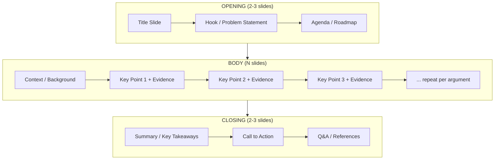
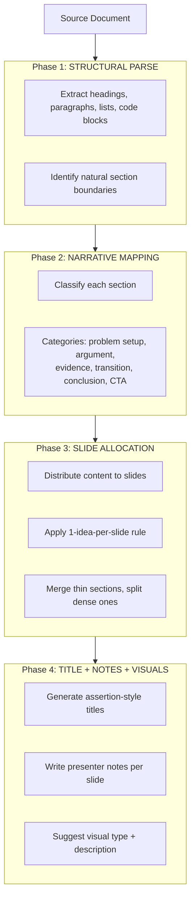
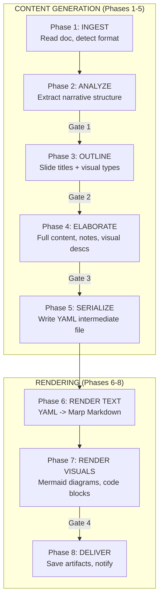
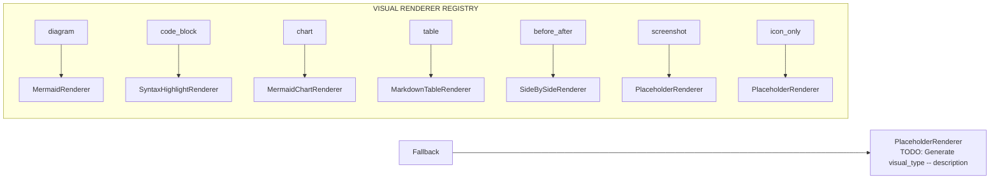

# Presentation Generator Agent — Strategy & Design

**Created**: 2026-03-14
**Purpose**: Strategic foundation for building an agentic process (Claude SDK) that transforms research documents or technical blog posts (~1200 words) into 10-20 minute slide decks with presenter notes.

---

## 1. Presentation Design Strategy

### 1.1 Slides-Per-Minute Rule of Thumb

Industry-standard guidelines converge on:

| Pace | Slides/Minute | 10-min Talk | 15-min Talk | 20-min Talk |
|------|--------------|-------------|-------------|-------------|
| **Dense/technical** | 0.5-0.75 | 5-8 | 8-11 | 10-15 |
| **Moderate (recommended)** | 1.0 | 10 | 15 | 20 |
| **Fast/visual** | 1.5-2.0 | 15-20 | 22-30 | 30-40 |

**Recommended default**: ~1 slide per minute for technical presentations. A 1200-word article -> 15-minute talk -> **12-15 content slides** + 3-4 structural slides (title, agenda, Q&A, references) = **15-19 total slides**.

The "1 slide per minute" heuristic works because:
- Each slide needs ~45-60 seconds to present its point
- Audience cognitive load: one idea per slide, one minute to absorb
- Leaves breathing room for transitions and emphasis

### 1.2 Standard Presentation Structure

Technical presentations follow a well-established arc:



**Structural formula**: `Total = 2-3 (opening) + N (body) + 2-3 (closing)`

For a 15-slide deck: 2 opening + 9-10 body + 3 closing

### 1.3 Narrative Arc Decomposition

The core algorithmic challenge: given ~1200 words of prose, extract the **argumentative spine** and map it to slides.

**Approach: Hierarchical Narrative Extraction**



### 1.4 Slide Titles: Philosophy

Good slide titles are **assertions, not topics**:

| Topic Title (weak) | Assertion Title (strong) |
|---------------------|--------------------------|
| "Background" | "Current Tools Miss 40% of Edge Cases" |
| "Our Approach" | "Three-Layer Cache Eliminates Cold Starts" |
| "Results" | "Latency Dropped 3x With Zero Code Changes" |
| "Future Work" | "Next: Extending to Multi-Region Deployments" |

The LLM generates **assertion-style titles by default**, with user ability to toggle to topic-style.

### 1.5 Presenter Notes: What They Should Contain

Each slide's presenter notes serve as a **speaking script**:

1. **Opening line** -- How to introduce this slide (transition from previous)
2. **Key talking points** -- 2-4 bullet points of what to say (not what's ON the slide)
3. **Timing cue** -- Approximate seconds for this slide (e.g., "~60s")
4. **Emphasis markers** -- Which point to stress, where to pause
5. **Optional: audience engagement** -- "Ask the audience...", "Show of hands..."

**Example**:
```
SLIDE 5: "Three-Layer Cache Eliminates Cold Starts"

[Transition]: "So we've seen the problem -- now let's look at what we built."

Talking Points:
- Explain the three cache layers: L1 (in-process), L2 (Redis), L3 (S3)
- Emphasize that L1 handles 80% of hits -- this is the key insight
- Walk through the diagram left-to-right
- Mention the fallback chain is automatic -- no developer config needed

[~75 seconds]
[EMPHASIZE]: The 80% L1 hit rate -- pause here, let it sink in
```

### 1.6 Visual Storytelling: When Visuals Enter the Workflow

Visuals must be **planned alongside text**, not bolted on during rendering.

**Two-touch visual planning**:

| Phase | Visual Activity | What's Produced |
|-------|----------------|-----------------|
| **Phase 3 (Outline)** | LLM proposes **visual type** per slide | `visual_type: diagram | code_block | chart | screenshot | icon_only | text_only` |
| **Phase 4 (Elaborate)** | LLM writes **visual description** per slide | Natural-language spec: "Flowchart: L1->L2->L3 with hit-rate %" |
| **Phase 6 (Render Visuals)** | Generate actual visuals from descriptions | Mermaid diagrams, code syntax highlighting, placeholder images |

**Visual type taxonomy for technical presentations**:

| Visual Type | When to Use | Rendering Approach |
|------------|-------------|-------------------|
| `diagram` | Architecture, flows, sequences | Mermaid -> SVG/PNG |
| `code_block` | Code snippets, configs, CLI output | Syntax-highlighted block |
| `chart` | Data, comparisons, trends | Mermaid/Chart.js or placeholder |
| `screenshot` | UI, tool output (user-supplied) | Placeholder + instruction |
| `icon_only` | Concept slides, transitions | Emoji or icon suggestion |
| `text_only` | Quotes, key statements, definitions | Large-text formatting |
| `before_after` | Comparisons, improvements | Side-by-side layout |
| `table` | Feature comparisons, data summaries | Rendered table |

### 1.7 Human-in-the-Loop Checkpoints

| Checkpoint | What User Reviews | Why |
|-----------|-------------------|-----|
| **Gate 1: Narrative Arc** | Section-to-arc mapping, proposed slide count | User may disagree with how the doc is segmented |
| **Gate 2: Slide Titles + Visual Types** | List of N titles in sequence + visual type per slide | The "story spine" -- titles + visuals define the presentation's rhythm |
| **Gate 3: Full Content** | Structured YAML with text, notes, visual descriptions | Last chance before rendering -- all content is reviewable as text |
| **Gate 4: Rendered Output** | Final slides (text-rendered), visual specs | User can request visual adjustments before final delivery |

Gate 2 (titles + visual types) is the most important -- if the titles tell a coherent story and the visual rhythm alternates appropriately (not 5 text-only slides in a row), the presentation will work.

---

## 2. Implementation Architecture

### 2.1 Single Orchestrator (Like Podcast Generator)

**Rationale**:
- The task is **sequential by nature**: parse -> map -> allocate -> generate -> render
- No parallelizable subtasks that benefit from separate workers
- The Podcast Generator pattern (single orchestrator, multi-phase, async) fits perfectly
- Human-in-the-loop gates are natural `await` boundaries

### 2.2 Orchestrator Phases (Content/Rendering Separation)

Content generation and rendering are separate concerns. Phases 1-5 produce a **structured intermediate file** (YAML). Phases 6-7 render that file into the target format.



**Key insight**: This separation means:
- Content can be reviewed/edited as plain text before any rendering
- Rendering can be re-run without re-generating content
- Different output formats consume the same intermediate file

### 2.3 Structured Intermediate Format (YAML)

The content phases produce a single reviewable file:

```yaml
presentation:
  title: "Three-Layer Caching: Eliminating Cold Starts at Scale"
  speaker: ""           # User fills in
  date: "2026-03-14"
  duration_minutes: 15
  source_document: "path/to/article.md"
  total_slides: 17

slides:
  - number: 1
    arc_position: "opening"
    type: "title"
    title: "Three-Layer Caching: Eliminating Cold Starts at Scale"
    subtitle: "How We Achieved 3x Latency Improvement"
    visual_type: "text_only"
    visual_description: null
    content_bullets: []
    presenter_notes:
      transition: null
      talking_points:
        - "Welcome and introduce yourself"
        - "Brief context: this talk covers our caching journey"
      timing_seconds: 30
      emphasis: null

  - number: 5
    arc_position: "body"
    type: "key_point"
    title: "Three-Layer Cache Eliminates Cold Starts"
    subtitle: null
    visual_type: "diagram"
    visual_description: >
      Flowchart showing three cache layers in sequence:
      L1 (in-process, 80% hit rate) -> L2 (Redis, 15%) -> L3 (S3, 5%).
      Each layer labeled with hit-rate percentage.
      Arrow from "Request" enters L1, misses cascade right.
    content_bullets:
      - "L1: In-process cache -- handles 80% of requests"
      - "L2: Redis cluster -- shared across instances"
      - "L3: S3 with CloudFront -- cold storage fallback"
    presenter_notes:
      transition: "So we've seen the problem -- now let's look at what we built."
      talking_points:
        - "Explain the three cache layers left-to-right"
        - "Emphasize L1 handles 80% -- this is the key insight"
        - "Mention the fallback chain is automatic"
      timing_seconds: 75
      emphasis: "The 80% L1 hit rate -- pause here, let it sink in"
```

This YAML is **the contract** between content generation and rendering.

### 2.4 Output Format Options (Phase 6)

| Format | Pros | Cons | Library |
|--------|------|------|---------|
| **Marp Markdown** | Markdown syntax -> PDF/PPTX/HTML, presenter notes built-in | Requires marp-cli for final render | `marp-cli` |
| **PPTX** | Universal, editable in PowerPoint/Slides | Requires python-pptx, harder to template | `python-pptx` |
| **reveal.js HTML** | Beautiful, web-native, presenter mode | Not editable in traditional tools | Template-based |

**MVP choice**: **Marp Markdown** -- natural bridge between YAML and multiple output formats. Natively supports presenter notes, themes, exports to PDF/PPTX/HTML.

### 2.5 Visual Rendering Pipeline (Phase 7)

| Visual Type | Rendering Strategy | Tool |
|------------|-------------------|------|
| `diagram` | Generate Mermaid code from `visual_description` | LLM -> Mermaid syntax -> mermaid-cli -> SVG |
| `code_block` | Extract from source doc or generate | Syntax highlighting (built into Marp) |
| `chart` | Generate from description | Mermaid chart syntax or placeholder |
| `table` | Structure from content | Markdown table (built into Marp) |
| `before_after` | Side-by-side layout | Marp column CSS |
| `screenshot` / `icon_only` | Placeholder with instruction | `[TODO: Insert screenshot of X]` |

**Key insight**: Many "visuals" in technical talks are **Mermaid diagrams** or **code blocks** -- both of which an LLM can generate from natural-language descriptions without image generation APIs.

### 2.6 Existing Patterns to Reuse

| Component | Reuse From | Path |
|-----------|-----------|------|
| Job base class | `AgenticJobBase` | `src/cosa/agents/agentic_job_base.py` |
| Job structure | Podcast Generator | `src/cosa/agents/podcast_generator/job.py` |
| Orchestrator pattern | Podcast Generator | `src/cosa/agents/podcast_generator/orchestrator.py` |
| Voice I/O + notifications | Podcast Generator | `voice_io.py`, `cosa_interface.py` |
| Chaining (DR -> Presentation) | Deep Research to Podcast | `src/cosa/agents/deep_research_to_podcast/` |
| CJ Flow packaging | Guide doc | `src/rnd/2026.02.12-cj-flow-bounded-job-packaging-guide.md` |

---

## 3. Theme & Branding Architecture

### 3.1 Layered Theme Cascade

```
Config Manager (INI)           -> selects default theme name
    |
Theme Template (YAML file)     -> defines full theme palette
    |
Presentation Overrides (YAML)  -> per-presentation tweaks
```

### 3.2 Theme File Structure

```yaml
theme:
  name: "deepily-brand"
  description: "Deepily corporate branding"
  marp_theme: "default"
  marp_class: "invert"

  colors:
    primary: "#2563EB"
    secondary: "#1E40AF"
    accent: "#F59E0B"
    background: "#FFFFFF"
    text: "#1F2937"
    code_background: "#F3F4F6"

  fonts:
    heading: "Inter"
    body: "Inter"
    code: "JetBrains Mono"

  layout:
    title_alignment: "center"
    bullet_style: "dash"
    code_block_theme: "github"

  branding:
    logo_path: null
    logo_position: "bottom-right"
    footer_text: null
    watermark: null
```

### 3.3 Theme Template Directory

```
src/cosa/agents/presentation_generator/
    templates/
        themes/
            default.yaml         # Ships with the agent
            deepily-brand.yaml   # Custom branded theme
            academic.yaml        # Academic conference style
            minimal-dark.yaml    # Dark mode minimal
```

---

## 4. Pluggable Visual Rendering Pipeline

### 4.1 Visual Renderer Registry



### 4.2 Renderer Protocol

```python
class VisualRenderer( ABC ):
    """
    Protocol for pluggable visual rendering backends.

    Requires:
        - visual_description is a non-empty string
        - output_dir exists and is writable

    Ensures:
        - Returns path to generated visual file (SVG, PNG, MP4, etc.)
        - Returns None if rendering fails (graceful degradation)
    """
    SUPPORTED_TYPES: ClassVar[ List[ str ] ]

    @abstractmethod
    async def render( self, visual_description: str, output_dir: str, **kwargs ) -> Optional[ str ]:
        """Generate visual from natural-language description. Returns file path."""
        ...
```

### 4.3 Registry Configuration (INI)

```ini
[Lupin: Baseline]
presentation generator visual renderer diagram = mermaid
presentation generator visual renderer chart = mermaid
presentation generator visual renderer infographic = placeholder
presentation generator visual renderer hero image = placeholder
```

### 4.4 MVP vs. Future Renderers

| Renderer | MVP | Future | Notes |
|----------|-----|--------|-------|
| `MermaidRenderer` | Yes | | LLM generates Mermaid from description |
| `SyntaxHighlightRenderer` | Yes | | Built into Marp |
| `MarkdownTableRenderer` | Yes | | Built into Marp |
| `PlaceholderRenderer` | Yes | | Fallback for unsupported types |
| `NanoBananaRenderer` | | Yes | AI infographic generation |
| `GoogleImageGenRenderer` | | Yes | Title/hero image generation |
| `GoogleVideoGenRenderer` | | Yes | 8-second process animation clips |

---

## 5. Decisions Summary

| Question | Decision |
|----------|----------|
| **Architecture** | Single orchestrator (Podcast Generator pattern) |
| **Intermediate format** | YAML -- structured, machine-parseable |
| **Output format (MVP)** | Marp Markdown -> PDF/PPTX/HTML |
| **Visual rendering (MVP)** | Mermaid + built-in Marp renderers |
| **Visual pipeline** | Pluggable registry, extensible for future AI generators |
| **Theme system** | Layered cascade: INI -> Theme YAML -> Presentation overrides |
| **Chaining** | Yes -- build `deep_research_to_presentation` bridge |
| **Code blocks** | Slides only, NOT in presenter notes |
| **Slide titles** | Assertion-style by default, topic-style toggle |
| **MVP scope** | Content generation (Phases 1-5) first, rendering (Phases 6-8) second |
| **Human gates** | 4 checkpoints: narrative arc, titles+visuals, full content, rendered output |

---

## 6. Verification Plan

### MVP-1 Verification (Content Generation)
1. Feed a ~1200-word technical blog post through the pipeline
2. Verify narrative arc extraction produces sensible section classifications
3. Verify slide count falls within the 1-slide-per-minute guideline
4. Verify slide titles read as a coherent story when listed in sequence
5. Verify presenter notes contain transition lines, talking points, and timing cues
6. Verify YAML output is valid and complete
7. Dry-run mode for testing without API costs

### MVP-2 Verification (Text Rendering)
1. Feed MVP-1 YAML through Marp renderer
2. Verify theme application (colors, fonts, layout)
3. Verify presenter notes appear in Marp presenter view
4. Export to PDF and PPTX, verify formatting

### MVP-3 Verification (Visual Rendering)
1. Verify Mermaid diagrams generate from visual descriptions
2. Verify code blocks syntax-highlight correctly
3. Verify placeholder renderer produces clear TODO markers
4. Verify visual registry routes types to correct renderers
