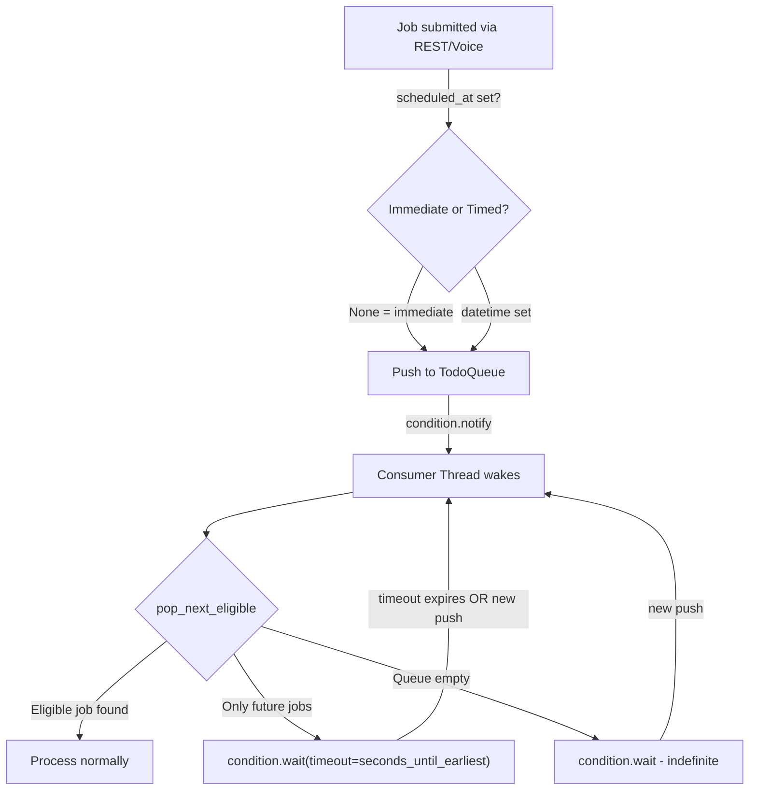
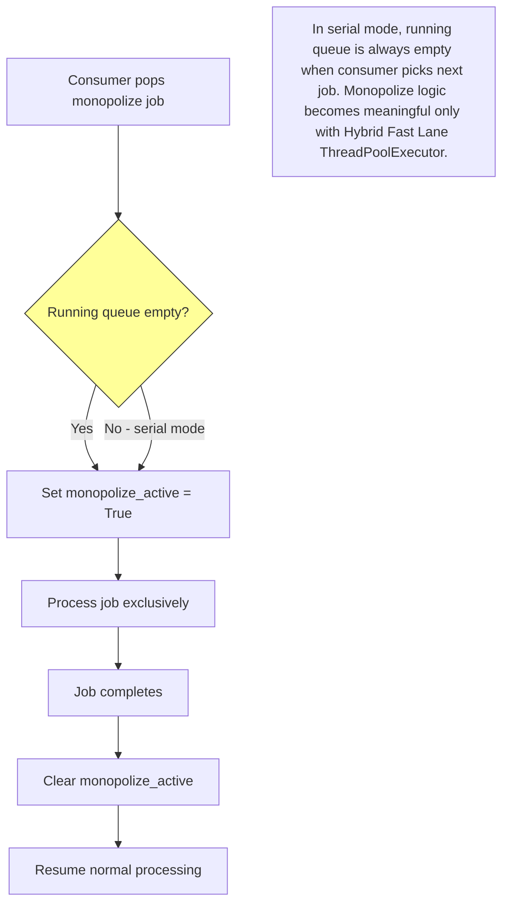
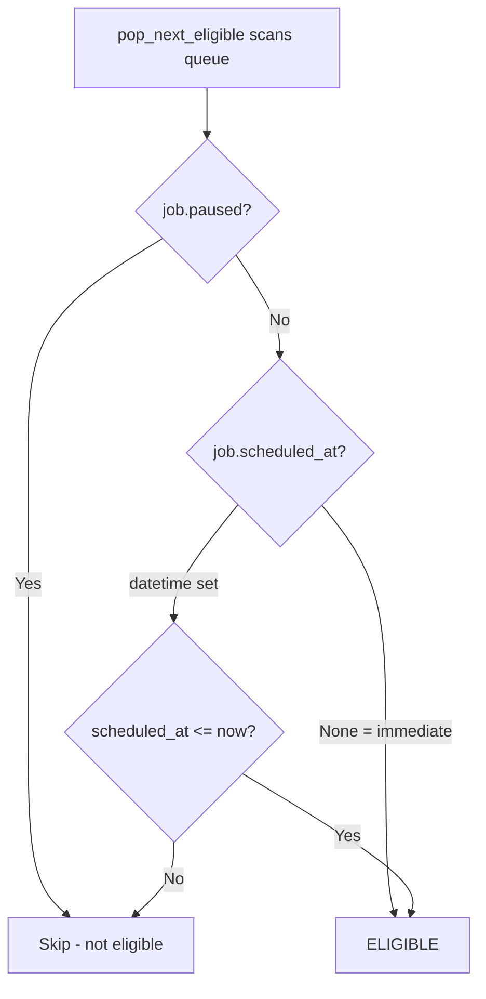
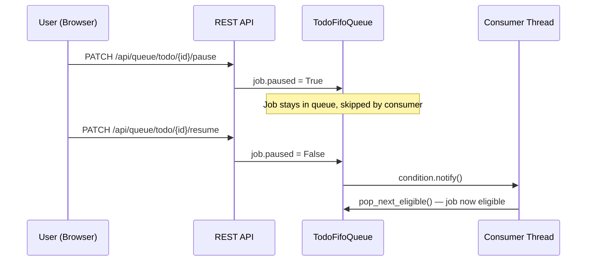

# CJ Flow: Timed Execution + Monopolize + Pause/Resume

**Status**: COMPLETE — All phases done (0-7)
**Session**: 381
**Date**: 2026-03-27
**Serialized from plan**: `bubbly-scribbling-taco.md`

---

## Context

CJ Flow currently processes all jobs FIFO — first in, first out, no exceptions. Three real-world needs are unmet:

1. **Timed execution**: Some jobs (E2E tests, overnight batch work) should run at a specific future datetime, not immediately. Currently impossible — every job runs as soon as the consumer picks it up.

2. **Monopolize flag**: Integration and E2E test jobs toggle databases, hot-swap config blocks, saturate auth endpoints with 429s, etc. These jobs are fundamentally incompatible with any concurrent work. When the Hybrid Fast Lane (ThreadPoolExecutor) is added later, a monopolize job must prevent all other processing until it completes.

3. **Pause/Resume**: Users need manual control to temporarily hold a queued job without deleting it. A paused job in the todo queue gets skipped by the consumer until resumed. Enables queue management (deprioritize a job, hold overnight work, etc.) with a natural play/pause UI pattern on each job card.

**Sequencing**: These features precede the Hybrid Fast Lane plan (`src/rnd/2026.02.19-approach-c-hybrid-queue-architecture.md`). The monopolize flag is effectively a no-op in today's serial architecture but must be wired in now so the pool dispatcher respects it from day one.

**Scope boundary**: Pause/resume applies to **todo queue jobs only**. Running-job pause (freezing mid-execution) requires cooperative checkpoints in every job's `_execute()` — that's a separate, harder problem deferred to a future plan.

**Pattern**: Feature Development (Pattern 3) — well-scoped, ~1-2 weeks, no dedicated docs beyond this plan.

**Relationship to Hybrid Fast Lane**: This is a standalone prerequisite plan (Plan A). After implementation, the existing Hybrid Fast Lane plan (`src/rnd/2026.02.19-approach-c-hybrid-queue-architecture.md`) gets a freshness review against the new consumer loop and queue methods, then becomes Plan B with updates for monopolize enforcement in the pool and pause-awareness in the dispatcher.

---

## Architecture

### Timed Execution Flow



### Monopolize Flow (Future-Ready)



### Eligibility Logic (Unified)



A job is eligible when: `not paused AND (scheduled_at is None OR scheduled_at <= now)`.
Paused overrides everything — a paused timed job stays paused even after its scheduled time arrives.

### Pause/Resume UI Flow



---

## Key Design Decisions

1. **No separate scheduler thread** — The existing `condition.wait(timeout=...)` handles timed wake-ups. When only future jobs exist, consumer sleeps until the earliest `scheduled_at`. New pushes wake it via `condition.notify()` (already wired at `todo_fifo_queue.py:1153`).

2. **`pop_next_eligible()` replaces `pop()`** in the consumer loop — Scans queue for first job where `paused is False` AND (`scheduled_at is None` OR `scheduled_at <= now()`). Non-eligible jobs stay in queue.

3. **`scheduled_at` is ISO datetime string** (local time, naive) — Supports overnight scheduling (e.g., "2026-03-28T02:00:00"). `None` = immediate (default, backward-compatible).

4. **Monopolize is a protocol field, enforced by consumer** — Today it's a no-op in serial mode. When Hybrid Fast Lane adds the pool, the consumer will wait for `running_queue` to drain before processing a monopolize job.

5. **`delete_by_id_hash()` must notify consumer** — If a timed job is deleted while the consumer is sleeping until its `scheduled_at`, the consumer needs to wake and recalculate.

6. **Pause applies to todo queue only** — Running-job pause (freezing `_execute()` mid-flight) requires cooperative checkpoints in every job subclass. That's a separate feature. This plan covers todo-queue pause only — the consumer simply skips paused jobs.

7. **Pause overrides schedule** — A paused timed job stays paused even after its `scheduled_at` passes. Resume makes it immediately eligible (if `scheduled_at` is in the past).

8. **`earliest_scheduled_at()` ignores paused jobs** — A paused timed job should not affect the consumer's wake-up timer.

---

## Phase-by-Step Progress Tracking

### Phase 0: Plan Serialization — DONE

- [x] Serialized to `src/rnd/2026.03.27-cj-flow-timed-execution-monopolize-pause.md`
- [x] Added entry to `src/rnd/README.md`
- [x] User confirmed before coding

### Phase 1: Protocol + Data Model — DONE

- [x] **1.1** `queue_protocol.py` — added `scheduled_at`, `monopolize`, `paused` to protocol + MockJob
- [x] **1.2** `agentic_job_base.py` — 3 new constructor params + instance vars
- [x] **1.3** `agent_base.py` — 3 default attrs after status tracking block
- [x] **1.4** `solution_snapshot.py` — 3 default attrs after status tracking block
- [x] **1.5** Fixed `test_fifo_queue_filtering.py` MockJob (missing new protocol fields)
- [x] **1.5** Regression: 2316 passed (1 pre-existing MCP timeout, 1 pre-existing websocket_emission)

### Phase 2: Queue + Consumer Redesign — DONE

- [x] **2.1** `fifo_queue.py` — added `pop_next_eligible()` and `earliest_scheduled_at()`, imported `datetime`
- [x] **2.2** `todo_fifo_queue.py` — `delete_by_id_hash()` override with `condition.notify()`
- [x] **2.3** `queue_consumer.py` — full rewrite: `pop_next_eligible()` + dynamic timeout + monopolize placeholder + all-paused guard
- [x] **2.4** Regression: 28 queue tests pass, consumer smoke test passes

### Phase 3: REST API + Config — DONE (except docs)

- [x] **3.1** 5 routers updated with `scheduled_at` + `monopolize` request fields and pass-through
- [x] **3.2** Skipped — routers set attrs directly after factory creation, factory pass-through not needed
- [x] **3.3** Pause/resume endpoints added to `queues.py`
- [x] **3.4** Config keys added to `lupin-app.ini` + `lupin-app-splainer.ini`
- [x] **3.5** Queue GET serialization updated with `scheduled_at`, `monopolize`, `paused`
- [x] **3.6** Job persistence `rich_fields` updated with `scheduled_at`, `monopolize`
- [x] **3.7** `src/docs/websocket-events.md` — add `job_paused`, `job_resumed` event entries (Session 382)
- [x] **3.8** MockAgenticJob constructor updated with scheduling params
- [x] **3.9** Reset-queues: clear all (reset means reset), no special handling for scheduled jobs
- [x] **3.10** Smoke test agentic endpoint with `scheduled_at` — covered by UI form submission + E2E tests (Session 383)

### Phase 4: Unit Tests — DONE

- [x] **4.1** `test_timed_execution.py` — 15 tests, all pass
- [x] **4.2** `test_consumer_timed.py` — 10 tests, all pass
- [x] **4.3** Protocol compliance tests — intentionally deferred: verified by 25 unit + 14 E2E tests
- [x] **4.4** Full regression: 2338 passed, 0 regressions from our changes

### Phase 5: Notifications UI + WebSocket Integration — DONE (Session 382)

- [x] **5.1** Add `"job_paused"`, `"job_resumed"` to JS `subscribed_events` array
- [x] **5.2** Add JS event handlers for `job_paused` / `job_resumed` (`handleJobPauseStateChange()`)
- [x] **5.3** Add paused/scheduled/monopolize visual states to `renderJobCard()`
- [x] **5.4** Add pause/resume toggle button to todo job cards (`toggleJobPause()`)
- [x] **5.5** Add CSS for `.job-paused`, `.paused-badge`, `.scheduled-badge`, `.monopolize-badge`, `.job-pause-button`
- [x] **5.6** Wire pause/resume endpoints to emit WebSocket events
- [x] **5.7** Fix: Added `scheduled_at`, `monopolize`, `paused` to push metadata in `todo_fifo_queue.py`
- [x] **5.8** 12 new E2E Playwright tests — all pass

### Phase 6: Documentation + Session End — DONE (Session 382-383)

- [x] **6.1** `src/docs/websocket-events.md` — event docs (event count 20→22)
- [x] **6.2** Update history.md, TODO.md
- [x] **6.3** Live server demo — covered by UI scheduling forms + 14 E2E Playwright tests (Session 383)

### Phase 7: UI Forms + Voice Scheduling — DONE (Session 383)

- [x] **7.1** HTML: scheduling section (checkbox + datetime picker + exclusive mode) added to 5 submission forms
- [x] **7.2** CSS: `.schedule-section` styles for datetime input + focus state
- [x] **7.3** JS: `_getSchedulingParams()` helper + wired into all 5 submit functions
- [x] **7.4** `ClaudeCodeQueueRequest`: added `scheduled_at` + `monopolize` fields + pass-through
- [x] **7.5** Expeditor: runtime scheduling section in confirmation summary
- [x] **7.6** Expeditor: `scheduled_at`, `monopolize` added to modification parser valid args
- [x] **7.7** `_handle_agentic_command()`: runtime arg extraction + normalization + job mutation
- [x] **7.8** Skill docs: SKILL.md + canonical workflow doc updated with runtime scheduling
- [x] **7.9** 12 new unit tests (147 total expeditor tests), 2542 full suite pass
- [x] **7.10** Plan serialized: `src/rnd/v0.1.6/2026.03.30-cj-flow-scheduling-ui-and-voice-runtime-args.md`

---

## Architectural Note: State Machine Deferral

### Observation: Fragmented State Tracking

The current system tracks job state across three overlapping dimensions:

| Dimension | Values | Location |
|-----------|--------|----------|
| `status` field | `pending`, `running`, `completed`, `cancelled`, `failed` | Job object + PostgreSQL `status` column |
| Queue position | `todo`, `run`, `done`, `dead` | Which FifoQueue instance holds the job |
| `paused` flag | `True`/`False` | Job object (runtime only, not persisted) |

These overlap — e.g., "running" status + "run" queue is redundant. A job could have `status=running` but be logically paused. Adding more boolean flags (future: `suspended`, `waiting_for_dependency`, etc.) will compound the fragmentation.

### Proposed: Unified `job_state` (Pre-Hybrid Fast Lane)

A dedicated refactor to replace `status` + queue position + flags with a single `job_state`:

```
pending → queued → scheduled → running → paused → running → completed
                                       → cancelled
                             → failed
```

This touches **15+ files**: QueueableJob protocol, all 7 job type constructors, consumer loop, RunningFifoQueue, persistence layer, REST routers, and the notifications UI. It is a dedicated preparatory effort for the Hybrid Fast Lane, not something to bolt onto this feature.

### Current Decision (This Plan)

- **`scheduled_at`** and **`monopolize`**: Persisted in JSONB `metadata_json` — they are submission-time attributes with historical value.
- **`paused`**: **Runtime flag only, NOT persisted**. The todo queue is in-memory; paused state has no historical value. When the state machine refactor happens, `paused` becomes a first-class state in the unified `job_state` column.
- Schema changes are welcome when needed — no backward compatibility constraints at this stage.

---

## Critical Files Summary

| File | Phase | Change | Repo |
|------|-------|--------|------|
| `src/cosa/rest/queue_protocol.py` | 1 | Add 3 protocol fields | CoSA |
| `src/cosa/agents/agentic_job_base.py` | 1 | Add 3 constructor params | CoSA |
| `src/cosa/agents/agent_base.py` | 1 | Add 3 default attrs | CoSA |
| `src/cosa/memory/solution_snapshot.py` | 1 | Add 3 default attrs | CoSA |
| `src/cosa/rest/fifo_queue.py` | 2 | Add `pop_next_eligible()`, `earliest_scheduled_at()` | CoSA |
| `src/cosa/rest/todo_fifo_queue.py` | 2 | Override `delete_by_id_hash()` with notify | CoSA |
| `src/cosa/rest/queue_consumer.py` | 2 | Rewrite consumer loop | CoSA |
| `src/cosa/rest/routers/deep_research.py` | 3 | Add request fields | CoSA |
| `src/cosa/rest/routers/podcast_generator.py` | 3 | Add request fields | CoSA |
| `src/cosa/rest/routers/presentation_generator.py` | 3 | Add request fields | CoSA |
| `src/cosa/rest/routers/swe_team.py` | 3 | Add request fields | CoSA |
| `src/cosa/rest/routers/mock_job.py` | 3 | Add request fields | CoSA |
| `src/cosa/rest/routers/queues.py` | 3 | Add pause/resume endpoints + update GET serialization | CoSA |
| `src/cosa/rest/job_persistence.py` | 3 | Add fields to `_build_metadata_json()` rich_fields | CoSA |
| `src/cosa/agents/test_harness/mock_job.py` | 3 | Add scheduling params to constructor | CoSA |
| `src/conf/lupin-app.ini` | 3 | Add 2 config keys + 2 WS events | Lupin |
| `src/conf/lupin-app-splainer.ini` | 3 | Add explanations | Lupin |
| `src/docs/websocket-events.md` | 5 | Add job_paused, job_resumed event docs | Lupin |
| `src/tests/unit/test_timed_execution.py` | 4 | NEW — 15 tests | Lupin |
| `src/tests/unit/test_consumer_timed.py` | 4 | NEW — 10 tests | Lupin |
| `src/fastapi_app/static/js/notifications.js` | 5 | Add subscriptions + handlers + card UI | Lupin |
| `src/fastapi_app/static/css/notifications.css` | 5 | Add paused/scheduled visual states | Lupin |

## What Does NOT Change

- `QueueableJob.do_all()` — execution method unchanged
- `RunningFifoQueue._process_job()` — type-based routing unchanged
- `TodoFifoQueue.push_job()` — voice path classification unchanged
- PostgreSQL `job_history` table schema — new fields stored in existing JSONB `metadata_json` column
- `SolutionSnapshot.get_copy()` — uses `copy.copy()` which automatically copies new instance attrs
