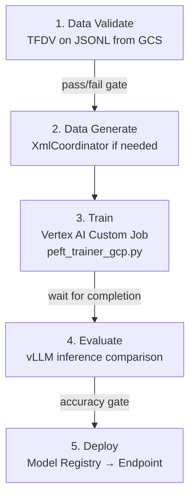

# Thought Experiment: Standalone GCP PEFT/LoRA Training Pipeline

## Context

The Lupin project has a mature local PEFT/LoRA training pipeline (in `src/cosa/training/`) for fine-tuning 3-8B parameter LLMs for agentic intent classification. This plan creates a **standalone parallel implementation** with `-gcp` suffixed files in a dedicated `gcp/` subdirectory that can run on Google Cloud Platform without disrupting the local workflow.

**Guiding principles**:
- GCP-specific Python files live in `src/cosa/training/gcp/` subdirectory (not flat alongside local files)
- Docker and script files use `-gcp` suffix
- The existing pipeline remains untouched
- Thin wrapper (subclass) for `peft_trainer_gcp.py`
- Training data lives in GCS (continuously updated)
- HuggingFace token in Secret Manager

**Two-phase approach**:
- **Phase 1**: Get the model trained on GCP (containerize, run, get artifacts)
- **Phase 2**: Full MLOps with Vertex AI services (pipelines, monitoring, experiments, serving)

---

## Inventory: What Exists Today

### Bash Driver
- **`src/scripts/run-agentic-intent-training.sh`** — Entry point with 5 modes (test/full/generate/validate/dry-run), 3 model targets, quantization options

### Core Python (`src/cosa/training/`)
| File | Size | Role |
|------|------|------|
| `peft_trainer.py` | 129 KB (~2909 lines) | Main trainer — 6-stage pipeline |
| `quantizer.py` | 21 KB | AutoRound 4-bit/8-bit GPTQ quantization |
| `xml_coordinator.py` | 64 KB | Synthetic training data generation |
| `xml_prompt_generator.py` | 32 KB | Template expansion |
| `xml_response_validator.py` | 11 KB | Model output validation |
| `hf_downloader.py` | 2.6 KB | HuggingFace model download |

### Model Configs (`src/cosa/training/conf/`)
- `ministral_8b.py`, `qwen3_4b.py`, `llama_3_2_3b.py`, `phi_4_mini.py`, `mistral_7b.py`

### Docker
- **`docker/peft/Dockerfile`** — Existing but outdated (unpinned deps, no vLLM, no cosa COPY)

### Training Data (`src/ephemera/prompts/data/`)
- 3 JSONL files (~230 MB): train (186 MB), test (23 MB), validate (23 MB)
- ~70 placeholder/synthetic data `.txt` files
- 5 command definition JSONs in `src/conf/training/`

### Existing GCS Utilities
- **`src/cosa/utils/util_gcs.py`** — Already provides `write_text_to_gcs()`, `read_text_from_gcs()`, `_parse_gcs_uri()` with graceful `GCS_AVAILABLE` check. All GCP file operations should build on this.

### GCP Project
- GCP project already exists with billing enabled
- **Artifact Registry**: Not yet created — recommended default:
  - **Repository name**: `lupin-router-ml`
  - **Region**: `us-central1`
  - **Format**: Docker
  - **Full path**: `us-central1-docker.pkg.dev/{PROJECT_ID}/lupin-router-ml/`
  - **Why `lupin-router-ml`**: Scoped to the intent router ML workloads (training + serving images)

---

# PHASE 1: Get the Model Trained on GCP

**Goal**: Containerize the training pipeline, run it on Vertex AI, get model artifacts into GCS.

## New Files to Create

### 1. `docker/peft/Dockerfile-gcp`
**Purpose**: GCP-optimized container with pinned versions, vLLM included, cosa package copied in.

**Key differences from existing `docker/peft/Dockerfile`**:
- Base image: `nvidia/cuda:12.4.1-devel-ubuntu22.04` (upgraded from 12.2.2)
- All package versions pinned (no `git+https://github.com/...` installs)
- **vLLM included** (missing from current Dockerfile, required for validation stages)
- **COPY cosa package** into container at `/app/lupin/src/cosa/`
- **COPY conf/training/** JSON files and placeholder `.txt` files (templates are code, not data)
- Training data NOT baked in (lives in GCS, mounted via FUSE or downloaded at job start)
- `ENTRYPOINT ["python", "-m", "cosa.training.gcp.peft_trainer_gcp"]`
- No jupyterlab, wandb, or other dev-only packages
- Sets default env vars: `NCCL_P2P_DISABLE=1`, `NCCL_IB_DISABLE=1`
- Installs `google-cloud-secret-manager` SDK for HF token retrieval

### 2. `src/scripts/run-agentic-intent-training-gcp.sh`
**Purpose**: GCP-specific bash driver that replaces local path assumptions.

**Key differences from existing `run-agentic-intent-training.sh`**:

| Aspect | Local Script | GCP Script |
|--------|-------------|------------|
| `LORA_DIR` | `$DEEPILY_PROJECTS_DIR/models/...` | `/gcs/lupin-model-artifacts/runs/...` |
| Post-training | `source ~/.lora_env` | `gsutil rsync` artifacts to GCS |
| Model paths | Local filesystem | GCS-mounted or container-internal |
| Modes | test/full/generate/validate/dry-run | Same 5 + **`submit`** (Vertex AI job) |
| Trainer module | `cosa.training.peft_trainer` | `cosa.training.gcp.peft_trainer_gcp` |

**New `submit` mode**: Wraps the training invocation in a `gcloud ai custom-jobs create` call with appropriate GPU selection per model.

### 3. `src/cosa/training/gcp/__init__.py`
**Purpose**: Package marker for the GCP subdirectory.

### 4. `src/cosa/training/gcp/peft_trainer_gcp.py`
**Purpose**: Thin subclass of `PeftTrainer` with GCP-specific overrides.

**What it overrides** (~30 lines of actual changes):

| Method | Line in Original | Change |
|--------|-----------------|--------|
| `_start_vllm_server()` | 1931 | Remove `cd vllm-pip; source .venv/bin/activate` — vLLM installed directly in container |
| `vllm_base_url` | 2308, 2354 | `192.168.1.21:3000` → `localhost:3000` |
| `check_privileges()` | 2447 | No-op (fresh VM per job, no sudo needed) |
| `release_gpus()` | 131 | Simplified: `del model; gc.collect(); torch.cuda.empty_cache()` only (no nvidia-smi reset) |
| `_update_lora_env()` | — | No-op (irrelevant on GCP) |
| `set_hf_env_vars()` | — | Retrieve HF token from Secret Manager |
| CLI `__main__` | 2885+ | GCP-specific defaults, adds `--gcs-output-path` arg |

**What it inherits unchanged**: All core training logic — `fine_tune()`, `load_and_merge_adapter()`, `save_merged_adapter()`, `quantize_merged_adapter()`, `run_pipeline()`, all model config loading, all data loading.

### 5. `docker/peft/build-and-push-gcp.sh`
**Purpose**: Build the Docker image and push to Artifact Registry.

```bash
#!/bin/bash
PROJECT_ID="${GCP_PROJECT_ID:?Set GCP_PROJECT_ID}"
REGION="${GCP_REGION:-us-central1}"
REPO="lupin-router-ml"
IMAGE="${REGION}-docker.pkg.dev/${PROJECT_ID}/${REPO}/peft-trainer-gcp:${1:-latest}"

# Create Artifact Registry repo if it doesn't exist
gcloud artifacts repositories describe ${REPO} \
  --location=${REGION} 2>/dev/null || \
gcloud artifacts repositories create ${REPO} \
  --repository-format=docker \
  --location=${REGION} \
  --description="Lupin ML training and serving images"

gcloud builds submit --tag "${IMAGE}" -f docker/peft/Dockerfile-gcp .
```

## Files That Do NOT Need GCP Variants

| File | Why It's Reusable As-Is |
|------|------------------------|
| `conf/ministral_8b.py` (+ all model configs) | Pure data dicts, no filesystem deps |
| `conf/model_config_loader.py` | Pure Python imports |
| `quantizer.py` | Path-parameterized, no hardcoded paths |
| `xml_coordinator.py` | Data generation, path-parameterized |
| `xml_prompt_generator.py` | Template logic only |
| `xml_response_validator.py` | Validation logic only |
| `hf_downloader.py` | HF Hub download, works anywhere |
| `utils/util_gcs.py` | Already exists, already GCP-native |

## GPU Selection & Cost (Phase 1 — Training)

| Model | GCP GPU | Spot $/hr | Est. Hours | Spot Cost |
|-------|---------|-----------|------------|-----------|
| Qwen3-4B | 1x L4 (24 GB) | ~$0.21 | ~1.5 | ~$0.32 |
| Llama-3.2-3B | 1x L4 (24 GB) | ~$0.21 | ~1.0 | ~$0.21 |
| Phi-4-mini | 1x L4 (24 GB) | ~$0.21 | ~1.0 | ~$0.21 |
| Ministral-8B | 1x A100-40GB | ~$1.10 | ~2.5 | ~$2.75 |
| Mistral-7B | 1x A100-40GB | ~$1.10 | ~2.0 | ~$2.20 |

**Total all 5 models (Spot)**: ~$5.69 | **On-demand**: ~$18.97

### vllm_config Tuning for A100

Current values were tuned for 24 GB RTX 4090. On 40 GB A100, these should be adjusted at runtime in the GCP trainer (not in model configs — those stay local-optimized):

| Parameter | RTX 4090 (24 GB) | A100 (40 GB) |
|-----------|-------------------|--------------|
| `gpu_memory_utilization` | 0.70-0.80 | 0.85-0.90 |
| `max_num_seqs` | 64 | 128-256 |
| `max_model_len` | 1024 | 1024 (unchanged) |

The GCP trainer overrides these via runtime detection: if `torch.cuda.get_device_name()` contains "A100", bump utilization.

## GCS Bucket Structure (Phase 1)

```
gs://lupin-training-data/
  voice-commands-xml-train.jsonl
  voice-commands-xml-test.jsonl
  voice-commands-xml-validate.jsonl

gs://lupin-model-artifacts/
  runs/
    {model-name}/
      {YYYY-MM-DD-HH-MM}/
        checkpoints/checkpoint-N/
        merged/
        quantized-4bit/
        quantized-8bit/
        training-results.md
```

## Phase 1 File Manifest

| New File | Based On | Purpose |
|----------|----------|---------|
| `docker/peft/Dockerfile-gcp` | `docker/peft/Dockerfile` | GCP container with pinned deps + vLLM |
| `docker/peft/build-and-push-gcp.sh` | (new) | Build + push to Artifact Registry (`lupin-router-ml`) |
| `src/scripts/run-agentic-intent-training-gcp.sh` | `run-agentic-intent-training.sh` | GCP bash driver with `submit` mode |
| `src/cosa/training/gcp/__init__.py` | (new) | Package marker |
| `src/cosa/training/gcp/peft_trainer_gcp.py` | `peft_trainer.py` | Thin subclass with GCP overrides |

**Total new files**: 5 | **Existing files modified**: 0

---

# PHASE 2: MLOps Pipeline with Vertex AI Services

**Goal**: Layer GCP-native MLOps services on top of the Phase 1 training pipeline.

**Prerequisite**: Phase 1 complete and working.

## 2A. Pipeline Orchestration (TFDV → Transform → Train → Evaluate → Deploy)

### Approach: Python Orchestrator Script (not Kubeflow)

Kubeflow DSL adds complexity unjustified for a single-developer project. Instead: a Python orchestrator that sequences Vertex AI SDK calls.



**TFDV validation focuses on**:
- **Command distribution** across ~20 agent categories
- **Input word count distribution** — detect prompt length drift
- **Output XML validity** — ensure training labels are well-formed
- **Schema enforcement** — required fields: instruction, input, output, command, prompt

### New File: `src/cosa/training/gcp/pipeline_orchestrator_gcp.py`
### New File: `src/cosa/training/gcp/data_validator_gcp.py`

## 2B. Deploy to Vertex AI Prediction Endpoint

### Approach: Cloud Run with GPU (Recommended for Intent Routing)

The key insight: the intent classifier serves the FastAPI application directly. **Cloud Run with a smaller GPU** is ideal because:
- The GPU lives on the **same virtual hardware** as the FastAPI app — no network hop for inference
- Scale-to-zero when idle (~$0 idle cost)
- Smaller GPUs (T4, L4) are more than sufficient for GPTQ-quantized inference
- Cold start (40-110s) is acceptable for a service that stays warm under normal traffic

| Option | GPU | Idle Cost | Inference Latency | Best For |
|--------|-----|-----------|-------------------|----------|
| **Cloud Run + T4** | T4 (16 GB) | ~$0 | ~50-200ms | **Development + light production** |
| **Cloud Run + L4** | L4 (24 GB) | ~$0 | ~30-100ms | **Production** |
| Always-on Vertex AI endpoint (L4) | L4 (24 GB) | ~$504/mo | ~30-100ms | High-traffic production |
| Always-on Vertex AI endpoint (T4) | T4 (16 GB) | ~$252/mo | ~50-200ms | Budget always-on |

**Recommendation**: **Cloud Run + T4** for development, **Cloud Run + L4** for production. The GPTQ-quantized 4-8B models fit comfortably in T4's 16 GB VRAM, and colocation with FastAPI eliminates the network hop that a separate Vertex AI endpoint would introduce.

### Serving Architecture: Single Container (FastAPI + vLLM)

Both the FastAPI intent routing app and vLLM model server run in the **same container** on Cloud Run. This is the simplest approach — no sidecar orchestration, no inter-service networking. The FastAPI app calls vLLM via `localhost`.

### New Files:
- `docker/peft/Dockerfile-serving-gcp` — Combined FastAPI + vLLM serving container
- `src/scripts/deploy-model-gcp.sh` — Upload model + deploy to Cloud Run

## 2C. Model Monitoring with Drift/Skew Alerting

### Approach: Monitor Output Distribution, Not Input Features

Voice command inputs are free-text that resists featurization. Monitor the **output** — categorical classification into ~20 commands.

| Metric | Alert Threshold | Why |
|--------|----------------|-----|
| Command distribution | JS divergence > 0.05 | User behavior shift |
| "none" classification rate | > 15% | Unsupported command attempts |
| Response latency (p95) | > 2s | Serving degradation |
| XML validity rate | < 95% | Output quality degradation |

### New Files:
- `src/cosa/training/gcp/monitoring_setup_gcp.py` — Configure Vertex AI Model Monitoring
- `src/cosa/training/gcp/prediction_logger_gcp.py` — Log predictions to BigQuery

## 2D. Vertex AI Experiments Tracking

### Approach: Opt-in `--track-experiment` CLI Flag

The existing pipeline already captures all needed data. The tracker is a thin adapter.

### New File: `src/cosa/training/gcp/experiment_tracker_gcp.py`

**Integration points in `peft_trainer_gcp.py`**:

| Location | What Gets Logged |
|----------|-----------------|
| After `__init__` | Hyperparams: model config, LoRA config, fine-tune config |
| After `fine_tune()` | Training metrics: loss curves from SFTTrainer |
| After each validation | Per-command accuracy, overall accuracy |
| After quantization | GCS paths to model artifacts |
| End of `run_pipeline()` | TensorBoard event upload |

**Enables cross-model comparison**:
```
Experiment: "agentic-intent-classification"
┌──────────┬──────────┬───────────┬─────────┬────────┐
│ Run      │ Model    │ LoRA r   │ Accuracy │ Cost   │
├──────────┼──────────┼───────────┼─────────┼────────┤
│ run-001  │ Mini-8B  │ 32       │ 94.2%   │ $2.75  │
│ run-002  │ Qwen-4B  │ 16       │ 91.8%   │ $0.32  │
│ run-003  │ Llama-3B │ 64       │ 89.5%   │ $0.21  │
└──────────┴──────────┴───────────┴─────────┴────────┘
```

---

## Complete File Manifest (Both Phases)

### Phase 1: Get It Trained (5 files)

| New File | Based On | Purpose |
|----------|----------|---------|
| `docker/peft/Dockerfile-gcp` | `docker/peft/Dockerfile` | GCP container with pinned deps + vLLM |
| `docker/peft/build-and-push-gcp.sh` | (new) | Build + push to Artifact Registry (`lupin-router-ml`) |
| `src/scripts/run-agentic-intent-training-gcp.sh` | `run-agentic-intent-training.sh` | GCP bash driver with `submit` mode |
| `src/cosa/training/gcp/__init__.py` | (new) | Package marker |
| `src/cosa/training/gcp/peft_trainer_gcp.py` | `peft_trainer.py` | Thin subclass with GCP overrides |

### Phase 2: MLOps Services (7 files)

| New File | Purpose | Complexity |
|----------|---------|------------|
| `src/cosa/training/gcp/pipeline_orchestrator_gcp.py` | Sequences: validate → generate → train → evaluate → deploy | Moderate |
| `src/cosa/training/gcp/data_validator_gcp.py` | TFDV validation on JSONL training data | Moderate |
| `src/cosa/training/gcp/experiment_tracker_gcp.py` | Vertex AI Experiments adapter | Simple |
| `src/cosa/training/gcp/monitoring_setup_gcp.py` | Vertex AI Model Monitoring configuration | Moderate-Complex |
| `src/cosa/training/gcp/prediction_logger_gcp.py` | Prediction logging to BigQuery | Simple |
| `docker/peft/Dockerfile-serving-gcp` | Combined FastAPI + vLLM serving container | Simple |
| `src/scripts/deploy-model-gcp.sh` | Upload model + deploy to Cloud Run | Simple |

**Total**: 12 new files | **Existing files modified**: 0

---

## Resolved Decisions

| Decision | Choice | Rationale |
|----------|--------|-----------|
| Cloud Run architecture | **Single container** (FastAPI + vLLM) | Simplicity — no sidecar orchestration, localhost calls |
| Monitoring volume | < 1000 predictions initially | Custom monitoring (BigQuery + dashboards) rather than Vertex AI Model Monitoring minimum thresholds. Upgrade when volume grows. |
| Artifact Registry | **`lupin-router-ml`** in `us-central1` | Scoped to intent router ML workloads |
| GCP Python files | `src/cosa/training/gcp/` subdirectory | Clear delineation of local vs cloud code |
| Training data storage | GCS bucket (not baked into image) | Continuously updated |
| HF token | Secret Manager | Standard GCP secrets management |
| Trainer pattern | Thin subclass of PeftTrainer | Minimal duplication, inherits improvements |

---

## Critical Files Reference

| Existing File | Why It Matters |
|---------------|---------------|
| `src/scripts/run-agentic-intent-training.sh` | Template for the GCP bash driver |
| `src/cosa/training/peft_trainer.py` | Base class for GCP subclass (lines 1931, 2308, 2354, 131, 2447) |
| `src/cosa/training/conf/ministral_8b.py` | Representative model config with vllm_config |
| `src/cosa/training/xml_response_validator.py` | XML validation logic reused by monitoring |
| `src/cosa/utils/util_gcs.py` | Existing GCS utilities to build on |
| `docker/peft/Dockerfile` | Template for GCP Dockerfile |
| `src/ephemera/prompts/data/` | Training data (~230 MB, lives in GCS) |
| `src/conf/training/` | Command definition JSONs (5 files) |
