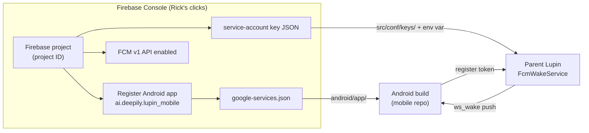

# Firebase Android Provisioning for Live FCM — Scoping Doc

**Date**: 2026-06-23
**Repo**: lupin (server side); mobile is the nested READ-ONLY repo `src/lupin-mobile`
**Purpose**: A grounded, click-by-click map of EVERYTHING needed to provision Firebase for the
lupin-mobile Android app so that live FCM (Firebase Cloud Messaging) silent-relay wake-pushes work
end-to-end. Rick has refreshed his GCP/GCB credentials and is ready to do the console pass; this doc
tells him exactly what's involved and what each console click must produce.

**Status going in**: the FCM code is **built, reviewed, merged, and green on BOTH sides** — what is
missing is purely the human console pass plus one image rebuild. The server-side `FcmWakeService`
boots **DISABLED** with one clear log line until the service-account JSON is provisioned
(`src/cosa/rest/fcm_wake_service.py:19-23`, `:151-165`).

> **Priority context (do not lose)**: per `src/lupin-mobile/src/rnd/2026.06.23-focus-mode-status-summary.md:80-86`,
> GCP/FCM is **BACK-BURNERED** below (1) task-list functionality and (2) cosa-voice token efficiency.
> This doc is the ready-to-go runbook for *when* the FCM track is picked back up — it does not
> re-prioritize it.

---

## 0. The one-paragraph mental model

FCM provisioning produces **two separate artifacts from one Firebase project**:

1. **`google-services.json`** — the *client* identity (sender ID, project ID, app ID, API key) that
   the **Android app** embeds at build time so it can mint an FCM device token.
2. **A service-account private-key JSON** — the *server* credential the **parent Lupin backend**
   (`firebase_admin` Admin SDK) uses to *send* pushes to those tokens.

The mobile app registers its minted token with the server
(`POST /api/fcm/register-token`, `src/cosa/rest/routers/fcm.py:46-84`); the server stores it durably
(`fcm_token_repository.py`); when a notification is enqueued for a user with no live mobile WebSocket,
`FcmWakeService.maybe_send_wake()` fires a content-free `ws_wake` data push to that user's tokens
(`fcm_wake_service.py:221-271`). Both artifacts trace to the **same Firebase project** — that shared
project ID is what ties client and server together.



---

## 1. The end-to-end provisioning map

Every step to provision Firebase for the lupin-mobile Android app + live FCM. Steps (a)–(f) below
map onto the OSQ-7 console runbook
(`src/lupin-mobile/src/rnd/2026.06.11-focus-mode-voice-chat/91-osq7-firebase-console-runbook.md`).

### (a) Firebase project — create or select

- Console → **Add project** (runbook 91 Part A, `91-osq7-firebase-console-runbook.md:14-20`).
- Suggested name: `lupin-mobile` — **cosmetic; the generated project ID is what matters** (note it
  down; it feeds both artifacts).
- Google Analytics: **Disable** (not needed for silent-relay; one less consent surface).
- **Decision**: new project vs reuse an existing `genie/lupin` Firebase project — see §4.

### (b) Register the Android app

- Console → project overview → **Android icon** (runbook 91 Part B, `:22-30`).
- **Android package name** must be EXACTLY `ai.deepily.lupin_mobile`. This is a **silent-failure
  trap**: a typo mints tokens fine but pushes never arrive. Confirmed source of truth:
  - `applicationId = "ai.deepily.lupin_mobile"` — `src/lupin-mobile/android/app/build.gradle.kts:29`
  - `namespace = "ai.deepily.lupin_mobile"` — `src/lupin-mobile/android/app/build.gradle.kts:9`
- **SHA-1 / SHA-256 signing certs**: **leave blank.** FCM data-only messages do NOT require a SHA
  fingerprint — SHA certs are only needed for Google Sign-In and Dynamic Links, neither of which this
  milestone uses (runbook 91 `:28-29`). Signing-config reality in the mobile repo: the release build
  currently **signs with the debug keystore** (`build.gradle.kts:37-41`, `signingConfig =
  signingConfigs.getByName("debug")` with a literal `// TODO: Add your own signing config`). So there
  is no release keystore to fingerprint yet anyway — another reason to skip SHA now (revisit only if
  Google Sign-In is ever added; see §4).

### (c) Download `google-services.json` → Android build placement

- In the same Android-app registration flow: **Download `google-services.json`** (runbook 91 `:30`).
- **Lands at**: `<lupin-mobile repo root>/android/app/google-services.json` (sibling of
  `build.gradle.kts`). Confirmed **absent today** (`ls` returned no such file).
- **SKIP the console's "Add Firebase SDK" gradle snippet** — the gradle plugin wiring is applied
  separately as part of the probe pass (see §5 and runbook 92), because applying the google-services
  gradle plugin *without* the json present hard-breaks every build
  (`92-s5-phase0-fcm-probe-runbook.md:36-44`).

### (d) Enable the Cloud Messaging API (v1)

- Console → ⚙️ **Project settings** → **Cloud Messaging** tab → confirm **Firebase Cloud Messaging
  API (V1)** = "Enabled" (usually already on for new projects). If disabled: ⋮ → Manage API in Google
  Cloud Console → **Enable** (runbook 91 Part D, `:50-55`).
- The legacy "Cloud Messaging API (Legacy)" stays **disabled** — the server uses the v1 Admin SDK
  exclusively (`fcm_wake_service.py:206-212`, `messaging.send(...)`).

### (e) Generate the SERVER service-account key

- Console → ⚙️ **Project settings** → **Service accounts** tab → confirm the auto-created
  **Firebase Admin SDK** service account is present → **Generate new private key** → confirm → a JSON
  key file downloads (runbook 91 Part C, `:39-44`).
- **Role**: the auto-created "Firebase Admin SDK" service account already carries the
  **Firebase Admin SDK Administrator Service Agent** role, which grants FCM v1 send — no extra IAM
  role assignment is needed for the default path. (If Rick instead mints a *custom* IAM service
  account, the minimum role for send is **Firebase Cloud Messaging API Admin** / the
  `cloudmessaging.messages.create` permission — but the default Admin SDK account is the simpler,
  runbook-blessed path.)

### (f) Land the server key + wire the env var

- **Recommended landing spot (host)**: `src/conf/keys/firebase-admin-key.json` (runbook 91 `:43-44`
  names this exact path). The `src/conf/keys/` tree is already the credentials home and is
  **already volume-mounted read-only** into the running container at `/var/lupin/src/conf/keys`
  (`docker-compose.yml:75` for the model server; the dev/test rest services mount the same tree —
  `docker-compose.yml:132-152`, `:215-239`, and reference keys under `/var/lupin/src/conf/keys/`).
- **CRITICAL credential-SHAPE fact**: the env var holds a **FILESYSTEM PATH to the JSON file, NOT the
  JSON content.** `fcm_wake_service.py:183-200` does `os.environ.get(self._credentials_env)` →
  `os.path.isfile(credentials_path)` → `credentials.Certificate(credentials_path)`. A raw-JSON-blob
  env value would fail the `os.path.isfile` check and the service would boot DISABLED. So the env var
  must point at the in-container path of the mounted file.
- **The env-var name** is config-driven: `fcm service account credentials env var` (default
  `FCM_SERVICE_ACCOUNT_JSON`) — `src/conf/lupin-app.ini:1016`, read at
  `fcm_wake_service.py:131`.
- **Wiring step (server-side, automatable)**: add to the rest service's `environment:` block in
  `docker-compose.yml` (alongside the existing vars at `:154-160`):
  ```yaml
  FCM_SERVICE_ACCOUNT_JSON: /var/lupin/src/conf/keys/firebase-admin-key.json
  ```
  Then `docker compose up -d --force-recreate` the rest service so the new env var + (if the file is
  freshly added) the mount are picked up. (`docker restart` alone does NOT pick up new mounts — only
  `rm -f` + `up -d` does; this is the documented preflight-drift trap in the parent CLAUDE.md.)

---

## 2. "What Rick must click" checklist (the console pass)

Mapped to runbook 91. **Total human time ≈ 10 minutes.** Everything else is AI-side or AI-scripted.

| # | Console action | Produces |
|---|---|---|
| 1 | **Add project** → name `lupin-mobile`, Analytics OFF → Create | **Project ID** (note it) |
| 2 | **Add app → Android**; package name = `ai.deepily.lupin_mobile` (EXACT); SHA fields blank; nickname `Lupin Mobile` → Register app | App registration + **Sender ID / App ID** baked into the next artifact |
| 3 | **Download `google-services.json`** (then "Next → Next → Continue to console" — SKIP the gradle snippet) | **`google-services.json`** (client identity: project ID, sender ID, app ID, API key) |
| 4 | ⚙️ Project settings → **Cloud Messaging** tab → confirm **FCM API (V1) = Enabled** | FCM v1 send capability active |
| 5 | ⚙️ Project settings → **Service accounts** tab → **Generate new private key** → confirm | **service-account key JSON** (server send credential: `client_email`, `project_id`, private key) |

After the clicks, Rick says/DMs **"Firebase done"** and the AI runs the validation checklist
(runbook 91 `:57-69`): verifies `google-services.json` `package_name == ai.deepily.lupin_mobile` and
notes the `project_id`; verifies the service-account JSON `client_email` + `project_id` parse;
confirms git-ignore hygiene; updates the S5/S6 §8 execution logs with provisioning evidence.

---

## 3. Artifact → destination table

| Artifact (produced by) | Destination | Installed how | Source citation |
|---|---|---|---|
| **`google-services.json`** (console step 3) | `src/lupin-mobile/android/app/google-services.json` (mobile repo, sibling of `build.gradle.kts`) | Drop file; do NOT commit yet (git-ignore decision recorded at validation) | runbook 91 `:31-34`; absent today (verified) |
| **service-account key JSON** (console step 5) | Host: `src/conf/keys/firebase-admin-key.json` → in-container `/var/lupin/src/conf/keys/firebase-admin-key.json` (already `:ro`-mounted) | Copy to host path; NEVER commit (treat like an API key) | runbook 91 `:43-47`; mount `docker-compose.yml:75/132-152/215-239` |
| **Env var `FCM_SERVICE_ACCOUNT_JSON`** = the in-container PATH above | `docker-compose.yml` rest-service `environment:` block | Add line, then `up -d --force-recreate` | INI key name `lupin-app.ini:1016`; read at `fcm_wake_service.py:131,183` |
| **Project ID** (console step 1) | Noted into S5 §8 + the probe send script `PROJECT = "<firebase-project-id>"` | Manual paste into the throwaway probe send script | `92-s5-phase0-fcm-probe-runbook.md:67` |
| **Gradle plugin wiring** (rides the probe pass, NOT the console pass) | `android/settings.gradle.kts` + `android/app/build.gradle.kts` plugins blocks | Add `com.google.gms.google-services` `4.4.2` (settings, `apply false`) + apply (app); do NOT commit until probe passes | `92-s5-phase0-fcm-probe-runbook.md:36-44` |

---

## 4. Open decisions / unknowns for Rick

1. **New Firebase project vs reuse an existing `genie/lupin` project.** Runbook 91 assumes a fresh
   `lupin-mobile` project. If a legacy Genie/Lupin Firebase project already exists under Rick's
   account, reuse is possible (register the Android app into it) but the **project ID then changes**
   and must be threaded into both artifacts + the probe script. **Recommendation**: create a fresh
   `lupin-mobile` project — clean blast radius, no entanglement with any legacy config, ~3 extra
   minutes. *(Rick's call.)*
2. **Test vs prod Firebase project.** This milestone is a silent-relay PoC against the dev server
   (`:7999`). A single project is fine for now; the question of a separate prod Firebase project is
   deferred until the GCP cutover is live. **Recommendation**: one project for now; split later only
   if prod/test token isolation becomes a real requirement. *(Rick's call.)*
3. **Project naming.** Cosmetic only (the project ID is the functional key). `lupin-mobile` suggested.
   *(Trivial — Rick's preference.)*
4. **SHA cert source (debug vs release).** **Recommendation: skip SHA entirely** — FCM data-only
   pushes don't need it, and the mobile release build currently signs with the **debug** keystore
   (`build.gradle.kts:37-41`), so there's no distinct release fingerprint to register anyway.
   Revisit ONLY if Google Sign-In / Dynamic Links are added later. *(Rick's call; default = skip.)*
5. **`google-services.json` git-tracking.** FCM sender IDs are not secret, but the working decision is
   **ignore until ruled** (runbook 91 `:34,66`). The service-account key is **always** git-ignored.
   *(Decision recorded at the AI validation step.)*
6. **Server key landing path.** `src/conf/keys/firebase-admin-key.json` is the runbook recommendation
   and fits the already-mounted keys dir. Confirm Rick is fine with that exact filename (the env-var
   value must then match it). *(Trivial.)*

---

## 5. How this unblocks the FCM standup

The wake channel is **code-complete behind two gates**; this console pass clears the human one.

**Blocker A — image rebuild adding `firebase-admin>=6.5`** (automatable, AI-side):
- Already declared in `pyproject.toml:67` (`"firebase-admin>=6.5,<7"`). **Status: dependency is
  PINNED in source; what's missing is a rebuilt container image that actually installs it.** Until the
  image carries `firebase_admin`, `_init_real_transport()` hits the `ImportError` arm and boots
  DISABLED (`fcm_wake_service.py:192-196`). **Action**: rebuild the lupin rest image
  (`docker build -f docker/lupin/Dockerfile .`) so the wheel lands, then bounce. No human judgment —
  purely an AI/scripted rebuild (park at a candidate tag per the no-auto-promote rule).

**Blocker B — the service-account key** (HUMAN console step → then automatable wiring):
- The **only genuinely human step** is console step 5 (generate the private key) — it requires
  Firebase/GCP console access that an AI cannot perform. Everything downstream (landing the file in
  the already-mounted `src/conf/keys/`, adding the `FCM_SERVICE_ACCOUNT_JSON` env line to
  `docker-compose.yml`, `up -d --force-recreate`) is AI-automatable.

**Human vs automatable split:**

| Step | Human | Automatable (AI) |
|---|---|---|
| Create Firebase project | ✅ console | — |
| Register Android app (package name) | ✅ console | — |
| Download `google-services.json` | ✅ console | placement validation after |
| Enable FCM v1 API | ✅ console (one click) | — |
| Generate service-account key | ✅ console (the one irreducible human step) | — |
| Land server key + env var + compose wiring | — | ✅ |
| Image rebuild w/ `firebase-admin` | — | ✅ |
| Gradle plugin wiring (rides probe pass) | — | ✅ (AI scripts; HUMAN runs build/adb on laptop) |
| Validation of both artifacts | — | ✅ (runbook 91 checklist) |

**After both gates clear**: `FcmWakeService._init_real_transport()` resolves the cert, initializes the
named app `lupin-fcm-wake`, logs `[FCM-WAKE] Enabled — Firebase app 'lupin-fcm-wake' initialized…`
(`fcm_wake_service.py:215`), and the next enqueued notification for a token-registered,
mobile-WS-absent user fires a live `ws_wake`. The on-device S5 Phase-0 probe
(`92-s5-phase0-fcm-probe-runbook.md`) then validates the mobile background-isolate wake→fetch→speak
chain — that probe is a *separate* HUMAN/on-device gate that DEPENDS on this provisioning being done
(its prerequisite 1, `:30-33`).

---

## 6. Source citations (file:line)

**Server code**
- `src/cosa/rest/fcm_wake_service.py:19-23` — Firebase-absent OSQ-7 tolerance (boots DISABLED, never raises)
- `src/cosa/rest/fcm_wake_service.py:45` — `FIREBASE_APP_NAME = "lupin-fcm-wake"`
- `src/cosa/rest/fcm_wake_service.py:129-131` — INI reads: debounce, master switch, credentials env-var name
- `src/cosa/rest/fcm_wake_service.py:183-200` — credential resolution: env var → **file path** → `isfile` → `credentials.Certificate(path)` (PATH not JSON content)
- `src/cosa/rest/fcm_wake_service.py:206-215` — real transport: `messaging.send`, `AndroidConfig(priority="high")`, "Enabled" log line
- `src/cosa/rest/fcm_wake_service.py:221-271` — `maybe_send_wake` policy arms
- `src/cosa/rest/routers/fcm.py:46-84` — `POST /api/fcm/register-token` (token registration)
- `src/cosa/rest/routers/fcm.py:87-119` — `POST /api/fcm/unregister-token`
- `src/cosa/rest/db/repositories/fcm_token_repository.py:43-127` — durable upsert + token lookup

**Config**
- `src/conf/lupin-app.ini:1014-1017` — `fcm wake push enabled` / `fcm service account credentials env var` (default `FCM_SERVICE_ACCOUNT_JSON`) / `fcm wake debounce seconds`
- `src/conf/lupin-app-splainer.ini:102-105` — splainer entries (credential env var = "filesystem path to the Firebase service-account JSON")
- `pyproject.toml:67` — `firebase-admin>=6.5,<7`
- `docker-compose.yml:75,132-152,154-160,215-239` — `src/conf/keys` `:ro` mount + rest-service `environment:` block (where `FCM_SERVICE_ACCOUNT_JSON` is added)

**Mobile (READ-ONLY repo)**
- `src/lupin-mobile/android/app/build.gradle.kts:9,29` — `namespace` / `applicationId` = `ai.deepily.lupin_mobile`
- `src/lupin-mobile/android/app/build.gradle.kts:37-41` — release build signs with **debug** keystore (no release keystore yet → SHA skip)
- `src/lupin-mobile/android/app/google-services.json` — **absent** (verified)

**Runbooks / design (mobile repo)**
- `91-osq7-firebase-console-runbook.md` — THE console-pass guide; Parts A–D `:14-55`, validation `:57-69`
- `92-s5-phase0-fcm-probe-runbook.md:30-44,60-93` — gradle wiring + throwaway FCM v1 send script (depends on this provisioning)
- `15-section-s6-fcm-backend-interface.md` — S6 backend contract (server side, all AI ACs green; only OSQ-7 human row open `:124,217-240`)
- `14-section-s5-fcm-silent-relay-mobile.md` — S5 mobile handler (AI-complete; §3.2.4 milestone awaits the probe)
- `20-fcm-background-isolate-explainer.md` — why the mobile background handler does the fetch+speak itself (isolate model)
- `2026.06.23-focus-mode-status-summary.md:48-86` — current status: all six sections AI-complete; OSQ-7 + probe + push are the remaining HUMAN/on-device gates; FCM back-burnered below task-list + token-efficiency
