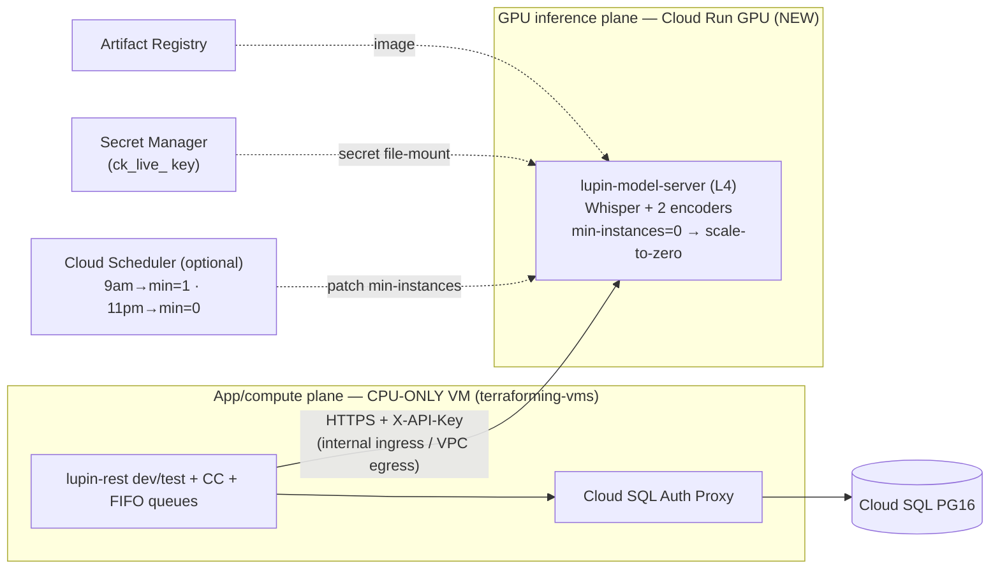

# GPU model-server → Cloud Run (scale-to-zero) — design + Terraform 2-set + local→cloud reconfig

| Field | Value |
|---|---|
| **Date** | 2026-06-30 |
| **Author** | Tiberius 👑 (session `91de0c54`) |
| **Status** | ✅ Plan APPROVED by Rick (2026-06-30) — Phase-0 serialization; dry prep crews next |
| **Approved plan** | `~/.claude/plans/thank-you-for-bringing-hidden-otter.md` (this doc is the canonical repo record) |
| **Prior analysis** | [Open: 2026.05.30-cloud-run-vs-gce-gpu-and-cc-hosting.md](/app/docs?path=lupin/src/rnd/v0.1.8/2026.05.30-gcp-deployment/2026.05.30-cloud-run-vs-gce-gpu-and-cc-hosting.md) |
| **Carve-out origin** | `src/rnd/v0.1.7/2026.05.16-model-server-carveout/01-design.md` |

> **No GCP creds this session.** Everything here is **design + dry-runnable prep** (terraform validate/plan, scripts, config, unit tests). Nothing applies to GCP until Rick's word + credentials. PUSH stays Rick's.

## Context — why

Stop paying for an always-on **L4 GPU 24×7** when it idles — especially **11pm–9am**. Split the **stateless GPU inference** off the app VM onto a **Cloud Run GPU service that scales to zero**, and **downgrade the VM to CPU-only**. Dev + test re-point at the Cloud Run endpoint for embeddings, STT, and the (embedding-based) router.

**Why the prior "VM wins" verdict does NOT veto this:** the 2026-05-30 analysis rejected Cloud Run **for the whole monolith** (daemon threads → forced `min-instances=1`, in-memory FIFO/WebSocket state, CC's tmux/listener loop, a multi-GB store). **None of that moves.** What moves is the **2026-05-16 carve-out model-server** — precisely the "stateless, request-driven inference service" the same doc named in its **§"When Cloud Run WOULD win" flip-if**. This is that doc's own recommended exception, not a reversal.

## What already exists (reuse, do not rebuild)

- **Stateless GPU server** — `src/lupin_model_server/main.py`: FastAPI; `/health` (no auth), `/transcribe`, `/embeddings/generate|batch|info`, `/admin/metrics` (X-API-Key `ck_live_*`, bcrypt). **No daemons / queues / WebSocket / persistent FS.** Models (Whisper distil-large-v3 + CodeRankEmbed + nomic-embed-text-v1.5, ~2.9 GB VRAM, `cuda:0`) **baked into the image** (`docker/lupin-model-server/Dockerfile:110-112`) → cold start = image-pull + `.to(cuda)` (~25–30 s), no runtime download. Frozen, env-driven.
- **App reaches it by URL + key only** — `cosa/memory/speech_to_text_provider.py:_resolve_model_server_url()` + `cosa/memory/embedding_provider.py:_resolve_model_server_url()` resolve `env LUPIN_MODEL_SERVER_URL → INI "model server url"`. Router (`cosa/agents/prediction_engine/prediction_engine.py:_generate_embedding`) rides the same embedding path (confidence = `max_similarity × consistency` — embedding-similarity, not a separate GPU model). **Re-pointing = one env/INI value + the key.**
- **Split already modeled** — `docker-compose.cloud-test.yml` runs `lupin-model-server` as a separate GPU container reached via `LUPIN_MODEL_SERVER_URL: http://lupin-model-server:7998`.
- **Terraform already 2-set** — `src/terraform/envs/test/` = data plane (secret-manager, gcs-buckets, artifact-registry, iam, cloud-sql-pg16, onprem-vpn); the **VM + VPC live in a separate `terraforming-vms` repo/state**.
- **Cloud Run tooling template** — `src/scripts/cloud-run-{deploy,config,setup-secrets,validate}.sh` (deploy the *app*, CPU-only, vestigial) — structural template for a GPU-service deploy script.

## Target architecture



## Resource-set split

**Set A — App/compute plane (CPU-only VM).** In `terraforming-vms` (separate repo): `machine_type` `g2-standard-8` → CPU-only (`e2-standard-4`/`-8` or `n2`), **drop `guest_accelerator`/L4** + GPU driver bits. → **cross-repo → ~150-line handoff doc** (can't edit that repo here).

**Set B — GPU inference plane (NEW, this repo).** Module `src/terraform/modules/cloud-run-model-server/`:
- `google_cloud_run_v2_service "lupin-model-server"` — `node_selector { accelerator = "nvidia-l4" }`, `resources.limits = { "nvidia.com/gpu"="1", cpu="8", memory="32Gi" }`, AR `image`, `scaling { min_instance_count = var.min_instances (default 0), max_instance_count = 1 }`, container port 7998 (or map `$PORT`), `gpu_zonal_redundancy_disabled = true`, env (device/model IDs), **Secret Manager file-mount** for the key at `KEYS_DIR/API_KEY_NAME`, `ingress = INGRESS_TRAFFIC_INTERNAL_ONLY`.
- Reuse `secret-manager` + `artifact-registry` modules.
- **(Optional)** `google_cloud_scheduler_job ×2` — `:patch` `min_instances` 1↔0 on 9am/11pm.
- Wire into `envs/test/{main,variables,outputs}.tf` (export the URL).

## Local → cloud "transmogrification" (switch, not rewrite)

1. **Env switch** — `LUPIN_MODEL_SERVER_URL` local (`http://lupin-model-server:7998`) vs cloud (`https://…run.app`, TF output). Local dev unchanged.
2. **Two distinct, separately-gated steps — ONE deploy authority (Terraform):**
   - **Image delivery (script):** `src/scripts/cloud-run-model-server-deploy.sh` builds the GPU image and pushes it to Artifact Registry. It does **NOT** run `gcloud run deploy` (that would create a second, divergent service authority — the drift + wrong-secret-path 503 of findings #3/#4). The script prints the pushed **digest** for a reproducible, digest-pinned apply.
   - **Service deploy (Terraform, Rick-gated real-money step):** `cd src/terraform/envs/test && terraform apply -var model_server_image_tag=<tag-or-digest>` creates/updates the Cloud Run service. **Terraform owns ALL service config** — GPU/accelerator, min/max instances, ingress, Direct VPC egress, the Secret Manager file-mount + `KEYS_DIR` (mounted at exactly the `{KEYS_DIR}/{API_KEY_NAME}` path the app reads), the `allUsers→run.invoker` binding (`allow_unauthenticated=true`, scoped by `INTERNAL_ONLY` ingress — Decision #3), and the ×2 scheduler jobs. Read the URL via `terraform output -raw service_url`.
3. **Cloud-GPU compose** `docker-compose.cloud-gpu.yml` (or override): omit local model-server, set `LUPIN_MODEL_SERVER_URL` to the Cloud Run URL.

## Cold-start / dial-to-zero

- **`min=0` (default, rec)** — auto-zero on idle → **overnight zero-cost for free**; first call after idle cold-starts ~30–60 s then re-zeros.
- **Scheduled toggle (optional)** — `min=1` 9am–11pm (warm) / `0` overnight. Use iff daytime idle-gap cold-start is unacceptable.

## Security

- **Rec:** `INGRESS_TRAFFIC_INTERNAL_ONLY` + Direct VPC egress + existing X-API-Key (defense-in-depth; no app-auth rework).
- **Quick-start:** `--allow-unauthenticated` + X-API-Key only (sandbox interim).

## Cost (honest) — FINALIZED 2026-07-01

**Framing (Rick):** compare **MONTHLY cost only** — 1-yr CUD commitments are OUT of
scope. On the finalized **weekday-only + VM-suspend** profile the split is a **CLEAN
WIN: ≈ $527/mo, ~$96/mo (~15%) cheaper than the current always-on on-demand VM
($623/mo)**. Itemization (Cloud Run weekday-warm $431 + e2-standard-8 running-303h
$81 + ~100GB disk $10 + suspended RAM-state ~$2 + misc $3) + sources:
[03-cost-reprice.md](/app/docs?path=lupin/src/rnd/2026.06.30-gpu-model-server-cloud-run-split/03-cost-reprice.md).

The earlier ~$803/mo "inversion" was an artifact of a 24×7 VM + 7-day warm Rick never
wanted (kept in 03 as the rejected variant). With weekday-only usage + off-hours
suspend the economics work monthly, on top of the non-cost wins (no on-VM GPU-driver
upkeep, clean stateless/stateful separation, elastic 0→1). **Confirm on the official
calculator with creds at apply.**

## Decisions for Rick (non-blocking for dry prep)

1. **Router model** — confirm embedding-similarity only (covered) vs a separate fine-tuned `NotificationCategoryClassifier` needing its own model-server endpoint.
2. **Scale mechanism** — `min=0` [rec] vs scheduled.
3. **Cold-start tolerance** — drives #2.
4. **Ingress** — internal+VPC [rec] vs public+key.
5. **VM downgrade type** — `e2-standard-4`/`-8`/`n2` (CC headroom).
6. **Cost re-price** — needs creds.

## Ratified Decisions (2026-07-01 — Rick, via `/plan-decide` walkthrough; session `eb4b105f` Tiberius 👑)

1. **Router model → Embedding-similarity ONLY.** The model-server serves STT + embeddings; the router (`prediction_engine.py` CBR path, confidence = `max_similarity × consistency`) rides the embedding endpoint, and `NotificationCategoryClassifier` is CPU keyword-matching (`notification_category_classifier.py:85-130`). NO separate fine-tuned router model / GPU endpoint. *Why:* nothing new to build/host/scale — already how it works.
2. **Scale mechanism → SCHEDULED WARM TOGGLE, WEEKDAY-ONLY + VM SUSPEND** (NOT min=0; FINALIZED 2026-07-01). Both services are utilized **only Mon–Fri 09:00–23:00 EDT**. Cloud Run `min_instances=1` on weekday-9-to-11, `min_instances=0` otherwise, via Cloud Scheduler ×2 jobs (crons `0 9 * * 1-5` / `0 23 * * 1-5`). **The app VM is PAUSED (suspended, NOT stopped) off-hours** via a second scheduler pair hitting the Compute Engine API (`instances.suspend`/`resume` on the same weekday crons) — module `vm-power-schedule`. Suspend (not stop) preserves RAM → near-instant resume AND keeps the in-memory FIFO queues + WebSocketManager singleton intact. *Why:* Rick overrode min=0 (wants zero daytime cold-starts) AND corrected the window to weekday-only + suspend (never wanted 24×7 or 7-day warm). *(Resolves decision 3, cold-start tolerance.)*
3. **Ingress → INTERNAL-ONLY + VPC.** `INGRESS_TRAFFIC_INTERNAL_ONLY` + Direct VPC egress + existing X-API-Key. *Why:* keeps the warm-9-to-11 L4 off the public internet (cost-abuse guard); no app-auth rework.
4. **VM downgrade → `e2-standard-8` (CPU-only).** Keep the current 8 vCPU / 32GB, drop the L4 (from `g2-standard-8`). *Why:* zero-risk downgrade, preserves Claude Code + REST + FIFO-queue headroom under fleet load.
5. **Cost re-price → DRIVE NOW** (Rick's creds refreshed 2026-07-01). Run the official calculator with the locked choices: warm L4 14h/day + `e2-standard-8` + internal egress.

> **Terraform Set B is now parameterized to these ruled values** (was built on recommended defaults). The scheduled-warm choice (#2) means the ×2 Cloud Scheduler jobs are IN scope (not optional). The **`terraform apply` to real GCP is the real-money step — Rick's explicit go + his GCP login.**

> **SCHEDULE CORRECTION (2026-07-01, Rick).** Decision #2's warm window is **weekday-only**: both services utilized **Mon–Fri 09:00–23:00 EDT** (~303 h/mo); all other hours (weeknights + all weekend) Cloud Run → min=0 scale-to-zero + the VM **PAUSED (suspended, not stopped** — preserves RAM for near-instant resume). Rick's framing: **monthly cost only — 1-yr CUD is out of scope.** On that axis the split re-prices to **≈ $527/mo, a CLEAN WIN — ~$96/mo (~15%) cheaper than the $623 on-demand always-on VM**; full itemization in [03-cost-reprice.md](/app/docs?path=lupin/src/rnd/2026.06.30-gpu-model-server-cloud-run-split/03-cost-reprice.md). Two NEW sub-tasks follow (held pending Rick's buy-in): (1) the module's `scale_up_cron`/`scale_down_cron` become weekday-only (`0 9 * * 1-5` / `0 23 * * 1-5`); (2) a **cross-repo VM suspend/resume** pair (Cloud Scheduler → Compute Engine API `instances.suspend`/`resume` — Cloud Run's min-toggle can't pause a VM), owned by `terraforming-vms` (see 02-vm-downgrade-handoff.md). Operational note: suspending the VM takes lupin-rest + CC + FIFO OFFLINE off-hours — acceptable for this cloud-TEST env.

## Execution lanes (dry prep — no creds; built on recommended defaults + parameterized)

- **Lane 1 — Terraform (Set B):** `modules/cloud-run-model-server/{main,variables,outputs}.tf` + wire `envs/test/` + `terraform validate` & `plan` (dry, no apply). Defaults: `min_instances=0`, internal ingress, L4.
- **Lane 2 — Scripts/config:** `cloud-run-model-server-deploy.sh` (+ `.env.example`) + INI/splainer param of `model server url` / `LUPIN_MODEL_SERVER_URL` + `docker-compose.cloud-gpu.yml` + a unit case on the URL-resolution chain for an `https://…run.app` cloud URL (100% L/B/F).
- **Lane 3 — Cross-repo handoff:** ~150-line `terraforming-vms` VM-downgrade handoff doc (machine_type + drop L4) + seed TODOs.

## Verification

- **No-creds dry:** `terraform validate`+`plan`; `shellcheck` the deploy script; unit test the cloud-URL resolution case; confirm the model-server image still builds. 100% L/B/F on new Python.
- **With-creds (Rick/scheduled):** `apply` Set B in the sandbox → deploy → `TestClient`/`requests` `GET /health` on the Cloud Run URL → point a dev rest container via `LUPIN_MODEL_SERVER_URL` → embedding + STT smoke → verify scale-to-zero + measure cold-start → cost check. (Never curl in committed tests.)

## Apply runbook (with-creds, Rick-gated — the remediation gates below)

These items resolve the fresh-critical review (Arnold 🪨 / María 🌸, 2026-07-01). They are **documented, not executed** here — every step below needs GCP creds and is the real-money `terraform apply` path that stays Rick-gated.

- **Secret-value pairing — the TRUE green gate (finding #6).** The server validates the incoming `X-API-Key` against the plaintext mounted from Secret Manager `lupin-notification-api-key` (module `api_key_secret_id`), while the app client sends the contents of its local `notification-api-claude-code-dev` key file (`du.get_api_key("notification-api-claude-code-dev")`). Auth passes ONLY if those two carry the **identical `ck_live_` value**. So the deploy MUST seed the secret from the same key the client sends, e.g.:
  ```bash
  gcloud secrets versions add lupin-notification-api-key \
      --data-file=src/conf/keys/notification-api-claude-code-dev
  ```
  **Green gate:** after `apply` + deploy, a with-creds **embedding request AND STT request** issued against the live `…run.app` endpoint (through a dev rest container pointed via `LUPIN_MODEL_SERVER_URL`) must both return **200**. That paired-secret smoke — not `terraform plan` — is the definition of green. (Never curl in committed tests; use `TestClient`/`requests`.)
- **First-apply overnight warm-leak (finding #8).** The service seeds `min_instances=1` (Decision #2 warm baseline) and the module `ignore_changes` hands `min_instance_count` to the scheduler thereafter. A **first** `apply` during the 23:00–09:00 window creates the revision **warm** and it stays warm until the next 23:00 scale-down cron — up to ~21h of unintended L4 spend. **Mitigation:** apply during the day (09:00–23:00 America/New_York), OR immediately `gcloud run services update lupin-model-server --min-instances=0` after an off-hours create. Track it as real money.
- **Digest pinning (finding #9).** `model_server_image_tag` defaults to the mutable `latest` (poor rollback/repro; Terraform won't detect a same-tag image change). The deploy script prints the pushed **digest** after `docker push`; for a reproducible apply, set the module `image` input to the full `…@sha256:` reference (the module's `image` var already accepts a `<tag-or-digest>` ref) rather than relying on the tag.
