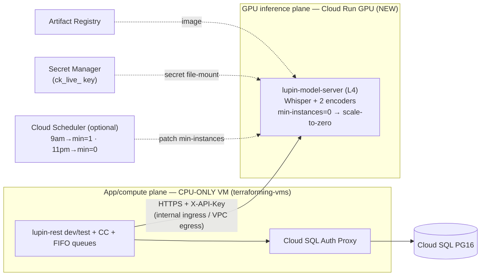

# GPU model-server → Cloud Run (scale-to-zero) — design + Terraform 2-set + local→cloud reconfig

| Field | Value |
|---|---|
| **Date** | 2026-06-30 |
| **Author** | Tiberius 👑 (session `91de0c54`) |
| **Status** | ✅ Plan APPROVED by Rick (2026-06-30) — Phase-0 serialization; dry prep crews next |
| **Approved plan** | `~/.claude/plans/thank-you-for-bringing-hidden-otter.md` (this doc is the canonical repo record) |
| **Prior analysis** | [Open: 2026.05.30-cloud-run-vs-gce-gpu-and-cc-hosting.md](/app/docs?path=lupin/src/rnd/v0.1.8/2026.05.30-gcp-deployment/2026.05.30-cloud-run-vs-gce-gpu-and-cc-hosting.md) |
| **Carve-out origin** | `src/rnd/v0.1.7/2026.05.16-model-server-carveout/01-design.md` |

> **No GCP creds this session.** Everything here is **design + dry-runnable prep** (terraform validate/plan, scripts, config, unit tests). Nothing applies to GCP until Rick's word + credentials. PUSH stays Rick's.

## Context — why

Stop paying for an always-on **L4 GPU 24×7** when it idles — especially **11pm–9am**. Split the **stateless GPU inference** off the app VM onto a **Cloud Run GPU service that scales to zero**, and **downgrade the VM to CPU-only**. Dev + test re-point at the Cloud Run endpoint for embeddings, STT, and the (embedding-based) router.

**Why the prior "VM wins" verdict does NOT veto this:** the 2026-05-30 analysis rejected Cloud Run **for the whole monolith** (daemon threads → forced `min-instances=1`, in-memory FIFO/WebSocket state, CC's tmux/listener loop, a multi-GB store). **None of that moves.** What moves is the **2026-05-16 carve-out model-server** — precisely the "stateless, request-driven inference service" the same doc named in its **§"When Cloud Run WOULD win" flip-if**. This is that doc's own recommended exception, not a reversal.

## What already exists (reuse, do not rebuild)

- **Stateless GPU server** — `src/lupin_model_server/main.py`: FastAPI; `/health` (no auth), `/transcribe`, `/embeddings/generate|batch|info`, `/admin/metrics` (X-API-Key `ck_live_*`, bcrypt). **No daemons / queues / WebSocket / persistent FS.** Models (Whisper distil-large-v3 + CodeRankEmbed + nomic-embed-text-v1.5, ~2.9 GB VRAM, `cuda:0`) **baked into the image** (`docker/lupin-model-server/Dockerfile:110-112`) → cold start = image-pull + `.to(cuda)` (~25–30 s), no runtime download. Frozen, env-driven.
- **App reaches it by URL + key only** — `cosa/memory/speech_to_text_provider.py:_resolve_model_server_url()` + `cosa/memory/embedding_provider.py:_resolve_model_server_url()` resolve `env LUPIN_MODEL_SERVER_URL → INI "model server url"`. Router (`cosa/agents/prediction_engine/prediction_engine.py:_generate_embedding`) rides the same embedding path (confidence = `max_similarity × consistency` — embedding-similarity, not a separate GPU model). **Re-pointing = one env/INI value + the key.**
- **Split already modeled** — `docker-compose.cloud-test.yml` runs `lupin-model-server` as a separate GPU container reached via `LUPIN_MODEL_SERVER_URL: http://lupin-model-server:7998`.
- **Terraform already 2-set** — `src/terraform/envs/test/` = data plane (secret-manager, gcs-buckets, artifact-registry, iam, cloud-sql-pg16, onprem-vpn); the **VM + VPC live in a separate `terraforming-vms` repo/state**.
- **Cloud Run tooling template** — `src/scripts/cloud-run-{deploy,config,setup-secrets,validate}.sh` (deploy the *app*, CPU-only, vestigial) — structural template for a GPU-service deploy script.

## Target architecture

## Resource-set split

**Set A — App/compute plane (CPU-only VM).** In `terraforming-vms` (separate repo): `machine_type` `g2-standard-8` → CPU-only (`e2-standard-4`/`-8` or `n2`), **drop `guest_accelerator`/L4** + GPU driver bits. → **cross-repo → ~150-line handoff doc** (can't edit that repo here).

**Set B — GPU inference plane (NEW, this repo).** Module `src/terraform/modules/cloud-run-model-server/`:
- `google_cloud_run_v2_service "lupin-model-server"` — `node_selector { accelerator = "nvidia-l4" }`, `resources.limits = { "nvidia.com/gpu"="1", cpu="8", memory="32Gi" }`, AR `image`, `scaling { min_instance_count = var.min_instances (default 0), max_instance_count = 1 }`, container port 7998 (or map `$PORT`), `gpu_zonal_redundancy_disabled = true`, env (device/model IDs), **Secret Manager file-mount** for the key at `KEYS_DIR/API_KEY_NAME`, `ingress = INGRESS_TRAFFIC_INTERNAL_ONLY`.
- Reuse `secret-manager` + `artifact-registry` modules.
- **(Optional)** `google_cloud_scheduler_job ×2` — `:patch` `min_instances` 1↔0 on 9am/11pm.
- Wire into `envs/test/{main,variables,outputs}.tf` (export the URL).

## Local → cloud "transmogrification" (switch, not rewrite)

1. **Env switch** — `LUPIN_MODEL_SERVER_URL` local (`http://lupin-model-server:7998`) vs cloud (`https://…run.app`, TF output). Local dev unchanged.
2. **Deploy script** `src/scripts/cloud-run-model-server-deploy.sh` (mirror `cloud-run-deploy.sh` + `--gpu/--accelerator=nvidia-l4 --no-cpu-throttling --min-instances`): build → push AR → `terraform apply` Set B → emit URL.
3. **Cloud-GPU compose** `docker-compose.cloud-gpu.yml` (or override): omit local model-server, set `LUPIN_MODEL_SERVER_URL` to the Cloud Run URL.

## Cold-start / dial-to-zero

- **`min=0` (default, rec)** — auto-zero on idle → **overnight zero-cost for free**; first call after idle cold-starts ~30–60 s then re-zeros.
- **Scheduled toggle (optional)** — `min=1` 9am–11pm (warm) / `0` overnight. Use iff daytime idle-gap cold-start is unacceptable.

## Security

- **Rec:** `INGRESS_TRAFFIC_INTERNAL_ONLY` + Direct VPC egress + existing X-API-Key (defense-in-depth; no app-auth rework).
- **Quick-start:** `--allow-unauthenticated` + X-API-Key only (sandbox interim).

## Cost (honest)

Carve-out **unlocks the scale-to-zero the monolith couldn't use** → answer flips on **GPU duty cycle**. Cloud Run GPUs **can't take a CUD** (VM could). Prior secondary figures (24×7): Cloud Run L4 ≈ $764/mo vs g2-VM ≈ $623 on-demand / $393 1-yr-CUD — but min=0 with real idle changes everything. Net all-in = cheap CPU VM + GPU-only-when-serving. **Re-price on the official calculator with creds.**

## Decisions for Rick (non-blocking for dry prep)

1. **Router model** — confirm embedding-similarity only (covered) vs a separate fine-tuned `NotificationCategoryClassifier` needing its own model-server endpoint.
2. **Scale mechanism** — `min=0` [rec] vs scheduled.
3. **Cold-start tolerance** — drives #2.
4. **Ingress** — internal+VPC [rec] vs public+key.
5. **VM downgrade type** — `e2-standard-4`/`-8`/`n2` (CC headroom).
6. **Cost re-price** — needs creds.

## Execution lanes (dry prep — no creds; built on recommended defaults + parameterized)

- **Lane 1 — Terraform (Set B):** `modules/cloud-run-model-server/{main,variables,outputs}.tf` + wire `envs/test/` + `terraform validate` & `plan` (dry, no apply). Defaults: `min_instances=0`, internal ingress, L4.
- **Lane 2 — Scripts/config:** `cloud-run-model-server-deploy.sh` (+ `.env.example`) + INI/splainer param of `model server url` / `LUPIN_MODEL_SERVER_URL` + `docker-compose.cloud-gpu.yml` + a unit case on the URL-resolution chain for an `https://…run.app` cloud URL (100% L/B/F).
- **Lane 3 — Cross-repo handoff:** ~150-line `terraforming-vms` VM-downgrade handoff doc (machine_type + drop L4) + seed TODOs.

## Verification

- **No-creds dry:** `terraform validate`+`plan`; `shellcheck` the deploy script; unit test the cloud-URL resolution case; confirm the model-server image still builds. 100% L/B/F on new Python.
- **With-creds (Rick/scheduled):** `apply` Set B in the sandbox → deploy → `TestClient`/`requests` `GET /health` on the Cloud Run URL → point a dev rest container via `LUPIN_MODEL_SERVER_URL` → embedding + STT smoke → verify scale-to-zero + measure cold-start → cost check. (Never curl in committed tests.)
