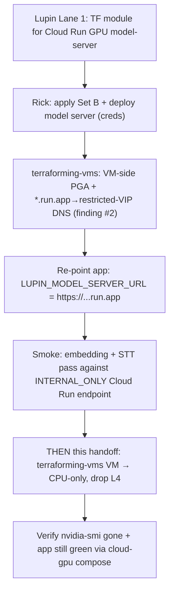

# Cross-repo handoff: downgrade `lupin-host-test` VM to CPU-only (`terraforming-vms`)

| Field | Value |
|---|---|
| **Date** | 2026-06-30 |
| **Author** | Sam 🎙️ (session `c8e31f76`, Lane 3) under Tiberius 👑 |
| **Target repo** | `terraforming-vms` (separate repo/state — NOT editable from the Lupin repo) |
| **Parent design** | [Open: 01-design.md](/app/docs?path=lupin/src/rnd/2026.06.30-gpu-model-server-cloud-run-split/01-design.md) |
| **Epic** | `dab6cdfa` — GPU model-server → Cloud Run (scale-to-zero) split |
| **Status** | HANDOFF — dry prep only; no GCP creds; nothing applied. PUSH + `terraform apply` are Rick-gated. |

---

## TL;DR

The GPU inference workload (Whisper + 2 text encoders) is moving **off** the
`lupin-host-test` VM and **onto** a Cloud Run GPU service that scales to zero
(Lupin-repo Lane 1 = the Terraform module; Lane 2 = the deploy script + env
switch). Once that lands, the VM **no longer needs an L4 GPU**. This handoff
asks the `terraforming-vms` owner to **downgrade the VM machine type from the
GPU-bearing `g2-standard-8` to `e2-standard-8` (CPU-only) and drop the L4
accelerator + GPU driver bits** — converting an always-on GPU bill into "GPU
only during the warm window" plus a much cheaper CPU VM.

> **RULED (2026-07-01, Rick — Decision #4): `e2-standard-8`.** Keep the current
> 8 vCPU / 32 GB envelope, drop the L4. This is no longer a 3-way choice — the
> trade-off table below is retained for context, but `e2-standard-8` is the
> locked target. (Open question #1 "machine type" is CLOSED.)

**Do NOT apply this until the Cloud Run model server is live and the app has
been re-pointed at it** (`LUPIN_MODEL_SERVER_URL` → the `…run.app` URL) and a
smoke (embedding + STT) passes against the cloud endpoint. Sequencing matters:
remove the local GPU only after the remote GPU is proven. See **Sequencing**.

---

## Current state (what exists today)

- VM `lupin-host-test` runs `machine_type = "g2-standard-8"` (8 vCPU / 32 GB,
  **G2 = L4-attached family**) with a `guest_accelerator { type =
  "nvidia-l4", count = 1 }` block and the NVIDIA GPU driver installed
  (startup script / metadata `install-nvidia-driver`, or a driver DaemonSet /
  cos-extensions, depending on the image).
- It hosts the full Lupin test stack via `docker-compose.cloud-test.yml`,
  which today includes a **local** `lupin-model-server` GPU container pinned
  to `cuda:0`.
- The app reaches the model server at `http://lupin-model-server:7998` inside
  the compose network.

## The change (exact, in `terraforming-vms`)

In the Compute Engine instance resource for `lupin-host-test`:

1. **`machine_type`**: `"g2-standard-8"` → `"e2-standard-8"` (RULED — CPU-only,
   same 8 vCPU / 32 GB). The G2 family *requires* an attached GPU; you cannot
   keep `g2-*` without the accelerator. (Trade-off table below retained for
   context only; the target is locked.)
2. **Remove the `guest_accelerator { … }` block** entirely (and any
   `scheduling { on_host_maintenance = "TERMINATE" }` that was only there to
   satisfy the GPU constraint — CPU VMs can use `MIGRATE`).
3. **Remove GPU driver provisioning**: the `install-nvidia-driver` metadata
   key / startup-script driver install / `cos-gpu` extension / driver
   DaemonSet — whatever installs the L4 driver on this VM.
4. **Leave untouched**: VPC/subnet, firewall, the attached service account
   (`vm_sa` — still needs `roles/cloudsql.client`), boot disk, and the Cloud
   SQL Auth Proxy wiring. Only the GPU dimension changes.

### Machine-type trade-off (pick one)

| Type | vCPU / RAM | Fit for CPU-only Lupin + CC headroom | Note |
|---|---|---|---|
| `e2-standard-4` | 4 / 16 GB | Minimal — REST + Cloud SQL proxy only | Cheapest; tight if bounded-CC jobs run on-VM |
| **`e2-standard-8`** (rec) | 8 / 32 GB | Comfortable — REST + proxy + bounded-CC/tmux headroom | Same vCPU/RAM as the old g2-standard-8, minus the GPU |
| `n2-standard-8` | 8 / 32 GB | Comfortable + better single-thread + CUD-eligible | Slightly pricier than E2; choose if a 1-yr CUD is planned |

**Recommendation: `e2-standard-8`** — preserves today's 8 vCPU / 32 GB
envelope (so the on-VM bounded-CC / tmux workload keeps its headroom) while
dropping the GPU premium. Step down to `e2-standard-4` only if the VM is
confirmed to run *nothing* but REST + the SQL proxy. Choose `n2-standard-8` if
a committed-use discount is on the table (E2 is not CUD-friendly the same way).

## VM-side networking for INTERNAL_ONLY reachability (finding #2 — NEW owned task)

> **OWNER: the `terraforming-vms` repo owner** — the SAME owner executing this
> VM downgrade. This is VM-side / VPC-side networking (Private Google Access +
> DNS), **not** a Lupin-repo Terraform edit, which is why it lands here and not
> in `src/terraform`. Without it, the app on the VM **cannot reach** the Cloud
> Run model server and every embedding/STT call fails at connect time.

**Why this is required (and why Direct VPC egress does NOT cover it).** Ratified
Decision #3 sets the Cloud Run service to `INGRESS_TRAFFIC_INTERNAL_ONLY`. The
module's Direct VPC egress governs the **service's OUTBOUND** traffic only — and
a stateless inference server makes no outbound calls — so it does **not** make an
internal-only service reachable **INBOUND** from the VM. For the VM to reach an
INTERNAL_ONLY `…run.app` endpoint over Google's private path, the VM's VPC needs:

1. **Private Google Access (PGA)** enabled on the subnet the VM lives in
   (`google_compute_subnetwork.private_ip_google_access = true`), so the VM can
   reach Google APIs without an external IP.
2. **A DNS override** so `*.run.app` (and the googleapis endpoints) resolve to the
   **restricted Google APIs VIP** `199.36.153.4/30` instead of public IPs. Do this
   with Cloud DNS private managed zones on the app VPC:
   - zone for `run.app.` → A record `199.36.153.4` (and the wildcard as the
     provider supports), plus the standard `googleapis.com.` →
     `restricted.googleapis.com` (`199.36.153.4/30`) private zone.
3. **A route to the restricted VIP** — a static route for `199.36.153.4/30`
   with next-hop `default-internet-gateway` (the VIP is reached via the Google
   backbone, no external IP needed), tagged/scoped to the VM as appropriate.

**Alternative** (if PGA+DNS is undesirable): front the service with an internal
Application Load Balancer / PSC endpoint on the app VPC and point the app at that
internal address instead of the `…run.app` name. Heavier; PGA+DNS is the
lighter-weight fit for a single internal caller.

### Seed TODOs (VM-side networking — `terraforming-vms` owner)

- [ ] [TFVMS] Enable Private Google Access on the `lupin-host-test` VM's subnet.
- [ ] [TFVMS] Create Cloud DNS private zones on the app VPC: `run.app.` → `199.36.153.4`, and `googleapis.com.` → restricted VIP (`199.36.153.4/30`).
- [ ] [TFVMS] Add a static route `199.36.153.4/30` → `default-internet-gateway` scoped to the app VPC/VM.
- [ ] [TFVMS] Verify from the VM: `dig <service>.run.app` resolves to `199.36.153.4`, and a request to the `…run.app` endpoint connects (paired with the Lupin-side X-API-Key smoke — design doc §"Apply runbook" finding #6).

> **Sequencing:** this VM-side networking must be in place **before** the cloud
> smoke (embedding + STT against the `…run.app` endpoint) can pass — i.e. before
> re-pointing the app and before the CPU downgrade. It is added to the ordering
> diagram below as the step gating the smoke.

## VM suspend/resume scheduling for weekday-only utilization (2026-07-01)

> **The SCHEDULER is now BUILT in the Lupin repo** (dry-verified): module
> `src/terraform/modules/vm-power-schedule` wired into `envs/test` provisions the
> two Cloud Scheduler jobs that POST to the Compute Engine API
> `instances.suspend` (`0 23 * * 1-5`) / `instances.resume` (`0 9 * * 1-5`),
> America/New_York. They reference the VM by name + zone only (no cross-state
> data source), so they build cleanly without the terraforming-vms state.
> **What remains for the `terraforming-vms` / IAM owner** is only the two items
> below (the scheduler itself is no longer their build task).

Rick's 2026-07-01 schedule correction: the VM is utilized **only Mon–Fri
09:00–23:00 EDT** and **PAUSED (suspended)** all other hours (weeknights + all
weekend). Rick specified **suspend, not stop** — a *suspended* VM incurs no
compute (cores/RAM) charge, only the saved memory-state + boot disk at
Persistent-Disk rates, and (the reason for suspend over stop) **preserves RAM
state for near-instant resume** — no cold boot / docker-compose-up cycle.

> Note: suspend has a max preserved-state duration (historically 60 days) — well
> within a weekend. e2-standard-8 (CPU-only) supports suspend.

### 🎁 Suspend design win — in-memory state survives the pause

Because suspend snapshots the VM's **RAM to disk** (rather than a cold stop), the
resume restores process memory intact. For Lupin that means the **in-memory FIFO
queues** (todo/running/done) **and the `WebSocketManager` singleton survive the
nightly/weekend pause** — no queue drain, no singleton re-init. This **retires the
2026-05-30 "lose-singleton / lose-in-memory-state" concern** that argued against
pausing the monolith: with suspend (not stop) that objection no longer applies.

### 🔔 Resume-burst runbook note (expected, NOT a fault)

On the Monday-09:00 (or any weekday) **resume**, expect a short burst of activity
as the snapshot resumes with a stale wall-clock: **daemon-timer fires** pile up —
the heartbeat self-poke, the CJ-Flow ghost-job sweeper, and the arbiter's
2700s-staleness tick may all fire near-simultaneously — and **WebSocket clients
reconnect** en masse. This is **expected post-resume behavior, not a fault**; the
timers self-rate-limit and the WS layer re-auths normally. Do not treat the burst
as a regression.

### Remaining owned items (IAM / `terraforming-vms` owner)

- [ ] [IAM] Grant the scheduler SA (`vm_power_scheduler_sa_email`) `compute.instances.suspend` + `compute.instances.resume` (+ `.get`) on `lupin-host-test` (custom role or `roles/compute.instanceAdmin.v1`). REQUIRED before the Lupin-built jobs can act.
- [ ] [TFVMS] Confirm the VM's actual **zone** matches `vm_power_vm_zone` (default `us-central1-a`) — the Compute Engine API is zonal; a mismatch 404s the suspend/resume call.
- [ ] [TFVMS] Confirm the app auto-recovers on resume (docker containers resume with the VM; record resume-to-ready time) and that OFFLINE weeknights 23:00–09:00 + all weekend is acceptable (03-cost-reprice.md flags this).

## Verification (post-apply, with creds — Rick/owner)

1. `terraform plan` shows ONLY: machine_type change, `guest_accelerator`
   removal, driver/metadata removal. No VPC/SA/disk churn.
2. After `apply` + VM boot: `gcloud compute instances describe
   lupin-host-test --format='value(machineType,guestAccelerators)'` → CPU type,
   **empty** accelerators.
3. On the VM: `nvidia-smi` is **absent/fails** (expected — GPU gone) and
   `docker compose -f docker-compose.cloud-gpu.yml ...` brings up REST with
   `LUPIN_MODEL_SERVER_URL` pointed at the Cloud Run URL (NOT the local
   container — that service is omitted from the cloud-gpu compose).
4. App smoke: an embedding request + an STT request both succeed, served by
   the Cloud Run GPU service (check Cloud Run request logs show the hits).

## Rollback

Re-apply the prior `terraforming-vms` state: restore `machine_type =
"g2-standard-8"`, the `guest_accelerator` block, and the driver provisioning,
then switch the VM back to `docker-compose.cloud-test.yml` (local GPU
container). Because the change is GPU-dimension-only, rollback is a clean
`terraform apply` of the previous commit — no data-plane risk. Keep the old
machine_type value in the PR description for a one-line revert.

## Sequencing (hard ordering — do not reorder)

Removing the local GPU **before** the remote GPU is proven would leave the
test stack with no inference backend. The CPU downgrade is the **last** step.

## Seed TODOs (for the `terraforming-vms` owner)

- [ ] [TFVMS] Locate the `lupin-host-test` instance resource + confirm where the L4 driver is provisioned (metadata vs startup-script vs DaemonSet).
- [ ] [TFVMS] Branch + edit: `machine_type` → `e2-standard-8` (rec), remove `guest_accelerator`, remove GPU driver bits, relax `on_host_maintenance` to `MIGRATE`.
- [ ] [TFVMS] `terraform plan` — confirm GPU-dimension-only diff (no VPC/SA/disk churn); attach plan to the PR.
- [ ] [TFVMS] Gate apply on Lupin-side readiness: Cloud Run model server live + app re-pointed + cloud smoke green (this doc's Sequencing).
- [ ] [TFVMS] Post-apply: verify empty `guestAccelerators` + absent `nvidia-smi`; record before/after monthly cost delta (track GCP spend as real money).
- [ ] [TFVMS] Document the rollback one-liner (prior machine_type + accelerator block) in the PR body.

## Open questions for Rick / owner

1. **Machine type** — confirm `e2-standard-8` vs `e2-standard-4` (does the VM
   still run bounded-CC / tmux work, needing headroom?) vs `n2-standard-8`
   (planning a CUD?). Design Decision #5.
2. **Driver provisioning mechanism** — which of metadata / startup-script /
   DaemonSet installs the L4 driver on this VM? (Determines exactly what to
   delete in step 3.)
3. **Cost re-price** — needs creds + the official calculator (CPU VM + Cloud
   Run GPU min=0 vs the prior always-on g2 + L4). Design Decision #6.
