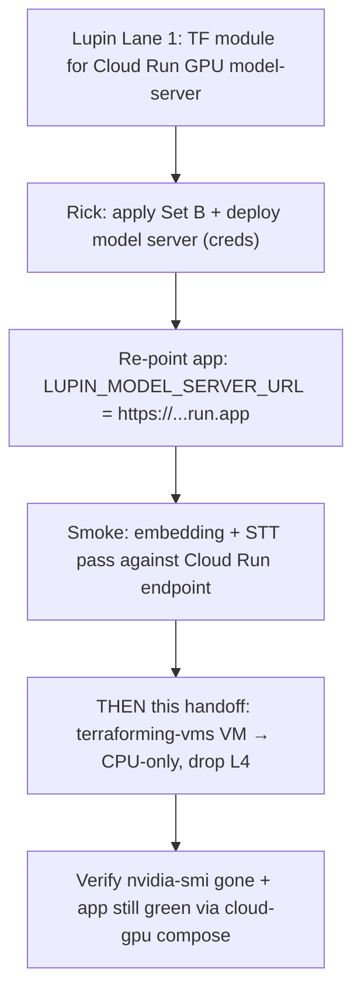

# Cross-repo handoff: downgrade `lupin-host-test` VM to CPU-only (`terraforming-vms`)

| Field | Value |
|---|---|
| **Date** | 2026-06-30 |
| **Author** | Sam 🎙️ (session `c8e31f76`, Lane 3) under Tiberius 👑 |
| **Target repo** | `terraforming-vms` (separate repo/state — NOT editable from the Lupin repo) |
| **Parent design** | [Open: 01-design.md](/app/docs?path=lupin/src/rnd/2026.06.30-gpu-model-server-cloud-run-split/01-design.md) |
| **Epic** | `dab6cdfa` — GPU model-server → Cloud Run (scale-to-zero) split |
| **Status** | HANDOFF — dry prep only; no GCP creds; nothing applied. PUSH + `terraform apply` are Rick-gated. |

---

## TL;DR

The GPU inference workload (Whisper + 2 text encoders) is moving **off** the
`lupin-host-test` VM and **onto** a Cloud Run GPU service that scales to zero
(Lupin-repo Lane 1 = the Terraform module; Lane 2 = the deploy script + env
switch). Once that lands, the VM **no longer needs an L4 GPU**. This handoff
asks the `terraforming-vms` owner to **downgrade the VM machine type from the
GPU-bearing `g2-standard-8` to a CPU-only type and drop the L4 accelerator +
GPU driver bits** — converting an always-on GPU bill into "GPU only when
serving" plus a much cheaper CPU VM.

**Do NOT apply this until the Cloud Run model server is live and the app has
been re-pointed at it** (`LUPIN_MODEL_SERVER_URL` → the `…run.app` URL) and a
smoke (embedding + STT) passes against the cloud endpoint. Sequencing matters:
remove the local GPU only after the remote GPU is proven. See **Sequencing**.

---

## Current state (what exists today)

- VM `lupin-host-test` runs `machine_type = "g2-standard-8"` (8 vCPU / 32 GB,
  **G2 = L4-attached family**) with a `guest_accelerator { type =
  "nvidia-l4", count = 1 }` block and the NVIDIA GPU driver installed
  (startup script / metadata `install-nvidia-driver`, or a driver DaemonSet /
  cos-extensions, depending on the image).
- It hosts the full Lupin test stack via `docker-compose.cloud-test.yml`,
  which today includes a **local** `lupin-model-server` GPU container pinned
  to `cuda:0`.
- The app reaches the model server at `http://lupin-model-server:7998` inside
  the compose network.

## The change (exact, in `terraforming-vms`)

In the Compute Engine instance resource for `lupin-host-test`:

1. **`machine_type`**: `"g2-standard-8"` → a CPU-only type (see trade-off
   table below). The G2 family *requires* an attached GPU; you cannot keep
   `g2-*` without the accelerator.
2. **Remove the `guest_accelerator { … }` block** entirely (and any
   `scheduling { on_host_maintenance = "TERMINATE" }` that was only there to
   satisfy the GPU constraint — CPU VMs can use `MIGRATE`).
3. **Remove GPU driver provisioning**: the `install-nvidia-driver` metadata
   key / startup-script driver install / `cos-gpu` extension / driver
   DaemonSet — whatever installs the L4 driver on this VM.
4. **Leave untouched**: VPC/subnet, firewall, the attached service account
   (`vm_sa` — still needs `roles/cloudsql.client`), boot disk, and the Cloud
   SQL Auth Proxy wiring. Only the GPU dimension changes.

### Machine-type trade-off (pick one)

| Type | vCPU / RAM | Fit for CPU-only Lupin + CC headroom | Note |
|---|---|---|---|
| `e2-standard-4` | 4 / 16 GB | Minimal — REST + Cloud SQL proxy only | Cheapest; tight if bounded-CC jobs run on-VM |
| **`e2-standard-8`** (rec) | 8 / 32 GB | Comfortable — REST + proxy + bounded-CC/tmux headroom | Same vCPU/RAM as the old g2-standard-8, minus the GPU |
| `n2-standard-8` | 8 / 32 GB | Comfortable + better single-thread + CUD-eligible | Slightly pricier than E2; choose if a 1-yr CUD is planned |

**Recommendation: `e2-standard-8`** — preserves today's 8 vCPU / 32 GB
envelope (so the on-VM bounded-CC / tmux workload keeps its headroom) while
dropping the GPU premium. Step down to `e2-standard-4` only if the VM is
confirmed to run *nothing* but REST + the SQL proxy. Choose `n2-standard-8` if
a committed-use discount is on the table (E2 is not CUD-friendly the same way).

## Verification (post-apply, with creds — Rick/owner)

1. `terraform plan` shows ONLY: machine_type change, `guest_accelerator`
   removal, driver/metadata removal. No VPC/SA/disk churn.
2. After `apply` + VM boot: `gcloud compute instances describe
   lupin-host-test --format='value(machineType,guestAccelerators)'` → CPU type,
   **empty** accelerators.
3. On the VM: `nvidia-smi` is **absent/fails** (expected — GPU gone) and
   `docker compose -f docker-compose.cloud-gpu.yml ...` brings up REST with
   `LUPIN_MODEL_SERVER_URL` pointed at the Cloud Run URL (NOT the local
   container — that service is omitted from the cloud-gpu compose).
4. App smoke: an embedding request + an STT request both succeed, served by
   the Cloud Run GPU service (check Cloud Run request logs show the hits).

## Rollback

Re-apply the prior `terraforming-vms` state: restore `machine_type =
"g2-standard-8"`, the `guest_accelerator` block, and the driver provisioning,
then switch the VM back to `docker-compose.cloud-test.yml` (local GPU
container). Because the change is GPU-dimension-only, rollback is a clean
`terraform apply` of the previous commit — no data-plane risk. Keep the old
machine_type value in the PR description for a one-line revert.

## Sequencing (hard ordering — do not reorder)

Removing the local GPU **before** the remote GPU is proven would leave the
test stack with no inference backend. The CPU downgrade is the **last** step.

## Seed TODOs (for the `terraforming-vms` owner)

- [ ] [TFVMS] Locate the `lupin-host-test` instance resource + confirm where the L4 driver is provisioned (metadata vs startup-script vs DaemonSet).
- [ ] [TFVMS] Branch + edit: `machine_type` → `e2-standard-8` (rec), remove `guest_accelerator`, remove GPU driver bits, relax `on_host_maintenance` to `MIGRATE`.
- [ ] [TFVMS] `terraform plan` — confirm GPU-dimension-only diff (no VPC/SA/disk churn); attach plan to the PR.
- [ ] [TFVMS] Gate apply on Lupin-side readiness: Cloud Run model server live + app re-pointed + cloud smoke green (this doc's Sequencing).
- [ ] [TFVMS] Post-apply: verify empty `guestAccelerators` + absent `nvidia-smi`; record before/after monthly cost delta (track GCP spend as real money).
- [ ] [TFVMS] Document the rollback one-liner (prior machine_type + accelerator block) in the PR body.

## Open questions for Rick / owner

1. **Machine type** — confirm `e2-standard-8` vs `e2-standard-4` (does the VM
   still run bounded-CC / tmux work, needing headroom?) vs `n2-standard-8`
   (planning a CUD?). Design Decision #5.
2. **Driver provisioning mechanism** — which of metadata / startup-script /
   DaemonSet installs the L4 driver on this VM? (Determines exactly what to
   delete in step 3.)
3. **Cost re-price** — needs creds + the official calculator (CPU VM + Cloud
   Run GPU min=0 vs the prior always-on g2 + L4). Design Decision #6.
