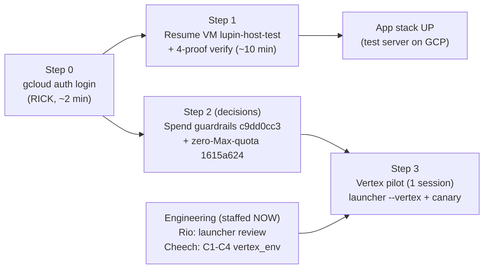

# GCP Environment Readiness Review — "Everything Up and Running"

**Date**: 2026-07-15 (lunch-window review)
**Author**: Mr. Radio 🦉 (session `da517b03`, fleet manager)
**Trigger**: Rick's P0 for today — *"getting everything up and running in my GCP environment."*
**Store task**: `97c12d68` (P0)
**Method**: live probes where possible (gcloud, task store, git) + primary artifacts (receipts docs, store item bodies). Every claim cites its source.

---

## 0. TL;DR verdict

**The infrastructure is deployed, converged, and healthy — it is parked, not broken.** One hard blocker stands in front of *everything*: **gcloud auth on the dev box is EXPIRED** (probed live 12:33 EDT — token refresh fails non-interactively). Re-auth is interactive and **only you can do it** (~2 min). After that, the app stack is a **single VM resume + verify** away from running.

The **Vertex/Model Garden token-consumption path** (the newest limb of "everything") is a different story: access is granted and the toggle code exists, but it is **NOT ready to spend real money** — it is gated on **your 3 parked decisions** (spend guardrails being ordering-critical) plus 2 engineering closes that I staffed this hour (both zero-GCP, running now).

---

## 1. Blocker #0 — gcloud auth EXPIRED

Probed live at 12:33 EDT: `gcloud compute instances list` → *"Reauthentication failed. cannot prompt during non-interactive execution."* Same for Cloud Run listing. **No GCP actuation or even read-only inventory is possible from this box until you re-auth.**

- **Remedy**: type `! gcloud auth login` in any session (the `!` prefix runs it interactively here). If the pilot's ADC-dependent legs are on the menu, also `gcloud auth application-default login` (ADC last known fresh 2026-07-07).
- Everything in §6 below that says "resume/verify/probe" queues behind this.

## 2. Component-by-component readiness

| Component | State (source) | Ready? | To bring up |
|---|---|---|---|
| **Test app VM `lupin-host-test`** | Codeless image `lupin:1.3.0-codeless` @ `dbb4b307…`, code = bind-mounted snapshot of `df611aa7`, `.deployed-ref` stamped, **four-proof verified** (health 200 · backend=postgres @ migration head · HEAD sentinel · bare image 0 files), then **VM re-SUSPENDED by design** (2026-07-12 deploy; `src/rnd/2026.07.12-gcp-bind-mount-revert-plan.md`) | ✅ parked | Resume VM → app auto-starts → re-run the four proofs. ~10 min |
| **Cloud Run GPU model server `lupin-model-server`** | **LIVE since 2026-07-01 apply** (scale-to-zero L4, INTERNAL_ONLY, `Ready=True`, with-creds green-bar 3/3 models; split-dir doc 06). Default-**paused** posture: min=0, both warm-schedulers OFF (doc 05) | ✅ live | Nothing. Cold-starts on demand; optional warm-poke after VM up |
| **Networking (VPC/DNS/PGA)** | Cloud DNS private zone `run.app` + PGA routes + **Docker-bridge MTU 1460 fix persisted in VM compose** — proven by live app→model-server 200 that survived a full recreate (2026-07-08; `src/rnd/2026.07.08-cpu-vm-app-restore-runbook.md`) | ✅ | Nothing |
| **Postgres + pgvector (Cloud SQL `lupin-pg16-test`)** | Schema at head `e1f2a3b4c5d6`, exact-scan (no HNSW), green-bar receipted (2026-07-07, split-dir doc 08). Cloud SQL runs 24/7 — it IS the cost floor (doc 04: ≈$125/mo all-paused floor is Cloud-SQL-dominated) | ✅ live | Nothing |
| **Terraform state** | Converged — 07-07 reconcile: `0 add / 1 change (benign null-drift) / 0 destroy`, NO apply needed (doc 08). Invariant tests now committed in-tree (`test_terraform_invariants.py`, `7eef87ce`); its one red is local-only (`terraform init` provider download), not GCP drift | ✅ | Optional: local `terraform init` to green the invariant suite |
| **Vertex / Model Garden** | Access **GRANTED** (Opus 4.8 purchased 07-13; **served HTTP 200 ×2 at `location=global`** — your own test calls calibrated the monitoring oracle 0→2). Request/response logging config **reads back enabled** (LRO done, samplingRate 1, BQ sink) — but **data-arrival is UNPROVEN** (lane-C harness was built precisely to prove it; zero rows ever observed). Toggle code committed (`0d513fc3`, `7eef87ce`) but **carrying open review findings** (§4) | 🟡 | §3 decisions + §4 engineering + pilot |
| **Spend guardrails** | **ZERO budgets, ZERO alerts, ZERO billing export** on the project (verified in store item `c9dd0cc3`; billingbudgets API not even enabled). Openapi token quotas at defaults permit ~75M tok/day | 🔴 | **Your decision — ordering-critical, §3.1** |

**Code-currency note**: the VM's code snapshot is `df611aa7` (07-12). Origin HEAD is now `b2a263b7` (4 commits ahead, incl. the tmux fleet-killer fix + vertex WIP). Refresh = re-materialize snapshot + restart per the ratified manual-pull doctrine (revert-plan §5) — optional for bring-up, recommended before any GCP-side testing of new code.

## 3. Decisions on your desk (the real gate to Vertex spend)

María 🌸 is walking you through the READY gates this afternoon (her lane; this doc lists the whole set once so nothing double-asks).

1. **`c9dd0cc3` (P0, ordering-critical) — spend guardrails BEFORE any Vertex spend.** **The posture is already RULED**: on 07-14 you picked the **Cloud Quotas rate cap** ("the brake that actually brakes" — recorded in `29e8e3e3`; a budget is an email, not a brake, and no daily budget period exists). **The clamp numbers are READY** (Krishna 🦚, delivered 12:55 EDT, primary-source prices: `src/rnd/v0.1.9/2026.07.15-vertex-quota-clamp-prep.md`): defaults permit **$72.69/day on the two MaaS models alone**; proposed split Opus $30 / deepseek $10 / gpt-oss $10 → clamps (Opus 1,500 in / 500 out TPM · deepseek 6k/2k · gpt-oss 30k/10k) bound fleet worst-case at **$47.55/day ≤ $50**. The trade, plainly: 500 out-TPM makes interactive Vertex-Opus a hard throttle — that IS what $50/day buys at $25/MTok output. **🔴 One caveat carried verbatim**: the Openapi quota family does NOT cover Opus; one authed read (§3 step 0.4) must find Claude's quota family — if none exists, the rate cap cannot brake Opus and Opus falls back to the laggy watchdog + alerts. What remains yours, narrowed to three: **(a)** ratify the clamp values above; **(b)** authorize the Cloud Billing→BigQuery export (console-only, **non-retroactive** — must precede the pilot or its spend is console-only forever); **(c)** authorize the one deliberate over-rate 429 canary (~$0.01) that proves the cap is live rather than assumed.
2. **`1615a624` (P1) — is zero-Max-quota the point of the toggle?** Frames whether Vertex is an escape valve buying back your peak-hour Max headroom (real dollars for quota) or purely a fallback. Shapes the pilot's acceptance criteria.
3. **`31f6d447` (P1) — data-retention opt-in: deliberately HELD, not asked today.** The optional-vs-mandatory premise must be settled by one Phase-1 probe first (my 07-13 ruling stands; chase bumped to 07-16 evening).
4. **`823be9cc` (P1, privacy)** — gpt-oss MaaS streams verbatim chain-of-thought (`reasoning_content`); whether BQ logging captures it is **untested**, and the settling probe is itself a prediction call (= spend) — **needs your word**; naturally lands inside the pilot.

## 4. Engineering in flight RIGHT NOW (staffed this hour, zero-GCP)

The vertex lane's blocker (`4e980934`, tmux fleet-killer cascade Steps 5–6) closed last night — fix committed `52ceabe0`, pushed `b2a263b7`. I executed the 13:00Z re-staff chase:

- **Rio ⚡ (reviewer, session `8d8c5e07`)** — `57124681`: ✅ **VERDICT LANDED 12:46 EDT — APPROVE.** Arnold's P0 NOT-APPROVE on the launcher is **cleared by execution** (18/18 isolated-socket rig runs: `--vertex` pane provably SEES the 3 toggle vars, MAX path fully scrubbed, server born clean both paths; F3 attributability proven by defect reconstruction). The adopted-committed launcher **stays**. Three non-blocking follow-ups (R1 test-oracle blindness MED / R2 dead code / R3 silent fail-closed) minted onto Cheech's seat (`5972ef61`); Rio holds on-call to review the incoming launcher diff.
- **Cheech 🌿 (author, session `356809b3`)** — `b0e7142c` (P0): close Rio's Stage-3 NOT-APPROVE on `vertex_env.py` — C1 **critical** (guard runs in the launcher shell, not the pane; the exploit path routes/bills a different project silently), C2 (region certification `global`-only), C3 (hostile-key drift test vs the shipped binary), C4 (ANTHROPIC_MODEL pin guard). Red-first tests, no commits without review. Launcher untouched until Rio's verdict. His early read: C2/C3/C4 may already be carried by the adopted WIP; C1's in-pane guard + OSQ-6 check are the real gaps.

Also queued in-lane, not yet staffed: `29e8e3e3` (P0 — build the Cloud Quotas rate-cap request, read-only prep for whichever posture you pick), `cda7bf8b` (P1 — logging-harness AC-D7 canary oracle etc.; its GCP-read legs also wait on auth), `beeac97d` (author seat for the design rev.3 re-review round).

## 5. Cost posture snapshot (as parked today)

VM suspended 24/7 by your 07-11 ruling ⇒ **≈$52/mo for the VM slice** (band $52–56, the two pd-ssd disks dominate; decision-grade recalc `src/rnd/2026.07.11-vm-24-7-suspended-cost-recalc.md`, incl. the pd-balanced lever → ≈$31). On top: Cloud Run at min=0 with schedulers off (≈$0 idle) + Cloud SQL 24/7 (the other dominant line per split-dir doc 04) + no Vertex spend. The unprotected edge is Vertex: **quotas at defaults permit ~75M tokens/day with zero alerting** — which is why §3.1 is the first decision. Known resume-cycle wart: stale cloudsql-proxy socket recurs on every suspend→resume (bug `300bc7ca`) — expect it at Step 1 and bounce the proxy if health is dark.

## 6. Ordered bring-up runbook (post-lunch)

| # | Action | Executor | Time |
|---|---|---|---|
| 0 | `! gcloud auth login` (+ ADC if pilot today) | **Rick** (interactive-only) | ~2 min |
| 1 | Resume `lupin-host-test`, re-run four-proof verify | Mr. Radio on your word (VM start = spend/actuation — your gate per the 07-07 classifier reference case) | ~10 min |
| 2 | *(optional)* Refresh VM code snapshot `df611aa7` → `b2a263b7` | Mr. Radio | ~10 min |
| 3 | Decisions §3.1 + §3.2 (María's walkthrough or `/plan-decide`) | **Rick** | minutes |
| 4 | Implement chosen guardrail posture (quota clamp + budget alerts + billing export) | SWE team, staffed on your ruling | same day |
| 5 | Vertex pilot: 1 session via `--vertex` launcher, canary + logging-arrival proof + spend read-back | Mr. Radio + crew (engineering §4 must be green first) | after 4 |

---

## Appendix A — Board summary (the "thousand and one items", as of 12:35 EDT)

**Yesterday's P0 (tmux fleet-killer): CLOSED end-to-end** — cascade complete (34 findings), fix built/reviewed/committed `52ceabe0`, **pushed `b2a263b7` on your recorded word**, backup to DATA02 done, tree EMPTY, all 8 crew seats reaped with mementos.

**My slate**: 2 in progress (this P0 review `97c12d68`; vertex-lane re-staff executing) · 9 queued — vertex-lane engineering (`b0e7142c` P0 → staffed, `29e8e3e3` P0, `cda7bf8b` P1, `823be9cc` P1, `57124681` P1 → staffed, `beeac97d` P1, `067f3b6c` P2 follow-ups, `1b6331b8` P2 umbrella, `bd0b728b` continuity → closes when the lane restore + owner registration complete) · 2 cross-repo P3 stubs (tmux-guard notes for p-i-p and g-s-d).

**Your court (operator gates)**: 5 open — `c9dd0cc3` (P0, chases 17:00 EDT today), `9e429875` / `1615a624` / `6ca4454d` (María walks you through this afternoon), `31f6d447` (deliberately held, chases 07-16). Digest-staleness on two of them fixed this hour (María's triage → my transitions).

**Fleet**: Rio ⚡ + Cheech 🌿 active (vertex lane, this manager); María 🌸 on PIP digest triage + worktree-janitor build (report-only); arbiter healthy (last beacon 12:02 EDT).
