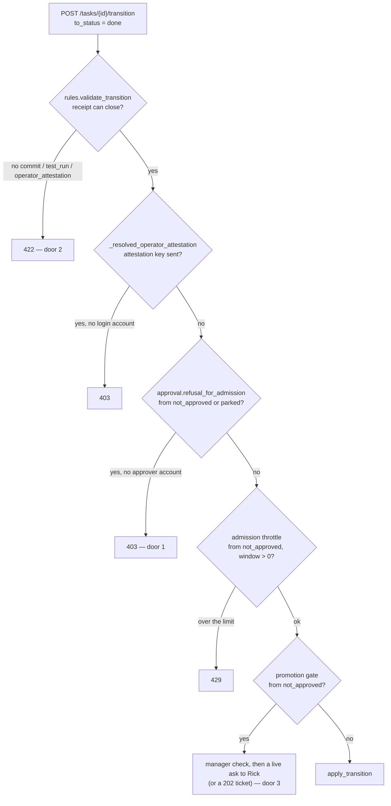

# A manager must be able to close a ticket — design (2026-09-10)

**Row**: `adaf7698` (P0, Rick) · **Author**: Rio ⚡ · **Reviewer**: Mr. Radio 🦉 · **Status**: design, no code
**Measured at**: `wip-v0.2.1-2026.08.29-cjflow-v2-followup` HEAD `2599b5ab`, by reading source only — no server, no test run.

## 1. The ruling, and the line it draws

Rick, 2026-09-09 ~19:10 EDT: *"A manager should be able to close a ticket. That is not a matter of state security."*
Rick, 2026-09-08: *"it is me and me alone not managers that gets to promote and demote task items into the live list and out of it."*

So **closing** widens to managers. **Promote, demote, un-park and won't-fix do not move.** Today those moves and the close share one gate, and that sharing is the defect.

Out of scope until Rick rules: a manager creating a row at P0 (`task_priority_firewall.OPERATOR_ONLY_PRIORITY`). It has the same shape — an API-key seat with no login account — and is noted, not built.

## 2. What a manager's close walks through today

Every agent seat authenticates with the fleet API key, so `account_email` is `None` on every request below. The gates run in this order inside `transition_task` (`src/cosa/rest/routers/tasks.py`):

### Door 2 — the closing receipt (422)

- `task_store_rules.CLOSING_RECEIPT_KEYS = CHECKABLE_RECEIPT_KEYS + ( OPERATOR_ATTESTATION_KEY, )` = `commit · test_run · operator_attestation`. Confirmed at the working branch; the constant sits right after the long comment on `OPERATOR_ATTESTATION_KEY`.
- `validate_receipt_refs( …, require_checkable=True )` applies it to every `->done` from a non-terminal status (`validate_transition`).
- A **decision row** has no commit and no test run — its product is a ruling. So a manager can close a code row with a sha, and cannot close a decision row at all.

### The attestation guard (403)

- `_resolved_operator_attestation( receipt_refs, account_email )` in `routers/tasks.py` refuses the `operator_attestation` key from any caller with no login account, and **replaces** the caller's value with the server-resolved identity. Rio's row cited this by line number on another branch; at `2599b5ab` it is the function defined right after `transition_task`.
- This is deliberate. The rules module is pure and cannot see an account, so enforcement lives in the router. **Any fix must be built in the router, not by adding a key to the rules module.**

### Door 1 — the approver gate (403)

- **Correction to the brief**: `refusal_for_admission` is **defined in `src/cosa/rest/task_approval_settings.py`**, and only **called** from `transition_task`.
- It guards four moves: won't-fix, admission out of `not_approved`, demote into `not_approved`, and un-park out of `parked`. The only door it opens is a login account mapped to an approver (`approver_persona_for_account`); the typed `actor` confers nothing since Rick's 2026-09-07 ruling (row `b8205986`).
- A `->done` trips it from **two** sources, not one:
  - `not_approved -> done` matches the **admission** clause.
  - `parked -> done` matches the **un-park** clause. The row does not mention this one.

### Door 3 — the promotion gate (403, or a live ask to Rick)

The row names two doors. There is a third on the `not_approved -> done` path. The promotion block in `transition_task` fires when enforcement is on, `item.status == not_approved` and `to_status != not_approved` — which includes `done`. So even with door 1 opened, a manager closing a held row would be checked for manager-hood and then **Rick would be asked whether to "promote" a row that is being closed**.

### The admission throttle (429)

`count_admissions_since` counts every event whose transition begins `not_approved->`, so a close out of the holding area counts as an admission. It is off when `task approval admission window seconds` is 0; I did not read the live value.

### How the store can tell an API-key seat is a manager

It can, weakly, and the mechanism already exists. `promotion_gate.manager_refusal( session_id, actor, account_persona )` returns `None` for an approver login, or when `is_manager_figure( session_id )` reads a session bridge with the manager role. The session id comes from `rules.session_id_from_created_by( payload.actor )`, and `actor` is typed by the caller. Rick accepted this for promotion as *"not quite foolproof"*; he calls closing *"not a matter of state security"*, so the same check is in proportion here.

### One risk the design has to face

`done` counts toward the create/close ratio gate: `count_created_and_closed` counts `transition LIKE '%->done'`. Won't-fix is approver-only because it counts too — a seat able to close freely can create headroom for new rows. **A manager can already do this today** on any non-held row with any sha reachable from a branch, because nothing checks that the commit relates to the row. Every option below keeps a manager's close visibly separate from a commit-backed one, so the ratio gate could exclude it later if Rick wants.

## 3. Options

All three keep the router as the place that enforces. They differ in **what receipt closes a decision row** and **how door 1 and door 3 learn that a close is not a promotion**.

### Option A — a manager attestation, resolved by the router (recommended)

**Shape**

1. New receipt key `manager_attestation` in `RECEIPT_KEY_WHITELIST` and `CLOSING_RECEIPT_KEYS`. It gets its own key rather than reusing `operator_attestation`, so a reader can tell *"a manager said so"* from *"Rick said so"* from *"commit f4e0370"*.
2. `_resolved_manager_attestation( receipt_refs, actor, account_email )` in `routers/tasks.py`, mirroring `_resolved_operator_attestation`:
   - no key → `None`
   - key present and `manager_refusal(…)` returns a refusal → **403** that names the reason (worker seat, stale bridge, or no session id) and what to do: *"ask your manager to close it, or cite a commit/test_run"*
   - otherwise → the **server-resolved** `"<persona> <session8>"`, overwriting whatever the caller typed
3. Manager-hood is resolved **once** in the router (`closer_is_manager`) and handed to both of the gates below. It is not derived a second time.
4. `refusal_for_admission( …, closer_is_manager=False )`: when `from_status == "not_approved"`, `to_status == "done"` **and** `closer_is_manager`, return `None`. It is placed **after the won't-fix clause and before the admission clause**, so a won't-fix is refused before the carve-out is ever reached, even if the carve-out is someday widened by mistake. **Nothing else gets the carve-out.** Won't-fix, queued, in_progress and not_approved still reach the unchanged clauses, and so does `parked -> done`: a park is Rick's own "not now" (Mr. Radio's ruling, 2026-09-10 17:10 EDT).
5. The promotion block's condition gains `and not ( payload.to_status == "done" and closer_is_manager )`. Rick is not asked about a close.
6. The throttle's condition gets the same exclusion, so a manager's close does not use up an admission slot.
7. Refusal messages say why and what to do. A worker's `not_approved -> done` is told that a **manager** seat may close the row. A manager's `parked -> done` is told the row is parked on Rick's ruling, and to ask Rick to un-park or close it.
8. Update the MCP `task_transition` tool description in `src/lupin_mcp/cosa_voice_mcp.py` (*"a SEAT CAN MINT EXACTLY ONE"*) to match.

**Pros**
- One mechanism for every item class — decision, task, bug, review_request, gate.
- It copies a pattern that has already been reviewed (`operator_attestation`): same layer, same "overwrite, don't just approve", same split between the pure rules and the router.
- Workers are unchanged: they are refused the key, and door 1 is unchanged for them.
- It closes all three doors plus the throttle, which a receipt-only fix does not.

**Cons**
- The receipt is the manager's word, not something a third party can check.
- The credential is the session bridge behind a caller-typed session id. A seat that types a manager's session id passes, which is the weakness Rick already accepted for promotion.
- `refusal_for_admission` gets a new parameter. Its many existing callers keep today's behaviour because it defaults to `False`, but the signature does move.

### Option B — the answered question id closes a decision row

**Shape**: the same door-1, door-3 and throttle carve-out as A (steps 3–7), but no new key. A `qid` becomes a closing receipt when the router confirms that notification exists, asked for a response, and has `responded_at` set. Code rows still need a commit or test_run.

**Pros**
- The close carries evidence anyone can open: Rick's actual answer.
- A manager cannot close a decision row on their word alone, which resists inflating the ratio gate.

**Cons**
- A ruling Rick gives in conversation, outside an ask, has no qid.
- The transition path gains a read of the notifications table.
- The notification model has `responded_at` and `response_default` but **no default-used flag**. Whether a timed-out default is distinguishable from a keypress is unmeasured, and if it is not, a qid proves only that a timer expired.
- Rows that are neither code nor decision (reviews, investigations) still cannot close.

### Option C — a rules-only rule that varies by item class

**Shape**: `validate_receipt_refs` accepts `qid` or `doc_path` as closing when `item_class == "decision"`.

**Pros**: smallest change; pure and cheap to test.

**Cons**
- It checks shape only: any UUID closes any decision row, for workers too.
- It does not touch door 1 or door 3, so a held decision row is still refused. This is exactly the patch the row warns against — *"changes the shape check and leaves the router refusal exactly where it is."*

**Rejected.** Listed because it is the obvious first idea.

## 4. Recommendation

**Option A** — it is the only option that closes every door for every item class while leaving workers, promote and demote exactly as they are, and it reuses the attestation pattern the fleet has already reviewed.

Option B's answered-qid check can be added later as a stronger receipt for decision rows, if Rick wants a manager's close to carry evidence.

**Ruled in review** (Mr. Radio 🦉, 2026-09-10 17:10 EDT): `parked -> done` stays **out** of the carve-out, because a park is Rick's not-now ruling. A close must never raise a promotion ask, so close transitions go around the promotion gate.

## 5. Tests that would prove it (Option A)

Door-level tests go through `TestClient` on the real router. That is where door 1 was once found wired to nothing, so it is the layer to test at.

### Promote and demote unchanged — named, with a manager seat (bridge resolves manager, **no** login account)

| test | edge | expect |
|---|---|---|
| `test_a_manager_seat_still_cannot_PROMOTE_out_of_holding` | `not_approved -> queued` | 403 from door 1, `apply_transition` not called |
| `test_a_manager_seat_still_cannot_DEMOTE_into_holding` | `queued -> not_approved` | 403, detail names *"demoting a row back into"* |
| `test_a_manager_seat_still_cannot_UNPARK` | `parked -> queued` | 403 |
| `test_a_manager_seat_still_cannot_WONT_FIX` | `queued -> wont_fix` | 403 |
| `test_a_manager_seat_still_cannot_close_a_PARKED_row` | `parked -> done` | 403; detail names the park and says to ask Rick |
| `test_a_manager_seat_still_cannot_WONT_FIX_a_HELD_row` | `not_approved -> wont_fix` | 403; detail names won't-fix |

These existing tests must stay green **unedited**: `test_a_non_approver_is_refused_AT_THE_DOOR`, `test_a_non_approver_cannot_DEMOTE_a_row_AT_THE_DOOR`, `test_a_non_approver_cannot_close_a_row_as_wont_fix_AT_THE_DOOR`, `test_an_APPROVER_may_demote_through_the_same_door`, `test_a_non_approver_is_refused_a_demote_from_every_demotable_status`, `test_un_parking_is_REFUSED_for_a_non_approver`, `test_promoting_out_of_holding_reaches_the_gate_at_all`, `test_an_api_key_caller_cannot_mint_an_attestation`, `test_the_agent_receipt_rule_is_UNCHANGED_by_this_widening`.

### Positive arms

- `test_a_manager_seat_closes_a_HELD_row_with_a_commit` — `not_approved -> done`, commit receipt → 200.
- `test_a_manager_seat_closes_a_DECISION_row_on_its_own_attestation` — `manager_attestation` only → 200. This names the receipt that closes a decision row.
- `test_a_manager_close_does_not_ask_rick` — the promotion ask spy records zero calls.
- `test_the_recorded_manager_attestation_is_the_SERVERS_identity` — the caller types `"rick"`; the ledger records the resolved manager.

### Refusal arms

- `test_a_worker_seat_cannot_mint_a_manager_attestation` — 403 whose detail says why and what to do.
- `test_a_worker_seat_still_cannot_close_a_held_row` — door 1 unchanged for a non-manager, and the detail names *"a manager may close it"*.

### Revert arms (each off a recorded green baseline; snapshot the file, mutate, run, restore from the snapshot, check the sha)

| # | mutation | must redden | must stay green |
|---|---|---|---|
| R1 | delete the `done` carve-out in `refusal_for_admission` | held-row close, decision close | every "still cannot" arm |
| R2 | carve-out ignores `closer_is_manager` | `test_a_worker_seat_still_cannot_close_a_held_row` | manager positives |
| R3 | the carve-out's `to_status == "done"` widened to any destination | `test_a_manager_seat_still_cannot_PROMOTE_out_of_holding` **only** | demote and un-park (they start from `queued` and `parked`, and the carve-out still requires `not_approved`); both won't-fix arms (the won't-fix clause runs first); parked close; manager positives |
| R4 | `_resolved_manager_attestation` returns the caller's string | `…_is_the_SERVERS_identity` | — |
| R5 | `manager_attestation` removed from `CLOSING_RECEIPT_KEYS` | decision close (422) | commit close |
| R6 | promotion-gate exclusion removed | `test_a_manager_close_does_not_ask_rick` | — |
| R7 | the carve-out's `from_status == "not_approved"` clause removed | `test_a_manager_seat_still_cannot_close_a_PARKED_row` | held-row close |
| R8 | R3's widened carve-out moved **above** the won't-fix clause | `test_a_manager_seat_still_cannot_WONT_FIX_a_HELD_row` | `test_a_manager_seat_still_cannot_WONT_FIX` (it starts from `queued`) |
| R9 | the carve-out keyed on manager-hood alone (both status conditions dropped), still after won't-fix | promote, demote, un-park, parked close | both won't-fix arms |

⚠️ **Moving the carve-out above the won't-fix clause without widening it is an equivalent mutant.** `to_status == "done"` can never match a won't-fix, so that mutant survives every test, and that is expected. R8 is the arm that shows the placement matters.

Coverage: 100% lines, branches and functions on every touched file.

## 6. What I did not measure

- **No test and no server run.** Everything above comes from reading source at `2599b5ab`.
- `refusal_for_pull` — I read its surrounding comment (*"a pull is `queued -> in_progress`"*), not its body, so I have not proven it stays silent on `->done`.
- Whether holding-area enforcement and the admission window are **on** in the live config. The row's own 403 shows enforcement was on at the time it was filed.
- ~~Whether the MCP `task_transition` tool sends an `actor` carrying the seat's real session id.~~ **Measured after posting, 2026-09-10**: the tool's docstring says *"`actor` is NOT a parameter — bridge-stamped"*, and it passes `actor = _task_store_identity()`. My own `task_amend` on this row wrote event 13261 with actor `"Rio 3a295d1a"`, which is persona plus session id. So an MCP seat does hand the manager check a real session id. A raw API caller can still type any actor.
- Whether the existing door-test fixtures can patch manager-hood. `manager_refusal` binds `is_manager_fn` as a default argument, so patching the module attribute would not reach it. Phase 2 needs a seam the tests can patch.
- Whether a timed-out default sets `responded_at` (Option B depends on this).
- How many of the 22 holding-area rows are decision rows.
- Whether a worker can read a manager's session id from the event ledger. I believe event actors carry it, but I did not query.
