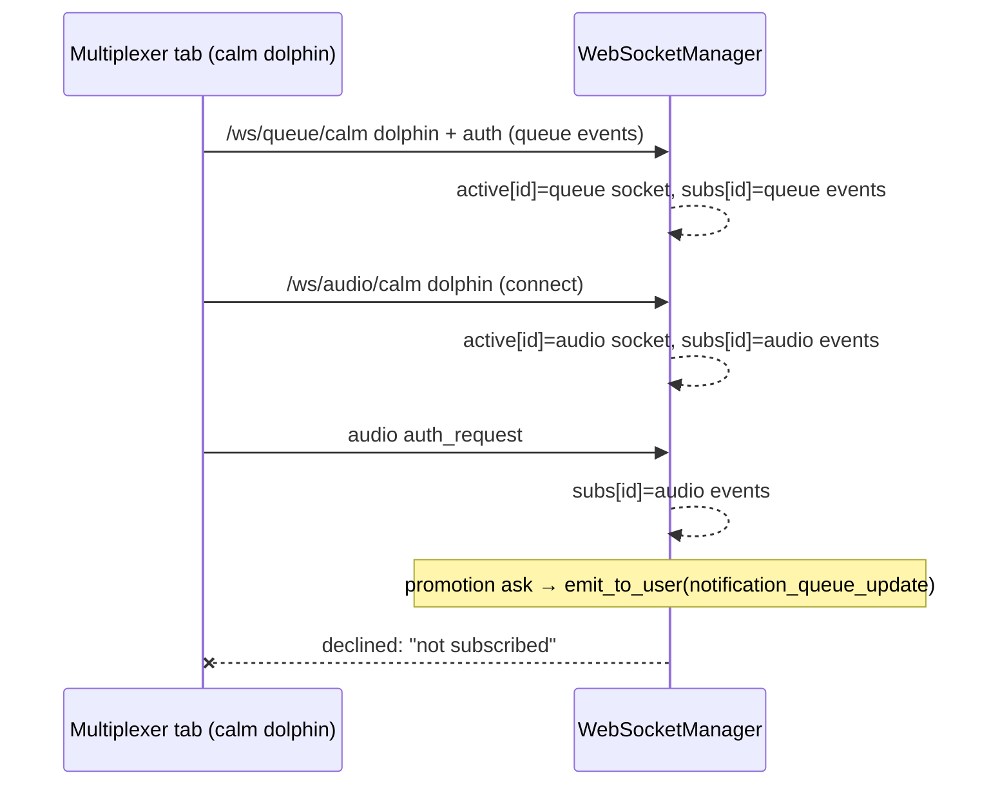

# 2026.09.10 — The multiplexer misses the petition ask (row d2b1b59a, FINDING 5)

**Author**: Chloé 🗼 (ef3600ec), on Mr. Radio 🦉's crew · **Phase 1: measure, no fix**
**Code read at**: `wip-v0.2.1-2026.08.29-cjflow-v2-followup` @ `e4c49fd2` · **Logs**: `docker logs lupin-rest-dev`, read 2026-09-10 ~17:45–18:05 EDT

## Verdict

**The multiplexer's live socket never receives the ask — or any other notification.** The multiplexer opens its queue socket and its audio socket under **one** session id. The server keeps one socket and one subscription list per session id, so whichever socket registers last wins. When the audio socket wins, which it did for the whole petition drive, the server drops every notification event for that tab with "not subscribed". Nothing about promotion asks, `human_only` or the sender is involved.

## (1) Only petition asks, or every ask? — **every ask, and every notification** (measured)

The multiplexer tab is WebSocket session **calm dolphin**. Measured: `GET /app/multiplexer` at 21:30:23.782Z, then `/ws/queue/calm dolphin` connected at 21:30:23.859Z. The legacy page is **foolish goat** (queue socket) plus **slow zebra** (audio socket), which connected together at 21:23:06Z.

Every `emit_to_user` to Rick from 21:30:23Z through 21:37:48Z logged `delivered=1, declined=2 (slow zebra, calm dolphin)`:

| notification | kind | `human_only` | calm dolphin |
|---|---|---|---|
| `bb290a48` 21:28:57Z | petition arm 1 (promotion ask) | True | declined |
| `74fdc7a7` 21:28:43Z | María's self-respin ask (a seat's POST /api/notify) | True | declined |
| `933bfcec` 21:30:29Z | ordinary 2-question ask | **False** | declined |
| `d428aea0` 21:31:24Z | ordinary multiple-choice ask | **False** | declined |
| `e056883f` 21:34:44Z | petition arm 2 | True | declined |
| `84f2aa45` 21:35:19Z | petition arm 3 | True | declined |
| `7861243f` 21:37:48Z | ordinary ask | **False** | declined |
| also | `notification_responded` 21:33:19Z, 21:34:22Z · `notification_expired` 21:37:19Z | — | declined |

Declining slow zebra is correct: it is legacy's audio-only socket, the case already explained in row 88347f65. Declining calm dolphin is the defect.

## (2) Received but not rendered, or never received? — **never received** (measured on the server; client side from a code read)

The drop happens in `WebSocketManager.emit_to_user` (`src/cosa/rest/websocket_manager.py`, the `if "*" in subscriptions or event in subscriptions:` branch) **before any frame is sent**. So there is nothing for a client-side filter to drop.

**Mechanism (measured by code read and matched to the log order):**

- The multiplexer passes the same id to both transports: `boot.ts` → `transports.queue.start(sessionId);` then `transports.audio.start(sessionId, …)`. Legacy uses two ids: `notifications.js` → `getOrCreateSessionId( 'queue' )` / `getOrCreateSessionId( 'audio' )`. The existing guard `src/tests/unit/test_ws_audio_session_id_is_not_shared_by_every_client.py` already records that the multiplexer and mobile share one id and legacy does not.
- The server keys both maps by session id alone, and three writes race for them:

| write | where (anchor text) | sets `active_connections[id]` | sets `session_subscriptions[id]` |
|---|---|---|---|
| queue auth | `websocket.py` → `websocket_manager.connect( websocket, session_id, user_id, subscribed_events, …` | queue socket | queue events, including `notification_queue_update` |
| audio connect | `websocket.py` → `websocket_manager.connect(websocket, session_id, user_id, subscribed_events=audio_events)` | **audio socket** | **audio events only** |
| audio auth | `websocket.py` → `websocket_manager.session_subscriptions[ session_id ] = valid_events` | — | **audio events only** |

- The subscription list only works if the queue auth lands last. Measured orders:
  - 21:30:23Z: queue auth connect .919 → audio connect .927 → audio auth .940. **The audio socket wins, so the tab is deaf.** This covers the whole drive.
  - 19:39:08Z: audio connect .6965 → queue connect .6978 → audio auth .713. The audio auth overwrote the list, so the tab was deaf.
  - 14:35:18Z: a lone queue reconnect after the audio auth at 14:35:12. **The queue socket wins, so the tab worked.** This is the `delivered=2` stretch at 15h.
- The hourly histogram since 09-09 shows the multiplexer flipping between receiving (`delivered=2`) and deaf (`declined=2`) at each reconnect. **It has been intermittent since at least 09-09 16h**, not new today.

**Client side (inferred from a code read, not driven):**
- `ActionRequiredStore.onQueueUpdate` filters only on `response_requested !== true`, a missing id, and dedup.
- `human_only` appears in 0 tracked non-test multiplexer `.ts` files (`git grep`; untracked files are not visible to it).
- No filter by sender, type or `human_only` exists, so the ask would render if the frame arrived.

**Side effect (inferred, not measured):** the same map decides where TTS audio goes (`speech.py` → `ws_manager.active_connections.get(session_id)` → `send_bytes`). In the stretches when the queue socket wins, the multiplexer's audio would go to its queue socket. The tab gets live notifications or TTS audio, never both at once. Mobile also reuses one id, so it likely has the same defect; that is not measured.

## (3) Smallest fix and the test that proves it

**Fix — client, legacy parity:** give the multiplexer its own audio session id, as `notifications.js` already does.

In `boot.ts`, create and store a second id. Pass it to `transports.audio.start(…)` and to `wireTtsPlayback(…)`, since TTS audio is routed by that id. `transports.queue.start` and the jobs pane's `websocketId` keep the queue id.

The server-side alternative is to key connections by id and channel. That touches `emit_to_user`, `disconnect`, every `send_bytes` caller and mobile. It is larger, so it should be a separate call.

**Tests, at the layer where the defect enters:**
1. **TS unit test (boot wiring), deterministic:**
   - Assert `transports.queue.start` and `transports.audio.start` get **different** ids.
   - Assert `wireTtsPlayback` gets the audio id.
   - Revert arm: pass the shared id again, and exactly this test turns red.
2. **WebSocket smoke on :7999** (read-only, under 2 min), in the order that fails today:
   - Open `/ws/queue/<queueId>` and authenticate for `notification_queue_update`.
   - Then open `/ws/audio/<audioId>` and authenticate.
   - Call `emit_to_user( notification_queue_update )`. Assert the queue socket receives it and `declined` names only the audio session.
   - Control arm: use `audioId == queueId` and watch the queue socket receive nothing. This is today's defect, reproduced on demand.
3. **E2E on :8000, scheduled** (drives the assembled page, which is where the incident happened):
   - Load `/app/multiplexer`, wait for both sockets, then raise a `yes_no` ask.
   - Assert the Action Required card renders.
   - Then force an audio-socket reconnect and assert a second ask still renders.

## Gaps

- The client render path is from a code read only. No frame reached the multiplexer during the drive, so nothing tested it live.
- The TTS side effect and the mobile client are inferred, not measured.
