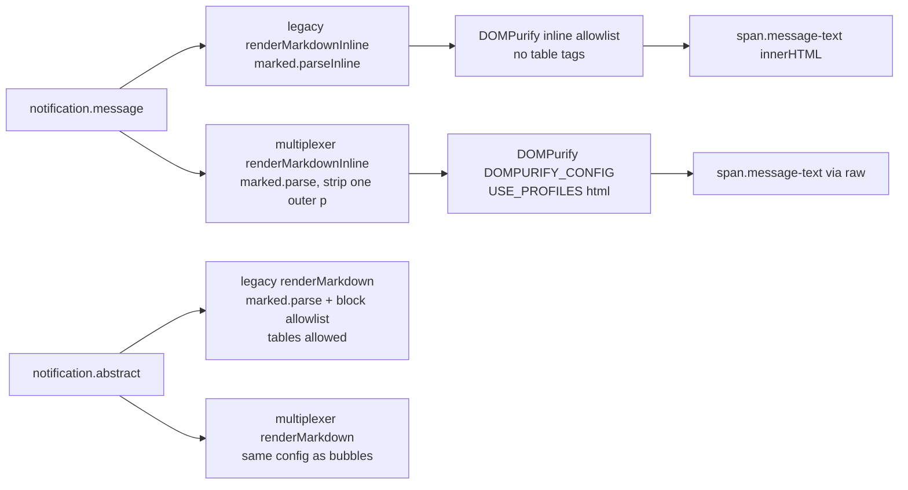

# Markdown tables in notification bubbles — design

Row `5ae3ce90` (Rick, P1). Written by Rio ⚡ (session 8450aa99) for Mr. Radio's design review,
2026-09-10 ~21:15 EDT. Code read at wip `e6de44da`; the served multiplexer bundle read at
`boot.87973010ab03.js` (built 2026-09-11T01:09Z). **No code changed.**

## Verdict

- **Legacy bubbles cannot render a table today, and the library is not the reason.** The vendored
  `marked` 15.0.12 already parses GFM tables. The legacy bubble path calls `marked.parseInline`,
  which never builds block structure, and then sanitizes with an allowlist that has no table
  tags. Measured in Chromium: Rick's table in, zero `<table>` out.
- **The multiplexer bubble path does build a table from the same text.** Measured in Chromium
  and in the served bundle. That contradicts Rick's report for that client, and **the reason is
  not measured** — see §6, Step 0.
- **The multiplexer's sanitizer is wider than its config reads.** `USE_PROFILES: { html: true }`
  makes DOMPurify ignore the explicit `ALLOWED_TAGS` / `ALLOWED_ATTR`. Measured in Chromium, the
  shipped config lets `<form>`, `<input>`, `<button>`, `<style>`, `style=` and `<details>`
  through. No script vector survived any config.
- **Recommendation:** one shared bubble renderer for both clients: block `marked.parse` plus an
  explicit, narrow allowlist that adds only the table tags. Drop `USE_PROFILES`, add bubble table
  CSS, and pin the sanitizer in a real browser, because the unit tests' DOM cannot sanitize (§3.4).
  Do not swap libraries.

## 1. The population — what real traffic looks like

Read-only query against `lupin_db_dev`, last 7 days (2026-09-04 → 2026-09-11 01:07Z), rows whose
`message` or `abstract` contains `|---`:

| field | rows with a table | real newline `\n` | literal backslash-n |
|---|---|---|---|
| `message` (the bubble) | 327 | 326 | 0 |
| `abstract` | 2,951 | 2,951 | 0 |

So a table in a bubble is not rare: 327 in a week. The stored text carries real newlines. Rick's
example is row `eb1d7721` (sender `claude.code@plan.deepily.ai#abe7d752`, 2026-09-11 00:18:33Z):
type `progress`, no `progress_group_id`, table in `message`, no abstract.

⚠️ This census covers the **database**, not the live WebSocket frame. Whether a live push carries
the same bytes is not measured.

## 2. Where bubble text reaches the DOM



| surface | legacy `notifications.js` | multiplexer |
|---|---|---|
| conversation bubble | `renderMarkdownInline` (`addMessageToDateAccordion`, `addMessageToSenderCard`, `updateSenderProgressGroupEntry`) | `render/templates/notificationItem.ts` → `renderMarkdownInline` (flat and progress-group rows) |
| progress-group history entry | — | `NotificationsListRenderer.ts` `.activity-message` — auto-escaped plain text, no markdown |
| abstract tooltip / Reading Pane / job-card abstract | `renderMarkdown` (block) | `ReadingPaneRenderer.ts` → `renderMarkdown` |
| action-required prompt | `renderMarkdown` (block) | `textContent` — plain text |

Legacy has one escape hatch: `renderMarkdownInline` hands a message containing a ` ``` ` fence to
the block renderer. A table in the same message as a code fence therefore renders; a table on its
own does not.

## 3. What each client supports today — measured, not read

### 3.1 Rendering (Chromium 145, vendored `marked.min.js` + `purify.min.js`, each client's config lifted from source)

| input | legacy inline (bubble) | legacy block (abstract) | multiplexer inline (bubble) |
|---|---|---|---|
| Rick's table, real newlines | **0 tables** — pipes joined by `<br>` | 1 table | 1 table |
| Rick's table, literal `\n` | 0 tables | 1 table (it normalises `\\n` first) | **0 tables** (no normalisation) |

The same result came from happy-dom running the real legacy `renderMarkdownInline` / `renderMarkdown`
and the real multiplexer `markdown.ts`.

### 3.2 The served multiplexer bundle is not stale

`static/dist/multiplexer/manifest.json` → `boot.87973010ab03.js`, built 2026-09-11T01:09Z. It has
zero occurrences of `parseInline`, and contains
`parse(n,{breaks:!0,gfm:!0}),o=t.sanitize(i,Li).replace(/^\s*<p>([\s\S]*?)<\/p>\s*$/i,"$1")`
plus `USE_PROFILES:{html:!0}`. The `marked.parse(text, { breaks: true, gfm: true })` line in
`markdown.ts` has been there since `53fef419` (2026-06-19).

### 3.3 Sanitization (Chromium 145, `DOMPurify.isSupported === true`)

Payload: ``, `<form action>` with `<input>` and `<button formaction>`, `<style>`,
`<iframe>`, `<svg onload>`, `<a href="javascript:">`, `<div onclick style="position:fixed;inset:0">`,
a `<table>`, `<details ontoggle>`. Counts of what survived:

| config | table | img | form | input | button | `<style>` | `style=` | iframe | svg | details | `on*` handlers | `javascript:` href |
|---|---|---|---|---|---|---|---|---|---|---|---|---|
| legacy block | 1 | 0 | 0 | 0 | 0 | 0 | 0 | 0 | 0 | 0 | 0 | 0 |
| legacy inline | 0 | 0 | 0 | 0 | 0 | 0 | 0 | 0 | 0 | 0 | 0 | 0 |
| **multiplexer as shipped** | 1 | 1 | **1** | **1** | **1** | **1** | **1** | 0 | 0 | **1** | 0 | 0 |
| multiplexer without `USE_PROFILES` | 1 | 1 | 0 | 0 | 0 | 0 | 0 | 0 | 0 | 0 | 0 | 0 |
| DOMPurify default | 1 | 1 | 1 | 1 | 1 | 1 | 1 | 0 | 1 | 1 | 0 | 0 |

Read it as two separate facts:

- **No script execution survived any config.** DOMPurify's core stripping of handlers and
  `javascript:` URLs holds regardless of the allowlist.
- **The shipped multiplexer config admits page-altering HTML.** A sender can inject a `<style>`
  that restyles the whole multiplexer page, a full-viewport `style=` overlay, or a fake form. That
  is content injection and UI redress, not script XSS. It comes from `USE_PROFILES`: removing it
  alone narrows the output to the explicit list (table + img).

### 3.4 The unit-test DOM cannot sanitize

Under happy-dom, DOMPurify's **default** config returned `onclick` and `javascript:` intact. So
happy-dom does not give DOMPurify a working sanitizing DOM, and no unit test running there can
assert XSS behaviour. `abstract_markdown_tables.test.ts` already notes that `<script>` is not
stripped there. The multiplexer's `markdown.test.ts` fakes both libraries. **Today nothing in the
suite measures what the browser's sanitizer lets through.**

### 3.5 Styling

There is table CSS for abstracts (`.abstract-content`, `.abstract-tooltip-content`,
`.action-required-abstract`) and **none for `.message-text`** in any stylesheet, legacy or
multiplexer. A table that renders in a bubble today renders unstyled: no borders, no overflow
handling.

### 3.6 Content-Security-Policy

None is set. `add_security_headers` in `src/lupin_app/main.py` sends `nosniff`, `X-Frame-Options`,
`X-XSS-Protection` and HSTS only. No `<meta http-equiv>` in `static/html`. The sanitizer is the
only control between a sender's text and the page.

### 3.7 lupin-mobile

The abstract renders through `flutter_markdown_plus` (`MarkdownBody`, GitHub-flavoured by
default, tables included). The message is plain `Text`. There is no HTML, so no sanitizer is
needed. Out of scope for this row except as a parity note: mobile bubbles do not render markdown
at all.

## 4. Found on the way — not this row

Two legacy insertions put sender-controlled text into `innerHTML` **with no escaping and no
sanitizer** (verified at `e6de44da`):

- `renderActionRequiredNotification`: `` `<div class="action-required-title">${projectBadge}${notification.title || notification.message}</div>` ``
- `renderMultipleChoiceUI`: `` `<div class="mc-question-text">${question.question}</div>` ``

Those are script-XSS shaped, unlike §3.3. They belong on their own row under
`epic:authz-and-sandboxing`, not folded into a rendering feature.

## 5. Options

| | option | pros | cons |
|---|---|---|---|
| **A** | **Shared bubble renderer** (recommended): one `static/js/shared/markdown-bubble.js` used by both clients. Block `marked.parse` with `gfm`, `breaks`, literal-`\\n` normalisation and outer-`<p>` stripping; an explicit allowlist = today's legacy inline tags + `p`, `ul`, `ol`, `li`, `pre`, `blockquote`, `table`, `thead`, `tbody`, `tr`, `th`, `td`; `href`/`title`/`target`/`rel` only; **no `USE_PROFILES`**. Bubble table CSS in the shared surface stylesheet | One allowlist, so the clients cannot drift again (they already have: §3.3). Closes the widening. Tables and lists in bubbles on both clients | Touches both clients and every bubble. Paragraph and list output changes bubble height, so visual baselines move |
| B | Minimal per-client patch: legacy inline switches to `marked.parse` + table tags; multiplexer drops `USE_PROFILES`; add CSS in each | Smallest diff; ships fastest | Two configs keep drifting — the multiplexer file still claims to be a "verbatim port" of a config that has since diverged |
| C | Tables only: detect a GFM table (header line + `|---` line) and send only those messages through the block renderer, as legacy already does for code fences | Other bubbles keep their current look exactly | A third rendering rule to reason about. Detection is a regex and will misfire on edge text |
| D | Swap the library (markdown-it, micromark) as the row suggests | — | The library already parses tables. It changes nothing about the two causes, `parseInline` and the allowlist, and adds a vendoring change with new sanitizer interplay |

## 6. Recommendation and plan

**Option A**, in this order:

0. **Close the multiplexer discrepancy before building.** Read the DOM of the bubble for row
   `eb1d7721` on the live multiplexer, either with a Playwright run fed that row through the real
   WebSocket push or on Rick's own page with his permission. If `<table>` is present, the report
   is about styling (no CSS, §3.5). If it is absent, the live frame's bytes differ from the stored
   row (§1 caveat), and the fix must normalise escaped newlines on that path too. **The venue is
   Mr. Radio's call**: a Playwright login writes a refresh-token row.
1. **Sanitizer fix first, standalone:** drop `USE_PROFILES` from the multiplexer config. It is a
   security narrowing that stands on its own, whatever is decided about tables.
2. **Shared renderer + CSS**, then point both clients at it. Delete the stale "verbatim port"
   comments.
3. **File §4** as its own row.

### Acceptance tests

| tier | test | pins |
|---|---|---|
| unit (happy-dom) | Rick's table through each client's bubble path → one `<table>`, 3 columns, row count right | rendering, both clients |
| unit | a prose line with a pipe renders no table (positive control, as `abstract_markdown_tables.test.ts` does) | no false tables |
| unit | the allowlist is exactly the listed tags and attributes, and has no `USE_PROFILES` | the config cannot re-widen silently |
| **real browser** (Playwright/Chromium, no server — `page.set_content` + the vendored files, as this doc's measurement did) | the §3.3 payload through the shared renderer → only table and text survive; no `on*`, no `javascript:`, no form, style or overlay | the sanitizer, where it actually runs |
| E2E UI (`:8000` scheduled) | a stored notification with Rick's table shows a bordered table in the bubble on both clients | the assembled app |
| revert arms | put `parseInline` back → rendering test red; re-add `USE_PROFILES` → the real-browser test red | each guard discriminates |

## 7. Not measured

- Why Rick sees raw pipes in the multiplexer (§6, Step 0).
- Whether the live WebSocket frame's `message` bytes match the stored row.
- Visual-baseline impact of paragraph and list output in bubbles.
- Any other page (`document-viewer.html`, `broadcast-panel.js`) that shares the vendored
  libraries. They were read for the census only, not measured.

## Measurement artifacts

Session scratchpad (`/tmp/claude-1001/-mnt-DATA01-include-www-deepily-ai-projects-lupin-wt-cc-author-mr-radio-1/8450aa99-63ef-41cb-8898-4eb4b565bde7/scratchpad/`):
`purify_chromium.py` (§3.1, §3.3), `zz_probe_markdown_tables.tmp.test.ts` (happy-dom cross-check),
`probe_rows.py` (§1).
