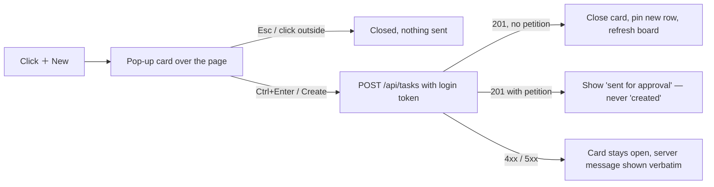

# Rick's Own New Ticket Card — Mini Plan

**Date**: 2026-09-10
**Author**: Mr. Radio 🦉 (session d54262de)
**Row**: `5a1b903e` (filed P1 with a P0 petition, ticket `7ad11385`)
**Status**: plan only — nothing built. Three open questions for Rick (§6).

> Rick, by voice, ~10:48 EDT: *"create a card that allows me to manually create a new ticket without you having to file it for me … I can put it straight into your live queue as a P0 for example … within the task list bar right next to the find functionality."*

## 1. Where it lives — both clients

| client | file | placement |
|---|---|---|
| Multiplexer | `src/lupin_app/static/js/multiplexer/render/TaskListRenderer.ts` → `mount()` | new `＋ New` button in the section-header actions, directly after the Find box: `[ lookup, newTicketBtn, refresh, collapse-all, expand-all, updated ]` |
| Legacy notifications client | `src/lupin_app/static/html/notifications.html` (the `.task-lookup` row) + `notifications.js` | button right after the 🔎 Find button, handler on `window.notificationsUI` |

## 2. How it opens



Reuse the multiplexer's task-body overlay pattern (`openTaskBodyOverlay`): backdrop + panel, Escape or backdrop click dismisses, `createElement` / `textContent` only. Title field focused on open.

## 3. Fields — updated on Rick's ruling (§6)

| field | stored as | default |
|---|---|---|
| Title (required) | `title` | — |
| **Details** — prominent multi-line field for background material | `body` | — |
| Assigned to | `owner_persona` | — |
| Accountable manager | `accountable_manager` | — |
| Priority P0–P5 | `priority` | **P2** |
| Approved / Not approved | `status`: `queued` / `not_approved` | **Approved** (live board) |
| Type | `item_class`: task / bug / decision | task |
| Epic key | `correlation_key` | — |
| Project | `project` | `lupin` |

## 4. Submit

`POST /api/tasks` with the Bearer login token both clients already send:

```json
{ "item_class": "task", "title": "…", "body": "…", "project": "lupin",
  "created_by": "rick <client session>", "priority": "P0", "status": "queued",
  "owner_persona": "…", "accountable_manager": "…", "correlation_key": "…" }
```

## 5. Server — measured at `97a65464`, 2026-09-10

| question | answer | where |
|---|---|---|
| May Rick's login create at P0? | yes — `refusal_for_priority_create` returns None when `caller_is_operator` | `task_priority_firewall.py` |
| Does an explicit `status: queued` skip the holding area? | yes — the default applies only when `status` is not in `model_fields_set` | `routers/tasks.py` `create_task` |
| Can the ratio gate refuse him? | **yes, for P1–P5** — only P0 is exempt | `routers/tasks.py` `create_task` |

The server stays the control. The button grants nothing; seats and workers keep their priority floors.

## 6. Rick's rulings — by keypress, 2026-09-10 ~11:10 EDT

1. Default priority: **P2**.
2. Default destination: **live board** (approved).
3. Ratio gate: *"Yes my own tickets should skip the ratio gate and get logged."* → server change in scope: operator creates exempt, logged like the P0 exemption.

Added, verbatim: *"not only does this editor card need a title but it also needs a comments section … details … that allows me to give you background material … In addition to that it needs all of the other editor fields like who it's assigned to, priority, approved/disapproved by default approved etc."* → §3 updated.

Row: `c9895403` (P0, in progress). `5a1b903e` is the superseded first filing.

## 7. Tests — 100% lines/branches/functions

- **TypeScript unit**: button sits directly after Find; card opens and closes; payload shape; an error keeps the form; a petition response is not rendered as created.
- **Python unit at the real door**: Rick's token + P0 + queued → 201, queued, P0 · manager API key + P0 → petition, not a grant · worker P1 → 403.
- **Parity guard**: both clients offer the same field list.
- **E2E (Playwright, :8000 scheduled)**: click New → create → row on the board in both clients.

## 8. Coordination

`npm run build` is repo-global (row `6444feeb`). María 🌸 is building multiplexer TypeScript today for her own P0 — DM before any build. Skeleton crew: managers build.
