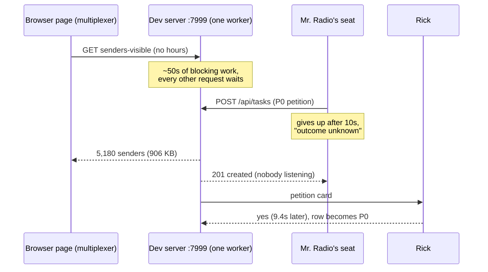

# One notifications call freezes the whole dev server for ~50 seconds

**Date**: 2026-09-10 · **Author**: Mr. Radio 🦉 (seat d54262de) · **Bug rows**: `41da77bb` (mine, filed 14:52 EDT) and `8f4fbf2d` (María's earlier row for the same server defect, handed to me 14:53) · **Found while driving**: P0 row `d2b1b59a` (a manager files a P0 for Rick only at his request)

All figures were measured on `:7999` (container `lupin-rest-dev`) on 2026-09-10, between 10:35 and 14:55 EDT. The log times quoted below are UTC; EDT is UTC minus 4.

---

## 1. The short version

- **"senders-visible"** is the call a notifications page makes to build its list of senders. A sender is every Claude Code session or agent that has ever sent Rick a notification, which is **5,180** of them today.
- If a page asks **without a time window** (no `hours`), the server takes **~52 seconds** to answer. For that whole time it does **nothing else**: no health checks, no notifies, no DMs, no task creates, for anyone in the fleet.
- **I am not the one calling it.** The browser pages call it on load and after a reconnect. I called it by hand once, only to time it.
- It surfaced because my P0 petition from this morning **timed out after 10 seconds**. The petition code was fine. The server was frozen by one of these calls at the same moment.

## 2. How a P0 filing led here

Rick asked me by voice (~10:35 EDT) to file a P0 ticket. A manager cannot mint a P0 directly. The sanctioned door is the **petition**: the row is created at P1, and Rick gets an approve/decline card to raise it to P0.

1. I filed it. My tool reported **"server read timeout, outcome unknown"** after 10 seconds.
2. The row had in fact been created, the card reached Rick, and he approved it 9.4 seconds later. The row is P0 now. The only failure was my seat not seeing the answer.
3. **My first theory was wrong.** I thought the server held the create open while it waited for Rick. It does not: the create answers at once and runs the ask in the background. I also ruled out the web middleware holding the reply (a throwaway server answered in 0.00s).
4. **What the log showed**: **26 seconds of total silence** (14:35:47 → 14:36:13 UTC), not a single line from any request. The line that broke the silence was `Returning 5180 visible senders for ricardo…`. My petition create was logged half a second later, in a burst of requests that had all been waiting.
5. I then timed the call by hand. That is section 3.

## 3. What was measured

| Test | Result |
|---|---|
| senders-visible, **no hours** | 200 OK · 906,720 bytes · **51.9 s** |
| `/health` sent while it ran | waited **40.0 s** (hit its own timeout), the next one **11.9 s**, i.e. until the call finished |
| senders-visible **with `?hours=48`** | 200 OK · 14,206 bytes · **1.0 s** · `/health` alongside it 1.02 s |
| Calls in the last 6 h (docker log) | **19 without hours**, 17 with |

The 19 calls without hours arrived in back-to-back pairs about 1 to 1.6 minutes apart. The UTC pairs were 14:35/14:36, 14:40/14:42, 14:43/14:44, 14:47/14:48, 14:50/14:51, 15:57/15:58, 16:08/16:09, 16:15/16:16 and 16:22/16:23. **Why they come in pairs has not been measured.**

## 4. Why it is slow, and why it freezes everything

The route is `get_visible_senders` in `src/cosa/rest/routers/notifications.py`.

1. **It freezes everything** because the handler is declared `async def` but does only blocking work, with no `await` and no thread pool. The dev server runs **one** worker process (`workers=1` in `main.py`, kept for the in-memory pending-response table). A blocking async handler therefore holds the only event loop, and every request waits behind it.
2. **It is slow** because, after the database query, it loops over **every** sender and looks up two badges for each one:
   - the sender's own voice persona (the icon and color on its card), via `session_bridge.get_voice_persona`;
   - its spawning manager's persona (the manager badge), via `voice_persona._resolve_manager_persona`.
3. Both lookups call `find_session_path_by_id`, which **scans the whole `~/.claude/sessions` directory** for a matching `cc-*.json` bridge file. A worker costs a third scan, for its manager's persona.
4. That directory holds **7,475 files**, and only **2** of them are live bridge files. **6,866** are leftovers named `cc-listener-*`: 2,588 `.stderr`, 2,566 `.log` and 1,711 `.spawn-lock`. Who writes them, and who should clean them up, has not been measured.
5. One lookup takes **3.92 ms** inside the container. Two lookups × 5,180 senders ≈ **40.6 s** of the 51.9 s.
6. The optional `hours` filter runs **before** the loop. With a window, only a few dozen senders get looked up, which is why `?hours=48` takes one second.

## 5. Who sends the call without hours

| Client | Path | Sends `hours`? |
|---|---|---|
| Multiplexer | `stores/coldHistoryHydration.ts` `run()`, on page load | **No**, even though it already has `effectiveHours` in hand |
| Multiplexer | `stores/StripReconnectRehydrator.ts` `rehydrate()`, after a queue-socket reconnect | **No** |
| Legacy notifications page | `notifications.js` `loadConversationHistory()` | Yes, **except when the history window is "all time"**: `getEffectiveHoursForQuery()` returns null and the call goes out without hours |

Which browser tab sent today's 19 calls is **not proven**. The log names Rick's email, not the tab.

María's commit `a11575b1` (P0 `5ebd2aff`, reviewed and approved by me) replaced the multiplexer's 10-second give-up with a wait for the real answer, so her Notifications pane stops showing an empty list. As a result the page now also **waits** the full 52 seconds. The server did the full 52 seconds of work before that change too; only the page stopped waiting.

María checked this section against the code on her own (DM, 14:53 EDT) and agrees.

## 6. What else this plausibly explains (not individually traced)

Today's 5-second notify retries, a 30-second DM read timeout, a 660-second notify timeout, and `/health` answering slowly after the 12:21 EDT bounce all fit a server that stops answering for ~50 seconds at a time. **None of them has been traced to a specific senders-visible call.**

## 7. Fix options (none chosen)

| # | Change | Effect | Lane |
|---|---|---|---|
| 1 | Make the handler plain `def` (FastAPI runs it in a thread pool), or wrap the loop in `run_in_threadpool` | **Stops the fleet-wide freeze.** The call is still slow for the page that asked | server, Mr. Radio |
| 2 | Scan the sessions directory **once per request** into a map, instead of 2–3 times per sender | 52 s → roughly the database time | server, Mr. Radio |
| 3 | Pass `hours` on both multiplexer fetches | Removes most of today's slow calls. The "all time" view on **both** clients still takes ~52 s until 1 and 2 land | María, under `5ebd2aff`, already started; I review her diff |
| 4 | Find who leaves 6,866 `cc-listener-*` files, and reap them | Makes every bridge lookup cheaper, fleet-wide | unowned, not measured |

**Recommendation:** 1 and 2 together on the server, since they protect every client including "all time", plus 3 on the client. 4 gets its own look.

## 8. Done means

- A senders-visible call without hours, driven on a live server, **no longer blocks `/health`** (under 1 s while the call runs).
- One request does **at most one** scan of the sessions directory.
- Unit tests pin both, with 100% lines, branches and functions.

## 9. Status, and what needs Rick

**✅ FIXED AND LIVE, 2026-09-10 15:23 EDT.** Options 1 and 2 are merged as `055dddc4` (María reviewed `c2780f05`), and option 3 as `8f873d99`. `:7999` was bounced at 19:23:24Z, then measured:

| after the fix | result |
|---|---|
| senders-visible, **no hours** | 200 OK · 906,720 bytes (the same size as before) · **0.34 s** (was 51.9 s) |
| `/health` during the call | **0.014 s** (was 40 s) |

The call now finishes so fast that only one `/health` poll landed inside it. The off-loop property itself is proven by a unit test that reddens when the body is run inline. Option 4 (the 6,866 `cc-listener-*` leftovers) is still unowned.

- **Rick ordered this P0 by voice at ~14:53 EDT.** I tried to raise `41da77bb` to P0 and the store refused, as designed: *"Setting priority P0 is reserved to the operator's own account … A manager may petition for it."* A petition only exists when a row is created, and this row already exists. **So P0 needs Rick's own keypress** on the row's priority.
- **Two rows describe the same server defect**, and both are now mine. `8f4fbf2d` is María's earlier row, which she handed to me at 14:53. `41da77bb` is mine, filed a minute before her DM reached me. Each row now points at the other. Dropping one is Rick's keypress. **Recommendation:** keep `41da77bb` (it quotes his P0 order and links this doc), and drop `8f4fbf2d` as its duplicate.
- **Client half, in motion** under María's `5ebd2aff` (her DM, 14:55): the cold-load fetch sends `hours = max(picker, 48)`, and the reconnect rehydrator sends a fixed 48 h. The page's history list applies its own window in the browser, so the wider fetch does not change what Rick sees. "All time" still sends no hours and stays slow until the server fix. I review her diff.
- Row `d2b1b59a` (the P0 petition) keeps its other two findings: the approve card still says "Defaults to YES if you are away", and nothing records whether an answer was a keypress.
- **Not measured**: why the calls come in pairs; which tab sent them; what writes the `cc-listener-*` files.
