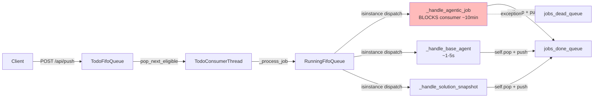
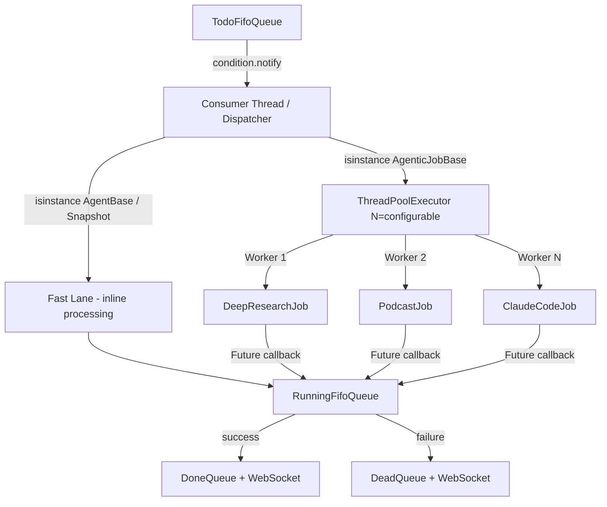

# Approach C: Hybrid Fast Lane + Bounded Agentic Pool for CJ Flow

**Status**: SUPERSEDED — implementation planning moved to v0.1.7; IMPLEMENTATION COMPLETE 2026-04-24 (Session 616112aa, branch `wip-v0.1.7-2026.04.22-spit-and-polish-for-cjflow-tfe-and-bfe`)

> ## ✅ Implementation Complete (2026-04-24)
>
> All three phases landed on commits:
> - **Phase 1** `fe932ba` — RLock on `FifoQueue`, `cj flow max concurrent agentic jobs` INI knob + `[Lupin: Development]` overlay, `ApiResourceManager` singleton stub + `init_arm()` startup wiring.
> - **Phase 2** `9adfc26` — dispatcher refactor + `ThreadPoolExecutor` agentic pool, `_submit_agentic_job` / `_execute_agentic_in_pool` / `_on_agentic_complete` (defensive), `_transition_to_done` / `_transition_to_dead` primitives, 9 `self.pop()` → `self.delete_by_id_hash()` migrations, `/api/queue/pool-status` endpoint, `shutdown_pool` in lifespan.
> - **Phase 2 fix** `9eb764b` — `_process_job` uses passed `job` (not `self.head()`) — fixes phantom/duplicate bugs surfaced by Live API probe.
> - **Phase 3** (this session, commit pending) — ghost-job sweeper daemon thread, `_transition_to_dead` via sweeper, `cj flow ghost job sweep interval seconds` INI knob, DeepResearch `api_client._call_api` migrated to `ApiResourceManager`, `/api/queue/pool-status` enriched with `api_resource_manager` section.
>
> **Test coverage**: unit 3600 pass / 1 xfail / 0 fail (was 3549 Phase-0 baseline; +15 Phase-1 + +18 Phase-2 + +10 Phase-3 + 8 inline fixes for stale/shape). WebSocket smoke 50/50. Live API probes on `:7999` green for single-submit (Phase 2 fix validation) and concurrent-happy-path 7/7 (Phase 3).

### Before vs after — architecture diagram

**BEFORE** (pre-v0.1.7, serial processing):



**Bottleneck**: a DeepResearch job blocks every subsequent fast-lane query for its entire ~10-minute runtime. `self.pop()` assumes queue size 1.

---

**AFTER** (v0.1.7 complete, concurrent pool active when `N > 1`):

```mermaid
flowchart LR
    Client -->|POST /api/push<br/>or /api/deep-research/submit| Todo[TodoFifoQueue<br/>RLock-protected]
    Todo -->|pop_next_eligible| CT[TodoConsumerThread]
    CT -->|_process_job job| Running[RunningFifoQueue<br/>RLock-protected<br/>pool + futures dict]

    Running -->|AgenticJobBase| SAJ[_submit_agentic_job<br/>returns immediately]
    SAJ -->|submit + track + add_done_callback<br/>atomic-under-lock| Pool[ThreadPoolExecutor<br/>max_workers=N<br/>name=AgenticPool]
    Pool -->|worker thread runs do_all| DR1[Deep Research #1]
    Pool -->|worker thread runs do_all| DR2[Deep Research #2]
    Pool -->|worker thread runs do_all| POD[Podcast Generator]
    Pool -.Future.done callback.-> CB[_on_agentic_complete<br/>defensive BaseException catch<br/>pop-before-transition invariant]
    CB -->|success| TD[_transition_to_done]
    CB -->|exception| TDE[_transition_to_dead]

    Running -->|AgentBase / SolutionSnapshot| FL[fast-lane inline<br/>NOT blocked by pool]
    FL -->|_handle_base_agent / _handle_solution_snapshot| Done[jobs_done_queue]

    TD -->|delete_by_id_hash + push| Done
    TDE -->|delete_by_id_hash + push| Dead[jobs_dead_queue]

    Running -. every 30s .- GJS[GhostJobSweeper daemon<br/>future.done AND still in running_queue<br/>→ dead_letter]
    GJS -.orphan detected.-> TDE

    DR1 -.acquire/record_call.-> ARM[ApiResourceManager<br/>singleton]
    DR2 -.acquire/record_call.-> ARM
    ARM -->|wraps| RL[WebSearchRateLimiter<br/>sliding window<br/>30k tokens/min]

    PoolStatus[/api/queue/pool-status] -->|reads| Running
    PoolStatus -->|reads| ARM

    classDef new fill:#bfb
    class Pool,SAJ,CB,TD,TDE,GJS,ARM,RL,PoolStatus new
    classDef keep fill:#eef
    class FL keep
```

**Key shape shifts**:
1. **Dispatcher split**: `isinstance(job, AgenticJobBase)` → pool; `isinstance(job, (AgentBase, SolutionSnapshot))` → inline fast-lane. Consumer thread freed after pool submit.
2. **Pool + Future tracking**: `_agentic_futures` dict (RLock-protected) maps `id_hash → Future`. Load-bearing invariant: `_on_agentic_complete` pops BEFORE transitioning — ghost sweeper correctness depends on it.
3. **`self.pop()` → `self.delete_by_id_hash(job.id_hash)`**: 9 sites migrated. Under concurrent completion the head-of-queue is no longer deterministic.
4. **Shared transition primitives**: `_transition_to_done` / `_transition_to_dead` callable from both pool callback AND (optionally, Phase 4 cleanup) fast-lane paths.
5. **Ghost sweeper**: daemon thread, 30s interval (INI), snapshot-under-lock + per-entry `get_by_id_hash` None-check. Suspenders to Phase 2's defensive-callback belt.
6. **ApiResourceManager**: centralizes per-provider contention state (today: Anthropic web-search; future: Anthropic messages, OpenAI, Gemini). DR migrated; others on legacy two-path per §3a.
7. **Observability**: `/api/queue/pool-status` exposes live pool state + per-provider ARM state for debugging.

**Preserved** (gray path in diagram):
- Fast-lane processing is identical runtime behaviour. Under `N=1` prod default, the whole system reproduces pre-v0.1.7 serial semantics exactly — only the dispatch path name changed.

---

The 11-step / 3-phase structure below remains historically accurate for the original 2026-02-19 design. The v0.1.7 implementation broadly maps onto this structure with decision refinements captured in `src/rnd/v0.1.7/2026.04.23-cj-flow-async-multi-lane/01-design-review.md §3`.
**Session**: 237 (original design); resumed 2026-04-21 (design review) and 2026-04-23 (implementation plan)
**Date**: 2026-02-19
**Serialized from plan**: `sprightly-juggling-origami.md`

---

> ## ⚠️ Superseded by v0.1.7 Implementation Plan (2026-04-23)
>
> This document captured the **original design** (frozen 2026-02-19). It remains authoritative for the architecture rationale and thread-safety analysis, but the **implementation plan has moved to v0.1.7**, with updated decisions recorded 2026-04-23.
>
> **Read these instead for active work** — all under `src/rnd/v0.1.7/2026.04.23-cj-flow-async-multi-lane/`:
>
> - **Working contract** (behavioral foundation — read first): `00-working-contract.md`
> - **Design review** (post-v0.1.6 re-orientation — anchor / Q1–Q7 rationale): `01-design-review.md`
> - **Phase 1 design** (RLock + config + ApiResourceManager stub): `02-phase-1-rlock-config-and-resource-manager.md`
> - **Phase 2 design** (dispatcher + pool + pool-status endpoint): `03-phase-2-dispatcher-pool-and-pool-status.md`
> - **Phase 3 design** (ghost watchdog + ARM integration + E2E): `04-phase-3-ghost-watchdog-and-e2e.md`
> - **Execution logs** (paired, populated during implementation): `9{0,1,2}-phase-N-execution-log.md`
>
> **Key changes from this doc's original plan** (decided 2026-04-23):
> 1. **`ApiResourceManager` singleton** added to Phase 1 scope (migrates the existing per-agent rate-limit logic, starting with `WebSearchRateLimiter`). Centralizes contention strategy.
> 2. **`/api/queue/pool-status` endpoint** moves from "optional Phase 3" to required Phase 2 (table-stakes for live debugging).
> 3. **Ghost-job watchdog** added to Phase 3 as a suspenders-backstop to Phase 2's defensive-callback belt.
> 4. **Default `N`** ships as `= 1` in prod (identical to today's serial behaviour); `= 3` in dev only.
> 5. **Single shared pool** (not per-job-type pools).
> 6. **Interactive lane** deferred; `ClaudeCodeJob INTERACTIVE` rides the shared pool for v0.1.7.
> 7. **Approach D** (user→job check-in buffering) stays separate; pairs with the deferred interactive-lane work.
>
> The 11-step / 3-phase structure below is the ORIGINAL plan. See the v0.1.7 docs for the current structure.

---

## Problem Statement

CJ Flow processes jobs serially via a single `TodoConsumerThread`. A 10-minute DeepResearchJob blocks every subsequent job — even 2-second MathAgent queries. The async/sync boundary (agentic jobs use `asyncio.run()` inside sync `do_all()`) compounds this: each job creates its own event loop and blocks the consumer thread for its entire duration.

**Goal**: Move to concurrent processing where (1) fast sync agents never wait behind agentic jobs, and (2) multiple agentic jobs can run simultaneously up to a configurable limit.

**Resource constraints driving the design**:
- Sync agents use local GPU (`Phi-4-GPTQ-4bit`) — already serialized at inference level. Fast lane avoids latency, not for parallelism.
- Agentic jobs use Anthropic API — true concurrency benefit, bounded by API rate limits.

---

## Architecture



**Approach**: Hybrid architecture — the existing consumer thread becomes a dispatcher that processes sync agents inline (fast lane) and submits agentic jobs to a `ThreadPoolExecutor` (agentic pool). No protocol changes. No changes to agentic job internals.

---

## Thread Safety Model

### Shared State Analysis

| Resource | Current Access | With Pool | Safety Mechanism |
|----------|---------------|-----------|------------------|
| `FifoQueue.queue_list/queue_dict` | Consumer thread only | Consumer + pool callbacks | `threading.RLock()` on all methods |
| `UserJobTracker` | Consumer thread only | Consumer + pool callbacks | Already has its own `Lock` |
| `WebSocketManager.emit()` | Consumer + asyncio | Consumer + pool + asyncio | Already thread-safe (`run_coroutine_threadsafe`) |
| `emit_job_state_transition()` | Consumer thread | Consumer + pool callbacks | Already thread-safe (wraps `run_coroutine_threadsafe`) |
| `InputAndOutputTable.insert_io_row()` | Consumer thread | Consumer + pool callbacks | SQLite WAL mode (concurrent reads, serialized writes) |
| `AgenticJobBase.do_all()` | Consumer thread | Pool threads | Each creates own event loop (`asyncio.run()`), thread-safe |

### Key Insight

Most shared resources are already thread-safe. The only resource that needs explicit locking is `FifoQueue` — the base queue class used by all queue instances (todo, running, done, dead).

### RLock Choice

`threading.RLock()` (re-entrant lock) chosen over `threading.Lock()` because:
- `pop()` calls `is_empty()` internally — with a regular Lock this would deadlock
- `delete_by_id_hash()` calls `size()` internally — same issue
- RLock allows the same thread to acquire the lock multiple times

---

## Configuration Reference

### `lupin-app.ini` — CJ Flow Section

```ini
# CJ Flow: Concurrent Agentic Job Pool
cj flow max concurrent agentic jobs = 3
```

### `lupin-app-splainer.ini`

```ini
cj flow max concurrent agentic jobs = Maximum number of agentic jobs (Deep Research, Podcast, etc.) that can run simultaneously in the thread pool. Set to 1 for serial behavior (current default). Higher values use more Anthropic API rate limit quota.
```

---

## Phase-by-Step Progress Tracking

### Phase 1: Thread-Safe FifoQueue Foundation

- [ ] **1.1** Add `threading.RLock()` to `FifoQueue` — wrap all mutating + reading methods
  - **File**: `src/cosa/rest/fifo_queue.py`
  - **Change**: Add `import threading`, `self._lock = threading.RLock()` in `__init__`, wrap all methods
  - **Methods to wrap**: `push()`, `pop()`, `head()`, `get_by_id_hash()`, `delete_by_id_hash()`, `is_empty()`, `size()`, `has_changed()`, `clear()`, `get_jobs_for_user()`, `get_all_jobs()`

- [ ] **1.2** Add config key for max concurrent agentic jobs
  - **Files**: `src/conf/lupin-app.ini`, `src/conf/lupin-app-splainer.ini`
  - **Change**: Add `cj flow max concurrent agentic jobs = 3` after line 369

- [ ] **1.3** Write thread safety unit tests
  - **File**: `src/tests/unit/test_fifo_queue_thread_safety.py` (NEW)
  - **Tests**:
    - `test_concurrent_push_no_corruption` — 10 threads x 100 pushes, verify size == 1000
    - `test_concurrent_push_pop_consistency` — 5 pushers + 5 poppers, no exceptions
    - `test_concurrent_read_during_write` — readers calling `size()`, `get_all_jobs()` while writers push/pop
    - `test_delete_by_id_hash_under_concurrency` — delete specific items while other threads push

- [ ] **1.4** Verify Phase 1 — new + existing unit tests pass
  - `pytest src/tests/unit/test_fifo_queue_thread_safety.py -v`
  - `pytest src/tests/unit/ -v` (full regression)

### Phase 2: Agentic Pool + Dispatcher Refactor (Core)

- [ ] **2.1** Add `ThreadPoolExecutor` and refactor dispatcher in `RunningFifoQueue`
  - **File**: `src/cosa/rest/running_fifo_queue.py` (MAJOR)
  - **Changes**:
    - Add pool setup in `__init__`: `ThreadPoolExecutor`, `_agentic_futures` dict
    - Refactor `_process_job()` to route by isinstance: agentic → pool, else → fast lane
    - New method `_submit_agentic_job()` — submit to pool, store Future, register callback
    - New method `_execute_agentic_in_pool()` — runs in pool thread, calls `job.do_all()`
    - New method `_on_agentic_complete()` — Future callback, `delete_by_id_hash()`, done/dead routing
    - New method `_process_fast_lane()` — extracted from current inline processing
    - New methods `get_pool_status()`, `shutdown_pool()`
    - **Critical**: All `self.pop()` in agentic paths → `self.delete_by_id_hash( job.id_hash )`

- [ ] **2.2** Update shutdown sequence in `main.py`
  - **File**: `src/fastapi_app/main.py`
  - **Change**: Add `shutdown_pool( wait=True, timeout=30.0 )` before consumer thread shutdown

- [ ] **2.3** Write agentic pool unit tests
  - **File**: `src/tests/unit/test_agentic_pool.py` (NEW)
  - **Tests**:
    - `test_agentic_job_submitted_to_pool` — verify agentic job goes to pool
    - `test_sync_agent_processed_inline` — verify AgentBase does NOT go to pool
    - `test_concurrent_agentic_execution` — 3 mock jobs (0.5s), total < 1s
    - `test_fast_lane_not_blocked` — slow agentic + fast sync, sync completes first
    - `test_completion_moves_to_done` — successful job → done queue
    - `test_failure_moves_to_dead` — failing job → dead queue with error
    - `test_delete_by_id_hash_not_pop` — verify correct removal method
    - `test_pool_saturation` — 5 jobs with max_workers=2, all complete
    - `test_graceful_shutdown` — submit job, shutdown, verify completion
    - `test_get_pool_status` — verify accurate counts

- [ ] **2.4** Verify Phase 2 — new + existing unit tests pass
  - `pytest src/tests/unit/test_agentic_pool.py -v`
  - `pytest src/tests/unit/ -v` (full regression)

### Phase 3: Integration + Observability

- [ ] **3.1** Add `/api/queue/pool-status` endpoint (optional)
  - **Location**: TBD based on existing router structure
  - **Returns**: `get_pool_status()` dict

- [ ] **3.2** Integration verification — manual end-to-end test
  - Start server with `cj flow max concurrent agentic jobs = 3`
  - Submit 2 deep research jobs via UI (dry-run mode)
  - Verify both show as "running" simultaneously
  - Submit math question while agentic jobs run
  - Verify math answer arrives within seconds (not blocked)
  - Verify both agentic jobs complete with proper state transitions

---

## Critical Files

| File | Phase | Change Level |
|------|-------|-------------|
| `src/cosa/rest/fifo_queue.py` | 1 | Moderate — add RLock to all methods |
| `src/conf/lupin-app.ini` | 1 | Trivial — add 1 config key |
| `src/conf/lupin-app-splainer.ini` | 1 | Trivial — add 1 explainer |
| `src/cosa/rest/running_fifo_queue.py` | 2 | **Major** — pool, dispatcher refactor, new methods |
| `src/cosa/rest/queue_consumer.py` | 2 | None or trivial — behavior changes via `_process_job()` |
| `src/fastapi_app/main.py` | 2 | Small — shutdown sequence |
| `src/tests/unit/test_fifo_queue_thread_safety.py` | 1 | New file |
| `src/tests/unit/test_agentic_pool.py` | 2 | New file |

---

## Reusable Existing Code

- `FifoQueue.delete_by_id_hash()` (`fifo_queue.py:229`) — already exists, use instead of `pop()` for keyed removal
- `emit_job_state_transition()` (`queue_util.py`) — already thread-safe via `run_coroutine_threadsafe`
- `WebSocketManager.emit()` (`websocket_manager.py`) — already thread-safe
- `UserJobTracker` (`queue_extensions.py`) — already has its own `Lock`
- `du.print_banner()`, `sw.Stopwatch` — utility functions, no state, thread-safe
- `AgenticJobBase.do_all()` — each job creates own event loop via `asyncio.run()`, safe from separate threads

---

## What Does NOT Change

- `QueueableJob` protocol — `do_all()` stays synchronous
- All agentic job classes — `asyncio.run( self._execute() )` pattern unchanged
- `TodoFifoQueue.push_job()` — routing and classification logic unchanged
- `AgentBase.do_all()` — sync agent execution unchanged
- WebSocket event format — same `job_state_transition` events
- Browser UI — already handles multiple running cards via `job_id`-keyed DOM operations

---

## Monitoring & Troubleshooting

### Pool Status Endpoint

`GET /api/queue/pool-status` returns:

```json
{
    "active_agentic_jobs" : 2,
    "max_agentic_workers" : 3,
    "pending_in_pool"     : 0
}
```

### Common Issues

| Symptom | Likely Cause | Fix |
|---------|-------------|-----|
| Agentic jobs still serial | Config key not loaded | Check `cj flow max concurrent agentic jobs` in INI |
| Fast lane blocked | `_process_job()` not routing correctly | Check `isinstance( job, AgenticJobBase )` ordering |
| Job stuck in running queue | `_on_agentic_complete()` callback not firing | Check Future callback registration |
| Dead queue not receiving failures | `delete_by_id_hash()` failing | Verify `id_hash` consistency through lifecycle |

### Thread Naming

All pool threads use prefix `AgenticPool-*` for easy identification in logs:
```
AgenticPool-0: Running DeepResearchJob [abc123]...
AgenticPool-1: Running PodcastGeneratorJob [def456]...
```

---

## Verification Plan

1. **Phase 1**: `pytest src/tests/unit/test_fifo_queue_thread_safety.py -v` + `pytest src/tests/unit/ -v` (full regression)
2. **Phase 2**: `pytest src/tests/unit/test_agentic_pool.py -v` + `pytest src/tests/unit/ -v` (full regression)
3. **Phase 3**: Manual end-to-end test with concurrent agentic jobs + sync agent interleaving
4. **Pre-merge**: Full test suite per PR merge requirements
