# Presentation Generator Agent — R&D Documentation

**Created**: 2026-03-14
**Status**: Planning & Design Complete, Implementation Pending
**Agent Type**: AgenticJobBase (Bounded, Single Orchestrator)
**Job Prefix**: `pr` (presentation)
**Pattern**: Follows Podcast Generator architecture (job + orchestrator + config)

## Document Index

| # | Document | Purpose | Status |
|---|----------|---------|--------|
| 01 | [Strategy & Design](01-strategy-and-design.md) | Presentation design theory, narrative arc decomposition, structural decisions, theme/visual architecture | Complete |
| 02 | [Implementation Plan](02-implementation-plan.md) | Phase-by-phase implementation breakdown with tasks, file lists, dependencies | Complete |
| 03 | [Implementation Tracking](03-implementation-tracking.md) | Phase/task completion tracking with checkboxes | Active |
| 04 | [Phase 3 Implementation Plan](04-phase-3-implementation-plan.md) | Expeditor integration + Ingest + Narrative Analysis + Gate 1 | Complete |
| 05 | [Phase 4 Implementation Plan](05-phase-4-implementation-plan.md) | Outline & Elaborate + fuzzy_file_match config | Complete |
| 06 | [Phase 4-5 Verification Plan](06-phase-4-5-verification-plan.md) | Test & verify strategy: smoke → dry-run → UI → live E2E | Active |
| 07 | [Phase C-D Verification Plan](07-phase-c-d-verification-plan.md) | CJ Flow queue + live E2E verification | Active |
| 08 | [Phase 6 Implementation Plan](08-phase-6-implementation-plan.md) | Marp text rendering: theme system, renderer, orchestrator integration | Complete |
| 09 | [Phase 7 Implementation Plan](09-phase-7-implementation-plan.md) | Visual rendering: Mermaid + registry + placeholder + Gate 4 | Active |
| 10 | [Phase 8 Implementation Plan](10-phase-8-implementation-plan.md) | Delivery + Deep Research → Presentation chaining bridge | Done (Session 383) |
| 11 | [Visual Rendering Expansion Plan](11-visual-rendering-expansion-plan.md) | Matplotlib, D2, Nano Banana 2, Google Veo 2 renderer roadmap | Planning |

### Renderer Implementation Plans (Subdirectory)

| # | Document | Renderer | Status |
|---|----------|----------|--------|
| R-00 | [Renderer Index](renderers/00-index.md) | All | Planning |
| R-01 | [Matplotlib Renderer](renderers/01-matplotlib-renderer-plan.md) | Charts, plots, data viz | Planning |
| R-02 | [D2 Renderer](renderers/02-d2-renderer-plan.md) | Beautiful flowcharts, architecture | Planning |
| R-03 | [Nano Banana Renderer](renderers/03-nano-banana-renderer-plan.md) | Hero images, infographics | Planning |
| R-04 | [Veo Renderer](renderers/04-veo-renderer-plan.md) | Flow animations, title videos | Planning |
| R-05 | [Theme Integration](renderers/05-theme-integration-plan.md) | Cross-renderer theme cascade | Planning |

## Future Documents (Added as Work Progresses)

| # | Document | Purpose | Status |
|---|----------|---------|--------|
| 11 | Theme Template Spec | Additional themes (dark, academic, branded) | Planned |
| 12 | Lessons Learned | Post-implementation notes, design pivots, gotchas | Planned |

## Architecture Summary

```mermaid
graph LR
    A[Source Document] --> B[Phase 1: Ingest]
    B --> C[Phase 2: Analyze]
    C -->|Gate 1| D[Phase 3: Outline]
    D -->|Gate 2| E[Phase 4: Elaborate]
    E -->|Gate 3| F[Phase 5: Serialize]
    F --> G[YAML Intermediate File]
    G --> H[Phase 6: Render Text]
    H --> I[Phase 7: Render Visuals]
    I -->|Gate 4| J[Phase 8: Deliver]
```



## Key Decisions

| Decision | Choice | Rationale |
|----------|--------|-----------|
| Architecture | Single orchestrator (like Podcast Generator) | Sequential phases, no parallelizable subtasks |
| Intermediate format | YAML | Structured, machine-parseable, human-editable |
| Output format | Marp Markdown (MVP) | Markdown syntax, exports to PDF/PPTX/HTML |
| Visual rendering | Mermaid (MVP), pluggable registry (future) | LLM generates Mermaid from descriptions |
| Chaining | Deep Research → Presentation bridge | Same pattern as DR → Podcast |
| MVP scope | Content generation first (Phases 1-5), rendering second (Phases 6-8) | Deliver reviewable YAML before rendering |

## Related Files (Post-Implementation)

```
src/cosa/agents/presentation_generator/
    job.py                  # PresentationGeneratorJob (AgenticJobBase)
    orchestrator.py         # PresentationOrchestratorAgent (async multi-phase)
    config.py               # PresentationConfig (dataclass from INI)
    state.py                # OrchestratorState, SlideModel, PresentationModel
    voice_io.py             # Voice-first I/O wrapper
    cosa_interface.py       # COSA notification dispatcher
    api_client.py           # Claude SDK wrapper for content generation
    marp_renderer.py        # YAML → Marp Markdown renderer
    visual_registry.py      # Pluggable visual renderer registry
    renderers/
        mermaid.py          # MermaidRenderer
        placeholder.py      # PlaceholderRenderer (fallback)
    templates/
        themes/
            default.yaml    # Default theme
    prompts/
        narrative.py        # Narrative extraction prompts
        elaboration.py      # Content generation prompts
    __main__.py             # CLI entry point
```
