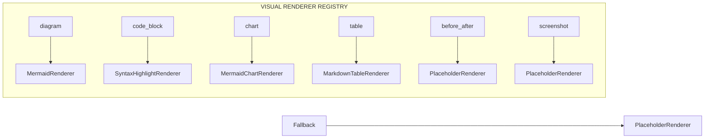
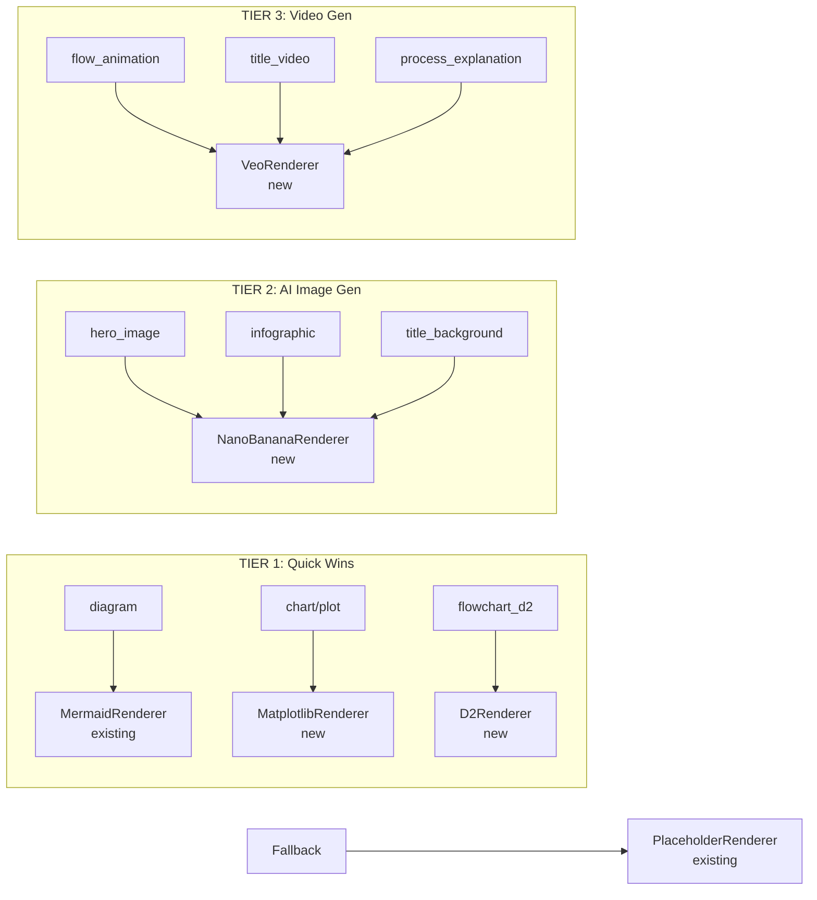

# Presentation Generator: Visual Rendering Expansion Plan

**Date**: 2026-03-30
**Session**: 383
**Status**: Planning / Brainstorm
**Scope**: Expanding beyond MVP visual renderers (Mermaid + Placeholder) to production-quality visuals

---

## 1. Current State

### What's Built and Working

| Renderer | Visual Types | How It Works | Quality |
|----------|-------------|-------------|---------|
| `MermaidRenderer` | `diagram`, `chart` | LLM generates Mermaid syntax from `visual_description`. Marp renders natively. | Good for structural diagrams, weak for data viz |
| `PlaceholderRenderer` | `screenshot`, `icon_only`, `before_after`, fallback | `[TODO: ...]` markers for unsupported types | N/A — placeholder only |
| `VisualRendererRegistry` | All | Pluggable dispatch. Adding a new renderer = implement the ABC + register it. | N/A — infrastructure |

### Architecture (Already Pluggable)

Adding new renderers requires **zero changes** to the orchestrator pipeline — only implement the `VisualRenderer` ABC and register.

### Original Design Doc Deferrals (Section 4.4)

| Renderer | Originally Planned | Status |
|----------|-------------------|--------|
| `NanoBananaRenderer` | "Future" — AI infographic generation | Now planning |
| `GoogleImageGenRenderer` | "Future" — Title/hero image generation | Superseded by Nano Banana 2 |
| `GoogleVideoGenRenderer` | "Future" — 8-second process animation clips | Now planning (Veo 2/3) |

---

## 2. The Landscape (March 2026)

### 2.1 Graphs, Plots, and Charts

| Option | What It Does | Quality | Cost | Complexity |
|--------|-------------|---------|------|------------|
| **Mermaid (current)** | Flowcharts, sequence, Gantt, pie, etc. | Good for structural diagrams, weak for data viz | Free (LLM cost only) | Already built |
| **Matplotlib/Seaborn** | Full data visualization — scatter, bar, line, heatmap | Excellent for data | Free | Medium — LLM generates Python code, we execute it |
| **Plotly** | Interactive charts (render to static SVG/PNG for slides) | Excellent, publication-quality | Free | Medium — same code-gen approach |
| **Chart.js via Marp** | Native web charts in Marp HTML export | Good for web presentations | Free | Low — LLM generates Chart.js config JSON |

**Decision**: Matplotlib/Plotly via LLM code generation. The LLM writes plotting code from `visual_description`, we execute it in a sandboxed runner (`util_code_runner.py` already exists in CoSA), capture the PNG/SVG. Matplotlib for static charts, Plotly for interactive HTML exports.

### 2.2 Beautiful Flowcharts (Beyond Mermaid)

| Option | What It Does | Quality | Cost | Complexity |
|--------|-------------|---------|------|------------|
| **Mermaid (current)** | Structural diagrams | Functional but plain | Free | Already built |
| **D2 (Declarative Diagramming)** | Modern diagramming language, much prettier than Mermaid | Beautiful — supports sketch mode, dark themes | Free (CLI tool) | Low — LLM generates D2 syntax |
| **Graphviz/dot** | Classic graph layout engine | Clean, professional | Free | Low — LLM generates DOT syntax |
| **Excalidraw** | Hand-drawn style diagrams | Distinctive, friendly aesthetic | Free | Medium — JSON-based, LLM can generate |

**Decision**: D2 as a complement to Mermaid. Much prettier output with built-in themes and sketch mode. LLM generates D2 syntax the same way it generates Mermaid. D2 produces SVG that Marp can embed. Install: `curl -fsSL https://d2lang.com/install.sh | sh`.

### 2.3 Static Infographic-Style Images

| Option | What It Does | Quality | Cost | Complexity |
|--------|-------------|---------|------|------------|
| **Nano Banana 2** | Google Gemini-based image generation (Feb 2026) | Very high quality, Gemini-integrated | $0.045-$0.151/image (resolution-dependent) | Low — Gemini API call |
| **Nano Banana Pro** | Professional tier, Gemini 3 Pro Image, 4K, studio-quality | Studio-grade, sharp text rendering | Higher (Vertex AI pricing) | Low — API call |
| **Imagen 4** | Google dedicated image generation (Vertex AI) | High quality | $0.02-$0.06/image | Low — Vertex AI API call |
| **DALL-E 3 (OpenAI)** | Text-to-image generation | High quality | ~$0.04-$0.08/image | Low — API call |
| **Stable Diffusion (local)** | Text-to-image, can run locally | Good, variable | Free (GPU cost) | High — needs GPU infra |
| **Ideogram** | Text-in-image generation (good with text rendering) | High, esp. for infographics | ~$0.02/image | Low — API call |

**Decision**: Nano Banana 2 via Gemini API as the primary image renderer. Reasons:
- Available via the same Gemini API we already use for LLM calls
- Free tier available via AI Studio for development/testing
- Batch API at 50% discount ($0.022/image at 0.5K) for production
- SynthID watermarking built-in
- Nano Banana Pro upgrade path for 4K output when needed

**Nano Banana 2 API Pricing (March 2026)**:

| Resolution | Standard | Batch (50% off) |
|-----------|----------|-----------------|
| 0.5K | $0.045 | $0.022 |
| 1K | $0.067 | $0.034 |
| 2K | $0.101 | $0.050 |
| 4K | $0.151 | $0.076 |

### 2.4 Flow Animations (Static and Animated)

| Option | What It Does | Quality | Cost | Complexity |
|--------|-------------|---------|------|------------|
| **Marp transitions** | Built-in slide transitions | Basic | Free | Already available |
| **Mermaid + CSS animation** | Animated Mermaid in HTML export | Good for step-by-step reveals | Free | Medium |
| **Manim (3Blue1Brown)** | Programmatic math/diagram animations | Stunning — YouTube-grade | Free | High — Python code gen + render |
| **Motion Canvas** | TypeScript-based animation engine | Beautiful, modern | Free | High — requires Node.js |
| **Google Veo 2** | Text-to-video generation | High quality short clips | ~$0.20/sec (1080p) | Low — API call |
| **Lottie/Bodymovin** | JSON-based vector animations | Clean, web-native | Free | Medium — LLM generates JSON |
| **SVG SMIL animations** | Native SVG animation | Good for simple flows | Free | Medium — LLM generates SVG |

**Decision**: Google Veo 2 via Gemini API. Text-to-video for flow animations, up to 8 seconds per generation at 1080p. Produces MP4s embeddable in HTML presentations or referenced in speaker notes for PPTX/PDF exports.

**Veo 2 API Pricing (March 2026)**:

| Tier | Price | Resolution |
|------|-------|-----------|
| Veo 2 (Gemini API) | $0.20/sec | 1080p |
| Veo 2 (Vertex AI) | $0.50/sec | 1080p |

Note: Veo 3.1 also available at $0.40/sec via Gemini API with audio generation support.

### 2.5 Short Video Segments (Title Pages, Process Explanations)

| Option | What It Does | Quality | Cost | Complexity |
|--------|-------------|---------|------|------------|
| **Google Veo 2** | Text-to-video (6-8 second clips) | Cinematic quality | ~$0.20/sec | Low — API call |
| **Runway ML Gen-3** | Text/image-to-video | High quality | ~$0.10/clip | Low — API call |
| **Manim** | Programmatic animation -> MP4 | Math/tech style, 3B1B aesthetic | Free (compute cost) | High — code generation + render |
| **Remotion** | React-based video generation | Web-native, modern | Free | High — requires Node.js |
| **FFmpeg compositing** | Combine static images + text overlays -> MP4 | Functional, not flashy | Free | Medium |

**Decision**: Google Veo 2 for cinematic title sequences and process explanation clips. Same API as flow animations — unified Google AI integration. 6-8 second ambient backgrounds for title slides, process walkthroughs for explanation slides.

---

## 3. Proposed Renderer Architecture

### 3.1 Updated Registry

### 3.2 New Renderer Classes

| Renderer | Visual Types | Input | Output | External Dep |
|----------|-------------|-------|--------|-------------|
| `MatplotlibRenderer` | `chart`, `plot`, `graph`, `data_viz` | `visual_description` -> LLM generates Python code -> sandboxed execution | PNG/SVG | `matplotlib`, `seaborn` (pip) |
| `D2Renderer` | `flowchart_d2`, `architecture` | `visual_description` -> LLM generates D2 syntax -> `d2` CLI -> SVG | SVG | `d2` CLI binary |
| `NanoBananaRenderer` | `hero_image`, `infographic`, `title_background`, `icon` | `visual_description` -> Gemini API (Nano Banana 2) | PNG | Gemini API key |
| `VeoRenderer` | `flow_animation`, `title_video`, `process_explanation` | `visual_description` -> Gemini API (Veo 2) | MP4 | Gemini API key |

### 3.3 Implementation Tiers

#### Tier 1: Quick Wins (Low complexity, high impact)
1. **MatplotlibRenderer** — LLM generates Python code -> sandboxed execution -> PNG/SVG
2. **D2Renderer** — LLM generates D2 syntax -> `d2` CLI -> SVG

#### Tier 2: AI Image Generation (Low complexity, paid API)
3. **NanoBananaRenderer** — Gemini API (Nano Banana 2) -> PNG for hero images, infographics, title backgrounds

#### Tier 3: Video Generation (Low complexity, paid API)
4. **VeoRenderer** — Gemini API (Veo 2) -> MP4 for title sequences, flow animations, process explanations

---

## 4. Cost Estimation Per Presentation

Assuming a 15-slide presentation with typical visual distribution:

| Visual Type | Count | Cost/Unit | Subtotal |
|------------|-------|-----------|----------|
| Mermaid diagrams | 3 | $0.00 (LLM only) | ~$0.03 (LLM tokens) |
| Matplotlib charts | 2 | $0.00 (local) | ~$0.02 (LLM tokens) |
| D2 flowcharts | 1 | $0.00 (local) | ~$0.01 (LLM tokens) |
| Nano Banana images | 3 | $0.045-$0.067 | ~$0.15-$0.20 |
| Veo 2 title video | 1 (8 sec) | $0.20/sec | ~$1.60 |
| Veo 2 process clip | 1 (6 sec) | $0.20/sec | ~$1.20 |
| **Total per presentation** | | | **~$3.01-$3.06** |

Without video: **~$0.21-$0.26** per presentation.

---

## 5. Slide Type -> Visual Type Mapping

The orchestrator's slide outline phase already assigns a `visual_type` to each slide. The expansion adds new types:

| Slide Purpose | Current visual_type | New visual_type Options |
|--------------|--------------------|-----------------------|
| Title slide | `text_only` | `title_background`, `title_video` |
| Architecture overview | `diagram` | `diagram` (Mermaid), `flowchart_d2` (D2) |
| Data comparison | `chart` | `chart` (Mermaid pie), `plot` (Matplotlib) |
| Performance metrics | `chart` | `data_viz` (Matplotlib/Plotly) |
| Process walkthrough | `diagram` | `flow_animation` (Veo 2) |
| Key concept | `text_only` | `infographic` (Nano Banana) |
| Before/after | `before_after` | `infographic` (Nano Banana side-by-side) |
| Conclusion | `text_only` | `hero_image` (Nano Banana) |

---

## 6. External Dependencies

| Dependency | Type | Installation | Required For |
|-----------|------|-------------|-------------|
| `matplotlib` | Python pip | `pip install matplotlib seaborn` | MatplotlibRenderer |
| `d2` | CLI binary | `curl -fsSL https://d2lang.com/install.sh \| sh` | D2Renderer |
| Gemini API key | API credential | Already configured for LLM calls | NanoBananaRenderer, VeoRenderer |
| `google-genai` | Python pip | `pip install google-genai` | NanoBananaRenderer, VeoRenderer |

---

## 7. Open Questions

1. **Video embedding in Marp**: Marp supports `<video>` tags in HTML export but not in PDF/PPTX. Strategy: embed in HTML, provide static frame + link for PDF/PPTX.
2. **D2 theme selection**: D2 has 8 built-in themes. Should we map our presentation theme to D2 themes, or use a fixed "clean" theme?
3. **Matplotlib style**: Should generated plots match the presentation theme (colors, fonts), or use a standard scientific style?
4. **Nano Banana prompt engineering**: How much context to include? Just `visual_description`, or also slide title + content bullets for coherent style?
5. **Veo 2 prompt engineering**: Same question. Plus: should title videos be abstract/ambient or content-specific?
6. **Fallback chain**: If Nano Banana fails (rate limit, content filter), fall back to Imagen 4 ($0.02/image)? Or PlaceholderRenderer?
7. **Budget control**: Should the orchestrator enforce a per-presentation budget cap for paid renderers?

---

## 8. Implementation Priority and Phasing

**Recommended order** (each phase is independently valuable):

| Phase | Renderer | Effort | Impact | Prerequisite |
|-------|----------|--------|--------|-------------|
| Phase 9A | MatplotlibRenderer | 1-2 sessions | High (data viz) | matplotlib pip |
| Phase 9B | D2Renderer | 1 session | High (beautiful diagrams) | d2 CLI |
| Phase 10A | NanoBananaRenderer | 1-2 sessions | High (hero images, infographics) | Gemini API |
| Phase 10B | VeoRenderer | 1-2 sessions | Very high (video!) | Gemini API |
| Phase 11 | Prompt tuning + theme integration | 1 session | Medium (polish) | Phases 9-10 |

**Total estimated effort**: 6-9 sessions

---

## Sources

- [Google Nano Banana 2 launch (CNBC)](https://www.cnbc.com/2026/02/26/google-launches-nano-banana-2-updating-its-viral-ai-image-generator.html)
- [Google Nano Banana 2 developer tools](https://blog.google/innovation-and-ai/technology/developers-tools/build-with-nano-banana-2/)
- [Nano Banana 2 API pricing guide](https://blog.laozhang.ai/en/posts/nano-banana-2-api-pricing-guide)
- [Nano Banana Pro overview](https://blog.google/technology/ai/nano-banana-pro/)
- [AI Image API pricing comparison 2026](https://blog.laozhang.ai/en/posts/ai-image-generation-api-comparison-2026)
- [Imagen 4 pricing](https://magichour.ai/blog/imagen-4-pricing-and-api)
- [Google Veo pricing calculator](https://costgoat.com/pricing/google-veo)
- [Gemini API pricing](https://ai.google.dev/gemini-api/docs/pricing)
- [Veo 3.1 pricing guide](https://www.aifreeapi.com/en/posts/veo-3-1-pricing)
