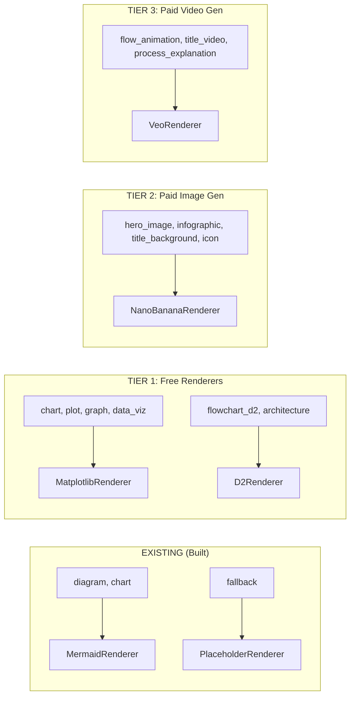

# Visual Renderer Expansion — Implementation Plans

**Created**: 2026-03-30 (Session 383)
**Parent**: [Visual Rendering Expansion Plan](../11-visual-rendering-expansion-plan.md)
**Status**: Planning

---

## Document Index

| # | Document | Renderer | Visual Types | Status |
|---|----------|----------|-------------|--------|
| 01 | [Matplotlib Renderer](01-matplotlib-renderer-plan.md) | `MatplotlibRenderer` | chart, plot, graph, data_viz | Planning |
| 02 | [D2 Renderer](02-d2-renderer-plan.md) | `D2Renderer` | flowchart_d2, architecture | Planning |
| 03 | [Nano Banana Renderer](03-nano-banana-renderer-plan.md) | `NanoBananaRenderer` | hero_image, infographic, title_background, icon | Planning |
| 04 | [Veo Renderer](04-veo-renderer-plan.md) | `VeoRenderer` | flow_animation, title_video, process_explanation | Planning |
| 05 | [Theme Integration](05-theme-integration-plan.md) | N/A (cross-cutting) | All | Planning |

## Implementation Priority

| Phase | Renderer | Effort | External Deps | Cost Model |
|-------|----------|--------|--------------|------------|
| 9A | MatplotlibRenderer | 1-2 sessions | matplotlib, seaborn (pip) | Free |
| 9B | D2Renderer | 1 session | d2 CLI binary | Free |
| 10A | NanoBananaRenderer | 1-2 sessions | google-genai SDK (installed) | $0.045-$0.151/image |
| 10B | VeoRenderer | 1-2 sessions | google-genai SDK (installed) | $0.20/sec (1080p) |
| 11 | Theme Integration | 1 session | Phases 9-10 complete | N/A |

## Architecture Summary

All renderers implement the same ABC:

```python
class VisualRenderer( ABC ):
    SUPPORTED_TYPES: ClassVar[ List[ str ] ] = []

    @abstractmethod
    async def render( self, visual_type: str, visual_description: str, **kwargs ) -> Optional[ str ]:
        ...
```



## Key Pattern: File-Producing Renderers

Current renderers return inline markdown. New renderers produce files:

| Renderer | Output File | Marp Embedding |
|----------|------------|---------------|
| Matplotlib | PNG/SVG | `` |
| D2 | SVG | `` |
| Nano Banana | PNG | `` |
| Veo | MP4 + PNG frame | `<video>` for HTML, `` for PDF |

All file-producing renderers receive `output_dir` via kwargs. The orchestrator creates a `visuals/` subdirectory next to the Marp file.
