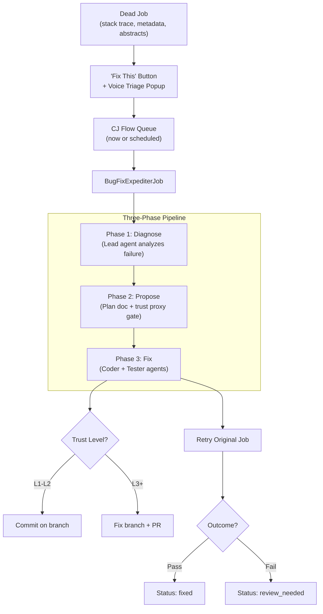

# Bug Fix Expediter — Plan Index

**Created**: 2026-03-27 (Session 381)
**Status**: Planning
**Pattern**: Pattern 1 (Multi-Phase Implementation) with Phase 0 prerequisite
**Prefix**: [LUPIN]

---

## Documents

| Doc | Purpose | Status |
|-----|---------|--------|
| [00-index.md](00-index.md) | This file — navigation hub | Active |
| [01-implementation-plan.md](01-implementation-plan.md) | Full implementation plan with phases and tasks | Active |
| [02-agentic-job-consistency-audit.md](02-agentic-job-consistency-audit.md) | Phase 0 audit findings and remediation spec | Active |

## Context

**Problem**: CJ Flow jobs that die end up in the dead bucket with rich failure context (stack traces, metadata, abstract objects) but no automated path to diagnosis and repair.

**Solution**: A new `BugFixExpediterJob` that takes a dead job's context, runs a three-phase forensic pipeline (diagnose → propose → fix), and optionally retries the original job to validate the fix — all runnable overnight via scheduled queuing.

**Prerequisite**: Existing agentic job implementations have significant consistency gaps (voice I/O API divergence, missing `set_job_id()`, config loading patterns, etc.) that must be remediated before building another job type.

## Architecture Summary

## Related Work

- SWE Team: `src/cosa/agents/swe_team/` (coder/tester agent definitions reused)
- Agentic Voice Workflow Skill: `~/.claude/skills/agentic-voice-workflow/SKILL.md`
- CJ Flow Persistence: `src/rnd/v0.1.6/2026.03.13-cj-flow-persistence-plan.md`
- Scheduled Queuing: `src/rnd/2026.03.27-cj-flow-timed-execution-monopolize-pause.md`
