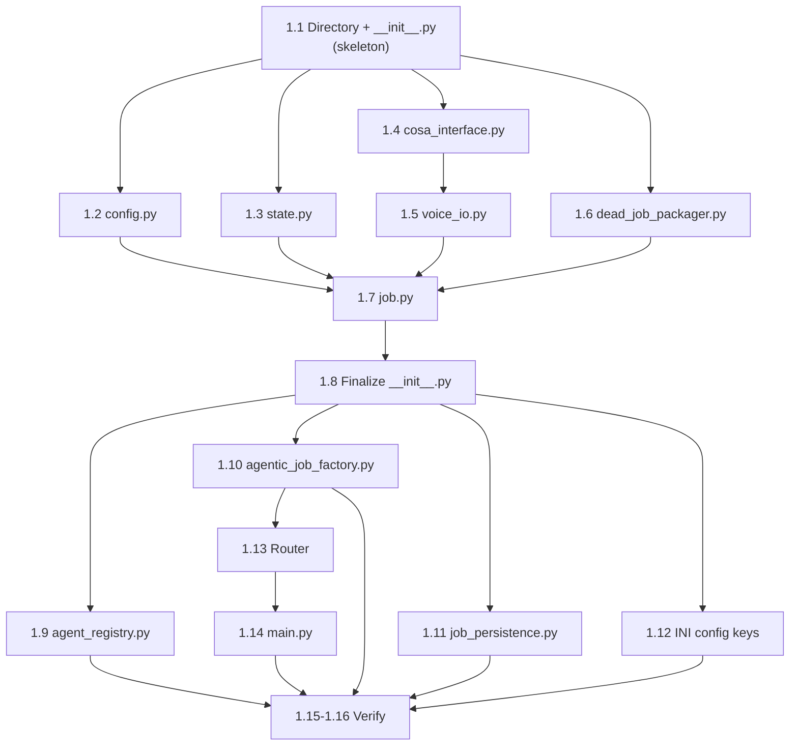
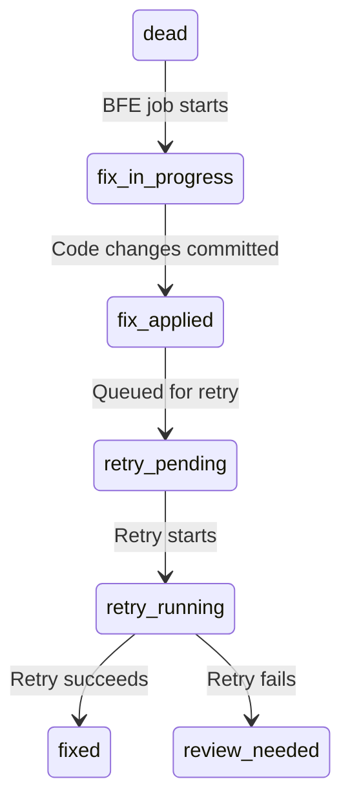

# Bug Fix Expediter — Implementation Plan

**Created**: 2026-03-27 (Session 381)
**Status**: Phase 0 Complete (Session 381c), Phase 0.9 Validated (Session 382 — 196/0/4:58), Phase 1 Ready
**Pattern**: Pattern 1 (Multi-Phase Implementation)
**Estimated Duration**: 4-6 weeks (Phases 0-7)
**Prefix**: [LUPIN]

---

## Context

CJ Flow jobs that die accumulate in the dead bucket with rich failure context: stack traces, original question, agent type, timestamps, and abstract objects created during execution. Today, diagnosing and fixing these failures is a manual process.

The Bug Fix Expediter automates this with a three-phase forensic pipeline (diagnose → propose → fix) that can run overnight via scheduled queuing. It reuses the SWE team's coder and tester agent definitions but wraps them in a purpose-built orchestrator optimized for failure forensics.

### Design Decisions

| Decision | Choice | Rationale |
|----------|--------|-----------|
| New job type vs. SweTeamJob mode | New `BugFixExpediterJob` | Different prompt template (forensic), different pipeline (3-phase vs Lead decomposition), different artifacts |
| Coder/tester reuse | Import agent definitions, not handoff | Single job, single state machine, single audit trail |
| Trust proxy integration | Feed plan context, not just yes/no | Proxy learns faster from plan complexity (3-line fix vs 50-line refactor) |
| Git strategy | L1-L2: commit on branch; L3+: fix branch + PR | Trust level maps naturally to blast radius |
| Retry after fix | Single attempt, then flag for review | Prevents recursive fix spirals |
| Scope guard | Trust proxy manages via plan complexity | No hard caps on file changes; committed baseline protects against damage |

---

## Phase Overview

| Phase | Description | Estimated Sessions | Dependencies |
|-------|-------------|-------------------|--------------|
| **0** | Agentic Job Consistency Remediation | 1-2 | None |
| **0.95** | Update All Model Defaults to Claude 4.6 | <1 | Phase 0 |
| **1** | Foundation: Job, Config, State, Directory | 1 | Phase 0.95 |
| **2** | Orchestrator: Diagnose Phase | 1-2 | Phase 1 |
| **3** | Orchestrator: Propose Phase + Plan Artifacts | 1 | Phase 2 |
| **4** | Orchestrator: Fix Phase (Coder + Tester) | 1-2 | Phase 3 |
| **5** | Trust Proxy Integration + Git Strategy | 1-2 | Phase 4 |
| **6** | Retry Pipeline + Dead Job State Extensions | 1 | Phase 4 |
| **7** | Voice-First UX: "Fix This" Button + Triage Popup | 1-2 | Phase 5, 6 |

---

## Phase 0: Agentic Job Consistency Remediation

**Goal**: Fix critical consistency gaps across all existing AgenticJobBase implementations and update the agentic-voice-workflow skill template.

**Detailed spec**: See [02-agentic-job-consistency-audit.md](02-agentic-job-consistency-audit.md)

**Tasks**:

| # | Task | Status |
|---|------|--------|
| 0.1 | Audit all `notify()` calls across 6 jobs — catalog params | **DONE** (Session 381c) |
| 0.2 | Fix: Add `set_job_id()`/`clear_job_id()` to SweTeam, ClaudeCode, Mock | **DONE** (Session 381c) |
| 0.3 | Fix: Add `queue_name="run"` to all live notification calls | **DONE** (Session 381c) |
| 0.4 | Fix: Align ClaudeCodeJob notification API with voice_io pattern | **Deferred** — cosa_interface already supports queue_name |
| 0.5 | Fix: Add `from_config()` to SweTeamConfig + ClaudeCodeJob config | **DONE** (Session 381c) |
| 0.6 | Fix: Decouple MockAgenticJob from deep_research voice_io | **N/A** — MockAgenticJob not found in codebase |
| 0.7 | Update agentic-voice-workflow skill template with enforcement checklist | **DONE** (Session 381c — v1.2 → v1.3) |
| 0.8 | Run full unit test suite — verify no regressions | **DONE** (Session 381c — 2367 passed, 0 regressions) |
| 0.9 | Run integration test suite (`--bg`) — verify job lifecycle | **DONE** (Session 382 — 196 passed, 0 failed, 4:58) |

**Verification**: Unit tests pass, integration tests pass, dry-run each job type via API.

---

## Phase 0.95: Update All Model Defaults to Claude 4.6

**Goal**: Update all agentic job model defaults from legacy dated IDs (`claude-opus-4-20250514`, `claude-sonnet-4-20250514`) to current Claude 4.6 family. Ensures BFE Phase 1 starts with current models and existing jobs benefit immediately.

**Model ID Mapping**:

| Old ID | New ID |
|--------|--------|
| `claude-opus-4-20250514` | `claude-opus-4-6` |
| `claude-sonnet-4-20250514` | `claude-sonnet-4-6` |
| `claude-haiku-4-5-20250514` | `claude-haiku-4-5-20251001` |

**Tasks**:

| # | Task | Files | Occurrences | Status |
|---|------|-------|:-----------:|--------|
| 0.95a | Update source code defaults | 6 CoSA agent config/CLI files | ~20 | Pending |
| 0.95b | Update CLI help strings | 3 CLI/argparse files | ~5 | Pending |
| 0.95c | Update INI config defaults | `lupin-app.ini`, `lupin-app-splainer.ini` | ~11 | Pending |
| 0.95d | Add new model IDs to cost tracker tier map (keep old for backward compat) | `cost_tracker.py` | ~3 new | Pending |
| 0.95e | Update unit test assertions | 9 test files | ~15 | Pending |
| 0.95f | Update workflow template | `agentic-voice-workflow.md` | ~12 | Pending |
| 0.95g | Run smoke tests + full unit test regression | — | — | Pending |

**Source Code Files (Task 0.95a)**:

| File | Fields Changed |
|------|---------------|
| `src/cosa/agents/deep_research/config.py` | `lead_model`, `subagent_model` defaults + smoke test assertions |
| `src/cosa/agents/swe_team/config.py` | `lead_model`, `worker_model` defaults + smoke test assertions |
| `src/cosa/agents/presentation_generator/config.py` | `content_model` default + `from_config()` fallback + smoke tests |
| `src/cosa/agents/podcast_generator/config.py` | `script_model` default + `from_config()` fallback + smoke tests |
| `src/cosa/agents/deep_research_to_podcast/agent.py` | argparse defaults |
| `src/cosa/agents/deep_research_to_podcast/__main__.py` | help text |

**CLI Help Strings (Task 0.95b)**:

| File |
|------|
| `src/cosa/agents/deep_research/cli.py` |
| `src/cosa/agents/swe_team/__main__.py` |
| `src/cosa/agents/deep_research_to_podcast/__main__.py` |

**INI Config (Task 0.95c)**:
- `src/conf/lupin-app.ini` — 6 model default values (lines 528-529, 661, 715, 755-756)
- `src/conf/lupin-app-splainer.ini` — 5 explanation texts (lines 116-117, 241, 294, 651-652)

**Cost Tracker (Task 0.95d)**: `src/cosa/agents/deep_research/cost_tracker.py`
- ADD `"claude-opus-4-6"`, `"claude-sonnet-4-6"`, `"claude-haiku-4-5-20251001"` to model tier map
- KEEP old entries for backward compatibility with historical cost data
- Check if `ModelTier` enum needs new entries (`OPUS_4_6`, `SONNET_4_6`) or if pricing is same

**Unit Tests (Task 0.95e)**:

| File | What Changes |
|------|-------------|
| `src/tests/unit/test_swe_team_config.py` | Default assertions |
| `src/tests/unit/test_swe_team_job.py` | Test params + assertions |
| `src/tests/unit/test_swe_team_delegation.py` | Model in test fixture |
| `src/tests/unit/test_swe_team_verification.py` | Model in test fixture |
| `src/tests/unit/test_presentation_generator_job.py` | Default assertions |
| `src/tests/unit/test_presentation_api_client.py` | Test model + assertion |
| `src/tests/unit/test_runtime_argument_expeditor.py` | Expected model values |
| `src/tests/integration/test_sdk_validation.py` | Test model |
| `src/cosa/agents/podcast_generator/tests/test_podcast_generator.py` | Default assertion |

**Historical R&D docs** — SKIP (4 files document what was true at the time):
`src/rnd/v0.1.4/...`, `src/rnd/v0.1.1/...` (3 files)

**Verification**:
```bash
# Compile check all modified source files
# Smoke tests: deep_research, swe_team, presentation_generator, podcast_generator configs
# Full regression: pytest src/tests/unit/ -v
```

**Totals**: 22 files, ~66 occurrences across MUST+SHOULD categories.

---

## Phase 1: Foundation

**Goal**: Create the BugFixExpediterJob scaffolding following the now-consistent agentic job pattern.
**Gold-Standard Reference**: `src/cosa/agents/deep_research/` (all patterns replicated exactly)
**Estimated Duration**: 1 session

### File Inventory

**New Files (8)**:

| # | File | Purpose |
|---|------|---------|
| 1 | `src/cosa/agents/bug_fix_expediter/__init__.py` | Package exports |
| 2 | `src/cosa/agents/bug_fix_expediter/config.py` | `BugFixExpediterConfig` dataclass + `from_config()` |
| 3 | `src/cosa/agents/bug_fix_expediter/state.py` | `DeadJobContext`, `DiagnosisResult`, `ProposedFix`, `FixResult`, `BFEState`, `BFEPhase` |
| 4 | `src/cosa/agents/bug_fix_expediter/cosa_interface.py` | Notification dispatcher wrappers |
| 5 | `src/cosa/agents/bug_fix_expediter/voice_io.py` | Thin wrapper configuring core voice_io |
| 6 | `src/cosa/agents/bug_fix_expediter/dead_job_packager.py` | Extract `DeadJobContext` from persisted dead job |
| 7 | `src/cosa/agents/bug_fix_expediter/job.py` | `BugFixExpediterJob(AgenticJobBase)` |
| 8 | `src/cosa/rest/routers/bug_fix_expediter.py` | REST endpoint: `POST /api/bug-fix-expediter/submit` |

**Files to Modify (6)**:

| # | File | Change |
|---|------|--------|
| 9 | `src/cosa/agents/runtime_argument_expeditor/agent_registry.py` | Add `AGENTIC_AGENTS` entry, update assertion 6→7 |
| 10 | `src/cosa/rest/agentic_job_factory.py` | Add `elif` branch for `"agent router go to bug fix expediter"` |
| 11 | `src/cosa/rest/job_persistence.py` | Add `"bug_fix_expediter"` to `AGENTIC_JOB_TYPES` |
| 12 | `src/conf/lupin-app.ini` | Add 11 config keys under `[Lupin: Baseline]` |
| 13 | `src/conf/lupin-app-splainer.ini` | Add matching explanations for all 11 keys |
| 14 | `src/fastapi_app/main.py` | Import + register `bug_fix_expediter` router |

### Task Table

| # | Task | Status |
|---|------|--------|
| 1.1 | Create directory + `__init__.py` (skeleton, imports commented) | Pending |
| 1.2 | Implement `config.py` — `BugFixExpediterConfig` with `from_config()` | Pending |
| 1.3 | Implement `state.py` — `BFEPhase`, `DeadJobContext`, `DiagnosisResult`, `ProposedFix`, `FixResult`, `BFEState` | Pending |
| 1.4 | Implement `cosa_interface.py` — notification dispatcher wrappers | Pending |
| 1.5 | Implement `voice_io.py` — thin core voice_io wrapper | Pending |
| 1.6 | Implement `dead_job_packager.py` — dead job context extraction | Pending |
| 1.7 | Implement `job.py` — `BugFixExpediterJob` with `do_all()`, `_execute()`, `_execute_dry_run()` | Pending |
| 1.8 | Finalize `__init__.py` — uncomment all imports | Pending |
| 1.9 | Modify `agent_registry.py` — add AGENTIC_AGENTS entry | Pending |
| 1.10 | Modify `agentic_job_factory.py` — add factory branch | Pending |
| 1.11 | Modify `job_persistence.py` — add to AGENTIC_JOB_TYPES | Pending |
| 1.12 | Modify `lupin-app.ini` + `lupin-app-splainer.ini` — add 11 config keys | Pending |
| 1.13 | Create `routers/bug_fix_expediter.py` — submit endpoint | Pending |
| 1.14 | Modify `main.py` — register router | Pending |
| 1.15 | Run smoke tests + py_compile on all files | Pending |
| 1.16 | Run unit test suite — verify no regressions | Pending |

### Implementation Order



**Parallelizable**: Tasks 1.2-1.4, 1.6 after 1.1. Tasks 1.9, 1.11, 1.12 after 1.8.

---

### File Specifications

#### File 1: `__init__.py`

**Implementation note**: Write initially with all imports commented out. Finalize (Task 1.8) by uncommenting after all submodules exist.

**Final code (Task 1.8)**:
```python
"""
COSA Bug Fix Expediter Agent Package.

An agentic job that takes a dead (failed/interrupted) job's context,
runs a three-phase forensic pipeline (diagnose -> propose -> fix),
and optionally retries the original job.
"""

from .config import BugFixExpediterConfig

from .state import (
    BFEPhase,
    DeadJobContext,
    DiagnosisResult,
    ProposedFix,
    FixResult,
    BFEState,
    create_initial_state
)

from .cosa_interface import (
    notify_progress,
    ask_confirmation,
    get_feedback,
    present_choices,
)

from .voice_io import (
    set_cli_mode,
    reset_voice_check,
    is_voice_available,
    get_mode_description,
    notify as voice_notify,
    ask_yes_no as voice_ask_yes_no,
    get_input as voice_get_input,
    choose as voice_choose,
)

from .dead_job_packager import package_dead_job

__all__ = [
    "BugFixExpediterConfig",
    "BFEPhase", "DeadJobContext", "DiagnosisResult", "ProposedFix",
    "FixResult", "BFEState", "create_initial_state",
    "notify_progress", "ask_confirmation", "get_feedback", "present_choices",
    "set_cli_mode", "reset_voice_check", "is_voice_available", "get_mode_description",
    "voice_notify", "voice_ask_yes_no", "voice_get_input", "voice_choose",
    "package_dead_job",
]

__version__ = "0.1.0"
```

---

#### File 2: `config.py` — BugFixExpediterConfig

**Pattern**: Follows `SweTeamConfig` (newest `from_config()` style from `src/cosa/agents/swe_team/config.py`).

```python
@dataclass
class BugFixExpediterConfig:
    """Configuration for the Bug Fix Expediter agent."""

    # Model Selection
    lead_model                : str   = "claude-opus-4-6"
    worker_model              : str   = "claude-sonnet-4-6"

    # Execution Limits
    max_diagnosis_iterations  : int   = 3
    max_fix_attempts          : int   = 2
    wall_clock_timeout_secs   : int   = 600

    # Budget
    budget_usd                : float = 2.00

    # COSA Integration
    feedback_timeout_seconds  : int   = 300
    narrate_progress          : bool  = True

    # Retry Behavior
    auto_retry_on_fix         : bool  = False
    require_user_confirm      : bool  = True

    # Feature Flags
    enabled                   : bool  = False

    @classmethod
    def from_config( cls, config_mgr, debug=False ):
        """Create config from ConfigurationManager INI values."""
        # key_map + type coercion loop (identical to SweTeamConfig pattern)
```

**key_map** (11 entries):
```python
key_map = {
    "lead_model"               : "bug fix expediter lead model",
    "worker_model"             : "bug fix expediter worker model",
    "max_diagnosis_iterations" : "bug fix expediter max diagnosis iterations",
    "max_fix_attempts"         : "bug fix expediter max fix attempts",
    "wall_clock_timeout_secs"  : "bug fix expediter wall clock timeout seconds",
    "budget_usd"               : "bug fix expediter budget usd",
    "feedback_timeout_seconds" : "bug fix expediter feedback timeout seconds",
    "narrate_progress"         : "bug fix expediter narrate progress",
    "auto_retry_on_fix"        : "bug fix expediter auto retry on fix",
    "require_user_confirm"     : "bug fix expediter require user confirm",
    "enabled"                  : "bug fix expediter enabled",
}
```

**`quick_smoke_test()`**:
```python
def quick_smoke_test():
    import cosa.utils.util as cu
    cu.print_banner( "BugFixExpediterConfig Smoke Test", prepend_nl=True )
    try:
        # 1: Default instantiation
        config = BugFixExpediterConfig()
        assert config.lead_model == "claude-opus-4-6"
        assert config.worker_model == "claude-sonnet-4-6"
        assert config.max_fix_attempts == 2
        assert config.enabled == False
        print( "✓ Default config values correct" )

        # 2: Custom values
        config = BugFixExpediterConfig( lead_model="custom-model", budget_usd=10.0, enabled=True )
        assert config.lead_model == "custom-model"
        assert config.budget_usd == 10.0
        assert config.enabled == True
        print( "✓ Custom config values work" )

        # 3: from_config (wrapped — may fail without INI keys)
        try:
            from cosa.config.configuration_manager import ConfigurationManager
            config_mgr = ConfigurationManager( env_var_name="LUPIN_CONFIG_MGR_CLI_ARGS" )
            config = BugFixExpediterConfig.from_config( config_mgr, debug=True )
            print( f"✓ from_config loaded (lead={config.lead_model})" )
        except Exception as e:
            print( f"⚠ from_config skipped (INI keys may not exist yet): {e}" )

        print( "\n✓ BugFixExpediterConfig smoke test completed successfully" )
    except Exception as e:
        print( f"\n✗ Smoke test failed: {e}" )
        import traceback
        traceback.print_exc()

if __name__ == "__main__":
    quick_smoke_test()
```

---

#### File 3: `state.py` — State Models

**Enum**: `BFEPhase`
```python
class BFEPhase( Enum ):
    PACKAGING            = "packaging"
    DIAGNOSING           = "diagnosing"
    PROPOSING            = "proposing"
    FIXING               = "fixing"
    RETRYING             = "retrying"
    WAITING_CONFIRMATION = "waiting_confirmation"
    COMPLETED            = "completed"
    FAILED               = "failed"
    SKIPPED              = "skipped"
```

**Pydantic Model**: `DeadJobContext` — 15 fields from `job_history` table:
```python
class DeadJobContext( BaseModel ):
    id_hash          : str
    job_type         : str
    user_id          : str
    user_email       : str
    session_id       : str
    status           : str                    # "failed" or "interrupted"
    question_text    : str
    error            : Optional[ str ]        = None
    stack_trace      : Optional[ str ]        = None
    routing_command  : Optional[ str ]        = None
    duration_seconds : Optional[ float ]      = None
    metadata_json    : Optional[ dict ]       = Field( default_factory=dict )
    created_at       : Optional[ str ]        = None
    started_at       : Optional[ str ]        = None
    completed_at     : Optional[ str ]        = None
```

**Pydantic Model**: `DiagnosisResult` — root cause analysis output:
```python
class DiagnosisResult( BaseModel ):
    root_cause          : str
    error_category      : str          # config, code_bug, dependency, timeout, resource, unknown
    confidence          : float        # 0.0-1.0
    evidence            : list[ str ]  = Field( default_factory=list )
    affected_components : list[ str ]  = Field( default_factory=list )
    is_transient        : bool         = False
```

**Pydantic Model**: `ProposedFix`:
```python
class ProposedFix( BaseModel ):
    title            : str
    description      : str
    fix_type         : str          # config_change, code_patch, retry, manual
    confidence       : float        # 0.0-1.0
    risk_level       : str          = "low"
    estimated_effort : str          = "minimal"
    changes          : list[ dict ] = Field( default_factory=list )
```

**Pydantic Model**: `FixResult`:
```python
class FixResult( BaseModel ):
    applied        : bool
    success        : bool
    details        : str  = ""
    retry_eligible : bool = False
```

**TypedDict**: `BFEState` — complete pipeline state:
```python
class BFEState( TypedDict ):
    dead_job_id      : str
    extra_context    : str
    dead_job_context : Optional[ DeadJobContext ]
    diagnosis        : Optional[ DiagnosisResult ]
    proposed_fixes   : list[ ProposedFix ]
    selected_fix     : Optional[ ProposedFix ]
    user_approved    : bool
    fix_result       : Optional[ FixResult ]
    retry_job_id     : Optional[ str ]
    retry_status     : Optional[ str ]
    phase            : str
    error            : Optional[ str ]
```

**Factory**: `create_initial_state( dead_job_id, extra_context="" ) → BFEState`

**`quick_smoke_test()`**:
```python
def quick_smoke_test():
    import cosa.utils.util as cu
    cu.print_banner( "BFE State Models Smoke Test", prepend_nl=True )
    try:
        # 1: BFEPhase enum
        assert BFEPhase.PACKAGING.value == "packaging"
        assert BFEPhase.COMPLETED.value == "completed"
        assert len( BFEPhase ) == 9
        print( "✓ BFEPhase enum correct (9 values)" )

        # 2: DeadJobContext
        ctx = DeadJobContext(
            id_hash="dr-test::user1", job_type="deep_research",
            user_id="user1", user_email="t@t.com", session_id="s1",
            status="failed", question_text="test query", error="boom"
        )
        assert ctx.status == "failed"
        assert ctx.stack_trace is None
        print( "✓ DeadJobContext validates correctly" )

        # 3: DiagnosisResult
        diag = DiagnosisResult(
            root_cause="Missing config key", error_category="config", confidence=0.9
        )
        assert diag.is_transient == False
        print( "✓ DiagnosisResult validates correctly" )

        # 4: ProposedFix
        fix = ProposedFix(
            title="Add key", description="Add missing key to INI",
            fix_type="config_change", confidence=0.95
        )
        assert fix.risk_level == "low"
        print( "✓ ProposedFix validates correctly" )

        # 5: FixResult
        result = FixResult( applied=True, success=True, details="Key added" )
        assert result.retry_eligible == False
        print( "✓ FixResult validates correctly" )

        # 6: create_initial_state
        state = create_initial_state( "dr-test::user1", "extra info" )
        assert state[ "dead_job_id" ] == "dr-test::user1"
        assert state[ "phase" ] == "packaging"
        assert state[ "diagnosis" ] is None
        print( "✓ create_initial_state works correctly" )

        print( "\n✓ BFE State Models smoke test completed successfully" )
    except Exception as e:
        print( f"\n✗ Smoke test failed: {e}" )
        import traceback
        traceback.print_exc()

if __name__ == "__main__":
    quick_smoke_test()
```

---

#### File 4: `cosa_interface.py` — Notification Dispatcher

**Pattern**: Structural clone of `src/cosa/agents/deep_research/cosa_interface.py` (only `AGENT_TYPE` changes).

**Complete import block**:
```python
import logging
from typing import Optional

from lupin_cli.notifications.notification_models import (
    NotificationRequest,
    AsyncNotificationRequest,
    NotificationResponse,
    AsyncNotificationResponse,
    NotificationType,
    NotificationPriority,
    ResponseType
)
from cosa.utils.notification_utils import format_questions_for_tts, convert_questions_for_api

from cosa.agents.utils.sender_id import build_sender_id
from cosa.agents.utils.feedback_analysis import (
    is_approval, is_rejection, extract_feedback_intent,
    APPROVAL_SIGNALS, REJECTION_SIGNALS
)
from cosa.agents.utils.agent_notification_dispatcher import AgentNotificationDispatcher

logger = logging.getLogger( __name__ )
```

**Module-level state**:
```python
AGENT_TYPE = "bug.fix.expediter"
_dispatcher = AgentNotificationDispatcher( agent_type=AGENT_TYPE )

def _get_sender_id( suffix: str = None ) -> str:
    if suffix is not None:
        return _dispatcher.build_sender_id( suffix=suffix )
    return _dispatcher.build_sender_id()

SENDER_ID: str                 = _get_sender_id()
SESSION_NAME: Optional[ str ]  = None
TARGET_USER: Optional[ str ]   = None
```

**4 async functions** (each sets `_dispatcher.sender_id`, `.session_name`, `.target_user` before delegating):
```python
async def notify_progress( message, priority="medium", abstract=None,
                           session_name=None, job_id=None, queue_name=None,
                           progress_group_id=None ):
    _dispatcher.sender_id    = SENDER_ID
    _dispatcher.session_name = SESSION_NAME
    _dispatcher.target_user  = TARGET_USER
    await _dispatcher.notify_progress(
        message, priority=priority, abstract=abstract,
        session_name=session_name, job_id=job_id,
        queue_name=queue_name, progress_group_id=progress_group_id
    )

async def ask_confirmation( question, default="no", timeout=60, abstract=None, job_id=None ):
    _dispatcher.sender_id   = SENDER_ID
    _dispatcher.target_user = TARGET_USER
    return await _dispatcher.ask_confirmation(
        question, default=default, timeout=timeout, abstract=abstract, job_id=job_id
    )

async def get_feedback( prompt, timeout=300, job_id=None ):
    _dispatcher.sender_id   = SENDER_ID
    _dispatcher.target_user = TARGET_USER
    return await _dispatcher.get_feedback( prompt, timeout=timeout, job_id=job_id )

async def present_choices( questions, timeout=120, title=None, abstract=None, job_id=None ):
    _dispatcher.sender_id   = SENDER_ID
    _dispatcher.target_user = TARGET_USER
    return await _dispatcher.present_choices(
        questions, timeout=timeout, title=title, abstract=abstract, job_id=job_id
    )
```

**`quick_smoke_test()`**:
```python
def quick_smoke_test():
    import cosa.utils.util as cu
    import inspect
    cu.print_banner( "BFE COSA Interface Smoke Test", prepend_nl=True )
    try:
        # 1: Imports valid
        assert NotificationRequest is not None
        assert NotificationType is not None
        print( "✓ Imports valid" )

        # 2: is_approval / is_rejection
        assert is_approval( "yes" ) is True
        assert is_approval( "no" ) is False
        assert is_rejection( "no" ) is True
        assert is_rejection( "yes" ) is False
        print( "✓ Feedback analysis works" )

        # 3: extract_feedback_intent
        intent = extract_feedback_intent( "yes, go ahead" )
        assert intent[ "is_approval" ] is True
        print( "✓ extract_feedback_intent works" )

        # 4: Async function signatures
        assert inspect.iscoroutinefunction( notify_progress )
        assert inspect.iscoroutinefunction( ask_confirmation )
        assert inspect.iscoroutinefunction( get_feedback )
        assert inspect.iscoroutinefunction( present_choices )
        print( "✓ Async functions have correct signatures" )

        # 5: Dispatcher agent_type
        assert _dispatcher.agent_type == "bug.fix.expediter"
        assert "bug.fix.expediter@" in _dispatcher.sender_id
        print( f"✓ Dispatcher sender_id: {_dispatcher.sender_id}" )

        print( "\n✓ BFE COSA Interface smoke test completed successfully" )
    except Exception as e:
        print( f"\n✗ Smoke test failed: {e}" )
        import traceback
        traceback.print_exc()

if __name__ == "__main__":
    quick_smoke_test()
```

---

#### File 5: `voice_io.py` — Voice I/O Wrapper

**Pattern**: Exact structural clone of `src/cosa/agents/deep_research/voice_io.py`.

```python
from cosa.agents.utils import voice_io as _core_voice_io
from . import cosa_interface as _cosa_interface

_core_voice_io.configure( _cosa_interface )

def reconfigure():
    _core_voice_io.configure( _cosa_interface )

# 12 re-exports from _core_voice_io:
set_cli_mode, reset_voice_check, is_voice_available, get_mode_description,
is_cli_mode, set_job_id, clear_job_id, notify, ask_yes_no, get_input,
choose, present_choices
```

**Note**: No `select_themes`/`select_topics` (deep-research-specific).

**`quick_smoke_test()`**:
```python
def quick_smoke_test():
    import cosa.utils.util as cu
    import inspect
    cu.print_banner( "BFE Voice I/O Smoke Test", prepend_nl=True )
    try:
        # 1: Core re-exports exist
        assert callable( set_job_id )
        assert callable( clear_job_id )
        assert callable( reconfigure )
        print( "✓ Core functions exported" )

        # 2: Async functions
        assert inspect.iscoroutinefunction( notify )
        assert inspect.iscoroutinefunction( ask_yes_no )
        assert inspect.iscoroutinefunction( get_input )
        assert inspect.iscoroutinefunction( choose )
        assert inspect.iscoroutinefunction( present_choices )
        print( "✓ Async functions have correct signatures" )

        # 3: Configuration functions
        assert callable( set_cli_mode )
        assert callable( reset_voice_check )
        assert callable( is_voice_available )
        assert callable( get_mode_description )
        print( "✓ Configuration functions exported" )

        # 4: reconfigure doesn't crash
        reconfigure()
        print( "✓ reconfigure() succeeds" )

        print( "\n✓ BFE Voice I/O smoke test completed successfully" )
    except Exception as e:
        print( f"\n✗ Smoke test failed: {e}" )
        import traceback
        traceback.print_exc()

if __name__ == "__main__":
    quick_smoke_test()
```

---

#### File 6: `dead_job_packager.py` — Dead Job Context Extraction

**The novel piece.** Queries `job_history` Postgres table via `get_job_by_id_hash()`.

```python
def package_dead_job( dead_job_id: str, debug: bool = False ) -> Optional[ DeadJobContext ]:
    """
    Requires:
        - dead_job_id is non-empty
    Ensures:
        - Returns DeadJobContext if job found with status failed/interrupted
        - Returns None if job not found
        - Raises ValueError if job exists but status is not failed/interrupted
    """
    from cosa.rest.job_persistence import get_job_by_id_hash

    row = get_job_by_id_hash( dead_job_id )
    if row is None: return None

    status = row.get( "status", "" )
    if status not in ( "failed", "interrupted" ):
        raise ValueError( f"Job {dead_job_id} has status '{status}'" )

    metadata = row.get( "metadata_json" ) or {}

    return DeadJobContext(
        id_hash          = row[ "id_hash" ],
        job_type         = row[ "job_type" ],
        user_id          = row[ "user_id" ],
        user_email       = row.get( "user_email", "" ),
        session_id       = row.get( "session_id", "" ),
        status           = status,
        question_text    = row.get( "question_text", "" ),
        error            = row.get( "error" ),
        stack_trace      = metadata.get( "stack_trace" ),
        routing_command  = row.get( "routing_command" ),
        duration_seconds = row.get( "duration_seconds" ),
        metadata_json    = metadata,
        created_at       = row.get( "created_at" ),
        started_at       = row.get( "started_at" ),
        completed_at     = row.get( "completed_at" ),
    )
```

**Dead job metadata available** (from `_build_metadata_json()` rich_fields in `job_persistence.py`):
`response_text`, `abstract`, `report_link`, `cost_summary`, `artifacts`, `answer_conversational`, `push_counter`, `agent_type`, `stack_trace`, `scheduled_at`, `monopolize`

**Database schema** (`job_history` table, `postgres_models.py`):
- `id_hash` VARCHAR(255), `job_type` VARCHAR(100), `user_id` VARCHAR(255)
- `user_email`, `session_id`, `routing_command` VARCHAR(255)
- `status` VARCHAR(50): `pending`, `running`, `completed`, `failed`, `interrupted`
- `question_text` TEXT, `error` TEXT (exception message — NOT in metadata_json)
- `duration_seconds` FLOAT, `is_cache_hit` BOOLEAN
- `metadata_json` JSONB (rich fields above)
- `created_at`, `started_at`, `completed_at`, `updated_at` TIMESTAMP

Includes `quick_smoke_test()` testing: import, empty ID validation, non-existent job returns None, direct `DeadJobContext` construction.

---

#### File 7: `job.py` — BugFixExpediterJob

**Pattern**: Follows `DeepResearchJob` exactly.

```python
class BugFixExpediterJob( AgenticJobBase ):
    JOB_TYPE   = "bug_fix_expediter"
    JOB_PREFIX = "bfe"

    def __init__( self, dead_job_id, user_id, user_email, session_id,
                  extra_context="", dry_run=False, debug=False, verbose=False ):
        super().__init__( user_id=user_id, user_email=user_email,
                          session_id=session_id, debug=debug, verbose=verbose )
        self.dead_job_id      = dead_job_id
        self.extra_context    = extra_context
        self.dry_run          = dry_run
        self.dead_job_context = None    # DeadJobContext
        self.diagnosis        = None    # DiagnosisResult (Phase 2+)
        self.cost_summary     = None

    @property
    def last_question_asked( self ):
        return f"[Bug Fix Expediter] Fix job: {self.dead_job_id}"
```

**`do_all()` — full body**:
```python
def do_all( self ) -> str:
    if self.debug: print( f"[BugFixExpediterJob] Starting do_all() for dead job: {self.dead_job_id}" )

    self.status     = "running"
    self.started_at = datetime.now().isoformat()

    try:
        result = asyncio.run( self._execute() )

        if self._cancel_requested:
            self.status                = "cancelled"
            self.completed_at          = datetime.now().isoformat()
            self.error                 = "Cancelled by user request"
            self.answer_conversational = result or "Bug fix was cancelled."
            return self.answer_conversational

        self.status       = "completed"
        self.completed_at = datetime.now().isoformat()
        self.result       = result
        self.answer_conversational = result
        return result

    except Exception as e:
        import traceback
        tb_str = traceback.format_exc()

        self.status       = "failed"
        self.completed_at = datetime.now().isoformat()
        self.error        = f"{e}\n\n{tb_str}"

        print( f"[BugFixExpediterJob] Failed: {e}" )
        print( tb_str )

        self.answer_conversational = f"Bug fix failed: {str( e )}"
        return self.answer_conversational
```

**`_execute()` — full body**:
```python
async def _execute( self ) -> str:
    from cosa.agents.bug_fix_expediter import voice_io, cosa_interface
    from cosa.agents.bug_fix_expediter.dead_job_packager import package_dead_job

    voice_io.reconfigure()

    if self.dry_run:
        return await self._execute_dry_run( voice_io, cosa_interface )

    cosa_interface.SENDER_ID   = cosa_interface._get_sender_id( suffix=self.base_id )
    cosa_interface.TARGET_USER = self.user_email

    voice_io.set_job_id( self.id_hash )

    try:
        # Phase 0: Package dead job context
        await voice_io.notify(
            f"Packaging dead job context: {self.dead_job_id}",
            priority="medium", job_id=self.id_hash, queue_name="run"
        )

        self.dead_job_context = package_dead_job( self.dead_job_id, debug=self.debug )

        if self.dead_job_context is None:
            msg = f"Dead job not found: {self.dead_job_id}"
            await voice_io.notify( msg, priority="high", job_id=self.id_hash, queue_name="run" )
            return msg

        self.artifacts[ "dead_job_context" ] = self.dead_job_context.model_dump()

        await voice_io.notify(
            f"Dead job packaged: {self.dead_job_context.job_type} "
            f"(status={self.dead_job_context.status})",
            priority="medium", job_id=self.id_hash, queue_name="run"
        )

        # Phases 1-3: Orchestrator pipeline (Phase 2+ implementation)
        result = (
            f"Bug Fix Expediter foundation complete. "
            f"Dead job '{self.dead_job_id}' packaged successfully. "
            f"Job type: {self.dead_job_context.job_type}, "
            f"Error: {( self.dead_job_context.error or 'N/A' )[ :200 ]}. "
            f"Orchestrator pipeline not yet implemented (Phase 2+)."
        )

        await voice_io.notify(
            "Bug Fix Expediter complete (foundation only).",
            priority="medium", job_id=self.id_hash, queue_name="run"
        )

        return result

    except Exception as e:
        await voice_io.notify(
            f"Bug Fix Expediter error: {str( e )[ :100 ]}",
            priority="urgent", job_id=self.id_hash, queue_name="run"
        )
        raise

    finally:
        voice_io.clear_job_id()
```

**`_execute_dry_run()` — full body**:
```python
async def _execute_dry_run( self, voice_io, cosa_interface ) -> str:
    import asyncio

    cosa_interface.SENDER_ID   = cosa_interface._get_sender_id( suffix=self.base_id )
    cosa_interface.TARGET_USER = self.user_email

    if self.debug: print( f"[BugFixExpediterJob] DRY RUN MODE for dead job: {self.dead_job_id}" )

    await voice_io.notify( "🧪 Dry run: Packaging dead job context...", priority="low", job_id=self.id_hash, queue_name="run" )
    await asyncio.sleep( 1.0 )

    await voice_io.notify( "🧪 Dry run: Diagnosing root cause...", priority="low", job_id=self.id_hash, queue_name="run" )
    await asyncio.sleep( 1.0 )

    await voice_io.notify( "🧪 Dry run: Generating fix proposals...", priority="low", job_id=self.id_hash, queue_name="run" )
    await asyncio.sleep( 1.0 )

    await voice_io.notify( "🧪 Dry run: Applying fix (simulated)...", priority="low", job_id=self.id_hash, queue_name="run" )
    await asyncio.sleep( 1.0 )

    await voice_io.notify( "🧪 Dry run: Retry evaluation (simulated)...", priority="low", job_id=self.id_hash, queue_name="run" )
    await asyncio.sleep( 1.0 )

    # Mock artifacts
    self.artifacts[ "dead_job_context" ] = {
        "id_hash"  : self.dead_job_id,
        "job_type" : "unknown",
        "status"   : "failed",
        "error"    : "Simulated error for dry run",
    }
    self.artifacts[ "diagnosis" ] = {
        "root_cause"     : "Simulated root cause",
        "error_category" : "unknown",
        "confidence"     : 0.0,
    }

    completion_abstract = f"""**🧪 Dry Run Complete!**

**Dead Job**: {self.dead_job_id}
**Diagnosis**: Simulated root cause (dry run)
**Fix**: Not applied (dry run)
**Stats**: $0.00 | 0 tokens | 5.0s (simulated)"""

    await voice_io.notify(
        "🧪 Dry run complete! No changes made.",
        priority="medium", abstract=completion_abstract,
        job_id=self.id_hash, queue_name="run"
    )

    return "Dry run complete. Bug fix simulation finished."
```

**`quick_smoke_test()` — full body**:
```python
def quick_smoke_test():
    import cosa.utils.util as cu
    cu.print_banner( "BugFixExpediterJob Smoke Test", prepend_nl=True )
    try:
        # 1: Import
        from cosa.agents.bug_fix_expediter.job import BugFixExpediterJob
        print( "✓ Module imported successfully" )

        # 2: Instantiation
        job = BugFixExpediterJob(
            dead_job_id = "dr-test1234::user123",
            user_id     = "user123",
            user_email  = "test@test.com",
            session_id  = "session456",
            debug       = True
        )
        print( f"✓ Job created with id: {job.id_hash}" )

        # 3: ID format
        assert job.id_hash.startswith( "bfe-" ), "ID should start with bfe-"
        print( f"✓ ID format correct: {job.id_hash}" )

        # 4: last_question_asked
        lqa = job.last_question_asked
        assert "[Bug Fix Expediter]" in lqa
        assert "dr-test1234" in lqa
        print( f"✓ last_question_asked: {lqa}" )

        # 5: is_cacheable
        assert job.is_cacheable == False
        print( "✓ is_cacheable correctly returns False" )

        # 6: Attributes
        assert job.dead_job_id == "dr-test1234::user123"
        assert job.user_email == "test@test.com"
        assert job.status == "pending"
        assert job.dry_run == False
        print( "✓ All attributes set correctly" )

        # 7: Class constants
        assert BugFixExpediterJob.JOB_TYPE == "bug_fix_expediter"
        assert BugFixExpediterJob.JOB_PREFIX == "bfe"
        print( "✓ Class constants correct" )

        print( "\n⚠ Note: do_all() not tested (requires running server)" )
        print( "\n✓ BugFixExpediterJob smoke test completed successfully" )

    except Exception as e:
        print( f"\n✗ Smoke test failed: {e}" )
        import traceback
        traceback.print_exc()

if __name__ == "__main__":
    quick_smoke_test()
```

---

#### File 8: Router `routers/bug_fix_expediter.py`

**Pattern**: Follows `routers/deep_research.py` and `routers/swe_team.py`.

**Pydantic models**:
```python
class BugFixExpediterSubmitRequest( BaseModel ):
    dead_job_id   : str             = Field( ..., min_length=1 )
    extra_context : Optional[ str ] = Field( None )
    dry_run       : bool            = Field( False )
    websocket_id  : Optional[ str ] = Field( None )
    scheduled_at  : Optional[ str ] = Field( None )
    monopolize    : bool            = Field( False )

class BugFixExpediterSubmitResponse( BaseModel ):
    status         : str
    job_id         : str
    queue_position : int
    message        : str
```

**Endpoint**: `POST /api/bug-fix-expediter/submit`
- Extract `user_id`, `user_email` from token
- Build `args_dict` from request body
- `create_agentic_job( "agent router go to bug fix expediter", ... )`
- Apply `scheduled_at`, `monopolize`
- `user_job_tracker.register_scoped_job()`, `todo_queue.push()`
- Return response

---

#### File 9: `agent_registry.py` — AGENTIC_AGENTS Entry

```python
"agent router go to bug fix expediter" : {
    "job_prefix"         : "bfe",
    "cli_module"         : "cosa.agents.bug_fix_expediter",
    "job_class_path"     : "cosa.agents.bug_fix_expediter.job.BugFixExpediterJob",
    "display_name"       : "Bug Fix Expediter",
    "required_user_args" : [ "dead_job_id" ],
    "system_provided"    : [ "user_id", "user_email", "session_id" ],
    "arg_mapping"        : {
        "dead_job_id"   : "dead_job_id",
        "job_id"        : "dead_job_id",
        "failed_job"    : "dead_job_id",
        "extra_context" : "extra_context",
        "context"       : "extra_context",
        "dry_run"       : "dry_run",
    },
    "fallback_questions" : {
        "dead_job_id"   : "Which failed job would you like me to fix? Provide the job ID.",
        "extra_context" : "Any additional context about the failure? Say 'none' to skip.",
        "dry_run"       : "Would you like to enable dry run mode? Say 'yes' or 'no'.",
    },
    "fallback_defaults" : {
        "extra_context" : "none",
        "dry_run"       : "no",
    },
},
```

**Also**: Update smoke test assertion `len(AGENTIC_AGENTS) == 6` → `== 7`.

---

#### File 10: `agentic_job_factory.py` — Factory Branch

```python
elif command == "agent router go to bug fix expediter":
    from cosa.agents.bug_fix_expediter.job import BugFixExpediterJob
    return BugFixExpediterJob(
        dead_job_id   = args_dict.get( "dead_job_id", "" ),
        user_id       = user_id,
        user_email    = user_email,
        session_id    = session_id,
        extra_context = args_dict.get( "extra_context", "" ),
        dry_run       = _parse_boolean( args_dict.get( "dry_run" ) ),
        debug         = debug,
        verbose       = verbose
    )
```

**Note**: Inline import (lazy) matching existing factory pattern.

---

#### File 11: `job_persistence.py` — AGENTIC_JOB_TYPES

```python
AGENTIC_JOB_TYPES = frozenset( {
    "deep_research", "podcast", "claude_code", "swe_team",
    "research_to_podcast", "bug_fix_expediter"
} )
```

---

#### Files 12-13: INI Config Keys

**`lupin-app.ini`** (11 keys after swe_team section):
```ini
bug fix expediter enabled                        = false
bug fix expediter lead model                     = claude-opus-4-6
bug fix expediter worker model                   = claude-sonnet-4-6
bug fix expediter max diagnosis iterations       = 3
bug fix expediter max fix attempts               = 2
bug fix expediter wall clock timeout seconds     = 600
bug fix expediter budget usd                     = 2.00
bug fix expediter feedback timeout seconds       = 300
bug fix expediter narrate progress               = true
bug fix expediter auto retry on fix              = false
bug fix expediter require user confirm           = true
```

**`lupin-app-splainer.ini`** — matching explanations:
```ini
bug fix expediter enabled                        = Feature flag to enable the Bug Fix Expediter agent. When false, the agent router will not route to this agent and the API endpoint returns 503. Default is false (disabled until orchestrator pipeline is complete in Phase 2+).
bug fix expediter lead model                     = Claude model ID for root cause diagnosis and fix planning. Uses Opus for extended thinking and forensic analysis. Default is claude-opus-4-6.
bug fix expediter worker model                   = Claude model ID for code generation and test validation. Uses Sonnet for cost-effective fix generation. Default is claude-sonnet-4-6.
bug fix expediter max diagnosis iterations       = Maximum LLM rounds for the diagnosis phase. Each round refines root cause analysis. Prevents runaway analysis loops. Default is 3.
bug fix expediter max fix attempts               = Maximum number of code-fix attempts before giving up. Each attempt generates and validates a fix via the coder-tester loop. Default is 2.
bug fix expediter wall clock timeout seconds     = Maximum wall-clock time in seconds for the entire BFE pipeline (diagnose + propose + fix). Jobs exceeding this are terminated gracefully. Default is 600 (10 minutes).
bug fix expediter budget usd                     = Maximum USD spend per Bug Fix Expediter session. Enforced via cost tracker. Covers all LLM calls across all phases. Default is 2.00.
bug fix expediter feedback timeout seconds       = Timeout in seconds for blocking human feedback requests such as fix approval confirmations. Default is 300 (5 minutes).
bug fix expediter narrate progress               = Whether to send voice progress notifications during each phase of the pipeline. Set to false for silent overnight execution. Default is true.
bug fix expediter auto retry on fix              = Whether to automatically retry the original failed job after a fix is applied. When false, user must manually re-submit. Default is false.
bug fix expediter require user confirm           = Whether to ask user confirmation before applying a proposed fix. When false, fixes are applied automatically based on trust proxy classification. Default is true.
```

---

#### File 14: `main.py` — Router Registration

**Two edits**:

1. **Import line** (line 66) — append `bug_fix_expediter` to the router import chain:
```python
# Current (ends with):
..., swe_team, decision_proxy, pages
# Change to:
..., swe_team, decision_proxy, pages, bug_fix_expediter
```

2. **include_router** (after line 704, after `swe_team.router`) — add:
```python
app.include_router( swe_team.router )
app.include_router( bug_fix_expediter.router )   # NEW
app.include_router( decision_proxy.router )
```

---

### Verification Plan

**Per-file compilation** (after each `.py` edit):
```bash
python -c "import py_compile; py_compile.compile( 'path/to/file.py', doraise=True )"
```

**Smoke tests** (after all files complete):
```bash
python -m cosa.agents.bug_fix_expediter.config
python -m cosa.agents.bug_fix_expediter.state
python -m cosa.agents.bug_fix_expediter.cosa_interface
python -m cosa.agents.bug_fix_expediter.voice_io
python -m cosa.agents.bug_fix_expediter.dead_job_packager
python -m cosa.agents.bug_fix_expediter.job
python -m cosa.agents.runtime_argument_expeditor.agent_registry  # expect 7 agents
```

**Integration checks**:
```bash
# Factory creates job
python -c "from cosa.rest.agentic_job_factory import create_agentic_job; \
    j = create_agentic_job( 'agent router go to bug fix expediter', \
    {'dead_job_id': 'test-123'}, 'u1', 'e@e.com', 's1' ); \
    print( f'Created: {j.id_hash}' )"

# Persistence includes new type
python -c "from cosa.rest.job_persistence import AGENTIC_JOB_TYPES; \
    assert 'bug_fix_expediter' in AGENTIC_JOB_TYPES; print( 'OK' )"

# Router imports
python -c "from cosa.rest.routers.bug_fix_expediter import router; \
    print( f'Routes: {len( router.routes )}' )"

# Package-level exports
python -c "from cosa.agents.bug_fix_expediter import BugFixExpediterConfig, \
    BFEPhase, DeadJobContext, package_dead_job; print( 'All exports OK' )"
```

**Unit test regression**: `pytest src/tests/unit/ -v`

### Scope Boundaries

**IN scope**: Directory, config, state, job, voice I/O, dead job packager, registry, factory, persistence, INI config, router, main.py registration, smoke tests.

**NOT in scope**: Orchestrator pipeline (Phase 2+), "Fix This" button UI (Phase 7), trust proxy integration (Phase 5), retry pipeline (Phase 6), unit test files in `src/tests/unit/` (deferred to after foundation is stable).

### Potential Challenges

1. **Import order race**: `voice_io.py` calls `_core_voice_io.configure()` at module load. Mitigated by `reconfigure()` at `_execute()` start — same proven pattern as deep_research.
2. **Registry assertion count**: `agent_registry.py` smoke test has hardcoded `assert len(AGENTIC_AGENTS) == 6`. Must update to 7.
3. **Dead job lookup requires Postgres**: `package_dead_job()` smoke test uses non-existent ID (returns None) but fails if Postgres is down. Wrapped in try/except.
4. **INI key naming**: Must use exact format `"bug fix expediter {setting}"` with spaces. The `from_config()` key_map must match exactly.

---

## Phase 2: Orchestrator — Diagnose Phase

**Goal**: Implement the first phase of the three-phase pipeline. A Lead-class agent analyzes the dead job's failure context and produces a structured diagnosis.

**Tasks**:

| # | Task | Status |
|---|------|--------|
| 2.1 | Implement orchestrator skeleton with state machine | Pending |
| 2.2 | Build diagnosis prompt template from `DeadJobContext` | Pending |
| 2.3 | Implement Diagnose phase: Lead agent SDK delegation | Pending |
| 2.4 | Parse diagnosis output into `DiagnosisResult` (root cause, affected files, severity, category) | Pending |
| 2.5 | Voice gate: "Does this diagnosis look right?" (or trust proxy auto-approve) | Pending |
| 2.6 | Unit tests for prompt construction + result parsing | Pending |

**Agent role**: The Diagnose phase uses a Lead-class agent (Opus) with read-only tools (Read, Glob, Grep, Bash for `git log`/`git blame`). No file modifications allowed in this phase.

**DiagnosisResult model**:
```python
class DiagnosisResult:
    root_cause: str              # Human-readable root cause description
    error_category: str          # config, import, logic, dependency, data, unknown
    affected_files: list[str]    # Files implicated in the failure
    severity: str                # trivial, moderate, significant
    confidence: float            # 0.0-1.0
    reasoning: str               # Chain of thought leading to diagnosis
    suggested_approach: str      # High-level fix direction
```

**Verification**: Diagnose phase produces structured output from a sample dead job context. Voice gate fires.

---

## Phase 3: Orchestrator — Propose Phase + Plan Artifacts

**Goal**: Generate a concrete fix plan document and gate it through the trust proxy.

**Tasks**:

| # | Task | Status |
|---|------|--------|
| 3.1 | Implement Propose phase: transform diagnosis into fix plan | Pending |
| 3.2 | Create plan document writer — `io/swe-team/plans/{user_email}/YYYY.MM.DD-{slug}-plan.md` | Pending |
| 3.3 | Feed plan context (not just yes/no) into trust proxy for learning | Pending |
| 3.4 | Voice gate: "Here's the proposed fix. Approve, modify, or reject?" | Pending |
| 3.5 | Trust proxy routing: L1-L2 auto-proceed, L3+ requires explicit approval | Pending |
| 3.6 | Unit tests for plan generation + trust proxy context feeding | Pending |

**Plan document format** (`io/swe-team/plans/user@foo.com/YYYY.MM.DD-foo-bar-plan.md`):
```markdown
# Bug Fix Plan: {slug}

**Dead Job**: {job_id} ({agent_type})
**Diagnosed**: {timestamp}
**Root Cause**: {root_cause}
**Severity**: {severity}
**Trust Level**: {L1-L5}

## Diagnosis
{full diagnosis output}

## Proposed Fix
{specific changes to make, file by file}

## Implementation Log
(populated by Phase 3: Fix)

## Retry Result
(populated by Phase 4: Retry)
```

**Trust proxy integration**: Instead of asking "Should I fix this? [yes/no]", feed the entire plan context:
- Severity classification
- Number of files to change
- Type of changes (config tweak vs logic refactor vs new code)
- The proxy learns that "1-file config fix" = trivially approvable, "5-file logic refactor" = needs review

**Verification**: Plan document written to disk. Trust proxy classifies plan complexity correctly.

---

## Phase 4: Orchestrator — Fix Phase (Coder + Tester)

**Goal**: Import SWE team's coder and tester agent definitions and execute the fix.

**Tasks**:

| # | Task | Status |
|---|------|--------|
| 4.1 | Import coder/tester role definitions from `swe_team/agent_definitions.py` | Pending |
| 4.2 | Build fix prompt from proposed plan + diagnosis context | Pending |
| 4.3 | Implement coder delegation: apply the fix | Pending |
| 4.4 | Implement tester delegation: write/run tests for the fix | Pending |
| 4.5 | Coder-tester retry loop (max 3 iterations, same as SWE team) | Pending |
| 4.6 | Update plan document with implementation log | Pending |
| 4.7 | Safety hooks: reuse SWE team's `can_use_tool` callback + dangerous command detection | Pending |
| 4.8 | Unit tests for fix delegation + tester verification | Pending |

**Reuse from SWE team**:
- `agent_definitions.py`: Coder and Tester role configs (system prompts, model, tools)
- `hooks.py`: `build_can_use_tool()` for Bash gating, `post_tool_hook` for file tracking
- `safety_limits.py`: SafetyGuard for iteration/timeout enforcement

**NOT reused**: Lead agent (Expediter has its own Diagnose phase), orchestrator (different pipeline), state machine (different states).

**Verification**: Coder applies a fix, tester validates it, plan document updated.

---

## Phase 5: Trust Proxy Integration + Git Strategy

**Goal**: Wire the trust level determination to git workflow (commit vs. branch+PR).

**Tasks**:

| # | Task | Status |
|---|------|--------|
| 5.1 | After fix applied, determine trust level from proxy classification | Pending |
| 5.2 | L1-L2 path: commit directly on current branch | Pending |
| 5.3 | L3+ path: create `fix/YYYY-MM-DD-{slug}` branch, commit, generate PR via `gh` | Pending |
| 5.4 | PR description auto-generated from plan document | Pending |
| 5.5 | Update plan document with git references (commit hash, branch, PR URL) | Pending |
| 5.6 | Integration tests for both git paths | Pending |

**PR template** (auto-generated):
```markdown
## Bug Fix: {slug}

**Dead Job**: {job_id} ({agent_type})
**Root Cause**: {root_cause}
**Severity**: {severity}
**Trust Level**: {trust_level}

### Diagnosis
{summary}

### Changes
{files changed with descriptions}

### Test Results
{tester output}

### Plan Document
See: `io/swe-team/plans/{user_email}/YYYY.MM.DD-{slug}-plan.md`
```

**Verification**: L1-L2 fix commits directly. L3+ fix creates branch + PR.

---

## Phase 6: Retry Pipeline + Dead Job State Extensions

**Goal**: After fix is applied, retry the original dead job and track the outcome.

**Tasks**:

| # | Task | Status |
|---|------|--------|
| 6.1 | Extend dead job status values: `fix_in_progress`, `fix_applied`, `retry_pending`, `retry_running`, `fixed`, `review_needed` | Pending |
| 6.2 | Implement retry: re-queue original job with original parameters | Pending |
| 6.3 | Monitor retry outcome (success → `fixed`, failure → `review_needed`) | Pending |
| 6.4 | Update plan document with retry results | Pending |
| 6.5 | Notification: "Fix applied and validated" or "Fix applied but retry failed — needs review" | Pending |
| 6.6 | Unit tests for state transitions + retry logic | Pending |

**State machine for original dead job**:


**Single-attempt rule**: The Expediter gets one fix attempt. If the retry fails, it marks `review_needed` and notifies the user — no recursive fix spirals.

**Verification**: Dead job transitions through all states. Retry success → `fixed`. Retry failure → `review_needed` + notification.

---

## Phase 7: Voice-First UX — "Fix This" Button + Triage Popup

**Goal**: Add the one-click UX to the dead job card and the voice triage popup for clarification.

**Tasks**:

| # | Task | Status |
|---|------|--------|
| 7.1 | Add "Fix This" button to dead job cards in queue UI | Pending |
| 7.2 | Button click → cosa-voice popup with job summary + error category | Pending |
| 7.3 | Popup asks: "Fix now or schedule for tonight?" | Pending |
| 7.4 | Popup asks: "Any additional context?" (free-form voice input) | Pending |
| 7.5 | Submit → queue `BugFixExpediterJob` (immediate or scheduled) | Pending |
| 7.6 | Add REST endpoint: `POST /api/bug-fix-expediter/submit` | Pending |
| 7.7 | Add dedicated FastAPI router for BFE | Pending |
| 7.8 | E2E test: click → popup → queue → dry-run execution | Pending |

**Two-stage voice interaction**:

**Stage 1: Triage & Launch** (user-initiated)
- Dead job card shows "Fix This" button
- Click → voice popup with: job summary, error category, stack trace snippet
- User speaks clarifications (optional): "This broke after the config migration"
- Choose: "Fix now" or "Schedule for tonight"
- Submit → `BugFixExpediterJob` queued

**Stage 2: Mid-Execution Gates** (during three-phase pipeline)
- After Diagnose: "Root cause: missing config key after INI migration. Proceed to proposal?"
- After Propose: "Plan: add key to lupin-app.ini, update 1 test. Approve?"
- After Fix: "Fix applied on branch, PR #42 created" or "Committed directly (L1 trivial fix)"

When running overnight (scheduled), gates defer to trust proxy or queue for morning ratification.

**Verification**: Full click-to-fix flow works in both immediate and scheduled modes.

---

## Verification Strategy

### Per-Phase Testing

| Phase | Test Type | Command |
|-------|-----------|---------|
| 0 | Unit + integration regression | `pytest src/tests/unit/ -v` + `./src/tests/run-integration-tests.sh --bg -v` |
| 1 | Unit: config, state, job creation | `pytest src/tests/unit/test_bug_fix_expediter*.py -v` |
| 2 | Unit: prompt construction, result parsing | Same |
| 3 | Unit: plan generation, trust proxy context | Same |
| 4 | Unit: coder/tester delegation | Same |
| 5 | Integration: git operations (in test repo) | Manual + smoke test |
| 6 | Unit: state transitions, retry logic | Same |
| 7 | E2E: click → popup → queue → dry-run | Playwright or manual |

### Pre-Merge Gate

Before merging to main:
1. `pytest src/tests/unit/ -v` — 100% pass
2. `./src/scripts/run-websocket-smoke-tests.sh` — 100% pass
3. `./src/scripts/run-e2e-ui-tests.sh --bg -v` — 100% pass
4. `./src/tests/run-integration-tests.sh --bg -v` — 100% pass (final gate)

---

## Future Considerations (Out of Scope)

- **Batching**: Detect related dead jobs (same error) and batch into one fix — tabled for now
- **Cancellation support**: Add to AgenticJobBase (Gap 5 from audit) — separate track
- **Learning loop**: Feed fix success/failure back into trust proxy training data
- **Multi-repo awareness**: Handle failures in CoSA submodule (different git context)
