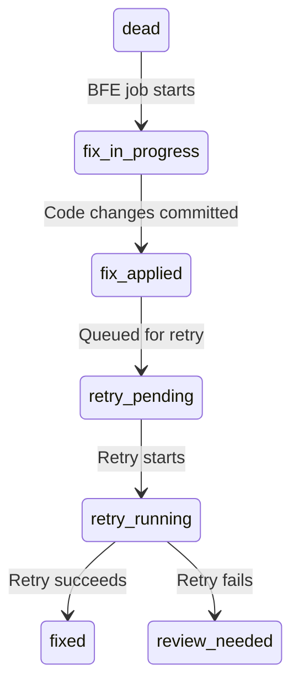

# Bug Fix Expediter — Implementation Plan

**Created**: 2026-03-27 (Session 381)
**Status**: Phase 0 Complete, Phase 1 Pending
**Pattern**: Pattern 1 (Multi-Phase Implementation)
**Estimated Duration**: 4-6 weeks (Phases 0-7)
**Prefix**: [LUPIN]

---

## Context

CJ Flow jobs that die accumulate in the dead bucket with rich failure context: stack traces, original question, agent type, timestamps, and abstract objects created during execution. Today, diagnosing and fixing these failures is a manual process.

The Bug Fix Expediter automates this with a three-phase forensic pipeline (diagnose → propose → fix) that can run overnight via scheduled queuing. It reuses the SWE team's coder and tester agent definitions but wraps them in a purpose-built orchestrator optimized for failure forensics.

### Design Decisions

| Decision | Choice | Rationale |
|----------|--------|-----------|
| New job type vs. SweTeamJob mode | New `BugFixExpediterJob` | Different prompt template (forensic), different pipeline (3-phase vs Lead decomposition), different artifacts |
| Coder/tester reuse | Import agent definitions, not handoff | Single job, single state machine, single audit trail |
| Trust proxy integration | Feed plan context, not just yes/no | Proxy learns faster from plan complexity (3-line fix vs 50-line refactor) |
| Git strategy | L1-L2: commit on branch; L3+: fix branch + PR | Trust level maps naturally to blast radius |
| Retry after fix | Single attempt, then flag for review | Prevents recursive fix spirals |
| Scope guard | Trust proxy manages via plan complexity | No hard caps on file changes; committed baseline protects against damage |

---

## Phase Overview

| Phase | Description | Estimated Sessions | Dependencies |
|-------|-------------|-------------------|--------------|
| **0** | Agentic Job Consistency Remediation | 1-2 | None |
| **1** | Foundation: Job, Config, State, Directory | 1 | Phase 0 |
| **2** | Orchestrator: Diagnose Phase | 1-2 | Phase 1 |
| **3** | Orchestrator: Propose Phase + Plan Artifacts | 1 | Phase 2 |
| **4** | Orchestrator: Fix Phase (Coder + Tester) | 1-2 | Phase 3 |
| **5** | Trust Proxy Integration + Git Strategy | 1-2 | Phase 4 |
| **6** | Retry Pipeline + Dead Job State Extensions | 1 | Phase 4 |
| **7** | Voice-First UX: "Fix This" Button + Triage Popup | 1-2 | Phase 5, 6 |

---

## Phase 0: Agentic Job Consistency Remediation

**Goal**: Fix critical consistency gaps across all existing AgenticJobBase implementations and update the agentic-voice-workflow skill template.

**Detailed spec**: See [02-agentic-job-consistency-audit.md](02-agentic-job-consistency-audit.md)

**Tasks**:

| # | Task | Status |
|---|------|--------|
| 0.1 | Audit all `notify()` calls across 6 jobs — catalog params | Pending |
| 0.2 | Fix: Add `set_job_id()`/`clear_job_id()` to SweTeam, ClaudeCode, Mock | Pending |
| 0.3 | Fix: Add `queue_name="run"` to all live notification calls | Pending |
| 0.4 | Fix: Align ClaudeCodeJob notification API with voice_io pattern | Pending |
| 0.5 | Fix: Add `from_config()` to SweTeamConfig + ClaudeCodeJob config | Pending |
| 0.6 | Fix: Decouple MockAgenticJob from deep_research voice_io | Pending |
| 0.7 | Update agentic-voice-workflow skill template with enforcement checklist | Pending |
| 0.8 | Run full unit test suite — verify no regressions | Pending |
| 0.9 | Run integration test suite (`--bg`) — verify job lifecycle | Pending |

**Verification**: Unit tests pass, integration tests pass, dry-run each job type via API.

---

## Phase 1: Foundation

**Goal**: Create the BugFixExpediterJob scaffolding following the now-consistent agentic job pattern.

**Directory structure**:
```
src/cosa/agents/bug_fix_expediter/
├── __init__.py
├── config.py              # BugFixExpediterConfig with from_config()
├── state.py               # DiagnosisResult, ProposedFix, FixResult, BFEState
├── job.py                 # BugFixExpediterJob (AgenticJobBase)
├── orchestrator.py         # Three-phase pipeline
├── cosa_interface.py       # Voice I/O + sender_id
├── voice_io.py             # Async notification wrappers
├── dead_job_packager.py    # Extract context from dead jobs
└── __main__.py             # Quick smoke test
```

**Tasks**:

| # | Task | Status |
|---|------|--------|
| 1.1 | Create directory structure + `__init__.py` | Pending |
| 1.2 | Implement `BugFixExpediterConfig` with `from_config()` classmethod | Pending |
| 1.3 | Implement state models: `DiagnosisResult`, `ProposedFix`, `FixResult`, `BFEState` | Pending |
| 1.4 | Implement `BugFixExpediterJob` extending `AgenticJobBase` (with compliance checklist) | Pending |
| 1.5 | Implement `dead_job_packager.py` — extract failure context from dead job metadata | Pending |
| 1.6 | Implement `cosa_interface.py` + `voice_io.py` (voice I/O wrappers) | Pending |
| 1.7 | Register in `agent_registry.py` + add factory branch in `agentic_job_factory.py` | Pending |
| 1.8 | Add config keys to `lupin-app.ini` + `lupin-app-splainer.ini` | Pending |
| 1.9 | Smoke tests for config, state, job creation | Pending |

**Key file**: `dead_job_packager.py` — This is the novel piece. It must:
- Accept a dead job's `id_hash` or full job object
- Extract: original question, agent type, stack trace, error message, timestamps, abstract objects
- Query job persistence layer (`job_persistence.py`) for state transition history
- Package everything into a structured `DeadJobContext` object that becomes the Diagnose phase input

**Verification**: Unit tests pass, `BugFixExpediterJob` can be instantiated, dry-run mode works with breadcrumb notifications.

---

## Phase 2: Orchestrator — Diagnose Phase

**Goal**: Implement the first phase of the three-phase pipeline. A Lead-class agent analyzes the dead job's failure context and produces a structured diagnosis.

**Tasks**:

| # | Task | Status |
|---|------|--------|
| 2.1 | Implement orchestrator skeleton with state machine | Pending |
| 2.2 | Build diagnosis prompt template from `DeadJobContext` | Pending |
| 2.3 | Implement Diagnose phase: Lead agent SDK delegation | Pending |
| 2.4 | Parse diagnosis output into `DiagnosisResult` (root cause, affected files, severity, category) | Pending |
| 2.5 | Voice gate: "Does this diagnosis look right?" (or trust proxy auto-approve) | Pending |
| 2.6 | Unit tests for prompt construction + result parsing | Pending |

**Agent role**: The Diagnose phase uses a Lead-class agent (Opus) with read-only tools (Read, Glob, Grep, Bash for `git log`/`git blame`). No file modifications allowed in this phase.

**DiagnosisResult model**:
```python
class DiagnosisResult:
    root_cause: str              # Human-readable root cause description
    error_category: str          # config, import, logic, dependency, data, unknown
    affected_files: list[str]    # Files implicated in the failure
    severity: str                # trivial, moderate, significant
    confidence: float            # 0.0-1.0
    reasoning: str               # Chain of thought leading to diagnosis
    suggested_approach: str      # High-level fix direction
```

**Verification**: Diagnose phase produces structured output from a sample dead job context. Voice gate fires.

---

## Phase 3: Orchestrator — Propose Phase + Plan Artifacts

**Goal**: Generate a concrete fix plan document and gate it through the trust proxy.

**Tasks**:

| # | Task | Status |
|---|------|--------|
| 3.1 | Implement Propose phase: transform diagnosis into fix plan | Pending |
| 3.2 | Create plan document writer — `io/swe-team/plans/{user_email}/YYYY.MM.DD-{slug}-plan.md` | Pending |
| 3.3 | Feed plan context (not just yes/no) into trust proxy for learning | Pending |
| 3.4 | Voice gate: "Here's the proposed fix. Approve, modify, or reject?" | Pending |
| 3.5 | Trust proxy routing: L1-L2 auto-proceed, L3+ requires explicit approval | Pending |
| 3.6 | Unit tests for plan generation + trust proxy context feeding | Pending |

**Plan document format** (`io/swe-team/plans/user@foo.com/YYYY.MM.DD-foo-bar-plan.md`):
```markdown
# Bug Fix Plan: {slug}

**Dead Job**: {job_id} ({agent_type})
**Diagnosed**: {timestamp}
**Root Cause**: {root_cause}
**Severity**: {severity}
**Trust Level**: {L1-L5}

## Diagnosis
{full diagnosis output}

## Proposed Fix
{specific changes to make, file by file}

## Implementation Log
(populated by Phase 3: Fix)

## Retry Result
(populated by Phase 4: Retry)
```

**Trust proxy integration**: Instead of asking "Should I fix this? [yes/no]", feed the entire plan context:
- Severity classification
- Number of files to change
- Type of changes (config tweak vs logic refactor vs new code)
- The proxy learns that "1-file config fix" = trivially approvable, "5-file logic refactor" = needs review

**Verification**: Plan document written to disk. Trust proxy classifies plan complexity correctly.

---

## Phase 4: Orchestrator — Fix Phase (Coder + Tester)

**Goal**: Import SWE team's coder and tester agent definitions and execute the fix.

**Tasks**:

| # | Task | Status |
|---|------|--------|
| 4.1 | Import coder/tester role definitions from `swe_team/agent_definitions.py` | Pending |
| 4.2 | Build fix prompt from proposed plan + diagnosis context | Pending |
| 4.3 | Implement coder delegation: apply the fix | Pending |
| 4.4 | Implement tester delegation: write/run tests for the fix | Pending |
| 4.5 | Coder-tester retry loop (max 3 iterations, same as SWE team) | Pending |
| 4.6 | Update plan document with implementation log | Pending |
| 4.7 | Safety hooks: reuse SWE team's `can_use_tool` callback + dangerous command detection | Pending |
| 4.8 | Unit tests for fix delegation + tester verification | Pending |

**Reuse from SWE team**:
- `agent_definitions.py`: Coder and Tester role configs (system prompts, model, tools)
- `hooks.py`: `build_can_use_tool()` for Bash gating, `post_tool_hook` for file tracking
- `safety_limits.py`: SafetyGuard for iteration/timeout enforcement

**NOT reused**: Lead agent (Expediter has its own Diagnose phase), orchestrator (different pipeline), state machine (different states).

**Verification**: Coder applies a fix, tester validates it, plan document updated.

---

## Phase 5: Trust Proxy Integration + Git Strategy

**Goal**: Wire the trust level determination to git workflow (commit vs. branch+PR).

**Tasks**:

| # | Task | Status |
|---|------|--------|
| 5.1 | After fix applied, determine trust level from proxy classification | Pending |
| 5.2 | L1-L2 path: commit directly on current branch | Pending |
| 5.3 | L3+ path: create `fix/YYYY-MM-DD-{slug}` branch, commit, generate PR via `gh` | Pending |
| 5.4 | PR description auto-generated from plan document | Pending |
| 5.5 | Update plan document with git references (commit hash, branch, PR URL) | Pending |
| 5.6 | Integration tests for both git paths | Pending |

**PR template** (auto-generated):
```markdown
## Bug Fix: {slug}

**Dead Job**: {job_id} ({agent_type})
**Root Cause**: {root_cause}
**Severity**: {severity}
**Trust Level**: {trust_level}

### Diagnosis
{summary}

### Changes
{files changed with descriptions}

### Test Results
{tester output}

### Plan Document
See: `io/swe-team/plans/{user_email}/YYYY.MM.DD-{slug}-plan.md`
```

**Verification**: L1-L2 fix commits directly. L3+ fix creates branch + PR.

---

## Phase 6: Retry Pipeline + Dead Job State Extensions

**Goal**: After fix is applied, retry the original dead job and track the outcome.

**Tasks**:

| # | Task | Status |
|---|------|--------|
| 6.1 | Extend dead job status values: `fix_in_progress`, `fix_applied`, `retry_pending`, `retry_running`, `fixed`, `review_needed` | Pending |
| 6.2 | Implement retry: re-queue original job with original parameters | Pending |
| 6.3 | Monitor retry outcome (success → `fixed`, failure → `review_needed`) | Pending |
| 6.4 | Update plan document with retry results | Pending |
| 6.5 | Notification: "Fix applied and validated" or "Fix applied but retry failed — needs review" | Pending |
| 6.6 | Unit tests for state transitions + retry logic | Pending |

**State machine for original dead job**:


**Single-attempt rule**: The Expediter gets one fix attempt. If the retry fails, it marks `review_needed` and notifies the user — no recursive fix spirals.

**Verification**: Dead job transitions through all states. Retry success → `fixed`. Retry failure → `review_needed` + notification.

---

## Phase 7: Voice-First UX — "Fix This" Button + Triage Popup

**Goal**: Add the one-click UX to the dead job card and the voice triage popup for clarification.

**Tasks**:

| # | Task | Status |
|---|------|--------|
| 7.1 | Add "Fix This" button to dead job cards in queue UI | Pending |
| 7.2 | Button click → cosa-voice popup with job summary + error category | Pending |
| 7.3 | Popup asks: "Fix now or schedule for tonight?" | Pending |
| 7.4 | Popup asks: "Any additional context?" (free-form voice input) | Pending |
| 7.5 | Submit → queue `BugFixExpediterJob` (immediate or scheduled) | Pending |
| 7.6 | Add REST endpoint: `POST /api/bug-fix-expediter/submit` | Pending |
| 7.7 | Add dedicated FastAPI router for BFE | Pending |
| 7.8 | E2E test: click → popup → queue → dry-run execution | Pending |

**Two-stage voice interaction**:

**Stage 1: Triage & Launch** (user-initiated)
- Dead job card shows "Fix This" button
- Click → voice popup with: job summary, error category, stack trace snippet
- User speaks clarifications (optional): "This broke after the config migration"
- Choose: "Fix now" or "Schedule for tonight"
- Submit → `BugFixExpediterJob` queued

**Stage 2: Mid-Execution Gates** (during three-phase pipeline)
- After Diagnose: "Root cause: missing config key after INI migration. Proceed to proposal?"
- After Propose: "Plan: add key to lupin-app.ini, update 1 test. Approve?"
- After Fix: "Fix applied on branch, PR #42 created" or "Committed directly (L1 trivial fix)"

When running overnight (scheduled), gates defer to trust proxy or queue for morning ratification.

**Verification**: Full click-to-fix flow works in both immediate and scheduled modes.

---

## Verification Strategy

### Per-Phase Testing

| Phase | Test Type | Command |
|-------|-----------|---------|
| 0 | Unit + integration regression | `pytest src/tests/unit/ -v` + `./src/tests/run-integration-tests.sh --bg -v` |
| 1 | Unit: config, state, job creation | `pytest src/tests/unit/test_bug_fix_expediter*.py -v` |
| 2 | Unit: prompt construction, result parsing | Same |
| 3 | Unit: plan generation, trust proxy context | Same |
| 4 | Unit: coder/tester delegation | Same |
| 5 | Integration: git operations (in test repo) | Manual + smoke test |
| 6 | Unit: state transitions, retry logic | Same |
| 7 | E2E: click → popup → queue → dry-run | Playwright or manual |

### Pre-Merge Gate

Before merging to main:
1. `pytest src/tests/unit/ -v` — 100% pass
2. `./src/scripts/run-websocket-smoke-tests.sh` — 100% pass
3. `./src/scripts/run-e2e-ui-tests.sh --bg -v` — 100% pass
4. `./src/tests/run-integration-tests.sh --bg -v` — 100% pass (final gate)

---

## Future Considerations (Out of Scope)

- **Batching**: Detect related dead jobs (same error) and batch into one fix — tabled for now
- **Cancellation support**: Add to AgenticJobBase (Gap 5 from audit) — separate track
- **Learning loop**: Feed fix success/failure back into trust proxy training data
- **Multi-repo awareness**: Handle failures in CoSA submodule (different git context)
