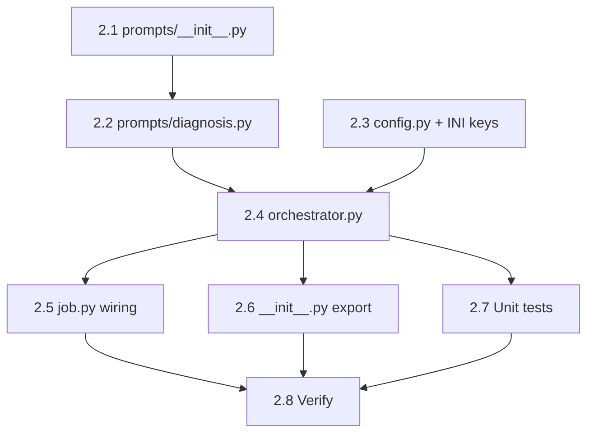
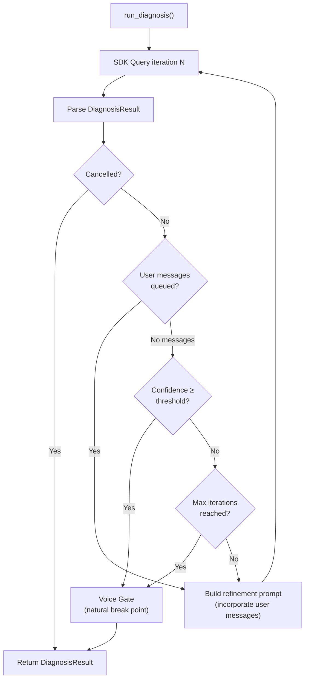

# Bug Fix Expediter — Phase 2: Orchestrator Diagnose Phase

## Context

Phase 1 (Session 382e) built the complete BFE foundation: 8 files, job registered in factory/registry/persistence/main.py, 2461 tests pass. The `_execute()` method in `job.py` currently packages the dead job context successfully but has a placeholder at lines 206-213 where the orchestrator pipeline should go.

Phase 2 implements the **Diagnose phase**: a Lead-class agent (Opus, read-only) analyzes the dead job's failure context and produces a structured `DiagnosisResult`. This follows the SWE Team orchestrator pattern (`src/cosa/agents/swe_team/orchestrator.py`).

---

## File Inventory

### New Files (4)

| # | File | Purpose |
|---|------|---------|
| 1 | `src/cosa/agents/bug_fix_expediter/orchestrator.py` | `BFEOrchestrator` class — SDK delegation, state machine, diagnosis loop |
| 2 | `src/cosa/agents/bug_fix_expediter/prompts/__init__.py` | Empty package init |
| 3 | `src/cosa/agents/bug_fix_expediter/prompts/diagnosis.py` | System prompt + diagnosis prompt builder |
| 4 | `src/tests/unit/test_bfe_orchestrator.py` | ~39 unit tests: prompt, parsing, orchestrator, voice gate, cancellation, user messages |

### Files to Modify (4)

| # | File | Change |
|---|------|--------|
| 5 | `src/cosa/agents/bug_fix_expediter/config.py` | Add `min_diagnosis_confidence: float = 0.7` field + INI key |
| 6 | `src/cosa/agents/bug_fix_expediter/job.py` | Replace placeholder (lines 206-218) with orchestrator delegation |
| 7 | `src/cosa/agents/bug_fix_expediter/__init__.py` | Add `BFEOrchestrator` import + `__all__` entry |
| 8 | `src/conf/lupin-app.ini` + `src/conf/lupin-app-splainer.ini` | Add `bug fix expediter min diagnosis confidence` key |

---

## Task Table

| # | Task | Dependencies | Status |
|---|------|-------------|--------|
| 2.1 | Create `prompts/__init__.py` (empty) | None | Pending |
| 2.2 | Create `prompts/diagnosis.py` — system prompt + `build_diagnosis_prompt()` | None | Pending |
| 2.3 | Add `min_diagnosis_confidence` to `config.py` + INI files | None | Pending |
| 2.4 | Create `orchestrator.py` — `BFEOrchestrator` class | 2.2, 2.3 | Pending |
| 2.5 | Modify `job.py` — wire orchestrator into `_execute()` | 2.4 | Pending |
| 2.6 | Modify `__init__.py` — export `BFEOrchestrator` | 2.4 | Pending |
| 2.7 | Create `test_bfe_orchestrator.py` — unit tests | 2.4 | Pending |
| 2.8 | Run py_compile + smoke tests + unit regression | 2.5, 2.6, 2.7 | Pending |

### Implementation Order



**Parallelizable**: Tasks 2.1-2.3 (Batch 1). Tasks 2.5, 2.6, 2.7 after 2.4 (Batch 3).

---

## File Specifications

### File 1: `prompts/__init__.py`

Empty file. Makes `prompts/` a proper Python package.

### File 2: `prompts/diagnosis.py`

**Constants**:

`DIAGNOSIS_SYSTEM_PROMPT` — System prompt for the forensic analyst Lead agent:
```
You are a senior software forensic analyst. Your job is to diagnose why a background job failed.

You have READ-ONLY access to the codebase via Read, Glob, Grep, and Bash (for git log/blame only).
You MUST NOT modify any files. Your only output is a structured diagnosis.

INVESTIGATION STRATEGY:
1. Read the error message and stack trace carefully
2. Use Grep to find the failing code path in the codebase
3. Use Read to examine the relevant source files
4. Use Bash for `git log` or `git blame` if you need recent change context
5. Classify the root cause into one of: config, code_bug, dependency, timeout, resource, unknown
6. Assess whether the failure is transient (would succeed on retry) or persistent

OUTPUT FORMAT: You MUST end your response with a JSON block containing your diagnosis:
{
    "root_cause": "<clear description>",
    "error_category": "<config|code_bug|dependency|timeout|resource|unknown>",
    "confidence": <0.0-1.0>,
    "evidence": ["<item 1>", "<item 2>"],
    "affected_components": ["<file or module 1>"],
    "is_transient": <true|false>
}
```

**Functions**:

`build_diagnosis_prompt( ctx: DeadJobContext, extra_context="", iteration=1, prior_diagnosis=None ) -> str`

- **Iteration 1**: Full forensic context — job type, ID, status, error, stack trace, question text, routing command, metadata JSON, timestamps, extra context from user
- **Iteration 2+** (refinement): Previous diagnosis JSON + instruction to investigate more deeply, with higher confidence target

### File 3: `config.py` modification

Add one field after `max_diagnosis_iterations`:
```python
min_diagnosis_confidence  : float = 0.7
```

Add to `key_map`:
```python
"min_diagnosis_confidence" : "bug fix expediter min diagnosis confidence",
```

Add to `lupin-app.ini`:
```ini
bug fix expediter min diagnosis confidence      = 0.7
```

Add to `lupin-app-splainer.ini`:
```ini
bug fix expediter min diagnosis confidence      = Minimum confidence threshold (0.0-1.0) for accepting a diagnosis. If the Lead agent's confidence is below this, a refinement iteration is triggered. Default is 0.7.
```

### File 4: `orchestrator.py` — BFEOrchestrator

**Pattern**: Follows `src/cosa/agents/swe_team/orchestrator.py` structure.

**SDK imports** (same graceful fallback):
```python
try:
    from claude_agent_sdk import (
        ClaudeSDKClient, ClaudeAgentOptions, AssistantMessage,
        TextBlock, ToolUseBlock, ResultMessage, query as sdk_query,
    )
    SDK_AVAILABLE = True
except ImportError:
    SDK_AVAILABLE = False
```

**Constructor** (follows SWE Team pattern with user message queue + cancellation):
```python
class BFEOrchestrator:
    def __init__( self, dead_job_context, extra_context, config,
                  session_id, job_id, on_state_change=None,
                  cancel_check=None, debug=False, verbose=False ):
        self.dead_job_context  = dead_job_context
        self.extra_context     = extra_context
        self.config            = config
        self.session_id        = session_id
        self.job_id            = job_id
        self.on_state_change   = on_state_change
        self.cancel_check      = cancel_check       # lambda: bool (from job._cancel_requested)
        self.debug             = debug
        self.verbose           = verbose
        self.current_phase     = BFEPhase.PACKAGING

        # Cancellation + user interrupt support (SWE Team Approach D)
        self._stop_requested   = False
        self._user_messages    = queue.Queue()
        self._urgent_interrupt = threading.Event()

        # Progress tracking
        self._diagnosis_group_id = f"pg-{uuid.uuid4().hex[ :8 ]}"
```

**Key methods**:

1. **`async def run_diagnosis( self ) -> DiagnosisResult`** — Main entry point:
   - Emit state: PACKAGING → DIAGNOSING
   - Notify: "Starting diagnosis..." (with `progress_group_id` for in-place updates)
   - Build prompt via `build_diagnosis_prompt()` from `prompts/diagnosis.py`
   - Build options via `_build_lead_options()`
   - Delegate to Lead agent via `sdk_query()` loop (with `ResultMessage` progress forwarding)
   - Parse response via `_parse_diagnosis_result()`
   - **Cancellation check**: Between iterations, check `self.cancel_check()` and `self._stop_requested` — if either set, return best diagnosis so far
   - **User message drain**: Between iterations, drain `_user_messages` queue — if urgent messages queued, incorporate into next refinement prompt
   - **Refinement loop**: If `confidence < config.min_diagnosis_confidence` and `iteration < config.max_diagnosis_iterations`, rebuild prompt with prior diagnosis and re-query
   - Voice gate via `_voice_gate_diagnosis()` (natural break point — user can approve, reject with feedback, or cancel)
   - Notify: "Diagnosis complete" with abstract summary
   - Return `DiagnosisResult`

2. **`def _build_lead_options( self ) -> ClaudeAgentOptions`**:
   - `model`: `config.lead_model` ("claude-opus-4-6")
   - `system_prompt`: `DIAGNOSIS_SYSTEM_PROMPT`
   - `tools`: `[ "Read", "Glob", "Grep", "Bash" ]`
   - `cwd`: `cu.get_project_root()`
   - `permission_mode`: `"plan"` (read-only)
   - `max_turns`: `config.max_diagnosis_iterations * 10`
   - `max_budget_usd`: `config.budget_usd`

3. **`def _parse_diagnosis_result( self, raw_response ) -> DiagnosisResult`**:
   - Strip markdown fences (```` ```json ````)
   - Find last JSON object: search backward from end for `}`, match `{`
   - `json.loads()` → `DiagnosisResult( **data )`
   - **Fallback** on parse failure: `DiagnosisResult( root_cause=raw[:500], error_category="unknown", confidence=0.1 )` — the 0.1 confidence triggers refinement loop automatically

4. **`async def _voice_gate_diagnosis( self, diagnosis ) -> DiagnosisResult`**:
   - If `config.require_user_confirm == False`: auto-approve, return as-is
   - Build markdown abstract (root cause, category, confidence, evidence, affected components)
   - Call `cosa_interface.ask_confirmation( "Does this diagnosis look right?", ... )`
   - If approved: return as-is
   - If rejected: call `cosa_interface.get_feedback()` for correction → re-run one refinement iteration with user feedback incorporated
   - If timeout on feedback: return as-is

5. **`async def _notify( self, message, priority="medium", abstract=None )`** — Thin wrapper with automatic `job_id`, `queue_name="run"`, and `progress_group_id` for in-place DOM updates.

6. **`async def _emit_state( self, from_phase, to_phase, metadata=None )`** — State transition callback.

7. **`def _is_cancelled( self ) -> bool`** — Checks both `self._stop_requested` and `self.cancel_check()` (if provided). Called between refinement iterations and before voice gate.

8. **`def queue_user_message( self, message ) -> None`** — Public method for `job.py` to inject ad hoc user messages during execution. Sets `_urgent_interrupt` event if message marked urgent. (Matches SWE Team `_user_messages` queue pattern.)

9. **`def _drain_user_messages( self ) -> list[str]`** — Drains `_user_messages` queue and clears `_urgent_interrupt`. Returns list of messages to incorporate into next prompt.

**SDK delegation loop** (matches SWE Team lines 621-629, **with ResultMessage progress forwarding**):
```python
collected_text = []
async for message in sdk_query( prompt=prompt, options=options ):
    if isinstance( message, AssistantMessage ):
        for block in message.content:
            if isinstance( block, TextBlock ):
                collected_text.append( block.text )
            elif isinstance( block, ToolUseBlock ):
                # Progress: agent is investigating
                await self._notify(
                    f"Investigating: {block.name}",
                    priority="low",
                )
    elif isinstance( message, TextBlock ):
        collected_text.append( message.text )
    elif isinstance( message, ResultMessage ):
        # Forward SDK progress events to user via notification system
        await self._notify(
            getattr( message, "text", str( message ) )[ :200 ],
            priority="low",
        )
raw_response = "".join( collected_text ).strip()
```

### Cancellation + User Interrupt Flow



### Natural Break Points

| Break Point | Mechanism | User Options |
|-------------|-----------|-------------|
| **Between refinement iterations** | `_is_cancelled()` + `_drain_user_messages()` | Cancel, inject context |
| **After diagnosis complete** | `_voice_gate_diagnosis()` → `ask_confirmation()` | Approve, reject with feedback, cancel |
| **During SDK execution** | `ResultMessage` forwarding via `_notify()` | Read-only progress (user sees agent investigating) |
| **Ad hoc user input** | `queue_user_message()` → `_urgent_interrupt` event | Message incorporated into next iteration |

### File 5: `job.py` modification

Replace lines 206-218 (the placeholder + notification) with:
```python
# Phase 1: Diagnose (Lead agent analyzes failure)
from cosa.agents.bug_fix_expediter.orchestrator import BFEOrchestrator
from cosa.agents.bug_fix_expediter.config import BugFixExpediterConfig
from cosa.config.configuration_manager import ConfigurationManager

config_mgr = ConfigurationManager( env_var_name="LUPIN_CONFIG_MGR_CLI_ARGS" )
config = BugFixExpediterConfig.from_config( config_mgr, debug=self.debug )

orchestrator = BFEOrchestrator(
    dead_job_context = self.dead_job_context,
    extra_context    = self.extra_context,
    config           = config,
    session_id       = self.id_hash,
    job_id           = self.id_hash,
    cancel_check     = lambda: self._cancel_requested,  # Cancellation bridge
    debug            = self.debug,
    verbose          = self.verbose,
)

# Store orchestrator ref for external cancellation (AgenticJobBase protocol)
self._orchestrator = orchestrator

self.diagnosis = await orchestrator.run_diagnosis()
self.artifacts[ "diagnosis" ] = self.diagnosis.model_dump()

# Phases 2-3: Propose + Fix (Phase 3+ implementation)
result = (
    f"Diagnosis complete for '{self.dead_job_id}'. "
    f"Root cause: {self.diagnosis.root_cause[ :200 ]}. "
    f"Category: {self.diagnosis.error_category}. "
    f"Confidence: {self.diagnosis.confidence:.0%}. "
    f"Transient: {self.diagnosis.is_transient}. "
    f"Propose + Fix pipeline not yet implemented (Phase 3+)."
)

await voice_io.notify(
    "Diagnosis phase complete.",
    priority="medium", job_id=self.id_hash, queue_name="run"
)
```

### File 6: `__init__.py` modification

Add import:
```python
from .orchestrator import BFEOrchestrator
```

Add `"BFEOrchestrator"` to `__all__`.

### File 7: Unit tests (`test_bfe_orchestrator.py`)

**~39 tests across 9 categories**:

1. **Prompt construction** (9 tests, no mocking):
   - Error, stack trace, job type, question text, metadata appear in prompt
   - None fields handled gracefully
   - Extra context included
   - Refinement prompt includes prior diagnosis + confidence

2. **JSON parsing** (7 tests, no mocking):
   - Valid JSON, markdown-fenced JSON, JSON embedded in prose
   - Invalid JSON → fallback DiagnosisResult with confidence=0.1
   - Missing optional fields get defaults
   - All 6 error categories accepted

3. **Orchestrator construction** (2 tests):
   - Default init, config override

4. **Agent options** (1 test):
   - Verify `permission_mode="plan"`, correct tools, lead_model used

5. **SDK delegation** (5 tests, mock `sdk_query`):
   - Happy path → valid DiagnosisResult
   - Low confidence → refinement re-query triggered
   - Max iterations cap respected
   - SDK unavailable → graceful error
   - SDK exception → error handling

6. **Voice gate** (4 tests, mock `cosa_interface`):
   - Auto-approve when `require_user_confirm=False`
   - User approves → return as-is
   - User rejects with feedback → refinement
   - User rejects without feedback → return as-is

7. **Notifications + progress** (3 tests):
   - `job_id` passed through
   - `queue_name="run"` included
   - `progress_group_id` set for in-place DOM updates

8. **Cancellation** (3 tests, mock cancel_check):
   - `_is_cancelled()` returns True when `cancel_check()` returns True
   - `_is_cancelled()` returns True when `_stop_requested` is True
   - `run_diagnosis` exits early on cancellation between iterations

9. **User message queue** (3 tests):
   - `queue_user_message()` enqueues and sets `_urgent_interrupt`
   - `_drain_user_messages()` returns all messages and clears event
   - Queued messages incorporated into refinement prompt

---

## Verification Plan

**Per-file compilation** (after each `.py` edit):
```bash
python -c "import py_compile; py_compile.compile( 'path/to/file.py', doraise=True )"
```

**Smoke tests** (after all files):
```bash
python -m cosa.agents.bug_fix_expediter.config       # Verify new field
python -m cosa.agents.bug_fix_expediter.job           # Verify import chain
```

**Unit test regression**:
```bash
pytest src/tests/unit/test_bfe_orchestrator.py -v     # New tests
pytest src/tests/unit/ -v                             # Full regression
```

---

## Potential Challenges

1. **SDK availability**: `claude_agent_sdk` may not be installed. Orchestrator must handle `SDK_AVAILABLE = False` with a clear error — same pattern as SWE Team.

2. **JSON extraction**: Opus sometimes wraps JSON in prose. Parser uses "find last `{}` pair" strategy. Fallback confidence (0.1) < threshold (0.7) triggers automatic refinement.

3. **Refinement loop termination**: Capped at `max_diagnosis_iterations` (default 3). Returns best result even if below threshold.

4. **Bash safety in plan mode**: `permission_mode="plan"` prevents destructive commands. System prompt also explicitly restricts Bash to read-only git commands.

5. **Budget split**: Phase 2 uses full `budget_usd` for diagnosis. Future phases (3-4) will need budget partitioning — acceptable for now.

6. **Import order**: `cosa_interface` mutable state (SENDER_ID, TARGET_USER) set by `job.py` before orchestrator runs — same proven pattern as SWE Team.

---

## Scope Boundaries

**IN scope**: Orchestrator class, diagnosis prompt template, JSON parsing, voice gate, config addition, job.py wiring, unit tests.

**NOT in scope**: Propose phase (Phase 3), Fix phase (Phase 4), trust proxy (Phase 5), retry pipeline (Phase 6), "Fix This" UI (Phase 7).
