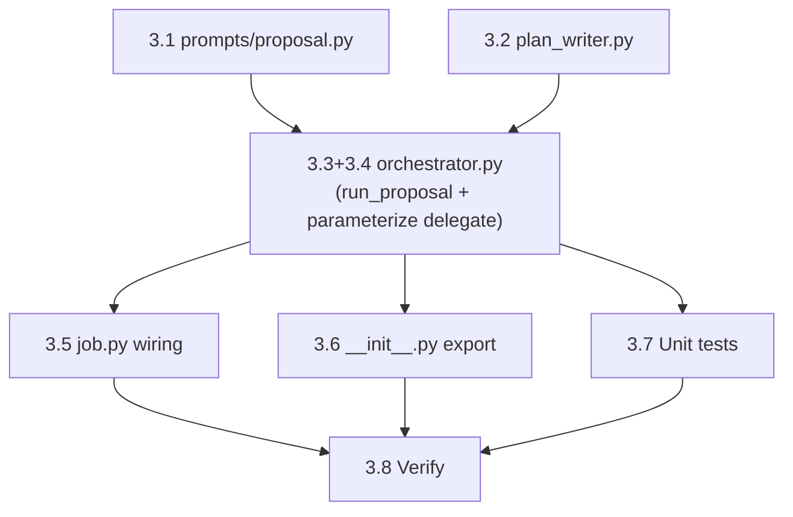

# Bug Fix Expediter — Phase 3: Orchestrator Propose Phase + Plan Artifacts

## Context

Phase 2 (this session) added `BFEOrchestrator.run_diagnosis()` which produces a `DiagnosisResult` via Lead agent SDK delegation. The `_execute()` in `job.py` currently has a placeholder at lines 231-244 for the propose/fix pipeline.

Phase 3 adds `run_proposal()`: the Lead agent (Opus, read-only) generates 1-3 concrete fix proposals based on the diagnosis, a plan document is written to disk, and the proposal is gated through user confirmation.

**Trust proxy integration**: Phase 3 uses only `config.require_user_confirm` as the gate (same pattern as the diagnosis voice gate). Full L1-L5 trust proxy integration is Phase 5 scope.

---

## File Inventory

### New Files (3)

| # | File | Purpose |
|---|------|---------|
| 1 | `src/cosa/agents/bug_fix_expediter/prompts/proposal.py` | System prompt + `build_proposal_prompt()` |
| 2 | `src/cosa/agents/bug_fix_expediter/plan_writer.py` | `PlanWriter` — writes structured markdown plan to disk |
| 3 | `src/tests/unit/test_bfe_proposal.py` | ~35 unit tests: prompt, parsing, auto-select, voice gate, plan writer |

### Files to Modify (3)

| # | File | Change |
|---|------|--------|
| 4 | `src/cosa/agents/bug_fix_expediter/orchestrator.py` | Add `run_proposal()` + 6 helper methods; parameterize `_delegate_to_lead()` |
| 5 | `src/cosa/agents/bug_fix_expediter/job.py` | Replace placeholder (lines 231-244) with `run_proposal()` call |
| 6 | `src/cosa/agents/bug_fix_expediter/__init__.py` | Add `PlanWriter` export |

---

## Task Table

| # | Task | Dependencies | Status |
|---|------|-------------|--------|
| 3.1 | Create `prompts/proposal.py` — system prompt + prompt builder | None | Pending |
| 3.2 | Create `plan_writer.py` — `PlanWriter` class | None | Pending |
| 3.3 | Add `run_proposal()` + helpers to `orchestrator.py` | 3.1, 3.2 | Pending |
| 3.4 | Parameterize `_delegate_to_lead()` with optional `options` kwarg | None | Pending |
| 3.5 | Modify `job.py` — wire `run_proposal()` into `_execute()` | 3.3 | Pending |
| 3.6 | Modify `__init__.py` — export `PlanWriter` | 3.2 | Pending |
| 3.7 | Create `test_bfe_proposal.py` — unit tests | 3.3 | Pending |
| 3.8 | Run py_compile + smoke tests + unit regression | 3.5-3.7 | Pending |

### Implementation Order



**Parallelizable**: Tasks 3.1 + 3.2 (Batch 1). Tasks 3.5, 3.6, 3.7 after 3.3+3.4 (Batch 3).

---

## File Specifications

### File 1: `prompts/proposal.py`

**`PROPOSAL_SYSTEM_PROMPT`** — System prompt for the proposal Lead agent:

```
You are a senior software engineer proposing fixes for a diagnosed software failure.

You have READ-ONLY access to the codebase via Read, Glob, Grep, and Bash (git only).
You MUST NOT modify any files. Your job is to propose 1-3 concrete fix options.

PROPOSAL STRATEGY:
1. Review the diagnosis (root cause, error category, affected components)
2. Read the affected files to understand the current code
3. Consider fix complexity: Is it a config tweak, code patch, dependency fix, or manual intervention?
4. For each proposed fix, list specific files and changes needed
5. Assess risk level and effort for each proposal
6. Rank proposals by confidence (best fix first)

OUTPUT FORMAT: End your response with a JSON array of fix proposals:
[
    {
        "title": "<short title>",
        "description": "<detailed description of what to change and why>",
        "fix_type": "<config_change|code_patch|retry|manual>",
        "confidence": <0.0-1.0>,
        "risk_level": "<low|medium|high>",
        "estimated_effort": "<minimal|small|medium|large>",
        "changes": [
            {"file": "<path>", "action": "<modify|create|delete>", "description": "<what to change>"}
        ]
    }
]
```

**`build_proposal_prompt( diagnosis, dead_job_context, extra_context="", user_feedback=None ) -> str`**:

- Serializes the diagnosis result (root cause, category, confidence, evidence, affected components)
- Includes dead job context (job type, error, stack trace, question text)
- Optional user feedback from rejected proposal (for retry)
- Instructions to propose 1-3 ranked fixes

### File 2: `plan_writer.py`

**`PlanWriter`** — Writes structured markdown plan documents.

```python
class PlanWriter:
    """Writes Bug Fix Expediter plan documents to disk."""

    PLANS_DIR = "io/swe-team/plans"

    def __init__( self, user_email, debug=False ):
        self.user_email = user_email
        self.debug      = debug

    def write_plan(
        self,
        dead_job_context,
        diagnosis,
        proposed_fixes,
        selected_fix=None,
    ) -> str:
        """
        Write a plan document to disk.

        Returns:
            str: Absolute path to the written plan file
        """
```

**Plan path**: `{project_root}/io/swe-team/plans/{user_email}/YYYY.MM.DD-{slug}-plan.md`

**Slug generation**: Derived from `diagnosis.root_cause` — lowercase, strip special chars, first 5 words joined by hyphens (e.g., "missing-config-key-in-lupin").

**Plan document format**:
```markdown
# Bug Fix Plan: {slug}

**Dead Job**: {id_hash} ({job_type})
**Diagnosed**: {timestamp}
**Root Cause**: {root_cause}
**Category**: {error_category}
**Confidence**: {confidence}%

---

## Diagnosis

**Error**: {error}

**Stack Trace**:
```
{stack_trace}
```

**Evidence**:
{bullet list of evidence}

**Affected Components**:
{bullet list of affected_components}

---

## Proposed Fixes

### Fix 1: {title} [SELECTED]
- **Type**: {fix_type}
- **Confidence**: {confidence}%
- **Risk**: {risk_level}
- **Effort**: {estimated_effort}

{description}

**Changes**:
| File | Action | Description |
|------|--------|-------------|
| {file} | {action} | {description} |

### Fix 2: {title}
...

---

## Implementation Log
(Phase 4 — populated after fix is applied)

---

## Retry Result
(Phase 6 — populated after retry)
```

**Helper methods**:
- `_generate_slug( root_cause ) -> str`
- `_get_plan_path() -> str`
- `_render_diagnosis_section( diagnosis ) -> str`
- `_render_fixes_section( proposed_fixes, selected_fix ) -> str`
- `quick_smoke_test()` with tempdir-based testing

### File 3: `orchestrator.py` modifications

**Parameterize `_delegate_to_lead()`** (backward-compatible):

```python
async def _delegate_to_lead( self, voice_io, prompt, options=None ):
    if options is None:
        options = self._build_lead_options()
    # ... rest unchanged ...
```

**New methods**:

1. **`async def run_proposal( self, diagnosis ) -> tuple[ list[ProposedFix], Optional[ProposedFix], str ]`**
   - Returns: `( proposed_fixes, selected_fix, plan_path )`
   - State: DIAGNOSING → PROPOSING
   - Build prompt via `build_proposal_prompt()`
   - Delegate to Lead agent via `_delegate_to_lead( voice_io, prompt, self._build_proposal_options() )`
   - Parse response into `list[ ProposedFix ]`
   - Write plan document via `PlanWriter`
   - Auto-select if single high-confidence fix
   - Voice gate for user selection + approval
   - State: PROPOSING → WAITING_CONFIRMATION → back
   - Cancellation + user message checks
   - Return selected fix + plan path

2. **`def _build_proposal_options( self ) -> ClaudeAgentOptions`**
   - Same as `_build_lead_options()` but with `PROPOSAL_SYSTEM_PROMPT`
   - Same read-only tools (Read, Glob, Grep, Bash)
   - Same `permission_mode="plan"`

3. **`def _parse_proposal_result( self, raw_response ) -> list[ ProposedFix ]`**
   - Extract last JSON array from response (similar to diagnosis but `[...]` not `{...}`)
   - Validate each item as `ProposedFix`
   - Fallback: single manual-fix proposal with confidence 0.1

4. **`def _auto_select_fix( self, fixes ) -> Optional[ ProposedFix ]`**
   - If exactly 1 fix with confidence >= 0.8: return it
   - Otherwise: return None (user must select)

5. **`async def _voice_gate_proposal( self, fixes, voice_io, cosa_interface ) -> Optional[ ProposedFix ]`**
   - If `require_user_confirm == False`: auto-select best fix
   - If auto-select returned a fix: ask confirmation only (yes/no)
   - If multiple fixes: present as `cosa_interface.present_choices()` with fix summaries
   - If rejected: collect feedback via `get_feedback()`, re-run proposal once
   - Return selected and approved fix, or None if all rejected

6. **`def _build_proposal_abstract( self, fixes ) -> str`**
   - Markdown summary of all proposals for notification

7. **`@staticmethod def _extract_last_json_array( text ) -> Optional[ str ]`**
   - Find last `[...]` in text (similar to `_extract_last_json_object` for `{...}`)

### File 4: `job.py` modification

Replace lines 231-244 (the placeholder) with:

```python
# Phase 2: Propose (Lead agent generates fix proposals)
proposed_fixes, selected_fix, plan_path = await orchestrator.run_proposal( self.diagnosis )

self.artifacts[ "proposed_fixes" ] = [ f.model_dump() for f in proposed_fixes ]
self.artifacts[ "plan_path" ]      = plan_path

if selected_fix:
    self.artifacts[ "selected_fix" ] = selected_fix.model_dump()

# Phases 3: Fix (Phase 4+ implementation)
fix_summary = f"{len( proposed_fixes )} fix(es) proposed"
if selected_fix:
    fix_summary += f", selected: '{selected_fix.title}' ({selected_fix.fix_type})"

result = (
    f"Diagnosis + Proposal complete for '{self.dead_job_id}'. "
    f"Root cause: {self.diagnosis.root_cause[ :150 ]}. "
    f"{fix_summary}. "
    f"Plan: {plan_path}. "
    f"Fix pipeline not yet implemented (Phase 4+)."
)

await voice_io.notify(
    "Proposal phase complete.",
    priority="medium", job_id=self.id_hash, queue_name="run"
)
```

### File 5: `__init__.py` modification

Add import:
```python
from .plan_writer import PlanWriter
```
Add `"PlanWriter"` to `__all__`.

### File 6: Unit tests (`test_bfe_proposal.py`)

**~35 tests across 8 categories**:

1. **Proposal prompt construction** (5 tests):
   - Includes diagnosis root cause, affected components
   - Includes dead job error + stack trace
   - Handles user feedback for retry
   - Extra context included

2. **JSON array parsing** (6 tests):
   - Valid JSON array → list[ProposedFix]
   - Markdown-fenced JSON
   - Embedded in prose
   - Invalid JSON → fallback single manual fix
   - Single-element array
   - All fix_type values accepted

3. **Auto-select logic** (4 tests):
   - Single fix with high confidence → selected
   - Single fix with low confidence → None
   - Multiple fixes → None (user must choose)
   - Empty fixes list → None

4. **Voice gate** (5 tests, mock cosa_interface):
   - Auto-approve when `require_user_confirm=False`
   - Auto-selected fix: user confirms → return fix
   - Multiple fixes: user selects → return selection
   - User rejects → collect feedback → retry
   - User rejects, no feedback → None

5. **SDK delegation** (3 tests, mock sdk_query):
   - Happy path → list[ProposedFix]
   - SDK exception → fallback
   - Cancellation during proposal → returns best available

6. **Plan writer** (7 tests, tempdir-based):
   - Plan file created at correct path
   - Slug generation from root cause
   - Plan contains diagnosis section
   - Plan contains all proposed fixes
   - Selected fix marked with [SELECTED]
   - User email directory created
   - Long root cause slug truncated

7. **Proposal abstract** (2 tests):
   - Single fix summary
   - Multiple fix summary

8. **JSON array extraction** (3 tests):
   - Last array found in text
   - No array → None
   - Nested arrays handled

---

## Verification Plan

**Per-file compilation**:
```bash
python -c "import py_compile; py_compile.compile( 'path/to/file.py', doraise=True )"
```

**Smoke tests**:
```bash
python -m cosa.agents.bug_fix_expediter.prompts.proposal
python -m cosa.agents.bug_fix_expediter.plan_writer
python -m cosa.agents.bug_fix_expediter.orchestrator
python -m cosa.agents.bug_fix_expediter.job
```

**Unit tests**:
```bash
pytest src/tests/unit/test_bfe_proposal.py -v
pytest src/tests/unit/test_bfe_orchestrator.py -v   # Regression
pytest src/tests/unit/ -v                           # Full regression
```

---

## Scope Boundaries

**IN scope**: `run_proposal()`, proposal prompt, plan writer, voice gate for fix selection, auto-select logic, unit tests.

**NOT in scope**: Fix execution (Phase 4), trust proxy L1-L5 gating (Phase 5), retry pipeline (Phase 6), "Fix This" UI (Phase 7). Trust proxy hook point documented in `_voice_gate_proposal()` docstring for Phase 5.
