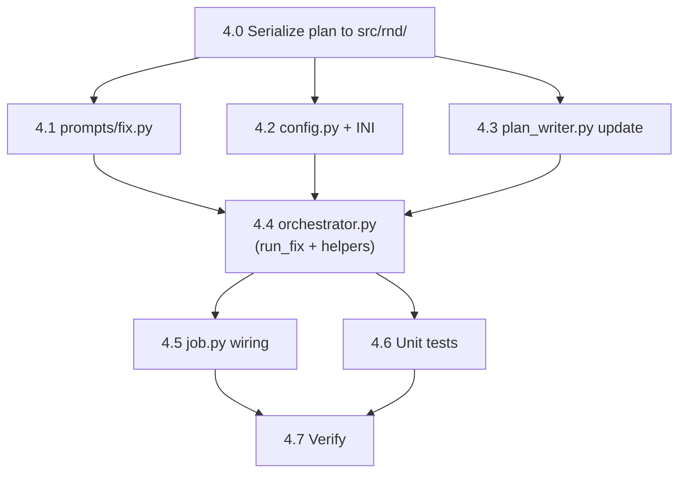
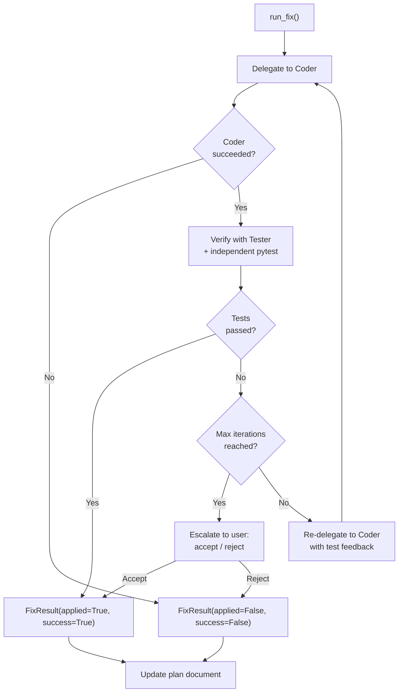

# Bug Fix Expediter — Phase 4: Orchestrator Fix Phase (Coder + Tester)

## Context

Phases 2-3 (this session) added `run_diagnosis()` and `run_proposal()` to `BFEOrchestrator`. The `_execute()` in `job.py` currently has a placeholder at lines 240-256 for the fix pipeline.

Phase 4 adds `run_fix()`: delegates the user-approved `ProposedFix` to a **Coder agent** (Sonnet, edit-capable) and validates with a **Tester agent**, using a coder-tester retry loop capped at `config.max_fix_attempts` (default 2).

**Key reuse**: Imports `SafetyGuard`, `build_can_use_tool`, `post_tool_hook`, `run_pytest` directly from `cosa.agents.swe_team` — no modifications to SWE Team code.

---

## File Inventory

### New Files (2)

| # | File | Purpose |
|---|------|---------|
| 1 | `src/cosa/agents/bug_fix_expediter/prompts/fix.py` | Coder + Tester system prompts, fix/verify/redelegate prompt builders |
| 2 | `src/tests/unit/test_bfe_fix.py` | ~25 unit tests: prompts, coder delegation, tester verification, retry loop, plan update |

### Files to Modify (4)

| # | File | Change |
|---|------|--------|
| 3 | `src/cosa/agents/bug_fix_expediter/config.py` | Add `max_file_changes_per_fix: int = 20` + INI key |
| 4 | `src/cosa/agents/bug_fix_expediter/orchestrator.py` | Add `run_fix()` + 6 helper methods |
| 5 | `src/cosa/agents/bug_fix_expediter/plan_writer.py` | Add `update_implementation_log()` method |
| 6 | `src/cosa/agents/bug_fix_expediter/job.py` | Replace placeholder (lines 240-256) with `run_fix()` call |

---

## Task Table

| # | Task | Dependencies | Status |
|---|------|-------------|--------|
| 4.0 | **Serialize plan to src/rnd/** | None | Pending |
| 4.1 | Create `prompts/fix.py` — 2 system prompts + 3 prompt builders | None | Pending |
| 4.2 | Add `max_file_changes_per_fix` to `config.py` + INI files | None | Pending |
| 4.3 | Add `update_implementation_log()` to `plan_writer.py` | None | Pending |
| 4.4 | Add `run_fix()` + helpers to `orchestrator.py` | 4.1, 4.2 | Pending |
| 4.5 | Modify `job.py` — wire `run_fix()` into `_execute()` | 4.4 | Pending |
| 4.6 | Create `test_bfe_fix.py` — unit tests | 4.4 | Pending |
| 4.7 | Run py_compile + smoke tests + unit regression | 4.5, 4.6 | Pending |

### Implementation Order



**Parallelizable**: Tasks 4.1, 4.2, 4.3 (Batch 1). Tasks 4.5, 4.6 after 4.4 (Batch 3).

---

## File Specifications

### File 1: `prompts/fix.py`

**Two system prompts + three prompt builders.**

**`CODER_SYSTEM_PROMPT`**:
```
You are a senior software engineer applying a targeted bug fix.

You have full edit access via Read, Edit, and Bash tools.
Apply ONLY the changes described in the fix proposal — no extra refactoring.

RULES:
1. Read affected files before editing
2. Make minimal, focused changes
3. Do NOT modify test files
4. Do NOT run destructive commands (rm -rf, git push, etc.)
5. After making changes, summarize what you did and list all files modified
6. Verify your changes compile: python -c "import py_compile; py_compile.compile('file.py', doraise=True)"
```

**`TESTER_SYSTEM_PROMPT`**:
```
You are a senior test engineer validating a bug fix.

You have edit access to write tests and Bash access to run them.
Your job: write targeted tests for the fix, run them, and report PASS or FAIL.

RULES:
1. Read the changed files to understand what was fixed
2. Write tests in src/tests/unit/ following existing patterns
3. Run tests with: python -m pytest <test_file> -v --tb=short
4. Report a clear PASS or FAIL verdict at the end
5. If FAIL, explain exactly what failed and why
```

**`build_fix_prompt( selected_fix, diagnosis, dead_job_context ) -> str`**:
- Includes ProposedFix title, description, fix_type, changes table
- Includes diagnosis root cause, affected components
- Includes dead job error + stack trace for context
- Instructions: "Apply ONLY these changes"

**`build_verification_prompt( selected_fix, coder_output, files_changed ) -> str`**:
- Task description from selected_fix
- Coder's output summary (what was changed)
- List of files changed
- Instructions: write tests, run them, report PASS/FAIL

**`build_redelegation_prompt( selected_fix, coder_output, test_feedback, iteration ) -> str`**:
- Original fix context
- Prior coder output
- Tester failure feedback
- Instructions: "Fix your implementation, do NOT modify test files"

### File 2: `config.py` modification

Add field after `max_fix_attempts`:
```python
max_file_changes_per_fix  : int   = 20
```

Add to `key_map`:
```python
"max_file_changes_per_fix" : "bug fix expediter max file changes per fix",
```

Add to `lupin-app.ini` + splainer.

### File 3: `plan_writer.py` modification

Add method:
```python
def update_implementation_log( self, plan_path, fix_result, files_changed, coder_output="" ):
    """
    Update an existing plan document's Implementation Log section.

    Reads the plan file, replaces the placeholder with actual results.

    Args:
        plan_path: Path to existing plan file
        fix_result: FixResult from the fix phase
        files_changed: List of files modified by coder
        coder_output: Coder's summary text
    """
```

Replaces `(Phase 4 — populated after fix is applied)` with:
```markdown
**Status**: {Applied|Failed} — {Success|Failure}
**Files Changed**:
- file1.py
- file2.py

**Coder Summary**:
{coder_output[:1000]}

**Details**: {fix_result.details}
```

### File 4: `orchestrator.py` — New Methods

**Imports to add**:
```python
from cosa.agents.swe_team.safety_limits import SafetyGuard, SafetyLimitError
from cosa.agents.swe_team.hooks import build_can_use_tool, post_tool_hook
from cosa.agents.swe_team.test_runner import run_pytest

from cosa.agents.bug_fix_expediter.prompts.fix import (
    CODER_SYSTEM_PROMPT,
    TESTER_SYSTEM_PROMPT,
    build_fix_prompt,
    build_verification_prompt,
    build_redelegation_prompt,
)
```

**New methods**:

1. **`async def run_fix( self, diagnosis, selected_fix, plan_path ) -> FixResult`**
   - State: PROPOSING → FIXING
   - Create `SafetyGuard` with config limits
   - Delegate to coder via `_delegate_to_coder()`
   - If coder succeeds → verify via `_verify_fix()`
   - **Coder-tester retry loop** (max `config.max_fix_attempts` iterations):
     - If tests pass → `guard.record_success()`, break
     - If tests fail and iterations remain → `_redelegate_fix()` with feedback
     - If max iterations → escalate via `present_choices()` (accept without tests / reject)
   - Update plan document via `plan_writer.update_implementation_log()`
   - Return `FixResult(applied=..., success=..., details=..., retry_eligible=...)`

2. **`async def _delegate_to_coder( self, voice_io, prompt, guard ) -> tuple[str, list]`**
   - Returns `( coder_output, files_changed )`
   - `permission_mode="acceptEdits"`, `can_use_tool=build_can_use_tool(...)`
   - Track files via `post_tool_hook()` in the SDK loop
   - Check `guard.check_timeout()` at each message
   - Check `self._is_cancelled()` for graceful stop

3. **`async def _verify_fix( self, voice_io, selected_fix, coder_output, files_changed ) -> tuple[bool, str]`**
   - Returns `( passed, tester_output )`
   - Delegate to tester agent with verification prompt
   - After tester completes, run independent `run_pytest()` on test files created
   - Independent pytest result **overrides** tester self-report (SWE Team pattern)

4. **`async def _redelegate_fix( self, voice_io, selected_fix, coder_output, test_feedback, iteration, guard ) -> tuple[str, list]`**
   - Returns `( coder_output, files_changed )`
   - Same as `_delegate_to_coder()` but with redelegation prompt including failure feedback

5. **`def _build_coder_options( self, guard ) -> ClaudeAgentOptions`**
   - `model`: `config.worker_model` ("claude-sonnet-4-6")
   - `system_prompt`: `CODER_SYSTEM_PROMPT`
   - `tools`: `[ "Read", "Edit", "Bash" ]`
   - `permission_mode`: `"acceptEdits"`
   - `can_use_tool`: `build_can_use_tool( cosa_interface_wrapper, guard, "code-fixer" )`

6. **`def _build_tester_options( self, guard ) -> ClaudeAgentOptions`**
   - Same as coder but with `TESTER_SYSTEM_PROMPT`
   - `can_use_tool`: `build_can_use_tool( cosa_interface_wrapper, guard, "tester" )`

**Coder-Tester Retry Loop** (inside `run_fix()`):


### File 5: `job.py` modification

Replace lines 240-256 (the placeholder) with:
```python
# Phase 3: Fix (Coder + Tester apply and validate the fix)
if selected_fix:
    fix_result = await orchestrator.run_fix( self.diagnosis, selected_fix, plan_path )
    self.artifacts[ "fix_result" ] = fix_result.model_dump()
else:
    from cosa.agents.bug_fix_expediter.state import FixResult
    fix_result = FixResult( applied=False, success=False, details="No fix selected" )

fix_summary = f"{len( proposed_fixes )} fix(es) proposed"
if selected_fix:
    fix_summary += f", selected: '{selected_fix.title}'"
if fix_result.applied:
    fix_summary += f", applied: {'success' if fix_result.success else 'failed'}"

result = (
    f"Bug Fix Expediter complete for '{self.dead_job_id}'. "
    f"Root cause: {self.diagnosis.root_cause[ :150 ]}. "
    f"{fix_summary}. "
    f"Plan: {plan_path}. "
    f"Retry pipeline not yet implemented (Phase 6+)."
)

await voice_io.notify(
    "Fix phase complete." if fix_result.applied else "No fix applied.",
    priority="medium", job_id=self.id_hash, queue_name="run"
)
```

### File 6: Unit tests (`test_bfe_fix.py`)

**~25 tests across 6 categories**:

1. **Fix prompt construction** (4 tests):
   - Includes ProposedFix changes table
   - Includes diagnosis root cause + stack trace
   - Verification prompt includes coder output + files changed
   - Redelegation prompt includes test failure feedback

2. **Coder options** (2 tests):
   - `permission_mode="acceptEdits"`
   - `worker_model` used (not lead_model)

3. **Proposal parsing → FixResult** (3 tests):
   - Coder success → FixResult(applied=True)
   - Coder failure → FixResult(applied=False)
   - SafetyLimitError → FixResult with safety details

4. **Tester verification** (4 tests, mock sdk_query + run_pytest):
   - Tester reports pass + pytest confirms → passed=True
   - Tester reports pass but pytest fails → passed=False (override)
   - Tester reports fail → passed=False
   - No test files created → passed based on tester self-report

5. **Retry loop** (5 tests, mock sdk_query):
   - Pass on first try → 1 coder + 1 tester call
   - Fail then pass → 2 coder + 2 tester calls
   - Max iterations exhausted → escalation
   - Cancellation during loop → early exit
   - SafetyLimitError → graceful failure

6. **Plan writer update** (4 tests, tempdir-based):
   - Implementation log section replaced
   - Files changed listed
   - Coder output included
   - Status reflects success/failure

7. **Integration flow** (3 tests):
   - No fix selected → FixResult(applied=False)
   - run_fix happy path (mock SDK) → FixResult(applied=True, success=True)
   - SDK unavailable → graceful failure

---

## Verification Plan

**Per-file compilation**:
```bash
python -c "import py_compile; py_compile.compile( 'path/to/file.py', doraise=True )"
```

**Smoke tests**:
```bash
python -m cosa.agents.bug_fix_expediter.prompts.fix
python -m cosa.agents.bug_fix_expediter.plan_writer
python -m cosa.agents.bug_fix_expediter.orchestrator
python -m cosa.agents.bug_fix_expediter.job
```

**Unit tests**:
```bash
pytest src/tests/unit/test_bfe_fix.py -v              # New tests
pytest src/tests/unit/test_bfe_orchestrator.py -v      # Phase 2 regression
pytest src/tests/unit/test_bfe_proposal.py -v          # Phase 3 regression
pytest src/tests/unit/ -v                              # Full regression
```

---

## Potential Challenges

1. **`build_can_use_tool` needs a cosa_interface-compatible object**: SWE Team's hook expects `team_io.ask_confirmation()`. BFE uses `cosa_interface.ask_confirmation()` directly — need to pass `cosa_interface` module or a thin wrapper.

2. **Independent pytest may fail in test environment**: `run_pytest()` requires the test file to actually exist and be importable. Tests that depend on a running server will fail — tester should write unit-level tests only.

3. **File tracking accuracy**: `post_tool_hook` only catches Edit/Write. If the coder uses Bash to write files (e.g., `echo > file`), they won't be tracked. System prompt explicitly instructs to use Edit/Write.

4. **Budget split**: Phase 4 shares `config.budget_usd` ($2.00) across diagnosis, proposal, AND fix. Coder + tester may exhaust the budget. Consider: should fix phase have its own budget? For now, use the shared budget — can be split in Phase 5.

5. **SafetyGuard lifetime**: Create a new `SafetyGuard` for each `run_fix()` call (not shared with diagnosis/proposal phases). This ensures fresh iteration/timeout counters.

---

## Scope Boundaries

**IN scope**: `run_fix()`, coder/tester delegation, retry loop, safety hooks, plan update, prompt templates, unit tests.

**NOT in scope**: Trust proxy integration (Phase 5), retry pipeline/dead job state extensions (Phase 6), "Fix This" UI (Phase 7), git operations (commit/branch/PR — Phase 5).
