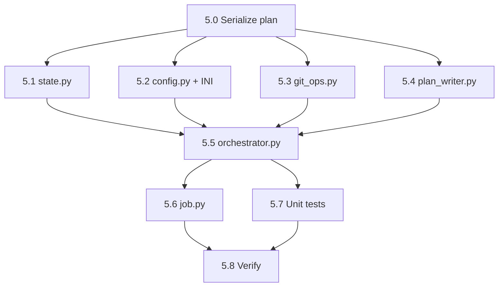

# Bug Fix Expediter — Phase 5: Trust Proxy Integration + Git Strategy

## Context

Phases 2-4 (this session) built the complete three-phase forensic pipeline: `run_diagnosis()` → `run_proposal()` → `run_fix()`. After `run_fix()` succeeds, the pipeline currently just ends with a summary message — no git operations, no trust-gated decisions.

Phase 5 adds:
1. **Trust proxy initialization** in the orchestrator (reusing SWE Team's `EngineeringStrategy`)
2. **Git operations** after successful fix: commit on current branch (low trust) or branch+PR (high trust)
3. **Light proxy gating** in `_voice_gate_proposal()` for L3+ auto-selection
4. **Plan document** updated with git references

---

## File Inventory

### New Files (3)

| # | File | Purpose |
|---|------|---------|
| 1 | `src/cosa/agents/bug_fix_expediter/git_ops.py` | Async git operations (commit, branch, push, PR via `gh`) |
| 2 | `src/tests/unit/test_bfe_git_ops.py` | ~8 unit tests for git operations |
| 3 | `src/tests/unit/test_bfe_phase5.py` | ~10 unit tests for trust proxy + git strategy orchestration |

### Files to Modify (6)

| # | File | Change |
|---|------|--------|
| 4 | `state.py` | Add `COMMITTING` phase + extend `FixResult` with git fields |
| 5 | `config.py` + INI files | Add `trust_mode: str = "shadow"` |
| 6 | `plan_writer.py` | Add `update_git_references()` + update footer template |
| 7 | `orchestrator.py` | Trust proxy init + `run_git_strategy()` + voice gate proxy integration |
| 8 | `job.py` | Wire `run_git_strategy()` after `run_fix()` |
| 9 | `__init__.py` | Export `GitOps` |

---

## Task Table

| # | Task | Dependencies | Status |
|---|------|-------------|--------|
| 5.0 | Serialize plan to `src/rnd/` | None | Pending |
| 5.1 | Extend `state.py` — `COMMITTING` phase + `FixResult` git fields | None | Pending |
| 5.2 | Add `trust_mode` to `config.py` + INI files | None | Pending |
| 5.3 | Create `git_ops.py` — async git operations | None | Pending |
| 5.4 | Extend `plan_writer.py` — `update_git_references()` + footer update | None | Pending |
| 5.5 | Modify `orchestrator.py` — trust proxy init + `run_git_strategy()` + voice gate | 5.1-5.4 | Pending |
| 5.6 | Modify `job.py` — wire `run_git_strategy()` after `run_fix()` | 5.5 | Pending |
| 5.7 | Create unit tests | 5.5 | Pending |
| 5.8 | Run py_compile + smoke tests + unit regression | 5.6, 5.7 | Pending |

### Implementation Order



---

## File Specifications

### File 1: `git_ops.py` (NEW)

Async git operations using `asyncio.create_subprocess_exec()` (same pattern as `swe_team/test_runner.py`).

```python
class GitOps:
    def __init__( self, cwd=None, timeout_secs=30, debug=False )

    async def _run_git( self, *args ) -> dict
        # Returns { "success": bool, "stdout": str, "stderr": str, "returncode": int }

    async def get_current_branch( self ) -> str

    async def commit_on_branch( self, files_changed, commit_message ) -> dict
        # git add <files> → git commit → git rev-parse HEAD
        # Returns { "success": bool, "commit_hash": str|None, "error": str|None }

    async def create_fix_branch( self, slug ) -> dict
        # git checkout -b fix/YYYY-MM-DD-{slug}
        # Returns { "success": bool, "branch_name": str|None, "error": str|None }

    async def commit_and_push( self, branch, files_changed, commit_message ) -> dict
        # git add → commit → push -u origin
        # Returns { "success": bool, "commit_hash": str|None, "error": str|None }

    async def create_pr( self, branch, title, body ) -> dict
        # gh pr create --title --body --head
        # Returns { "success": bool, "pr_url": str|None, "error": str|None }

    async def checkout_branch( self, branch ) -> dict
```

All methods return dicts, never raise. Errors in `"error"` key.

### File 2: `state.py` modifications

Add `COMMITTING` to `BFEPhase` (between FIXING and RETRYING). Update smoke test assertion from 9 → 10.

Extend `FixResult`:
```python
class FixResult( BaseModel ):
    applied        : bool
    success        : bool
    details        : str             = ""
    retry_eligible : bool            = False
    git_strategy   : Optional[ str ] = None    # "commit_only" | "branch_and_pr" | None
    commit_hash    : Optional[ str ] = None
    branch_name    : Optional[ str ] = None
    pr_url         : Optional[ str ] = None
```

### File 3: `config.py` + INI

Add field:
```python
# === Decision Proxy ===
trust_mode                : str   = "shadow"
```

Add to `key_map`:
```python
"trust_mode" : "bug fix expediter trust mode",
```

INI: `bug fix expediter trust mode = shadow`
Splainer: decision proxy trust mode description.

### File 4: `plan_writer.py` modifications

**Update `_render_footer()`** to include Git References placeholder:
```markdown
## Git References
(Phase 5 — populated after git operations)
```

**Add `update_git_references()`**:
```python
def update_git_references( self, plan_path, fix_result ):
    # Replace "(Phase 5 — populated after git operations)" with:
    # **Strategy**: {git_strategy}
    # **Commit**: {commit_hash}
    # **Branch**: {branch_name}
    # **PR**: {pr_url}
```

### File 5: `orchestrator.py` modifications

**Trust proxy init** in constructor (after `self._diagnosis_group_id`):
- Import `EngineeringStrategy`, `TrustTracker`, `CircuitBreaker` from SWE Team proxy
- Load config via `trust_proxy_config_from_config_mgr()`
- Instantiate and store as `self.proxy`
- Graceful `ImportError` fallback → `self.proxy = None`
- Add `_on_circuit_breaker_trip()` callback

**New method `run_git_strategy()`**:
```python
async def run_git_strategy( self, fix_result, files_changed, plan_path ) -> FixResult:
    # 1. Guard: skip if not success or no files
    # 2. State: FIXING → COMMITTING
    # 3. Determine trust level via self.proxy.evaluate()
    # 4. L1-L2: GitOps.commit_on_branch()
    # 5. L3+: GitOps.create_fix_branch() → commit_and_push() → create_pr() → checkout original
    # 6. Update fix_result with git metadata
    # 7. Update plan via plan_writer.update_git_references()
    # 8. State: COMMITTING → COMPLETED
    # 9. Return updated fix_result
```

**Trust-to-git mapping**:

| Trust Level | Mode | Git Strategy |
|-------------|------|-------------|
| L1-L2 | shadow/suggest | `commit_only` — commit on current branch |
| L3+ | active | `branch_and_pr` — fix branch + PR via `gh` |
| No proxy | disabled | `commit_only` — default to simple commit |

**Voice gate proxy integration** in `_voice_gate_proposal()`:
- Before `require_user_confirm` check, evaluate proxy
- L3+ in active mode → auto-select best fix
- Shadow mode → log only, no behavior change

**Store `last_files_changed`**:
- Add `self.last_files_changed = []` to constructor
- Set `self.last_files_changed = files_changed` in `run_fix()` before returning

### File 6: `job.py` modification

After line 243 (`self.artifacts[ "fix_result" ] = fix_result.model_dump()`), insert:

```python
# Phase 5: Git strategy (post-fix commit/branch/PR)
if fix_result.success and selected_fix:
    fix_result = await orchestrator.run_git_strategy(
        fix_result, orchestrator.last_files_changed, plan_path
    )
    self.artifacts[ "fix_result" ] = fix_result.model_dump()
```

### File 7: Unit tests

**`test_bfe_git_ops.py`** (~8 tests, mock subprocess):
- `_run_git` success/failure
- `commit_on_branch` — verify git add + commit commands
- `create_fix_branch` — verify branch name format `fix/YYYY-MM-DD-{slug}`
- `commit_and_push` — verify add + commit + push sequence
- `create_pr` — verify `gh pr create` call + URL extraction
- Timeout handling
- Empty files list → no-op

**`test_bfe_phase5.py`** (~10 tests):
- Proxy init: shadow mode → proxy created; disabled → proxy is None
- `run_git_strategy` L1-L2 → commit_only path
- `run_git_strategy` L3+ → branch_and_pr path
- `run_git_strategy` fix not successful → no-op
- `run_git_strategy` no files → no-op
- Voice gate: proxy active L3+ → auto-select
- Voice gate: proxy shadow → fallthrough to user
- `FixResult` model accepts git fields
- Plan writer git references update
- `COMMITTING` phase in BFEPhase enum

---

## Verification Plan

```bash
# Per-file compilation
python -c "import py_compile; py_compile.compile( 'path/to/file.py', doraise=True )"

# Smoke tests
python -m cosa.agents.bug_fix_expediter.git_ops
python -m cosa.agents.bug_fix_expediter.orchestrator
python -m cosa.agents.bug_fix_expediter.job

# Unit tests
pytest src/tests/unit/test_bfe_git_ops.py -v
pytest src/tests/unit/test_bfe_phase5.py -v
pytest src/tests/unit/test_bfe_orchestrator.py -v   # Phase 2 regression
pytest src/tests/unit/test_bfe_proposal.py -v        # Phase 3 regression
pytest src/tests/unit/test_bfe_fix.py -v             # Phase 4 regression
pytest src/tests/unit/ -v                            # Full regression
```

---

## Potential Challenges

1. **`gh` CLI not installed**: `create_pr()` checks availability, degrades to commit-only with warning.
2. **Dirty working directory**: `run_git_strategy()` checks `git status --porcelain` for conflicts before committing.
3. **Branch already exists**: Append 4-hex-char suffix on first failure.
4. **Trust proxy import failure**: Graceful `try/except ImportError` → `self.proxy = None` → L1 default.
5. **Budget exhaustion**: Git ops don't use LLM budget, only subprocess calls.

---

## Scope Boundaries

**IN scope**: Trust proxy init, git operations (commit/branch/PR), `run_git_strategy()`, voice gate proxy gating, plan update with git refs, unit tests.

**NOT in scope**: Retry pipeline (Phase 6), "Fix This" UI (Phase 7), trust proxy ratification UI, cross-session trust persistence.
