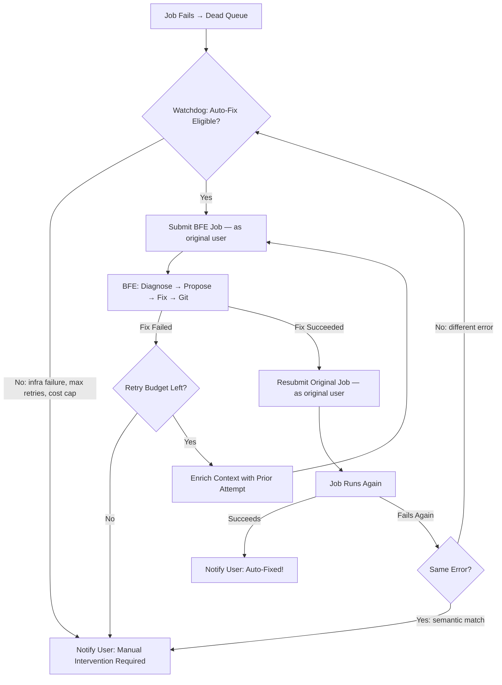

# Bug Fix Expediter — Phase 6: Automated Repair Loop

**Created**: 2026-04-07 (Planning Session)
**Status**: PLANNING
**Pattern**: Pattern 1 (Multi-Phase Implementation)
**Prefix**: [LUPIN]
**Plan file**: `~/.claude/plans/nifty-moseying-galaxy.md`

---

## Context

**Problem**: When an agentic job (e.g., Phase D Presentation Generator) fails, it lands in the dead queue and waits. A human must manually: (1) notice the failure, (2) submit a BFE job referencing the dead job, (3) wait for diagnosis/fix/commit, (4) manually resubmit the original job. This is slow and defeats the purpose of automation.

**Goal**: Close the loop. When a job dies, automatically trigger the Bug Fix Expediter, apply the fix, and resubmit the original job — with the user's identity so notifications pipe to their UI. The human becomes the escalation point, not the operator.

**Prior art**: BFE Phases 0-5 are complete (package → diagnose → propose → fix → git). Line 267 of `job.py` says "Retry pipeline not yet implemented (Phase 6+)". The original implementation plan (`01-implementation-plan.md`, line 41) reserved Phase 6 for exactly this.

**Existing pieces we build on**:
- CJ Flow state machine: RUNNING → FAILED → dead queue (error + stack_trace in `metadata_json`)
- BFE orchestrator: 5 phases complete with trust proxy + git strategy
- Retry endpoint: `POST /api/job-history/{job_id}/retry` re-submits original `question_text`
- Notification proxy: auto-answers gates during automated testing
- Job chaining precedent: DR→Podcast, DR→Presentation compound jobs
- `package_dead_job()` already extracts full error context from dead queue

---

## Research Synthesis: Industry Best Practices (April 2026)

### Patterns to Adopt

| Pattern | Source | Relevance |
|---------|--------|-----------|
| **MASAI decomposition** | Microsoft Research | BFE already does this — separate diagnosis/proposal/fix agents. Validates our architecture. |
| **VIGIL self-healing supervisor** | Dec 2025 paper | Out-of-band monitor → diagnose → patch → validate. Exactly what the watchdog should be. |
| **4-level escalation** | morphllm Agent Engineering Guide 2026 | (1) Retry with enriched context, (2) Rollback + different approach, (3) Decompose, (4) Human escalation |
| **Independent judge validation** | PwC (7x accuracy gain) | BFE's tester agent already validates. Key: the fixer must NOT grade its own work. |
| **Git checkpointing** | Elastic's Claude CI deployment | Checkpoint before every fix attempt. BFE Phase 5 already commits. |
| **Structured error context** | SWE-agent, AutoCodeRover | Package error + stack trace + relevant source files. BFE's `package_dead_job()` already does this. |

### Anti-Patterns to Avoid

| Anti-Pattern | Risk | Mitigation |
|-------------|------|------------|
| **Fix-grade loop** (fixer grades own work) | 37% vulnerability increase after 5 rounds | BFE already uses separate tester agent. Maintain this. |
| **Semantic dedup failure** | Agent proposes identical fix twice, spins forever | LLM-normalized gist → embedding similarity (cosine > 0.92 = bail). No brittle hashing. |
| **Flaky test trap** | Auto-fix spins on infrastructure noise | Classify code vs infra failures. Only BFE code bugs. |
| **Context collapse** | After 3+ iterations agent contradicts itself | Use structured state objects, not conversation history. |
| **Cost explosion** | Retry storm burns API credits | Triple circuit breaker: max iterations, token budget, wall-clock timeout |
| **Runaway scope** | BFE rewrites half the codebase | File count limit per fix attempt. Coder is sandboxed. |

### Success Rate Expectations

- **Constrained domains** (presentation gen, podcast gen — known failure modes): 80-90% auto-resolution
- **Open-ended software bugs**: 30-67% (SWE-bench Verified range)
- **Key insight**: First fix attempt has highest success rate. Budget 2-3 attempts max.

---

## Architecture: The Repair Loop



---

## Sub-Phase Breakdown

### Phase 6A: Dead Queue Watchdog (the trigger)

**What**: A background listener on `jobs_dead_queue` that evaluates failed jobs for auto-fix eligibility and triggers BFE.

**Where**: New file `src/cosa/rest/dead_queue_watchdog.py`

**Eligibility filter** — NOT every dead job should trigger BFE:
- Only agentic job types (not legacy AgentBase)
- Only `FAILED` status (not `CANCELLED`, not `INTERRUPTED`)
- Not already a BFE job (prevent BFE-fixing-BFE recursion)
- Not already at max retry count
- Not an infrastructure failure (timeout, OOM, rate limit, Docker)
- Job type must be in a configurable allow-list
- Original user must have `auto_fix_enabled` preference (future; default: on for admin)

**Trigger mechanism** — Two options:
- **Option A (Recommended)**: Hook into `running_fifo_queue.py` at lines 454-455 and 510-511 where failed jobs push to dead queue. After `self.jobs_dead_queue.push( running_job )`, call `watchdog.evaluate( running_job )`.
- **Option B**: Polling thread that periodically scans dead queue. Simpler but less responsive.

**INI configuration keys** (new section `[Lupin: Auto Fix]`):
```ini
auto fix enabled = false
auto fix eligible job types = presentation, deep_research, podcast, test_suite
auto fix max attempts per job = 3
auto fix max cost usd = 10.00
auto fix max wall clock seconds = 1800
auto fix cooldown seconds = 60
```

**Reuse**:
- `emit_job_state_transition()` from `queue_util.py` for audit trail
- `package_dead_job()` from BFE `dead_job_packager` (already extracts error context)
- cosa-voice `notify()` for user alerts at every stage

**Smoke test** (`quick_smoke_test()` in `dead_queue_watchdog.py`):
- `classify_failure()`: code bugs (KeyError, ImportError, pydantic), infra (TimeoutError, MemoryError, RateLimitError, ECONNREFUSED), unknown fallback, stack_trace analysis
- `is_eligible_for_auto_fix()`: eligible case, BFE recursion blocked, non-eligible type blocked, max attempts enforced, OOM blocked, environment blocked
- **Status**: IMPLEMENTED (10 assertions, all passing)

### Phase 6B: BFE Resubmit Original Job

**What**: After BFE successfully fixes code and commits (Phase 5), resubmit the original failed job to the todo queue.

**Where**: Extend `src/cosa/agents/bug_fix_expediter/job.py` (after line 267)

**How**:
1. After successful `run_git_strategy()`, extract original job's submission parameters from `dead_job_context`:
   - `job_type`, `routing_command`, `question_text`, `user_id`, `user_email`, `session_id`
   - Job-specific args from `metadata_json` (e.g., `source_path`, `content_model` for presentation gen)
2. Construct new job via `agentic_job_factory.create_agentic_job()` with original parameters
3. Push to todo queue via `todo_fifo_queue.push()` — **as the original user** (not as BFE)
4. Store `resubmitted_job_id` in BFE artifacts for audit trail
5. Notify user: "Auto-fix applied. Resubmitting your [job_type] job."

**Critical**: The resubmitted job must carry the original user's `user_id`, `user_email`, and `session_id` so that:
- WebSocket events route to the user's notification UI
- Notification proxy gates auto-answer on the user's channel
- Job history shows under the user's account

**Files to modify**:
- `src/cosa/agents/bug_fix_expediter/job.py` — Add Phase 6 after line 267
- `src/cosa/agents/bug_fix_expediter/state.py` — Add `RESUBMITTING` to `BFEPhase` enum; add `resubmitted_job_id` to `FixResult`
- `src/cosa/rest/job_persistence.py` — Expose `get_job_by_id_hash()` for resubmit parameter extraction (already exists)

**Smoke test** (`src/tests/unit/test_bfe_phase6.py` or inline):
- Mock failed job with `routing_command`, `user_id`, `user_email`, `session_id` populated
- Mock todo queue that captures `.push()` calls
- Verify `_resubmit_original_job()` creates job via factory with original user credentials
- Verify resubmitted job's `user_id` and `user_email` match the original (not BFE's)
- Verify `resubmitted_job_id` stored in BFE artifacts
- Verify skip when `auto fix enabled = false`
- **Status**: NOT YET IMPLEMENTED

### Phase 6C: Circuit Breakers

**What**: Three independent circuit breakers to prevent runaway loops.

1. **Iteration counter**: Per original-job-id, track attempt count. Max 3 (configurable).
2. **Cost budget**: Sum all BFE API costs for this repair chain. Abort if cumulative cost exceeds `auto_fix_max_cost_usd`.
3. **Wall-clock timeout**: From first failure to now. Abort if elapsed > `auto_fix_max_wall_clock_seconds`.
4. **Semantic deduplication** (local LLM gist + embedding similarity):
   - After each fix attempt, normalize the proposed fix into a short "gist" via the existing `Gister` object (`src/cosa/memory/gister.py`). Gister uses **local Phi-4 14B** (`kaitchup/phi_4_14b`) — no external API call, no cost. The gist captures WHAT was changed and WHY, stripped of formatting noise.
   - Compare gist embeddings against all prior attempts in this repair chain using `local_embedding_engine.py` (SentenceTransformer, already in CoSA). Cosine similarity > 0.92 = "semantically same fix" → terminate immediately, agent is stuck.
   - Fallback: if embeddings unavailable, use a cheap LLM judge call ("Are these two fix descriptions semantically equivalent? Answer yes/no.").
   - **Why not hash?** File-level hashing is too brittle — same fix with different whitespace, variable names, or import ordering would produce different hashes but represent the same conceptual fix. LLM-based comparison catches semantic equivalence.
   - **Reuse**: `Gister.get_gist( fix_description )` returns a one-sentence normalized summary. `GistNormalizer` (singleton wrapper) available at `src/cosa/memory/gist_normalizer.py`. Gist cache (`gist_cache` LanceDB table) already handles dedup of identical inputs.

**Where**: New file `src/cosa/rest/repair_attempt_tracker.py`

**Smoke test** (`quick_smoke_test()` in `repair_attempt_tracker.py` + `src/tests/unit/test_repair_attempt_tracker.py`):
- Iteration counter: increment, read, max-attempts rejection
- Cost budget: accumulate across attempts, reject when exceeded
- Wall-clock timeout: reject when elapsed > max
- Semantic dedup: generate two gists via `Gister.get_gist()`, compute embeddings via `local_embedding_engine`, verify cosine similarity > 0.92 triggers bail, verify distinct fixes pass through
- **Status**: NOT YET IMPLEMENTED

**Data model** (new DB table or JSONB extension on `job_history`):
```
repair_chain_id    : str       (original dead job id_hash)
attempt_number     : int
bfe_job_id         : str
resubmitted_job_id : str | None
fix_gist           : str       (LLM-normalized summary of the fix)
fix_gist_embedding : list[float] | None  (SentenceTransformer embedding for similarity comparison)
cost_usd           : float
started_at         : datetime
completed_at       : datetime
outcome            : "fixed" | "fix_failed" | "resubmit_failed" | "same_error" | "different_error" | "escalated"
```

### Phase 6D: Infrastructure Failure Classification

**What**: Before triggering BFE, classify failure as code vs infrastructure.

**Where**: Function in `dead_queue_watchdog.py`

**Classification heuristic**:

| Signal | Classification | Action |
|--------|---------------|--------|
| `TimeoutError`, `asyncio.TimeoutError` | Infra: timeout | Retry original job (no BFE) |
| `MemoryError`, `OOMKilled` | Infra: OOM | Notify user, do not retry |
| `RateLimitError`, `429` | Infra: rate limit | Retry after cooldown |
| `Docker`, `credential`, `ECONNREFUSED` | Infra: environment | Notify user, do not retry |
| `ImportError`, `ModuleNotFoundError` | Code: missing import | Trigger BFE |
| `KeyError`, `AttributeError`, `TypeError` | Code: logic error | Trigger BFE |
| `ValidationError`, `pydantic` | Code: schema error | Trigger BFE |
| Default (unclassified) | Unknown | Trigger BFE (conservative: try to fix) |

**Smoke test** (extend `quick_smoke_test()` in `dead_queue_watchdog.py`):
- Timeout errors → `INFRA_TIMEOUT`, eligible but direct-retry (no BFE)
- Rate limit errors → `INFRA_RATE_LIMIT`, retry after cooldown
- Cooldown enforcement: second attempt within cooldown window rejected
- Mixed signals: infra pattern in error but code pattern in stack trace → infra wins (higher priority)
- **Status**: Classification tests IMPLEMENTED (Phases 6A smoke test covers these). Cooldown + direct-retry NOT YET IMPLEMENTED.

### Phase 6E: User Notification + Escalation

**Notification flow**:
1. Job fails → `notify("Your [job_type] job failed. Auto-fix evaluating...", priority="high")`
2. BFE triggered → `notify("Bug Fix Expediter analyzing failure...", priority="medium")`
3. Fix applied → `notify("Fix applied and committed. Resubmitting your job...", priority="medium")`
4. Resubmitted job succeeds → `notify("Auto-fix successful! Your [job_type] job completed.", priority="high")`
5. Resubmitted job fails again → `notify("Auto-fix attempt [N] failed. [N-1] attempts remaining.", priority="high")`
6. Max retries exhausted → `ask_yes_no("Auto-fix exhausted after [N] attempts. Review manually?", priority="urgent")`

**Smoke test** (extend watchdog or `src/tests/unit/test_bfe_phase6.py`):
- Verify notification sent on BFE trigger (mock `send_notification`, assert called with correct `target_user`)
- Verify notification sent on max-attempts exhaustion (priority="urgent")
- Verify `ask_yes_no()` called on final escalation (mock cosa-voice, assert question contains attempt count)
- Verify no notification sent for silently-skipped ineligible jobs (wrong type, cancelled, etc.)
- **Status**: NOT YET IMPLEMENTED

### Phase 6F: Observability + Audit Trail

1. **RepairAttemptTracker** (Phase 6C) persists every attempt
2. **WebSocket events**: New `repair_cycle_update` event type for real-time UI
3. **Plan documents**: Each repair attempt gets its own BFE plan doc in `src/rnd/`
4. **Job lineage**: Link original → BFE → resubmitted via `metadata_json` fields:
   - `repair_chain_id`, `parent_bfe_job_id`, `attempt_number`

**Smoke test** (`src/tests/unit/test_repair_observability.py`):
- Verify `repair_cycle_update` WebSocket event emitted with correct payload (mock `websocket_mgr`)
- Verify job lineage fields (`repair_chain_id`, `parent_bfe_job_id`, `attempt_number`) present in resubmitted job's `metadata_json`
- Verify plan doc created per attempt with correct naming/path
- **Status**: NOT YET IMPLEMENTED

---

## Implementation Sequence

| Step | Phase | Effort | Includes Smoke Test | Dependencies |
|------|-------|--------|---------------------|-------------|
| 1 | 6A: Dead Queue Watchdog (evaluate + trigger) | Medium | YES — `quick_smoke_test()` in module (DONE) | None |
| 2 | 6B: BFE Phase 6 (resubmit original job) | Medium | YES — `test_bfe_phase6.py` (TODO) | Step 1 |
| 3 | 6D: Failure classification (cooldown + direct-retry) | Small | YES — extend watchdog smoke test (TODO) | Step 1 |
| 4 | 6C: RepairAttemptTracker (in-memory + persistence) | Medium | YES — `quick_smoke_test()` + `test_repair_attempt_tracker.py` (TODO) | Steps 1-2 |
| 5 | 6E: Notification flow + escalation | Small | YES — extend `test_bfe_phase6.py` (TODO) | Steps 1-4 |
| 6 | 6F: Observability (WebSocket events + lineage) | Small | YES — `test_repair_observability.py` (TODO) | Steps 1-4 |
| 7 | INI config keys + splainer entries | Small | N/A — config only (DONE) | Step 1 |
| 8 | Integration smoke test: full dry-run repair cycle | Medium | YES — mock failed job → watchdog → BFE dry-run → resubmit (TODO) | Steps 1-6 |
| 9 | Live E2E: Known-bad presentation gen → auto-fix cycle | Large | YES — real pipeline with Haiku ($0.06/run) (TODO) | All above |

---

## Critical Files

### New Files
| File | Purpose |
|------|---------|
| `src/cosa/rest/dead_queue_watchdog.py` | Watchdog class + evaluate() + failure classification |
| `src/cosa/rest/repair_attempt_tracker.py` | Circuit breaker + attempt persistence |

### Modified Files
| File | Change |
|------|--------|
| `src/cosa/rest/running_fifo_queue.py` | Hook: call `watchdog.evaluate()` after dead queue push (lines 454-455, 510-511) |
| `src/cosa/agents/bug_fix_expediter/job.py` | Phase 6: resubmit original job after successful fix (after line 267) |
| `src/cosa/agents/bug_fix_expediter/state.py` | Add `RESUBMITTING` phase, `resubmitted_job_id` field |
| `src/cosa/rest/job_persistence.py` | Expose full metadata for resubmit parameter extraction |
| `src/cosa/rest/queue_util.py` | New `repair_cycle_update` event emission |
| `src/conf/lupin-app.ini` | New `[Lupin: Auto Fix]` section |
| `src/conf/lupin-app-splainer.ini` | Matching explanations |
| `src/fastapi_app/main.py` | Initialize watchdog at startup |

### Functions to Reuse
| Function | File | Purpose |
|----------|------|---------|
| `package_dead_job()` | `bug_fix_expediter/dead_job_packager.py` | Extract error context |
| `create_agentic_job()` | `rest/agentic_job_factory.py` | Create resubmitted job |
| `emit_job_state_transition()` | `rest/queue_util.py` | Audit trail |
| `get_job_by_id_hash()` | `rest/job_persistence.py` | Fetch original job metadata |
| `todo_fifo_queue.push()` | `rest/todo_fifo_queue.py` | Queue the resubmitted job |

---

## Verification Plan

1. **Unit tests**: RepairAttemptTracker (circuit breakers), failure classification, watchdog eligibility filter
2. **Dry-run smoke test**: Submit presentation gen in dry-run → fake-fail → verify watchdog → verify BFE resubmits
3. **Live E2E**:
   - `auto fix enabled = true`, `auto fix eligible job types = presentation, deep_research, podcast, test_suite`
   - Submit Phase D with Haiku ($0.06/run)
   - Introduce known-bad mutation (e.g., bad YAML schema)
   - Verify: watchdog detects → BFE diagnoses → BFE fixes → BFE resubmits → job succeeds
   - Verify: all notifications pipe to user's UI
   - Verify: circuit breakers fire if fix doesn't converge

---

## Design Decisions (Resolved)

| Question | Decision | Rationale |
|----------|----------|-----------|
| **Scope** | Document full loop (6A-6F), implement 6A+6B as MVP | Get the core loop working first, add safeguards iteratively |
| **Eligible job types** | All four: presentation, deep_research, podcast, test_suite | No reason to artificially limit; INI config provides the kill switch |
| **Proxy dependency** | Not a watchdog concern | Notification proxy is wired into the job at creation time via `cosa_interface.SENDER_ID`. When `agentic_job_factory` creates the resubmitted job, it gets its own proxy binding automatically. |
| **Semantic dedup** | Local `Gister` (Phi-4 14B) + embedding similarity (not file hashing) | Hashing is too brittle — same fix with different formatting = different hash. `Gister.get_gist()` normalizes via local LLM (zero API cost), then `local_embedding_engine.py` compares embeddings. |

## Open Design Questions

None — all resolved.

## Future UI Work (Deferred)

- **Auto-fix checkbox** in job submission UI: enable/disable auto-resubmit per job, with default values for max retries and max budget. Separate consideration from the core pipeline.
