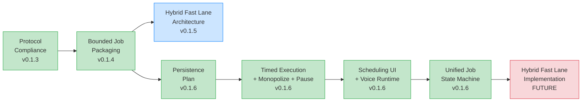

# CJ Flow — R&D Documentation Hub

**Last updated**: 2026-03-30 (Session 383b)
**Scope**: All planning, design, and analysis documents for the CJ Flow work queue system

---

## Roadmap

**Legend**: Green = complete | Blue = planned (not started) | Yellow = pre-planning | Red = future

---

## Architecture & Design

| Document | Version | Status | Description |
|----------|---------|--------|-------------|
| [Hybrid Fast Lane (Approach C)](../../v0.1.5/2026.02.19-approach-c-hybrid-queue-architecture.md) | v0.1.5 | Planned | ThreadPoolExecutor for concurrent agentic jobs + fast lane for sync agents |
| [Unified Job State Machine Assessment](2026.03.30-unified-job-state-machine-assessment.md) | v0.1.6 | Pre-planning | Prerequisites and sequencing for unified `job_state` refactor |
| [Unified Job State Machine Implementation Plan](2026.03.30-unified-job-state-machine.md) | v0.1.6 | **COMPLETE** | 9-state `JobState` enum, transition matrix, 6-phase implementation |
| [Approach D: Check-In Decoupling](../../v0.1.4/2026.02.13-claude-code-agentic-dev-team/2026.02.18-approach-d-hybrid-queue-checkin.md) | v0.1.4 | Reference | Alternative hybrid queue design with user-initiated communication |

## Implementation Plans

| Document | Version | Status | Description |
|----------|---------|--------|-------------|
| [Timed Execution + Monopolize + Pause](2026.03.27-cj-flow-timed-execution-monopolize-pause.md) | v0.1.6 | **COMPLETE** | `scheduled_at`, `monopolize`, `paused` — Phases 0-7 |
| [Scheduling UI + Voice Runtime Args](../2026.03.30-cj-flow-scheduling-ui-and-voice-runtime-args.md) | v0.1.6 | **COMPLETE** | UI forms + expeditor confirmation for scheduling |
| [Phase 5: Notifications UI](2026.03.28-cj-flow-phase-5-notifications-ui.md) | v0.1.6 | **COMPLETE** | WebSocket events + JS handlers + CSS badges for pause/schedule |
| [Persistence Plan](../2026.03.13-cj-flow-persistence-plan.md) | v0.1.6 | **COMPLETE** | PostgreSQL-backed job history with write-through design |

## Testing & Verification

| Document | Version | Status | Description |
|----------|---------|--------|-------------|
| [Phase 5 Live Demo Outline](2026.03.28-cj-flow-phase-5-live-demo-testing-outline.md) | v0.1.6 | Complete | 7-scenario manual testing plan (automated via Playwright) |
| [Persistence UI Testing](../2026.03.25-cj-flow-persistence-ui-testing-plan.md) | v0.1.6 | Complete | Data-driven E2E tests for job history UI |
| [Delete/Retry Manual Testing Rubric](../2026.03.27-cj-flow-history-delete-retry-manual-testing-rubric.md) | v0.1.6 | Complete | 11-test rubric automated as 9 Playwright E2E tests |

## Reference & Analysis

| Document | Version | Description |
|----------|---------|-------------|
| [Bounded Job Packaging Guide](../../v0.1.4/2026.02.12-cj-flow-bounded-job-packaging-guide.md) | v0.1.4 | Developer reference: 7 required pieces for new CJ Flow jobs (37K) |
| [Protocol Compliance Report](../../v0.1.3/2026.02.02-cj-flow-protocol-compliance-report.md) | v0.1.3 | ClaudeCodeJob QueueableJob protocol verification |
| [Unbounded vs SWE Team Analysis](../../v0.1.5/2026.02.25-unbounded-vs-swe-team-comparative-analysis.md) | v0.1.5 | Comparative analysis: interactive vs bounded multi-agent |
| [R2P Notification Lessons Learned](../../v0.1.5/2026.03.08-r2p-lessons-learned-notification-wiring.md) | v0.1.5 | Bug cascade analysis from Research-to-Podcast (5 bugs, Sessions 328-329) |
| [Unified Smoke Test Framework](../../v0.1.4/2026.02.13-unified-smoke-test-framework.md) | v0.1.4 | LivePipelineTestBase + EmbeddedProxyMixin testing infrastructure |

## Related: Bug Fix Expediter

The Bug Fix Expediter automates diagnosis of failed CJ Flow jobs. It has its own subdirectory:

- [Bug Fix Expediter Hub](../2026.03.27-bug-fix-expediter/00-index.md) — Navigation index (Phases 0-7)
