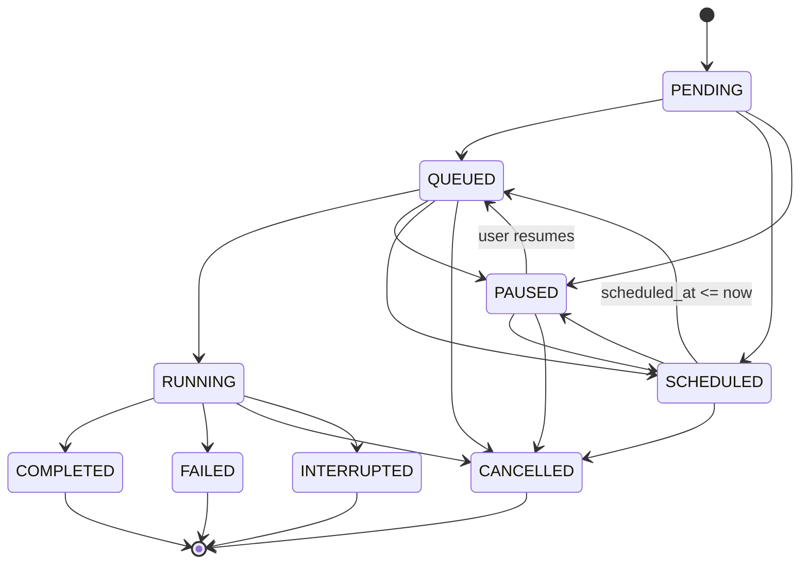

# CJ Flow: Unified Job State Machine — Implementation Plan

**Date**: 2026-03-30
**Session**: 383b
**Status**: COMPLETE (all 6 phases done)
**Type**: Foundation refactor (prerequisite for Hybrid Fast Lane)
**Serialized from plan**: `idempotent-imagining-lightning.md`
**Parent**: [CJ Flow R&D Hub](00-index.md)

---

## Context

CJ Flow tracks job state across three overlapping, inconsistently-named dimensions: a `status` string field (`"pending"`, `"running"`, `"completed"`, `"failed"`), queue position (`"todo"`, `"run"`, `"done"`, `"dead"`), and a `paused` boolean flag. There is no enum, no transition validation, and the vocabulary mixes queue container names with lifecycle states. Building the Hybrid Fast Lane (concurrent execution) on this foundation would compound the inconsistency. This refactor creates a single `JobState` enum as the authoritative source of truth.

---

## Design Decisions

### `JobState` Enum (9 states)

```python
class JobState( str, Enum ):
    PENDING     = "pending"      # Created, not yet in todo queue
    QUEUED      = "queued"       # In todo queue, eligible for immediate execution
    SCHEDULED   = "scheduled"    # In todo queue, future-dated (scheduled_at > now)
    PAUSED      = "paused"       # In todo queue, user-paused
    RUNNING     = "running"      # Consumer picked it up, executing
    COMPLETED   = "completed"    # Finished successfully (done queue)
    FAILED      = "failed"       # Finished with error (dead queue)
    INTERRUPTED = "interrupted"  # Server restart killed it
    CANCELLED   = "cancelled"    # User-initiated cancellation (dead queue)
```

### Transition Matrix



```
PENDING   → { QUEUED, SCHEDULED, PAUSED }
QUEUED    → { RUNNING, PAUSED, SCHEDULED, CANCELLED }
SCHEDULED → { QUEUED, PAUSED, CANCELLED }
PAUSED    → { QUEUED, SCHEDULED, CANCELLED }
RUNNING   → { COMPLETED, FAILED, CANCELLED, INTERRUPTED }
COMPLETED → {} (terminal)
FAILED    → {} (terminal)
CANCELLED → {} (terminal)
INTERRUPTED → {} (terminal)
```

### Key Naming Decisions
- Field renamed: `status` → `state` (clearer that it's the unified lifecycle, not a string)
- Params renamed: `from_queue`/`to_queue` → `from_state`/`to_state` in `emit_job_state_transition()`
- `paused` boolean → absorbed into `JobState.PAUSED` (no longer a separate flag)
- `dead` remains a UI queue container (holds both FAILED and CANCELLED jobs), not a state
- `expediting` stays a metadata boolean (UI animation hint, not a lifecycle state)
- PostgreSQL column stays `VARCHAR(50)` with `CHECK` constraint (no Postgres enum type)
- Frontend queue categories (`todo`, `run`, `done`, `dead`) unchanged — mapped from states via `stateToContainer()`
- **No backward compatibility** — clean cut, all consumers updated in the same pass

---

## Phase Plan

### Phase 0: Plan Serialization — DONE
- [x] Serialized to `src/rnd/v0.1.6/2026.03.30-cj-flow/2026.03.30-unified-job-state-machine.md`
- [ ] Update `00-index.md`

### Phase 1: Create `JobState` Enum + Transition Validation — DONE

**New file**: `src/cosa/rest/job_state.py`
- `JobState( str, Enum )` — 9 members
- `VALID_TRANSITIONS` dict — frozen transition matrix
- `TERMINAL_STATES`, `PRE_EXECUTION_STATES`, `ACTIVE_STATES` convenience sets
- `STATE_TO_UI_CONTAINER` mapping (state → frontend queue name)
- `validate_transition()` and `assert_valid_transition()` functions

**New test file**: `src/tests/unit/test_job_state.py`
- 53 tests: enum values, round-trip string serialization, all valid/invalid transitions, terminal states, convenience sets, UI container mapping

**Verification**: `pytest src/tests/unit/test_job_state.py -v` → 53/53 passed (0.07s)

### Phase 2: Update Protocol + Base Classes — DONE

**Files**: `queue_protocol.py`, `agentic_job_base.py`, `agent_base.py`, `solution_snapshot.py` + 9 agent job subclasses + `fifo_queue.py` MockJobs
- `self.status = "pending"` → `self.state = JobState.PENDING`
- Remove `self.paused` boolean entirely — absorbed into `JobState.PAUSED`
- Remove `status` field from protocol — replaced by `state: JobState`
- Constructor param `paused: bool = False` removed; callers set `job.state = JobState.PAUSED` after construction
- **No backward-compat properties** — clean cut, all consumers updated in the same pass

**Verification**: Tests will break until Phase 5 updates them — that's expected. Verify compilation only.

### Phase 3: Update Queue Infrastructure — DONE

**Files**: `queue_util.py`, `job_persistence.py`, `queue_consumer.py`, `running_fifo_queue.py`, `fifo_queue.py`, `todo_fifo_queue.py`, `routers/queues.py` + 8 agent job smoke tests

Key changes:
- `emit_job_state_transition()`: rename params to `from_state`/`to_state` (typed `JobState`), add `assert_valid_transition()` call, WebSocket payload uses `from_state`/`to_state` only (no legacy `from_queue`/`to_queue` keys)
- `job_persistence.py`: status values use `JobState.X.value` for PostgreSQL writes
- `queue_consumer.py`: emit `JobState.QUEUED → JobState.RUNNING`
- `running_fifo_queue.py`: emit `JobState.RUNNING → JobState.COMPLETED/FAILED`, replace `running_job.status = "failed"` with `running_job.state = JobState.FAILED`
- `fifo_queue.py:pop_next_eligible()`: check `job.state == JobState.PAUSED` instead of `getattr( job, 'paused', False )`
- `routers/queues.py`: pause/resume endpoints set `job.state = JobState.PAUSED/QUEUED`, serialization uses `job.state.value`

**Verification**: Compile verification on all modified files

### Phase 4: Update Frontend — DONE

**File**: `src/fastapi_app/static/js/notifications.js`
- Add `stateToContainer()` mapping function (state name → UI container)
- `handleJobStateTransition()`: extract `from_state`/`to_state` directly (no fallback to legacy `from_queue`/`to_queue`)
- All references to `from_queue`/`to_queue` in JS replaced with `from_state`/`to_state`
- Job card rendering: `job.state === 'paused'` instead of `job.paused === true`
- Remove separate `job_paused`/`job_resumed` event handlers — replaced by state transitions

**Verification**: E2E Playwright tests (`test_cj_flow_pause_schedule.py`)

### Phase 5: Update All Tests — DONE

**Files** (12 total):

| File | Pattern | Locations |
|------|---------|-----------|
| `test_timed_execution.py` | `.status`, `.paused` in MockSchedulableJob + assertions | ~7 |
| `test_consumer_timed.py` | `.status`, `.paused` in MockSchedulableJob + pause/resume tests | ~8 |
| `test_runtime_argument_expeditor.py` | `.status` string references | ~2 |
| `test_cj_flow_pause_schedule.py` | `.paused`, WS event `from_queue`/`to_queue` | ~4 |
| `test_fifo_queue_filtering.py` | `.status`, `.paused` in MockJob | ~2 |
| `test_swe_team_job.py` | `job.status ==` assertions | ~3 |
| `test_deep_research_to_presentation.py` | `job.status ==` assertion | ~1 |
| `test_job_persistence.py` | `.status` assignments + `emit_job_state_transition` string args | ~8 |
| `test_swe_team_notification_client.py` | `"from_queue"` / `"to_queue"` in WS event payload | ~2 |
| `test_crud_queue_integration.py` | `emit_job_state_transition()` positional args | ~2 |
| `helpers/job_history_seed.py` | `"completed"`, `"failed"`, `"pending"` string literals in fixtures | ~9 |
| `integration/test_job_history_api.py` | Status string literal assertions | ~12 |

Changes across all files:
- Replace `job.status` with `job.state` everywhere
- Replace `job.paused = True/False` with `job.state = JobState.PAUSED/QUEUED`
- Replace string literals `"pending"`, `"running"` etc. with `JobState` enum
- Update WebSocket event assertions: `from_queue` → `from_state`
- Update MockJob classes in test files to use `state` instead of `status`/`paused`

**Note on "dead" queue references**: Per design decision (line 84), `dead` remains a UI queue container name. Files that only reference `"dead"` as a container (`test_queue_display.py`, `test_queue_filtering_smoke.py`, `test_queue_workflow.py`, `test_queue_filtering_integration.py`, `test_queue_not_self_filter.py`, `test_job_queue_progressive_disclosure.py`, `test_job_history_ui.py`) do NOT need state-related updates.

**Verification**: `pytest src/tests/ -v` — 2542+ tests pass

### Phase 6: PostgreSQL Migration + Documentation — DONE

**New file**: `src/scripts/sql/migrate-job-state-enum.sql`
- Add `CHECK` constraint on `status` column
- Migrate `"pending"` rows to `"queued"` where appropriate

**Doc updates**: `queue_protocol.py` docstring, CJ Flow `00-index.md`, `CLAUDE.md` Key Components

**Verification**: Run migration against test DB, verify `query_job_history()` works

---

## Critical Files

| File | Phase | Change Scope | Repo |
|------|-------|-------------|------|
| `src/cosa/rest/job_state.py` | 1 | **NEW** — enum + transitions | CoSA |
| `src/cosa/rest/queue_protocol.py` | 2 | `status` → `state`, remove `paused` | CoSA |
| `src/cosa/agents/agentic_job_base.py` | 2 | Replace string literals | CoSA |
| `src/cosa/agents/agent_base.py` | 2 | Replace string literals | CoSA |
| `src/cosa/memory/solution_snapshot.py` | 2 | Replace string literals | CoSA |
| `src/cosa/rest/queue_util.py` | 3 | **HUB** — param rename + validation | CoSA |
| `src/cosa/rest/job_persistence.py` | 3 | Use enum values for DB writes | CoSA |
| `src/cosa/rest/queue_consumer.py` | 3 | Use JobState in transitions | CoSA |
| `src/cosa/rest/running_fifo_queue.py` | 3 | Use JobState for terminal states | CoSA |
| `src/cosa/rest/fifo_queue.py` | 3 | Check `job.state` instead of `job.paused` | CoSA |
| `src/cosa/rest/todo_fifo_queue.py` | 3 | Set initial state at push time | CoSA |
| `src/cosa/rest/routers/queues.py` | 3 | Pause/resume use state transitions | CoSA |
| `src/fastapi_app/static/js/notifications.js` | 4 | `stateToContainer()` mapping | Lupin |
| `src/tests/unit/test_job_state.py` | 1 | **NEW** — enum tests | Lupin |
| 12 test files (see Phase 5) | 5 | Update assertions | Lupin |

---

## Verification Plan

### Per-Phase Gates

| Phase | Gate | Command |
|-------|------|---------|
| 1 — JobState enum | Unit tests for new module | `pytest src/tests/unit/test_job_state.py -v` |
| 2 — Protocol + bases | Compilation (tests expected broken) | `py_compile.compile()` on each modified `.py` |
| 3 — Queue infra | Compilation (tests expected broken) | `py_compile.compile()` on all 7 modified files |
| 4 — Frontend | Targeted E2E pause/schedule | `./src/scripts/run-e2e-ui-tests.sh --bg -v -k "test_cj_flow_pause_schedule"` |
| 5 — Test updates | Full unit regression | `pytest src/tests/unit/ -v` — 2542+ tests pass |
| 6 — PostgreSQL + docs | Migration on test DB | SQL script + `query_job_history()` check |

### Pre-Merge Validation (mandatory, per CLAUDE.md)

After all phases complete, run the full pre-merge sequence. **No merge without 100% pass on all layers.**

```bash
# 1. Unit tests (fast, run first)
pytest src/tests/unit/ -v

# 2. WebSocket smoke tests (state transition events renamed)
./src/scripts/run-websocket-smoke-tests.sh

# 3. Full E2E UI suite (not just pause/schedule subset)
./src/scripts/run-e2e-ui-tests.sh --bg -v
# Monitor: tail -20 /tmp/e2e-ui-latest.log
# Status: kill -0 $(cat /tmp/e2e-ui-tests.pid) 2>/dev/null && echo running || echo done

# 4. Integration tests — FINAL GATE (wait for E2E to finish first)
./src/tests/run-integration-tests.sh --bg -v
# Monitor: tail -20 /tmp/integration-latest.log
# Status: kill -0 $(cat /tmp/integration-tests.pid) 2>/dev/null && echo running || echo done
```

### Why Each Layer Matters for This Refactor

| Layer | What it catches |
|-------|----------------|
| **Unit** | Enum values, transition validation, MockJob protocol changes, `.status`→`.state` renames |
| **WebSocket smoke** | `from_queue`/`to_queue` → `from_state`/`to_state` in live WS event payloads |
| **E2E UI (full)** | Frontend `stateToContainer()` mapping, job card rendering, pause/resume UI flow, queue display |
| **Integration (final gate)** | End-to-end job lifecycle: push → queue → execute → complete/fail with real DB + real server |
