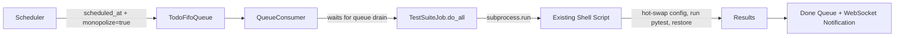
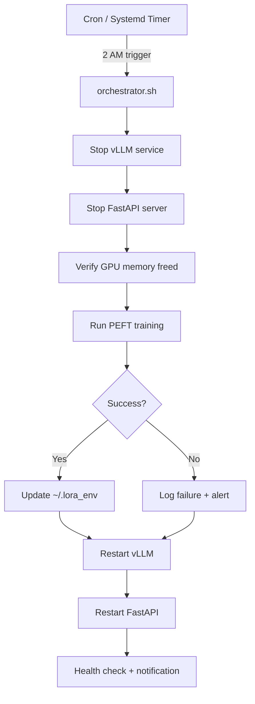

# Scheduled Long-Running Jobs in CJ Flow

**Date**: 2026-03-30
**Status**: Pattern A Implemented (2026-03-31)
**Version**: v0.1.6

### Implementation Notes (2026-03-31)

Pattern A (TestSuiteJob) fully implemented and tested:
- **7 new files**: job.py, voice_io.py, cosa_interface.py, __init__.py, REST router, smoke test, unit tests
- **10 modified files**: factory, registry, mode map, main.py, config INI (x2), training data JSON, proxy config, mode management tests, expeditor tests
- **35 unit tests** passing (TestSuiteJob) + 27 mode management tests + 147 expeditor tests
- Full agentic-voice-workflow skill compliance (voice_io lifecycle, dry-run, notifications)
- Voice routing training data: 65 utterance templates in `synthetic-data-agent-routing-test-suite.txt`
- Notification proxy Q&A script for automated testing
- REST endpoint: `POST /api/test-suite/submit`
- Detailed plan: `src/rnd/v0.1.6/2026.03.31-test-suite-agentic-job-plan.md`

---

## Problem Statement

Several long-running, resource-intensive tasks are currently kicked off manually and babysat to completion:

1. **Integration test suite** (~5-15 min, needs DB hot-swap)
2. **E2E UI test suite** (~17-19 min, needs Playwright + DB hot-swap)
3. **PEFT/LoRA training** (2-4 hours, needs both GPUs fully)

These are natural candidates for scheduled, unattended execution — ideally run late at night when no one is interacting with the server.

## Two Distinct Orchestration Patterns

A key insight emerged during design exploration: these jobs fall into **two fundamentally different categories** based on what they need to monopolize.

### Pattern A: Queue-Level Monopolize (Test Suites)



**What it monopolizes**: The CJ Flow queue only — no other jobs run concurrently.
**Server stays up**: FastAPI, vLLM, WebSocket all remain running.
**Infrastructure exists**: `scheduled_at`, `monopolize` flag, `pop_next_eligible()` — all wired.

The test scripts (`run-integration-tests.sh`, `run-e2e-ui-tests.sh`) already handle:
- Config hot-swap to testing database
- Trap-based cleanup on failure
- Background mode with PID files
- Output logging

**Implementation**: A thin `TestSuiteJob(AgenticJobBase)` wrapper (~100-150 lines) that:
1. Calls `subprocess.run()` on the existing shell script
2. Captures stdout/stderr
3. Emits progress notifications via WebSocket
4. Reports pass/fail summary on completion

**Estimated effort**: ~4-6 hours total (job class + factory integration + testing)

### Pattern B: System-Level Monopolize (PEFT Training)



**What it monopolizes**: The entire machine — both GPUs, all VRAM, the inference stack itself.
**Server goes DOWN**: vLLM and FastAPI must be killed to free GPU memory.
**Cannot be an AgenticJob**: The job needs to kill the server that would be running it.

This is fundamentally an **OS-level orchestration** problem:

1. Kill vLLM (releases GPU VRAM)
2. Kill FastAPI server (releases any remaining GPU refs)
3. Verify CUDA memory is fully freed
4. Run training (PeftTrainer occupies both GPUs for 2-4 hours)
5. Post-training: merge adapter, quantize (4-bit + 8-bit), update `~/.lora_env`
6. Restart vLLM with new LoRA adapters
7. Restart FastAPI
8. Health check + send notification (email? webhook? cosa-voice on restart?)

**Existing infrastructure**:
- `PeftTrainer` class (2,900 lines) — fully self-contained
- `run-agentic-intent-training.sh` (305 lines) — handles test/full/generate/validate modes
- `xml_coordinator.py` — training data generation pipeline
- `quantizer.py` — AutoRound GPTQ quantization

**What's needed**: A master orchestration script (`run-scheduled-training.sh`) that wraps the existing training script with service lifecycle management.

**Estimated effort**: ~6-10 hours (orchestrator script + systemd timer + notification + testing)

## Scheduling Mechanisms

### How Jobs Get Scheduled

Three tiers of increasing sophistication:

#### Tier 1: External Cron (Simplest)

```bash
# /etc/cron.d/lupin-scheduled-jobs
# Queue-level: hit REST endpoint
0 2 * * * lupin curl -s -X POST http://localhost:7999/api/push \
  -H "Authorization: Bearer ..." \
  -d '{"question":"run integration tests","scheduled_at":"...", "monopolize":true}'

# System-level: direct script invocation
0 3 * * 6 lupin /path/to/run-scheduled-training.sh full  # Saturdays at 3 AM
```

**Pros**: Zero code changes. Works today (for Pattern A, once TestSuiteJob exists).
**Cons**: No UI visibility, no voice scheduling, Claude Code can't self-schedule.

#### Tier 2: CJ Flow Built-In Scheduler (~4-6 hours)

Add a `RecurringSchedule` model:
```python
class RecurringSchedule:
    job_type       : str           # "integration_tests", "e2e_tests"
    cron_expr      : str           # "0 2 * * *"
    job_params     : dict          # Template for job creation
    enabled        : bool
    last_run       : datetime
    next_run       : datetime
```

A lightweight scheduler thread checks every minute, pushes jobs when due.
Manageable via REST API — which means voice and MCP get it for free.

**Pros**: Visible in UI, schedulable by voice, Claude Code can create/modify schedules.
**Cons**: Only works for Pattern A (queue-level) jobs. Pattern B still needs OS-level cron.

#### Tier 3: Full UI + Voice + MCP Integration (~8-12 hours on top of Tier 2)

- Schedule management page in the Lupin UI
- Voice commands: *"Schedule integration tests tonight at midnight"*
- Claude Code MCP tool: `schedule_job(type="integration_tests", cron="0 2 * * *")`
- Claude Code self-scheduling: *"I've changed 3 router files. Scheduling integration tests for 2 AM."*

### The Claude Code Self-Scheduling Vision

The most compelling use case: Claude Code finishes implementing a feature and autonomously schedules verification:

```
Claude: "I've modified src/cosa/rest/routers/queue.py and 2 related files.
         I'm scheduling integration + E2E tests for tonight at 2 AM in
         monopolize mode. Results will be in your queue tomorrow morning."
```

This requires:
- An MCP tool (or REST call via Bash) that submits a TestSuiteJob with `scheduled_at`
- The existing queue consumer handles the rest
- Results appear in the done queue with pass/fail summary

## Existing Infrastructure Inventory

### Already Built (Ready to Use)

| Component | File | Relevance |
|-----------|------|-----------|
| `AgenticJobBase` | `src/cosa/agents/agentic_job_base.py` | Base class for test suite jobs |
| `scheduled_at` field | `agentic_job_base.py` | Timed execution support |
| `monopolize` flag | `lupin-app.ini` + queue consumer | Exclusive execution |
| `pop_next_eligible(now)` | `src/cosa/rest/fifo_queue.py` | Schedule-aware dequeue |
| `QueueConsumer` | `src/cosa/rest/queue_consumer.py` | Event-driven background thread |
| `AgenticJobFactory` | `src/cosa/rest/agentic_job_factory.py` | Job creation dispatch |
| `PeftTrainer` | `src/cosa/training/peft_trainer.py` | 2,900-line training engine |
| `run-integration-tests.sh` | `src/tests/` | Integration test runner |
| `run-e2e-ui-tests.sh` | `src/scripts/` | E2E test runner |
| `xml_coordinator.py` | `src/cosa/training/` | Training data pipeline |
| WebSocket notifications | Queue → UI pipeline | Progress/completion alerts |

### Needs to Be Built

| Component | Pattern | Effort | Priority |
|-----------|---------|--------|----------|
| `TestSuiteJob` class | A (queue) | 4-6 hrs | High |
| `run-scheduled-training.sh` orchestrator | B (system) | 6-10 hrs | Medium |
| Factory integration for test jobs | A | 1 hr | High |
| Systemd timer for training | B | 1-2 hrs | Medium |
| Recurring schedule model (Tier 2) | A | 4-6 hrs | Low |
| REST endpoint for schedule management | A+B | 2-3 hrs | Low |
| MCP tool for Claude Code scheduling | A | 2-3 hrs | Low |

## Open Questions

1. **Notification on completion when server was down** (Pattern B): How does the training orchestrator notify the user when the server wasn't running? Options: email, Pushover, write results to a file that FastAPI reads on startup.

2. **Training failure recovery**: If PEFT training crashes at hour 3, should the orchestrator still restart services? (Probably yes, with a failure flag.)

3. **Checkpoint resumption**: SFTTrainer saves checkpoints. Should the orchestrator support `--resume` from last checkpoint?

4. **Multi-model training**: The training script supports Ministral-8B, Qwen3-4B, Llama-3.2-3B. Schedule all three sequentially in one night window? Or spread across nights?

5. **Test result persistence**: Should test results go into the done queue (ephemeral) or also be persisted to a database/file for trend analysis?

6. **Pre-flight checks**: Before Pattern B kicks off, should it verify disk space, GPU health, training data freshness?

## Recommended Implementation Order

1. **TestSuiteJob** (Pattern A) — highest ROI, least effort, proves the scheduling pattern
2. **Training orchestrator script** (Pattern B) — standalone, no server changes needed
3. **Built-in scheduler** (Tier 2) — enables voice/MCP/UI scheduling for Pattern A
4. **Claude Code MCP integration** — the self-scheduling vision
