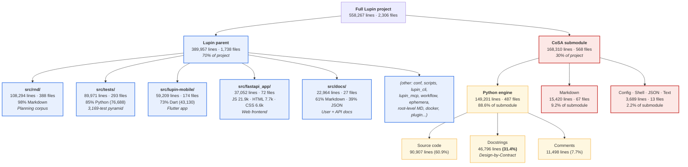

# Codebase Analysis — Lupin Parent vs CoSA Submodule

**Date**: 2026-04-12
**Scope**: Point-in-time snapshot of line-of-code distribution across the Lupin parent repo and the nested CoSA submodule
**Tool**: Directory Analyzer (`python -m cosa.repo.run_directory_analyzer`)
**Nature**: Transient analysis. Numbers drift with every commit. Re-run the analyzer for a current snapshot rather than trusting this doc months from now.

---

## TL;DR

- **Total project**: 558,267 lines across 2,306 files
- **Python split 61/39**: 149k lines in CoSA (submodule), 97k in Lupin parent
- **CoSA is the engine** (88.6% Python, 31.4% docstring ratio). Lupin parent is the **platform wrapper** (frontend, mobile, tests, R&D, docs).
- **R&D planning corpus (108k markdown) is larger than all Lupin-parent Python (97k)** — a direct artifact of the Planning-is-Prompting methodology.
- The repo split has real operational consequences: most meaningful refactors touch both sides, but the CoSA-never-commit-from-parent rule forces two separate commit cycles per semantic unit of work.

---

## Structural diagram



---

## The numbers

### Top-level scopes

| Scope | Total lines | Files | Python lines | Python files |
|---|---:|---:|---:|---:|
| Full Lupin project | 558,267 | 2,306 | 245,901 | 840 |
| `src/` (Lupin + CoSA combined) | 526,498 | 1,830 | 245,901 | 840 |
| `src/cosa/` (CoSA submodule) | **168,310** | **568** | **149,201** | **487** |
| **Lupin parent** (derived: project − cosa) | **389,957** | **1,738** | **96,700** | **353** |

### Python: the 60/40 split

| Python breakdown | CoSA | Lupin parent | Notes |
|---|---:|---:|---|
| Source code | 90,907 (60.9%) | ~68,800 (~71%) | Parent is leaner on docstrings |
| Comments | 11,498 (7.7%) | ~7,827 (~8%) | Comparable |
| Docstrings | **46,796 (31.4%)** | ~20,073 (~21%) | **CoSA ≈ 50% more docstring-dense** |
| Total Python | 149,201 | 96,700 | 61% / 39% split |

### Lupin parent drill-down

| Subdir | Total lines | Files | Dominant content |
|---|---:|---:|---|
| `src/rnd/` | 108,294 | 388 | 98.3% Markdown — R&D planning docs |
| `src/tests/` | 89,971 | 293 | 85.2% Python (76,688) — integration + unit tests |
| `src/lupin-mobile/` | 59,209 | 174 | 72.8% Dart (43,130) — Flutter mobile app |
| `src/fastapi_app/` | 37,052 | 72 | 59% JS (21,937) + 21% HTML (7,684) + 18% CSS (6,578) |
| `src/docs/` | 22,964 | 27 | 61% Markdown (14,015) + 39% JSON (8,949, API refs) |

---

## Key observations

### 1. CoSA is the engine, Lupin parent is the platform wrapper

Every agent, every orchestrator, every router, every prompt template, every queue primitive lives in the 149k-line CoSA submodule. The parent is: the FastAPI entry point, the web frontend, the mobile client, the test pyramid, and a mountain of planning docs. If you deleted CoSA tomorrow, Lupin would still have 390k lines of "stuff" — but nothing would actually *do* anything.

### 2. Lupin parent is dominated by non-code artifacts

Of 390k lines in the parent, only ~25% is Python. The rest breaks down as:

- **28% markdown** (R&D planning + user docs)
- **11% Dart** (mobile app)
- **9% web frontend** (JS + HTML + CSS combined)
- Remainder: config, JSON, shell, tests (JSON fixtures), SQL, etc.

The parent is a *delivery vehicle* with multiple front-ends attached.

### 3. R&D docs are bigger than all Lupin-parent Python

108,294 lines of Markdown in `src/rnd/` vs 96,700 lines of Python in the entire parent. The planning corpus is **larger than the code it plans** — which is the opposite of most codebases and is the direct consequence of the "Planning is Prompting" methodology this project practices. (Session-end archival keeps `history.md` under 25k tokens, but the cumulative R&D tree compounds indefinitely.)

### 4. Design-by-Contract shows up in the docstring ratio

CoSA's Python is 31.4% docstrings — roughly one line of docstring for every two lines of code. That's ~50% more docstring-dense than the parent's Python, and far above the ~10-15% ratio typical of Python projects without a doc mandate. This is the `CLAUDE.md` Design-by-Contract rule (`Requires:` / `Ensures:` / `Raises:` blocks on every function) manifesting as measurable output. It's not decorative — it's an artifact of a specific engineering discipline, and the number proves the discipline is actually being followed.

### 5. The test pyramid sits in the parent

76,688 Python lines across 258 test files live in `src/tests/` (parent). CoSA's own internal unit tests are included in its 149k total, but the integration tier — the 3,169-test unit suite, the WebSocket smoke suite, the E2E Playwright tests — all parent-side. This is the right structural choice: the engine (CoSA) exposes interfaces, the wrapper (Lupin parent) verifies them end-to-end.

### 6. The mobile app is a sleeping giant

43,130 lines of Dart in `src/lupin-mobile/` is ~45% the size of all Lupin-parent Python. Easy to forget because it's nested as a sub-repo (like the Firefox plugin and CoSA itself), but it's not small.

### 7. The frontend is a medium-sized JS project hiding inside `fastapi_app/static/`

21,937 lines of JavaScript across 26 files is not incidental. `notifications.js` alone is a multi-thousand-line file. 76.2% source / 23.8% comments means it's reasonably well-annotated, but the sheer size argues for eventual modularization.

---

## Operational implication: the 61/39 split × the CoSA-never-commit rule

The 60/40 Python split combined with the *"never run git in `src/cosa/` from parent context"* rule is why typical development sessions in this repo produce **paired commits** — one in Lupin parent, one in CoSA — for the same semantic unit of work.

Concrete example (Session 1cfcdf73, 2026-04-10 → 2026-04-11):

| Half | Files | Repo | Commit context |
|---|---:|---|---|
| Engine / orchestration / REST | 7 | CoSA | `cd src/cosa && git commit …` |
| FastAPI entry, INI, UI, docs, tests | 18 | Lupin parent | `git commit …` from project root |

**Both halves ship together logically, but they commit on separate branches in separate repos on separate timelines.** The 61/39 split quantifies how often this happens: roughly 6 out of every 10 Python lines you might touch require going through the CoSA-side workflow, and the remaining 4 go through the Lupin-parent workflow. Any cross-cutting feature (watchdogs, new agents, new REST endpoints, routing changes) hits both.

---

## Re-running this analysis

```bash
cd /mnt/DATA01/include/www.deepily.ai/projects/lupin/src

# Full project breakdown
python -m cosa.repo.run_directory_analyzer --path /mnt/DATA01/include/www.deepily.ai/projects/lupin

# CoSA alone
python -m cosa.repo.run_directory_analyzer --path cosa

# Any drill-down
python -m cosa.repo.run_directory_analyzer --path tests
python -m cosa.repo.run_directory_analyzer --path rnd
python -m cosa.repo.run_directory_analyzer --path fastapi_app
python -m cosa.repo.run_directory_analyzer --path lupin-mobile
python -m cosa.repo.run_directory_analyzer --path docs
```

For branch-over-branch deltas (churn between two git refs), use the sibling tool:

```bash
python -m cosa.repo.run_branch_analyzer --base main --head HEAD
```

Full skill reference: `~/.claude/skills/codebase-analysis/SKILL.md`.

---

## What this snapshot does *not* cover

- **Branch-over-branch deltas** — use `run_branch_analyzer` for that.
- **Cyclomatic complexity / code health** — LoC is a proxy, not a judgment.
- **Test-to-source ratio per package** — would require per-package pairing (`cosa.agents.X` vs `tests/unit/test_X.py`).
- **R&D doc growth velocity** — interesting question for a time-series plot; current doc is a single point.
- **Sub-repo analysis for `lupin-plugin-firefox`** — not included in the drill-down; left to a separate pass.

---

## Related

- [`src/cosa/repo/README-branch-analyzer.md`](../../cosa/repo/README-branch-analyzer.md) — upstream tool docs
- [`src/rnd/README.md`](../README.md) — R&D archive index
- [Session 1cfcdf73 history](../../../history.md) — the session that prompted this analysis (CoSA-never-commit rule in action)
