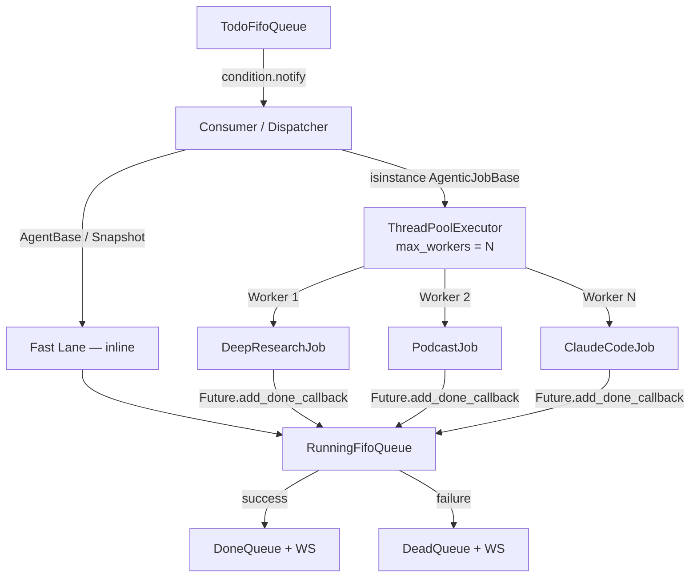

# CJ Flow — Serial → Async + Hybrid Multi-Lane: Design Review

**Status**: Design review (no implementation yet)
**Session**: resumed from Session 237 (2026-02-19)
**Anchor doc**: `src/rnd/v0.1.5/2026.02.19-approach-c-hybrid-queue-architecture.md`
**Companion**: `src/rnd/v0.1.4/2026.02.13-claude-code-agentic-dev-team/2026.02.18-approach-d-hybrid-queue-checkin.md`

---

## Context

CJ Flow (COSA Jobs Flow: `todo → running → done/dead`) currently executes jobs **strictly serially**. One background consumer thread (`src/cosa/rest/queue_consumer.py:42-122`) pops the next eligible job and calls `running_queue._process_job( job )`, which blocks until the job's synchronous `do_all()` returns. For agentic jobs, `do_all()` bridges to async via `asyncio.run( self._execute() )` — still blocking the consumer for the full duration.

**Practical effect today**: a 10-minute DeepResearchJob blocks every subsequent 2-second MathAgent query. Session 237 already produced a full design (Approach C) and an 11-step, 3-phase roll-out in TODO.md. Approach D (Session 223) covers the related user↔job communication pattern needed once ClaudeCodeJob INTERACTIVE lives in its own lane.

The user's question is two-part:
1. **What did that design look like?** (recap Approach C)
2. **What are the implications — beyond faster throughput — of going async?**

This document answers both and flags the open design questions before we commit to implementation.

---

## 1. What the design looks like (Approach C recap)

### 1a. One picture



### 1b. The core moves

| Move | Where | Why |
|------|-------|-----|
| Consumer becomes a **dispatcher**, not an executor | `running_fifo_queue.py::_process_job()` | One thread routes; many threads execute |
| Sync agents stay **inline (fast lane)** | `_process_fast_lane()` | Local GPU already serialized at inference — no win from parallelism |
| Agentic jobs **submitted to a `ThreadPoolExecutor`** | `_submit_agentic_job()` / `_execute_agentic_in_pool()` | Anthropic API is the resource; concurrency is bounded by rate limit quota |
| Completion handled in a **`Future.add_done_callback`** | `_on_agentic_complete()` | Moves job from `running → done/dead` off the pool thread back into queue state |
| `FifoQueue` gains a **`threading.RLock()`** | `src/cosa/rest/fifo_queue.py` | Guards `queue_list` / `queue_dict`; RLock (not Lock) because `pop()→is_empty()` and `delete_by_id_hash()→size()` are re-entrant |
| **`delete_by_id_hash()`**, not `pop()`, in agentic paths | `running_fifo_queue.py` | Order isn't preserved under concurrency — remove by key, not by head |

### 1c. What the design deliberately keeps

- `QueueableJob` protocol is untouched. `do_all()` stays synchronous.
- Agentic jobs' internals untouched — each one still creates its own event loop via `asyncio.run()`. Thread pool owns the parallelism; coroutines are a private implementation detail of each job.
- WebSocket event shape (`job_state_transition`) unchanged. Browser UI already keys cards by `job_id`, so multiple concurrent "running" cards just work.
- Cache lookup, I/O logging, snapshot persistence logic unchanged — only their concurrency guarantees.

### 1d. Knob

One INI key in `[Lupin: Baseline]`:

```ini
cj flow max concurrent agentic jobs = 3
```

`= 1` reproduces today's serial behaviour (ship-safe default for the first deploy). `= 3` is the design target. Upper bound is effectively Anthropic rate limits, not CPU.

### 1e. Lanes — how many?

Approach C as designed is **two lanes** (short inline + long pool). Session 237 consciously deferred a third lane. Today's job inventory suggests the two-lane cut is still the right first step, with one honest asymmetry worth naming:

| Lane | Members | Rationale |
|------|---------|-----------|
| **Short / Fast** (inline, 1 at a time) | `AgentBase` (Math, Calendar, Calculator, Receptionist, Todo, Weather, DateAndTime), `SolutionSnapshot` | <2s, LLM-bound, local-GPU-serialized |
| **Long / Agentic pool** (N concurrent) | `DeepResearchJob`, `PodcastGeneratorJob`, `PresentationGeneratorJob`, chained research jobs, `SweTeamJob`, `TestSuiteJob`, `TestFixExpediterJob`, `BugFixExpediterJob`, `ClaudeCodeJob BOUNDED` | minutes to hours, API-bound, rate-limit-bounded |
| **(Deferred) Interactive** | `ClaudeCodeJob INTERACTIVE`, and arguably any job holding an open WS to a human | Bidirectional streaming; indefinite human-wait time would clog an N-worker pool |

The INTERACTIVE-lane question is the main open design decision — see §3.

---

## 2. Implications, beyond "faster"

The user asked specifically what changes *other than* throughput. Organised by concern:

### 2a. Concurrency safety — the central implication

Going async means state that was *de-facto* safe because only one thread touched it is now touched by many. Approach C audited this; the residual exposure is tight:

| Shared state | Today's protection | Under pool | Action |
|--------------|-------------------|------------|--------|
| `FifoQueue.queue_list / queue_dict` | "Only the consumer thread mutates" | Pool-callback threads also mutate (when calling back into running/done/dead) | **`threading.RLock()` inside `FifoQueue`** — the one mandatory new primitive |
| `WebSocketManager.emit*_sync` | Already uses `asyncio.run_coroutine_threadsafe` against the main loop | Same, from more threads | No change needed |
| `emit_job_state_transition()` | Already thread-safe (wraps the above) | Same | No change |
| `UserJobTracker` | Already has its own `Lock` | Same | No change |
| `InputAndOutputTable.insert_io_row()` (SQLite) | Single writer | Concurrent writers via WAL mode | SQLite WAL serialises writers — fine, but worth verifying under load |
| `SnapshotManager` persistence | Internal `_save_lock` | Same | Already defensive |

**Implication**: the blast radius is much smaller than "thread everything." But *any* future code that mutates queue state outside the lock has become a concurrency bug source. This is a discipline cost that persists forever, not just during migration.

### 2b. Ordering and determinism change character

CJ Flow is FIFO today in a very strong sense: if job A was submitted before job B, B starts only after A finishes. Under Approach C:

- **Within a lane**, FIFO start-order is preserved (dispatcher pops todo in order).
- **Completion order** is not: a fast job submitted after a slow one can finish first. The UI already handles this (cards keyed by `job_id`), but downstream consumers that assumed "the latest `done` entry is my job" will be wrong.
- **Across lanes** there's no ordering at all — a 2s MathAgent submitted after a 10min DeepResearchJob finishes first. That's the point.
- **`pop()` is dangerous for agentic paths** — the head of `running_queue` is no longer "the job that just finished." This is why the design mandates `delete_by_id_hash(job.id_hash)` in every agentic path.

**Implication**: any consumer code, test, or mental model that relied on "running has size 1 and its head is the current job" has to be reviewed. The `/api/get-queue`-family endpoints and any watchdogs (`dead_queue_watchdog`, `test_suite_completion_watchdog`, `repair_attempt_tracker`) are the exposed spots.

### 2c. Failure-mode geometry changes

Serial mode has a convenient property: a crash kills at most one in-flight job. Under a pool:

- N jobs can be in-flight when the process dies → N lost runs. Shutdown hook (`shutdown_pool( wait=True, timeout=30.0 )`) is not optional — without it we'll see phantom running rows.
- `_on_agentic_complete()` is the single path that moves a finished job from running → done/dead. **If that callback raises, the job is stuck in `running_queue` forever** (no "ghost detector" exists). The callback has to be defensively written and the exception-in-callback path has to go somewhere observable.
- Agentic `do_all()` raises → in the old world the consumer's `try/except` caught it. Under the pool, exceptions travel through `Future.exception()` and must be pulled out in the callback. Forgetting this = silent job loss.
- **Partial failures**: today, one agentic job timeout just delays the queue. Under a pool, a stuck job holds a worker slot and reduces effective concurrency until its timeout fires. The pool size is *effective*, not nominal, under contention.

**Implication**: we need to add ghost-job detection (e.g., `running_queue` sweep for jobs whose `Future.done()` is true but which never transitioned) before we consider this production-ready.

### 2d. Resource contention moves from CPU/thread to rate-limits/cost

The serial architecture was its own backpressure: only one job spent money at a time. Under a pool:

- **Anthropic API rate limits** become the real ceiling. Three DeepResearchJobs in parallel can hit RPM/TPM caps and cause cascading 429s that don't exist today.
- **Spend is now multiplicative**: three concurrent DeepResearch + one BFE can easily burn through several dollars per minute. The serial queue was a crude but effective cost governor.
- **GPU contention** is *not* a concern for agentic (API-bound) jobs, but the fast lane still uses local Phi-4-GPTQ. That's why sync stays inline — running 3 local-LLM jobs in parallel would thrash VRAM.
- **TTS / Gemini / Veo** (podcast, presentation) share external quota pools across concurrent jobs. Today they can't step on each other because only one runs.

**Implication**: the INI default should be `= 1` for first deploy and only be raised after we have per-provider rate-limit observability. Consider a "budget guard" that checks remaining spend before the dispatcher submits a new agentic job.

### 2e. Observability debt becomes real

Serial made debugging easy: "look at the consumer thread, it's either in the job or waiting." Under a pool:

- Log lines need thread-prefix discipline (design already specifies `AgenticPool-N` thread names).
- **`/api/queue/pool-status`** endpoint (`{inflight_agentic_jobs, max_agentic_workers, pending_in_pool}`) is listed as "optional Phase 3" in the original plan — in practice it's table-stakes for debugging a live deployment, so treat it as Phase 2.
- The Notifications / WebSocket UI already renders multiple `running` cards correctly (keyed by `job_id`). But there's no *admin* visualization of "here's what the pool is doing right now" — we should add a minimal admin card.
- Watchdog interactions (dead-queue watchdog, test-suite completion watchdog) need to be reviewed for pool-awareness; most are already state-machine-driven, not order-driven, so likely fine.

**Implication**: plan real observability in with the first implementation, not after-the-fact.

### 2f. Testing complexity increases step-wise

- Existing unit tests assume serial: "push three jobs, assert they finish in order." Some of those assertions stop being meaningful.
- Two brand-new test files (`test_fifo_queue_thread_safety.py`, `test_agentic_pool.py`) are mandatory — not optional. They exercise concurrency, not just correctness, which is qualitatively different (harder to make deterministic).
- E2E UI suite (285 tests) and integration suite (43 tests) probably still pass as-is if default stays at `= 1`, but we need a **concurrent-happy-path E2E** (two agentics + one math, simultaneous) as part of Phase 3 verification. That suite is ~17min and must use `--bg` per project rules.
- Per recent feedback: "Plans must include ALL automated testing layers" — we also need to schedule a smoke-test regression before declaring Phase 2 complete.

### 2g. Shutdown and resume semantics

Serial shutdown just stops the consumer thread. Pool shutdown must:

1. Stop the dispatcher from submitting new work.
2. Let in-flight agentic jobs finish (`wait=True`) up to a timeout.
3. Time out gracefully — dead-letter any job that didn't finish so it isn't "running forever" after restart.
4. Mirror this behaviour in the existing checkpoint/resume logic for BFE/TFE, which currently assumes they can resume from state serialized by a single executor.

**Implication**: shutdown is the place where bugs will hide. It needs its own test and its own runbook entry.

### 2h. UI + user expectations shift

- Notifications page starts showing multiple "running" cards concurrently. This already works technically; the UX implication is the user now sees a *busy* system instead of a *serial* one. Some users may interpret "3 things running" as "something is stuck" — small copy/UX pass probably warranted.
- Voice notifications (cosa-voice) currently announce one-at-a-time completions. Under concurrency, `notify()` calls can arrive in rapid bursts. May need a debounce or batching layer in the TTS side.
- ClaudeCodeJob INTERACTIVE running alongside other agentic jobs is fine in principle — but if it's in the same pool, it holds a worker slot indefinitely while waiting on the human, which is the argument for a separate interactive lane (§3).

### 2i. Human-in-the-loop jobs need extra thought

`BugFixExpediterJob`, `TestFixExpediterJob`, and `ClaudeCodeJob INTERACTIVE` all block on operator input. Two are already async-notification-driven (BFE/TFE stall on a notification response, not on a synchronous wait), so they fit the long lane cleanly. `ClaudeCodeJob INTERACTIVE`, however, holds bidirectional state for its whole session — if we let three of those occupy the agentic pool simultaneously with a 3-worker limit, no other agentic work runs until a human hits "end session." This is the single strongest argument for a third "interactive" lane (see §3).

---

## 3. Design decisions (FROZEN 2026-04-23)

The seven calls that Session 237's plan deferred or left implicit. All seven were decided together on **2026-04-23** and are the authoritative anchor for Phase 1/2/3 implementation docs. Any later deviation must be surfaced via cosa-voice `ask_multiple_choice` and the decision updated here before code lands.

### Q1 — Interactive lane: 2 lanes now, or 3?

**Decision**: ✅ **2-lane now; 3rd lane designed later.**

**Rationale**: 2-lane ships faster. 3rd lane would prevent `ClaudeCodeJob INTERACTIVE` from starving the agentic pool, but we accept that risk for v0.1.7 because if it actually bites in practice, adding the 3rd lane is a small follow-up refactor — and pre-scaffolding lane-routing abstractions now would be speculative.

**Implication for Phase 1/2/3**: `ClaudeCodeJob INTERACTIVE` goes through the agentic pool alongside other agentic jobs. Do NOT introduce lane-routing abstractions.

### Q2 — Default `N` on first deploy: `= 1` or `= 3`?

**Decision**: ✅ **`= 1` prod default, `= 3` dev override.**

**Rationale**: Prod `= 1` is byte-identical to today's serial behaviour — the safest ship. Dev `= 3` validates pool mechanics under realistic load. Prod bump happens later as a separate deliberate action informed by Phase 2/3 observability.

**Implication for Phase 1/2/3**: `src/conf/lupin-app.ini` ships `cj flow max concurrent agentic jobs = 1`. No feature flag; the pool code path is the only path going forward. Dev override uses a `[Lupin: Dev Overrides]` INI block active when `LUPIN_ENV=dev` (decided 2026-04-23 fitness review; see Phase 1 Step 1.2 for the exact mechanism).

### Q3 — Cost / contention guardrail: spend cap, or something else?

**Decision**: ✅ **Stub a global `ApiResourceManager` singleton; centralize the contention decision point.**

**Rationale**: The original question was "spend cap yes/no." The answer reframes it as **resource-contention management**, which is the real underlying problem (limited API quota across multiple providers). A global singleton is the right surface for scaling to per-provider policies later.

**Phase 1 scope (stub)**: Create `src/cosa/utils/api_resource_manager.py`. Wrap existing `WebSearchRateLimiter` verbatim. No behaviour change.

**Phase 3 scope (first-wave migration)**: Both `deep_research/api_client.py::_call_with_retry()` AND `deep_research/cli.py` (which currently calls `rate_limiter.estimate_total_time(...)` directly — a hidden third caller surfaced during fitness review 2026-04-23). Podcast/presentation/BFE/TFE/ClaudeCode stay on existing `_call_with_retry()` patterns — see §3a below (two-path invariant).

**Future scope (post-v0.1.7)**: Per-provider call history, cost estimation, dispatcher back-pressure.

**Implication**: Dispatcher does not consult `ApiResourceManager` in v0.1.7; agents call `acquire()` before each external request.

### Q4 — Ghost-job detection: defensive callback, watchdog, or both?

**Decision**: ✅ **Both — defensive callback + watchdog sweep.**

**Rationale**: Defensive callback (belt) catches most cases — any exception in `_on_agentic_complete` body dead-letters the job with the exception message as cause. Watchdog sweep (suspenders) catches the one case the callback can't: when the callback thread itself dies before firing. Two independent mechanisms; small cost; high value for debuggability.

**Implication for Phase 2**: `_on_agentic_complete` body wraps in try/except; any exception leads to `_transition_to_dead`.

**Implication for Phase 3**: Periodic sweeper scans `running_queue` for jobs whose `Future.done()` is True but whose transition never happened. Load-bearing invariant: **`_on_agentic_complete` MUST pop from `_agentic_futures` BEFORE transitioning**, so the sweeper can distinguish "never transitioned" from "transition in flight." This invariant is restated in `03-phase-2-*.md` Step 2.1 and `04-phase-3-*.md` Step 3.1.

### Q5 — `/api/queue/pool-status` endpoint: Phase 2 or Phase 3?

**Decision**: ✅ **Phase 2 (ships with the dispatcher refactor).**

**Rationale**: Observability is table-stakes for debugging a live pool from the moment it exists. Shipping the endpoint in the same phase that introduces concurrency prevents a debugging-blind window.

**Phase 2 payload** (minimum): `{inflight_agentic_jobs, max_agentic_workers, pending_in_pool}`.

**Phase 3 payload** (enrichment): adds `api_resource_manager` section with per-provider contention state.

### Q6 — Single pool, or per-job-type pools?

**Decision**: ✅ **Single shared agentic pool.**

**Rationale**: One `ThreadPoolExecutor`, one config key, one thing to reason about. If real-world saturation becomes a pain point (e.g., long `TestSuiteJob` runs starving research), revisit — the likely evolution is a second INI key for a named second pool, not a wholesale refactor.

**Implication**: All `AgenticJobBase` subclasses compete for the same N slots.

### Q7 — Approach D coupling: same milestone or separate?

**Decision**: ✅ **Ship separately — Approach C first, D later.**

**Rationale**: Approach D (SWE Team orchestrator user→job check-in buffering) is the natural pairing for the interactive lane, which we deferred in Q1. Since D has no role absent the 3rd lane, it stays parked until interactive-lane work begins.

**Implication**: No code, no stub for Approach D in v0.1.7. The existing design doc at `src/rnd/v0.1.4/2026.02.13-claude-code-agentic-dev-team/2026.02.18-approach-d-hybrid-queue-checkin.md` remains valid; re-review if/when we pick it up.

---

### §3a — Two-path rate-limiter invariant (Q3 sub-decision)

Because Q3 migrates only `deep_research/api_client.py` to `ApiResourceManager` in Phase 3, the v0.1.7 milestone **ships with two parallel rate-limit mechanisms coexisting indefinitely**:

| Path | Who uses it | How long |
|---|---|---|
| `ApiResourceManager.acquire()` / `.record_call()` | `deep_research/api_client.py` AND `deep_research/cli.py` (both migrate in Phase 3) | From v0.1.7 onward |
| `_call_with_retry()` per-agent | `podcast_generator/api_client.py`, `presentation_generator/api_client.py`, BFE/TFE/ClaudeCode paths | Until a **named future milestone** migrates them |

**This is an explicit permanent fork until deliberately retired**, NOT an "address in a follow-up" aspiration. Both paths are first-class until the retirement milestone ships.

**Invariants both paths must uphold** (enforced by code review, not by type system):

1. **Back-pressure honoured**: both paths wait before making a rate-limited call when the provider is saturated.
2. **Retry-with-jitter on `429` / rate-limit**: both paths back off and retry; no burst-retry on the same token bucket.
3. **Structured logging**: every call emits `provider | tokens | latency_ms` in a form consumable by observability.
4. **No divergent defaults**: if `WebSearchRateLimiter`'s RPM/TPM parameters change, `ApiResourceManager` must track; if `ApiResourceManager` gains a new provider policy, the corresponding `_call_with_retry()` must mirror it OR explicitly call `ApiResourceManager.acquire()` (preferred).

**Retirement trigger (fires on ANY of):**
1. The v0.1.8 milestone-planning round reviews this two-path reality — scheduled re-evaluation prevents "follow-up" rot regardless of whether a new provider lands.
2. A production bug is traced to provider-policy drift between the two paths (e.g., `ApiResourceManager` learned a new Anthropic backoff policy but `_call_with_retry` paths didn't).
3. A third rate-limiting mechanism is proposed (three-path reality would be a strict regression).
4. A second `ApiResourceManager`-native provider (e.g., OpenAI tokens under a real policy, not passthrough) is added.

When any of the above fires, finishing the migration is almost always cheaper than extending the second path — this is the expected resolution.

---

### §3b — Pre-flip `run_pool.size() > 1` FIFO assumption audit checklist

**Context**: Phases 1–3 ship with `cj flow max concurrent agentic jobs = 1`. At `N=1` the system is byte-identical to today, and every existing test passes unchanged — that's the Q2 ship-safe invariant. But **flipping to `N > 1`** will expose any test, watchdog, or consumer that implicitly assumed:
- The running queue has size 1 during agentic processing, OR
- First-submitted job is first-completed, OR
- `/api/get-queue/*` endpoint responses preserve submission order, OR
- A single "running" card in the UI represents the entire in-flight state.

These assumptions are not bugs today. They become bugs the moment the pool picks up its second concurrent job.

**When this checklist runs**: the audit is **NOT** executed during Phases 1–3. It runs at the **flip boundary** — after Phase 3 closes out with `N=1` infrastructure fully green, and before the deliberate bump to `N=3` prod (or the first `N=3` dev run that will be used as a flip-readiness check). The execution steps live in `92-phase-3-execution-log.md` §"Pre-flip FIFO audit" and are gated on Phase 3 sign-off.

**Why grounded now, not later**: the suspect list below was compiled from a full grep survey on 2026-04-23 — it names the exact files a future-us (or a different implementer) needs to inspect. Capturing it now prevents the "we'll remember" failure mode; capturing it at flip time would mean re-discovering the survey under deadline pressure.

**How the audit works**: for each suspect file, inspect test bodies for:
- `processed == [ ... ]` list-equality assertions over multi-job flows
- `[0]` indexing into `done_jobs` / `running_jobs` / `done_jobs_metadata` where identity (not just shape) matters
- `queue.size() == 1` assertions while agentic work is in flight
- Assertions that N-th submitted job appears at N-th position of a response
- Visual regression snapshots that capture UI state during agentic processing (a single-running-card snapshot will diff against a three-running-card reality)

For each true positive: migrate from ordering-assertions to `job_id`-keyed lookups (the pattern `src/tests/smoke/utilities/live_pipeline_base.py::_poll_done_queue` already demonstrates — it matches by `job_id`, not by first-done-is-first-submitted).

#### Pre-grounded suspect list (from 2026-04-23 grep survey)

**LOW risk — already uses `job_id` lookup or is N=1-safe under design**:

| File | Why low | Action |
|---|---|---|
| `src/tests/smoke/utilities/live_pipeline_base.py` | `_poll_done_queue` matches by `job_id` (not ordering). Canonical good pattern. | Verify at audit time; no change expected. |
| `src/tests/integration/test_queue_filtering_integration.py` | `[0]` indexing at line 254 validates metadata SHAPE only, not identity/ordering. | Verify at audit time; no change expected. |
| `src/tests/unit/test_crud_queue_integration.py` | `call_args[0][0]` after a single push — not ordering-dependent. | No change expected. |
| `src/tests/unit/test_timed_execution.py` | Tests TODO-queue timing ordering. TODO queue ordering is preserved under pool concurrency (pool only changes RUNNING/DONE ordering, not TODO). | No change expected. |
| `src/tests/unit/test_fifo_queue_filtering.py` | `get_jobs_for_user` returns items in queue-list insertion order, protected by the Phase-1 RLock. | No change expected. |

**MEDIUM risk — may have ordering assertions that break at `N>1`; audit line-by-line**:

| File | What to check | Suspected break mode |
|---|---|---|
| `src/tests/unit/test_consumer_timed.py` | All 10 test functions (lines 102–294) — look for `processed == [a, b, c]` list-equality when multi-push → multi-process is tested. | Consumer dispatch stays FIFO into dispatch layer, but post-dispatch the pool can complete out of order; tests that track a single `processed` list of post-completion callbacks will see non-deterministic orderings under `N>1`. |
| `src/tests/integration/test_queue_filtering_integration.py` | Any assertion that job sequence in `done_jobs` response matches submission order. | `done_jobs` is append-order of completion, which diverges from submission under pool. |
| `src/cosa/rest/dead_queue_watchdog.py` (PRODUCTION, not test) | Grep for `running_queue.head(` or `running_queue.pop(` or `running_queue._queue_list[0]`. | If it assumes "head of running == my job", pool concurrency breaks it. |
| `src/cosa/rest/test_suite_completion_watchdog.py` (PRODUCTION) | Same grep as above. | Same break mode. |
| `src/cosa/rest/repair_attempt_tracker.py` (PRODUCTION, if exists at flip time) | Same grep. | Same break mode. |

**HIGH risk — near-certain breakage at `N>1`; plan migration as part of flip readiness**:

| File / area | What breaks | Migration approach |
|---|---|---|
| `src/tests/e2e_ui/` visual regression snapshots | Any baseline that captured a single "running" card during agentic processing. Under `N=3`, three cards render; the diff is a guaranteed mismatch. | (1) Identify snapshots that include the notifications/queue/dashboard page during an agentic run; (2) regenerate those snapshots with `N=3` AFTER infrastructure confidence is established; (3) check in the new baselines in the same commit as the `N=3` flip. |
| Any E2E test that asserts only one "running" card exists mid-run | Hard failure on UI-level assertion. | Switch to: "at least one running card exists" OR "the specific running card with `data-job-id=X` exists". |
| Tests that poll `/api/queue/running` and assert `size == 1` during agentic processing | Will see `size >= 2`. | Switch to `size >= 1` OR `size in [1, N]` OR `job_id in running_jobs`. |
| Smoke tests that submit 2+ agentic jobs in sequence and assert they complete in order (none currently found, but check exhaustively) | Fail under pool. | Switch to `job_id`-keyed lookups; drop inter-job order assertions unless verifying serial mode specifically. |

**Unknown — full re-scan needed at flip boundary**:

Between now and the flip, new tests will be added. The audit executor MUST re-run the grep survey at audit time against the THEN-current tree. The survey commands:

```bash
# Suspect identification
grep -rnE "queue\.head\(|_queue_list\[0\]|done_jobs\[0\]|running_jobs\[0\]" src/tests/ src/cosa/
grep -rnE "processed == \[|processed\[0\]|\.id_hash ==" src/tests/
grep -rn "size() == 1" src/tests/
grep -rn "assert.*first.*submitted\|assert.*first.*done\|assert.*in order" src/tests/
```

#### Exit criteria for the flip

The `N=3` flip is cleared when:
- Every MEDIUM and HIGH suspect has been inspected (checkbox per file in `92-phase-3-execution-log.md`).
- Every true positive has been migrated from ordering-based to `job_id`-keyed assertions.
- A full test-suite regression passes with `cj flow max concurrent agentic jobs = 3` on the dev box (`LUPIN_ENV=dev` overlay).
- Unit/smoke/WS/E2E/integration all green at `N=3` before the prod INI edit.
- A serial-fallback re-verification (`N=1` one more time) also passes, confirming no regressions in the `N=1` path during audit-migration work.

Breakage AT the flip is not a flip failure — it's a design-audit failure. Gate accordingly.

---

## 4. What staying the course would look like (if we decide to proceed)

If the answer to "what next" is *proceed with Approach C as designed*, the existing TODO.md breakdown is already valid:

- **Phase 1** — RLock in `FifoQueue`, config key, thread-safety unit tests. Self-contained and safe to ship alone.
- **Phase 2** — Dispatcher refactor in `running_fifo_queue.py`, shutdown hook in `main.py`, pool-status endpoint (recommended promoted from Phase 3), agentic-pool unit tests, smoke-test-remediation pass.
- **Phase 3** — Integration E2E test (concurrent agentic + sync), full regression, admin observability surface, docs updates (`notification-api.md`, `websocket-architecture.md`).

At that point we'd re-open the interactive-lane question as a follow-up, informed by real pool behaviour.

---

## 5. Files that would be touched (no code yet)

| File | Role |
|------|------|
| `src/cosa/rest/fifo_queue.py` | Add `threading.RLock`, wrap methods |
| `src/cosa/rest/running_fifo_queue.py` | Dispatcher refactor, pool, callbacks — the big change |
| `src/cosa/rest/queue_consumer.py` | Trivial — already delegates to `_process_job()` |
| `src/fastapi_app/main.py` | Shutdown hook |
| `src/conf/lupin-app.ini` + `lupin-app-splainer.ini` | One key + splainer |
| `src/cosa/rest/routers/queue.py` (or similar) | `/api/queue/pool-status` endpoint |
| `src/tests/unit/test_fifo_queue_thread_safety.py` (new) | Phase 1 tests |
| `src/tests/unit/test_agentic_pool.py` (new) | Phase 2 tests |
| `src/docs/notification-api.md`, `websocket-architecture.md` | Docs |
| `src/rnd/v0.1.5/2026.02.19-approach-c-hybrid-queue-architecture.md` | Update status as phases land |

---

## 6. Verification (if we later implement)

- `pytest src/tests/unit/ -v` (full unit regression, currently 915 tests baseline)
- `pytest src/tests/unit/test_fifo_queue_thread_safety.py -v`
- `pytest src/tests/unit/test_agentic_pool.py -v`
- `./src/scripts/run-websocket-smoke-tests.sh` (50 tests)
- `./src/scripts/run-e2e-ui-tests.sh --bg -v` (285 tests, ~17 min — `--bg` mandatory)
- `./src/tests/run-integration-tests.sh --bg -v` (43 tests — final gate)
- Live API probe (`EXECUTOR: AI` — see `00-working-contract.md`): two concurrent deep-research (dry-run) + a math query; AI asserts math returns in seconds and both research jobs finish.

---

## 7. This file's role

This is a **design-review plan**, not an implementation plan. The user asked *what the design looks like* and *what changes beyond speed*; §1 and §2 answer those directly. §3 surfaces the calls I'd want to make together before we start cutting code. If the user wants to proceed, we turn §4/§5/§6 into a concrete implementation plan (with paired execution logs per project convention) and serialize into `src/rnd/v0.1.5/` alongside the existing Approach C doc.
