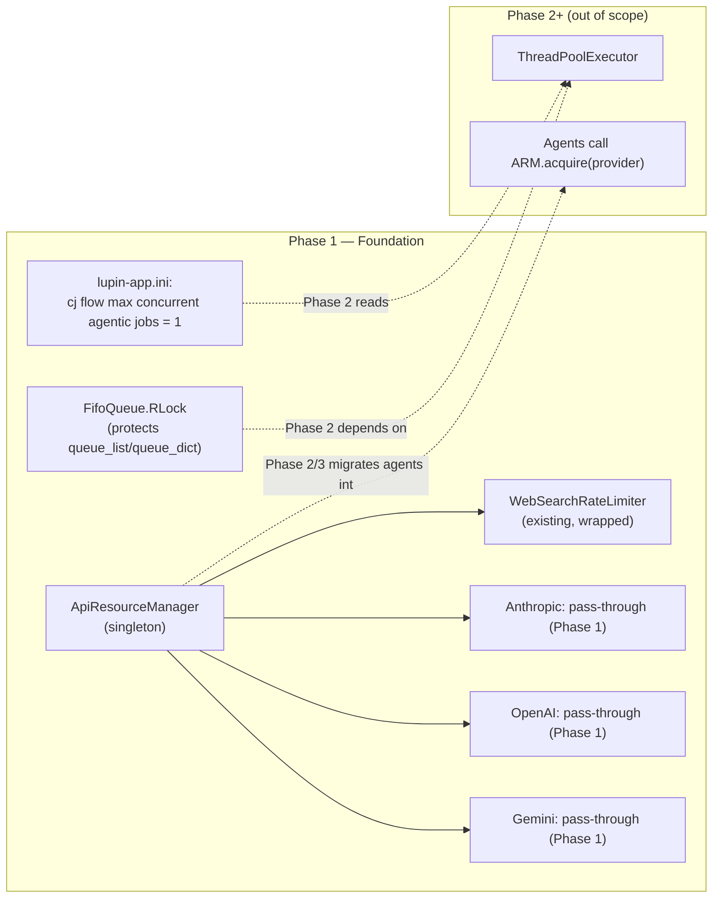

# Approach C — Phase 1: Thread-Safe Foundation + API Resource Manager Stub

**Status**: DESIGN (implementation not started)
**Branch**: `wip-v0.1.7-2026.04.22-spit-and-polish-for-cjflow-tfe-and-bfe`
**Paired execution log**: `90-phase-1-execution-log.md`
**Supersedes**: `src/rnd/v0.1.5/2026.02.19-approach-c-hybrid-queue-architecture.md` (Phase 1 section)
**Decisions driving this phase**: `~/.claude/plans/let-s-start-a-new-stateless-swing.md` (Q1–Q7 captured 2026-04-23)

---

## Context

Phase 1 lays the groundwork for the async multi-lane CJ Flow migration. No dispatcher, no thread pool, no new behaviour — just the three prerequisites that Phase 2 depends on:

1. **`FifoQueue` gains a `threading.RLock`** so pool callback threads can safely mutate queue state alongside the dispatcher thread.
2. **One new INI key** (`cj flow max concurrent agentic jobs`) so Phase 2 can read its worker count from config without a second config-plumbing pass.
3. **`ApiResourceManager` singleton stub** so Phase 2+ agents have a centralized surface for rate-limit / contention strategy (per Q3 decision).

At the end of Phase 1, the server must run **byte-identical in behaviour** to today — RLock is invisible at runtime, the INI key is unread, and `ApiResourceManager` is a thin wrapper that delegates to existing per-agent logic. The phase is ship-safe even if Phase 2 never lands.

---

## Scope

### In scope

- `src/cosa/rest/fifo_queue.py` — add `self._lock = threading.RLock()` in `__init__`, wrap all mutator / reader methods with `with self._lock:`.
- `src/conf/lupin-app.ini` — add `cj flow max concurrent agentic jobs = 1` under the existing CJ Flow section.
- `src/conf/lupin-app-splainer.ini` — add matching splainer entry.
- `src/cosa/utils/api_resource_manager.py` — **NEW** singleton module. Initial implementation: wraps `WebSearchRateLimiter` (from `src/cosa/agents/deep_research/rate_limiter.py`) as the primary rate-limited provider. Other providers (OpenAI, Gemini) are registered as pass-through for Phase 1.
- `src/tests/unit/test_fifo_queue_thread_safety.py` — **NEW** concurrency unit tests.
- `src/tests/unit/test_api_resource_manager.py` — **NEW** singleton-behavior unit tests.

### Out of scope (explicit)

- Agent call-site migration from per-agent rate limiter → `ApiResourceManager`. The stub EXISTS in Phase 1 but agents don't call it yet. Migration is a Phase 2/3 follow-up; this way Phase 1 lands as pure infra with zero runtime-behaviour change.
- Any changes to `running_fifo_queue.py` (Phase 2).
- Any endpoint work (Phase 2/3).
- `ApiResourceManager` state surfaced via `/api/queue/pool-status` (Phase 3).

---

## Architecture



---

## Step 1.1 — Add `threading.RLock` to `FifoQueue`

**File**: `src/cosa/rest/fifo_queue.py`

**Changes**:
1. Add `import threading` to imports (grouped with stdlib).
2. In `__init__`, after existing attributes: `self._lock = threading.RLock()` (keep vertical alignment).
3. Wrap these 11 methods with `with self._lock:` guarding the body:
   - `push()`, `pop()`, `head()`, `get_by_id_hash()`, `delete_by_id_hash()`
   - `is_empty()`, `size()`, `has_changed()`, `clear()`
   - `get_jobs_for_user()`, `get_all_jobs()`

**RLock vs Lock justification** (keep this as a comment in the code):
- `pop()` internally calls `is_empty()` — with a plain `Lock` this deadlocks.
- `delete_by_id_hash()` internally calls `size()` — same issue.
- RLock allows the same thread to re-acquire, so nested self-calls are safe.

**Verification**: Post-edit, run `python -c "import py_compile; py_compile.compile( 'src/cosa/rest/fifo_queue.py', doraise=True )"` (project mandate).

---

## Step 1.2 — Add INI config key

**Files**: `src/conf/lupin-app.ini`, `src/conf/lupin-app-splainer.ini`

**`lupin-app.ini`** (add under the existing `# CJ Flow Configuration` block):

```ini
cj flow max concurrent agentic jobs = 1
```

Default `= 1` (Q2 decision) — reproduces today's serial behaviour. Dev environments override to `= 3`.

**`lupin-app-splainer.ini`** (matching entry):

```ini
cj flow max concurrent agentic jobs = Maximum number of agentic jobs (Deep Research, Podcast, Presentation, BFE, TFE, etc.) that can run concurrently in the Phase 2 agentic pool. `= 1` reproduces today's fully-serial behaviour (ship-safe default). Values above 1 are bounded by Anthropic API rate-limit quota and by `ApiResourceManager` contention strategy. Bump in dev first; bump in prod only after observing under load.
```

**Verification**: `python -c "from cosa.app.configuration_manager import ConfigurationManager; cm = ConfigurationManager('gib-app.ini'); print( cm.get( 'cj flow max concurrent agentic jobs', default=1, return_type='int' ) )"` (or equivalent through Lupin's loader) should return `1` with no `KeyError`.

---

## Step 1.3 — `ApiResourceManager` singleton (stub)

**File**: `src/cosa/utils/api_resource_manager.py` (**NEW**)

### Purpose

Centralize *rate-limit / API contention / wait-state* decisions into one object. Phase 1 is a stub; Phase 2+ migrates callers and adds per-provider tracking.

### Public interface (Phase 1 only)

```python
class ApiResourceManager:
    """
    Singleton managing contention decisions across external APIs.

    Phase 1 scope (this doc): thin wrapper around existing per-agent rate
    limiters. Primary backing: WebSearchRateLimiter for Anthropic web-search.
    Other providers: pass-through (no limit enforced beyond what the SDK
    itself does) until their per-agent logic migrates here.

    Future scope (Phase 2+): per-provider sliding-window call history,
    cost estimation, dispatcher back-pressure.
    """

    _instance = None  # class-level singleton handle

    @classmethod
    def get_instance( cls ) -> "ApiResourceManager":
        """Return the process-wide singleton, instantiating on first call."""
        if cls._instance is None:
            cls._instance = cls()
        return cls._instance

    def __init__( self ):
        # Protect _instance construction under concurrent first-callers
        self._lock                = threading.RLock()
        self._web_search_limiter  = None  # lazily wraps WebSearchRateLimiter

    async def acquire( self, provider: str, tokens: int = 0 ) -> None:
        """
        Wait until it is safe to call `provider` (possibly zero wait).

        provider: one of "anthropic", "anthropic_web_search", "openai",
                  "gemini". Unknown providers pass through with no wait.
        tokens:   estimated token cost (only consulted for
                  anthropic_web_search in Phase 1).

        Phase 1 behaviour:
            - "anthropic_web_search": delegates to WebSearchRateLimiter's
              proactive wait logic.
            - everything else: returns immediately.
        """
        ...

    def record_call( self, provider: str, tokens: int = 0, latency_ms: float = 0.0 ) -> None:
        """Log a completed call against the provider's rolling history.

        Phase 1: only WebSearchRateLimiter records; others no-op.
        Phase 2+: all providers maintain a deque of recent calls.
        """
        ...

    def get_status( self ) -> dict:
        """Return a dict snapshot suitable for /api/queue/pool-status.

        Phase 1 payload:
            {
                "anthropic_web_search": <WebSearchRateLimiter.get_status() or {}>,
                "anthropic":            { "provider_wait_state": "passthrough" },
                "openai":               { "provider_wait_state": "passthrough" },
                "gemini":               { "provider_wait_state": "passthrough" }
            }
        """
        ...
```

### Thread-safety

Singleton construction + `_web_search_limiter` lazy init are guarded by `self._lock` (`threading.RLock`). Method bodies that delegate to `WebSearchRateLimiter` rely on its existing internal locking.

### Design notes

- **No behaviour change in Phase 1**. Agents do not call `ApiResourceManager` yet. Its public methods exist so Phase 2 can migrate callers without another round of API-shape debate.
- **Open sub-question** (for Phase 2 impl): does `acquire()` stay async (current `WebSearchRateLimiter` convention) or expose a sync variant for non-async call sites? Lean: keep async, let sync callers use `asyncio.run_coroutine_threadsafe`.
- **Provider enum later**: Phase 1 accepts strings to avoid a churn-inducing enum rename across agents. Phase 2 can introduce `class Provider(str, Enum)` if the set stabilizes.

### What stays where (Phase 1 → future)

| Existing code | Phase 1 | Phase 2+ |
|---|---|---|
| `src/cosa/agents/deep_research/rate_limiter.py::WebSearchRateLimiter` (~468 LOC) | **Wrapped by** `ApiResourceManager` | Eventually **absorbed** (logic moves into singleton; module becomes `from api_resource_manager import WebSearchRateLimiter` re-export) |
| `src/cosa/agents/podcast_generator/api_client.py::_call_with_retry()` | Unchanged | Migrated to call `ApiResourceManager.acquire()` before request + `.record_call()` after |
| `src/cosa/agents/deep_research/api_client.py::_call_with_retry()` | Unchanged | Same migration |
| `src/cosa/agents/llm_exceptions.py::LlmRateLimitError` | Unchanged | Used by `ApiResourceManager` for structured retry decisions |

---

## Step 1.4 — Unit tests

### `src/tests/unit/test_fifo_queue_thread_safety.py` (**NEW**)

| Test | What it proves |
|---|---|
| `test_concurrent_push_no_corruption` | 10 threads × 100 pushes → `queue.size() == 1000`, no duplicate id_hash, no exception |
| `test_concurrent_push_pop_consistency` | 5 pushers + 5 poppers for 2s → no exceptions, final size equals pushes − pops |
| `test_concurrent_read_during_write` | Readers calling `size()` + `get_all_jobs()` while writers mutate → no stale-iterator / dict-mutated-during-iteration errors |
| `test_delete_by_id_hash_under_concurrency` | Delete specific keys while other threads push → deletion succeeds or returns False, never raises |
| `test_rlock_reentrant_pop` | Prove `pop()` → `is_empty()` doesn't deadlock (regression test for RLock choice) |

### `src/tests/unit/test_api_resource_manager.py` (**NEW**)

| Test | What it proves |
|---|---|
| `test_singleton_returns_same_instance` | Two `get_instance()` calls return identical object |
| `test_singleton_thread_safe_construction` | 50 threads racing `get_instance()` on fresh manager → one and only one instance created |
| `test_acquire_passthrough_provider_returns_immediately` | `await acquire("openai")` elapses <10ms |
| `test_acquire_web_search_delegates_to_rate_limiter` | With a mocked `WebSearchRateLimiter`, `acquire("anthropic_web_search", tokens=5000)` invokes the underlying wait method once |
| `test_record_call_passthrough_is_noop` | `record_call("openai", ...)` doesn't raise, doesn't mutate any state |
| `test_get_status_shape` | Returned dict has all 4 provider keys and web-search key has the expected nested structure |

Tests use `tempfile.TemporaryDirectory()` isolation where storage is involved, per project convention.

---

## Critical files touched

| File | Touch type | Est. LOC change |
|---|---|---|
| `src/cosa/rest/fifo_queue.py` | Modify | ~30 (import + init + 11 method wrappings) |
| `src/conf/lupin-app.ini` | Modify | +1 |
| `src/conf/lupin-app-splainer.ini` | Modify | +1 |
| `src/cosa/utils/api_resource_manager.py` | **New** | ~120 |
| `src/tests/unit/test_fifo_queue_thread_safety.py` | **New** | ~150 |
| `src/tests/unit/test_api_resource_manager.py` | **New** | ~100 |

Total: **~400 LOC, 3 new files, 3 modified files**.

---

## Verification (all four automated layers)

Phase 1 is pure infra + tests. No new endpoint, no WebSocket event, no UI.

| Layer | Command | Expected |
|---|---|---|
| **py_compile** | `python -c "import py_compile; py_compile.compile( 'src/cosa/rest/fifo_queue.py', doraise=True )"` | No errors (project mandate after every `.py` edit) |
| **Import chain** | `PYTHONPATH=src python -c "from cosa.rest.fifo_queue import FifoQueue; from cosa.utils.api_resource_manager import ApiResourceManager; print('OK')"` | Prints `OK` |
| **New unit tests** | `pytest src/tests/unit/test_fifo_queue_thread_safety.py src/tests/unit/test_api_resource_manager.py -v` | All pass |
| **Full unit regression** | `pytest src/tests/unit/ -v` | 915-test baseline + new tests; all green |
| **Smoke** | `/smoke-test-remediation` with `FULL` scope | No regressions against baseline |
| **WebSocket smoke** | `./src/scripts/run-websocket-smoke-tests.sh` | 50/50 pass |
| **E2E UI** (`--bg` MANDATORY) | `./src/scripts/run-e2e-ui-tests.sh --bg -v` | 285/285 pass |
| **Integration (final gate)** (`--bg` MANDATORY) | `./src/tests/run-integration-tests.sh --bg -v` | 43/43 pass |

**Test scheduling note**: any `:8000` live runs need explicit user approval. Unit + smoke + WS + E2E + integration against the dev `:7999` server run on-demand per user request.

**Manual E2E**: not required for Phase 1 (no behaviour change).

---

## Rollback

Phase 1 is trivially reversible:
- Revert the commit → RLock, INI key, singleton module all vanish.
- No data migration, no config compatibility concerns.
- Since no agent calls `ApiResourceManager` in Phase 1, removing the singleton doesn't orphan callers.

---

## Open sub-questions carried into impl session

1. **`ApiResourceManager` location**: `src/cosa/utils/` (per above) vs `src/cosa/rest/` vs new `src/cosa/platform/`? `utils/` is the default because the singleton has no REST dependency. Re-confirm during impl.
2. **`WebSearchRateLimiter` import cost**: it lives under `cosa.agents.deep_research.rate_limiter` — importing it from `cosa.utils.api_resource_manager` creates a utils→agents dependency. Lean: lazy-import inside the method, not at module top, to avoid startup-time coupling.
3. **Config key naming**: `cj flow max concurrent agentic jobs` was established by the anchor doc. Confirm no better fit (e.g. `cj flow agentic pool size`) during impl; if renamed, update splainer in the same commit.

---

## What this phase does NOT deliver

- ❌ No concurrent execution — still serial.
- ❌ No `ThreadPoolExecutor`.
- ❌ No `/api/queue/pool-status` endpoint.
- ❌ No agent-side callers of `ApiResourceManager`.
- ❌ No UI changes.

Those all arrive in Phase 2 and Phase 3.
