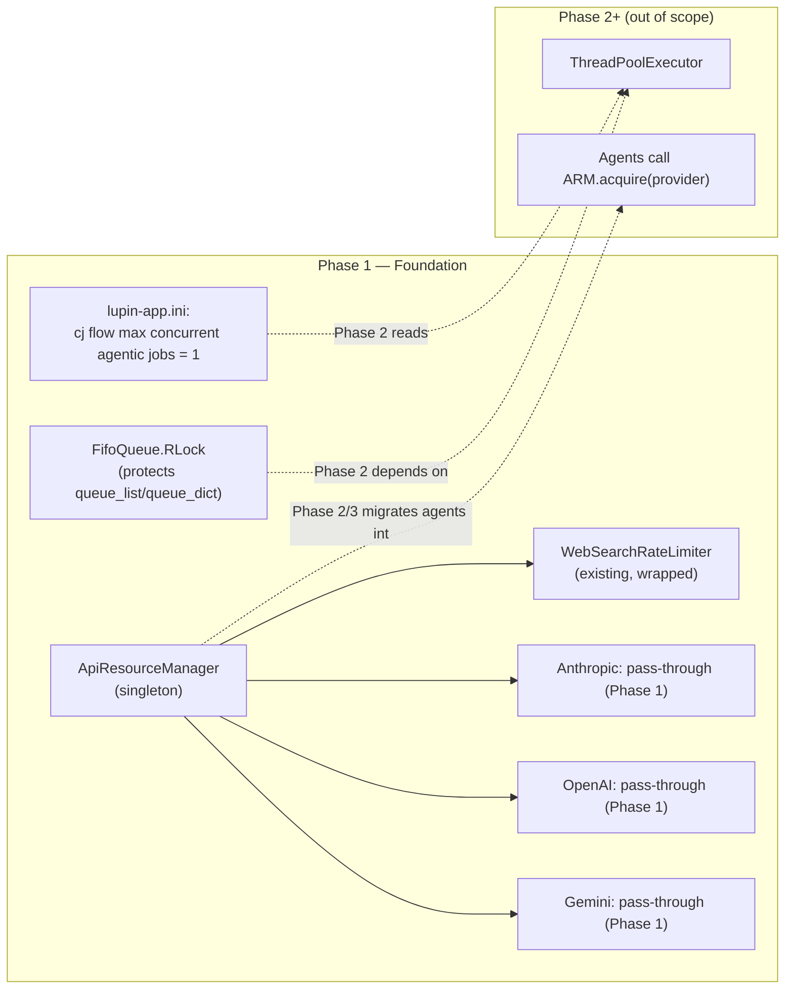

# Approach C — Phase 1: Thread-Safe Foundation + API Resource Manager Stub

**Status**: DESIGN (implementation not started)
**Branch**: `wip-v0.1.7-2026.04.22-spit-and-polish-for-cjflow-tfe-and-bfe`
**Paired execution log**: `90-phase-1-execution-log.md`
**Supersedes**: `src/rnd/v0.1.5/2026.02.19-approach-c-hybrid-queue-architecture.md` (Phase 1 section)
**Decisions driving this phase**: `~/.claude/plans/let-s-start-a-new-stateless-swing.md` (Q1–Q7 captured 2026-04-23)

---

## Context

Phase 1 lays the groundwork for the async multi-lane CJ Flow migration. No dispatcher, no thread pool, no new behaviour — just the three prerequisites that Phase 2 depends on:

1. **`FifoQueue` gains a `threading.RLock`** so pool callback threads can safely mutate queue state alongside the dispatcher thread.
2. **One new INI key** (`cj flow max concurrent agentic jobs`) so Phase 2 can read its worker count from config without a second config-plumbing pass.
3. **`ApiResourceManager` singleton stub** so Phase 2+ agents have a centralized surface for rate-limit / contention strategy (per Q3 decision). Phase 1 also wires the `init_arm()` call into server startup so the singleton is alive from server boot — even though no agent calls it yet.

At the end of Phase 1, the server must run **byte-identical in behaviour** to today — RLock is invisible at runtime, the INI key is read at startup (to seed `_pool_max_workers` in Phase 2) but its value (`= 1`) preserves serial behaviour, and `ApiResourceManager` is a thin wrapper that delegates to existing per-agent logic but has no callers yet. The phase is ship-safe even if Phase 2 never lands.

---

## Scope

### In scope

- `src/cosa/rest/fifo_queue.py` — add `self._lock = threading.RLock()` in `__init__`, wrap all mutator / reader methods with `with self._lock:`.
- `src/conf/lupin-app.ini` — add `cj flow max concurrent agentic jobs = 1` under the existing CJ Flow section.
- `src/conf/lupin-app-splainer.ini` — add matching splainer entry.
- `src/cosa/utils/api_resource_manager.py` — **NEW** singleton module using the **module-level pattern** (mirrors `src/cosa/rest/test_suite_completion_watchdog.py:327-354`). Initial implementation: wraps `WebSearchRateLimiter` (from `src/cosa/agents/deep_research/rate_limiter.py`) as the primary rate-limited provider. Other providers (OpenAI, Gemini) are registered as pass-through for Phase 1.
- `src/fastapi_app/main.py` — add `init_arm()` call to startup hook so the singleton is alive from server boot. No agents CALL it yet (Phase 3 migration), but the infrastructure exists.
- `src/tests/unit/test_fifo_queue_thread_safety.py` — **NEW** concurrency unit tests.
- `src/tests/unit/test_api_resource_manager.py` — **NEW** singleton-behavior unit tests.

### Out of scope (explicit)

- Agent call-site migration from per-agent rate limiter → `ApiResourceManager`. The stub EXISTS in Phase 1 but agents don't call it yet. Migration is a Phase 2/3 follow-up; this way Phase 1 lands as pure infra with zero runtime-behaviour change.
- Any changes to `running_fifo_queue.py` (Phase 2).
- Any endpoint work (Phase 2/3).
- `ApiResourceManager` state surfaced via `/api/queue/pool-status` (Phase 3).

---

## Architecture



---

## Step 1.1 — Add `threading.RLock` to `FifoQueue`

**File**: `src/cosa/rest/fifo_queue.py`

**Changes**:
1. Add `import threading` to imports (grouped with stdlib).
2. In `__init__`, after existing attributes: `self._lock = threading.RLock()` (keep vertical alignment).
3. Wrap these 11 methods with `with self._lock:` guarding the body:
   - `push()`, `pop()`, `head()`, `get_by_id_hash()`, `delete_by_id_hash()`
   - `is_empty()`, `size()`, `has_changed()`, `clear()`
   - `get_jobs_for_user()`, `get_all_jobs()`

**RLock vs Lock justification** (keep this as a comment in the code):
- `pop()` internally calls `is_empty()` — with a plain `Lock` this deadlocks.
- `delete_by_id_hash()` internally calls `size()` — same issue.
- RLock allows the same thread to re-acquire, so nested self-calls are safe.

**Verification**: Post-edit, run `python -c "import py_compile; py_compile.compile( 'src/cosa/rest/fifo_queue.py', doraise=True )"` (project mandate).

---

## Step 1.2 — Add INI config key

**Files**: `src/conf/lupin-app.ini`, `src/conf/lupin-app-splainer.ini`

**`lupin-app.ini`** (add under the existing `# CJ Flow Configuration` block):

```ini
cj flow max concurrent agentic jobs = 1
```

Default `= 1` (Q2 decision) — reproduces today's serial behaviour. Dev environments override to `= 3` via the mechanism below.

**Dev override mechanism (decided 2026-04-23 fitness review)**: use a `[Lupin: Dev Overrides]` block in `lupin-app.ini` that is read ONLY when environment variable `LUPIN_ENV=dev` is set. The block shadows the baseline for dev boxes without cluttering prod config. If an existing equivalent mechanism is found in `ConfigurationManager` (e.g. an env-driven overlay file), use that; otherwise introduce the `[Lupin: Dev Overrides]` section and document it in `lupin-app-splainer.ini`.

Example (dev):
```ini
[Lupin: Dev Overrides]
# Active when LUPIN_ENV=dev
cj flow max concurrent agentic jobs = 3
```

**`lupin-app-splainer.ini`** (matching entry):

```ini
cj flow max concurrent agentic jobs = Maximum number of agentic jobs (Deep Research, Podcast, Presentation, BFE, TFE, etc.) that can run concurrently in the Phase 2 agentic pool. `= 1` reproduces today's fully-serial behaviour (ship-safe default). Values above 1 are bounded by Anthropic API rate-limit quota and by `ApiResourceManager` contention strategy. Bump in dev first; bump in prod only after observing under load.
```

**Verification**: `python -c "from cosa.app.configuration_manager import ConfigurationManager; cm = ConfigurationManager('gib-app.ini'); print( cm.get( 'cj flow max concurrent agentic jobs', default=1, return_type='int' ) )"` (or equivalent through Lupin's loader) should return `1` with no `KeyError`.

---

## Step 1.3 — `ApiResourceManager` singleton (stub)

**File**: `src/cosa/utils/api_resource_manager.py` (**NEW**)

### Purpose

Centralize *rate-limit / API contention / wait-state* decisions into one object. Phase 1 is a stub; Phase 2+ migrates callers and adds per-provider tracking.

### Public interface (Phase 1 only)

**Pattern**: module-level singleton, matching the existing precedent at `src/cosa/rest/test_suite_completion_watchdog.py:327-354`. No class-method singleton, no internal construction lock — `init_arm()` is called once at startup (single-threaded phase), so no construction race exists.

```python
# src/cosa/utils/api_resource_manager.py

from typing import Optional

# Module-level singleton handle
_arm_instance: Optional["ApiResourceManager"] = None


def init_arm() -> "ApiResourceManager":
    """Initialize the process-wide singleton. Call once at server startup.

    Idempotent: subsequent calls return the existing instance.
    """
    global _arm_instance
    if _arm_instance is None:
        _arm_instance = ApiResourceManager()
    return _arm_instance


def get_arm() -> "ApiResourceManager":
    """Return the singleton instance. Raises RuntimeError if init_arm() has not run."""
    if _arm_instance is None:
        raise RuntimeError( "ApiResourceManager not initialised. Call init_arm() at startup." )
    return _arm_instance


class ApiResourceManager:
    """
    Singleton managing contention decisions across external APIs.

    Phase 1 scope: thin wrapper around existing per-agent rate limiters.
    Primary backing: WebSearchRateLimiter for Anthropic web-search.
    Other providers: pass-through (no limit enforced beyond what the SDK
    itself does) until their per-agent logic migrates here.

    Future scope (Phase 2+): per-provider sliding-window call history,
    cost estimation, dispatcher back-pressure.
    """

    def __init__( self ):
        # Lazy-imported inside acquire() / record_call() to avoid
        # utils -> agents import cycle at module load time.
        self._web_search_limiter  = None

    async def acquire( self, provider: str ) -> None:
        """
        Wait until it is safe to call `provider` (possibly zero wait).

        provider: one of "anthropic", "anthropic_web_search", "openai",
                  "gemini". Unknown providers pass through with no wait.

        Phase 1 behaviour:
            - "anthropic_web_search": delegates to WebSearchRateLimiter.wait_if_needed()
              (which is itself reactive — tracks its own sliding window internally;
              no pre-flight token estimate is needed or supported).
            - everything else: returns immediately.
        """
        ...

    def record_call( self, provider: str, tokens: int = 0, latency_ms: float = 0.0 ) -> None:
        """Log a completed call against the provider's rolling history.

        Phase 1: only WebSearchRateLimiter records (via its record_usage(tokens)); others no-op.
        Phase 2+: all providers maintain a deque of recent calls.
        """
        ...

    def get_status( self ) -> dict:
        """Return a dict snapshot suitable for /api/queue/pool-status.

        Phase 1 payload — passes WebSearchRateLimiter.get_status() through
        VERBATIM rather than renaming keys (avoids divergent dict shapes
        between ARM and the underlying limiter):

            {
                "anthropic_web_search": {
                    # Exact passthrough of WebSearchRateLimiter.get_status():
                    "tokens_in_window":           int,
                    "tokens_per_minute_limit":    int,
                    "calls_in_window":            int,
                    "window_seconds":             float,
                    "time_until_oldest_expires":  Optional[float],
                    "would_need_delay":           bool,
                },
                "anthropic": { "provider_wait_state": "passthrough" },
                "openai":    { "provider_wait_state": "passthrough" },
                "gemini":    { "provider_wait_state": "passthrough" }
            }
        """
        ...
```

### Thread-safety

- Singleton construction is serialised by calling `init_arm()` during single-threaded server startup — no construction race, no lock needed.
- `_web_search_limiter` lazy assignment in `acquire()`/`record_call()` is a single pointer assignment — under CPython GIL this is atomic; double-init produces two `WebSearchRateLimiter` instances briefly, one is discarded. Acceptable; tests verify a stable instance after the first call.
- Method bodies that delegate to `WebSearchRateLimiter` rely on its existing internal `threading.Lock()` (see `src/cosa/agents/deep_research/rate_limiter.py:104`).

### Design notes

- **No behaviour change in Phase 1**. Agents do not call `ApiResourceManager` yet. `init_arm()` wires it into startup; callers migrate in Phase 3.
- **acquire() is async, record_call() is sync** — decided 2026-04-23 fitness review. Matches underlying `WebSearchRateLimiter` conventions (`wait_if_needed()` async, `record_usage()` sync). No sync variant of `acquire()` is needed because all anticipated callers (`_call_with_retry` paths in deep_research, podcast, presentation, future BFE/TFE/ClaudeCode migrations) are already async. If a sync caller ever emerges, the idiom is `asyncio.run_coroutine_threadsafe(arm.acquire("provider"), loop)`.
- **`acquire()` takes no `tokens` arg** — decided 2026-04-23 fitness review. `WebSearchRateLimiter.wait_if_needed()` is reactive (checks its own sliding window); there is no pre-flight token budget check to pass a token estimate into. If a future provider's limiter supports predictive token accounting, a Phase-2+ API extension can add it.
- **Provider enum later**: Phase 1 accepts strings to avoid a churn-inducing enum rename across agents. Phase 2 can introduce `class Provider(str, Enum)` if the set stabilizes.

### What stays where (Phase 1 → future)

| Existing code | Phase 1 | Phase 2+ |
|---|---|---|
| `src/cosa/agents/deep_research/rate_limiter.py::WebSearchRateLimiter` (~468 LOC) | **Wrapped by** `ApiResourceManager` | Eventually **absorbed** (logic moves into singleton; module becomes `from api_resource_manager import WebSearchRateLimiter` re-export) |
| `src/cosa/agents/podcast_generator/api_client.py::_call_with_retry()` | Unchanged | Migrated to call `ApiResourceManager.acquire()` before request + `.record_call()` after |
| `src/cosa/agents/deep_research/api_client.py::_call_with_retry()` | Unchanged | Same migration |
| `src/cosa/agents/llm_exceptions.py::LlmRateLimitError` | Unchanged | Used by `ApiResourceManager` for structured retry decisions |

---

## Step 1.4 — Unit tests

### `src/tests/unit/test_fifo_queue_thread_safety.py` (**NEW**)

| Test | What it proves |
|---|---|
| `test_concurrent_push_no_corruption` | 10 threads × 100 pushes → `queue.size() == 1000`, no duplicate id_hash, no exception |
| `test_concurrent_push_pop_consistency` | 5 pushers + 5 poppers for 2s → no exceptions, final size equals pushes − pops |
| `test_concurrent_read_during_write` | Readers calling `size()` + `get_all_jobs()` while writers mutate → no stale-iterator / dict-mutated-during-iteration errors |
| `test_delete_by_id_hash_under_concurrency` | Delete specific keys while other threads push → deletion succeeds or returns False, never raises |
| `test_rlock_reentrant_pop` | Prove `pop()` → `is_empty()` doesn't deadlock (regression test for RLock choice) |
| `test_phase2_shaped_stress` | **Phase-2-shaped access pattern**: 1 dispatcher thread pushing + 4 callback-shaped threads doing random mix of `delete_by_id_hash` / `size` / `get_all_jobs` / `push` for 5 seconds, with a 10-second watchdog that aborts the test on deadlock. Asserts: (1) no deadlock (watchdog does not fire); (2) `len(queue._queue_list) == len(queue._queue_dict)` at end; (3) `set(item.id_hash for item in queue._queue_list) == set(queue._queue_dict.keys())` (list and dict agree on which jobs are present). This catches RLock-placement bugs that only surface at Phase 2 concurrency. |

### `src/tests/unit/test_api_resource_manager.py` (**NEW**)

| Test | What it proves |
|---|---|
| `test_get_arm_raises_before_init` | `get_arm()` raises `RuntimeError` when `init_arm()` has not been called |
| `test_init_arm_is_idempotent` | Two `init_arm()` calls return the same instance; second call does not create a new one |
| `test_get_arm_returns_singleton` | After `init_arm()`, two `get_arm()` calls return identical object |
| `test_acquire_passthrough_provider_returns_immediately` | `await arm.acquire("openai")` elapses <10ms |
| `test_acquire_web_search_delegates_to_rate_limiter` | With a mocked `WebSearchRateLimiter`, `await arm.acquire("anthropic_web_search")` invokes `wait_if_needed()` once |
| `test_acquire_no_tokens_arg` | `acquire()` signature accepts only `provider` (regression test for the fitness-review decision) |
| `test_record_call_passthrough_is_noop` | `record_call("openai", ...)` doesn't raise, doesn't mutate any state |
| `test_record_call_web_search_delegates` | With a mocked `WebSearchRateLimiter`, `record_call("anthropic_web_search", tokens=N)` invokes `record_usage(tokens=N)` once |
| `test_get_status_shape` | Returned dict has all 4 provider keys; `anthropic_web_search` section is a **verbatim passthrough** of `WebSearchRateLimiter.get_status()` (keys: `tokens_in_window`, `tokens_per_minute_limit`, `calls_in_window`, `window_seconds`, `time_until_oldest_expires`, `would_need_delay`); passthrough providers have key `provider_wait_state == "passthrough"` |

Tests use `tempfile.TemporaryDirectory()` isolation where storage is involved, per project convention.

---

## Critical files touched

| File | Touch type | Est. LOC change |
|---|---|---|
| `src/cosa/rest/fifo_queue.py` | Modify | ~30 (import + init + 11 method wrappings) |
| `src/conf/lupin-app.ini` | Modify | +1 (`cj flow max concurrent agentic jobs = 1`) + possibly +3 (new `[Lupin: Dev Overrides]` block if none exists) |
| `src/conf/lupin-app-splainer.ini` | Modify | +1 (plus dev-override splainer if new block added) |
| `src/cosa/utils/api_resource_manager.py` | **New** | ~120 |
| `src/fastapi_app/main.py` | Modify | +3 (import + `init_arm()` call in startup hook) |
| `src/tests/unit/test_fifo_queue_thread_safety.py` | **New** | ~180 (includes the new phase2-shaped stress test) |
| `src/tests/unit/test_api_resource_manager.py` | **New** | ~140 (9 tests per revised Step 1.4) |

Total: **~475 LOC, 3 new files, 4 modified files**.

---

## Verification (all four automated layers)

Phase 1 is pure infra + tests. No new endpoint, no WebSocket event, no UI.

> **Executor contract**: every step in this section is `EXECUTOR: AI` — the AI executes itself, captures output, and reports results. No step in this phase is `EXECUTOR: HUMAN`. See `00-working-contract.md` for the full mandate and §TESTING VENUES for venue routing.

#### A. `:7999` (AI-discretionary — AI runs without asking)

| Layer | Command | Expected |
|---|---|---|
| **py_compile** | `python -c "import py_compile; py_compile.compile( 'src/cosa/rest/fifo_queue.py', doraise=True )"` | Exit code 0; no stderr (project mandate after every `.py` edit) |
| **Import chain** | `PYTHONPATH=src python -c "from cosa.rest.fifo_queue import FifoQueue; from cosa.utils.api_resource_manager import ApiResourceManager; print('OK')"` | Prints `OK`, exit code 0 |
| **New unit tests** | `pytest src/tests/unit/test_fifo_queue_thread_safety.py src/tests/unit/test_api_resource_manager.py -v` | All pass |
| **Full unit regression** | `pytest src/tests/unit/ -v` | 915-test baseline + new tests; all green |
| **Non-destructive smoke** | `/smoke-test-remediation SELECTIVE` with a tests-list that excludes any `:8000`-routed suites (e.g. `test_proxy_integration.py`) — see sub-table B | No regressions against baseline |
| **WebSocket smoke** | `./src/scripts/run-websocket-smoke-tests.sh` | 50/50 pass |

#### B. `:8000` (scheduled monopolize-mode — AI submits via `/api/test-suite/submit` after user slot-check)

The `--bg` commands below are the **local-foreground fallback**, not the primary path from Claude Code. The primary path is `POST /api/test-suite/submit` with a user-confirmed `scheduled_at`.

| Layer | Submission | Expected |
|---|---|---|
| **Destructive smoke** (if any newly added in Phase 1 — none expected) | `POST /api/test-suite/submit {"test_types": "smoke", "scheduled_at": "..."}` | 100% pass |
| **E2E UI** | `POST /api/test-suite/submit {"test_types": "e2e_ui", "scheduled_at": "..."}` — local fallback: `./src/scripts/run-e2e-ui-tests.sh --bg -v` | 285/285 pass |
| **Integration (final gate)** | `POST /api/test-suite/submit {"test_types": "integration", "scheduled_at": "..."}` — local fallback: `./src/tests/run-integration-tests.sh --bg -v` | 43/43 pass |

**Test scheduling note**: any `:8000` submissions require a fresh user slot-check (monopolize-mode coordination, not budget approval) — submit via `POST /api/test-suite/submit` with a user-confirmed `scheduled_at` that does not overlap other scheduled runs. See `00-working-contract.md` and project CLAUDE.md §TESTING VENUES. Unit + py_compile + import-chain + WS smoke + non-destructive smoke against `:7999` are AI-discretionary and run without ask.

**Protocol E2E**: not required for Phase 1 (no behaviour change). If Phase 1 did require one, it would be `EXECUTOR: AI` by default.

---

## Rollback

Phase 1 is trivially reversible:
- Revert the commit → RLock, INI key, singleton module all vanish.
- No data migration, no config compatibility concerns.
- Since no agent calls `ApiResourceManager` in Phase 1, removing the singleton doesn't orphan callers.

---

## Pre-resolved design decisions (2026-04-23 fitness review)

1. **`ApiResourceManager` location**: **`src/cosa/utils/api_resource_manager.py`** — `WebSearchRateLimiter` lives at the agent-specific location; its wrapper belongs at the shared-utility location next to `util.py`. `rest/` implies FastAPI coupling (which ARM does not have); a new `platform/` dir is over-engineered for one module.
2. **`WebSearchRateLimiter` import**: **lazy-imported inside the method** (not at module top) to avoid a `utils → agents` dependency cycle at server-startup import time. Pattern already noted in the Step 1.3 code.
3. **Config key naming**: **`cj flow max concurrent agentic jobs`** — keep as established. No rename. The descriptive form is worth the length; alternative short forms (`cj flow agentic pool size`) would save typing but confuse readers unfamiliar with pool-size conventions.
4. **Singleton pattern**: **module-level** (`_arm_instance`, `init_arm()`, `get_arm()`) — mirrors `src/cosa/rest/test_suite_completion_watchdog.py:327-354`. Rejected: class-method `get_instance()` with internal RLock (adds ceremony for no benefit; startup is single-threaded).
5. **`acquire()` signature**: **async, no `tokens` arg**. `record_call()` stays sync. Matches underlying `WebSearchRateLimiter` convention.
6. **`get_status()` payload**: **verbatim passthrough** of `WebSearchRateLimiter.get_status()` under the `anthropic_web_search` key. No key renaming.
7. **Dev override mechanism**: **`[Lupin: Dev Overrides]` INI block**, active when `LUPIN_ENV=dev` — see Step 1.2.

---

## What this phase does NOT deliver

- ❌ No concurrent execution — still serial.
- ❌ No `ThreadPoolExecutor`.
- ❌ No `/api/queue/pool-status` endpoint.
- ❌ No agent-side callers of `ApiResourceManager`.
- ❌ No UI changes.

Those all arrive in Phase 2 and Phase 3.
