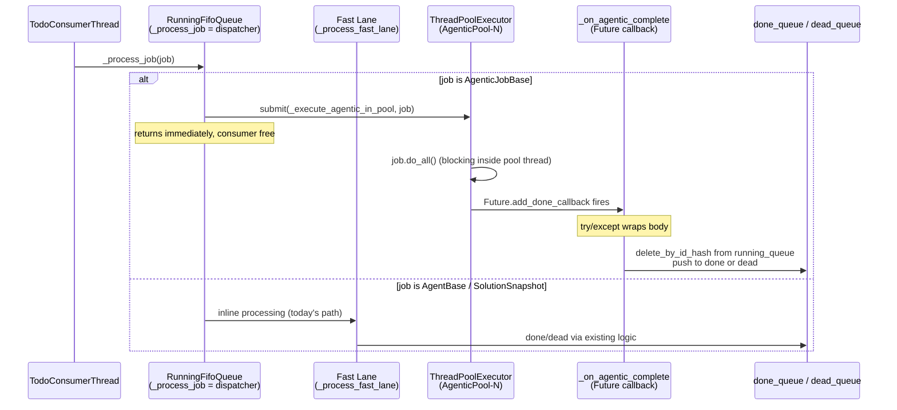

# Approach C — Phase 2: Dispatcher Refactor + Agentic Pool + Pool-Status Endpoint

**Status**: DESIGN (implementation not started)
**Branch**: `wip-v0.1.7-2026.04.22-spit-and-polish-for-cjflow-tfe-and-bfe`
**Paired execution log**: `91-phase-2-execution-log.md`
**Depends on**: Phase 1 (`01-phase-1-rlock-config-and-resource-manager.md`) landed and green
**Decisions driving this phase**: Q1 (2-lane), Q2 (`= 1` prod / `= 3` dev), Q4 (defensive callback), Q5 (pool-status in Phase 2), Q6 (single pool)

---

## Context

Phase 2 is the **core behavioural change**. After Phase 2 lands and runs with `cj flow max concurrent agentic jobs > 1`, agentic jobs execute concurrently; with `= 1` the system reproduces today's serial behaviour exactly. The dispatcher splits work by `isinstance`: sync agents stay inline on the consumer thread; agentic jobs submit to a `ThreadPoolExecutor`. Completion flows through a `Future.add_done_callback` that — **defensively** wrapped per Q4 — moves the job from `running_queue → done/dead`.

Phase 2 also ships the `/api/queue/pool-status` endpoint (Q5: promoted from the original Phase 3 plan), so dev debugging has eyes on the pool from day one.

---

## Scope

### In scope

- `src/cosa/rest/running_fifo_queue.py` — dispatcher refactor, `ThreadPoolExecutor`, `_submit_agentic_job()`, `_execute_agentic_in_pool()`, `_on_agentic_complete()` (defensive), `_process_fast_lane()` extraction, `get_pool_status()`, `shutdown_pool()`.
- `src/fastapi_app/main.py` — shutdown hook calling `running_queue.shutdown_pool( wait=True, timeout=30.0 )` before consumer thread stops.
- `src/cosa/rest/routers/queue.py` (or whichever existing router is the right home) — new `GET /api/queue/pool-status` endpoint.
- `src/cosa/rest/queue_consumer.py` — trivial: confirm it still delegates cleanly to the refactored `_process_job()`.
- `src/tests/unit/test_agentic_pool.py` — **NEW** unit tests.
- `src/docs/notification-api.md`, `src/docs/websocket-architecture.md` — brief updates noting concurrent-running-jobs reality.
- `src/docs/rest-api-reference.md` — add `/api/queue/pool-status` entry.

### Out of scope (explicit)

- Agent-side migration to `ApiResourceManager` (Phase 3+).
- Ghost-job watchdog sweep (Phase 3).
- Per-job-type pools (Q6: single pool only).
- Admin UI visualization of pool state (Phase 3 nice-to-have).

---

## Architecture



---

## Step 2.1 — Dispatcher refactor in `RunningFifoQueue`

**File**: `src/cosa/rest/running_fifo_queue.py`

### New `__init__` fields

```python
# Agentic pool (Phase 2)
self._pool_max_workers = self._config_mgr.get(
    "cj flow max concurrent agentic jobs", default=1, return_type="int"
)
self._agentic_pool     = ThreadPoolExecutor(
    max_workers   = self._pool_max_workers,
    thread_name_prefix = "AgenticPool"
)
self._agentic_futures  = {}                          # { id_hash : Future }
self._agentic_futures_lock = threading.Lock()        # protects _agentic_futures only
```

### Refactored `_process_job()`

Single import: `from cosa.agents.agentic_job_base import AgenticJobBase`.

```python
def _process_job( self, job ):
    if isinstance( job, AgenticJobBase ):
        self._submit_agentic_job( job )
    else:
        self._process_fast_lane( job )
```

### `_submit_agentic_job()` (new)

```python
def _submit_agentic_job( self, job ):
    """Submit an agentic job to the pool, track its Future, register callback."""
    future = self._agentic_pool.submit( self._execute_agentic_in_pool, job )
    with self._agentic_futures_lock:
        self._agentic_futures[ job.id_hash ] = future
    future.add_done_callback(
        lambda f, j=job: self._on_agentic_complete( j, f )
    )
```

### `_execute_agentic_in_pool()` (new)

```python
def _execute_agentic_in_pool( self, job ):
    """Runs inside a pool worker thread. Blocks on job.do_all()."""
    # do_all() creates its own asyncio event loop via asyncio.run() internally —
    # safe because each call is on a distinct pool thread.
    return job.do_all()
```

### `_on_agentic_complete()` (new, **defensive per Q4**)

```python
def _on_agentic_complete( self, job, future ):
    """
    Future callback. Runs on pool thread after do_all() returns or raises.
    Moves job from running_queue to done_queue or dead_queue.

    Defensive: any exception in this body dead-letters the job rather than
    leaving it stuck in running_queue. Q4 watchdog (Phase 3) is the backstop
    for callbacks that never fire at all.
    """
    try:
        with self._agentic_futures_lock:
            self._agentic_futures.pop( job.id_hash, None )

        exc = future.exception()
        if exc is not None:
            self._transition_to_dead( job, exc )
            return

        formatted_output = future.result()
        self._transition_to_done( job, formatted_output )

    except Exception as e:
        # Belt: anything that goes wrong here — SQLite write, WS emit, bad
        # formatted_output — dead-letters the job. Watchdog (Phase 3) is the
        # suspenders backstop for callbacks that never fire at all.
        du.print_banner(
            f"_on_agentic_complete FAILED for job {job.id_hash}: {e}", error=True
        )
        try:
            self._transition_to_dead( job, e )
        except Exception as inner:
            du.print_banner(
                f"Dead-letter ALSO failed for {job.id_hash}: {inner}", error=True
            )
            # Last-resort: leave for watchdog. Never raise from a callback.
```

`_transition_to_done()` / `_transition_to_dead()` are **extracted** from the existing inline completion logic so both fast lane and pool callback share one code path.

### `_process_fast_lane()` (extracted)

The current inline agentic execution in `_process_job()` lines ~166–213 becomes `_process_fast_lane()`. Behaviour unchanged for sync agents. All `self.pop()` in the agentic path is replaced with `self.delete_by_id_hash( job.id_hash )` (ordering isn't preserved under concurrency).

### `get_pool_status()` (new)

```python
def get_pool_status( self ) -> dict:
    with self._agentic_futures_lock:
        active  = sum( 1 for f in self._agentic_futures.values() if not f.done() )
        pending = sum( 1 for f in self._agentic_futures.values() if not f.running() and not f.done() )
    return {
        "active_agentic_jobs" : active,
        "max_agentic_workers" : self._pool_max_workers,
        "pending_in_pool"     : pending,
    }
```

### `shutdown_pool()` (new)

```python
def shutdown_pool( self, wait: bool = True, timeout: float = 30.0 ) -> None:
    """
    Stop the pool from accepting new work. If wait=True, block up to `timeout`
    seconds for in-flight jobs to finish. Survivors after timeout are
    dead-lettered so we don't leave phantom `running` rows after restart.
    """
    self._agentic_pool.shutdown( wait=False, cancel_futures=False )

    if not wait:
        return

    deadline = time.time() + timeout
    with self._agentic_futures_lock:
        inflight = list( self._agentic_futures.items() )

    for id_hash, future in inflight:
        remaining = max( 0.0, deadline - time.time() )
        try:
            future.result( timeout=remaining )
        except TimeoutError:
            # Dead-letter the job; it didn't finish in time
            job = self.get_by_id_hash( id_hash )
            if job is not None:
                self._transition_to_dead( job, TimeoutError( "shutdown_pool timeout" ) )
        except Exception:
            pass  # Already handled by _on_agentic_complete
```

---

## Step 2.2 — Shutdown hook in `main.py`

**File**: `src/fastapi_app/main.py`

In the existing shutdown sequence, **before** the consumer thread stops:

```python
@app.on_event( "shutdown" )
async def on_shutdown():
    # New (Phase 2)
    if running_queue is not None:
        running_queue.shutdown_pool( wait=True, timeout=30.0 )

    # Existing consumer shutdown (unchanged)
    ...
```

Ordering matters: pool must drain (or give up) before the consumer exits, so the queue state is consistent when the server dies.

---

## Step 2.3 — `/api/queue/pool-status` endpoint (Q5: Phase 2)

**File**: `src/cosa/rest/routers/queue.py` (extend existing router; confirm exact file in impl)

```python
@router.get( "/api/queue/pool-status" )
async def get_pool_status():
    """
    Return CJ Flow agentic-pool state.

    Response:
        {
            "active_agentic_jobs" : int,
            "max_agentic_workers" : int,
            "pending_in_pool"     : int
        }
    """
    return running_queue.get_pool_status()
```

- **No auth required** for the read-only status endpoint (matches other `/api/queue/*` read endpoints; confirm during impl).
- **ApiResourceManager state** is NOT surfaced here in Phase 2 (Q5 implication — Phase 3 enrichment).
- **Admin UI**: add a minimal "Pool: 2/3 active, 0 pending" chip to existing admin surface (small, not required for ship).

---

## Step 2.4 — Unit tests

### `src/tests/unit/test_agentic_pool.py` (**NEW**)

| Test | What it proves |
|---|---|
| `test_agentic_job_submitted_to_pool` | Submit a mock `AgenticJobBase` → `_execute_agentic_in_pool` invoked on a pool thread (not consumer) |
| `test_sync_agent_processed_inline` | Submit `AgentBase` → `_process_fast_lane` invoked, pool untouched |
| `test_concurrent_agentic_execution` | 3 mock agentic jobs each sleeping 0.5s → `max_workers=3` completes in <1s; `max_workers=1` takes ~1.5s |
| `test_fast_lane_not_blocked_by_agentic` | Submit 10s-sleep agentic + 10ms sync math → math completes while agentic still running |
| `test_completion_moves_to_done` | Agentic job returns success → landed in `done_queue`, removed from `running_queue` |
| `test_failure_moves_to_dead` | Agentic job raises → landed in `dead_queue` with exception recorded |
| `test_delete_by_id_hash_not_pop` | Mock that asserts `pop()` is never called in agentic paths |
| `test_defensive_callback_swallows_exception_on_transition` | Force `_transition_to_done` to raise; job still ends in `dead_queue`, not stuck in `running_queue` |
| `test_get_pool_status_accurate` | 2 long agentic jobs submitted → `active_agentic_jobs == 2`, `max_agentic_workers == 3` |
| `test_shutdown_pool_waits_for_inflight` | Submit 1s job, call `shutdown_pool(timeout=5.0)` → job completes, no phantom row |
| `test_shutdown_pool_dead_letters_timeouts` | Submit 10s job, call `shutdown_pool(timeout=1.0)` → job dead-lettered, not stuck |
| `test_pool_saturation_queues_work` | 5 jobs, `max_workers=2` → first 2 start, rest queue and eventually complete |
| `test_completion_order_not_fifo` | Submit fast + slow agentic in that order → fast completes first |

All tests use mocked `AgenticJobBase` subclasses with controllable `do_all()`. No real Anthropic calls. No `curl`. Server not required.

---

## Critical files touched

| File | Touch type | Est. LOC change |
|---|---|---|
| `src/cosa/rest/running_fifo_queue.py` | **Major modify** | +200 / −80 (net ~+120) |
| `src/fastapi_app/main.py` | Modify | +5 |
| `src/cosa/rest/routers/queue.py` (TBD) | Modify | +15 |
| `src/cosa/rest/queue_consumer.py` | Verify only | 0 |
| `src/tests/unit/test_agentic_pool.py` | **New** | ~300 |
| `src/docs/notification-api.md` | Minor modify | ~+20 |
| `src/docs/websocket-architecture.md` | Minor modify | ~+10 |
| `src/docs/rest-api-reference.md` | Minor modify | +5 (endpoint row) |

Total: **~575 LOC, 1 new file, 7 modified files**.

---

## Verification (all four automated layers)

> **Executor contract**: every step in this section is `EXECUTOR: AI` unless explicitly tagged otherwise. The AI runs the commands against `:7999`, captures output, and reports pass/fail. Any step requiring human judgment must be tagged `EXECUTOR: HUMAN` with a same-line justification. See `00-working-contract.md`.

| Layer | Command | Expected |
|---|---|---|
| **py_compile** | Compile all modified `.py` files (mandate after every edit) | No errors |
| **Import chain** | `PYTHONPATH=src python -c "from cosa.rest.running_fifo_queue import RunningFifoQueue; print('OK')"` | Prints `OK` |
| **New unit tests** | `pytest src/tests/unit/test_agentic_pool.py -v` | All pass |
| **Full unit regression** | `pytest src/tests/unit/ -v` | 915 baseline + Phase 1 tests + Phase 2 tests; all green |
| **Smoke** | `/smoke-test-remediation FULL` | No regressions against baseline |
| **WebSocket smoke** | `./src/scripts/run-websocket-smoke-tests.sh` | 50/50 pass |
| **E2E UI** (`--bg` MANDATORY) | `./src/scripts/run-e2e-ui-tests.sh --bg -v` | 285/285 pass |
| **Integration (final gate)** (`--bg` MANDATORY) | `./src/tests/run-integration-tests.sh --bg -v` | 43/43 pass |

### Protocol E2E — Phase 2 mandatory (AI-executed)

Per project mandate for behaviour-changing work. "Protocol E2E" means "not yet in pytest" — it does NOT mean "user does it." Every step below is executed by the AI via the API against `:7999`:

1. EXECUTOR: AI — Set `cj flow max concurrent agentic jobs = 3` in `src/conf/lupin-app.ini` (`:7999` auto-reloads; no restart needed).
2. EXECUTOR: AI — POST /api/push × 2 (DeepResearch dry-run) back-to-back; capture both `job_id`s.
3. EXECUTOR: AI — POST /api/push (MathAgent, e.g. "17 * 23?") immediately after; capture `job_id`.
4. EXECUTOR: AI — Poll `/api/get-queue/done` until MathAgent `job_id` appears; assert elapsed < 5s.
5. EXECUTOR: AI — GET `/api/queue/running` during the research runs; assert both DR `job_id`s present simultaneously.
6. EXECUTOR: AI — GET `/api/queue/pool-status` mid-run; assert `{active_agentic_jobs: 2, max_agentic_workers: 3, pending_in_pool: 0}`.
7. EXECUTOR: AI — Continue polling `/api/get-queue/done` until both DR jobs complete; assert `running_queue` size returns to 0.
8. EXECUTOR: AI — Report all observed values (timings, pool-status payload, final queue sizes) to the user via cosa-voice `notify`.

**No `:8000` test-suite submission required for Phase 2** — if one were needed, the AI would still execute the submission via `/api/test-suite/submit`, but would first ask the user to confirm the `scheduled_at` slot does not collide with other scheduled tests (monopolize-mode coordination, not budget approval).

---

## Rollback

Phase 2 is recoverable but heavier than Phase 1:
- Revert the Phase 2 commit(s). `ThreadPoolExecutor` import, new methods, shutdown hook, endpoint all vanish.
- No DB schema changes, no persistent state added (pool is in-memory only).
- Phase 1 remains in place and harmless (RLock still present but uncontended).
- INI key stays; reading it with default=1 is a no-op.

Running under `= 1` also acts as a runtime-level rollback without redeploying.

---

## Open sub-questions for impl

1. **Endpoint home**: `/api/queue/pool-status` — does it live in `src/cosa/rest/routers/queue.py` or a new router? Confirm with existing router conventions during impl.
2. **`_transition_to_dead` signature**: existing code may need minor shape adjustments to accept an `Exception` cleanly. Check call sites.
3. **`shutdown_pool` timeout default**: 30s per anchor doc. Reconsider against realistic agentic-job durations — DeepResearch can run 10+ minutes. For planned shutdown we want to let them finish; for SIGTERM we don't. Lean: keep 30s default; offer a longer-override when used from `main.py` graceful-stop.
4. **Admin UI chip**: deferred to Phase 3 as a nice-to-have. If trivial at Phase 2 review time, include it; otherwise skip.
5. **Thread-name prefix**: `AgenticPool` (no `-` suffix — `ThreadPoolExecutor` appends `-0`, `-1`). Keep logs greppable.
