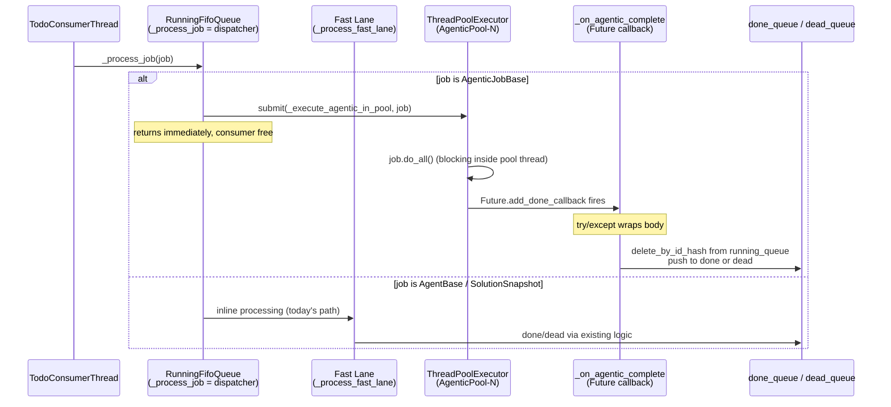

# Approach C — Phase 2: Dispatcher Refactor + Agentic Pool + Pool-Status Endpoint

**Status**: DESIGN (implementation not started)
**Branch**: `wip-v0.1.7-2026.04.22-spit-and-polish-for-cjflow-tfe-and-bfe`
**Paired execution log**: `91-phase-2-execution-log.md`
**Depends on**: Phase 1 (`02-phase-1-rlock-config-and-resource-manager.md`) landed and green
**Decisions driving this phase**: Q1 (2-lane), Q2 (`= 1` prod / `= 3` dev), Q4 (defensive callback), Q5 (pool-status in Phase 2), Q6 (single pool)

---

## Context

Phase 2 is the **core behavioural change**. After Phase 2 lands and runs with `cj flow max concurrent agentic jobs > 1`, agentic jobs execute concurrently; with `= 1` the system reproduces today's serial behaviour exactly. The dispatcher splits work by `isinstance`: sync agents stay inline on the consumer thread; agentic jobs submit to a `ThreadPoolExecutor`. Completion flows through a `Future.add_done_callback` that — **defensively** wrapped per Q4 — moves the job from `running_queue → done/dead`.

Phase 2 also ships the `/api/queue/pool-status` endpoint (Q5: promoted from the original Phase 3 plan), so dev debugging has eyes on the pool from day one.

---

## Scope

### In scope

- `src/cosa/rest/running_fifo_queue.py` — dispatcher refactor, `ThreadPoolExecutor`, `_submit_agentic_job()`, `_execute_agentic_in_pool()`, `_on_agentic_complete()` (defensive), `_process_fast_lane()` extraction, `get_pool_status()`, `shutdown_pool()`.
- `src/fastapi_app/main.py` — shutdown hook calling `running_queue.shutdown_pool( wait=True, timeout=30.0 )` before consumer thread stops.
- `src/cosa/rest/routers/queue.py` (or whichever existing router is the right home) — new `GET /api/queue/pool-status` endpoint.
- `src/cosa/rest/queue_consumer.py` — trivial: confirm it still delegates cleanly to the refactored `_process_job()`.
- `src/tests/unit/test_agentic_pool.py` — **NEW** unit tests.
- `src/docs/notification-api.md`, `src/docs/websocket-architecture.md` — brief updates noting concurrent-running-jobs reality.
- `src/docs/rest-api-reference.md` — add `/api/queue/pool-status` entry.

### Out of scope (explicit)

- Agent-side migration to `ApiResourceManager` (Phase 3+).
- Ghost-job watchdog sweep (Phase 3).
- Per-job-type pools (Q6: single pool only).
- Admin UI visualization of pool state (Phase 3 nice-to-have).

---

## Architecture



---

## Step 2.1 — Dispatcher refactor in `RunningFifoQueue`

**File**: `src/cosa/rest/running_fifo_queue.py`

### New `__init__` fields

Exact ordering (matches Phase 3 sweeper init — see `04-phase-3-*.md` Step 3.1):

```python
def __init__( self, config_mgr, ... ):  # existing signature preserved
    super().__init__()                  # FifoQueue.__init__ (inherits RLock from Phase 1)
    # ... existing RunningFifoQueue init preserved ...

    # Phase 2: agentic pool
    self._pool_max_workers = config_mgr.get(
        "cj flow max concurrent agentic jobs", default=1, return_type="int"
    )
    self._agentic_pool         = ThreadPoolExecutor(
        max_workers        = self._pool_max_workers,
        thread_name_prefix = "AgenticPool"
    )
    self._agentic_futures      = {}                  # { id_hash : Future }
    self._agentic_futures_lock = threading.Lock()    # protects _agentic_futures only

    # Phase 3: ghost-job sweeper thread is appended here — see 04-phase-3-*.md Step 3.1.
    # (Omitted in Phase 2 to keep the diff scoped to pool mechanics.)
```

### Pool is unbounded on the submission side (Phase 2 scope)

`ThreadPoolExecutor(max_workers=N)` uses an **unbounded internal work queue** by default. If 100 agentic jobs are submitted in a burst, all 100 accumulate in the pool's internal queue while only N run at a time. This is deliberate for Phase 2:

- Simple (no submission-blocking in the dispatcher).
- Memory footprint per queued Future is small.
- `pending_in_pool` in the status endpoint exposes the queue depth so dev debugging can see accumulation.

**Explicitly out of scope for Phase 2**: submission-side backpressure (blocking dispatcher when `pending_in_pool > threshold`). If observed memory issues ever arise from large `pending_in_pool` values, revisit in a follow-up.

### Pool resize requires server restart (Phase 2 scope)

`_pool_max_workers` is captured in `__init__`. Changing the INI value `cj flow max concurrent agentic jobs` therefore takes effect only on:
- Full server restart, OR
- FastAPI auto-reload firing after an edit to a Python file in the reload-watch set (the INI alone does not trigger reload — touching a `.py` file does).

No `resize_pool(N)` runtime API is added in Phase 2. The Q2 "bump prod from `= 1` to `= 3` later" promise implies a restart, not a hot-reconfigure. This is acceptable because bumps are rare and deliberate. If a future operational need arises for live resize, it's a separate deliberate follow-up.

### Refactored `_process_job()`

Single import: `from cosa.agents.agentic_job_base import AgenticJobBase`. Dispatch is explicit; unknown types raise rather than fall through silently.

```python
def _process_job( self, job ):
    if isinstance( job, AgenticJobBase ):
        self._submit_agentic_job( job )
    elif isinstance( job, (AgentBase, SolutionSnapshot) ):
        # Fast-lane — inline processing. _process_fast_lane dispatches
        # internally to _handle_base_agent (with cache-check + CRUD sub-branch)
        # or _handle_solution_snapshot, preserving today's exact behaviour.
        self._process_fast_lane( job )
    else:
        raise TypeError(
            f"Unknown job type {type( job ).__name__} in CJ Flow dispatcher. "
            "All queue jobs must be AgenticJobBase, AgentBase, or SolutionSnapshot."
        )
```

### `_submit_agentic_job()` (new)

**Ordering invariant**: push → emit → (future-registration + callback-registration inside lock). The `_agentic_futures_lock` scope MUST cover both the `submit()` call AND the `_agentic_futures` assignment AND the `add_done_callback` call — otherwise a fast-completing Future can fire the callback before `_agentic_futures[id_hash] = future` has happened, producing a missing key in `_on_agentic_complete`'s pop and a blind spot for the Phase-3 ghost-sweeper.

```python
def _submit_agentic_job( self, job ):
    """Submit an agentic job to the pool, track its Future, register callback.

    Order matters:
      1. push job into running_queue (self is RunningFifoQueue) so the
         Phase-3 ghost-sweeper's get_by_id_hash(id_hash) can find it.
      2. emit todo -> running WebSocket event (UX: card flips immediately,
         not lazily when the pool thread picks it up).
      3. submit + future-track + callback-register — ALL inside
         _agentic_futures_lock to close the sub-microsecond race where
         a fast Future fires its callback before being tracked.
    """
    # Step 1: enter running_queue
    self.push( job )

    # Step 2: emit state transition
    emit_job_state_transition( job, from_state="todo", to_state="running" )

    # Step 3: atomic submit + track + register callback
    with self._agentic_futures_lock:
        future = self._agentic_pool.submit( self._execute_agentic_in_pool, job )
        self._agentic_futures[ job.id_hash ] = future
        future.add_done_callback(
            lambda f, j=job: self._on_agentic_complete( j, f )
        )
```

### `_execute_agentic_in_pool()` (new)

```python
def _execute_agentic_in_pool( self, job ):
    """Runs inside a pool worker thread. Blocks on job.do_all()."""
    # do_all() creates its own asyncio event loop via asyncio.run() internally —
    # safe because each call is on a distinct pool thread.
    return job.do_all()
```

### `_on_agentic_complete()` (new, **defensive per Q4**)

> **Load-bearing invariant (enforced here, relied on by Phase 3 ghost-sweeper)**: `_on_agentic_complete` **MUST pop from `_agentic_futures` BEFORE transitioning the job**. The Phase-3 ghost-sweeper uses "still in `_agentic_futures` AND `Future.done()`" as the signal that a transition never happened. If the pop happens after the transition, the sweeper's race window opens and it can dead-letter a job that was just moved to `done_queue`. Do not re-order these two operations without updating the sweeper. Regression test lives in `test_agentic_pool.py` (Phase 3).

```python
def _on_agentic_complete( self, job, future ):
    """
    Future callback. Runs on pool thread after do_all() returns or raises.
    Moves job from running_queue to done_queue or dead_queue.

    Defensive: any exception in this body dead-letters the job rather than
    leaving it stuck in running_queue. Q4 watchdog (Phase 3) is the backstop
    for callbacks that never fire at all.

    INVARIANT (see callout above): pop from _agentic_futures BEFORE
    transitioning. Ghost-sweeper depends on this ordering.
    """
    try:
        with self._agentic_futures_lock:
            self._agentic_futures.pop( job.id_hash, None )  # INVARIANT: pop first

        exc = future.exception()
        if exc is not None:
            self._transition_to_dead( job, exc )
            return

        formatted_output = future.result()
        self._transition_to_done( job, formatted_output )

    except BaseException as e:
        # Outer wrapper uses BaseException so KeyboardInterrupt / SystemExit /
        # GeneratorExit propagating from inside the pool thread don't escape
        # the callback and crash the executor's internal state.
        # Inner _transition_to_dead attempt uses Exception (narrower) — we
        # want BaseException survivors LOGGED and the job left for the
        # Phase-3 ghost-sweeper, not pushed through the dead-letter path
        # (which can trigger more BaseException-raising code).
        du.print_banner(
            f"_on_agentic_complete FAILED for job {job.id_hash}: {e!r}", error=True
        )
        if isinstance( e, Exception ):
            try:
                self._transition_to_dead( job, e )
            except Exception as inner:
                du.print_banner(
                    f"Dead-letter ALSO failed for {job.id_hash}: {inner!r}", error=True
                )
                # Last-resort: leave for Phase-3 watchdog. Never raise from a callback.
        # BaseException survivors: log only; do not attempt dead-letter.
        # Never re-raise; ThreadPoolExecutor treats callback exceptions as fatal.
```

### `_transition_to_done` / `_transition_to_dead` — extraction sources

Both helpers are **extracted** from existing inline completion logic in `src/cosa/rest/running_fifo_queue.py` so fast lane AND pool callback share one code path.

**`_transition_to_done( job, formatted_output )`** — extract from:
- **Agentic success: lines 411–480** — speech notify (412) → metadata build (414–451) → WebSocket emit RUNNING → COMPLETED (452) → `self.pop()` + `self.jobs_done_queue.push(job)` (455–456) → TFE watchdog async invocation (463–469) → I/O logging via `self.io_tbl.insert_io_row(...)` (473–480).
- **Agent success: lines 725–751** — shorter variant of the same shape.
- **Cache-hit: line 1044** — `self.pop()` + push-to-done inside `_format_cached_result`.

Signature:
```python
def _transition_to_done( self, job, formatted_output ) -> None:
    """Thread-safe. Callable from either pool callback thread or consumer thread.
    Reads derived values (answer_conversational, run_timer, etc.) from job.*
    attributes which do_all() sets as side-effects; formatted_output is the
    return value used for I/O logging only, not the source of truth."""
```

**`_transition_to_dead( job, cause )`** — extract from:
- **Agentic status-check failure: lines 482–532** — error extracted from `running_job.error` (484) → TTS (488–491) → metadata + emit RUNNING → FAILED (494–526) → `self.pop()` + `self.jobs_dead_queue.push(job)` (528–529) → auto-fix via `self._evaluate_for_auto_fix(running_job)` (532).
- **Agentic exception: lines 534–592** — traceback capture (536–541) → `running_job.state = JobState.FAILED` (543) → TTS (547–551) → metadata + emit (554–586) → pop + push (588–589) → auto-fix (592).
- **Agent error_case: line 278** — `_handle_error_case()` pop + dead-queue push.
- **Outer dispatcher crash: line 252** — generic `_process_job` crash handler.

Signature:
```python
def _transition_to_dead( self, job, cause ) -> None:
    """`cause` may be an Exception instance (exception paths) OR a string
    (status-check-failure path where job.error is already a string).
    The extracted body normalises both."""
```

### `self.pop()` replacement — 9 concrete sites

Today's `src/cosa/rest/running_fifo_queue.py` has `self.pop()` at these exact lines:

| Line | Path | Today's context | Phase 2 change |
|---|---|---|---|
| 252 | Outer `_process_job` exception handler | Generic crash → move to dead_queue | `self.delete_by_id_hash( running_job.id_hash )` |
| 278 | `_handle_error_case` | Error completion → dead_queue | `self.delete_by_id_hash( running_job.id_hash )` |
| 394 | Agentic STALLED state | Move to done_queue | `self.delete_by_id_hash( running_job.id_hash )` |
| 455 | Agentic SUCCESS | Move to done_queue | `self.delete_by_id_hash( running_job.id_hash )` |
| 528 | Agentic status-check failure | Move to dead_queue | `self.delete_by_id_hash( running_job.id_hash )` |
| 588 | Agentic exception | Move to dead_queue | `self.delete_by_id_hash( running_job.id_hash )` |
| 747 | Agent (fast lane) SUCCESS | Move to done_queue | `self.delete_by_id_hash( running_job.id_hash )` |
| 829 | SolutionSnapshot (fast lane) SUCCESS | Move to done_queue | `self.delete_by_id_hash( running_job.id_hash )` |
| 1044 | `_format_cached_result` CACHE HIT | Move to done_queue | `self.delete_by_id_hash( running_job.id_hash )` |

**Rule: every `self.pop()` in `running_fifo_queue.py` is replaced.** Even fast-lane paths must switch: fast-lane runs concurrently with pool-callback threads, and "head of running_queue" is no longer deterministic. A regression test (`test_no_pop_calls_remain_in_running_fifo_queue`) greps the file for `self\.pop\(` and fails if any remain.

### `_process_fast_lane()` (extracted)

`_process_fast_lane(job)` internally dispatches by isinstance to preserve today's exact behaviour for non-agentic jobs. Pseudocode:

```python
def _process_fast_lane( self, job ):
    """Inline processing for AgentBase + SolutionSnapshot jobs.
    Dispatches to preserve today's agent-type-specific handling including
    cache check, CRUD sub-branch, and snapshot format_result."""
    if isinstance( job, AgentBase ):
        if isinstance( job, CrudForDataFramesAgent ):
            # Today's behaviour: skip cache for CRUD (mutable data)
            self._handle_base_agent( job, truncated_question, run_timer )
        else:
            # Today's behaviour: check cache first; on hit → _format_cached_result
            # (which itself calls _transition_to_done); on miss → _handle_base_agent
            ...existing cache-check logic from running_fifo_queue.py lines 184-206...
    else:  # SolutionSnapshot
        self._handle_solution_snapshot( job, truncated_question, run_timer )
```

`_handle_base_agent` and `_handle_solution_snapshot` remain in place; their terminal `self.pop()` calls switch to `self.delete_by_id_hash(...)` per the table above.

### `get_pool_status()` (new)

Three counters; semantics explicit to avoid confusion between "in pool" (submitted) and "running right now":

- `max_agentic_workers`: pool cap (from INI).
- `inflight_agentic_jobs`: submitted-but-not-done (running + pending). Matches today's `pending_in_pool + running`.
- `pending_in_pool`: queued inside the pool's internal queue, not yet picked up by a worker. Equals `inflight - (currently running workers)`.

The UI's "N running" label derives as `inflight - pending`.

```python
def get_pool_status( self ) -> dict:
    with self._agentic_futures_lock:
        inflight = sum( 1 for f in self._agentic_futures.values() if not f.done() )
        pending  = sum( 1 for f in self._agentic_futures.values() if not f.running() and not f.done() )
    return {
        "inflight_agentic_jobs" : inflight,
        "max_agentic_workers"   : self._pool_max_workers,
        "pending_in_pool"       : pending,
    }
```

> **Note on naming migration**: the earlier field name was `active_agentic_jobs`, but "active" is ambiguous (running vs submitted). The new `inflight_agentic_jobs` is unambiguous. Update all downstream docs (rest-api-reference.md, websocket-architecture.md, Protocol E2E assertions) to use the new field name.

### `shutdown_pool()` (new)

```python
def shutdown_pool( self, wait: bool = True, timeout: float = 30.0 ) -> None:
    """
    Stop the pool from accepting new work. If wait=True, block up to `timeout`
    seconds for in-flight jobs to finish. Survivors after timeout are
    dead-lettered so we don't leave phantom `running` rows after restart.
    """
    self._agentic_pool.shutdown( wait=False, cancel_futures=False )

    if not wait:
        return

    deadline = time.time() + timeout
    with self._agentic_futures_lock:
        inflight = list( self._agentic_futures.items() )

    for id_hash, future in inflight:
        remaining = max( 0.0, deadline - time.time() )
        try:
            future.result( timeout=remaining )
        except TimeoutError:
            # Dead-letter the job; it didn't finish in time
            job = self.get_by_id_hash( id_hash )
            if job is not None:
                self._transition_to_dead( job, TimeoutError( "shutdown_pool timeout" ) )
        except Exception:
            pass  # Already handled by _on_agentic_complete
```

---

## Step 2.2 — Shutdown hook in `main.py`

**File**: `src/fastapi_app/main.py`

**Pre-step — verify existing shutdown pattern**: FastAPI's `@app.on_event("shutdown")` is deprecated in favour of `lifespan` context managers. Before editing, AI greps `main.py` for the existing teardown pattern (either `@app.on_event("shutdown")` OR `@asynccontextmanager def lifespan(app)` used with `FastAPI(lifespan=...)`). Match whatever is already there; do not introduce both.

If `@app.on_event` is still in use:
```python
@app.on_event( "shutdown" )
async def on_shutdown():
    # New (Phase 2)
    if running_queue is not None:
        running_queue.shutdown_pool( wait=True, timeout=30.0 )

    # Existing consumer shutdown (unchanged)
    ...
```

If `lifespan` is in use:
```python
@asynccontextmanager
async def lifespan( app ):
    # Existing startup...
    yield
    # New (Phase 2) — teardown section, runs BEFORE HTTP socket close
    if running_queue is not None:
        running_queue.shutdown_pool( wait=True, timeout=30.0 )
    # Existing teardown...
```

**Ordering matters**: `shutdown_pool` must run BEFORE (a) the consumer thread exits, AND (b) the HTTP socket closes. In-flight pool workers need the WebSocket channel alive long enough to emit their final `job_state_transition` events as they finish. Verify this ordering by greps or test in the impl step.

---

## Step 2.3 — `/api/queue/pool-status` endpoint (Q5: Phase 2)

**File**: `src/cosa/rest/routers/queues.py` (plural — confirmed via reuse-map survey; all existing `/api/queue/*` endpoints live here).

**Auth**: **Required** — use `Depends(get_current_user)` to match every sibling GET in the file (earlier design claim of "no auth required" was contradicted by survey and has been retracted). Import is already present in the file at line 23 (`from cosa.rest.auth import get_current_user`).

```python
from cosa.rest.auth import get_current_user  # already imported at line 23

@router.get(
    "/queue/pool-status",
    summary="CJ Flow agentic-pool state",
    description="Returns inflight/pending counts and max workers for the agentic ThreadPoolExecutor."
)
async def get_pool_status(
    current_user: dict = Depends( get_current_user )
):
    """
    Return CJ Flow agentic-pool state.

    Response:
        {
            "inflight_agentic_jobs" : int,
            "max_agentic_workers"   : int,
            "pending_in_pool"       : int
        }
    """
    return running_queue.get_pool_status()
```

- **ApiResourceManager state** is NOT surfaced here in Phase 2 (Q5 implication — Phase 3 enrichment).
- **Admin UI**: add a minimal "Pool: 2/3 inflight, 0 pending" chip to existing admin surface (small, not required for ship).
- **Anonymous access for ops tooling** (Grafana-style dashboards): NOT supported in Phase 2. If external monitoring needs access, that's a new design call — add a separate `/api/queue/pool-status-public` endpoint or equivalent, decided via cosa-voice `ask_yes_no` at the time.

---

## Step 2.4 — Unit tests

### `src/tests/unit/test_agentic_pool.py` (**NEW**)

| Test | What it proves |
|---|---|
| `test_agentic_job_submitted_to_pool` | Submit a mock `AgenticJobBase` → `_execute_agentic_in_pool` invoked on a pool thread (not consumer) |
| `test_sync_agent_processed_inline` | Submit `AgentBase` → `_process_fast_lane` invoked, pool untouched |
| `test_solution_snapshot_processed_inline` | Submit `SolutionSnapshot` → `_process_fast_lane` invoked, pool untouched |
| `test_dispatcher_raises_on_unknown_job_type` | Submit a non-`AgenticJobBase`/`AgentBase`/`SolutionSnapshot` object → `TypeError` raised, not silently routed |
| `test_submit_pushes_to_running_queue` | After `_submit_agentic_job(job)`, `running_queue.get_by_id_hash(job.id_hash)` returns the job (ghost-sweeper precondition) |
| `test_submit_emits_running_transition` | After `_submit_agentic_job(job)`, a `todo -> running` WebSocket event is emitted for `job.id_hash` |
| `test_submit_lock_ordering_atomic` | Monkeypatch `pool.submit` to fire callback immediately (zero-duration future); assert `_agentic_futures` has the key AND `_on_agentic_complete` successfully pops it (regression test for the atomic-under-lock ordering) |
| `test_concurrent_agentic_execution` | 3 mock agentic jobs each sleeping 0.5s → `max_workers=3` completes in <1s; `max_workers=1` takes ~1.5s |
| `test_fast_lane_not_blocked_by_agentic` | Submit 10s-sleep agentic + 10ms sync math → math completes while agentic still running |
| `test_completion_moves_to_done` | Agentic job returns success → landed in `done_queue`, removed from `running_queue` |
| `test_failure_moves_to_dead` | Agentic job raises → landed in `dead_queue` with exception recorded |
| `test_no_pop_calls_remain_in_running_fifo_queue` | **Grep regression**: read `src/cosa/rest/running_fifo_queue.py` and assert `self.pop(` does not appear anywhere (all 9 sites migrated to `delete_by_id_hash`) |
| `test_defensive_callback_swallows_exception_on_transition` | Force `_transition_to_done` to raise `Exception`; job still ends in `dead_queue`, not stuck in `running_queue`, callback does not re-raise |
| `test_defensive_callback_both_transitions_fail_no_raise` | Monkeypatch BOTH `_transition_to_done` AND `_transition_to_dead` to raise; callback returns without raising; job remains in `_agentic_futures` so the Phase-3 sweeper picks it up (last-resort path) |
| `test_defensive_callback_handles_base_exception` | Force `_execute_agentic_in_pool` to raise `KeyboardInterrupt` (a `BaseException`, not `Exception`); callback logs + returns without raising; does NOT attempt dead-letter (BaseException survivors are left for the sweeper) |
| `test_get_pool_status_accurate` | With 3 mocked futures (1 running, 1 pending, 1 done) and `max_workers=3`, assert payload `{inflight_agentic_jobs: 2, max_agentic_workers: 3, pending_in_pool: 1}` |
| `test_shutdown_pool_waits_for_inflight` | Submit 1s job, call `shutdown_pool(timeout=5.0)` → job completes, no phantom row |
| `test_shutdown_pool_dead_letters_timeouts` | Submit 10s job, call `shutdown_pool(timeout=1.0)` → job dead-lettered, not stuck |
| `test_pool_saturation_queues_work` | 5 jobs, `max_workers=2` → first 2 start, rest queue and eventually complete |
| `test_completion_order_not_fifo` | Submit fast + slow agentic in that order → fast completes first |
| `test_concurrent_transition_to_done_sqlite_thread_safe` | 3 parallel `_transition_to_done` calls against a temp SQLite (WAL mode, per existing config); assert all 3 `insert_io_row` writes succeed without exception; assert 3 rows present at end |
| `test_concurrent_notify_from_callbacks` | 2 concurrent `_transition_to_done` calls; mock the TTS + WS emit layer; assert both invoke `_notify` and `emit_job_state_transition` without exception (regression for thread-safety of the notify path under pool callbacks) |
| `test_concurrent_tfe_watchdog_evaluate` | 2 concurrent `_transition_to_done` calls; mocked `TestSuiteCompletionWatchdog.evaluate`; assert both invocations complete without exception (regression for TFE watchdog under concurrent callback threads) |

All tests use mocked `AgenticJobBase` subclasses with controllable `do_all()`. No real Anthropic calls. No `curl`. Server not required.

---

## Critical files touched

| File | Touch type | Est. LOC change |
|---|---|---|
| `src/cosa/rest/running_fifo_queue.py` | **Major modify** | +200 / −80 (net ~+120) |
| `src/fastapi_app/main.py` | Modify | +5 |
| `src/cosa/rest/routers/queues.py` (plural) | Modify | +18 (endpoint + Depends auth) |
| `src/cosa/rest/queue_consumer.py` | Verify only | 0 |
| `src/tests/unit/test_agentic_pool.py` | **New** | ~300 |
| `src/docs/notification-api.md` | Minor modify | ~+20 |
| `src/docs/websocket-architecture.md` | Minor modify | ~+10 |
| `src/docs/rest-api-reference.md` | Minor modify | +5 (endpoint row) |

Total: **~575 LOC, 1 new file, 7 modified files**.

---

## Verification (all four automated layers)

> **Executor contract**: every step in this section is `EXECUTOR: AI` unless explicitly tagged otherwise. Any step requiring human judgment must be tagged `EXECUTOR: HUMAN` with a same-line justification. See `00-working-contract.md` and §TESTING VENUES for venue routing.

#### A. `:7999` (AI-discretionary — AI runs without asking)

| Layer | Command | Expected |
|---|---|---|
| **py_compile** | Compile each modified `.py` file via `python -c "import py_compile; py_compile.compile('<path>', doraise=True)"` | Exit 0; no stderr |
| **Import chain** | `PYTHONPATH=src python -c "from cosa.rest.running_fifo_queue import RunningFifoQueue; print('OK')"` | Prints `OK`, exit 0 |
| **New unit tests** | `pytest src/tests/unit/test_agentic_pool.py -v` | All pass |
| **Full unit regression** | `pytest src/tests/unit/ -v` | 915 baseline + Phase 1 + Phase 2 new tests; all green |
| **Non-destructive smoke** | `/smoke-test-remediation SELECTIVE` (excludes `test_proxy_integration.py` and any other `:8000`-routed suite — see sub-table B) | No regressions against baseline |
| **WebSocket smoke** | `./src/scripts/run-websocket-smoke-tests.sh` | 50/50 pass |

#### B. `:8000` (scheduled monopolize-mode — AI submits via `/api/test-suite/submit` after user slot-check)

The `--bg` commands are **local-foreground fallback**, not the primary path from Claude Code.

| Layer | Submission | Expected |
|---|---|---|
| **Destructive smoke** (if touched) | `POST /api/test-suite/submit {"test_types": "smoke", "scheduled_at": "..."}` | 100% pass |
| **E2E UI** | `POST /api/test-suite/submit {"test_types": "e2e_ui", "scheduled_at": "..."}` — fallback: `./src/scripts/run-e2e-ui-tests.sh --bg -v` | 285/285 pass |
| **Integration (final gate)** | `POST /api/test-suite/submit {"test_types": "integration", "scheduled_at": "..."}` — fallback: `./src/tests/run-integration-tests.sh --bg -v` | 43/43 pass |

### Protocol E2E — Phase 2 mandatory (AI-executed)

Per project mandate for behaviour-changing work. "Protocol E2E" means "not yet in pytest" — it does NOT mean "user does it." Every step below is executed by the AI via the API against `:7999`:

1. EXECUTOR: AI — Set `cj flow max concurrent agentic jobs = 3` in `src/conf/lupin-app.ini` (`:7999` auto-reloads; no restart needed).
2. EXECUTOR: AI — **Warmup**: POST /api/push (MathAgent, any trivial query); poll `/api/get-queue/done` until it returns; discard the result. This warms the fast-lane Phi-4-GPTQ path so the measured MathAgent in step 4 isn't confounded by cold-GPU model-load latency (3–8s).
3. EXECUTOR: AI — POST /api/push × 2 (DeepResearch dry-run) back-to-back; capture both `job_id`s. (Uses the dry-run mechanism confirmed in `91-phase-2-execution-log.md` Step 2.0.)
4. EXECUTOR: AI — POST /api/push (MathAgent, e.g. "17 * 23?") immediately after; capture `job_id`.
5. EXECUTOR: AI — Poll `/api/get-queue/done` until MathAgent `job_id` appears; assert elapsed < 5s.
6. EXECUTOR: AI — GET `/api/queue/running` during the research runs; assert both DR `job_id`s present simultaneously.
7. EXECUTOR: AI — GET `/api/queue/pool-status` mid-run (with auth); assert `{inflight_agentic_jobs: 2, max_agentic_workers: 3, pending_in_pool: 0}`.
8. EXECUTOR: AI — Continue polling `/api/get-queue/done` until both DR jobs complete; assert `running_queue` size returns to 0.
9. EXECUTOR: AI — Report all observed values (timings, pool-status payload, final queue sizes) to the user via cosa-voice `notify`.

**No `:8000` test-suite submission required for Phase 2** — if one were needed, the AI would still execute the submission via `/api/test-suite/submit`, but would first ask the user to confirm the `scheduled_at` slot does not collide with other scheduled tests (monopolize-mode coordination, not budget approval).

---

## Rollback

Phase 2 is recoverable but heavier than Phase 1:
- Revert the Phase 2 commit(s). `ThreadPoolExecutor` import, new methods, shutdown hook, endpoint all vanish.
- No DB schema changes, no persistent state added (pool is in-memory only).
- Phase 1 remains in place and harmless (RLock still present but uncontended).
- INI key stays; reading it with default=1 is a no-op.

Running under `= 1` also acts as a runtime-level rollback without redeploying.

---

## Pre-resolved design decisions (2026-04-23 fitness review)

1. **Endpoint home**: `src/cosa/rest/routers/queues.py` (plural — confirmed via reuse-map survey; all existing `/api/queue/*` endpoints live there). Auth via `Depends(get_current_user)` matching sibling convention.
2. **`_transition_to_dead` signature**: `(job, cause)` where `cause` is `Exception | str` — the extracted body normalises both (`running_job.error` from the status-check path is a string; pool exception path passes the `Exception` instance).
3. **`shutdown_pool` timeout default**: **30s** — keep. Planned-shutdown hook in `main.py` can pass a longer override if running on hardware with consistently long-running jobs. 30s is the ceiling before the pod-restart reaper in typical deployments; letting agentic jobs exceed it risks the scheduler killing the process mid-teardown.
4. **Admin UI chip**: Deferred to Phase 3 as nice-to-have. Phase 2 ships the endpoint; UI follows if trivial at Phase 3 review time.
5. **Thread-name prefix**: `AgenticPool` (no `-` suffix — `ThreadPoolExecutor` appends `-0`, `-1`). Keeps logs greppable.
