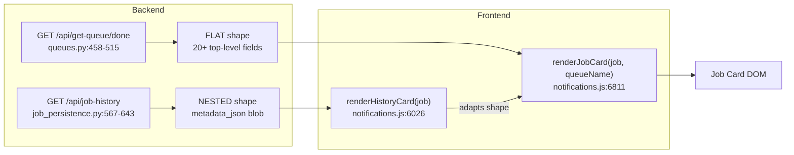
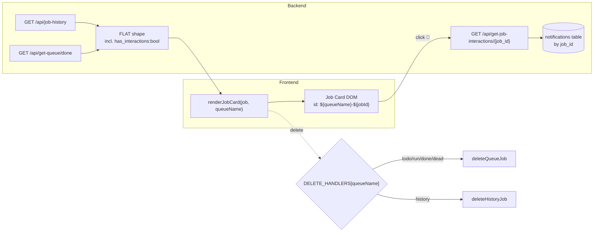
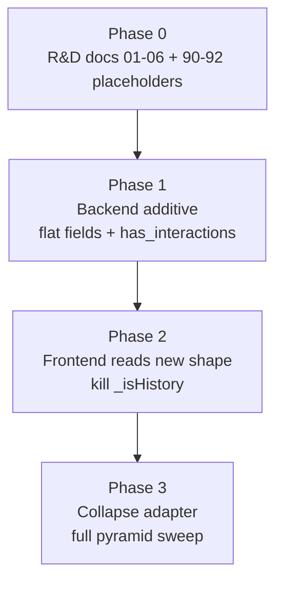

# 01 — Design Overview: CJ Flow Card-Rendering Unification (A1 + B + C)

**Date**: 2026-04-26
**Branch**: wip-v0.1.7-2026.04.22-spit-and-polish-for-cjflow-tfe-and-bfe
**Plan source**: `~/.claude/plans/dazzling-napping-frost.md`
**Companion docs**: `02-api-shape-normalization.md`, `03-has-interactions-accuracy.md`, `04-frontend-flag-removal.md`, `05-adapter-collapse.md`, `06-testing-strategy.md`

---

## 1. Problem statement

The CJ Flow accordion has five buckets — `todo`, `run`, `done`, `dead`, `history`. Cards in the first four render consistently. Cards in the `history` bucket render inconsistently. The visible symptoms are:

- 💬 interaction indicator missing
- "📋 Notification Conversation" section displays "Loading…" but never resolves
- Subtle field/badge gaps that erode at confidence in the bucket

This is the **third unification attempt** in the `notifications.js` rendering pipeline:

| Session | Date | Commit | Stated scope | Actual scope |
|---|---|---|---|---|
| 21a62c05 | 2026-01-29 | 57a9fbb | Unify WebSocket-vs-server-fetched done cards | Helper extraction (renderAbstractSection, renderReportLinkSection) |
| b9faa342 | 2026-01-28 | 57a9fbb | Job card field parity | Field shape alignment |
| 1b8c1cc0 | 2026-04-10 | 3faec04 | "Single source of truth via renderJobCard" + drop _isHistory | Field alignment + WS-transition re-render. **`_isHistory` not dropped. `has_interactions` not unified.** |

Each prior fix declared more scope than it delivered, and the gap was invisible at first glance. This plan closes the remaining gap and includes diff-verification gates so it can't repeat.

---

## 2. Root-cause finding (from forensic investigation 2026-04-26)

The renderer is unified — `renderJobCard()` at `notifications.js:6811` is the single source of truth. The divergence lives **in the data pipelines feeding it**:

`renderHistoryCard()` is the adapter that translates the nested PostgreSQL row shape into the flat shape `renderJobCard()` expects.

**Three residual gaps** kept the unification from being complete:

1. **Two backend shapes still exist** — `/api/job-history` returns `metadata_json` nested instead of flat fields.
2. **`_isHistory` flag still leaks queue-context into the renderer** — set at `notifications.js:6065`, read at lines 6850 (DOM-id namespacing) and 6976 (delete routing). The 2026-04-10 R&D doc explicitly said this would be dropped. It wasn't.
3. **`has_interactions` is hardcoded `false` for history cards** — at `notifications.js:6054`. The accurate signal (a count query against the `notifications` table by `job_id`) is cheap, indexed, and was never wired in.

---

## 3. Critical investigation finding: notification persistence is robust

**The persistence layer EXISTS and is comprehensive**:
- PostgreSQL `notifications` table — `src/cosa/rest/postgres_models.py:489-641`
- Repository at `src/cosa/rest/db/repositories/notification_repository.py`
- Schema includes: `id`, `sender_id`, `recipient_id`, `job_id` (indexed), `progress_group_id`, `message`, `title`, `abstract`, `type`, `priority`, `response_requested`, `response_type`, `response_value` (JSONB — full transcript), `response_options` (JSONB), `state`, `is_hidden`, `created_at`, `delivered_at`, `responded_at`, `expires_at`
- **Indefinite retention** unless explicitly deleted (`bulk_delete_by_user`) or soft-hidden (`soft_delete_by_date`)
- Indexed on `job_id` → O(log n) lookups by job

**The lazy-load endpoint already works for history**:
- `GET /api/get-job-interactions/{job_id}` at `src/cosa/rest/routers/queues.py:675-813`
- Queries the `notifications` table directly: `db.query(Notification).filter(Notification.job_id == job_id)`
- Includes deduplication of progress-group-shared rows (keeps latest per `progress_group_id`)
- Returns full transcript: message, response_value, options, timestamps, abstract
- **Agnostic to whether the job is in the live queue or history** — it just needs the `job_id`

**This means**: the only reason history-card interactions don't load is because the 💬 indicator is suppressed by `has_interactions: false`, which prevents the click trigger that would fire the (already-working) lazy-load. Fixing just `has_interactions` makes history's interactions feature work end-to-end with zero new backend.

---

## 4. Target architecture

Same data shape from both endpoints. One renderer. One lazy-load. Queue-name drives DOM-id namespacing and delete-handler routing through a lookup table — no boolean flags carrying queue context.

---

## 5. Three-axis cleanup

| Axis | What | Where | Phase |
|---|---|---|---|
| **A1** | Backend API shape normalization — `/api/job-history` returns flat fields matching `/api/get-queue/done` | CoSA: `job_persistence.py`, `routers/queues.py` | Phase 1 |
| **B** | Frontend `_isHistory` removal — replace boolean flag with queueName-driven routing via `DELETE_HANDLERS` lookup; namespace DOM ids by queueName | Lupin: `notifications.js` | Phase 2 |
| **C** | `has_interactions` accuracy — replace `bool(session_id)` proxy with a real count query against the notifications table; surface as top-level boolean from both endpoints | CoSA: `notification_repository.py` (count_by_job_ids), `routers/queues.py` (call site), `job_persistence.py` (call site) | Phase 1 |

A1 and C live together in Phase 1 (both backend, same files, same test scope). B lives in Phase 2 (pure frontend). Phase 3 collapses the now-redundant `renderHistoryCard()` adapter and runs the full test pyramid.

---

## 6. Phase ordering and rollout

**Backwards-compat guarantee**: Phase 1 is purely additive. New top-level fields are added; `metadata_json` remains in the response untouched. No external consumer can break. Phase 2 ships against the new fields with a transition-window fallback (`job.has_interactions ?? bool(metadata.session_id)`) that's removed in Phase 3 audit.

---

## 7. Out of scope

- Auth gap on `/api/get-job-interactions/{job_id}` (no job-ownership check) — file as separate bug-fix-queue.md entry
- Notification soft-delete UX (`is_hidden` column exists, not surfaced) — separate feature
- `paused` field on history rows — history is terminal, accept `paused: false` always
- Backwards-compat shim for external consumers of `/api/job-history` — Lupin's frontend is the only consumer
- `InputAndOutputTable` (`io_tbl`) integration — separate analytics path, not the lazy-load source

---

## 8. Risk register

See `dazzling-napping-frost.md` §"Risk register" for the full table. Key items repeated for execution-time reference:

| Risk | Severity | Mitigation |
|---|---|---|
| Prior fix (3faec04) declared scope it didn't deliver — same trap | High | Phase 3 includes explicit `grep` audit gates with zero-match expectations |
| `metadata_json` variance across older history rows | Medium | Field-level fallback table in `02-api-shape-normalization.md` + unit tests for missing/None metadata |
| Phase 2 ships frontend before backend → 404-equivalent on missing fields | Medium | Phase ordering is strict: Phase 1 ships first; Phase 2 includes transition fallback (removed in Phase 3) |
| 8 pre-existing `test_notifications_router` failures live in this same area | Medium | Address them in Phase 1 (cosmetic config-key drift `app_timezone` ↔ `app timezone`) so we don't leave 8 known-red tests in the suite we just touched |

---

## 9. CoSA repo handling

This work modifies files under `src/cosa/`. Per memory `feedback_cosa_edit_vs_manage_git` and Lupin convention:

- I edit and test CoSA files freely.
- I do NOT run any `git` command inside `src/cosa/`.
- The user commits CoSA-side files separately when working in CoSA context.
- Final report lists CoSA files explicitly as "Files (CoSA, user commits separately)".

---

## 10. Pointer index

- `02-api-shape-normalization.md` — A1 backend design (field-by-field mapping, fallback rules, naming alignment)
- `03-has-interactions-accuracy.md` — C backend design (count query, indexing, perf)
- `04-frontend-flag-removal.md` — B frontend design (DELETE_HANDLERS, queueName-driven routing)
- `05-adapter-collapse.md` — `renderHistoryCard()` reduction strategy
- `06-testing-strategy.md` — test pyramid: unit + integration + E2E + visual
- `90-phase1-execution-log.md` — backend execution log (live-updated during Phase 1)
- `91-phase2-execution-log.md` — frontend execution log (live-updated during Phase 2)
- `92-phase3-execution-log.md` — adapter collapse + verification log (live-updated during Phase 3)
