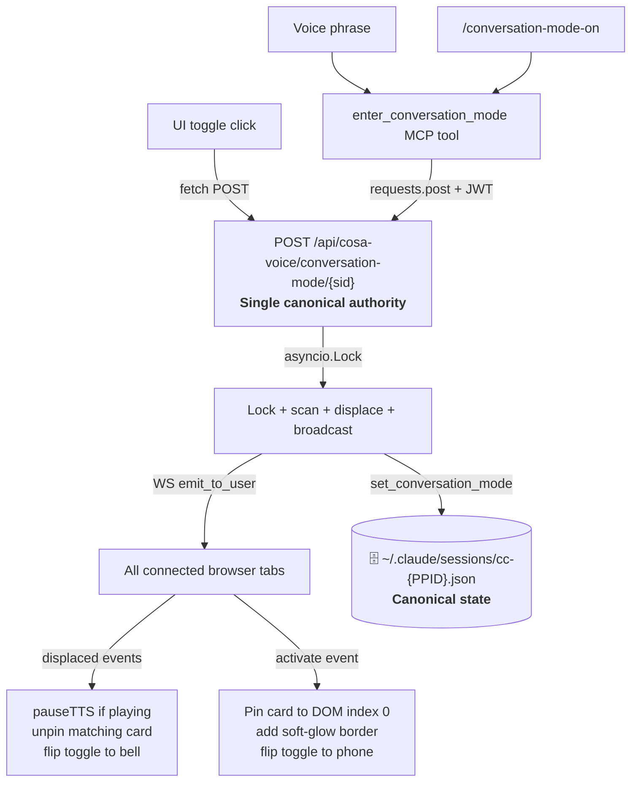

# Conversation Mode for Claude Code (via cosa-voice) — Design Doc

**Date**: 2026.04.27
**Status**: 🟢 Approved, implementation in progress
**Owner**: [LUPIN]
**Pattern**: 3 (Feature Development), single phase, ~1 week scope
**Plan file** (live): `~/.claude/plans/silly-roaming-petal.md`

---

## 1. Context & Motivation

User reported friction during voice-driven dialogue from the cosa-voice notification UI session pane: every assistant turn required manually saying *"speak your answer as high priority"*, breaking natural back-and-forth conversation. The goal is **session-level distance dialogue** — toggle once, hold prolonged voice conversations from anywhere without console interaction.

### Naming

Per user clarification, "speak mode" was rejected as too vague — speaking is what the system already does. Final taxonomy:

| State | Name | Behavior |
|---|---|---|
| Active | **conversation mode** | Every assistant turn auto-`notify(full_text, suppress_ding=True, priority='high')` |
| Default | **notification mode** | Current selective TTS via explicit `notify()` calls |

Bridge field: `conversation_mode_active: bool`. MCP tools: `enter_conversation_mode()` / `exit_conversation_mode()`. Slash commands: `/conversation-mode-on` / `/conversation-mode-off`.

---

## 2. Locked Decisions (from interactive elicitation)

| Q | Decision | Rationale |
|---|---|---|
| Design | **Option B** — MCP tool substrate + cosa-voice server-instructions tell Claude to auto-`notify(full_text, suppress_ding=True)` when flag is on | Smallest blast radius; mirrors existing cosa-voice patterns (bridge flags, MCP tools as state-setters); discipline-based fallback path to Option C (hook) if drift observed |
| TTS hygiene | **Defaults** — strip code blocks, skip tool-call narration, no length cap | Tunable after living with it; code/tool-call TTS is universally bad UX |
| Activation surfaces | **All four** — voice phrase + slash command + UI toggle + MCP tool substrate | All converge on the same MCP tool; multiple doors for different ergonomics |
| Persistence | **Per-session bridge file** | Survives `/clear` within session, resets on new session, no global config knob (avoids "surprises me at-console next day" failure) |
| Sync architecture | **Server-canonical** — bridge file is single source of truth, UI localStorage is read-through cache, WebSocket broadcasts changes | Single source of truth eliminates divergence across multiple UI clients per session_id |

---

## 3. Architecture

```mermaid
flowchart LR
    Voice["Voice phrase<br><i>'enter conversation mode'</i><br><b>Claude pattern-matches</b>"] --> MCP
    Slash["/conversation-mode-on<br>/conversation-mode-off"] --> MCP
    UIToggle["UI toggle button<br><i>per-session widget</i>"] -->|HTTP POST| API
    MCP["MCP tool<br>set_conversation_mode session_id, active"] -->|writes| Bridge
    API["POST /api/cosa-voice/<br>conversation-mode/{session_id}"] -->|writes| Bridge
    Bridge[("🗄️ ~/.claude/sessions/<br>cc-{PPID}.json<br><b>SOURCE OF TRUTH</b>")]
    Bridge -->|WebSocket broadcast<br><i>conversation_mode_changed</i>| AllUIClients
    AllUIClients["All UI clients<br><i>localStorage cache hydrated</i>"]
    Bridge -->|read at every turn<br><i>get_session_info()</i>| Claude
```

### Per-session_id isolation

Each Claude Code instance has its own PPID and bridge file (`~/.claude/sessions/cc-{PPID}.json`). The user can run **session A** in conversation mode while **session B** stays in notification mode (default) — no cross-talk. The cosa-voice notification UI shows them as separate conversation history panes, each with its own toggle widget keyed by `data-session-id`.

---

## 4. Integration Map (from Phase 1 Explore agents)

### MCP server side

| Item | File:line | Notes |
|---|---|---|
| FastMCP app | `src/lupin_mcp/cosa_voice_mcp.py:561-564` | Static `instructions=` string set at module load — cannot be per-session |
| Tool registration pattern | `src/lupin_mcp/cosa_voice_mcp.py:567+` | `@mcp.tool` decorator on async functions |
| Bridge file path | `~/.claude/sessions/cc-{PPID}.json` | Resolved via `src/lupin_cli/claude_code/hooks/lib/session_bridge.py:46` |
| Bridge write pattern | `src/lupin_mcp/cosa_voice_mcp.py:1106-1110` | Read-modify-write JSON (used by `set_session_topic`) |
| `get_session_info()` | `src/lupin_mcp/cosa_voice_mcp.py:1138-1167` | Returns dict including `session_id`, `sender_id`, `version` — needs `conversation_mode_active` added |
| Session-bridge helpers | `src/lupin_cli/claude_code/hooks/lib/session_bridge.py:223,309,400` | `get_claude_session_id()`, `wait_for_session_id()`, `get_session_metadata()` |

### UI side

| Item | File:line | Notes |
|---|---|---|
| Sender card per-session DOM | `notifications.js:9286-9289` | `data-session-id` attribute, `sender-card-${senderId}` ID pattern |
| Sender-card header (toggle slot) | `notifications.js:9267-9276` | Near `sender-session-name` span — natural insertion point |
| WebSocket subscription | `notifications.js:2200-2219` | Hardcoded `subscribed_events` array sent at auth time |
| WebSocket event dispatch | `notifications.js:2251-2367` | `handleQueueMessage()` switch, route via `envelope.session_id` |
| localStorage convention | `notifications.js:148-157` | Constants in constructor; **objects keyed by session_id** (mirror `SESSION_NAMES_KEY`) |
| `authedFetch` HTTP wrapper | `notifications.js:944-975` | Auto-refresh JWT, inject `Authorization` header |
| Auth headers | `notifications.js:5552-5568` | Bearer token from `localStorage['lupin_access_token']` |

### HTTP layer (Lupin-side, NOT CoSA — to minimize submodule churn)

- New router: `src/fastapi_app/routers/conversation_mode.py`
- Wire-in: `src/fastapi_app/main.py:~763` (next to existing `notifications.router`)
- Auth: `@require_api_key_or_jwt` (import from `cosa.rest.middleware.api_key_auth` — IMPORT only, not edit)
- WebSocketManager broadcast: `websocket_manager.async_emit("conversation_mode_changed", {...})` (manager instantiated `main.py:98`)

---

## 5. Risks / Gotchas

| # | Risk | Source | Mitigation |
|---|---|---|---|
| 1 | Static MCP instructions — cannot inject per-session rules | MCP exploration | Instructions are GENERIC: tell Claude to query `get_session_info()` per turn, dispatch on `conversation_mode_active` |
| 2 | No existing per-session toggle in UI — novel pattern, dense header | UI exploration | Small icon button (📞 conversation / 🔔 notification), CSS review during Phase 4 |
| 3 | Hardcoded `subscribed_events` whitelist | UI exploration line 2205-2218 | Add `"conversation_mode_changed"` to server-side allow-list AND client subscription list |
| 4 | localStorage convention trap — must use object keyed by session_id, NOT suffixed keys | UI exploration | Mirror `SESSION_NAMES_KEY`: `notifications_conversation_modes` → `{session_id: bool}` |
| 5 | Race: toggle event fires before sender-card DOM created | UI exploration | Defer-and-retry handler if target DOM missing |
| 6 | Discipline drift (inherent to Option B) — Claude may forget to auto-`notify()` | Design choice | Escalation path: add Claude Code stop hook (Option C) if drift observed in practice |
| 7 | Sender card header is dense (status indicator + project name + session ID + name + stats + delete) — toggle may overflow | UI exploration | Compact icon-only widget; CSS flex-wrap as fallback |

---

## 6. Test Plan

| Layer | What | Venue | Phase |
|---|---|---|---|
| `py_compile` | Every Python file edited | local | Per-edit |
| Import chain | Full cosa-voice MCP startup chain | local | After Phase 2 |
| Unit | `test_session_bridge.py` round-trip + per-session_id isolation | :7999 (`pytest src/tests/unit/`) | End of Phase 1 |
| Smoke | `quick_smoke_test()` extension in cosa_voice_mcp.py | :7999 | End of Phase 2 |
| Unit | MCP tool flag-flip tests (`test_cosa_voice_mcp_conversation_mode.py`) | :7999 | End of Phase 2 |
| WebSocket smoke | `conversation_mode_changed` event broadcast | :7999 (`./src/scripts/run-websocket-smoke-tests.sh`) | End of Phase 3 |
| Manual smoke | Browser: click toggle → localStorage update → WS event in Network tab → bridge mtime change | :7999 | End of Phase 4 |
| Manual smoke | Voice phrase "enter conversation mode" → MCP tool call → auto-`notify()` next turn | :7999 | End of Phase 5 |
| **E2E (GATED)** | Playwright multi-tab toggle sync | **:8000 scheduled** | Phase 6 — user-confirmed slot |

---

## 7. Out of Scope (intentionally deferred)

- **Stop-hook escalation** (Option C) — defer until discipline drift is observed in practice
- **Global config knob** (`default conversation mode = on/off` in `lupin-app.ini`) — defer; per-session bridge covers user's actual ergonomic
- **Voice routing training data** — N/A, this is an MCP feature, not a new agent
- **agentic-voice-workflow skill compliance** — N/A, not a Claude Agent SDK background job
- **CoSA-side router** — keeping HTTP endpoints Lupin-side to minimize CoSA submodule churn

---

## 8. Implementation Phase Summary

| Phase | Description | Files (new ✱ / edit) |
|---|---|---|
| **0** | This design doc | ✱ `src/rnd/v0.1.7/2026.04.27-conversation-mode-design.md` |
| **1** | Bridge schema + helpers | `session_bridge.py`, ✱ extend `test_session_bridge.py` |
| **2** | MCP tools + server-instructions | `cosa_voice_mcp.py`, `test_mcp_smoke.py`, ✱ `test_cosa_voice_mcp_conversation_mode.py` |
| **3** | HTTP endpoint + WS event | ✱ `routers/conversation_mode.py`, `main.py`, ✱ `test_conversation_mode_event.py` |
| **4** | UI toggle widget | `notifications.html`, `notifications.js` |
| **5** | Slash commands | ✱ `.claude/commands/conversation-mode-on.md`, ✱ `.claude/commands/conversation-mode-off.md` |
| **6** | E2E (gated) | ✱ `src/tests/e2e_ui/test_conversation_mode.py` |

---

## 9. Two-Phase E2E Gate

Per `feedback_e2e_two_phase_gate.md`:

- **Phase A — Code writing** (Phases 0-5): all code committed per user authorization
- **Phase B — E2E execution** (Phase 6): stops at the gate. User confirms `:8000` slot availability. Submission via `/api/test-suite/submit` with non-overlapping `scheduled_at`.

---

## 10. Execution Log (added at session-end 2026.04.27)

| Phase | Status | Outcome |
|---|---|---|
| 0 | ✅ done | This doc written first |
| 1 | ✅ done | 10 unit tests pass |
| 2 | ✅ done | 6 unit tests pass; py_compile + import-chain clean |
| 3 | ✅ done | 7 unit tests pass; live OpenAPI verified endpoint registered after `:7999` bounce |
| 4 | ✅ done | `node --check` clean; manual smoke initially failed (404 — see deviations) |
| 5 | ✅ done | both slash commands registered |
| 6 | 📝 written | execution gated — needs `:8000` slot |

**Test totals**: 23 new pytest tests across 3 files; 52/52 pass when combined with pre-existing session_bridge suite.

### Deviations from the original plan (and why)

**D1 — Router placement: Lupin-side → CoSA-side**

The plan said *"new file `src/fastapi_app/routers/conversation_mode.py` (Lupin-side, NOT CoSA)"* with the motivation of minimizing CoSA submodule churn. Discovered at Phase 3 start that `src/fastapi_app/routers/` does not exist — ALL routers live in `src/cosa/rest/routers/` and are imported in `main.py:66`. Splitting one router Lupin-side would break the established convention. Course-corrected to put the router CoSA-side per `feedback_cosa_edit_vs_manage_git` ("editing src/cosa/ is fine; only git ops forbidden"). One new CoSA file added; user commits CoSA submodule separately.

**D2 — Bind mount missing on `:7999` Docker container**

Phase 4 manual smoke (browser toggle click) returned 404. Root cause: container had no bind mount for `~/.claude/sessions/`, so `Path.home() / ".claude" / "sessions"` resolved to an empty directory inside the container. Added `~/.claude/sessions:/home/rruiz/.claude/sessions` (rw) to `docker-compose.yml`, recreated container via `docker compose up -d --force-recreate lupin-rest-dev` (a plain `docker restart` would not re-evaluate volumes). Verified bridge files visible inside container after recreate.

**D3 — Icon polarity correction**

Initial UI rendered 🔕 (muted bell) for default notification mode. User correctly flagged this as semantically backwards — notification mode is the default ON state where notifications happen normally; 🔕 reads as "muted." Replaced with 🔔 (plain bell) across `notifications.js`, `notifications.css`, `test_conversation_mode.py`, both slash command files, and this design doc.

**D4 — `:8000` test-container bind mount NOT yet added**

Only `:7999` dev container got the `~/.claude/sessions` mount in this session. Phase 6 E2E run on `:8000` will need the same mount or it will 404 the same way. Added to TODO.md as a follow-up to handle before scheduling Phase 6.

### Risks/gotchas observed in practice

| # | Risk (from §5) | Outcome |
|---|---|---|
| 1 | Static MCP instructions | ✅ Confirmed — instructions are GENERIC, Claude reads `get_session_info()` per turn |
| 2 | Novel UI per-session toggle pattern | ✅ Implemented as small icon button in sender-card header; CSS matches gist-btn pattern; no overflow observed |
| 3 | Hardcoded `subscribed_events` whitelist | ✅ Found at `notifications.js:2205-2218` AND server-side at `lupin-app.ini:websocket available events`; both updated |
| 4 | localStorage convention trap (object vs suffixed keys) | ✅ Used object pattern (`{session_id: bool}`) mirroring `SESSION_NAMES_KEY` |
| 5 | Race: toggle event before sender-card DOM | Not yet observed; selector-based handler degrades gracefully (`querySelectorAll` returns empty NodeList, no error) |
| 6 | Discipline drift (Option B inherent) | TODO followup — needs live UX validation to surface |
| 7 | Sender card header density | ✅ Toggle fits in existing layout; no horizontal overflow at typical widths |

---

## 11. Mutual Exclusion + Pinning Addendum (2026-04-28, Session c7333045)

### Trigger

After a day of using the v1 conversation-mode toggle, two UX gaps surfaced:

1. **Multi-session free-for-all.** Each Claude Code session could independently hold conversation mode. The user's framing: "Only one CC session at a time should be able to monopolize the mic." We need mutual exclusion across all of one user's CC sessions.
2. **Pane drift.** The sender card for the active conversation drifts up and down in the notifications accordion as unrelated activity from other sessions arrives — distracting when the user is focused on a voice dialogue.

This §11 captures locked decisions for the v1.1 follow-up; full implementation plan lives at `~/.claude/plans/drifting-skipping-porcupine.md` (Session c7333045).

### Locked decisions

| # | Question | Decision | Rationale |
|---|---|---|---|
| 11.1 | Where does mutex state live? | **Coordinated bridge files** — at most one bridge with `conversation_mode_active=true` at a time across the user's sessions. Bridge files remain canonical. | Minimal refactor; preserves existing tests; existing per-session helpers stay valid |
| 11.2 | Which activation surfaces enforce mutex? | **All four** — UI POST + voice phrase + slash command + MCP tool. The MCP tool is refactored to call the canonical HTTP endpoint internally instead of writing the bridge directly. | Original v1 plan had voice/MCP path bypass mutex as "out of scope." User corrected: Claude Code-driven activation is a normal user path; treating it as "follow-on activity" creates a special case |
| 11.3 | Who can call the MCP toggle tools? | **User-initiated only** — Claude must NEVER call `enter_conversation_mode()` or `exit_conversation_mode()` on its own initiative. Only in direct response to a user instruction (voice phrase, typed request, slash command). | User established as a hard rule. Prevents Claude from preemptively grabbing the mic on a long task. Documented in three concentric layers: MCP `instructions=` block + tool docstrings + new skill at `~/.claude/skills/conversation-mode-guardrails/SKILL.md` |
| 11.4 | What happens to in-flight playback when focus shifts? | `pauseTTS()` globally — user manually resumes via global play or per-notification corner button. | Don't stop (destructive); don't keep playing (jarring). Pause matches user mental model |
| 11.5 | How does the active card pin? | **DOM index-0 sort-key override** (no CSS `position: sticky`) | User explicitly rejected sticky. DOM-order pin keeps the card genuinely first; modify both copies of `moveSenderCardToTop` and `createSenderCard`'s top-insertion to respect a pinned card |
| 11.6 | Visual cue for active card? | **Soft green glow border + box-shadow** matching the corner-pause-button accent palette | User confirmed |
| 11.7 | Should A's Claude be interrupted mid-turn on displacement? | **Let A finish current turn** — A's MCP server reads bridge per-turn, naturally reverts on next turn. | Less invasive; cached `conv_mode=true` from turn start is acceptable overhang |
| 11.8 | Should displaced session UI show a toast? | Not in v1. WS event payload carries `displaced=true, displaced_by=<sid>` for forward compatibility. | User accepted default |

### Architecture (after §11 changes)



### New invariants

- **At most one `conversation_mode_active=true` bridge** in `SESSION_DIR` at any time per OS-user. Self-healed by the endpoint's scan-and-displace flow.
- **Pinned sender card occupies DOM index 0** of `#notifications-list` whenever any session has `conversation_mode_active=true`. Other cards never insert above it.
- **`displaced=true` WS payload** signals "focus transferred away from this session" — receivers should pause in-flight TTS playback (no other interpretation in v1).

### Out of scope (v1.1 — folded in for clarity)

- Per-session TTS queue isolation (B's new audio plays while A's stays paused). v1.1 model is global pause; per-session queues are a separate UX cycle.
- Toast UI for displaced sessions (payload carries the field; UI just doesn't render it yet).
- Playwright E2E updates for new scenarios — gated behind a `:8000` slot per the E2E two-phase gate.
- Multi-worker uvicorn lock coordination — `asyncio.Lock` is process-local. If Lupin ever moves to `--workers N`, lock moves to Redis or DB advisory lock.
- Hard programmatic enforcement of the user-only-initiation rule. v1.1 documents the rule in three layers; if discipline drift is observed, future work could add a "user-utterance attestation" field to the MCP tool signature.

### Risks observed mid-design (none breaking)

- Two `moveSenderCardToTop` definitions exist (lines ~9317 and ~15163, both target `#notifications-list`). Both must be patched. Cleanup-dedupe is a follow-up, not in scope for this PR.
- Container-mode PID-namespace gate (`_can_trust_host_pids()` from the today-fixed 404 bug) extends naturally — `find_active_conversation_sessions()` reuses the same gate.
- MCP path now depends on FastAPI server availability for mutex enforcement. Fallback to direct `set_conversation_mode` write preserves degraded-mode behavior matching today's bridge-only path.

