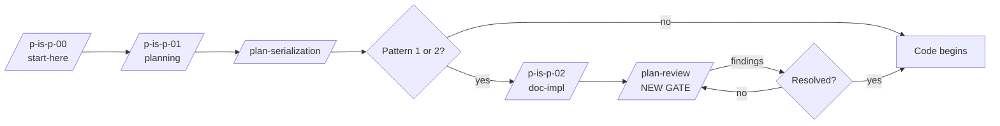

# Promote Adversarial + Fitness Review Pattern from CJ Flow R&D to Planning-is-Prompting

**Date**: 2026.04.27
**Status**: Proposal — pending implementation in the `planning-is-prompting` repo
**Origin project**: Lupin v0.1.7 CJ Flow async multi-lane (phases 1–3) milestone
**Lupin branch at write-time**: `wip-v0.1.7-2026.04.22-spit-and-polish-for-cjflow-tfe-and-bfe`
**Future home**: `planning-is-prompting/workflow/plan-review.md` (canonical) + per-project skill wrappers
**Author handoff**: This document is self-contained. Pick it up in a `planning-is-prompting`-rooted Claude session to execute Phase 1.

---

## TL;DR

The two-pass **adversarial + fitness** review prompts written ahead of CJ Flow phases 1–3 caught a meaningful number of design gaps and ownership-language ambiguities **before any code was written**. The leverage is real, the pattern is project-agnostic, and it should not stay buried in one Lupin milestone's R&D folder.

**Recommendation**:

1. Lift the technique into `planning-is-prompting/workflow/plan-review.md` as a canonical, parameterized two-pass workflow. The two CJ Flow prompts become *instances* of the pattern, not the source of truth.
2. Add a thin Lupin-side `/plan-review` slash-command wrapper that auto-discovers docs in a target directory and injects Lupin-specific tags.
3. **Trigger on PIP Pattern 1/2 plans only** — not every plan. Daily small fixes (Pattern 3/4) don't earn the cost.
4. **Insertion point**: between impl-doc creation (`/p-is-p-02-documentation`) and code writing — the gate that closes the loophole in CLAUDE.md's `DOCUMENTATION-FIRST PROTOCOL` ("docs before code" but no quality bar on the docs themselves).
5. **Front-load attention on conventions**: the review's signal depends on tagging conventions (`EXECUTOR: AI/HUMAN`, `Q-N` decision anchors, `TBD` markers). These must be *established* in `p-is-p-02-documenting-the-implementation.md` first; without them, the review's greps are blind.
6. **Promote the REUSE deficiency type to first-class status** — it's a forcing function for de-duplication that AI-authored plans systematically miss, valuable even setting aside the rest of the technique.

---

## Origin and Source Artifacts

Before implementing CJ Flow phases 1–3 (async multi-lane queue rework), the user authored two review prompts to enforce the working contract's "user is never a tester" mandate and to surface design gaps. They were run ahead of code in a fresh-context session, found real issues, fixes were applied, and only then did implementation start. Phases 1–3 landed cleanly with no rework rounds attributable to ownership or completeness gaps in the design docs.

**Source artifacts in Lupin** (`src/rnd/v0.1.7/2026.04.23-cj-flow-async-multi-lane/`):

| File | Role |
|------|------|
| `00-working-contract.md` | The "user is never a tester" anchor — the rule the adversarial review enforces |
| `01-design-review.md` | The Q1–Q7 design decisions — the frozen anchor the review must not silently override |
| `05-adversarial-review-prompt.md` | **Pass 1** — hostile read for ownership-language gaps |
| `06-fitness-review-prompt.md` | **Pass 2** — design-completeness gaps, REUSE detection, TBD resolution |
| `02..04` | Phase design docs (subjects of review) |
| `90..92` | Phase execution logs (subjects of review) |

Both prompts are headed `[DONE, DO NOT REEXECUTE]` and parametrized to that specific milestone. Generalization requires extracting the abstract structure.

---

## The Pattern, Abstracted

The two passes target **orthogonal failure modes**. Collapsing them into one pass loses signal — you'd find some of each and miss most of both.

| Pass | Failure mode hunted | Method | Greps |
|------|---------------------|--------|-------|
| **Pass 1: Adversarial** | "Done" claimed without AI-executed verification; user-as-tester sneaks in via wording | Hunt verbs without subjects ("verify," "confirm," "observe," "check," "inspect," "ensure"); enforce `EXECUTOR: AI/HUMAN` tags with same-line justification when HUMAN; flag steps the AI literally cannot execute (GPU work, UI clicks, privileged access) — the tag is a lie if execution is impossible | `grep -rn "Manual\|manual"`; `grep -rn "EXECUTOR: HUMAN"`; `grep -rnE "^\- \[ \] [^E]"` |
| **Pass 2: Fitness-to-implement** | Design lacks information for someone unfamiliar to implement without asking clarifying questions | 8 deficiency types (below); explicit answers to every numbered TBD; surface design challenges to existing decision anchors without silently overriding | `grep -rn "TBD\|tbd"`; `grep -rn "Open sub-question"` |

### Pass 2 deficiency taxonomy

1. **AMBIGUITY** — step requires a judgment call the design doesn't specify
2. **COMPLETENESS** — sub-step mentioned in passing but not enumerated
3. **TESTABILITY** — can't tell how success would be verified
4. **ORDERING** — implicit dependency on something earlier the docs don't state
5. **REUSE** — existing code/utility should be referenced but isn't (with explicit instruction to grep before flagging "new")
6. **DECISION TRACEABILITY** — design choice doesn't trace back to a decision anchor or design statement
7. **SCOPE** — declared in-scope but not designed, or designed but unclear which phase
8. **RISK SURFACE** — silent on behavior that will matter at impl time (error paths, edge cases, races)

Plus: **EXTERNAL DEPENDENCIES** — depends on an external system/API/file whose contract the design doesn't specify.

### The non-negotiable gate between passes

Both prompts close with: *"DO NOT fix anything yet. Deliver the findings table. Wait for my confirmation."*

This is the most-violated rule in practice and the one that turns the technique from "real" into "rubber-stamping." The temptation to apply the obvious fixes immediately is exactly the failure mode. The user reviews findings, decides which to apply, then approves a fix pass. **The canonical PIP doc must call this out as non-negotiable.**

---

## Architecture Proposal: PIP Canonical + Per-Project Wrapper

Three options were considered:

| Option | Where | Verdict |
|--------|-------|---------|
| **PIP global only** | `planning-is-prompting/workflow/plan-review.md` | ✗ Misses project-specific tagging conventions, paths, vocabulary |
| **Lupin-local skill only** | `<lupin>/.claude/skills/plan-review/SKILL.md` | ✗ Locks the technique to one project; reinvented in every other repo |
| **Hybrid (recommended)** | Canonical doc in PIP + thin slash-command wrapper per project | ✓ Matches existing PIP architecture (`/plan-session-end` already follows this pattern) |

**Two-layer architecture**:

```
planning-is-prompting/
└── workflow/
    └── plan-review.md          ← NEW: canonical two-pass workflow with placeholder slots
                                   for {{PLAN_DOC_PATHS}}, {{TAGGING_CONVENTIONS}},
                                   {{TBD_QUESTIONS}}, {{DECISION_ANCHORS}}

<project>/.claude/skills/
└── plan-review/                ← per-project wrapper
    └── SKILL.md                  - auto-discovers docs in target dir
                                   - injects project-specific tags (Lupin: EXECUTOR, :7999/:8000)
                                   - enforces project-specific decision-anchor format
                                     (Lupin uses Q1, Q2... in CJ Flow style)
```

The CJ Flow `05-` and `06-` files become **instances** of the pattern. Future milestones don't author them by hand — `/plan-review <doc-dir>` regenerates them from the canonical template + project-specific wrapper.

---

## Cadence: Pattern 1/2 Only, Not Every Plan

The user's original framing was "after every plan." That's too coarse. Cost-benefit:

| Plan size | Cost of two-pass review | Benefit | Verdict |
|-----------|------------------------|---------|---------|
| Pattern 1 (multi-phase, 8+ weeks) | ~20 min AI thinking + finding-table review | High — gap detection scales with plan complexity | ✓ Run |
| Pattern 2 (significant single-phase) | ~15 min | Medium-high — same shape, smaller surface | ✓ Run |
| Pattern 3 (small fix, 1–3 days) | ~10 min | Low — design surface too small to harbor gaps | ✗ Skip |
| Pattern 4 (trivial — typos, doc tweaks) | Cost of running > value | None | ✗ Skip |

The right trigger already exists in PIP's decision matrix: **the same gate that fires `/p-is-p-02-documentation`**. If the work warrants impl-tracking docs, it warrants the review. PIP Pattern 3/4 plans skip the impl-doc step and should skip the review step too.

**Rule for the canonical doc**: "Plan-review is mandatory when `/p-is-p-02-documentation` was invoked. Optional otherwise. If skipped, log a one-line reason in the plan doc itself."

---

## Insertion Point in the PIP Chain



The current PIP chain has a quality hole at the indicated position. CLAUDE.md's `DOCUMENTATION-FIRST PROTOCOL` mandates "create all documentation artifacts BEFORE any code is written" — but it doesn't mandate "good documentation artifacts before code." Plan-review fills that gap as a quality gate.

This is a **doc-quality gate**, not a *design-quality* gate. Pass 2's "Design concerns" section explicitly punts back to the design step for any structural challenge — surface, don't silently override the existing decision anchors.

---

## REUSE Detection: First-Class Promotion

Pass 2's REUSE deficiency type deserves a special call-out:

> *"Actively grep `<project source>` for existing patterns (notification helpers, queue primitives, auth utilities, rate-limit code, websocket emitters) before flagging something as 'new'. If you find existing code that the design should reuse, name the file and function."*

This is a **forcing function for de-duplication that AI-authored plans systematically miss**. Most accidentally-redundant helpers exist because nobody grepped for prior art at planning time. Bolting "find existing patterns" into the review pass makes that automatic.

Recommendation: in the canonical PIP doc, REUSE gets a **separate short prompt** that runs *before* the rest of pass 2. Output format:

| New thing the plan proposes | Existing prior art (file:line) | Verdict |
|----------------------------|-------------------------------|---------|
| ... | ... | ... |

Verdicts: `reuse-as-is`, `extend-existing`, `genuinely-new` (with justification). Forces every "new" claim to be defended against existing prior art.

This pre-pass alone justifies the technique's adoption even if everything else is dropped.

---

## Convention Establishment: The Linchpin

**The review's greps are blind without doc conventions.** Both prompts depend on tags that must be established at doc-creation time:

| Convention | What it tags | Used by |
|-----------|--------------|---------|
| `EXECUTOR: AI` / `EXECUTOR: HUMAN` | Every verification step's owner | Pass 1 grep |
| Same-line justification on `EXECUTOR: HUMAN` | Why a human is required (subjective UX, GPU access, etc.) | Pass 1 review |
| `Q1`, `Q2`, ... `Q-N` decision anchors | Frozen design decisions in `01-design-review.md`-style docs | Pass 2 traceability check |
| `TBD` / `Open sub-question` markers | Explicit unresolved questions | Pass 2 grep + forced resolution |
| `Manual E2E` flag | Signals not-yet-automated tests; pass 1 strips these (NEVER means "human does it") | Pass 1 grep |

If `/p-is-p-02-documenting-the-implementation.md` doesn't *establish* these conventions during doc creation, the review finds nothing. **Phase 2 of the implementation pathway (below) is the most important phase.**

---

## Risks Worth Designing Around

1. **Convention dependency.** As above — the conventions are the linchpin. Failure mode: docs created without tags → review returns "no findings" → false confidence → bugs slip through.

2. **Review fatigue.** Running this on Pattern 3/4 work erodes the muscle. Strict trigger criteria + a "skip with reason" escape hatch.

3. **Review-as-procrastination.** Symmetric risk to "implementation-as-procrastination." The AI could endlessly find micro-issues to delay code. Counter: termination rule — *"after 2 review rounds with diminishing returns, proceed and revisit at phase-end retrospective."*

4. **The "DO NOT fix yet" gate is the most-violated rule.** Both prompts say it. The temptation to apply obvious fixes immediately is the failure mode. Codify it as non-negotiable in the canonical workflow with explicit anti-pattern call-out.

5. **Pattern drift over time.** Project-local wrappers will accumulate knowledge that drifts from the canonical PIP doc. Counter: periodic reconciliation step (probably an extension of `skills-management-audit`).

---

## Implementation Pathway

Four phases, each independently valuable:

| Phase | Work | Why this order |
|-------|------|----------------|
| **1** | Lift `05-` + `06-` into `planning-is-prompting/workflow/plan-review.md`, parameterized with `{{...}}` placeholders for project-specific paths, tags, decision-anchor format, TBD enumeration | Cheapest move — abstracts a working artifact |
| **2** | Amend `p-is-p-02-documenting-the-implementation.md` to **establish** the tagging conventions (`EXECUTOR: AI/HUMAN` with justification, `Q-N` decision anchors, `TBD` / `Open sub-question` markers, "Manual E2E means not-yet-automated, NEVER means human-does-it") | **Linchpin.** Without conventions, review greps are blind. Highest-leverage change of the four. |
| **3** | Create `<lupin>/.claude/skills/plan-review/SKILL.md` thin wrapper: auto-discover docs in target dir, inject Lupin-specific tags + Q-N anchor format, run two passes in sequence with the gate between | Makes the technique invocable as a slash command |
| **4** | Amend `/p-is-p-00-start-here` decision matrix to fire `/plan-review` as a gate for Pattern 1/2 (mandatory) and offer it for Pattern 3 (optional) | Closes the loop — the gate is now in the canonical chain, not opt-in |

### Phase 1 deliverable shape (detail for the picker-upper)

The canonical `plan-review.md` should contain:

1. **Trigger criteria** — when to run (Pattern 1/2 mandatory, Pattern 3 optional, Pattern 4 skip) + how to log a skip
2. **Prerequisites** — required conventions in the docs being reviewed (links to `p-is-p-02-documenting-the-implementation.md` for the convention spec)
3. **Pre-pass: REUSE-detection prompt** (the high-leverage extract from pass 2's REUSE bullet, run separately and first)
4. **Pass 1 template** — adversarial review prompt with `{{PLAN_DOC_PATHS}}`, `{{ANCHOR_FILE}}`, `{{TAGGING_CONVENTIONS}}` slots
5. **Gate**: explicit "DO NOT fix yet, deliver findings, wait for confirmation" — non-negotiable, anti-pattern call-out
6. **Resolution loop**: review findings with user → apply approved fixes → re-run greps to confirm convergence → only then advance
7. **Pass 2 template** — fitness review prompt with `{{TBD_QUESTIONS}}` slot for explicit per-doc TBD enumeration
8. **Gate** (same shape)
9. **Termination rule** — 2 rounds with diminishing returns → proceed, log open issues for phase-end retrospective
10. **Anti-patterns** — applying findings without user gate; collapsing two passes into one; AI volunteering to "go ahead and fix"; running on Pattern 3/4 trivia
11. **Cross-references** — `p-is-p-00-start-here.md`, `p-is-p-01-planning-the-work.md`, `p-is-p-02-documenting-the-implementation.md`, the CLAUDE.md `DOCUMENTATION-FIRST PROTOCOL`

---

## Open Questions for the PIP-context Pickup

These are decisions to make when implementing Phase 1, not decided here:

1. **Slash-command names.** `/plan-review` (single command, runs both passes)? Or `/plan-review-adversarial` + `/plan-review-fitness` (two commands, user controls cadence)? Trade-off: bundled is one ergonomic invocation; split lets the user run pass 2 alone after a quick fix to pass 1 findings.

2. **Where does the REUSE pre-pass live?** Inside the canonical `plan-review.md` as Step 0? Or as a separate `/plan-review-reuse` command that's also invocable on its own (e.g., during planning, before doc-creation)?

3. **Do we update existing PIP-tracked Lupin plans (CJ Flow phases 4+, BFE, TFE) to use the new conventions retroactively?** Probably no — let new milestones adopt; old ones stay at their current convention level. Set an explicit "no retroactive convention enforcement" rule in the PIP doc.

4. **Termination heuristic specifics.** "2 rounds with diminishing returns" needs operationalization. Probably: round N+1 finds < 50% as many issues as round N → terminate. Or: 0 new structural issues (only wording tweaks) → terminate.

5. **Where do the CJ Flow `05-` and `06-` files end up?** Leave in place as historical instances? Add a header noting "see PIP `plan-review.md` for canonical version"? Replace with stub pointers to PIP? My lean: leave + add header pointer; they're part of the v0.1.7 milestone history.

6. **Other projects' adoption path.** Lupin gets the wrapper first (this proposal). What's the rollout for cosa-voice, mobile, plugin-firefox? Probably: same pattern, copy-and-adapt the SKILL.md, only when those projects start a Pattern 1/2 plan.

---

## Cross-References

**Lupin source artifacts**:
- `src/rnd/v0.1.7/2026.04.23-cj-flow-async-multi-lane/00-working-contract.md`
- `src/rnd/v0.1.7/2026.04.23-cj-flow-async-multi-lane/01-design-review.md` (Q1–Q7 anchors)
- `src/rnd/v0.1.7/2026.04.23-cj-flow-async-multi-lane/05-adversarial-review-prompt.md`
- `src/rnd/v0.1.7/2026.04.23-cj-flow-async-multi-lane/06-fitness-review-prompt.md`
- Phase design docs `02-..04-` and execution logs `90-..92-` (subjects of the review)

**PIP source artifacts**:
- `planning-is-prompting/workflow/p-is-p-00-start-here.md` (decision matrix — receives the Phase 4 amendment)
- `planning-is-prompting/workflow/p-is-p-01-planning-the-work.md`
- `planning-is-prompting/workflow/p-is-p-02-documenting-the-implementation.md` (receives the Phase 2 convention establishment — linchpin)
- `planning-is-prompting/workflow/plan-serialization.md`

**Lupin CLAUDE.md sections to keep aligned**:
- `DOCUMENTATION-FIRST PROTOCOL` — the gap this fills
- `PLAN FILE SERIALIZATION`
- `INTERACTIVE REQUIREMENTS ELICITATION`
- `TEST OWNERSHIP MANDATE` ("user is never a tester" — what pass 1 enforces)

**Memory entries the canonical doc should cross-link**:
- `feedback_user_is_never_tester` (or equivalent) — pass 1 anchor
- `feedback_no_defensive_programming` — pass 2 REUSE relevance
- `feedback_plan_approval_means_go` — guards against the "DO NOT fix yet" gate becoming a rubber-stamp

---

## Status at Document Write-Time

- **Pattern**: identified, named, reviewed for cost/benefit
- **Source artifacts**: located and read
- **Architecture**: hybrid PIP+wrapper proposed
- **Pathway**: 4 phases enumerated, with Phase 2 flagged as the linchpin
- **Open questions**: 6 enumerated, deferred to PIP-context implementation
- **Lupin commit**: not yet — this document is the artifact; no code changes proposed in Lupin
- **Next action**: pick up in a `planning-is-prompting`-rooted Claude session and execute Phase 1
