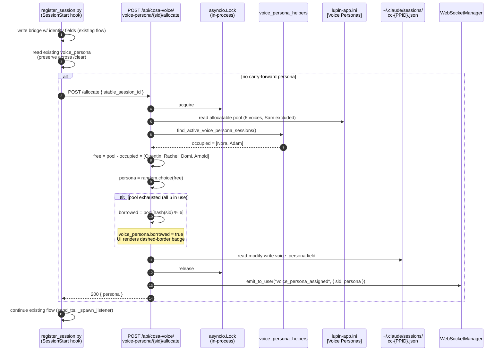
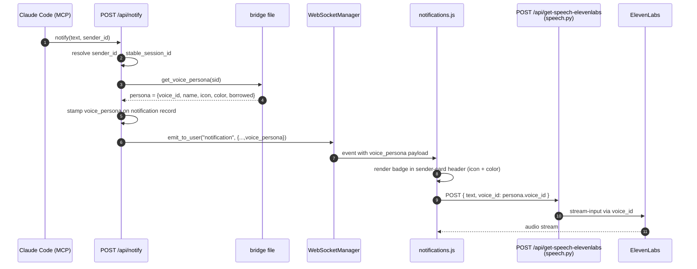
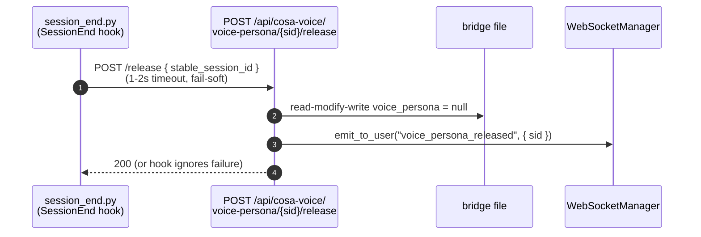

# Per-Session Voice Personas — Design Doc

**Version**: 1.0
**Date**: 2026-04-28
**Status**: Approved (plan: `~/.claude/plans/let-s-start-a-new-magical-hickey.md`)
**Companion execution log**: [`90-execution.md`](90-execution.md)

---

## 1. Problem Statement

Conversation Mode v1.1 (commits `48dc03e` + `f2cef9f`, 2026-04-27 / 2026-04-28)
gave each Claude Code session a per-session toggle to make Claude auto-narrate
every turn via TTS. Useful — but it exposed a UX gap:

> "It's very difficult to keep track of which Claude code conversation history
> window I am looking at / dealing with inside of the Claude code accordion."

Every CC session today speaks with the same voice — Sam
(`G7ILShrCNLfmS0A37SXS`, the global ElevenLabs default at `lupin-app.ini:636`).
With 2+ parallel sessions (common in multi-repo work), the user can't audibly
distinguish them, and the visual sender-card cues (project label + user-edited
name) are too quiet.

## 2. Goal

Each new CC session is **uniformly randomly assigned** a voice/persona at
SessionStart from a **6-voice allocatable pool**. Sam stays reserved as the
system default for any TTS request lacking an explicit `voice_id`. The
notifications UI propagates the persona alongside each TTS call so the
rendering path knows which voice to speak with, and the sender card displays
a colored badge per session. Voices return to the pool on session end.

This is a UX-distinguishability win. Conversation Mode v1.1 stays untouched;
this layer sits **alongside** it, fully orthogonal.

## 3. Voice Pool

### Reserved system default (NOT allocatable)

| Persona | Voice ID                  | Icon | Color (hex)  | Role                                |
|---------|---------------------------|------|--------------|-------------------------------------|
| Sam     | `G7ILShrCNLfmS0A37SXS`    | 🎙️   | `#00BCD4` cyan | System default — speaks every voice_id-less TTS request |

Sam's voice ID lives at `elevenlabs tts default voice id` in `lupin-app.ini:636`.
That key is the sole source of truth for the "no voice_id specified" voice.
Sam does NOT appear in the new `[Voice Personas]` block.

### Allocatable pool — 6 voices

| # | Persona | Voice ID                  | Icon | Color (hex)        | Texture profile          |
|---|---------|---------------------------|------|--------------------|--------------------------|
| 1 | Nora    | `kcQkGnn0HAT2JRDQ4Ljp`    | 🌸   | `#E91E63` pink     | Warm, inquisitive female |
| 2 | Quentin | `Aa6nEBJJMKJwJkCx8VU2`    | 🦉   | `#FFA000` amber    | Authoritative warm male  |
| 3 | Rachel  | `21m00Tcm4TlvDq8ikWAM`    | 🕊️   | `#4CAF50` green    | Calm & clear female      |
| 4 | Adam    | `pNInz6obpgDQGcFmaJgB`    | 🌑   | `#3F51B5` indigo   | Deep male                |
| 5 | Domi    | `AZnzlk1XvdvUeBnXmlld`    | ⚡   | `#C2185B` magenta  | Young & energetic female |
| 6 | Arnold  | `VR6AewLTigWG4xSOukaG`    | 🪨   | `#C62828` red      | Gravelly male            |

**Allocation algorithm**: `random.choice(pool − occupied)` — uniform random
draw from the unallocated subset.

User clarified at design time: Nora/Quentin have no exclusive claim from
podcast generator (created for podcasts but recyclable for sessions, since
user does not listen to podcasts during CC work).

## 4. Architecture

### 4.1 Storage model: bridge file is canonical

Each session bridge file (`~/.claude/sessions/cc-{PPID}.json`) gains a new
top-level field:

```json
{
  "session_id"               : "...",
  "stable_session_id"        : "...",
  "...existing fields...",
  "conversation_mode_active" : false,
  "voice_persona"            : {
    "name"        : "Adam",
    "voice_id"    : "pNInz6obpgDQGcFmaJgB",
    "icon"        : "🌑",
    "color"       : "#3F51B5",
    "borrowed"    : false,
    "assigned_at" : "2026-04-28T20:33:42Z"
  }
}
```

Pool occupancy is computed by scanning `cc-*.json` and filtering dead PIDs —
the same `_is_pid_alive` precedent used by `find_active_conversation_sessions`
(`session_bridge.py:652`). **No separate sweeper goroutine; per-request scan
is the sweeper.**

### 4.2 Allocation flow (SessionStart hook, synchronous)



### 4.3 TTS dispatch (Option C + B from design review)



Server stamps the persona at POST time (looked up from the bridge by
`sender_id`); UI reads `voice_id` straight from the WS notification envelope
and forwards it to the TTS endpoint. **No UI-side persona cache needed** —
the persona always travels with the notification it'll vocalize.

If `get_voice_persona` returns None (session bridge missing, persona never
allocated, or session dead), the notification envelope's `voice_persona`
field is absent. The UI's TTS POST omits `voice_id`. The speech router falls
back to Sam (`speech.py:855-856`) — exactly today's behavior.

### 4.4 Release & reclaim

- **SessionEnd hook** (`session_end.py`) — best-effort `POST /release`
  (1–2s timeout) to clear the bridge field and free the slot.
- **Dead-PID reclaim** — implicit. `/allocate` and `GET /pool` always treat
  a `voice_persona` on a dead-PID bridge as free (same dead-PID filter
  pattern as conversation-mode).



## 5. `/clear` Preservation

Voice persona is keyed on `stable_session_id` (which survives `/clear`), but
that alone is not sufficient — the SessionStart hook must NOT overwrite the
existing `voice_persona` field when a context clear is detected.

`register_session.py:584` already merges `existing_ids` from `old_data` for
the `session_ids` list. Add the same read-and-preserve pattern for
`voice_persona`: if the field is present in `old_data` and `is_context_clear`
is true, carry it forward without re-allocating.

```python
# In register_session.py, near existing_ids merge:
preserved_persona = None
if is_context_clear and old_data:
    preserved_persona = old_data.get( "voice_persona" )

# After bridge-write:
if preserved_persona is not None:
    # Preserve across /clear — do not call /allocate
    bridge_data[ "voice_persona" ] = preserved_persona
else:
    # Fresh allocation
    persona = _allocate_voice_persona( stable_session_id )
    if persona is not None:
        bridge_data[ "voice_persona" ] = persona
```

## 6. Bundled Bug Fix

Design review (Plan agent) found that `notifications.js:3971-3975` and
`:4028-4032` send `{ voice: "default" }` to `/api/get-speech-elevenlabs`,
but the speech router at `speech.py:498-500` reads `voice_id` (not `voice`).
The UI parameter is **silently ignored today** and the server falls back to
its config default.

This bug is not blocking, but the persona feature requires fixing the body
key, so the fix lands in this same change: body key changes from `voice` →
`voice_id` and passes the persona's voice_id (or omits the field for
server-default Sam fallback).

## 7. Compliance with Conversation Mode v1.1

Voice personas and conversation mode are **independent**:

- A session can have a persona regardless of conversation-mode state.
- Conversation mode's mutex-1 (only one session active at a time) does NOT
  apply to personas — every session gets one.
- The `conversation_mode_changed` displace broadcast at
  `conversation_mode.py:175-184` does NOT touch the `voice_persona` field.
- When conversation mode is on, every Claude turn becomes a `notify()` —
  per-session voices make the resulting TTS torrent uniquely
  distinguishable. **This is the desired UX synergy.**

The design doc and the new router file both include explicit statements of
orthogonality so future maintainers understand the two features must stay
decoupled.

## 8. Memory-Rule Audit

Per the user's `feedback_conversation_mode_user_only_initiation.md` rule:
Claude must NEVER call `enter_conversation_mode()` / `exit_conversation_mode()`
on its own initiative. Voice persona allocation is **not a violation** —
it is:

1. Triggered by the **SessionStart hook** (a harness mechanism, not Claude),
2. A passive auto-allocation, not a Claude-driven MCP tool call,
3. Does not touch the conversation-mode toggle in any way.

This is the same shape as the existing automatic listener spawn at
`register_session.py:651` — which is also a hook-driven, automatic
per-session resource allocation that nobody considers a guardrail violation.

## 9. Critical Files

### New

| File | Purpose |
|------|---------|
| `src/cosa/rest/routers/voice_persona.py`           | Allocate / release / pool endpoints (mirrors conversation_mode.py) |
| `src/cosa/rest/voice_persona_helpers.py`           | Pure functions: `find_active_voice_persona_sessions`, `pick_unallocated_persona`, `borrowed_persona_for_sid` |
| `src/rnd/v0.1.7/2026.04.28-per-session-voice-personas/01-design.md`   | THIS document |
| `src/rnd/v0.1.7/2026.04.28-per-session-voice-personas/90-execution.md`| Phase-by-phase execution log |
| `src/tests/unit/test_voice_persona_helpers.py`     | Unit tests for pure functions |
| `src/tests/smoke/test_voice_persona_allocation.py` | :7999 smoke: live allocate / release / pool |

### Modified

| File | Why |
|------|-----|
| `src/conf/lupin-app.ini`                                      | Add `[Voice Personas]` block + `cc session voice persona pool` key |
| `src/conf/lupin-app-splainer.ini`                             | Matching descriptions for every new key |
| `src/lupin_cli/claude_code/hooks/lib/session_bridge.py`        | `get_voice_persona()` / `set_voice_persona()` |
| `src/lupin_cli/claude_code/hooks/register_session.py`         | Synchronous allocation + `/clear` carry-forward |
| `src/lupin_cli/claude_code/hooks/session_end.py`              | Best-effort `/release` on exit |
| `src/cosa/rest/routers/notifications.py`                       | Stamp `voice_persona` on outbound WS envelope |
| `src/fastapi_app/static/js/notifications.js`                   | Render persona badge; fix `voice` → `voice_id`; pass voice_id to TTS |
| `src/fastapi_app/static/css/notifications.css`                 | `.persona-badge` styling (color + icon + `.borrowed` variant) |
| `src/fastapi_app/main.py`                                      | Register the new router |
| `CLAUDE.md` (parent project)                                  | DOCUMENTATION TOUCHPOINTS row for voice-persona |

### Out of scope

- `src/cosa/agents/podcast_generator/tts_client.py` — unchanged. Podcast
  reads its own `podcast voice female id` / `podcast voice male id` keys,
  no coupling.
- `src/cosa/rest/routers/conversation_mode.py` — orthogonal feature.

## 10. Verification

All venues: **:7999 (AI-discretionary)**. Feature mutates only ephemeral,
user-scoped bridge files; no test exceeds 2 minutes; no server monopoly
required. **No :8000 scheduling.**

| Layer       | Command | Asserts |
|-------------|---------|---------|
| py_compile  | `python -c "import py_compile; py_compile.compile(...)"` per file | All edited `.py` files compile |
| Unit        | `pytest src/tests/unit/test_voice_persona_helpers.py -v` | Pool parsing; allocate against N synthetic bridges (parametrized 0/1/6/7/8 occupied); borrow determinism via hash; malformed-bridge skip |
| Smoke       | `pytest src/tests/smoke/test_voice_persona_allocation.py -v` | Live POST /allocate (200 + persona, voice_id ≠ Sam); idempotent re-allocate; /release frees slot; concurrency (10 simultaneous → first 6 unique-from-pool, remaining borrowed via hash, none assigned Sam) |
| WS smoke    | `src/scripts/run-websocket-smoke-tests.sh` | `voice_persona_assigned` event arrives with correct schema; multi-tab fan-out via `emit_to_user` |
| Integration | hook-driven test: stub two SessionStart payloads; assert two distinct `voice_id`s land in two `/api/notify` envelopes | end-to-end alloc→notify→TTS payload |
| Manual UX   | spawn 3 concurrent `claude code` sessions in different terminals; send a notify from each | 3 distinct voices speak + 3 distinct badges in UI |

## 11. Risks / Gotchas

1. **First-notify-before-allocation race** — mitigated by performing
   `/allocate` synchronously in the SessionStart hook BEFORE the hook's own
   `send_tts` call. If the server is unreachable, no persona on the bridge
   → no `voice_id` on TTS request → server falls back to Sam (today's
   behavior). Sam's reserved-default role makes this fallback automatic and
   well-defined.
2. **`/clear` re-roll** — explicit carry-forward in `register_session.py`
   when `is_context_clear` is True (§5).
3. **Pool exhaustion (>6 active sessions)** —
   `pool[hash(stable_session_id) % 6]` borrowed voice + visible "borrowed"
   badge style (dashed border + tooltip). Determinism guarantees the same
   session always gets the same borrowed voice across server restarts.
4. **Multi-process uvicorn** — same caveat as conversation_mode addendum
   §11. `asyncio.Lock` is process-local. Documented here.
5. **Multi-tab UI sync** — broadcast via `ws_manager.emit_to_user` (not
   session-scoped emit), same pattern as `conversation_mode.py:201-208`.
6. **SessionEnd not always firing** — `kill -9` skips the hook. Dead-PID
   filter on every read is the safety net. No separate sweeper.
7. **Body-key bug fix is bundled** — touches the same UI lines as the
   persona feature, ships together to avoid double-touch.

## 12. Implementation Order

1. Phase 0 docs (this file + `90-execution.md`) ← **YOU ARE HERE**
2. INI + splainer keys
3. `session_bridge.py` helpers (`get_voice_persona`, `set_voice_persona`)
4. `voice_persona_helpers.py` (pure functions, unit-tested standalone first)
5. `voice_persona.py` router + register in `main.py`
6. `register_session.py` allocation call + `/clear` carry-forward
7. `session_end.py` release call
8. `notifications.py` envelope stamping
9. `notifications.js` UI badge render + `voice_id` body-key fix
10. `notifications.css` persona-badge styling
11. `CLAUDE.md` touchpoint row
12. Run full :7999 verification matrix
13. End-to-end manual UX validation

---

## Update — 2026-05-16: Stale-bridge pool exhaustion + Sam-as-overflow

**Triggered by**: live bug on 2026-05-16 — 5 fresh CC sessions returned 3 × Rio + 2 × Mr. Radio, 4 of 5 `borrowed=true`. Root cause investigation captured in companion doc [`2026.05.16-voice-persona-stale-bridge-and-sam-overflow.md`](../2026.05.16-voice-persona-stale-bridge-and-sam-overflow.md).

**Three changes layered on top of this design**:

1. **Host-side prune at SessionStart** — new `prune_dead_persona_bridges()` in `session_bridge.py`, called from `register_session.py` Phase 4.4 (before Phase 4.5 allocation). Runs only when `_can_trust_host_pids()` returns True (host-side context). Scrubs the `voice_persona` field on any bridge whose host PID is dead, so the next day's first allocation sees a clean pool.

2. **mtime-based TTL guard inside the container** — `find_active_voice_persona_sessions(stale_threshold_seconds=43200)` now rejects bridges whose file mtime is older than the threshold (default 12 hours), even when the dead-PID filter is bypassed (`trust_host_pids=False`, container context). The cc-notification-listener heartbeat keeps active sessions' bridge mtime fresh within the window. New INI key: `cc session voice persona stale threshold seconds`.

3. **Sam-as-overflow** — replaces the deterministic hash-borrow path from §3 when overflow_persona is configured. New `load_overflow_persona_from_config()` reads `cc session voice persona sam {icon,color,profile,display name}` plus the existing `elevenlabs tts default voice id` (single source of truth for Sam's `voice_id`). `pick_unallocated_persona` now returns Sam with `overflow=True` (not `borrowed=True`) when the pool is fully occupied. Multiple Sams permitted; multiples of other personas are not. `borrowed_persona_for_sid` remains as legacy fallback only when Sam is unconfigured. UI renders the new state via `.persona-badge.overflow` (dotted border + ✱) distinct from the legacy `.persona-badge.borrowed` (dashed + ↻). Mobile dart model gained a parallel `final bool overflow` field.

**§3 borrow path is now legacy**: the "Pool exhaustion (>6 active sessions)" risk in §11.3 is superseded — see Layer 3 in the companion doc. Determinism is no longer required because the overflow persona is always Sam (one-and-only).
