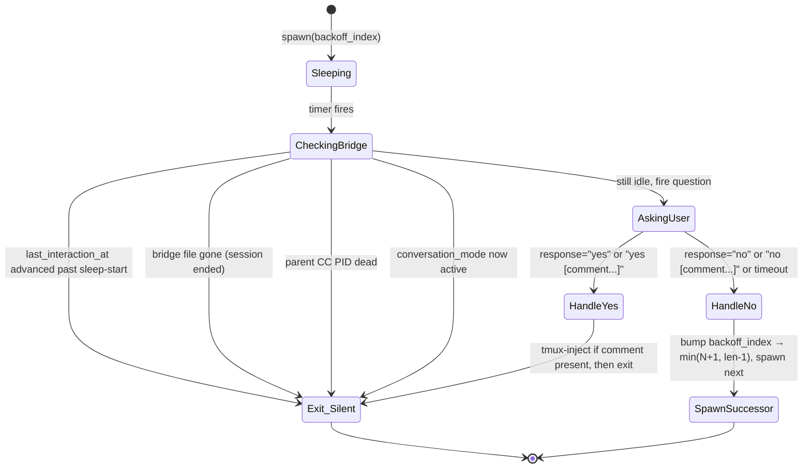

# 01 — Idle-Aware Stop Hook with Exponential Backoff (Design)

**Author session**: d34f2f74 (2026-04-29)
**Plan source**: `~/.claude/plans/peppy-tickling-wolf.md` (approved)
**Status**: Phase 0 — design + execution log being serialized; no code touched yet
**Read-on-resume**: Yes — pair with `90-execution.md` for per-phase progress

---

## Context

The Lupin Claude Code Stop hook (`stop.py:201-300`) currently fires `_ask_anything_else()` immediately at the end of every assistant turn. The hook treats every turn-end as an equilibrium / session-end candidate, so the user gets prompted "Anything else?" every time Claude finishes — even mid-burst when both sides are clearly still actively working. The 60-second response timeout makes the prompt itself slow; the noise discourages flow.

The user explicitly requested repurposing this from "ask on every turn" to "ask only after N minutes of true inactivity", with an **exponential backoff schedule** when the user repeatedly says no. The design must:

1. Defer the ask until the session has been genuinely idle.
2. Reset the idle timer on any signal of activity (user input, Claude turn-end, mid-turn cosa-voice tool calls).
3. Apply exponential backoff so a user who says "no, nothing right now" isn't immediately re-prompted.
4. Preserve the existing conversation-mode skip (TTS dialog is itself activity; idle prompt would interrupt it).
5. Reuse the existing `_ask_anything_else()` ask flow — message build via Gister gist, abstract via session topic + git branch, blocking REST via `notify_user_sync()`, qualifier extraction, tmux injection on "yes [comment:...]".

### Why this is non-trivial

The naive solution — `time.sleep(N) ; ask` inside the Stop hook — fails because:
- Stop hook has a finite execution budget (any subprocess timeout) and is not the right home for multi-minute waits.
- A new user prompt or new Stop firing during the wait must cancel the pending ask.
- Multiple Stop fires within the wait window could spawn parallel waiters → multiple prompts at once.

The state-machine approach below uses a **detached background subprocess** (mirroring the existing `_spawn_listener()` pattern from `register_session.py:149-272`) and uses the per-session bridge file (`~/.claude/sessions/cc-{ppid}.json`) as the coordination point.

---

## Architecture

### State machine



### Cross-component sequence (typical idle cycle)

```mermaid
sequenceDiagram
    participant CC as Claude Code session
    participant Stop as Stop hook
    participant Waiter as idle_waiter.py
    participant Bridge as bridge file
    participant API as POST /api/notify
    participant User as User

    CC->>Stop: turn ends
    Stop->>Bridge: kill prior waiter pid; set last_interaction_at=now
    Stop->>Waiter: spawn detached (backoff_index=N)
    Stop->>CC: emit_json({}) — allow stop
    Note over Waiter: sleep(backoff_minutes[N])
    Waiter->>Bridge: re-read; idle? PPID alive? not in conv mode?
    alt still idle and parent alive
        Waiter->>API: POST /api/notify response_requested=true (yes_no, 60s)
        API->>User: TTS + UI card
        User->>API: "no"
        API->>Waiter: response="no"
        Waiter->>Bridge: backoff_index = N+1 (capped)
        Waiter->>Waiter: spawn successor at backoff_index=N+1
    else reset signal observed
        Waiter->>Waiter: exit silently (no ask, no successor)
    end
```

### Reset triggers (kill any pending waiter and bump `last_interaction_at`)

| Hook | What it observes | Action |
|---|---|---|
| `Stop` | Claude finished a turn | Kill prior waiter; bump `last_interaction_at`; spawn fresh waiter at *current* `backoff_index` (which may be 0 fresh, or N>0 if previous waiter said "no" and the user never came back) |
| `UserPromptSubmit` | User submitted input (typed or voice-injected) | Kill prior waiter; bump `last_interaction_at`; reset `backoff_index = 0`. Do NOT spawn — Stop will spawn after Claude's reply ends |
| `PostToolUse` (filtered to `mcp__cosa-voice__*`) | Claude mid-turn called notify/ask | Kill prior waiter; bump `last_interaction_at`. Do NOT spawn — Stop will spawn at end of turn |

### Why reset on cosa-voice mid-turn (belt-and-suspenders)

In the typical case, Stop fires at turn-end and re-arms the waiter naturally. But there's a window where a previous turn's waiter is mid-sleep and the current turn does cosa-voice calls without yet ending. If the previous waiter wakes during the current turn, it would fire a phantom prompt while Claude is actively talking. Killing on `PostToolUse` for cosa-voice tools closes that window without waiting for the next Stop.

The next Stop will respawn cleanly. So mid-turn we kill but don't respawn — Stop handles the spawn.

---

## State schema

### `~/.claude/settings.json` (new top-level block)

```jsonc
{
  "idle_detection": {
    "enabled": true,                              // false → restore legacy immediate-ask behavior
    "backoff_minutes": [5, 10, 20, 40, 60]        // fixed schedule; index N caps at the last value
  }
}
```

Defaults if missing: `enabled=true`, `backoff_minutes=[5, 10, 20, 40, 60]`.

### Bridge file additions (`~/.claude/sessions/cc-{ppid}.json`)

New nested block alongside existing `voice_persona`:

```json
{
  "idle_detection": {
    "last_interaction_at": "2026-04-29T18:30:00-04:00",
    "backoff_index"      : 0,
    "waiter_pid"         : 12345,
    "waiter_started_at"  : "2026-04-29T18:30:00-04:00"
  }
}
```

Field semantics:
- `last_interaction_at` — ISO8601 with tz; bumped by Stop / UserPromptSubmit / PostToolUse-cosa-voice. Waiter compares `last_interaction_at > waiter_started_at` on wake to decide reset-vs-fire.
- `backoff_index` — index into `settings.idle_detection.backoff_minutes`. Incremented on "no"/timeout; reset to 0 by `UserPromptSubmit`.
- `waiter_pid` — detached helper PID, or null. Set on spawn, cleared on exit/kill.
- `waiter_started_at` — recorded by the waiter at sleep-start so wake-time can compare against `last_interaction_at`.

### Why also use `time.monotonic()` AND ISO timestamps

`time.monotonic()` gives a process-internal tick that's immune to wall-clock jumps (NTP, DST). The waiter records `mono_start = time.monotonic()` and uses `time.monotonic() - mono_start` for elapsed-sleep tracking — this guards the sleep length against system clock drift. The ISO `last_interaction_at` field in the bridge is for cross-process comparison (Stop hook writes wall clock; waiter reads wall clock). Both are needed.

---

## Components

### New files (all under `src/lupin_cli/claude_code/hooks/`)

#### `lib/idle_waiter.py` — the deferred-ask helper

Invoked as: `python -m lupin_cli.claude_code.hooks.lib.idle_waiter --session-id X --ppid Y --backoff-index N`

Detached subprocess pattern: spawned with `start_new_session=True`, stdout/stderr to per-session log files. On startup:
1. Validate args.
2. Read `idle_settings.load_idle_settings()` for the schedule.
3. Compute sleep duration: `wait_secs = backoff_minutes[min(N, len-1)] * 60`.
4. Atomically claim the bridge `waiter_pid` slot. If another PID is already there, exit (lost the race).
5. Record `waiter_started_at = now_iso()`.
6. `time.sleep(wait_secs)` — but in chunks, e.g. 30-second slices, to also poll for `os.kill(ppid, 0)` mid-sleep so a dead-parent waiter exits faster than its full schedule.
7. On wake: re-read bridge, check reset/conv-mode/PPID-alive predicates.
8. If clear to fire: invoke shared helper `anything_else_ask.fire_anything_else(session_id, ...)`; on response, branch (yes/no/timeout); on "no" or timeout, respawn successor.
9. On exit (any path): clear `waiter_pid` from bridge.

#### `lib/idle_settings.py` — settings loader

Single function `load_idle_settings()` returns `{"enabled": bool, "backoff_minutes": [int, ...]}`. Reads `~/.claude/settings.json`, falls back to defaults if file/keys missing. **Validates loudly** — raises `ValueError` on bogus schedule like `["oops"]` or `[5, "ten"]`. Per `feedback_no_defensive_programming`: no silent fallback chains.

#### `lib/anything_else_ask.py` — shared ask helper

Refactor extraction of the current `stop.py:_ask_anything_else()` body. Same Gister gist + session-topic + git-branch abstract + blocking REST + qualifier parse. Returns a structured result dict the caller interprets:

```python
@dataclass
class AnythingElseResult:
    answer       : str          # "yes", "no", or "timeout"
    qualifier    : Optional[str]  # comment text from "[comment: ...]" or None
    raw_value    : str          # full server response_value for logging
    error        : Optional[str]  # exception message on transport failure, or None
```

Stop-time caller builds an `emit_json` block dict from this; waiter caller branches on answer/qualifier and either tmux-injects + exits or schedules a successor.

### Modified files

| File | Change |
|---|---|
| `lib/session_bridge.py` | Add 4 helpers: `get_idle_detection`, `set_idle_detection_field`, `clear_idle_waiter_pid`, `kill_idle_waiter`. Atomic write via tmpfile + rename. |
| `stop.py` | Replace direct `_ask_anything_else()` call with a `_spawn_idle_waiter()` call (mirroring `_spawn_listener()`), gated by `settings.idle_detection.enabled`. Legacy path stays as fallback when `enabled=false`. |
| `user_prompt_submit.py` | At top of `main()`: kill any waiter, reset `backoff_index=0`, bump `last_interaction_at`. |
| `post_tool_use.py` | If tool name starts with `mcp__cosa-voice__`, kill any waiter and bump `last_interaction_at`. |
| `register_session.py` | SessionStart: initialize `idle_detection` block in bridge with current time, `backoff_index=0`, `waiter_pid=null`. `/clear` carry-forward path: preserve `backoff_index`, reset `last_interaction_at` to now, null out `waiter_pid`. |
| `session_end.py` | Kill any live waiter PID before unregistering. |

---

## Race analysis

### Concurrent Stop + UserPromptSubmit

Possible if user submits a new prompt at exactly the moment Claude's previous response finishes. Sequence:
- Stop hook: kill prior waiter, set `last_interaction_at=t1`, spawn fresh waiter at backoff_index=N
- UserPromptSubmit hook: kill that fresh waiter, set `last_interaction_at=t2`, reset `backoff_index=0`

Outcome: latest reset wins. The user got their prompt in, the waiter is dead, no phantom prompt fires. Correct.

Risk: between Stop's "spawn waiter" and UserPromptSubmit's "kill waiter", the waiter could already be running its initial bridge-claim step. If the waiter's PID claim wins the race against UserPromptSubmit's kill, the waiter sleeps; UserPromptSubmit will run again on the next user input and kill it.

Mitigation: the waiter's first action AFTER the bridge claim is to record `waiter_started_at`. Any subsequent reset (including the imminent UserPromptSubmit) will bump `last_interaction_at > waiter_started_at`, so on wake the waiter sees the reset and exits silently. Worst case: a waiter sleeps unnecessarily for one cycle.

### Two Stop fires in close succession

Stop hooks shouldn't fire concurrently for the same session — Claude Code serializes them per-session. But during recovery from a hook block, two Stop firings can occur back-to-back (the second is the "after-block" continuation). Each Stop kills the prior waiter; the latest wins. No phantom waiters.

### Bridge file write race

`session_bridge.py` currently does read-modify-write without fcntl. Two hooks writing different fields simultaneously (e.g. UserPromptSubmit setting `idle_detection.backoff_index=0` while PostToolUse sets `idle_detection.last_interaction_at`) could lose one update.

Mitigation: implement `set_idle_detection_field()` with **atomic tmpfile + rename**. Read-modify-write happens entirely on a tmpfile copy, then `os.rename(tmp, target)` replaces atomically. The remaining race window — between read and rename — is small (microseconds) but non-zero. For the idle-detection use case this is acceptable: the resets are idempotent, the worst case is one missed bump that the next event will replay. Documented explicitly in the helper docstring.

### Waiter spawn race (two Stops, both spawn)

Both Stop hooks try to claim `waiter_pid`. The first one wins; the second sees a non-null `waiter_pid` and aborts (its waiter was just killed by the loser's spawn-time kill but the kill+claim isn't truly atomic). Net effect: one waiter in flight, possibly with an off-by-one sleep duration. Acceptable.

### Network failure during ask

The waiter's `notify_user_sync()` call could fail (server down, network error). Per `feedback_no_defensive_programming`: don't add fallback chains. The waiter logs the error and exits silently — the next user activity will respawn the chain. No retry storm.

### Stale waiter from previous session

If a previous CC session was killed without `session_end.py` running (e.g. SIGKILL, system crash), its waiter could be orphaned. It will eventually wake, find the bridge file gone or PPID dead, and exit silently. Self-cleaning.

---

## Alternatives considered

### A. Cron-style polling daemon

Run a single global daemon that polls all bridge files every minute and fires asks when sessions cross the threshold.

**Rejected**: introduces a new persistent process to manage, complicates deployment, requires lifecycle management. The existing `_spawn_listener()` pattern already proves per-session detached subprocesses work well.

### B. Sleep inside the Stop hook itself

`stop.py` calls `time.sleep(N*60)` then asks.

**Rejected**: Stop hooks should be fast. Long sleeps inside a hook block the Claude Code parent's progression and may be killed by hook timeouts. Also can't be cancelled by UserPromptSubmit.

### C. Single timer process per CC session, fed via signals/IPC

A long-lived daemon spawned at SessionStart that handles all idle detection.

**Rejected**: more complex than necessary. The "detached subprocess that respawns itself" pattern (this design) gives us cancellation-via-kill for free and naturally handles the "cancel on user activity" semantics.

### D. Server-side timer (ask the cosa-voice server to schedule the prompt)

Submit a delayed-fire notification to the server.

**Rejected**: the cosa-voice notify endpoint is fire-and-forget, no built-in scheduling. Adding scheduling server-side would expand server scope. Also, the ask needs session-local state (Gister gist of last assistant message, session topic from bridge) that's harder to ferry through the server.

---

## Test strategy

Per `feedback_comprehensive_automated_testing` and `feedback_tests_parameterize_base_url`:

### Unit (`src/tests/unit/test_idle_waiter.py`, `test_session_bridge_idle.py`)

`requests_mock` for the REST call; `monkeypatch` for `time.sleep` / `time.monotonic`; `tempfile.TemporaryDirectory` for bridge isolation.

Cases:
- Bridge round-trip: `set_idle_detection_field` + `get_idle_detection` preserves all fields.
- Atomic write: simulate concurrent `set_idle_detection_field` calls; verify no field loss for non-overlapping writes.
- Backoff progression: spawn waiter at index N, simulate "no" response, assert successor spawned at `min(N+1, len-1)`.
- Cap: spawn at last index, simulate "no", assert successor stays at last index (doesn't crash, doesn't grow).
- Reset semantics: bump `last_interaction_at` between waiter sleep-start and wake → waiter exits silently, no ask fired.
- Conversation-mode gate: `conversation_mode_active=true` at wake → waiter exits silently.
- Dead-PPID: `os.kill(ppid, 0)` raises `ProcessLookupError` → waiter exits silently.
- "yes" path: tmux-inject helper called iff qualifier present; no successor spawned.
- "no [comment: ...]" path: tmux-inject called with comment; successor still spawned at incremented index.
- Network failure: `notify_user_sync` raises; waiter logs + exits silently, no successor.
- Settings loader: malformed JSON, malformed schedule, missing keys all handled with the documented behavior (defaults for missing, raise for malformed).

### Smoke (`src/tests/smoke/test_idle_waiter_smoke.py`)

Spawn an actual `idle_waiter.py` subprocess with a 5-second sleep override (env var `LUPIN_IDLE_WAITER_TEST_SLEEP_SECS=5` or `--sleep-secs 5` CLI flag for test mode). Verify:
- Bridge state transitions match expected (`waiter_pid` set on spawn, cleared on exit).
- REST mock receives the expected POST.
- "no" → second waiter spawns at index 1 with `LUPIN_IDLE_WAITER_TEST_SLEEP_SECS=5` so the test runs in ~10 seconds.

ALL test files read `BASE_URL` from `LUPIN_API_URL` (default `http://localhost:7999`) per the project testing-patterns skill.

### Manual end-to-end (post-merge, real CC session)

Documented in `90-execution.md`:

1. Set `~/.claude/settings.json` `idle_detection.backoff_minutes = [1, 2, 4]` (test schedule).
2. Restart CC session, do an interaction.
3. After 1 min idle, verify "Anything else?" notification appears.
4. Answer "no" → verify bridge `idle_detection.backoff_index = 1`.
5. After 2 more min, verify next ask.
6. Type a prompt → verify waiter killed, `backoff_index` resets to 0.
7. Restore default schedule.

---

## Open questions (carried from approved plan)

1. **Backoff defaults**: `[5, 10, 20, 40, 60]` chosen as initial value. Tunable via settings.json.
2. **Cap behavior**: stay at last value indefinitely. (Pure cap, not "stop after K attempts".)
3. **Conversation-mode gate**: preserved (waiter never fires when active). User-confirmed.
4. **Multi-session**: each session independent for v1; 3 idle sessions = 3 prompts at the schedule. Future improvement: global lockfile + designated primary session if this becomes a problem.
5. **Tests**: unit + smoke (mocked REST) sufficient pre-merge. Manual e2e checklist documented for post-merge confirmation.

---

## Files touched (planned)

**New** (Lupin parent only — zero CoSA changes per `feedback_lupin_only_never_cosa`):
- `src/lupin_cli/claude_code/hooks/lib/idle_waiter.py`
- `src/lupin_cli/claude_code/hooks/lib/idle_settings.py`
- `src/lupin_cli/claude_code/hooks/lib/anything_else_ask.py`
- `src/rnd/v0.1.7/2026.04.29-idle-aware-stop-hook/01-design.md` (this doc)
- `src/rnd/v0.1.7/2026.04.29-idle-aware-stop-hook/90-execution.md`
- `src/tests/unit/test_idle_waiter.py`
- `src/tests/unit/test_session_bridge_idle.py`
- `src/tests/smoke/test_idle_waiter_smoke.py`

**Modified** (Lupin parent only):
- `src/lupin_cli/claude_code/hooks/lib/session_bridge.py`
- `src/lupin_cli/claude_code/hooks/stop.py`
- `src/lupin_cli/claude_code/hooks/user_prompt_submit.py`
- `src/lupin_cli/claude_code/hooks/post_tool_use.py`
- `src/lupin_cli/claude_code/hooks/register_session.py`
- `src/lupin_cli/claude_code/hooks/session_end.py`
- `~/.claude/settings.json` (NOT in repo — global)
- `~/.claude/CLAUDE.md` (NOT in repo — global)

**Not touched**:
- `src/cosa/` anywhere
- The `/api/notify` REST contract
- `notify_user_sync.py`

---

## Re-audit against feedback memories

(Per `feedback_audit_plans_at_execute_time` — re-audit at write-time, not just author-time.)

- ✅ `feedback_no_defensive_programming` — direct attribute access on bridge dicts; `idle_settings.py` raises on bogus schedule; no silent fallback chains.
- ✅ `feedback_lupin_only_never_cosa` — zero CoSA changes; all work in `src/lupin_cli/claude_code/hooks/`.
- ✅ `feedback_phase0_serialization_prominence` — Phase 0 = this doc; first thing committed; everything else gated on it.
- ✅ `feedback_plans_include_tracking_docs` — `01-design.md` (this) + paired `90-execution.md` (skeleton next).
- ✅ `feedback_comprehensive_automated_testing` — unit + smoke + manual e2e all enumerated above.
- ✅ `feedback_skip_rnd_doc_for_trivial_fixes` — non-trivial (~9 new files, 6 modified); R&D doc warranted.
- ✅ `feedback_never_auto_commit_push` — implementer waits for explicit per-commit auth; no auto-commit anywhere.
- ✅ `feedback_tests_parameterize_base_url` — test design above mandates `LUPIN_API_URL` env-var read; no port literals.

Re-run this audit at code-write time too, especially when refactoring `_ask_anything_else()` (defensive cargo or `getattr` chains there are the most likely place for accidental violations).
