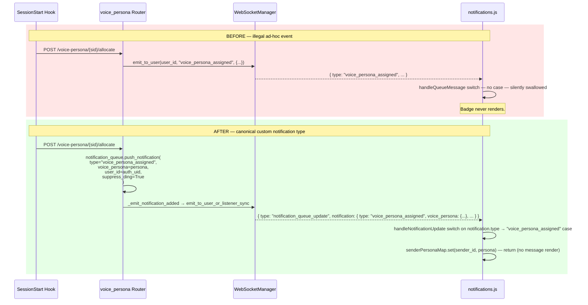

# 01 — Design: ad-hoc WS events → custom `notification_type` values

**Date**: 2026-04-29
**Author**: Claude Opus 4.7 (1M ctx)
**Plan source**: `~/.claude/plans/voice-persona-assigned-is-a-prohibited-tender-fairy.md`
**Status**: Phase 0 — design (this doc) + execution log scaffold (`90-execution.md`)

---

## 1. Context

The per-session voice persona feature (shipped 2026-04-28, R&D doc at `src/rnd/v0.1.7/2026.04.28-per-session-voice-personas/`) and the conversation-mode v1.1 work added **four ad-hoc top-level WebSocket event emissions** that bypass the canonical notification subsystem. Each callsite invents a new top-level WS event type (`"voice_persona_assigned"`, `"voice_persona_released"`, `"conversation_mode_changed"`) and sends it directly via `ws_manager.emit_to_user( user_id, "<event_name>", { ... } )` from inside a feature router.

This is architecturally illegal. The notification subsystem already supports custom event semantics via the `type` parameter on `push_notification(...)` — the same lever that distinguishes `"task"`, `"progress"`, `"alert"`, `"custom"`, `"user_initiated_message"`, and `"session_topic"`. New event semantics belong as new `notification_type` values inside the existing `notification_queue_update` envelope, not as new top-level WS event types. The user mandate is explicit:

> "If we need to push events like this to the server, we should create a custom notification of type='voice_persona_assigned' just like we do for progress updates, which is a special type. No need to go playing with the event subsystem."

This design migrates every offender to that canonical pattern.

**Triggering observation**: a force-refresh of the notifications UI never showed the per-session persona badge for an assigned session, despite the bridge file proving the assignment had succeeded. Investigation traced the failure to two compounding gaps:
- The server emits the `voice_persona_assigned` event but the client has no handler — the dispatcher silently swallows it (`notifications.js:2379-2380` default case).
- The page-load hydration path (`/api/notifications/senders-visible/{email}`) does not include `voice_persona`, so a refreshed UI starts cold with no persona context.

The hydration UX gap is real but **not in scope for this doc**. The architectural cleanup is a prerequisite — once the events flow through the canonical channel, the hydration UX can be designed against a coherent foundation.

---

## 2. Survey — the four offending callsites

### 2.1 `voice_persona.py:186-193` — `voice_persona_assigned`

```python
broadcast_delivered = False
try:
    broadcast_delivered = await ws_manager.emit_to_user(
        authenticated_user_id,
        "voice_persona_assigned",
        {
            "session_id"    : session_id,
            "voice_persona" : persona
        }
    )
except Exception as ws_err:
    print( f"[VOICE-PERSONA] ⚠️ WS broadcast failed for session {session_id}: {ws_err}" )
```

Trigger: `POST /voice-persona/{session_id}/allocate` returns a *newly-allocated* persona (idempotent return at `:152-159` and `:164-171` does NOT broadcast).

### 2.2 `voice_persona.py:238-245` — `voice_persona_released`

```python
broadcast_delivered = False
try:
    broadcast_delivered = await ws_manager.emit_to_user(
        authenticated_user_id,
        "voice_persona_released",
        {
            "session_id"             : session_id,
            "released_persona_name"  : existing.get( "name" )
        }
    )
except Exception as ws_err:
    print( f"[VOICE-PERSONA] ⚠️ WS release-broadcast failed for session {session_id}: {ws_err}" )
```

Trigger: `POST /voice-persona/{session_id}/release` clears a previously-allocated persona.

### 2.3 `conversation_mode.py:175-184` — `conversation_mode_changed` (displaced)

```python
await ws_manager.emit_to_user(
    authenticated_user_id,
    "conversation_mode_changed",
    {
        "session_id"               : other_sid,
        "conversation_mode_active" : False,
        "displaced"                : True,
        "displaced_by"             : session_id
    }
)
```

Trigger: activating conversation mode on session A while session B is already active — B is displaced and notified.

### 2.4 `conversation_mode.py:201-208` — `conversation_mode_changed` (activate/deactivate)

```python
broadcast_delivered = await ws_manager.emit_to_user(
    authenticated_user_id,
    "conversation_mode_changed",
    {
        "session_id"               : session_id,
        "conversation_mode_active" : body.active
    }
)
```

Trigger: `POST /conversation-mode/{session_id}` toggles the bridge field; broadcast notifies all the user's connected UIs.

### 2.5 Client status today

| Event | Client handler | File:line |
|-------|----------------|-----------|
| `voice_persona_assigned` | absent | — (silently swallowed at `notifications.js:2379-2380` default case) |
| `voice_persona_released` | absent | — (silently swallowed) |
| `conversation_mode_changed` | top-level case | `notifications.js:2357-2361` → `handleConversationModeChanged()` at `:8922-8962` |

The persona events are not just architecturally wrong — they're *invisible* on the client. The conversation-mode event has a handler but it's hooked to the illegal channel.

---

## 3. Migration target — the canonical subsystem

### 3.1 `NotificationItem` and `push_notification`

`src/cosa/rest/notification_fifo_queue.py:15-27` — `NotificationItem.__init__` is open-typed on `type: str`. It already carries event-relevant fields (`voice_persona`, `sender_id`, `user_id`, `suppress_ding`). It does **not** today carry a generic structured-data dict.

`src/cosa/rest/notification_fifo_queue.py:257-269` — `push_notification(...)` mirrors the same signature. After construction, `_emit_notification_added()` (`:381-450`) wraps the item's `to_dict()` inside the top-level event `"notification_queue_update"` and routes it via `ws_manager.emit_to_user_or_listener_sync()` / `emit()`.

### 3.2 Validation list

`src/cosa/rest/routers/notifications.py:342`:

```python
valid_types = [ "task", "progress", "alert", "custom", "user_initiated_message", "session_topic" ]
```

This is the gate. Adding new `type` values requires extending this list.

### 3.3 Client dispatch

`src/fastapi_app/static/js/notifications.js:2200-2381` — top-level `switch ( envelope.type )` inside `handleQueueMessage()`. The `"notification_queue_update"` case at `:2338-2340` calls `handleNotificationUpdate( envelope )`, which reads `envelope.notification` and dispatches by `notification.type` for rendering.

**This is the migration target.** New custom `type` handlers belong inside `handleNotificationUpdate`, not as new top-level cases in `handleQueueMessage`.

---

## 4. Before / after diagram



---

## 5. Migration matrix

| # | Callsite | New type | Payload carrier | Idempotency notes |
|---|----------|----------|-----------------|-------------------|
| 1 | `voice_persona.py:186-193` | `voice_persona_assigned` | existing `voice_persona` field | place inside the `if existing is None` branch (do not re-broadcast on idempotent return) |
| 2 | `voice_persona.py:238-245` | `voice_persona_released` | `voice_persona = { "name": <released_name>, "released": True }` | only fired when `existing is not None` (already gated) |
| 3 | `conversation_mode.py:175-184` | `conversation_mode_changed` | new generic `payload` field: `{ "active": False, "displaced": True, "displaced_by": session_id }` | `sender_id` carries the displaced session, `user_id` is the requestor |
| 4 | `conversation_mode.py:201-208` | `conversation_mode_changed` | new generic `payload` field: `{ "active": body.active }` | unchanged trigger gating |

---

## 6. Schema decisions

### 6.1 New field on `NotificationItem`: `payload: Optional[dict] = None`

**Why generic, not per-event fields**: `conversation_mode_changed` carries `active`, `displaced`, `displaced_by` — three event-specific fields. Adding them as one-off `Optional[bool]` / `Optional[str]` columns on `NotificationItem` couples the schema to event semantics that don't generalize. A generic `payload: Optional[dict]` field carries any structured data for any future custom-typed notification with one schema change instead of N.

**`voice_persona` field stays for typed access**: voice-persona events already have a structured field; we don't need to dump them into `payload`. Hybrid pattern: known-shape data uses typed fields, novel-shape data uses `payload`.

**`to_dict` rule**: skip `payload` when `None` to avoid bloating the wire format for normal notifications.

### 6.2 `valid_types` extension

`src/cosa/rest/routers/notifications.py:342`:

```python
valid_types = [
    "task", "progress", "alert", "custom",
    "user_initiated_message", "session_topic",
    # New custom state-update types (server-internal events routed through notifications):
    "voice_persona_assigned",
    "voice_persona_released",
    "conversation_mode_changed",
]
```

These three values gate the externally-facing `POST /api/notifications/push` endpoint. Internal `push_notification` callers from other routers do not pass through this validation — but listing the values here keeps the registry visible and lets external integrations push these types if ever needed.

### 6.3 Behavioral defaults for the migrations

All four migrations adopt:
- `message = ""` — the events are silent state-change signals, not user-facing text. The client return-early path means `message` never renders.
- `suppress_ding = True` — no audio cue.
- `response_requested = False` — fire-and-forget.
- `priority` defaults to `"medium"` (no special routing needed; matches the silent-state nature).

---

## 7. Client-side dispatch changes

### 7.1 Remove top-level case (one delete)

`src/fastapi_app/static/js/notifications.js:2357-2361`:

```javascript
// REMOVE — the event no longer arrives at the top level:
case "conversation_mode_changed":
    this.handleConversationModeChanged( envelope );
    break;
```

### 7.2 Add three new dispatches inside `handleNotificationUpdate`

```javascript
// Inside handleNotificationUpdate, after notification = envelope.notification, BEFORE the render-as-message path:
switch ( notification.type ) {
    case "voice_persona_assigned":
        // Hydrate map only — DOM patch is a follow-up plan (Layer A).
        if ( notification.sender_id && notification.voice_persona ) {
            this.senderPersonaMap.set( notification.sender_id, notification.voice_persona );
        }
        return;

    case "voice_persona_released":
        if ( notification.sender_id ) {
            this.senderPersonaMap.delete( notification.sender_id );
        }
        return;

    case "conversation_mode_changed":
        this.handleConversationModeChanged({
            session_id              : notification.payload?.session_id   ?? notification.sender_id,
            conversation_mode_active: notification.payload?.active,
            displaced               : notification.payload?.displaced,
            displaced_by            : notification.payload?.displaced_by
        });
        return;
}
// fall through to existing render-as-message path for normal types
```

### 7.3 `handleConversationModeChanged` arg-shape

`notifications.js:8922-8962` already takes a dict; the keys it reads (`session_id`, `conversation_mode_active`, `displaced`, `displaced_by`) match the re-shaped object literal above. Verify during Phase 3 that no key was renamed.

---

## 8. Verification plan

### 8.1 Server unit + smoke (`:7999`, AI-discretionary)

```bash
pytest src/tests/unit/test_voice_persona_helpers.py -v
pytest src/tests/smoke/test_voice_persona_allocation.py -v
pytest src/tests/unit/ -v   # full regression sweep
```

### 8.2 Automated WS-frame capture E2E (`:7999`, AI-discretionary)

A new smoke test (`src/tests/smoke/test_ws_event_cleanup.py`) connects to `/ws/queue/{session_id}` as the test user, triggers `/allocate`, `/release`, and `/conversation-mode/{sid}` round-trips, and asserts:

- `notification_queue_update` envelope arrives carrying `notification.type` ∈ { `voice_persona_assigned`, `voice_persona_released`, `conversation_mode_changed` }.
- `notification.voice_persona` is populated for the persona events.
- `notification.payload` is populated for the conversation-mode events.
- **No** top-level WS frame with `event === "voice_persona_assigned"` / `"voice_persona_released"` / `"conversation_mode_changed"` arrives — the old illegal channel must be silent.

This automates what would otherwise be a "manual E2E" — per the user-is-never-the-tester mandate, the AI owns this verification.

### 8.3 Client smoke (browser console after live round-trip)

- `window.notificationsUI.senderPersonaMap.get( "<sender_id>" )` → persona dict after `/allocate`, `undefined` after `/release`.
- Conversation-mode toggle button visual state still flips correctly through the new dispatch path.

These are quick post-deploy sanity checks — automated via the WS-capture test above; the browser path is a belt-and-suspenders confirmation.

---

## 9. Risk register

| Risk | Severity | Mitigation |
|------|----------|------------|
| `push_notification(user_id=X)` may not reach the same WS sessions as `emit_to_user(X, ...)` | medium | Verify during Phase 2 that `_emit_notification_added` routes via `emit_to_user_or_listener_sync` keyed on `user_id`. If the path differs, document the difference and adjust before Phase 3. |
| Tests assert old top-level event names | low | Phase 4 audits `test_voice_persona_allocation.py` + any `test_conversation_mode_router.py` and updates assertions in lockstep |
| `payload` field interacts badly with serialization | low | Add as `Optional[dict] = None`; skip in `to_dict` when `None`. No persistence layer touches `NotificationItem` (FIFO queue is in-memory). |
| Adding 3 new `valid_types` breaks tests asserting the exhaustive list | low | Audit `test_notifications_router.py` for list-equality assertions; update + add positive tests per new type |
| Client-stale window during deploy: old client + new server | low | Server and client ship together. Brief mismatch makes persona events invisible (same as today) and conversation-mode toggle stale until refresh — not user-blocking. |

---

## 10. Layer A + B (in-scope addendum, 2026-04-29 mid-session)

After the Phase 0–6 cleanup landed and verified, the user observed that the persona badge still didn't render in the sender card header on a force-refresh. Root cause traced to two surviving rendering gaps that the architectural migration didn't touch:

- **Gap A (live-event rendering)**: `voice_persona_assigned` notifications now arrive on the canonical channel and hydrate `senderPersonaMap`, but the existing sender-card header DOM was already built (badge-less) at first render. The map update doesn't trigger a re-render, so the badge stays absent for the lifetime of the card.
- **Gap B (page-load rendering)**: `/api/notifications/senders-visible/{email}` returns the sender list without `voice_persona`, so on a force-refresh `senderPersonaMap` is empty when `createSenderCard` runs and the card is built without the badge before any live notification arrives.

Both are addressed inline in this branch (user authorization 2026-04-29 mid-session). Original parking-lot plan for separate follow-up is dissolved.

### Layer A — client patches existing card DOM in place

`src/fastapi_app/static/js/notifications.js`:
- Extract a `_renderPersonaBadge( persona )` helper returning the badge `<span>` HTML (centralizes the markup so `createSenderCard` and the live patch both use it).
- In the new `voice_persona_assigned` dispatch case, after hydrating `senderPersonaMap`, locate the existing sender card by `sender_id`, find its header, and insert (or replace) the badge after `.sender-session-name` and before `.sender-stats-group`.
- In the `voice_persona_released` dispatch case, remove the badge from the card if present.

No CSS changes — uses the existing `.persona-badge` rule from `notifications.css:1730-1772`.

### Layer B — server stamps `voice_persona` on the senders-visible response

`src/cosa/rest/routers/notifications.py`:
- The `senders-visible/{user_email}` route resolves each sender's persona via the existing `_voice_persona_for_sender_id( sender_id )` helper (already defined at `:36-55`) and adds a `voice_persona` field to each sender entry in the response.

`src/fastapi_app/static/js/notifications.js`:
- At the `senders-visible` fetch callsite (around `:10240`), iterate the returned senders and pre-populate `senderPersonaMap` with each entry's `voice_persona` (when non-null) **before** `createSenderCard` runs. Result: first paint after force-refresh includes the badge.

### Why these are still strict additions (not refactors)

The architectural migration in Phases 1–5 created exactly the canonical data path needed:
- `voice_persona_assigned` reliably arrives via `notification_queue_update` → Layer A has a single, clean entry point.
- The senders-visible response is the only authoritative listing that runs at page load → Layer B has a single, clean entry point.

Without the cleanup, Layer A would have had to bind to a top-level WS event (illegal) and Layer B would have had to either change the WS subscription contract or invent a new endpoint. The cleanup makes both ~30-line additions instead.

---

## 11. Implementation phases

| Phase | Subject | Status |
|-------|---------|--------|
| 0 | Write `01-design.md` (this doc) + scaffold `90-execution.md` | complete |
| 1 | Extend `valid_types` + add `payload` field to `NotificationItem` + `push_notification` + `to_dict` | complete |
| 2 | Migrate 4 router callsites to `push_notification` | complete |
| 3 | Relocate client dispatch into `handleNotificationUpdate` | complete |
| 4 | Update affected tests + run unit/smoke regression on `:7999` | complete |
| 5 | Author + run automated WS-frame capture E2E verification | complete |
| 6 | Mid-execution checkpoint (`90-execution.md` §Phase 0–6 complete) | complete |
| 7 | Doc addendum: §10 Layer A + B moved from out-of-scope to in-scope | in progress |
| 8 | Layer A — client patches existing card DOM on voice_persona_assigned/released | pending |
| 9 | Layer B — senders-visible carries `voice_persona` + client hydrates on page load | pending |
| 10 | Tests for Layer A + B + final regression + combined commit proposal | pending |

Per-phase progress is tracked in `90-execution.md` (BFE pattern: design here, execution log there, paired).

---

## 12. References

- User-flagged feedback: `~/.claude/projects/-mnt-DATA01-include-www-deepily-ai-projects-lupin/memory/feedback_acknowledge_receipt_before_tool_work.md` (drove the conversation-mode contract that surfaced this architectural debt).
- Plan source: `~/.claude/plans/voice-persona-assigned-is-a-prohibited-tender-fairy.md`.
- Per-session voice persona R&D: `src/rnd/v0.1.7/2026.04.28-per-session-voice-personas/01-design.md` (the original feature ship).
- Conversation mode v1.1 design: `src/rnd/v0.1.7/2026.04.27-conversation-mode-design.md` (sibling co-offender source).
- Notification subsystem entry points: `src/cosa/rest/notification_fifo_queue.py`, `src/cosa/rest/routers/notifications.py`.
