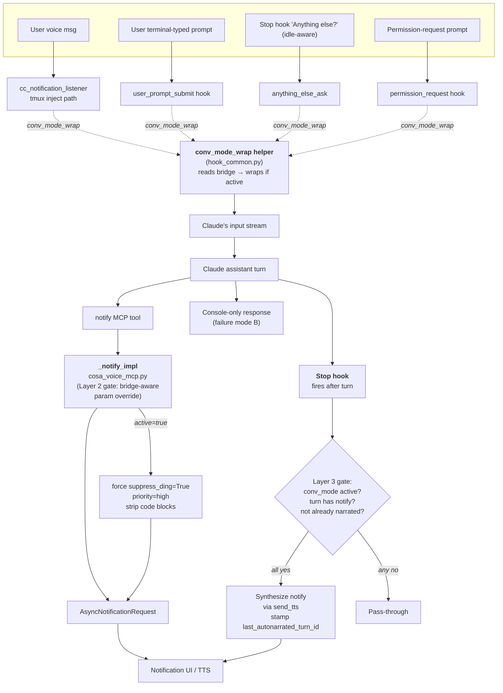

# Conversation Mode — Three-Layer Mic-Monopoly Enforcement

**Date**: 2026-04-30
**Branch**: `wip-v0.1.7-2026.04.22-spit-and-polish-for-cjflow-tfe-and-bfe`
**Session**: 406cadbf
**Status**: 🟡 Plan drafted + post-adversarial-review revisions applied 2026-04-30; awaiting user authorization to execute
**Pattern**: 1 (Feature Development) — multi-phase, ~1-2 day scope
**Plan file (origin)**: this document
**Predecessor**: `src/rnd/v0.1.7/2026.04.27-conversation-mode-design.md` §11 (Mutual Exclusion Addendum)

---

## 1. Context & Motivation

The conversation-mode v1.1 mic-monopoly mutex (designed 2026-04-28, §11 of the parent design doc) coordinates **three** state surfaces:

1. Bridge file at `~/.claude/sessions/cc-{PPID}.json` — canonical, server-managed
2. UI cache (localStorage + DOM) — broadcast-driven via `conversation_mode_changed` WS event
3. **Claude's in-session belief about `conversation_mode_active`** — set ONCE at SessionStart via `get_session_info()`, never refreshed

Surfaces 1 + 2 are correctly wired. Surface 3 is the architectural gap. Confirmed by source inspection of `src/lupin_mcp/cosa_voice_mcp.py`:

- `_notify_impl()` (lines 677-742) does not consult the bridge — pure passthrough to `notify_user_async`.
- `notify()` (lines 745-793) is a pure delegate to `_notify_impl`.
- `get_conversation_mode()` is referenced only at line 74 (import) and lines 1207-1208 (inside `get_session_info()` to populate the response dict).

**Observed symptoms**:
- **A. Param drift**: Claude calls `notify(...)` with stale params (e.g., `priority="medium"` when conv mode requires `"high"`).
- **B. Console-only turn**: Claude writes its response to the terminal and never calls `notify()` at all — text never crosses the MCP boundary, no TTS reaches the user.
- **C. Multi-session cross-talk**: User reported (2026-04-29) hearing multiple sessions auto-narrate simultaneously after toggling conv mode between sessions. Root cause: the displaced session's Claude has cached `conversation_mode_active=true` from SessionStart and continues calling `notify()` with conv-mode params, even though the bridge has flipped to false and the UI has unpinned the card.

---

## 2. Locked Decisions (from interactive design discussion 2026-04-30)

| # | Question | Decision | Rationale |
|---|---|---|---|
| 2.1 | Where does state propagation live? | **Bridge file remains the single channel.** No fan-out from FastAPI to N MCP processes. Each per-CC-session MCP subprocess reads its own bridge. | The mechanism already exists; the gap was on the read side, not the write side. Avoids new IPC infrastructure. |
| 2.2 | How many enforcement layers? | **Three, additive.** Wrapper at injection time + param override in `_notify_impl` + Stop hook auto-narrate safety net. | Single-layer enforcement is brittle; three independent layers form defense-in-depth. |
| 2.3 | Where does the input wrapper apply? | **Inbound-to-Claude text injection points only**: voice listener `_inject_via_tmux`, `user_prompt_submit` hook, `anything_else_ask` idle prompt, any `pre/post_tool_use` hook paths that synthesize text into Claude's input. **NOT** outbound paths (`permission_request.py`'s TTS-to-user ack, all hook-emitted TTS notifications, tool result returns). The distinction matters: outbound text never reaches Claude as input, so wrapping it is meaningless and would corrupt the user's TTS feed. | Per `feedback_enumerate_all_activation_paths` — generalize the rule, but along the right axis. Inbound vs outbound is the discriminator, not voice vs everything-else. (Revised post-adversarial-review F3.) |
| 2.4 | Wrapper format | **Two-surface XML with input sanitization**: prepend `<voice-message from-distance="true" priority="high" suppress-ding="true">{sanitized_user_content}</voice-message>` for `source="voice"`, then append `<system-reminder>…</system-reminder>` (action contract). For non-voice sources, drop `<voice-message>` and keep only the system-reminder. **Input sanitization** (per §2.4a below) closes the structural escape vector without losing the semantic framing. | (Revised 2026-04-30 per user direction — supersedes the append-only revision from the F2 adversarial-review pass.) The append-only fix overcorrected by giving up legible XML framing that Claude parses cleanly. Sanitization at the listener boundary is the better-shaped fix: keeps the semantic framing intact, closes the specific escape vector that motivated F2. |
| 2.4a | Input sanitization | Before substituting `{user_content}` into the wrapper template, strip from the FIRST occurrence of either literal `</voice-message` or `<system-reminder` (case-insensitive, no closing `>` required) to end-of-string. Both markers truncate; whichever appears first wins. Implementation lives in `hook_common.py` alongside `conv_mode_wrap`. | Closes the F2 escape vector deterministically: user content cannot close the voice-message tag early, cannot inject a fake `<system-reminder>`. False-positive cost (truncating a legitimate sentence containing those literal sequences) is acceptable — voice transcription almost never produces angle-bracketed XML markup, and if it ever does the truncation is preferable to the injection risk. |
| 2.5 | When does the param override fire? | **Bidirectional gate** in `_notify_impl`. (Revised post-adversarial-review F1.) **Bridge=TRUE**: force `suppress_ding=True`, force `priority="high"` if currently lower, strip fenced code blocks from message. **Bridge=FALSE + sender_id starts with `claude.code@` + caller passed `suppress_ding=True`**: force `suppress_ding=False` so the user hears an audible ding signaling "this CC session is NOT in conv mode but is acting like it is" (cross-talk audible cue). Priority pass-through in this case — legitimate `priority="high"` alerts (build broke, urgent error) survive. **Internal callers** (e.g., `set_session_topic`) must pass `_internal_call=True` to bypass the gate entirely. | Symmetric enforcement: gate enforces conv-mode params when conv mode is on, AND gives audible feedback when a displaced session leaks TTS. The audible-ding signal is a small, deterministic intervention that fixes the original cross-talk symptom without fighting Claude's cached belief. |
| 2.6 | When does the Stop hook auto-narrate fire? | **Only when** (a) `conversation_mode_active=true`, AND (b) the last assistant turn contains zero `mcp__cosa-voice__notify` ToolUseBlocks, AND (c) `last_autonarrated_turn_id` in the bridge != current turn id (dedup). | Avoids double-narration. Falls back to silent pass-through if any condition fails. |
| 2.7 | Hook discipline-drift hard-gate | **No.** Wrapper + override + auto-narrate is sufficient defense in depth. Reject hard interrupts (per the existing decision 11.7 in §11 — "let A finish current turn"). | Each layer is locally reasoned; the safety net catches the cases where Claude ignored the wrapper. |
| 2.8 | Multi-worker uvicorn lock concern | **Out of scope** (existing risk noted in §11). `asyncio.Lock` is process-local; if Lupin moves to `--workers N`, mutex moves to Redis or DB advisory lock. | Already documented; not introduced by this work. |

---

## 3. Architecture (after enforcement layers)



---

## 4. Phases

### Phase 0 — R&D doc serialization (THIS doc + paired execution log skeleton)

**Status**: ✅ in progress
**Files**:
- `src/rnd/v0.1.7/2026.04.30-conv-mode-three-layer-enforcement/01-design.md` (this file)
- `src/rnd/v0.1.7/2026.04.30-conv-mode-three-layer-enforcement/90-execution.md` (skeleton)

### Phase 1 — Layer 1: `conv_mode_wrap` helper + `sanitize_for_wrap`

**Goal**: single canonical helper that wraps text with the conv-mode XML envelope, gated on bridge state. Sanitization closes the F2 escape vector without sacrificing semantic framing. (Revised 2026-04-30 per user direction.)

**Files**:
- `src/lupin_cli/claude_code/hooks/lib/hook_common.py` (extend) — TWO functions:

**`sanitize_for_wrap(text: str) -> str`**:
  - Find the lowest non-negative index of either literal `</voice-message` or `<system-reminder` (case-insensitive substring search).
  - If neither marker found: return `text` unchanged.
  - If found: return `text[:lowest_index]` (truncate from marker to end-of-string).
  - Standalone, unit-testable.

**`conv_mode_wrap(text, *, source: str, session_id: str | None = None) -> str`**:
  - Reads `get_conversation_mode(session_id)`; if False, returns `text` unchanged (no sanitization, no wrap — pass-through).
  - If True:
    1. Sanitize: `clean = sanitize_for_wrap(text)`.
    2. Build wrapper based on `source`:
       - `source="voice"`: `<voice-message from-distance="true" priority="high" suppress-ding="true">\n{clean}\n</voice-message>\n<system-reminder>\n{reminder_body}\n</system-reminder>`
       - `source="terminal-typed"` / `source="hook-idle-prompt"` / `source="hook-permission-prompt"`: `{clean}\n\n<system-reminder>\n{reminder_body_for_source}\n</system-reminder>` (no `<voice-message>` wrap because the source isn't voice; the only escape vector worth defending is the voice-message tag, but sanitization runs anyway as belt-and-suspenders for the system-reminder injection).
  - Reminder body varies by source (concrete strings TBD in code, conceptually:
    - `source="voice"`: "The user spoke the above as a voice message from a distance. Conversation mode is active. After your response, call `notify(message=<full text of your reply>, suppress_ding=True, priority='high')`. Strip fenced code blocks from the spoken text. The user is listening via TTS."
    - other sources: variant naming the source for traceability.
  - Idempotency: helper is safe to call multiple times on the same string; second call detects existing wrapper sentinel and returns input unchanged.

**No threading yet** — just the two helpers + unit tests covering: sanitization at neither/first/second/both markers, wrap-when-active, pass-through-when-inactive, idempotency, source-variant reminder text.

### Phase 2 — Layer 1 threading through INBOUND injection points only

**Goal**: every **inbound-to-Claude** text injection point routes through `conv_mode_wrap`. **Outbound** TTS-to-user paths are explicitly NOT touched. (Revised post-adversarial-review F3: distinguish inbound from outbound.)

**Inbound paths to wrap**:
- `src/lupin_cli/claude_code/hooks/lib/cc_notification_listener.py` — `_inject_via_tmux` wraps drained voice text via `conv_mode_wrap(text, source="voice", session_id=self.session_id_hash)` before `tmux send-keys`. ✅ inbound (text injected into Claude's stdin via tmux).
- `src/lupin_cli/claude_code/hooks/user_prompt_submit.py` — wrap user prompt via `conv_mode_wrap(prompt, source="terminal-typed", session_id=...)` before passing through. ✅ inbound.
- `src/lupin_cli/claude_code/hooks/lib/anything_else_ask.py` — wrap the "Anything else?" prompt text via `conv_mode_wrap(prompt, source="hook-idle-prompt", session_id=...)` before injection. ✅ inbound (synthesized prompt fed back to Claude).

**Outbound paths explicitly NOT wrapped** (Phase 2 only verifies these aren't accidentally touched):
- `src/lupin_cli/claude_code/hooks/permission_request.py` — sends TTS notifications **TO USER** via `send_tts()` and `_forward_to_user()`. Outbound. The user's response (yes/no) flows back to Claude via the standard user_prompt_submit path, which is already wrapped above. No additional wrap here.
- `src/lupin_cli/claude_code/hooks/notification.py` — outbound TTS only.
- `cc_notification_listener._send_gist_response` (the path we just fixed in commit `2eaeffc`) — outbound TTS receipt.

**Pre/Post tool use audit**:
- `src/lupin_cli/claude_code/hooks/pre_tool_use.py` and `post_tool_use.py` — audit for any text-injection paths that feed text BACK into Claude's input. If found, wrap. If only outbound TTS announcements ("Calling Bash..."), leave alone.

**Sweep mandate**: per `feedback_sweep_for_pattern_offenders`, grep parent + nested repos for any other `tmux send-keys` or stdin-injection patterns AND any `subprocess.run(... [input=...])` patterns that pipe to Claude Code's stdin. Document findings in §7 Sweep Check; patch all inbound offenders or document as benign / outbound.

### Phase 3 — Layer 2: `_notify_impl` bidirectional gate

**Goal**: deterministic, symmetric enforcement of conv-mode params + audible cross-talk cue. (Revised post-adversarial-review F1, F4, F5.)

**Files**:
- `src/lupin_mcp/cosa_voice_mcp.py` — modify `_notify_impl()`:

**Session resolution (F4)**: use the same dynamic resolution pattern as `_flip_conversation_mode` (see lines 1247-1252):
```python
try:
    cc_meta = _get_cc_metadata()
    sid = cc_meta.get( "stable_session_id" ) or cc_meta.get( "session_id" ) or SESSION_ID
except Exception:
    sid = SESSION_ID
```
This avoids stale module-level `SESSION_ID` causing wrong bridge reads.

**Internal-call escape hatch (F5)**: extend `_notify_impl` signature with `_internal_call: bool = False`. When `True`, bypass the gate entirely — pass params through unchanged. Update `set_session_topic` and any other internal callers to pass `_internal_call=True` to opt out.

**Bidirectional gate logic (F1)**:
```
sid = (resolved as above)
active = get_conversation_mode(sid)
sender = _wait_for_sender_id()  # already in _notify_impl

if _internal_call:
    pass through unchanged

elif active:
    # Conv mode ON — enforce conv-mode params
    force suppress_ding = True
    if priority < "high": force priority = "high"
    strip fenced code blocks from message

elif (not active) and sender.startswith("claude.code@") and (suppress_ding == True):
    # Conv mode OFF but caller is a CC session asking for silent TTS —
    # cross-talk leak. Audible-cue intervention: force suppress_ding=False
    # so user hears a ding, signaling "this session leaked." Priority
    # passes through unchanged so legitimate priority='high' alerts
    # (notification_type="alert", build-broke notifications, etc.) survive.
    force suppress_ding = False
    log at INFO: "conv-mode cross-talk cue: suppress_ding inverted for {sender}"

else:
    pass through unchanged
```

**Scope discipline**: gate applies ONLY to `notify()` and its internal `_notify_impl` callers. Does NOT touch `ask_yes_no`, `ask_multiple_choice`, `ask_open_ended_batch`, or `converse` — those are query tools, not narration tools.

**Code-block stripping helper**: extract `strip_fenced_code_blocks(text) -> str` as a small standalone function so it's unit-testable in isolation. Strip ` ```lang...``` ` blocks (any language tag); preserve inline `code` spans (single-backtick).

### Phase 4 — Layer 3: Stop hook auto-narrate

**Goal**: synthesize a `notify()` when conv mode is active and the assistant turn ended without one.

**Files**:
- `src/lupin_cli/claude_code/hooks/stop.py` — new logic at the front of the stop hook (BEFORE the existing idle-aware `_arm_idle_waiter()` call):
  - If `get_conversation_mode(session_id)` is False: pass through.
  - Read transcript via `transcript_path` from hook payload (JSONL format).
  - Find last assistant message; iterate content blocks.
  - If any `ToolUseBlock.name == "mcp__cosa-voice__notify"`: pass through (Claude self-narrated).
  - Read `last_autonarrated_turn_id` from bridge; if matches current turn id: pass through (already narrated).
  - Else: extract text from `TextBlock`s, strip fenced code blocks, drop tool-call narration paragraphs, call `send_tts(narration_text, priority="high", suppress_ding=True)`, then `set_last_autonarrated_turn_id(session_id, turn_id)` in bridge.
  - Bracket all of this in try/except — auto-narrate failures must not block Claude.

**New bridge helper**:
- `src/lupin_cli/claude_code/hooks/lib/session_bridge.py` — add `get_last_autonarrated_turn_id(session_id)` and `set_last_autonarrated_turn_id(session_id, turn_id)` helpers.

**Coexistence with idle-aware Stop hook** (Phase 5 of `2026.04.29-idle-aware-stop-hook`):
- Auto-narrate runs FIRST, idle-waiter arms AFTER.
- Auto-narrate is gated on conv mode; idle-waiter is gated on conversation_mode being OFF (existing behavior — TTS dialogue is itself active engagement).
- No interaction between them — they target orthogonal scenarios.

### Phase 5 — Comprehensive automated testing

Per `feedback_comprehensive_automated_testing` — every layer of the test pyramid. (Revised post-adversarial-review F8: integration-style assertions added per Phase 2 callsite.)

| Layer | Target | Suite | Venue |
|---|---|---|---|
| `py_compile` | All Python files edited | per-edit | local |
| Import chain | hook_common, session_bridge, cosa_voice_mcp, all touched hooks | post-Phase per phase | local |
| Unit | `sanitize_for_wrap` helper (neither marker, only `</voice-message`, only `<system-reminder`, both — first wins, case-insensitive match) | `src/tests/unit/test_conv_mode_wrap.py` (NEW) | :7999 |
| Unit | `conv_mode_wrap` helper (active/inactive gate, voice vs non-voice source, idempotency, sanitization runs before wrap) | same file | :7999 |
| Unit | `_notify_impl` bidirectional gate: bridge=true forces params, bridge=false + CC sender + suppress_ding=True forces ding ON, bridge=false + non-CC sender pass-through, `_internal_call=True` bypasses entirely, code-block stripping correctness | `src/tests/unit/test_notify_impl_conv_mode_override.py` (NEW) | :7999 |
| Unit | `strip_fenced_code_blocks` helper (multi-language fences, nested fences, inline code preservation, edge cases) | extend the override test file | :7999 |
| Unit | Stop-hook auto-narrate (dedup via turn id, skip when notify present, transcript parsing, code-block stripping, missing transcript_path graceful failure) | `src/tests/unit/test_stop_hook_auto_narrate.py` (NEW) | :7999 |
| Unit | Bridge `last_autonarrated_turn_id` round-trip + per-session isolation | extend `test_session_bridge_lookup.py` | :7999 |
| **Integration (Phase 2 callsites)** | Each threaded callsite (`_inject_via_tmux`, `user_prompt_submit` hook, `anything_else_ask`) actually invokes `conv_mode_wrap` once with the correct `source` and `session_id` — mock the helper, assert call count + kwargs | extend each callsite's existing test or add new `test_conv_mode_wrap_threading.py` | :7999 |
| Smoke | `cc_notification_listener._inject_via_tmux` wrap behavior (mocked tmux subprocess, asserts wrapped text passed to send-keys) | extend `test_cc_notification_listener.py` | :7999 |
| WebSocket smoke | Existing conv-mode mutex tests still pass (regression check) | `src/scripts/run-websocket-smoke-tests.sh` | :7999 |
| Smoke (live `:7999`) | Voice msg → wrapper → Claude turn → notify with override params → UI receives correct envelope (dry-run mode acceptable) | `src/tests/smoke/test_conv_mode_three_layer_e2e.py` (NEW, dry-run-able) | :7999 |
| **E2E gated** (Phase 6) | Multi-session manual: A active → speak → narrates; toggle B → A displaced → A's next turn does NOT auto-narrate; cross-talk cue audible if A's Claude leaks notify; B narrates correctly | manual + Playwright extension | **:8000 user-confirmed slot** |

### Phase 6 — Live multi-session verification (USER GATE)

Per `feedback_e2e_two_phase_gate`: this phase stops at the gate. (Revised post-adversarial-review F1: matrix expanded to test the cross-talk cue.)

**User confirms** before execution:
- No parallel CC sessions outside the test
- :8000 slot available (or :7999 acceptable since this is dev verification)
- Conversation mode is currently OFF on all sessions

**Verification matrix**:
| # | Scenario | Expected |
|---|---|---|
| 1 | Toggle A on → speak voice msg | A's Claude receives sanitized voice text wrapped in `<voice-message from-distance="true" priority="high" suppress-ding="true">…</voice-message>` followed by trailing `<system-reminder>`; narrates via notify with `priority="high"`, `suppress_ding=True` |
| 2 | Toggle B on (displaces A) → speak to B | A's bridge=false; A's UI unpinned; A's next turn does NOT auto-narrate (Layer 3 gate respects new bridge state) |
| 3 | **Cross-talk cue (F1)**: A's Claude has cached belief, calls `notify(priority="high", suppress_ding=True)` after displacement | Layer 2 false-bridge branch: `suppress_ding` forced to False; **user hears an audible ding** signaling A leaked. Priority preserved. |
| 4 | Console-only response from A while A is the holder | Layer 3 Stop-hook synthesizes narration; UI plays TTS even though Claude wrote no notify call |
| 5 | Claude calls `notify(priority="medium")` while A is the holder | Layer 2 true-bridge branch: forces `priority="high"`, `suppress_ding=True` |
| 6 | Legitimate `notify(notification_type="alert", priority="high")` from a non-conv-mode session | Pass-through: alert reaches user with `priority="high"`, ding audible (default `suppress_ding=False`); cue branch correctly NOT triggered (caller's `suppress_ding` already False) |
| 7 | `set_session_topic("...")` while A is the holder | Internal call bypass: topic notification sent with original params, NOT conv-mode-shaped (no priority bump, no code-block stripping on topic text) |
| 8 | Conv mode OFF on all sessions → speak voice msg to a session | No wrapper applied (gate False); legacy behavior preserved; no Layer 2/3 intervention |
| 9 | Idempotency check: `conv_mode_wrap` called twice on same string | Second call detects existing system-reminder, returns input unchanged |
| 10 | Voice content containing literal `</voice-message` or `<system-reminder` | `sanitize_for_wrap` truncates user content from the first marker; wrapped output is malformed-input-safe (no early-close, no fake reminder). Smoke-test all four cases: neither marker, only `</voice-message`, only `<system-reminder`, both. |

---

## 5. Risks / Gotchas

| # | Risk | Mitigation |
|---|---|---|
| 1 | `_notify_impl` is called internally by `set_session_topic` and `_flip_conversation_mode` — override would mis-fire on these | (Resolved post-adversarial-review F5) Add `_internal_call=True` kwarg; internal callers pass it; gate bypasses when set |
| 2 | Stop-hook transcript parsing brittle to Claude Code transcript format changes | Wrap in try/except; bail silently on parse failure (Claude already responded — silence is no worse than today) |
| 3 | Wrapper text could be flagged as prompt injection if user voice content contains `</voice-message>` and breaks the wrapper | (Resolved 2026-04-30 per user direction; supersedes the append-only revision from F2.) Wrapper restored to two-surface XML form with **input sanitization at the boundary**: `sanitize_for_wrap` strips from the first occurrence of `</voice-message` or `<system-reminder` to end-of-string before substitution. Closes the structural escape vector without sacrificing semantic XML framing. |
| 4 | Bridge read on every `notify()` call adds latency | Bridge file is local JSON ~1KB, negligible (~1ms); acceptable cost for determinism |
| 5 | Per-CC-session MCP subprocess assumption could break if topology changes | Document the assumption explicitly in Phase 3 design; revisit if MCP server topology evolves |
| 6 | Multi-worker uvicorn (existing §11 risk) | Out of scope; documented as known limitation |
| 7 | **Adversarial-review F6**: MCP HTTP-fallback at `cosa_voice_mcp.py:1295` bypasses the mutex when the FastAPI endpoint is briefly unreachable — direct bridge write with no scan-and-displace, both sessions could end up `active=true` simultaneously | **Out of scope for this plan** but documented. Mitigation patch deferred to a follow-up: when the fallback fires, log an urgent notification ("⚠️ conv-mode toggle bypassed mutex due to endpoint unreachable; manual reconciliation may be needed"); long-term fix is making the fallback also scan-and-displace, but that requires duplicating router logic in the MCP server. Escalate if observed in practice. |
| 8 | **Adversarial-review F7**: Stop hook's reliance on `transcript_path` from hook payload — if Claude Code doesn't always pass it, Phase 4 silently no-ops | Phase 4 acceptance includes verifying `transcript_path` is present in actual hook payloads; if absent, fail-closed (skip auto-narrate) and log once-per-session warning |
| 9 | **Adversarial-review F8**: Phase 5 unit tests assert helper behavior in isolation, not that each callsite actually invokes it | Phase 5 expanded — add integration-style tests per callsite (mock `conv_mode_wrap`, assert called once with correct kwargs from each threading point) |
| 10 | **Adversarial-review F9**: `last_autonarrated_turn_id` dedup could misfire if turn id changes mid-fire | Primary check (turn contains `mcp__cosa-voice__notify` ToolUseBlock) is the real safety; turn-id stamp is suspenders. If turn-id storage logic gets gnarly, drop it and rely on primary check alone |
| 11 | Discipline-drift could still produce edge-case erratic output | Three-layer net is robust but not 100%; live E2E will surface any remaining gaps; future iteration if needed |
| 12 | Audible-ding cross-talk cue (Phase 3 false-bridge branch) might surprise users on first encounter — they hear a ding from a session they thought was silenced | Document in user-visible release notes (history.md session entry); audible cue is intentional design — silent leak is worse |

---

## 6. Out of Scope

- Multi-worker uvicorn lock coordination (Redis / DB advisory lock).
- **MCP HTTP-fallback mutex bypass at `cosa_voice_mcp.py:1295`** (adversarial-review F6) — separate follow-up; documented as Risk #7.
- Voice-routing training data updates (this is not a new agent).
- agentic-voice-workflow skill compliance (not a Claude Agent SDK background job).
- Per-session TTS queue isolation (still global pause on displace).
- Toast UI for displaced sessions (forward-compat payload field already exists, UI doesn't render).
- Hard interrupt of in-flight assistant turn on displacement (rejected at design time, decision 11.7).
- Conv-mode default for new sessions (per-session bridge stays default-off).
- Per-turn bridge re-read in Claude's prompt context (would require Claude Code core changes — not feasible from outside).

---

## 7. Sweep Check

Pre-execution sweep against feedback memories (per `feedback_audit_plans_at_execute_time` + `feedback_plan_self_audit_against_memory`):

| Memory | Compliance |
|---|---|
| `feedback_phase0_serialization_prominence` | ✅ Phase 0 is the first explicit phase, prominent heading |
| `feedback_plans_include_tracking_docs` | ✅ Design doc + paired 90-execution.md skeleton, BFE pattern |
| `feedback_comprehensive_automated_testing` | ✅ Phase 5 enumerates every test layer (unit / integration / smoke / WebSocket / E2E) including per-callsite integration assertions added post-F8 |
| `feedback_e2e_two_phase_gate` | ✅ Phase 6 user-gated, separate from Phase 1-5 code work |
| `feedback_enumerate_all_activation_paths` | ✅ §2.3 + Phase 2 enumerate ALL injection points along the inbound-vs-outbound axis (corrected post-F3) |
| `feedback_sweep_for_pattern_offenders` | ✅ Phase 2 includes sweep mandate for additional injection sites; this plan IS the cross-codebase sweep for the conv-mode-state-coherence pattern |
| `feedback_no_defensive_programming` | ✅ All bridge reads fail-closed (return False = pass-through), no `or ""` defensive defaults |
| `feedback_lupin_only_never_cosa` | ✅ All Phase 1-5 file targets are parent Lupin or `src/lupin_mcp/`; CoSA-side `routers/conversation_mode.py` is NOT touched (already correct) |
| `feedback_cosa_edit_vs_manage_git` | ✅ No CoSA file edits in this plan; all changes parent Lupin |
| `feedback_never_auto_commit_push` | ✅ Plan does not commit; commits gated on user authorization per phase |
| `feedback_skip_rnd_doc_for_trivial_fixes` | ✅ This is multi-phase, multi-file, non-trivial — R&D doc warranted |
| `feedback_voice_routing_training_data` | ✅ Not a new agent, no PEFT training data needed (noted in Out of Scope) |
| `feedback_reconcile_against_agentic_voice_workflow` | ✅ Not a Claude Agent SDK background job (noted in Out of Scope) |
| `feedback_audit_plans_at_execute_time` | ✅ Adversarial-review pass executed 2026-04-30 BEFORE any code; findings F1-F9 incorporated |

**Adversarial-review summary** (2026-04-30):
| Finding | Severity | Resolution |
|---|---|---|
| F1: Layer 2 doesn't fix symptom C (cross-talk) | Critical | §2.5 + Phase 3 expanded to bidirectional gate with audible-ding cue when bridge=false + CC sender + suppress_ding=True |
| F2: XML wrapper had prompt-injection vector | Critical | First revision: append-only system-reminder. Superseded 2026-04-30 per user direction: restored two-surface XML wrap + added `sanitize_for_wrap` that strips from first `</voice-message` or `<system-reminder` to EOS before substitution. Better trade — preserves semantic framing, closes the specific escape vector at the boundary instead of giving up the format. |
| F3: Inbound/outbound conflation in injection-point list | Critical | §2.3 + Phase 2 split: only inbound-to-Claude paths get the wrapper; outbound TTS paths (permission_request, notification, gist-response) explicitly excluded |
| F4: Phase 3 used module-level SESSION_ID | Important | Phase 3 now uses dynamic `cc_meta` resolution pattern from `_flip_conversation_mode` |
| F5: Internal `_notify_impl` callers would mis-fire | Important | Phase 3 added `_internal_call=True` kwarg gate-bypass |
| F6: MCP HTTP-fallback bypasses mutex | Important | Documented as Risk #7 + explicit OOS; deferred to follow-up |
| F7: Stop-hook reliance on transcript_path | Minor | Risk #8 + Phase 4 acceptance includes verification |
| F8: Phase 5 missing per-callsite integration tests | Minor | Phase 5 expanded with integration row |
| F9: last_autonarrated_turn_id dedup edge cases | Minor | Risk #10 + drop fallback if storage gets gnarly |

**External-text-injection sweep** (initial scan; full sweep in Phase 2):
- `cc_notification_listener.py:_inject_via_tmux` ✅ identified — INBOUND, wrap
- `user_prompt_submit.py` ✅ identified — INBOUND, wrap
- `anything_else_ask.py` (extracted helper from stop.py per Session d34f2f74) ✅ identified — INBOUND, wrap
- `permission_request.py` ✅ audited — OUTBOUND (TTS to user via send_tts/_forward_to_user), no wrap. User's response routes back via `user_prompt_submit` which is already wrapped.
- `pre_tool_use.py` / `post_tool_use.py` — audit Phase 2 for any inbound paths; outbound TTS announcements are NOT wrapped
- `notification.py` — OUTBOUND TTS only, no wrap
- `register_session.py` — no input injection (Phase 2 confirms)
- `cc_notification_listener._send_gist_response` — OUTBOUND TTS receipt (the path fixed in commit `2eaeffc` today), no wrap

---

## 8. Phase Summary Table

| Phase | Description | Files (new ✱ / edit) | Owner | Gate |
|---|---|---|---|---|
| **0** | This doc + execution skeleton | ✱ `01-design.md`, ✱ `90-execution.md` | Claude | none |
| **1** | `conv_mode_wrap` helper + unit tests | `hook_common.py`, ✱ `test_conv_mode_wrap.py` | Claude | py_compile + unit pass |
| **2** | Thread helper through all injection points | `cc_notification_listener.py`, `user_prompt_submit.py`, `anything_else_ask.py`, `permission_request.py`, `pre_tool_use.py`, `post_tool_use.py` (audit) | Claude | injection-point sweep + tests pass |
| **3** | `_notify_impl` param override + unit tests | `cosa_voice_mcp.py`, ✱ `test_notify_impl_conv_mode_override.py` | Claude | unit pass; verify internal-callers not affected |
| **4** | Stop-hook auto-narrate + bridge helpers + unit tests | `stop.py`, `session_bridge.py`, ✱ `test_stop_hook_auto_narrate.py` | Claude | unit pass; idle-aware coexistence verified |
| **5** | Smoke test extensions + WS regression + new live :7999 smoke | extend `test_cc_notification_listener.py`, `test_session_bridge_lookup.py`; ✱ `test_conv_mode_three_layer_e2e.py` | Claude | smoke + WS pass; no regressions |
| **6** | Multi-session live E2E | manual matrix (Playwright extension if time permits) | **User** | user confirms slot, executes manually |

---

## 9. Two-Phase E2E Gate (per `feedback_e2e_two_phase_gate`)

- **Phase A — Code writing** (Phases 0-5): all code committed in 1-N user-authorized commits per natural breakpoints. Layer-per-commit is fine.
- **Phase B — Live multi-session E2E** (Phase 6): stops at the gate. User confirms no parallel sessions, walks the verification matrix in §4 Phase 6.

---

## 10. Execution Log

See paired `90-execution.md` (skeleton — populated as phases land).
