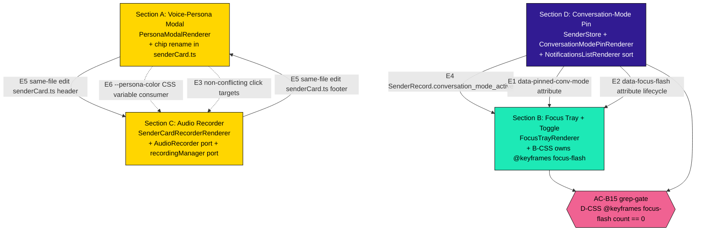

# Phase 6c Cascade Synthesis — Ratified Implementation Contract

**Date**: 2026-05-19
**Author**: Tiberius 🌑 (Lupin session `4e724860`)
**Status**: 🟢 **CANONICAL SYNTHESIS — READY FOR IMPLEMENTATION HANDOFF**
**Sister docs**:
- Parent design: [`10-phase6c-persona-focus-recorder-design.md`](10-phase6c-persona-focus-recorder-design.md) (Phase 6c original design, pre-cascade)
- Execution plan: [`12-phase6c-execution-plan.md`](12-phase6c-execution-plan.md) (per-step implementer handoff, DAG-first)
- Cascade artifacts (gitignored — `io/commons/`):
  - `cascaded-prototype-phase-6c-section-{A,B,C,D}.md`
  - `cascaded-prototype-phase-6c.md` (parent topic)
  - `pipeline-summary-20260519.md` (§8 wrap-up)

---

## 1. Purpose

This document is the **canonical synthesis** of Phase 6c Run 3 cascade outputs. It captures, in one structured reference, the **ratified shape** of all four sections (A/B/C/D) as agreed across:
- Stage 0 author drafts (Rachel 🕊️)
- Stage 1 usability/reuse reviews (Mr Radio 🦉, with Arnold backstop for Section B)
- Stage 2 viability/gap reviews (Arnold 🪨)
- Stage 3 ownership/Convention 6 reviews (Rio ⚡)
- Manager classifications + ratifications (Tiberius 🌑)
- 1 user escalation ratification (Rick on Section C F2 port-verbatim, 02:48 UTC)
- 1 manager-unilateral ratification (Section D Q-D1 Path A by-concurrence, 02:57 UTC)

**Cascade closed clean at 04:16 UTC 2026-05-19** with 43 findings ratified across 4 sections at full cap-counter discipline (4/4 sections at 2/2). This doc is the SSOT for downstream implementation work.

The companion **execution plan** at `12-phase6c-execution-plan.md` translates this synthesis into a DAG-first per-section file inventory for an implementer (Tiffany 💍 confirmed 2026-05-19) to ship section-by-section without re-deriving cascade context.

---

## 2. Cascade Telemetry

| Metric | Value |
|---|---|
| Cascade type | HYBRID authoring-cascade (design doc pre-existing, implementation plan authored within cascade) |
| Wall-clock | ~108 min (02:28 → 04:16 UTC) |
| Sections closed | 4 of 4 (all at cap 2/2 — full revision-discipline coverage) |
| Total findings | 43 across all stages |
| Verbatim-accept rate | 39/43 (91%) + 4 documented-not-revised (cap-preserved) |
| User escalations | 1 (Section C F2 → port-verbatim ratification) |
| Manager-unilateral ratifications | 1 (Section D Q-D1 Path A — new closure category) |
| Counter-proposals | 1 (Rachel base64 option-a over Tiberius option-b on Section C OSQ-C-3 — accepted) |
| Reviewer reassignments | 1 (Mr Radio → Arnold for Section B Stage 1 due to Anthropic rate-limit) |
| Hard-verification gates introduced | 1 (Section B AC-B15 grep-gate; supersedes Round-1 post-cascade-fold) |
| Doctrine candidates filed for §10.14 | 12 (forwarded to María's manager-seat redline) |

**Per-section closure summary**:

| Section | Title | Wall-clock | Findings | Verbatim-accept | User escalations | Cap status |
|---|---|---|---|---|---|---|
| A | Voice-Persona Modal | 44 min | 11 (4+6+1) | 10/11 (91%) | 0 | 2/2 LOCKED |
| C | Sender-Card Audio Recorder | 57 min | 14 (5+8+1) | 13/14 (93%) | 1 (F2 ratified-yes) | 2/2 LOCKED |
| D | Conversation-Mode UI Pin | 62 min | 9 (4+4+1) | 8/9 (89%) | 0 | 2/2 LOCKED |
| B | Focus Tray + Toggle | 72 min | 9 (4+4+1) | 8/9 (89%) | 0 | 2/2 LOCKED |

**Cascade-learning-loop dividend** (Section finding-counts across Run-order):
| Run-order | Section | Stage-2 findings | Notes |
|---|---|---|---|
| 1st | A | 6 | Established F-Arnold-1 directory-wide-glob doctrine |
| 2nd | C | 8 | F-Arnold-C3 reproduced F-Arnold-1 (forward-only-asymmetry) |
| 3rd | D | 4 | Rachel proactively applied F-Arnold-1 + 3 lessons → 50% compression vs A |
| 4th | B | 4 Stage-1 + 4 Stage-2 | Section B shipped Stage 0 with ZERO conditional-executability markers |

---

## 3. Per-Section Ratified Synthesis

### 3.A — Voice-Persona Modal

**Goal**: Sender-card persona chip click → HTML Popover-API modal showing 5 persona fields (icon, name, display_name, voice_id, borrowed) with persona-color tinting.

**Cluster A ratifications** (5/5 pre-cascade 2026-05-12, all carried through verbatim):

| Q | Decision |
|---|---|
| Q-A1 | Trigger = `.sender-persona-badge` chip (RENAMED from existing `.persona-badge` per F3 closure — extend-existing) |
| Q-A2 | Modal = HTML Popover API; `popover="auto"` mode; chip carries `popovertarget` (declarative wiring) |
| Q-A3 | Close affordances = ESC + outside-click (built-in) + explicit × button |
| Q-A4 | Persona color = subtle thin top accent + tinted name text; body neutral. Use `var(--persona-color)` directly (F2 closure — NOT `rgb(var(--persona-color-rgb))`) |
| Q-A5 | Borrowed display = `(borrowed)` label only; attribution deferred (server has no `original_owner` field yet — OSQ-A-1 follow-on) |

**Final Acceptance Criteria (AC-A1 through AC-A13)**:

| AC | Command | Pass criterion | EXECUTOR |
|---|---|---|---|
| AC-A1 | `npx tsc --noEmit -p tsconfig.json` | exit 0 | AI |
| AC-A2 | `npx eslint src/fastapi_app/static/js/multiplexer/` | exit 0 | AI |
| AC-A3 | `vitest templates_persona_modal.test.ts` | ≥10 PASS (case 11 added Round-2: null-persona chip omission) | AI |
| AC-A4 | `vitest persona_modal_renderer.test.ts` | ≥12 PASS (#10 storm-safety scoped to persona-field-change subset post-F-Arnold-6) | AI |
| AC-A5 | AC2e grep on `personaModal.ts` + `PersonaModalRenderer.ts` | 0 hits | AI |
| AC-A6 | `c8 --100 --include='src/fastapi_app/static/js/multiplexer/**/*.ts'` (directory-wide per F-Arnold-1 doctrine) | exit 0 | AI |
| AC-A7 | `wc -l persona-modal.css` | ≤500 | AI |
| AC-A8 | `npx stylelint persona-modal.css` (with new override block) | exit 0 | AI |
| AC-A9 | Phase 6b AC10d Layer-3 canary: `getComputedStyle(document.body)` identical | identical | AI |
| AC-A10 | smoke: chip_renders + popover_opens + closes_on_{esc,outside,×} + single_instance + borrowed_label_visibility | all PASS | AI |
| AC-A11 | smoke `boot_complete_handshake` — `personaModalRenderer:mounted` in canonical order | 1/1 PASS | AI |
| AC-A12 | Visual regression Run #1 baseline capture on `:8000` via `/schedule-tests` + `auto_fix_on_failure: false` | HTTP 200 + `submission_id` | AI (HUMAN slot-coordination only — calendar) |
| AC-A13 | Visual regression Run #2 (no `--update-snapshots`) on `:8000` | "1 passed, 0 errors" | AI (HUMAN slot-coordination only — calendar) |

**Execution Steps** (post-revision):

- **Step A1** — EDIT `senderCard.ts`: rename existing `.persona-badge` span at `senderCard.ts:62-65` → `.sender-persona-badge` + add `popovertarget="persona-popover-${slugify(persona.sender_id)}"`. Trim inline name text — chip becomes glyph-only (`${persona.icon}`). Preserve `.persona-badge.borrowed` variant logic (rename consistently). Chip OMITTED entirely when `persona === null` per F-Arnold-4.
- **Step A2** — NEW `personaModal.ts`: exports `renderPersonaPopover(persona: ServerVoicePersona): HTMLElement` (sessionId param dropped per F-Arnold-2). Slugify helper for sender_id → HTML-id-safe. Element shape uses `var(--persona-color)` directly. Borrowed div with `hidden` attribute toggled by `borrowed === true`. × close button uses declarative `popovertarget` + `popovertargetaction="hide"`.
- **Step A3** — NEW `PersonaModalRenderer.ts`: factory `createPersonaModalRenderer({stores}): PersonaModalRenderer`. Single subscription target `store_senders_changed` (F1 closure collapsed from 3-event). Lifecycle: mount queries existing cards + creates popovers; subscribe handlers dispatch on `changeKind` (added/updated/removed); idempotent re-render via `replaceChildren()` preserves open state across content mutation (F-Arnold-5). Event-driven only, NO RAF, NO polling. `#mounted: boolean` idempotency.
- **Step A4** — NEW `persona-modal.css`: scoped popover styling (≤500 LOC); accent strip, body fields, close button, borrowed visibility. `.stylelintrc.json` override block.
- **Step A5** — Boot wiring: mount in canonical order via `boot.ts`; `multiplexer.html` adds `#persona-modal-portal` + CSS link.
- **Step A6** — Tests: 2 new test files per AC-A3 + AC-A4.
- **Step A7** — Smoke + visual regression per AC-A10..A13.

**Pre-flight recon** (final):
- Recon-A1 **RETIRED** (F1 closure — no discriminator needed)
- Recon-A2: confirm `senderCard.ts` renders icon+name at code-write
- Recon-A3 RESCOPED: confirm `--persona-color` not `-rgb` variant
- Recon-A4: Popover API browser support floor (Chrome 114+/FF 125+/Safari 17+)
- Recon-A5 NEW: slugify helper for sender_id (single source of truth between template + renderer)
- OSQ-A-1: Q-A5 follow-on for `original_owner` field; out of scope Phase 6c

**Files affected**:
- **NEW** (7): `multiplexer/render/PersonaModalRenderer.ts`, `render/templates/personaModal.ts`, `css/multiplexer/persona-modal.css`, `tests/unit/multiplexer/render/templates_persona_modal.test.ts`, `tests/unit/multiplexer/render/persona_modal_renderer.test.ts`, `tests/smoke/test_multiplexer_phase6c_smoke.py` (shared), `tests/e2e_ui/test_multiplexer_phase6c_section_a_visual.py`
- **EDITED** (7 — added `notifications-list.css` per F-Arnold-3): `multiplexer/render/templates/senderCard.ts`, `render/index.ts`, `shared/types.ts`, `boot.ts`, `static/html/multiplexer.html`, `.stylelintrc.json`, `static/css/notifications-list.css` (rename `.persona-badge` → `.sender-persona-badge`)

**Reused (DO NOT re-implement)**: `html` tagged template + `.textContent`; `unsubscribers: Array<() => void>` lifecycle; factory shape (Phase 6a/6b precedent); `#mounted: boolean` idempotency (Phase 6a F-26); `--persona-color` CSS var (`senderCard.ts:56`); `SenderStore` + `ServerVoicePersona` 5-field shape; `store_senders_changed{changeKind}` event routing; boot ordering invariant (renderers first); visual-snapshot scaffolding (Phase 6a/6b); `/schedule-tests` + `auto_fix_on_failure: false`.

**Cross-section coordination**: Section A edits `senderCard.ts` header (chip mount). Section C edits `senderCard.ts` footer (recorder mount). Same file, non-conflicting mount points (E5).

**Stage findings closure trail**:
- Stage 1 (Mr Radio): F1+F2+F3+F5 inconsistency cluster → Round-1 verbatim accept (cap 1/2)
- Stage 2 (Arnold): F-Arnold-1 (c8 glob doctrine — propagated forward), F-Arnold-2 (signature), F-Arnold-3 (CSS rule migration → `notifications-list.css` added to EDITED), F-Arnold-4 (null-persona chip), F-Arnold-5 (replaceChildren preserves popover open state), F-Arnold-6 (storm-safety scope) → Round-2 verbatim accept (cap 2/2 REACHED)
- Stage 3 (Rio): F-Rio-1 cosmetic (AC-A3/A4 don't inline-name coverage-hoist to AC-A6) → documented-not-revised; post-cascade fold target

---

### 3.B — Focus Tray + Focus-Mode Toggle

**Goal**: A focus-mode toggle hides non-pinned sender cards; a tray lists the hidden senders with click-to-exit. CSS-only flash animation on pin-change.

**Cluster B ratifications** (5/5; all PROPOSED carried through verbatim — `divergence: none`):

| Q | Decision |
|---|---|
| Q-B1 | Mount surface: `<aside id="focus-tray">` after `#tts-pane` in `multiplexer.html` |
| Q-B2 | Toggle UI: `#focus-mode-toggle` button at top of notifications-pane |
| Q-B3 | Focus target = sender with `SenderRecord.conversation_mode_active === true` read from store (FIRM per Q-D1 Path A; no DOM fallback; B is READ-ONLY on D's pin contract) |
| Q-B4 | Tray contents: compact hidden-senders list; click row EXITS focus mode (per OSQ-B-2 default — B read-only on D's pin) |
| Q-B5 | Flash signaled via D's `data-focus-flash` attribute; **B-CSS owns `@keyframes focus-flash`** (D-CSS has zero occurrence; hard-gated in AC-B15 grep-gate) |

**Final Acceptance Criteria (AC-B1 through AC-B15)** — Section B has the largest AC count (15 + 2 sub-ACs); AC-B15 is the new hard-verification gate:

| AC | Command | Pass criterion | EXECUTOR |
|---|---|---|---|
| AC-B1 | `npx tsc --noEmit -p tsconfig.json` | exit 0 | AI |
| AC-B2 | `npx eslint src/fastapi_app/static/js/multiplexer/` | exit 0 | AI |
| AC-B2a | grep guard: NO `data-phase6-pending` on `#focus-tray` post-mount | 0 hits | AI |
| AC-B2b | grep guard: NO `data-phase6-pending` on `#focus-mode-toggle` post-mount | 0 hits | AI |
| AC-B3 | `vitest templates_focus_tray.test.ts` | ≥7 PASS (Round-2 from ≥6) | AI |
| AC-B4 | `vitest focus_tray_renderer.test.ts` | ≥15 PASS | AI |
| AC-B5 | AC2e grep on `focusTray.ts` + `FocusTrayRenderer.ts` | 0 hits | AI |
| AC-B6 | `c8 --100 --include='src/fastapi_app/static/js/multiplexer/**/*.ts'` | exit 0 | AI |
| AC-B7 | `wc -l focus-tray.css` | ≤500 | AI |
| AC-B8 | `npx stylelint focus-tray.css` | exit 0 | AI |
| AC-B9 | Phase 6b AC10d Layer-3 canary on `focus-tray.css` | identical body computedStyle | AI |
| AC-B10 | smoke: toggle_disabled + toggle_enabled + focus_hides + tray_lists + click_exits + pin_moves_target_follows + focus_flash_animates | all PASS | AI |
| AC-B11 | smoke `boot_complete_handshake` — `focusTrayRenderer:mounted` in canonical order | 1/1 PASS | AI |
| AC-B12 | Perf gate: toggle ON with 20 senders → `data-focus-hidden` writes < 50ms | unit `performance.now()` | AI |
| AC-B13 | Visual regression Run #1 baseline on `:8000` | HTTP 200 + `submission_id` | AI (HUMAN slot only) |
| AC-B14 | Visual regression Run #2 (no `--update-snapshots`) | "1 passed, 0 errors" | AI (HUMAN slot only) |
| **AC-B15** | **NEW (F-Arnold-B-Stage2-1)**: `grep -c "@keyframes focus-flash" src/fastapi_app/static/css/multiplexer/conversation-mode-pin.css` | exit count == 0 (no `@keyframes focus-flash` in Section D's CSS — B-CSS is SSOT) — **per F-Rio-B1 cosmetic**: prefer `! grep -q "@keyframes focus-flash" conversation-mode-pin.css` for unambiguous shell idiom | AI |

**Zero conditional-executability markers** post-cascade (Q-D1 Path A + Recon-B5 resolution + Recon-B3 retirement eliminated all conditional deps — Persona 2.A point 9 clean slate).

**Execution Steps** (post-revision):

- **Step B1** — EDIT `multiplexer.html`: mount `<aside id="focus-tray" data-phase6-pending="true" hidden></aside>` after `#tts-pane`; mount `<button id="focus-mode-toggle" type="button" data-phase6-pending="true" hidden>Focus mode OFF</button>` at top of notifications-pane. Add CSS `<link>`.
- **Step B2** — NEW `focusTray.ts`: exports `renderFocusTray(hiddenSenders: ServerSender[]): HTMLElement`. Per-row `<button class="focus-tray-row" data-sender-id="<id>" type="button" style="color: var(--persona-color, currentColor);">{icon} {name}</button>` (Round-2 F-Arnold-B-Stage2-2: `currentColor` fallback NOT `transparent` to prevent invisible-text bug). Empty state div. AC2e safe-write inherited.
- **Step B3** — NEW `FocusTrayRenderer.ts`: factory `createFocusTrayRenderer({stores}): FocusTrayRenderer`. State: `focusModeActive: boolean` (page-local, not persisted); `hiddenSenderIds: Set<string>` (derived). Lifecycle: mount queries `#focus-tray` + `#focus-mode-toggle`, lifts `hidden` + `data-phase6-pending`, binds click handler to toggle + delegated handler to `.focus-tray-row` (calls `exitFocusMode()` per OSQ-B-2 default), subscribes `store_senders_changed`. On `updated`: re-evaluates pin state via `senderStore.findOne(s => s.conversation_mode_active === true)`; re-applies `data-focus-hidden` (idempotent on store re-read per F-Arnold-D2 dual-emission contract). `toggleFocusMode()` checks for pin (if none: render toggle disabled + tooltip per OSQ-B-3). Pin-moves-while-focus-on: B re-applies `data-focus-hidden` on new pin. D writes `data-focus-flash`, B's CSS animates. B never writes the flash attribute. Event-driven only; `#mounted` guard. Round-2 F-Arnold-B-Stage2-4: explicit store-method call `senderStore.getAll().filter(s => s.id !== pinnedSender.id)` documented.
- **Step B4** — NEW `focus-tray.css` (≤500 LOC): selectors for toggle, tray container, list, row (button with persona-color tint + hover affordance), empty state. `.sender-card[data-focus-hidden="true"] { display: none; }` (preferred over `visibility: hidden` per AC-B12 perf gate). **B owns `@keyframes focus-flash`**: explicit percentages (0% baseline, 50% peak, 100% return), 1.2s duration, easing TBD-at-code-write, animates opacity/transform. `.stylelintrc.json` override block.
- **Step B5** — Boot wiring: mount renderer AFTER Section D's renderers per dep-map; `render/index.ts` barrel exports; `shared/types.ts` extension.
- **Step B6** — Tests per AC-B3 (≥7) + AC-B4 (≥15) + boot handshake.
- **Step B7** — Smoke (8 scenarios) + visual regression.

**Pre-flight recon** (final):
- Recon-B1 VERIFIED at `multiplexer.html:44` per Arnold Stage 1
- Recon-B2: notifications-pane header location — verify at code-write
- Recon-B3 **RETIRED** (Q-D1 Path A eliminated conditional dependency)
- Recon-B4: legacy focus-tray reference `notifications.js:9126-9362` — stale-citation caveat applies (verify current line range)
- Recon-B5 **RESOLVED**: D writes `data-focus-flash`, B-CSS owns keyframes (hard-gated in AC-B15)
- OSQ-B-1, OSQ-B-2, OSQ-B-3: all resolved/firmed at cascade close

**Files affected**:
- **NEW** (7): `multiplexer/render/FocusTrayRenderer.ts`, `render/templates/focusTray.ts`, `css/multiplexer/focus-tray.css`, `tests/unit/multiplexer/render/templates_focus_tray.test.ts`, `tests/unit/multiplexer/render/focus_tray_renderer.test.ts`, `tests/smoke/test_multiplexer_phase6c_smoke.py` (shared), `tests/e2e_ui/test_multiplexer_phase6c_section_b_visual.py`
- **EDITED** (5): `multiplexer/render/index.ts`, `shared/types.ts`, `boot.ts`, `static/html/multiplexer.html`, `.stylelintrc.json`

**Reused (DO NOT re-implement)**: standard multiplexer lifecycle patterns + Section D's contract surface (data-pinned-conv-mode, data-focus-flash, SenderRecord.conversation_mode_active).

**Cross-section coordination**: Section B consumes Section D's contract (E1/E2/E4). AC-B15 enforces B-CSS as SSOT for `@keyframes focus-flash` (D-CSS must have ZERO occurrence).

**Stage findings closure trail**:
- Stage 1 (Arnold reassigned from Mr Radio at 03:32 UTC): 4 findings (3 inc + 1 cosmetic) → Round-1 verbatim accept
- Stage 2 (Arnold canonical Persona 4): F-Arnold-B-Stage2-1 (hard-verification gate AC-B15 supersedes Round-1 post-cascade-fold), F-Arnold-B-Stage2-2 (`currentColor` not `transparent`), F-Arnold-B-Stage2-3 (AC-B3 row count drift — third AC-table-doctrine-lag instance), F-Arnold-B-Stage2-4 (explicit store-method conversion site) → Round-2 verbatim accept (cap 2/2 REACHED)
- Stage 3 (Rio): F-Rio-B1 cosmetic (AC-B15 grep-gate wording precision) → documented-not-revised; post-cascade fold target

**Reviewer reassignment incident**: Mr Radio's Anthropic rate-limit at ~03:06 UTC (78+ min blocked); user-ratified reassignment to Arnold via `ask_yes_no` at 03:32 UTC. Arnold's Stage-1 + canonical Stage-2 = sole reviewer path; self-review-bias mitigated via rubric-differential (Persona 3 then Persona 4 each catching new issues). Cascade closed cleanly WITHOUT Mr Radio recovery.

---

### 3.C — Sender-Card Audio Recorder

**Goal**: Add a per-sender audio recorder + send-button on the sender card footer. **Port the working legacy `AudioRecorder` + `recordingManager` singleton verbatim** (per Rick's Q-C2 ratification 02:48 UTC) rather than re-implement.

**Cluster C ratifications**:

| Q | Decision |
|---|---|
| Q-C1 | Template edit: `.cc-voice-input` mount in `senderCard.ts` footer (data attrs verbatim from legacy `notifications.js:10956`) |
| Q-C2 | **RETIRED via user escalation** (F2 foundational) — Rick ratified 02:48 UTC: port `audio-recorder.js` + `recordingManager` verbatim into TS. Original `audio/webm;codecs=opus` MIME proposal abandoned; recording subsystem stays as-is. |
| Q-C3 | 4-state recorder UI state machine (idle → recording → processing → ready_to_send) — inherited via recordingManager singleton port |
| Q-C4 | STT pipeline endpoint inherited via AudioRecorder port (stays `/api/upload-and-transcribe-mp3`) |
| Q-C5 | Send-button POST: URLSearchParams body, legacy shape from `notifications.js:1823-1841` (5-field set: `type=user_initiated_message`, `job_id=<sessionHash>`, `sender_id=<currentUserEmail>`, `target_user=<derived from senderId before #>`, `message=<textarea>`) |
| Q-C6 | Single-active guard via recordingManager singleton port (silent-cancel previous per legacy) |

**Final Acceptance Criteria (AC-C1 through AC-C13)**:

| AC | Command | Pass criterion | EXECUTOR |
|---|---|---|---|
| AC-C1 | `npx tsc --noEmit -p tsconfig.json` | exit 0 | AI |
| AC-C2 | `npx eslint src/fastapi_app/static/js/multiplexer/` | exit 0 | AI |
| AC-C3 | `vitest templates_audio_recorder.test.ts` | **N/A post-Round-1 Q-C2 collapse** — template file removed; per F-Rio-C1 strike or annotate "N/A"; coverage hoisted to AC-C4 + port-parity tests | AI |
| AC-C4 | `vitest sender_card_recorder_renderer.test.ts` | ≥12 PASS (Round-2 adds case #11 Re-record, #12 permission-denied) | AI |
| AC-C5 | AC2e grep on `SenderCardRecorderRenderer.ts` + `AudioRecorder.ts` + `recordingManager.ts` | 0 hits | AI |
| AC-C6 | `c8 --100 --include='src/fastapi_app/static/js/multiplexer/**/*.ts'` (directory-wide per F-Arnold-1) | exit 0; ≥24 aggregate cases (≥12 renderer + ≥6 AudioRecorder port + ≥6 recordingManager port) | AI |
| AC-C7 | `wc -l sender-card-recorder.css` | ≤500 | AI |
| AC-C8 | `npx stylelint sender-card-recorder.css` | exit 0 | AI |
| AC-C9 | Phase 6b AC10d Layer-3 canary | identical body computedStyle | AI |
| AC-C10 | smoke: mount + record_button + stop + single_active + permission_denied + send_post + boot_handshake | all PASS | AI |
| AC-C11 | Boot handshake console-log order: `authManager:ready` BEFORE `senderCardRecorderRenderer:mounted` (F-Arnold-C4) | 1/1 PASS | AI |
| AC-C12 | Visual regression Run #1 baseline on `:8000` | HTTP 200 + `submission_id` | AI (HUMAN slot only) |
| AC-C13 | Visual regression Run #2 (no `--update-snapshots`) | "1 passed, 0 errors" | AI (HUMAN slot only) |

**Execution Steps** (post-revision):

- **Step C1** — EDIT `senderCard.ts` footer: append `.cc-voice-input` div with `data-session-hash="<sessionId>"` + `data-sender-id="<senderId>"` (verbatim legacy attribute names). Coordinated with Section A's header chip mount (E5).
- **Step C2** — NEW `multiplexer/audio/AudioRecorder.ts`: port `src/fastapi_app/static/js/audio-recorder.js` verbatim into TS. Constructor signature + public methods (`start()`, `stop()`, `cancel()`, `getCurrentMimeType()`) + `_getBestMimeType()` MIME-fallback logic preserved. Fetch path: raw body upload + `Content-Type: blob.type` + Bearer Authorization (NOT JSON.stringify). Base64-encode blob client-side per OSQ-C-3 (a) (binary optimization deferred).
- **Step C3** — NEW `multiplexer/audio/recordingManager.ts` + thin wrapper renderer `SenderCardRecorderRenderer.ts`. Singleton recordingManager: ports `notifications.js:3491+` verbatim. TTS pause-on-record/resume-on-stop, single-active guard, ESC cancel, duration counter (`setInterval` allowed at port layer). Renderer factory `createSenderCardRecorderRenderer({stores, currentUserEmail}): SenderCardRecorderRenderer` — thin wrapper with click delegation (`.record-button`, `.send-button`). Re-record click handler (F-Arnold-C5): `.record-button` re-labeled "Re-record" in `ready_to_send`. Send-button POST shape: TBD-at-code-write per Recon-C3 (either URL-query-string or form-encoded body). `target_user` derivation: `card.dataset.senderId.split('#')[0]` (F-Arnold-C2). Permission-denied: AudioRecorder error → recordingManager catch → renderer renders message (path a per Recon-C6 / F-Arnold-C6). Renderer event-driven only; RAF + setInterval ownership delegated to recordingManager (covered by port-parity tests, NOT duplicated at renderer layer per F-Arnold-C8).
- **Step C4** — NEW `sender-card-recorder.css` (≤500 LOC): port `.cc-voice-input` styling from legacy `notifications.css`. State-driven visibility, button styling, error stripe, disabled states. No global selectors; override block in `.stylelintrc.json`.
- **Step C5** — Boot wiring (F-Arnold-C4): in `boot.ts`, ensure `AuthManager.initialize()` completes BEFORE `createSenderCardRecorderRenderer(...)` instantiation. Boot-time assertion: `assert(authManager.getCurrentUserEmail() != null, '...')`. Console marker `console.log('[multiplexer] authManager:ready')` AFTER `AuthManager.initialize()`. Renderer mount logs `senderCardRecorderRenderer:mounted`. Edits: `multiplexer.html` (CSS link), `multiplexer/render/index.ts` (barrel), `shared/types.ts` (`RecorderState` enum + `BootCompletePayload.handlers`).
- **Step C6** — Tests: renderer test ≥12 cases + port-parity tests (≥6 AudioRecorder + ≥6 recordingManager) + coverage gate.
- **Step C7** — Smoke + visual regression.

**Pre-flight recon** (final):
- Recon-C1 RESCOPED: verify `audio-recorder.js` current interface at port time
- Recon-C3 EXTENDED: legacy POST body shape at `notifications.js:1823-1841` — confirm wire format (URL-query vs form-encoded) + 5-field set + target_user derivation rule
- Recon-C5: Phase 3 audio-chunk WS binary path doesn't collide with recorder's outbound HTTP POST
- Recon-C6 EXTENDED: mic permission model 3 ownership paths — path (a) chosen (renderer renders error)
- Recon-C7 NEW (F-Arnold-C4): verify `AuthManager.initialize()` signature + `getCurrentUserEmail()` accessor + boot-time position pre-renderer
- ~~Recon-C2~~ + ~~Recon-C4~~: RETIRED via Q-C2 collapse
- OSQ-C-3: base64→binary migration deferred stand-alone perf R&D candidate (NOT Phase 6c scope)

**Files affected**:
- **NEW** (6 source + 4 test): `multiplexer/audio/AudioRecorder.ts`, `multiplexer/audio/recordingManager.ts`, `multiplexer/render/SenderCardRecorderRenderer.ts`, `css/multiplexer/sender-card-recorder.css`, `tests/unit/multiplexer/audio/audio_recorder_port.test.ts`, `tests/unit/multiplexer/audio/recording_manager_port.test.ts`, `tests/unit/multiplexer/render/sender_card_recorder_renderer.test.ts`, `tests/smoke/test_multiplexer_phase6c_smoke.py` (shared), `tests/e2e_ui/test_multiplexer_phase6c_section_c_visual.py`
- **EDITED** (6): `multiplexer/render/templates/senderCard.ts`, `multiplexer/render/index.ts`, `shared/types.ts`, `multiplexer/boot.ts`, `static/html/multiplexer.html`, `.stylelintrc.json`

**Reused (DO NOT re-implement)**: AudioRecorder + recordingManager singleton (verbatim port per Q-C2 ratification — recording subsystem, MIME negotiation, fetch path, state machine, single-active guard all inherited); CSS port from `notifications.css`; `currentUserEmail` from existing AuthManager; send-button POST shape from `notifications.js:1823-1841`.

**Stage findings closure trail**:
- Stage 1 (Mr Radio): F1 (URLSearchParams shape) + F2 (foundational MIME issue, user-escalated → port-verbatim) + F3 (chip-coordination) + F4 (boot timing) + F5 (cosmetic) → Round-1 verbatim accept after Rick ratification + Rachel counter-proposal on OSQ-C-3 base64 option (a) accepted by Manager
- Stage 2 (Arnold): F-Arnold-C1..C8 (POST wire shape, target_user derivation, c8 glob, AuthManager timing, re-record click, permission-denied UI, recordingManager imports, renderer cadence) → Round-2 verbatim accept (cap 2/2 REACHED)
- Stage 3 (Rio): F-Rio-C1 cosmetic (AC-C3 orphan post-Q-C2-collapse) → documented-not-revised; post-cascade fold target

---

### 3.D — Conversation-Mode UI Pin

**Goal**: Sender enters conversation mode → its card pins to top of list with persona-color glow + mic-monopoly indicator + 1.2s focus-flash animation. Single-pin invariant enforced atomically at SenderStore.

**Cluster D ratifications**:

| Q | Decision |
|---|---|
| Q-D1 | **Path A (store-driven)** — RATIFIED by manager-unilateral by-concurrence (NEW closure category). `SenderRecord.conversation_mode_active: boolean` field on SenderStore. B reads directly from store; Path B fallback RETIRED. Rationale: atomic store-level invariant prevents DOM-mutation race. |
| Q-D2 | Sort location: `NotificationsListRenderer` extended with `senderSortComparator` injection point. Comparator type sender-level `(a: ServerSender, b: ServerSender) => number` per F-Arnold-D3 closure. Phase 6c overrides at boot with `(a, b) => Number(b.conversation_mode_active) - Number(a.conversation_mode_active) || (b.last_active_ts - a.last_active_ts)`. |
| Q-D3 | Mic-monopoly indicator: CSS pulsing overlay on pinned card via `data-mic-monopoly="true"`. Field name conditional on Recon-D2 (verify exact wire payload). |
| Q-D4 | Single-pin invariant: enforced at SenderStore reducer atomically. Round-2 F-Arnold-D2 refines to TWO sequential `store_senders_changed{changeKind: "updated"}` emissions — prior-pinned Y emits FIRST (cleared), new-pinned X emits SECOND (set). Preserves single-sender event contract; intermediate unpinned state acceptable. |

**Final Acceptance Criteria (AC-D1 through AC-D14)**:

| AC | Command | Pass criterion | EXECUTOR |
|---|---|---|---|
| AC-D1 | `npx tsc --noEmit -p tsconfig.json` | exit 0 | AI |
| AC-D2 | `npx eslint src/fastapi_app/static/js/multiplexer/` | exit 0 | AI |
| AC-D3 | `vitest sender_store_conversation_mode.test.ts` | ≥10 PASS (items #5/#6 mic_monopoly extraction conditional on Recon-D2) | AI |
| AC-D4 | `vitest conversation_mode_pin_renderer.test.ts` | ≥15 PASS (6 attribute-lifecycle + 3 pin-move + 2 single-pin-invariant + 3 lifecycle + 1 perf-gate; item #14 preserves NO-RAF assertion) | AI |
| AC-D5 | `vitest notifications_list_renderer.test.ts` (Phase 6c sort cases) | ≥4 new PASS + pre-existing test suite 0 regressions (F-Arnold-D4 backward-compat guard) | AI |
| AC-D6 | `c8 --100 --include='src/fastapi_app/static/js/multiplexer/**/*.ts'` (directory-wide per Rachel's proactive carry-forward of F-Arnold-1 doctrine) | exit 0 | AI |
| AC-D7 | `wc -l conversation-mode-pin.css` | ≤500 | AI |
| AC-D8 | `npx stylelint conversation-mode-pin.css` | exit 0 | AI |
| AC-D9 | Phase 6b AC10d Layer-3 canary | identical body computedStyle | AI |
| AC-D10 | smoke: pin_attribute + pin_moves_top + pin_between_senders + mic_monopoly + focus_flash + focus_flash_auto_removes | all PASS | AI |
| AC-D11 | smoke `boot_complete_handshake` — `conversationModePinRenderer:mounted` in canonical order | 1/1 PASS | AI |
| AC-D12 | Perf gate: 20 senders × pin/un-pin paint < 100ms | unit `performance.now()` | AI |
| AC-D13 | Visual regression Run #1 baseline on `:8000` | HTTP 200 + `submission_id` | AI (HUMAN slot only) |
| AC-D14 | Visual regression Run #2 (no `--update-snapshots`) | "1 passed, 0 errors" | AI (HUMAN slot only) |

**Execution Steps** (post-revision):

- **Step D1** — EDIT `SenderStore.ts`:
  - D1.a: extend `STATE_UPDATE_TYPES` Set at `SenderStore.ts:34-38` to include `"conversation_mode_changed"` (single-line addition)
  - D1.b: verify wire routing per 2026-04-29 cleanup pattern (`SenderStore.ts:7-13`) — if routed via `notification_queue_update.notification.type` discriminator, reducer hooks parallel to `handlePersonaUpdate`
  - D1.c: header code-comment matching `SenderStore.ts:7-13` spec-drift pattern, naming trigger notification-type + downstream events
  - Single-pin invariant (Q-D4 F-Arnold-D2 closure): on `conversation_mode_changed{session_id: X, active: true}` — first scan for other sender Y with `conversation_mode_active === true`, flip Y false + emit `store_senders_changed{changeKind: "updated", sender_id: Y}` FIRST; then flip X true + emit SECOND
  - EDIT `shared/types.ts`: extend `SenderRecord` with `conversation_mode_active: boolean` + `mic_monopoly: boolean`
- **Step D2** — NEW `ConversationModePinRenderer.ts`: factory + canonical surface (`mount`, `unmount`, `forceRenderForTesting`). Lifecycle: mount queries existing cards + sets `data-pinned-conv-mode="true"` on pinned senders + `data-mic-monopoly="true"` on mic-monopoly senders. Subscribe `store_senders_changed`: on emission, diff attribute state vs store, flip atomically. **Pin-move + focus-flash (E2 contract)**: when NEW card receives `data-pinned-conv-mode="true"` AND a different card had it before — write `data-focus-flash="true"` on new card; renderer maintains `lastPinned` state that persists across dual-emission window (per F-Rio-D1 clarification — `lastPinned` updated ONLY when NEW card receives pin attribute, NOT cleared during intermediate unpinned state during dual-emission swap); `setTimeout(1.2s)` removes `data-focus-flash`. Event-driven only (NO RAF, NO polling). `#mounted` idempotency.
- **Step D3** — EDIT `NotificationsListRenderer.ts`: add `senderSortComparator?: SenderSortComparator` factory opts (default `(a,b) => b.last_active_ts - a.last_active_ts`). Type `SenderSortComparator = (a: ServerSender, b: ServerSender) => number` (sender-level per F-Arnold-D3). Phase 6c boot override applies pin-aware comparator.
- **Step D4** — NEW `conversation-mode-pin.css` (≤500 LOC): scopes `.sender-card[data-pinned-conv-mode="true"]` (`box-shadow` glow with `rgb(var(--persona-color))`, subtle pulse), `.sender-card[data-focus-flash="true"]` (1.2s flash — D-CSS HAS ZERO `@keyframes focus-flash` declarations per AC-B15), `.sender-card[data-mic-monopoly="true"]` (pulsing mic icon overlay), combination `[data-pinned-conv-mode="true"][data-mic-monopoly="true"]` (glow + pulse). No global selectors; `.stylelintrc.json` override block.
- **Step D5** — Boot wiring: in `boot.ts`, inject Phase 6c sort comparator BEFORE first render; instantiate `createConversationModePinRenderer({stores})` + mount + console.log. Edits: `multiplexer.html` (CSS link), `multiplexer/render/index.ts` (barrel exports), `shared/types.ts` (`BootCompletePayload.handlers.conversationModePinRenderer?: string`).
- **Step D6** — Tests per AC-D3 (≥10) + AC-D4 (≥15) + AC-D5 (≥4 new + backward-compat) + boot handshake.
- **Step D7** — Smoke + visual regression (3 snapshots: baseline no-pin, pinned + mic-monopoly, pin-move + focus-flash frozen).

**Pre-flight recon** (final):
- Recon-D1: verify `conversation_mode_changed` notification carries `session_id` (prerequisite, design doc Phase-0 prereq #2)
- Recon-D2: mic-monopoly field name verification — AC-D3 #5/#6 conditional
- Recon-D3: NotificationsListRenderer sort hook — Round-2 confirms genuinely-new mechanism; type signature pinned sender-level
- Recon-D4 CORRECTED (F3): legacy pin reference at `notifications.js:9472-9488` (focus-flash lifecycle) + `:10305-10361` (pinned-conv-mode enforcement); function name `_pinSenderCardForSession`
- OSQ-D-1, OSQ-D-2: both RESOLVED (D owns sort + setTimeout)

**Files affected**:
- **NEW** (4 source + 3 test): `multiplexer/render/ConversationModePinRenderer.ts`, `css/multiplexer/conversation-mode-pin.css`, `tests/unit/multiplexer/stores/sender_store_conversation_mode.test.ts`, `tests/unit/multiplexer/render/conversation_mode_pin_renderer.test.ts`, `tests/smoke/test_multiplexer_phase6c_smoke.py` (shared), `tests/e2e_ui/test_multiplexer_phase6c_section_d_visual.py`
- **EDITED** (8): `multiplexer/stores/SenderStore.ts`, `multiplexer/render/NotificationsListRenderer.ts`, `multiplexer/render/index.ts`, `shared/types.ts`, `multiplexer/boot.ts`, `static/html/multiplexer.html`, `.stylelintrc.json`, `tests/unit/multiplexer/render/notifications_list_renderer.test.ts` (Step D3 sort comparator tests, 4 new cases)

**Reused (DO NOT re-implement)**: standard multiplexer lifecycle patterns + `SenderStore` reducer pattern + `--persona-color-rgb` CSS variable + `NotificationsListRenderer` sort hook (Phase 5 existing; Q-D2 extension) + legacy pin behavior reference at corrected line refs + visual-snapshot scaffolding.

**Cross-section coordination**: Section D PROVIDES contract to Section B (E1/E2/E4 — see §4 below). Section D's setTimeout owns the focus-flash lifecycle. AC-B15 enforces that D-CSS has zero `@keyframes focus-flash` declarations (B-CSS is SSOT).

**Stage findings closure trail**:
- Stage 1 (Mr Radio): F1 (Set extension), F2 (field name drift `last_seen` → `last_active_ts`), F3 (Recon-D4 line refs corrected), F4 (architectural credit — store-level atomicity rationale for Q-D1) → Round-1 verbatim accept; Q-D1 Path A manager-unilateral ratification 02:57 UTC (new closure category)
- Stage 2 (Arnold): F-Arnold-D1 (Path B branching retired in-place), F-Arnold-D2 (dual-emission contract refinement), F-Arnold-D3 (comparator type sender-level), F-Arnold-D4 (AC-D5 backward-compat assertion) → Round-2 verbatim accept (cap 2/2 REACHED)
- Stage 3 (Rio): F-Rio-D1 cosmetic (Step D2 `lastPinned` semantic ambiguity → option (a) renderer-state-tracked, persists across dual-emission window) → documented-not-revised + Step D2 wording append; post-cascade fold target

---

## 4. Cross-Section Dependency Map



**Edges**:

| Edge | Provider | Consumer | Contract |
|---|---|---|---|
| **E1** | Section D | Section B | `data-pinned-conv-mode="true"` attribute on pinned `.sender-card` (single-instance max per Q-D4). B reads as observability marker; primary lookup is E4. |
| **E2** | Section D | Section B | `data-focus-flash="true"` attribute lifecycle. D writes, D auto-removes after 1.2s (OSQ-D-2). B-CSS animates. B never writes the attribute. |
| **E3** | (none) | (Sections A + C) | Non-conflicting click targets in `senderCard.ts` (chip in header for A, recorder in footer for C). |
| **E4** | Section D | Section B | **FIRM per Q-D1 Path A ratification**: `SenderRecord.conversation_mode_active: boolean` on SenderStore. B's Q-B3 focus-target lookup reads this field directly. No DOM fallback. |
| **E5** | Sections A ↔ C | (each other) | Coordinated `senderCard.ts` edit. Same file, non-conflicting mount points. Manager coordinates landing order. |
| **E6** | Section A | Section C | `--persona-color` CSS variable read-only consumer (recorder tint subject to A's direction per F2 closure). |
| **AC-B15** | Section B | (cross-section enforcement) | Mechanical grep verification at code-write that `conversation-mode-pin.css` (Section D's CSS) has ZERO `@keyframes focus-flash` declarations. B-CSS is SSOT. |

---

## 5. Post-Cascade Fold Bundle (Final Shape)

Items deferred to post-cascade processing — shrunk per AC-B15 hard-gate adoption (B-keyframes-removal from D-CSS REMOVED FROM BUNDLE because the grep-gate enforces this mechanically at code-write):

| # | Item | Owner | Origin |
|---|---|---|---|
| 1 | Design doc `10-phase6c.md` §Cluster C amendment recording Rick's Q-C2 port-verbatim ratification (02:48 UTC) | Tiberius (Phase 1 of this synthesis) | Section C F2 user-ratification |
| 2 | F-Rio-1 cosmetic fold (Section A AC-A3/A4 implicit cross-reference to AC-A6 coverage-hoist) | Tiberius (Phase 1) | Section A Stage 3 |
| 3 | F-Rio-C1 cosmetic fold (Section C AC-C3 orphan strike-or-annotate "N/A — template factory removed per Round-1 Q-C2 collapse") | Tiberius (Phase 1) | Section C Stage 3 |
| 4 | F-Rio-D1 cosmetic fold (Section D Step D2 pin-move wording precision — `lastPinned` semantic clarification) | Tiberius (Phase 1; partially already folded into §3.D above) | Section D Stage 3 |
| 5 | F-Rio-B1 cosmetic fold (Section B AC-B15 grep-gate wording precision — `! grep -q ...` idiom) | Tiberius (Phase 1) | Section B Stage 3 |

**Note**: B-keyframes-removal from D-CSS was REMOVED from this bundle when AC-B15 hard-gate adopted in Section B Round 2 — now enforced in-cascade via mechanical grep verification at code-write time, not via post-cascade fold.

---

## 6. §10.14 Doctrine Candidates (Brief Index — María's Redline)

12 doctrine candidates filed for María's `/plan-authoring-cascaded` workflow §10.14 redline. Full deep-dive lives in PIP doctrine work (María's parallel track); brief index here for cross-reference:

1. **AC-table-doctrine-lag pattern** — 3 confirmed instances (F-Arnold-C3 + F-Arnold-D4 + F-Arnold-B-Stage2-3) → formal Persona 2.A point-14 codification
2. **Hard-verification-gate vs post-cascade-fold pattern** — NEW closure category (validated by AC-B15 supersession of F-Arnold-B1 post-cascade-fold)
3. **Visible-text safety on CSS var fallbacks** — `currentColor` over `transparent`
4. **Symmetric-application discipline** — writer + consumer (Rachel's lesson from F-Arnold-D1)
5. **Reviewer-reassignment-due-to-rate-limit closure category** — validated by Section B (Mr Radio → Arnold)
6. **Manager `blocked_waiting_on_user` coordination signal** — observers (María's daemon) can disambiguate scenarios from disk-read
7. **Q-D1 `manager_unilateral_ratify_by_concurrence` formal closure category** — NEW
8. **Cascade-learning-loop sub-patterns** — forward-only-asymmetry + symmetric-application + context-aware-application
9. **Rate-limit failure mode** — 5th distinct failure mode (beyond dormancy / read-side / turn-based / write-side)
10. **Stage-3 cosmetic-cluster as systematic pattern-family** — 4 instances (F-Rio-1/C1/D1/B1)
11. **`ask_multiple_choice` Path-B skip-restart cost** — Item #1 fix needs MCP subprocess restart; ask_yes_no workaround validated empirically in Run 3
12. **18-min user-attention-block** — longest single Run-3 event (Mr Radio threshold escalation); tightening directive

María's track also incorporates 3 Rick-voice catches not in this 12-item list: Manager Reassignment Latitude doctrine, Reassignment Bias Risk guardrail, Mute-Channel Bypass for Manager-Escalation.

---

## 7. Sequencing Recommendation for Execution Plan

Section ordering for implementation, based on cross-section dependency map (§4):

```
D → B → A → C
```

**Rationale**:

1. **Section D first** — provides the contract surface (E1/E2/E4) that Section B consumes. SenderStore extension + `SenderRecord.conversation_mode_active` field must exist before B can read it. `data-pinned-conv-mode` + `data-focus-flash` attributes must be writable before B's CSS can animate them. Q-D1 Path A ratification was the cascade-time gate; physical implementation order respects the same dependency.
2. **Section B second** — consumes D's contract surface; AC-B15 grep-gate enforces D-CSS has zero `@keyframes focus-flash` AT B's code-write time, so B's CSS must own the keyframes (B's CSS file is created in this step). B's renderer reads `SenderRecord.conversation_mode_active` from store.
3. **Section A third** — independent of D + B (only consumes `--persona-color` CSS variable which already exists pre-Phase-6c). E5 same-file coordination with C is the only cross-section concern — manager coordinates landing order.
4. **Section C fourth** — coordinates with A on `senderCard.ts` (same file, non-conflicting mount points). C consumes E6 (`--persona-color` direction from A's F2 closure). C is a port (low risk of design surprises); landing last lets A's design choices settle.

**Concurrency option**: A and C could run in parallel since their only coupling is E5 (same-file edit). If implementer prefers serialized clarity (single-PR / single-commit per section), respect the D→B→A→C linear order.

---

## 8. Open Items + Hand-off to Phase 1 + Phase 2

**This synthesis doc (Phase 0)**: ✅ COMPLETE.

**Phase 1 — Amendments to `10-phase6c-persona-focus-recorder-design.md`**:
- Cluster C §Q-C2: replace original `audio/webm;codecs=opus` MIME proposal with Rick's port-verbatim ratification text + cross-ref to this synthesis §3.C
- Cluster D §Q-D1: amend status to "Path A ratified by manager-unilateral by-concurrence" + cross-ref to this synthesis §3.D
- AC tables per section: replace with final ratified shape from §3.{A,B,C,D} above
- Add §AC-B15 hard-verification gate section under Cluster B
- Cross-section dependency map: incorporate §4 mermaid + edges table
- Status header: flip from "design phase open" to "🟢 CASCADE-RATIFIED — implementation handoff at 12-phase6c-execution-plan.md"

**Phase 2 — Execution plan at `12-phase6c-execution-plan.md`**:
- DAG-first sequencing graph per implementer (Tiffany 💍) preference (2026-05-19 confirmed)
- Per-DAG-node: file inventory, function signatures, AC list, test pyramid, gates, standing doctrine memories
- Sequencing: D → B → A → C (per §7 recommendation)
- Done-defined per section: AC table all green, c8 100% directory-wide glob, smoke + visual regression pass, boot handshake order verified
- Cross-section gates: AC-B15 hard-verification at B code-write time; E5 same-file coordination between A and C
- Standing doctrine memories that apply: `feedback_100pct_coverage_multiplexer` (now Lupin-wide), `feedback_pip_plan_review_is_sequential`, `feedback_pydantic_native_validation`, `feedback_baseline_capture_disable_tfe`, `feedback_test_server_monopolize_mode`

**Open items not blocking implementation**:
- OSQ-A-1 (Q-A5 `original_owner` field follow-on): future wire-shape initiative
- OSQ-C-3 (base64→binary upload optimization): stand-alone perf R&D candidate, post-Phase-6c
- OSQ-C-2 (recorder UI tint with `--persona-color-rgb`): default neutral; subject to Section A's F2 direction
- §10.14 doctrine redline: María's parallel PIP track; rendezvous when both tracks land

**Cascade-complete signal status**: ✅ Posted to `cascaded-prototype-phase-6c` topic 04:16 UTC 2026-05-19; heartbeat daemons exited cleanly.

---

— Tiberius 🌑 (Manager, Lupin session `4e724860`) — Synthesis complete, handing off to Phase 1 + Phase 2.
