# Phase 6c Execution Plan — Implementer Handoff (DAG-First)

**Date**: 2026-05-19
**Author**: Tiberius 🌑 (Lupin session `4e724860`)
**Status**: 🟢 **READY FOR IMPLEMENTATION — Roscoe 🤠 assigned**
**Sister docs**:
- Parent design: [`10-phase6c-persona-focus-recorder-design.md`](10-phase6c-persona-focus-recorder-design.md) — cascade-amended status header + per-cluster ratification markers
- Canonical synthesis: [`11-phase6c-cascade-synthesis.md`](11-phase6c-cascade-synthesis.md) — full ratified shape per section, cascade telemetry, doctrine candidates
- Cascade artifacts (gitignored — `io/commons/`): 4 section files + parent topic + §8 pipeline summary

---

## How to read this document

This is **the implementer's handoff doc**. It is structured DAG-first per the implementer's stated preference (Roscoe 🤠, 2026-05-19): the sequencing graph leads, then per-DAG-node deliverables (file inventory, function signatures, AC list, test pyramid, gates, doctrine memories, done-defined). Anyone picking this up cold should be able to ship section-by-section without re-deriving cascade context.

**Order of read**:
1. §1 — DAG (the dependency graph + suggested execution order)
2. §2 — Global standing rules (doctrine memories + test gates that apply across all nodes)
3. §3.{D,B,A,C} — Per-node sections in DAG order (D first because it provides contract surface to B; A + C last with E5 same-file coordination)
4. §4 — Cross-cutting gates (AC-B15 hard-verification, full coverage gate, visual regression schedule)
5. §5 — Done-defined for Phase 6c overall
6. §6 — Post-cascade fold bundle (5 items that fold into the existing design doc, NOT new code work)

If a "why" question arises during implementation, the answer lives in the synthesis doc [§3.{A,B,C,D}](11-phase6c-cascade-synthesis.md#3-per-section-ratified-synthesis) and ultimately in the cascade section files at `io/commons/cascaded-prototype-phase-6c-section-{A,B,C,D}.md`. This execution plan is the **what + how**; the synthesis is the **why-anchor**.

---

## 1. DAG — Section Sequencing Graph

```mermaid
graph LR
    START([START])
    D[Node D: Conversation-Mode Pin<br/>SenderStore extension<br/>+ ConversationModePinRenderer<br/>+ NotificationsListRenderer sort hook]
    B[Node B: Focus Tray + Toggle<br/>FocusTrayRenderer<br/>+ B-CSS owns @keyframes focus-flash<br/>+ AC-B15 grep-gate]
    A[Node A: Voice-Persona Modal<br/>PersonaModalRenderer<br/>+ chip rename in senderCard.ts header]
    C[Node C: Audio Recorder<br/>SenderCardRecorderRenderer<br/>+ AudioRecorder port + recordingManager port<br/>+ senderCard.ts footer]
    GATE[Cross-Section Gate:<br/>AC-B15 grep verify<br/>D-CSS @keyframes focus-flash == 0]
    DONE([Phase 6c DONE<br/>visual regression green<br/>boot handshake stable<br/>c8 100% directory-wide])

    START --> D
    D -->|E1/E2/E4 contracts ready| B
    B --> GATE
    GATE --> A
    A -->|E5 same-file coordination<br/>E6 persona-color direction| C
    C --> DONE

    D -.->|optional concurrency<br/>only IF no risk appetite<br/>for store-extension surprises| A

    classDef provider fill:#311B92,stroke:#000,color:#fff
    classDef consumer fill:#1DE9B6,stroke:#000,color:#000
    classDef coord fill:#FFD600,stroke:#000,color:#000
    classDef gate fill:#F06292,stroke:#000,color:#000
    classDef terminal fill:#888,stroke:#000,color:#fff

    class D provider
    class B consumer
    class A,C coord
    class GATE gate
    class START,DONE terminal
```



**Linear order (recommended)**: **D → B → A → C → DONE**.

**Rationale per edge**:
- **D first**: provides E1 (`data-pinned-conv-mode`), E2 (`data-focus-flash`), E4 (`SenderRecord.conversation_mode_active`) contracts that Section B consumes. Q-D1 Path A ratification was the cascade-time gate; physical implementation order respects the same dependency. D's store extension is the load-bearing piece — if anything is going to surprise the implementer at the boundary between cascade design and real code, it'll surface here, so do D first to flush surprises.
- **B second**: consumes D's E1/E2/E4. AC-B15 grep-gate fires at B's code-write time: B's CSS must own `@keyframes focus-flash`; D-CSS must have zero occurrence. B can only pass this gate after D's CSS exists AND is verified to have no keyframes. So B follows D.
- **A third**: independent of D + B (only consumes `--persona-color` CSS variable which already exists pre-Phase-6c). The only cross-section concern is E5 same-file coordination with C — they both edit `senderCard.ts` (A's chip in header, C's recorder in footer). Doing A before C lets A's chip rename (`.persona-badge` → `.sender-persona-badge`) settle before C edits the footer.
- **C last**: coordinates with A on `senderCard.ts` (E5) + consumes A's F2 direction on `--persona-color` (E6). Section C is a port (low risk of design surprises); landing last lets A's design choices settle. C is also the longest/most complex node (verbatim port of AudioRecorder + recordingManager + thin wrapper renderer), so landing it last keeps the critical-path short.

**Concurrency option**: A and C could be implemented in parallel since their only coupling is E5 (same-file edit). If implementer prefers serialized clarity (single-PR / single-commit per node), respect the linear D→B→A→C order. **Recommended**: serialize unless you have specific reason to parallelize.

**Per-node sequencing inside each section**: each section's execution steps must be done in step-number order (e.g., Step D1 before Step D2 before Step D3, etc.). Step ordering within a node is critical; see §3.{D,B,A,C} below.

---

## 2. Global Standing Rules — Apply to All Nodes

### 2.1 Doctrine memories that apply across all 4 nodes

These standing doctrine memories ([CLAUDE.md feedback memory system](file:///home/rruiz/.claude/projects/-mnt-DATA01-include-www-deepily-ai-projects-lupin/memory/MEMORY.md)) are in scope for every node. Implementer should re-read these before starting and re-check at each section boundary:

| Memory | What it gates | Apply when |
|---|---|---|
| `feedback_100pct_coverage_multiplexer` (scope expanded Lupin-wide 2026-05-16) | All multiplexer TS files must be at 100% line + branch + function coverage via `c8 --100` | Every test-pass; AC-{A,B,C,D}6 enforces |
| `feedback_pip_plan_review_is_sequential` | Plan-review passes are sequential, never parallel | When in doubt about ordering — apply to step ordering within nodes |
| `feedback_pydantic_native_validation` | All Pydantic-validated body input uses `Field` + `field_validator`; never hand-rolled `if/raise` chains | Server-side amendments (out of scope Phase 6c, but cite if any server-touching changes surface) |
| `feedback_baseline_capture_disable_tfe` | Visual regression baseline-capture submissions must include `auto_fix_on_failure: False` | Every AC-{A,B,C,D}13 / AC-B13 visual baseline capture |
| `feedback_test_server_monopolize_mode` | `:8000` is monopolize-mode; all submissions via `POST /api/test-suite/submit` with non-overlapping `scheduled_at` | Every `:8000`-bound test (visual regression, integration) |
| `feedback_lupin_only_never_cosa` | From parent Lupin context: never run git in `src/cosa/`; editing files is fine, git ops are forbidden | If any code touches `src/cosa/` (Phase 6c is multiplexer-only; should not touch CoSA submodule, but verify if any edits drift) |
| `feedback_never_auto_commit_push` | Wait for explicit "commit" / "push" per change | Every commit decision — implementer asks Rick before committing |
| `feedback_no_green_in_persona_pool` | Persona colors must satisfy green-rule constraints (G < 30% AND G not in top-two channels, with documented user-override exceptions) | Only affects Section A persona-modal color rendering; styling reads `var(--persona-color)` from existing pool, so this is a constraint on the upstream pool config, not on Phase 6c code |
| `feedback_recraft_speech_dont_pipe_terminal` | In speakerphone mode, `notify()` spoken `message` is re-shaped for speech; not terminal markdown | Implementer's mid-implementation `notify()` calls; rich detail in `abstract` parameter |
| `feedback_tts_body_headline_and_takeaway_only` | Spoken body = headline + one-sentence recommendation; pros/cons + flip-conditions + paths + inventory go in `abstract` | Implementer's mid-implementation `notify()` calls |
| `feedback_doc_links_always_in_abstract` | When user asks for a doc link, the markdown anchor is on line 1 of `abstract`, NOT in spoken `message` | If implementer needs to surface a doc link mid-flow |
| `feedback_always_include_pros_cons_recommendation` | Multi-option `ask_multiple_choice` carries pros + cons + recommendation + flip-condition | If implementer needs to escalate to Rick mid-flow with a multi-option question |

### 2.2 Test pyramid required at every node

Every node's implementation is complete only when ALL of these pass:

| Tier | Tool | Coverage requirement | Where it runs |
|---|---|---|---|
| **T1 py_compile** | `python -c "import py_compile; py_compile.compile('<path>', doraise=True)"` | Each new/edited Python file | Local |
| **T2 TypeScript compile** | `npx tsc --noEmit -p tsconfig.json` | Whole multiplexer tree, exit 0 | Local |
| **T3 ESLint** | `npx eslint src/fastapi_app/static/js/multiplexer/` | Whole multiplexer tree, exit 0 | Local |
| **T4 Stylelint** | `npx stylelint <new-css-file>` (with override block in `.stylelintrc.json`) | Per new CSS file, exit 0 | Local |
| **T5 vitest unit tests** | `npx vitest run <test-file>` | Per AC-{A,B,C,D}{3,4,5} (varies); see §3 per-node | Local |
| **T6 c8 coverage** | `c8 --100 --include='src/fastapi_app/static/js/multiplexer/**/*.ts' npx vitest run` | **Directory-wide glob** (NOT file-list) per F-Arnold-1 doctrine; 100% line + branch + function | Local |
| **T7 AC2e grep guard** | grep for `.innerHTML =`, `rawHTML(`, `.outerHTML =` on new TS files | Zero hits (safe-write invariant) | Local |
| **T8 Boot handshake smoke** | Smoke test verifies renderers mount in canonical order | Per AC-{A,B,C,D}11; runs via `:7999` smoke tier | Local (`:7999`) |
| **T9 Functional smoke** | Per AC-{A,B,C,D}10 — section-specific behaviors | Runs via `:7999` smoke tier | Local (`:7999`) |
| **T10 Visual regression baseline** | `/schedule-tests` skill + `auto_fix_on_failure: false` + `--update-snapshots` | Per AC-{A,B,C,D}{12,13} (or {13,14} for B/D); produces baselines | Scheduled `:8000` (user slot coordination only — calendar) |
| **T11 Visual regression re-run** | `/schedule-tests` skill (no `--update-snapshots`) | "1 passed, 0 errors" per AC-{A,B,C,D}{13,14} | Scheduled `:8000` |
| **T12 AC-B15 grep-gate** | `! grep -q "@keyframes focus-flash" src/fastapi_app/static/css/multiplexer/conversation-mode-pin.css` | Per B's AC-B15; runs at B's code-write time | Local |

**Done-defined per node**: All tiers green. Implementer reports tabular pass/fail per `feedback_recraft_speech_dont_pipe_terminal` + CLAUDE.md TEST OWNERSHIP MANDATE ("user is never a tester").

### 2.3 Code style invariants

- 4-space indentation (no tabs)
- Spaces inside parens + brackets (`if ( condition )`, `arr[ i ]`)
- Vertical alignment on `=` signs in code blocks
- Aligned colons in dictionaries/object literals where it improves scan
- Naming: TypeScript camelCase + PascalCase + UPPER_SNAKE_CASE per Phase 6a/6b precedent
- File naming: TypeScript files `camelCase.ts` / `PascalCase.ts` per existing multiplexer convention; CSS files `kebab-case.css`

### 2.4 Boot ordering invariant (Phase 6b A8 carryover)

Renderers FIRST, transports LAST in `boot.ts`. Section D's renderers boot before Section B's renderer (B depends on D's contract). Sections A and C boot order between themselves is non-load-bearing.

**Canonical boot log order** (for AC-{A,B,C,D}11 boot handshake smoke):
1. `authManager:ready` (pre-renderer per F-Arnold-C4)
2. Phase 5 + 6a + 6b renderers (pre-Phase-6c, unchanged)
3. `conversationModePinRenderer:mounted` (D first)
4. `focusTrayRenderer:mounted` (B after D)
5. `personaModalRenderer:mounted` (A independent)
6. `senderCardRecorderRenderer:mounted` (C last)

---

## 3. Per-Node Deliverables (DAG Order)

### 3.D — Node D: Conversation-Mode UI Pin

**Provides**: E1 (`data-pinned-conv-mode` attribute), E2 (`data-focus-flash` attribute lifecycle), E4 (`SenderRecord.conversation_mode_active` store field).

**Depends on**: nothing (D goes first).

**Synthesis cross-ref**: [`11-phase6c-cascade-synthesis.md` §3.D](11-phase6c-cascade-synthesis.md#3d--conversation-mode-ui-pin)

#### 3.D.1 Files to write (NEW)

| Path | Purpose | Size budget |
|---|---|---|
| `src/fastapi_app/static/js/multiplexer/render/ConversationModePinRenderer.ts` | Renderer for pinned card glow + focus-flash | ~150-250 LOC |
| `src/fastapi_app/static/css/multiplexer/conversation-mode-pin.css` | Scoped CSS for pin-glow + mic-monopoly pulse (D-CSS has ZERO `@keyframes focus-flash` per AC-B15) | ≤500 LOC |
| `src/tests/unit/multiplexer/stores/sender_store_conversation_mode.test.ts` | Store reducer test: Q-D1/Q-D3/Q-D4 mechanics | ≥10 cases |
| `src/tests/unit/multiplexer/render/conversation_mode_pin_renderer.test.ts` | Renderer test: attribute lifecycle + pin-move + single-pin invariant | ≥15 cases |
| `src/tests/smoke/test_multiplexer_phase6c_smoke.py` | Section D portion (shared file across sections) | 6 cases for D |
| `src/tests/e2e_ui/test_multiplexer_phase6c_section_d_visual.py` | Visual regression (3 snapshots: baseline, pinned + mic, pin-move + flash) | ~50-100 LOC |

#### 3.D.2 Files to edit (EDITED)

| Path | What changes |
|---|---|
| `src/fastapi_app/static/js/multiplexer/stores/SenderStore.ts` | Step D1: extend `STATE_UPDATE_TYPES` Set with `"conversation_mode_changed"`; wire routing per 2026-04-29 cleanup pattern; reducer enforces single-pin invariant via dual-emission |
| `src/fastapi_app/static/js/multiplexer/render/NotificationsListRenderer.ts` | Step D3: add `senderSortComparator?: SenderSortComparator` opts param; default `(a,b) => b.last_active_ts - a.last_active_ts` |
| `src/fastapi_app/static/js/multiplexer/render/index.ts` | Step D5: barrel exports |
| `src/fastapi_app/static/js/multiplexer/shared/types.ts` | Step D1: extend `SenderRecord` with `conversation_mode_active: boolean` + `mic_monopoly: boolean`; Step D3: add `SenderSortComparator` type; Step D5: `BootCompletePayload.handlers.conversationModePinRenderer?: string` |
| `src/fastapi_app/static/js/multiplexer/boot.ts` | Step D5: inject Phase 6c sort comparator BEFORE first render; instantiate `createConversationModePinRenderer({stores})` + mount + console.log |
| `src/fastapi_app/static/html/multiplexer.html` | Step D5: add `<link rel="stylesheet" href="/static/css/multiplexer/conversation-mode-pin.css">` |
| `.stylelintrc.json` | Step D5: override block for `conversation-mode-pin.css` |
| `src/tests/unit/multiplexer/render/notifications_list_renderer.test.ts` | Step D3: 4 new sort comparator tests + backward-compat guard (F-Arnold-D4) |

#### 3.D.3 Function signatures

```typescript
// ConversationModePinRenderer.ts
export interface ConversationModePinRenderer {
  mount( root: HTMLElement ): void
  unmount(): void
  forceRenderForTesting(): void
}
export function createConversationModePinRenderer(
  opts: { stores: { senders: SenderStore } }
): ConversationModePinRenderer

// NotificationsListRenderer.ts factory opts EXTENDED
type SenderSortComparator = ( a: ServerSender, b: ServerSender ) => number
// (sender-level signature per F-Arnold-D3; NOT entry-level)

// shared/types.ts EXTENDED
interface SenderRecord {
  // ... existing fields ...
  conversation_mode_active: boolean   // NEW per Q-D1 Path A
  mic_monopoly: boolean                // NEW per Q-D3 (field name conditional on Recon-D2)
}
```

#### 3.D.4 Step-by-step sequence (must run in order)

1. **Step D1** (store + types extension):
   - Edit `shared/types.ts` to add `conversation_mode_active` + `mic_monopoly` fields on `SenderRecord`
   - Edit `SenderStore.ts:34-38` to extend `STATE_UPDATE_TYPES` Set with `"conversation_mode_changed"`
   - Wire reducer per 2026-04-29 cleanup pattern (read `SenderStore.ts:7-13` first to confirm routing)
   - Implement single-pin invariant via dual-emission: prior-pinned Y FIRST (cleared), new-pinned X SECOND (set)
   - Add header code-comment matching `SenderStore.ts:7-13` spec-drift pattern
2. **Step D2** (renderer):
   - Create `ConversationModePinRenderer.ts` with factory + canonical surface (`mount`, `unmount`, `forceRenderForTesting`)
   - Implement attribute-driven lifecycle: mount queries cards, sets `data-pinned-conv-mode="true"` on pinned senders + `data-mic-monopoly="true"` on mic-monopoly senders
   - Subscribe `store_senders_changed`: on emission, diff attribute state vs store, flip atomically
   - **Critical**: pin-move + focus-flash with `lastPinned` state persisting across dual-emission window (per F-Rio-D1 clarification — `lastPinned` updated ONLY when NEW card receives pin attribute, NOT cleared during intermediate unpinned state)
   - `setTimeout(1.2s)` removes `data-focus-flash`
   - Event-driven only (NO RAF, NO polling); `#mounted` idempotency
3. **Step D3** (sort hook):
   - Edit `NotificationsListRenderer.ts` to add `senderSortComparator?: SenderSortComparator` opts param
   - Default: `(a, b) => b.last_active_ts - a.last_active_ts` (preserves Phase 5 behavior)
   - Type signature sender-level: `(a: ServerSender, b: ServerSender) => number` (F-Arnold-D3)
   - Phase 6c override at boot: `(a, b) => Number(b.conversation_mode_active) - Number(a.conversation_mode_active) || (b.last_active_ts - a.last_active_ts)`
4. **Step D4** (CSS):
   - Create `conversation-mode-pin.css` (≤500 LOC, no global selectors)
   - Scopes: `.sender-card[data-pinned-conv-mode="true"]` (glow), `.sender-card[data-focus-flash="true"]` (1.2s flash — **D-CSS HAS ZERO `@keyframes focus-flash` declarations** per AC-B15), `.sender-card[data-mic-monopoly="true"]` (pulse), combination glow+pulse
   - Add `.stylelintrc.json` override block
5. **Step D5** (boot wiring):
   - Edit `boot.ts`: inject Phase 6c sort comparator BEFORE first render; instantiate `createConversationModePinRenderer({stores})` + mount + `console.log('[multiplexer] conversationModePinRenderer:mounted')`
   - Edit `multiplexer.html`: add CSS link
   - Edit `multiplexer/render/index.ts`: barrel exports
   - Edit `shared/types.ts`: `BootCompletePayload.handlers.conversationModePinRenderer?: string`
6. **Step D6** (tests):
   - Write `sender_store_conversation_mode.test.ts` (≥10 cases — AC-D3)
   - Write `conversation_mode_pin_renderer.test.ts` (≥15 cases: 6 attribute-lifecycle + 3 pin-move + 2 single-pin-invariant + 3 lifecycle + 1 perf-gate — AC-D4)
   - Extend `notifications_list_renderer.test.ts` with 4 sort comparator cases + backward-compat (AC-D5)
   - Verify all green at 100% c8 coverage
7. **Step D7** (smoke + visual regression):
   - Add Section D portion to `test_multiplexer_phase6c_smoke.py` (6 cases — AC-D10)
   - Create `test_multiplexer_phase6c_section_d_visual.py` (3 snapshots)
   - Schedule baseline capture on `:8000` per AC-D13 + AC-D14 (HUMAN slot-coordination)

#### 3.D.5 Pre-flight recon (verify at code-write time)

- **Recon-D1**: verify `conversation_mode_changed` notification carries `session_id` so renderer routes to correct sender card. Source: `cosa/rest/routers/notifications.py`.
- **Recon-D2**: verify exact mic-monopoly field name on the wire (design doc Q-D3 said "mic_monopoly or similar"). AC-D3 #5/#6 are conditionally executable on this.
- **Recon-D3**: confirm `NotificationsListRenderer` sort hook mechanism (Round-2 confirmed genuinely-new injection point); type signature pinned sender-level.
- **Recon-D4**: legacy pin reference at corrected line refs `notifications.js:9472-9488` + `:10305-10361`; function `_pinSenderCardForSession` (per F3 closure).

#### 3.D.6 Acceptance criteria — AC-D1 through AC-D14

See [synthesis §3.D](11-phase6c-cascade-synthesis.md#3d--conversation-mode-ui-pin) full table. Implementer must satisfy all 14 ACs before declaring Node D done.

#### 3.D.7 Done-defined for Node D

Tabular pass/fail report covering:

| Tier | Gate | Pass criterion |
|---|---|---|
| T2 tsc | AC-D1 | exit 0 |
| T3 eslint | AC-D2 | exit 0 |
| T5 vitest store | AC-D3 | ≥10 PASS |
| T5 vitest renderer | AC-D4 | ≥15 PASS |
| T5 vitest sort | AC-D5 | ≥4 new PASS + 0 regressions in pre-existing suite |
| T6 c8 | AC-D6 | 100% line + branch + function via directory-wide glob |
| T4 stylelint | AC-D7 + AC-D8 | wc ≤500 + stylelint exit 0 |
| Phase 6b AC10d canary | AC-D9 | identical body computedStyle |
| T9 functional smoke | AC-D10 | 6 cases all PASS |
| T8 boot handshake | AC-D11 | `conversationModePinRenderer:mounted` in canonical order |
| Perf gate | AC-D12 | 20-sender pin/un-pin paint < 100ms |
| T10 visual baseline | AC-D13 | HTTP 200 + `submission_id` |
| T11 visual regression | AC-D14 | "1 passed, 0 errors" |

When Node D is done, implementer DMs Tiberius via `commons_send_to` with the tabular report. B unblocks immediately (B's renderer reads D's `SenderRecord.conversation_mode_active`; B's CSS depends on D's CSS existing without `@keyframes focus-flash`).

---

### 3.B — Node B: Focus Tray + Focus-Mode Toggle

**Provides**: nothing downstream (B is a consumer).

**Depends on**: Node D (E1/E2/E4 contracts) — D must be done before B starts.

**Synthesis cross-ref**: [`11-phase6c-cascade-synthesis.md` §3.B](11-phase6c-cascade-synthesis.md#3b--focus-tray--focus-mode-toggle)

#### 3.B.1 Files to write (NEW)

| Path | Purpose | Size budget |
|---|---|---|
| `src/fastapi_app/static/js/multiplexer/render/FocusTrayRenderer.ts` | Renderer for toggle + tray | ~200-300 LOC |
| `src/fastapi_app/static/js/multiplexer/render/templates/focusTray.ts` | Template factory `renderFocusTray(hiddenSenders)` | ~50-80 LOC |
| `src/fastapi_app/static/css/multiplexer/focus-tray.css` | Scoped CSS — **B-CSS owns `@keyframes focus-flash`** (SSOT per AC-B15) | ≤500 LOC |
| `src/tests/unit/multiplexer/render/templates_focus_tray.test.ts` | Template test | ≥7 cases (Round-2 from ≥6) |
| `src/tests/unit/multiplexer/render/focus_tray_renderer.test.ts` | Renderer test | ≥15 cases |
| `src/tests/e2e_ui/test_multiplexer_phase6c_section_b_visual.py` | Visual regression | ~50-100 LOC |

(Section B portion of `test_multiplexer_phase6c_smoke.py` is appended to the file created in Node D.)

#### 3.B.2 Files to edit (EDITED)

| Path | What changes |
|---|---|
| `src/fastapi_app/static/js/multiplexer/render/index.ts` | Barrel exports |
| `src/fastapi_app/static/js/multiplexer/shared/types.ts` | `BootCompletePayload.handlers.focusTrayRenderer?: string` |
| `src/fastapi_app/static/js/multiplexer/boot.ts` | Mount renderer AFTER D's renderers per dep-map |
| `src/fastapi_app/static/html/multiplexer.html` | Mount `<aside id="focus-tray">` + `<button id="focus-mode-toggle">` + CSS link |
| `.stylelintrc.json` | Override block for `focus-tray.css` |

#### 3.B.3 Function signatures

```typescript
// FocusTrayRenderer.ts
export interface FocusTrayRenderer {
  mount( root: HTMLElement ): void
  unmount(): void
  forceRenderForTesting(): void
}
export function createFocusTrayRenderer(
  opts: { stores: { senders: SenderStore } }
): FocusTrayRenderer

// focusTray.ts (template)
export function renderFocusTray( hiddenSenders: ServerSender[] ): HTMLElement
```

#### 3.B.4 Step-by-step sequence (must run in order)

1. **Step B1** (HTML mount):
   - Edit `multiplexer.html` to insert `<aside id="focus-tray" data-phase6-pending="true" hidden></aside>` after `#tts-pane`
   - Insert `<button id="focus-mode-toggle" type="button" data-phase6-pending="true" hidden>Focus mode OFF</button>` at top of notifications-pane
   - Add `<link rel="stylesheet" href="/static/css/multiplexer/focus-tray.css">`
2. **Step B2** (template):
   - Create `focusTray.ts` with `renderFocusTray(hiddenSenders)` export
   - Per-row: `<button class="focus-tray-row" data-sender-id="<id>" type="button" style="color: var(--persona-color, currentColor);">{icon} {name}</button>` (`currentColor` fallback per F-Arnold-B-Stage2-2)
   - Empty state div
   - AC2e safe-write inherited (NO `.innerHTML =` / `rawHTML(` / `.outerHTML =`)
3. **Step B3** (renderer):
   - Create `FocusTrayRenderer.ts` with factory
   - State: `focusModeActive: boolean` (page-local), `hiddenSenderIds: Set<string>` (derived)
   - Lifecycle: mount queries `#focus-tray` + `#focus-mode-toggle`, lifts `hidden` + `data-phase6-pending`, binds click handlers, subscribes `store_senders_changed`
   - `toggleFocusMode()`: find pinned sender via `senderStore.findOne(s => s.conversation_mode_active === true)`; if no pin, render toggle disabled + tooltip (OSQ-B-3); if pin exists, flip `focusModeActive`; ON: write `data-focus-hidden="true"` to non-pinned cards + populate tray; OFF: remove all `data-focus-hidden` + clear tray
   - `exitFocusMode()`: flip `focusModeActive = false` + same DOM cleanup (called on tray-row click per OSQ-B-2)
   - Pin-moves-while-focus-mode-on: re-apply `data-focus-hidden` based on new pin via `senderStore.getAll().filter(s => s.id !== pinnedSender.id)` (F-Arnold-B-Stage2-4 explicit conversion site)
   - **B never writes `data-focus-flash`** (D owns that attribute lifecycle); B's CSS animates per Q-B5
   - Event-driven only; `#mounted` guard
4. **Step B4** (CSS — **owns `@keyframes focus-flash`**):
   - Create `focus-tray.css` (≤500 LOC, no global selectors)
   - **Explicit keyframe definition** (F-Arnold-B-Stage2-1):
     ```css
     @keyframes focus-flash {
       0%   { /* baseline */ }
       50%  { /* peak animation */ }
       100% { /* return to baseline */ }
       /* Timing: 1.2s, easing TBD at code-write, animates opacity/transform */
     }
     ```
   - Selectors: `#focus-mode-toggle`, `#focus-tray`, `.focus-tray-list`, `.focus-tray-row`, `.focus-tray-empty`, `.sender-card[data-focus-hidden="true"] { display: none; }` (preferred over `visibility: hidden` per AC-B12 perf gate)
   - Add `.stylelintrc.json` override block
5. **Step B5** (boot wiring):
   - Edit `boot.ts`: mount `FocusTrayRenderer` AFTER D's renderers (per dep-map)
   - Edit `multiplexer/render/index.ts`: barrel exports
   - Edit `shared/types.ts`: `BootCompletePayload.handlers.focusTrayRenderer?: string`
6. **Step B6** (tests):
   - Write `templates_focus_tray.test.ts` (≥7 cases — AC-B3)
   - Write `focus_tray_renderer.test.ts` (≥15 cases — AC-B4)
   - Verify all green at 100% c8 coverage
7. **Step B7** (smoke + visual + **AC-B15 grep-gate**):
   - Append Section B portion to `test_multiplexer_phase6c_smoke.py` (8 cases — AC-B10)
   - Create `test_multiplexer_phase6c_section_b_visual.py`
   - **CRITICAL — run AC-B15 grep-gate** (T12): `! grep -q "@keyframes focus-flash" src/fastapi_app/static/css/multiplexer/conversation-mode-pin.css` — exit 0 (no occurrence in D-CSS). If this fails, fix Node D's CSS (D-CSS must have zero `@keyframes focus-flash` declarations; B-CSS is SSOT) before Node B can be declared done.
   - Schedule baseline + regression on `:8000` per AC-B13 + AC-B14

#### 3.B.5 Pre-flight recon (verify at code-write time)

- Recon-B1 VERIFIED at `multiplexer.html:44` per Arnold Stage 1 (carry forward)
- Recon-B2: notifications-pane header location — verify at code-write
- Recon-B3 RETIRED (Q-D1 Path A eliminated conditional)
- Recon-B4: legacy focus-tray reference `notifications.js:9126-9362` — stale-citation caveat (verify current line range; pattern still valid even if range shifted)
- Recon-B5 RESOLVED (D writes `data-focus-flash`, B-CSS owns keyframes)

#### 3.B.6 Acceptance criteria — AC-B1 through AC-B15

See [synthesis §3.B](11-phase6c-cascade-synthesis.md#3b--focus-tray--focus-mode-toggle) full table. **Including AC-B15 hard-verification gate** (NEW per F-Arnold-B-Stage2-1) — this is the cross-section enforcement that distinguishes Phase 6c.

#### 3.B.7 Done-defined for Node B

Tabular pass/fail report covering same tiers as Node D PLUS:
- AC-B15 grep-gate: exit 0 (`! grep -q "@keyframes focus-flash" conversation-mode-pin.css`)
- AC-B12 perf gate: 20-sender focus-hide writes < 50ms

When Node B is done, implementer DMs Tiberius. A unblocks.

---

### 3.A — Node A: Voice-Persona Modal

**Provides**: nothing structural to D/B/C (read-only on `--persona-color` CSS variable that already exists).

**Depends on**: Node B done (sequencing convention — implementer can parallelize with B if appetite for risk, but recommended serialize).

**Coordinates with**: Node C on E5 same-file edit (`senderCard.ts`). A edits chip in HEADER; C edits recorder in FOOTER.

**Synthesis cross-ref**: [`11-phase6c-cascade-synthesis.md` §3.A](11-phase6c-cascade-synthesis.md#3a--voice-persona-modal)

#### 3.A.1 Files to write (NEW)

| Path | Purpose | Size budget |
|---|---|---|
| `src/fastapi_app/static/js/multiplexer/render/PersonaModalRenderer.ts` | Popover lifecycle renderer | ~150-200 LOC |
| `src/fastapi_app/static/js/multiplexer/render/templates/personaModal.ts` | Template `renderPersonaPopover(persona)` | ~80-120 LOC |
| `src/fastapi_app/static/css/multiplexer/persona-modal.css` | Scoped popover styling | ≤500 LOC |
| `src/tests/unit/multiplexer/render/templates_persona_modal.test.ts` | Template test | ≥10 cases (incl. #11 null-persona omission) |
| `src/tests/unit/multiplexer/render/persona_modal_renderer.test.ts` | Renderer test | ≥12 cases |
| `src/tests/e2e_ui/test_multiplexer_phase6c_section_a_visual.py` | Visual regression | ~50-100 LOC |

#### 3.A.2 Files to edit (EDITED) — 7 files including `notifications-list.css`

| Path | What changes |
|---|---|
| `src/fastapi_app/static/js/multiplexer/render/templates/senderCard.ts` | Step A1: rename existing `.persona-badge` span at L62-65 → `.sender-persona-badge` + add `popovertarget="persona-popover-${slugify(persona.sender_id)}"` + trim inline name text (chip becomes glyph-only `${persona.icon}`) + preserve `.persona-badge.borrowed` variant (rename consistently) + OMIT chip entirely when `persona === null` |
| `src/fastapi_app/static/js/multiplexer/render/index.ts` | Barrel exports |
| `src/fastapi_app/static/js/multiplexer/shared/types.ts` | `BootCompletePayload.handlers.personaModalRenderer?: string` |
| `src/fastapi_app/static/js/multiplexer/boot.ts` | Mount in canonical order |
| `src/fastapi_app/static/html/multiplexer.html` | Add `<div id="persona-modal-portal"></div>` + CSS link |
| `.stylelintrc.json` | Override block for `persona-modal.css` |
| `src/fastapi_app/static/css/notifications-list.css` | Rename `.persona-badge` → `.sender-persona-badge` per F-Arnold-3 (rule-rename-in-place; `persona-modal.css` owns popover styling only) |

#### 3.A.3 Function signatures

```typescript
// personaModal.ts (template)
export function renderPersonaPopover( persona: ServerVoicePersona ): HTMLElement
// (signature simplified post-F-Arnold-2; sessionId param dropped — persona.sender_id is sole identity source)

// PersonaModalRenderer.ts
export interface PersonaModalRenderer {
  mount( root: HTMLElement ): void
  unmount(): void
  forceRenderForTesting(): void
}
export function createPersonaModalRenderer(
  opts: { stores: { senders: SenderStore } }
): PersonaModalRenderer

// slugify helper (shared between template + renderer per Recon-A5)
function slugify( senderId: string ): string
// Replaces `@`, `.`, `#`, and other HTML-id-incompatible chars with `-`
```

#### 3.A.4 Step-by-step sequence (must run in order)

1. **Step A1** (chip rename in `senderCard.ts`):
   - Edit `senderCard.ts:62-65`: rename `.persona-badge` span → `.sender-persona-badge`
   - Add `popovertarget="persona-popover-${slugify(persona.sender_id)}"` attribute
   - Trim inline name text — chip is glyph-only (`${persona.icon}`)
   - Preserve `.persona-badge.borrowed` variant (rename consistently)
   - **Critical**: omit chip element ENTIRELY when `persona === null` (F-Arnold-4)
   - Edit `notifications-list.css` to rename `.persona-badge` → `.sender-persona-badge` (rule-rename-in-place per F-Arnold-3)
2. **Step A2** (template):
   - Create `personaModal.ts` with `renderPersonaPopover(persona)` export
   - Slugify helper (shared with renderer per Recon-A5)
   - Element shape: root `<div id="persona-popover-${slugify(persona.sender_id)}" popover="auto" class="persona-popover">`
   - Accent strip with `background-color: var(--persona-color);` (NOT `rgb(var(--persona-color-rgb))` — F2 closure)
   - Body fields: name (with `color: var(--persona-color);`), display_name (only when differs from name), voice_id, borrowed div (with `hidden` attribute toggled by `borrowed === true`)
   - × close button with declarative `popovertarget="..."` + `popovertargetaction="hide"`
3. **Step A3** (renderer):
   - Create `PersonaModalRenderer.ts` with factory
   - **Single subscription target** `store_senders_changed` (F1 closure — collapsed from 3-event)
   - Lifecycle: mount queries cards + creates popovers in `#persona-modal-portal`
   - Subscribe handlers dispatch on `changeKind`: added → render new + append; updated → re-render in place via `replaceChildren()` (preserves open state per F-Arnold-5); removed → remove from portal
   - **NO `requestAnimationFrame` loop, NO `setInterval`/polling** — event-driven only
   - Storm-safety scoped to persona-field-change subset (F-Arnold-6); AC-A4 #10 covers this
   - `#mounted: boolean` guard; Phase 6a F-26 idempotency
4. **Step A4** (CSS):
   - Create `persona-modal.css` (≤500 LOC, no global selectors)
   - Selectors: `.persona-popover`, `.persona-popover-accent`, `.persona-popover-name`, `.persona-popover-display-name`, `.persona-popover-voice-id`, `.persona-popover-borrowed`, `.persona-popover-close`
   - Add `.stylelintrc.json` override block
5. **Step A5** (boot wiring):
   - Edit `boot.ts`: mount in canonical order; `console.log('[multiplexer] personaModalRenderer:mounted')`
   - Edit `multiplexer.html`: add `<div id="persona-modal-portal"></div>` + CSS link
   - Edit `multiplexer/render/index.ts`: barrel exports
   - Edit `shared/types.ts`: `BootCompletePayload.handlers.personaModalRenderer?: string`
6. **Step A6** (tests):
   - Write `templates_persona_modal.test.ts` (≥10 cases incl. #11 null-persona chip omission — AC-A3)
   - Write `persona_modal_renderer.test.ts` (≥12 cases — AC-A4; #10 storm-safety persona-field-change subset)
   - Verify all green at 100% c8 coverage
7. **Step A7** (smoke + visual regression):
   - Append Section A portion to `test_multiplexer_phase6c_smoke.py` (chip_renders + popover_opens + closes_on_{esc,outside,×} + single_instance + borrowed_label_visibility — AC-A10)
   - Create `test_multiplexer_phase6c_section_a_visual.py`
   - Schedule baseline + regression on `:8000` per AC-A12 + AC-A13

#### 3.A.5 Pre-flight recon (verify at code-write time)

- Recon-A1 RETIRED (F1 closure; subscription on `store_senders_changed` with idempotent re-render)
- Recon-A2: confirm Phase 5 template currently renders `{icon, name}` at L62-65
- Recon-A3 RESCOPED: confirm `senderCard.ts:56` sets `--persona-color` (NOT `-rgb` variant)
- Recon-A4: Popover API browser support floor (Chrome 114+ / FF 125+ / Safari 17+)
- Recon-A5 NEW: slugify helper implementation choice (deferred to code-write); renderer comment documents the approach

#### 3.A.6 Acceptance criteria — AC-A1 through AC-A13

See [synthesis §3.A](11-phase6c-cascade-synthesis.md#3a--voice-persona-modal) full table.

#### 3.A.7 Done-defined for Node A

Tabular pass/fail report covering all 13 ACs. When Node A is done, implementer DMs Tiberius. C unblocks (E5 same-file coordination resolved — A's header edits land; C can edit footer).

---

### 3.C — Node C: Sender-Card Audio Recorder

**Provides**: nothing downstream.

**Depends on**: Node A done (E5 same-file coordination — A's `senderCard.ts` header edits land first; C edits footer second).

**Coordinates with**: Node A on `senderCard.ts` (E5) + `--persona-color` direction (E6).

**Synthesis cross-ref**: [`11-phase6c-cascade-synthesis.md` §3.C](11-phase6c-cascade-synthesis.md#3c--sender-card-audio-recorder)

#### 3.C.1 Files to write (NEW)

| Path | Purpose | Size budget |
|---|---|---|
| `src/fastapi_app/static/js/multiplexer/audio/AudioRecorder.ts` | **Verbatim port** of `src/fastapi_app/static/js/audio-recorder.js` | port-equivalent |
| `src/fastapi_app/static/js/multiplexer/audio/recordingManager.ts` | **Verbatim port** of `notifications.js:3491+` singleton | port-equivalent |
| `src/fastapi_app/static/js/multiplexer/render/SenderCardRecorderRenderer.ts` | Thin wrapper renderer (multiplexer integration) | ~200-300 LOC |
| `src/fastapi_app/static/css/multiplexer/sender-card-recorder.css` | Port of `.cc-voice-input` styling from `notifications.css` | ≤500 LOC |
| `src/tests/unit/multiplexer/audio/audio_recorder_port.test.ts` | Port-parity tests | ≥6 cases |
| `src/tests/unit/multiplexer/audio/recording_manager_port.test.ts` | Port-parity tests | ≥6 cases |
| `src/tests/unit/multiplexer/render/sender_card_recorder_renderer.test.ts` | Renderer test | ≥12 cases (incl. #11 Re-record, #12 permission-denied) |
| `src/tests/e2e_ui/test_multiplexer_phase6c_section_c_visual.py` | Visual regression | ~50-100 LOC |

#### 3.C.2 Files to edit (EDITED)

| Path | What changes |
|---|---|
| `src/fastapi_app/static/js/multiplexer/render/templates/senderCard.ts` | Step C1: append `.cc-voice-input` div to FOOTER with `data-session-hash="<sessionId>"` + `data-sender-id="<senderId>"` (verbatim attribute names from legacy `notifications.js:10956`) |
| `src/fastapi_app/static/js/multiplexer/render/index.ts` | Barrel exports |
| `src/fastapi_app/static/js/multiplexer/shared/types.ts` | `RecorderState` enum + `BootCompletePayload.handlers.senderCardRecorderRenderer?: string` |
| `src/fastapi_app/static/js/multiplexer/boot.ts` | Step C5: ensure `AuthManager.initialize()` BEFORE renderer instantiation; assert; `console.log('authManager:ready')` + `console.log('senderCardRecorderRenderer:mounted')` |
| `src/fastapi_app/static/html/multiplexer.html` | Add CSS link |
| `.stylelintrc.json` | Override block for `sender-card-recorder.css` |

#### 3.C.3 Function signatures

```typescript
// AudioRecorder.ts (verbatim port from audio-recorder.js)
export class AudioRecorder {
  constructor( /* signature preserved from legacy */ )
  start(): Promise<void>
  stop(): Promise<{ blob: Blob; mimeType: string }>
  cancel(): void
  getCurrentMimeType(): string
  // _getBestMimeType is private; MIME-fallback chain preserved
}

// recordingManager.ts (verbatim port from notifications.js:3491+; singleton)
export const recordingManager: {
  startRecording( senderId: string, opts: { onComplete?: (transcription, blob) => void } ): Promise<void>
  stopRecording( senderId: string ): Promise<void>
  cancelRecording( senderId: string ): void
  // TTS pause/resume, single-active guard, ESC handler, duration counter — all inherited from legacy
}

// SenderCardRecorderRenderer.ts
export interface SenderCardRecorderRenderer {
  mount( root: HTMLElement ): void
  unmount(): void
  forceRenderForTesting(): void
}
export function createSenderCardRecorderRenderer(
  opts: { stores: { senders: SenderStore }; currentUserEmail: string }
): SenderCardRecorderRenderer
```

#### 3.C.4 Step-by-step sequence (must run in order)

1. **Step C1** (footer mount):
   - Edit `senderCard.ts` FOOTER: append `.cc-voice-input` div with `data-session-hash="<sessionId>"` + `data-sender-id="<senderId>"` (verbatim legacy attribute names)
   - **Note E5 coordination**: A's chip rename in HEADER already landed in Node A; this edit must be non-conflicting (different region of the file)
2. **Step C2** (AudioRecorder verbatim port):
   - Create `multiplexer/audio/AudioRecorder.ts` — VERBATIM port of `src/fastapi_app/static/js/audio-recorder.js` into TypeScript
   - Preserve constructor signature, public methods (`start()`, `stop()`, `cancel()`, `getCurrentMimeType()`), `_getBestMimeType()` MIME-fallback chain
   - Fetch path: raw body upload + `Content-Type: blob.type` + Bearer Authorization (NOT JSON.stringify)
   - Base64-encode blob client-side (OSQ-C-3 option (a) — binary optimization deferred as stand-alone perf R&D candidate)
   - Header comment: "Multiplexer TS port of `src/fastapi_app/static/js/audio-recorder.js`. Behavior + interface verbatim per Rick's Q-C2 ratification 2026-05-19. See OSQ-C-3 for base64 → binary optimization deferral."
3. **Step C3** (recordingManager port + renderer wrapper):
   - Create `multiplexer/audio/recordingManager.ts` — singleton port of `notifications.js:3491+` verbatim
   - TTS pause-on-record / resume-on-stop, single-active guard (auto-cancel previous), ESC key cancel, duration counter (`setInterval` allowed at port layer)
   - Imports `AudioRecorder` from `multiplexer/audio/AudioRecorder.ts`; instantiates one per `startRecording()` call (lazy-per-call legacy pattern)
   - Create `multiplexer/render/SenderCardRecorderRenderer.ts` — THIN wrapper:
     - Factory `createSenderCardRecorderRenderer({stores, currentUserEmail})`
     - Click delegation from root: `.record-button` + `.send-button` handlers
     - **Record click**: invokes `recordingManager.startRecording(senderId, { onComplete: (transcription, blob) => ... })`
     - **Re-record** (in `ready_to_send` state per F-Arnold-C5): `.record-button` re-labeled "Re-record"; same handler re-invokes `startRecording()`
     - **Send-button POST** (F-Arnold-C1 + F-Arnold-C2): TBD-per-Recon-C3 wire shape — either URL-query-string OR form-encoded body. Field set: `type=user_initiated_message`, `job_id=<sessionHash>` (from `data-session-hash`), `sender_id=<opts.currentUserEmail>`, `target_user=<derived>`, `message=<textarea value>`. **target_user derivation**: `card.dataset.senderId.split('#')[0]` (extract email before `#` session suffix)
     - **Permission-denied** (F-Arnold-C6 / Recon-C6 path (a)): AudioRecorder error → recordingManager catch → renderer renders message (NOT renderer-side mic-permission ownership)
     - Renderer event-driven only; RAF + `setInterval` ownership delegated to `recordingManager` port (covered by port-parity tests, NOT duplicated at renderer per F-Arnold-C8)
4. **Step C4** (CSS):
   - Create `sender-card-recorder.css` (≤500 LOC, no global selectors)
   - Port `.cc-voice-input` styling from `notifications.css` (state-driven visibility, button styling, error stripe, disabled states)
   - Add `.stylelintrc.json` override block
5. **Step C5** (boot wiring — **AuthManager order critical**):
   - Edit `boot.ts`: ensure `AuthManager.initialize()` completes BEFORE `createSenderCardRecorderRenderer(...)` instantiation
   - Boot-time assertion: `assert(authManager.getCurrentUserEmail() != null, 'AuthManager must resolve user email before SenderCardRecorderRenderer mount')`
   - `console.log('[multiplexer] authManager:ready')` AFTER `AuthManager.initialize()` completes
   - Instantiate `createSenderCardRecorderRenderer({stores, currentUserEmail: authManager.getCurrentUserEmail()})` + `.mount(senderListRoot)` + `console.log('[multiplexer] senderCardRecorderRenderer:mounted')`
   - Edit `multiplexer/render/index.ts`: barrel exports
   - Edit `shared/types.ts`: `RecorderState` enum + `BootCompletePayload.handlers.senderCardRecorderRenderer?: string`
   - Edit `multiplexer.html`: add CSS link
6. **Step C6** (tests):
   - Write `audio_recorder_port.test.ts` (≥6 cases: MIME fallback chain, base64 encoding, fetch path + Authorization, error handling — port parity vs legacy)
   - Write `recording_manager_port.test.ts` (≥6 cases: singleton, single-active cancel, TTS pause/resume, ESC handler, duration counter lifecycle, cleanup — port parity vs legacy)
   - Write `sender_card_recorder_renderer.test.ts` (≥12 cases incl. #11 Re-record + #12 permission-denied — AC-C4)
   - **Verify aggregate ≥24 cases via AC-C6 coverage gate** (directory-wide glob)
   - Mark AC-C3 as "N/A — template factory removed per Round-1 Q-C2 collapse; coverage hoisted to AC-C4 + port-parity tests" (per F-Rio-C1 — either strike AC-C3 from AC table OR annotate inline)
7. **Step C7** (smoke + visual regression):
   - Append Section C portion to `test_multiplexer_phase6c_smoke.py` (mount + record_button + stop + single_active + permission_denied + send_post + boot_handshake — AC-C10)
   - Create `test_multiplexer_phase6c_section_c_visual.py`
   - Schedule baseline + regression on `:8000` per AC-C12 + AC-C13

#### 3.C.5 Pre-flight recon (verify at code-write time)

- Recon-C1 RESCOPED: verify `audio-recorder.js` current interface at port time (constructor signature, public methods, event hooks — port parity)
- Recon-C3 EXTENDED: verify legacy POST body shape at `notifications.js:1823-1841` (URL-query vs form-encoded body); confirm 5-field set + target_user derivation rule
- Recon-C5: Phase 3 audio-chunk WS binary path doesn't collide with recorder's outbound HTTP POST
- Recon-C6 EXTENDED: mic permission model — path (a) chosen (AudioRecorder error → recordingManager → renderer); verify at port time
- Recon-C7 NEW (F-Arnold-C4): verify `AuthManager.initialize()` signature + `getCurrentUserEmail()` accessor + boot-time position pre-renderer
- ~~Recon-C2~~ + ~~Recon-C4~~: RETIRED via Q-C2 collapse

#### 3.C.6 Acceptance criteria — AC-C1 through AC-C13

See [synthesis §3.C](11-phase6c-cascade-synthesis.md#3c--sender-card-audio-recorder) full table. AC-C3 is N/A post-Q-C2 collapse; coverage hoisted to AC-C4 + port-parity tests.

#### 3.C.7 Done-defined for Node C

Tabular pass/fail report covering all 13 ACs (with AC-C3 N/A documented). When Node C is done, Phase 6c overall enters final verification (§5 below).

---

## 4. Cross-Cutting Gates

### 4.1 AC-B15 hard-verification gate (fires at Node B code-write)

```bash
! grep -q "@keyframes focus-flash" src/fastapi_app/static/css/multiplexer/conversation-mode-pin.css
```

Exit 0 required. D-CSS must have ZERO `@keyframes focus-flash` declarations; B-CSS is SSOT. If grep finds a match, fix Node D's CSS before Node B can be declared done.

**Per F-Rio-B1 cosmetic refinement**: prefer the `! grep -q ...` idiom over the earlier `grep -c ... == 0` framing for unambiguous "ensure pattern absent" semantics.

### 4.2 c8 directory-wide coverage gate (fires per node)

```bash
c8 --100 --include='src/fastapi_app/static/js/multiplexer/**/*.ts' npx vitest run <test-files>
```

Exit 0 required per AC-{A,B,C,D}6. Per F-Arnold-1 doctrine: directory-wide glob enforces Convention 6 mandate without file-list drift between sections.

### 4.3 Visual regression schedule (cross-section coordination)

All 4 sections produce visual regression baselines + re-runs on `:8000`. Per `feedback_test_server_monopolize_mode`, each baseline + regression is submitted via `POST /api/test-suite/submit` with non-overlapping `scheduled_at` slots.

Per `feedback_baseline_capture_disable_tfe`, baseline-capture submissions MUST include `auto_fix_on_failure: False` to prevent the TFE auto-triggering on the snapshot-update warning messages.

**Suggested schedule** (8 slot-coordinations with Rick — HUMAN slot-coordination only, AI executes):
- D baseline: AC-D13
- D regression: AC-D14
- B baseline: AC-B13
- B regression: AC-B14
- A baseline: AC-A12
- A regression: AC-A13
- C baseline: AC-C12
- C regression: AC-C13

### 4.4 Boot handshake smoke (cross-section coordination)

Per `boot_complete` handshake order (§2.4 above):
```
authManager:ready
  → Phase 5/6a/6b renderers (existing, unchanged)
  → conversationModePinRenderer:mounted  [D]
  → focusTrayRenderer:mounted             [B]
  → personaModalRenderer:mounted          [A]
  → senderCardRecorderRenderer:mounted    [C]
```

Each section's AC-{A,B,C,D}11 verifies its own renderer mount log appears in this canonical order.

---

## 5. Done-Defined for Phase 6c Overall

Phase 6c is DONE when ALL of the following hold:

| Gate | Verification |
|---|---|
| All 4 nodes (D + B + A + C) report tabular pass/fail with all ACs green | Per §3.{D,B,A,C}.7 |
| AC-B15 grep-gate passes | §4.1 |
| c8 100% directory-wide coverage on all multiplexer TS | §4.2; AC-{A,B,C,D}6 |
| Visual regression baseline + re-run green for all 4 sections on `:8000` | §4.3; AC-{A,B,C,D}{12,13} or {13,14} |
| Boot handshake stable in canonical order | §4.4; AC-{A,B,C,D}11 |
| Cross-phase regression: Phase 5 + 6a + 6b + 6c smoke all green | Tested via existing test suites |
| 100% verbatim adherence to ratified ACs from [synthesis](11-phase6c-cascade-synthesis.md) | Self-audit at done-time; cite synthesis §3.{A,B,C,D} per AC |
| Post-cascade fold bundle items (5) folded into design doc | §6 below |
| User notification sent: "Phase 6c shipped, all gates green" | Final `notify()` to Rick + DM to Tiberius |

**Done-time deliverables** (implementer hands back at Phase 6c close):
1. Commit(s) with all NEW + EDITED files (per `feedback_never_auto_commit_push` — wait for explicit "commit" / "push" per section landing)
2. Tabular pass/fail report per section, per AC, per cross-cutting gate
3. Brief history.md entry (1 entry per section, or 1 consolidated entry for the full Phase 6c close — implementer's call)
4. Updated TODO.md: move "Multiplexer Phase 6c" from "ratified" to "shipped"
5. DM to Tiberius confirming close

---

## 6. Post-Cascade Fold Bundle (5 items — fold into design doc, NOT new code work)

These items fold into the parent design doc [`10-phase6c-persona-focus-recorder-design.md`](10-phase6c-persona-focus-recorder-design.md). They are documentation polish, not code work. Implementer can either fold them as part of Phase 6c close OR leave them as separate folder commits. **Recommended**: fold as part of Phase 6c close so the design doc reflects final implementation reality.

| # | Item | Origin | Action |
|---|---|---|---|
| 1 | Cluster C §Q-C2 design-doc amendment recording Rick's port-verbatim ratification | Section C F2 user-ratification | ✅ Already folded by Tiberius in Phase 1 amendment (status header + Q-C2 detailed cascade-closure note) |
| 2 | F-Rio-1 cosmetic fold (Section A AC-A3/A4 implicit cross-reference to AC-A6 coverage-hoist) | Section A Stage 3 | Append "(coverage assertion captured at AC-A6 via directory-wide `c8 --100` glob)" to AC-A3 + AC-A4 rows in synthesis §3.A — recommend implementer fold OR leave as known-not-fixed cosmetic |
| 3 | F-Rio-C1 cosmetic fold (Section C AC-C3 orphan strike-or-annotate) | Section C Stage 3 | AC-C3 already marked "N/A — template factory removed per Round-1 Q-C2 collapse" in synthesis §3.C; fold this annotation into the synthesis AC table inline as well |
| 4 | F-Rio-D1 cosmetic fold (Section D Step D2 `lastPinned` semantic precision) | Section D Stage 3 | Already folded by Tiberius in synthesis §3.D Step D2 text; no further action |
| 5 | F-Rio-B1 cosmetic fold (Section B AC-B15 grep-gate wording — `! grep -q ...` idiom) | Section B Stage 3 | Already folded by Tiberius in this execution plan §4.1 + synthesis §3.B AC-B15 row; no further action |

**Note**: B-keyframes-removal from D-CSS was REMOVED from this bundle when AC-B15 hard-gate adopted in Section B Round 2 — now enforced in-cascade via mechanical grep verification at code-write time (§4.1), not via post-cascade fold.

---

## 7. Implementer Coordination Surface

**Implementer**: Roscoe 🤠 (assigned post-cascade 2026-05-19; framing preference: DAG-first then per-node file inventory — honored throughout this doc).

**Manager / synthesis owner**: Tiberius 🌑 (Lupin session `4e724860`). DM via `commons_send_to(recipient='Tiberius', body='...')`.

**PIP doctrine track (parallel)**: María 🌸 (PIP session) — handling §10.14 doctrine redline of `/plan-authoring-cascaded` workflow. NOT in Roscoe's code path. Rendezvous when both tracks land.

**User / designer**: Rick. Out for lunch as of 2026-05-19 ~15:13 EDT broadcast `e8f75b0d`. Available for slot-coordination on `:8000` visual regression schedules. Per `feedback_never_auto_commit_push`, implementer waits for explicit "commit" / "push" per section landing.

**Escalation paths** (in descending order of preference):
1. **No-blocker default**: Roscoe ships section, DMs Tiberius with pass/fail report.
2. **Blocker — design ambiguity**: Roscoe DMs Tiberius for synthesis cross-ref. Tiberius answers from cascade artifacts.
3. **Blocker — cascade artifact contradiction** (rare): Tiberius re-reads section file at `io/commons/cascaded-prototype-phase-6c-section-{A,B,C,D}.md` line refs; if still ambiguous, escalate to Rick via `ask_multiple_choice` with pros/cons + recommendation.
4. **Blocker — implementer-judgment call**: Roscoe makes the call (e.g., variable naming, comment wording) without escalation; documents in commit body.

---

— Tiberius 🌑 (Manager, Lupin session `4e724860`) — Execution plan ready, Phase 6c handed off to Roscoe 🤠.
