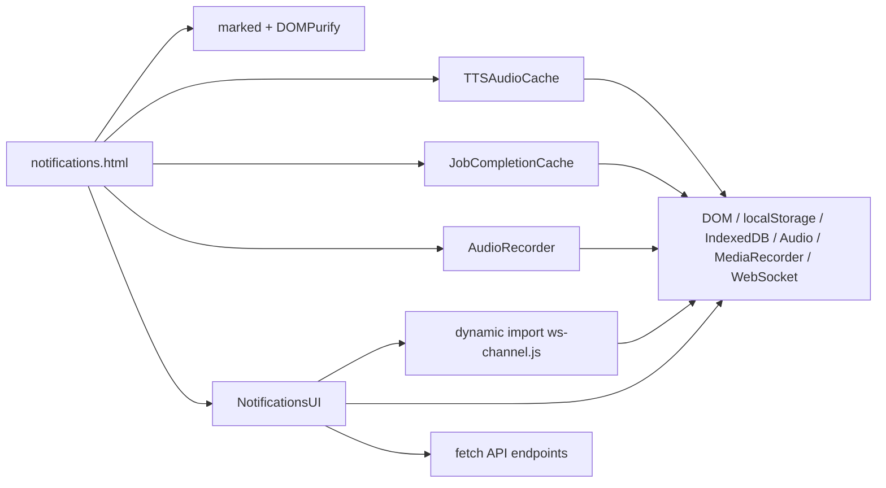
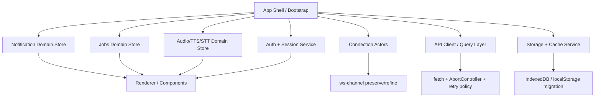

# Deep Research Assessment of the Uploaded JavaScript Notifications UI

## Executive summary

The uploaded UI is not a React/Redux/MobX application. It is a framework-free browser application assembled with script tags, vendor globals, and one very large imperative controller, `NotificationsUI`, plus four auxiliary modules: `ws-channel.js`, `tts-audio-cache.js`, `job-completion-cache.js`, and `audio-recorder.js`. From static inspection, the central controller spans roughly 16.8k lines, initializes about 115 instance fields in its constructor, and exposes about 279 class methods. That scale is now the dominant architectural risk: the code works as an application, but it no longer behaves like a coherent module system. fileciteturn0file0 fileciteturn0file1 fileciteturn0file2 fileciteturn0file3 fileciteturn0file4 fileciteturn0file5

The best subsystem in the upload is `ws-channel.js`. It already uses an explicit state model, a single reconnect owner (`onclose`), generation tokens to drop stale callbacks, jittered reconnect delays, a handshake timeout, a circuit breaker, and browser lifecycle hooks. Those choices are broadly aligned with resilient client-connection guidance from entity["company","AWS","cloud provider"], entity["organization","Mozilla","mdn publisher"], and the WebSocket/Page Lifecycle platform docs, so I would preserve this subsystem conceptually and use it as the pattern for the rest of the app rather than rewriting it from scratch. fileciteturn0file1 citeturn11view6turn2search5turn12search0turn12search1turn12search3

The core issues are architectural drift and duplicated orchestration. Authentication refresh logic appears in multiple places; lifecycle handling exists both inside `ws-channel.js` and again in `NotificationsUI`; cache bootstrapping is partially duplicated; HTML and JS duplicate some domain constants; the page still depends heavily on inline `onclick`/`onchange` handlers and global `window.notificationsUI`; and there is at least one concrete mismatch where the logout button calls `window.freshQueueUI.logout()` while the app actually initializes `window.notificationsUI`. That combination is exactly the sort of entropy that makes growth over the last year feel expensive. fileciteturn0file0 fileciteturn0file1 fileciteturn0file3 fileciteturn0file5

My highest-confidence recommendation is **not** an immediate full rewrite. The lowest-risk, highest-value path is to turn this into a feature-sliced TypeScript application with a small number of explicit domain services and state machines: `auth/session`, `api client`, `connection actors`, `notification store`, `jobs store`, `audio/TTS store`, `cache/storage`, and `renderer/view`. For complex realtime flows, an actor/state-machine approach is materially better than more ad hoc booleans and timer handles; for server state, a query/mutation cache layer eliminates a large amount of hand-written fetch lifecycling. The strongest modern patterns for this, as of May 2026, are XState-style actors for orchestration plus a query/cache abstraction such as RTK Query or TanStack Query where a component framework is in play. citeturn7view13turn7view11turn7view12

## Codebase assessment

The current dependency structure is simple to load but difficult to reason about. `notifications.html` loads `marked`, `DOMPurify`, `tts-audio-cache.js`, `job-completion-cache.js`, `audio-recorder.js`, and the large `notifications.js` bundle; `notifications.js` then dynamically imports `ws-channel.js`. In other words, dependencies are coordinated at page-load time instead of through a typed module graph, and the application uses globals as an integration boundary. fileciteturn0file0 fileciteturn0file1 fileciteturn0file2 fileciteturn0file3 fileciteturn0file4 fileciteturn0file5



A concise module map is below.

| Module | Current responsibility | Principal dependencies | Assessment |
|---|---|---|---|
| `notifications.html` | App shell, markup, many inline handlers, script ordering | Global `window.notificationsUI`, vendor globals | Too much behavior in markup; blocks strict CSP hardening. |
| `notifications.js` | Almost all orchestration: auth, HTTP, WS, queues, TTS, notifications, rendering, history, forms, diagnostics | DOM, fetch, WebSocket, localStorage, IndexedDB, audio APIs, imported globals | Overgrown monolith; primary refactor target. |
| `ws-channel.js` | WebSocket channel state machine with reconnect/circuit breaker | WebSocket, timers, page lifecycle events | Strongest module; preserve and generalize. |
| `tts-audio-cache.js` | Dual-layer audio cache | IndexedDB, `Map`, `crypto.subtle` | Useful, but lifecycle and ownership should move under a unified storage service. |
| `job-completion-cache.js` | Persistent replay cache plus analytics | IndexedDB, `Map`, `crypto.subtle` | Useful, but initialization and storage policy are inconsistent with the rest of the app. |
| `audio-recorder.js` | Mic capture, stop/upload/transcribe cycle | MediaRecorder, FileReader, fetch | Functionally isolated, but upload/cancel/error semantics should be modernized. |

This structure has three especially important consequences. First, the module boundary is behavioral rather than semantic: the application boundary is “whatever the `NotificationsUI` class currently touches.” Second, state is custom and mutable rather than explicit and typed: there is no Redux, MobX, React Context, or equivalent external store; instead the class uses instance properties, `Map`s, `Set`s, DOM state, `localStorage`, and timer handles as an implicit global state container. Third, rendering is mixed with orchestration: string HTML generation, direct `innerHTML`/`outerHTML`, inline event attributes, event delegation, and imperative DOM updates all coexist. fileciteturn0file0 fileciteturn0file3

The highest-confidence redundant or illogical paths are these:

| Finding | Why it matters |
|---|---|
| `FILE_DRIVEN_TEST_TYPES` exists both in `notifications.js` and in an inline `<script>` inside the HTML. | This is direct drift risk for business logic. |
| `JobCompletionCache` initializes IndexedDB in its own constructor, while `NotificationsUI.init()` also calls `initializeIndexedDB()` explicitly. | Redundant initialization is a code smell and can hide startup ordering bugs. |
| Window/page lifecycle handling exists both inside `ws-channel.js` and again in `NotificationsUI._attachPageLifecycle()`. | The code comments say this duplication is “benign,” but duplicated orchestration still increases reasoning cost and makes future changes risky. |
| Token refresh behavior is spread across startup auth, `ensureValidToken()`, periodic monitoring, queue `auth_error`, audio `auth_error`, and circuit-breaker recovery. | This is the single clearest case where a missing state machine has produced duplicated side-effect logic. |
| The HTML logout button points at `window.freshQueueUI.logout()`, while the app initializes `window.notificationsUI`. | This is a concrete correctness bug or at minimum a stale integration point. |
| Several constructor fields appear stale or dead, including work-hours settings that the current watchdog comments say are no longer used. | This signals incomplete cleanup after iterative changes and raises the odds of hidden dead paths elsewhere. |

These findings come directly from the uploaded client artifacts. fileciteturn0file0 fileciteturn0file1 fileciteturn0file3 fileciteturn0file5

## Architectural diagnosis

The current state-management model is a hand-rolled object graph inside one controller. That made sense at smaller scale, but the app now has several domains that should not be co-located: authentication/session lifecycle, query/mutation server state, connection state, notification state, TTS playback state, STT recording state, queue/history state, and presentation state. XState’s current actor/state-machine model is specifically designed for complex event-driven workflows and is a much better fit for the connection/auth/audio portions of this UI than continuing to add booleans, timers, and ad hoc flags. For server data, RTK Query explicitly exists to remove hand-written fetch/cache lifecycle code, while TanStack Query supports controlled retry semantics, paused/resumed offline mutations, and serial mutation scopes. fileciteturn0file3 citeturn7view13turn7view11turn7view12

The asynchronous model is currently mixed. On the positive side, the app uses `async`/`await` widely and the WebSocket channel layer already has a disciplined reconnect pathway. On the negative side, HTTP behavior is inconsistent: some calls use `authedFetch()`, many duplicate `await ensureValidToken(); fetch(...)` inline, there is no single retry policy, and I did not find `AbortController` usage for cancelable requests. That means the code has no unified answer for cancellation, deduplicated token refresh, idempotent retries, or timeout control. Modern browser APIs give you the primitives to do this well: `AbortController` can cancel `fetch`, and a shared API client should own refresh deduplication plus retry rules by operation class. fileciteturn0file3 citeturn7view16turn11view6

The concurrency story is therefore asymmetric: **good** for WebSocket connection management, **weak** for request orchestration. `ws-channel.js` already guards against duplicate sockets, late callbacks, handshake stalls, and reconnect storms. By contrast, `ensureValidToken()` refreshes on expiry but does not itself establish a single in-flight refresh promise for callers, so concurrent expired HTTP operations can still fan out into refresh races unless other timing heuristics happen to save you. Likewise, the STT recording manager reaches into `AudioRecorder` internals by setting `_cancelling` directly, which is a sign that lifecycle ownership is not properly encapsulated. fileciteturn0file1 fileciteturn0file3 fileciteturn0file4

Connectivity fallback is partially good and partially incomplete. The WebSocket layer uses online/offline, visibility, `pagehide`, `pageshow`, and resume/freeze hooks, which is better than many browser UIs. But browser online/offline signals are only hints: `navigator.onLine` is explicitly described by MDN as inherently unreliable and should not be treated as a definitive reachability check. That means the UI should continue to use lifecycle and network events, but it also needs an active app-level reachability probe and an explicit outbox policy for user-originated mutations if offline support matters. At present, the app has IndexedDB caches, but it does not appear to use a service worker, Background Sync, or a durable write-behind queue for deferred mutations. fileciteturn0file1 fileciteturn0file2 fileciteturn0file3 fileciteturn0file5 citeturn7view6turn2search8turn2search4turn7view8turn7view9turn7view10turn11view5

The observability story is currently developer-centric rather than production-grade. The code has a debug log area, many `console.log` calls, a few local performance timestamps, and ad hoc diagnostic statements. That is enough for manual debugging, but not enough for sustained growth. The browser platform and entity["organization","OpenTelemetry","observability framework"] now support a much better posture: User Timing for app-specific marks/measures, the broader Performance APIs for navigation/resource/server timing, Long Tasks for responsiveness diagnosis, and OpenTelemetry JS for browser traces, metrics, and logs. This UI has enough transport, audio, and rendering complexity that end-to-end client telemetry is now worth the cost. fileciteturn0file3 citeturn7view5turn7view17turn11view7turn11view3

The main performance hotspots are structural, not micro-optimizations. The monolith performs many direct DOM queries and repeated string-based renders; queue and history panes frequently replace container `innerHTML` with fully regenerated card markup; some updates replace an entire card with `outerHTML` and then rehydrate parts of it; and the recorder converts recorded audio blobs to base64 before upload, adding an extra client-side conversion step. Those are exactly the kinds of patterns that become visibly expensive as queue depth, notification history, and interaction volume grow. The right fix is to reduce diff size, not to tune individual calls. Add explicit render boundaries, stop doing whole-container rewrites for routine updates, virtualize long lists when history grows, and instrument long tasks and render timings before and after each phase. fileciteturn0file3 fileciteturn0file4 citeturn7view17turn11view3

Security has both strengths and clear debt. The good news is that markdown rendering is sanitized with DOMPurify before insertion, which is the correct baseline defense for user/content-derived markdown. The weaker side is more serious: access and refresh tokens are stored in `localStorage`; several notification endpoints use an `api_key` in the query string; the page uses extensive inline event handlers and string-built HTML; and a strict CSP/Trusted Types rollout would be difficult until those inline handlers are removed. OWASP explicitly advises against storing session identifiers in local storage because JavaScript can always access it and a single XSS can exfiltrate it; MDN also recommends replacing inline event handlers with `addEventListener`, and modern Trusted Types/CSP directives can now meaningfully reduce DOM XSS attack surface on current browsers. I would treat this as medium-to-high priority architecture debt rather than a cosmetic issue. fileciteturn0file0 fileciteturn0file3 citeturn8view0turn8view1turn7view1turn7view2turn7view3

## Recommended target architecture

I recommend an **incremental target architecture** centered on explicit domain ownership, not on a wholesale framework rewrite.



The architectural goal is to separate **server state**, **workflow state**, and **view state**. Server state should live behind a single API/query layer. Workflow state should live in actors or reducers with finite transitions. View state should stay local to render units. That boundary is the foundation for every other improvement in this report. citeturn7view13turn7view11turn7view12

The realistic options are these:

| Option | Best fit | Strengths | Weaknesses | Recommendation |
|---|---|---|---|---|
| **Incremental vanilla TypeScript + XState/@xstate/store + repository/query services** | You want minimal churn and to preserve the current page/app shell. | Lowest migration risk; keeps the existing HTML shell; ideal for extracting connection/auth/audio logic first. | You must still design a rendering abstraction and module boundaries yourself. | **Best immediate path.** |
| **React + RTK Query + XState for complex realtime/audio flows** | You want a more opinionated app architecture and team-standard conventions. | RTK Query removes large amounts of hand-written fetching/caching logic; Redux Toolkit has mature conventions. | Higher migration cost; likely requires page/component rewrite sooner. | Best if a strategic front-end platform shift is already planned. |
| **React + TanStack Query + lightweight client store + XState only where needed** | You want best-in-class server-state ergonomics without a large global store. | Excellent query/mutation ergonomics, offline mutation support, scoped serial mutations. | More architectural choices to standardize than RTK. | Strong alternative if the UI becomes more componentized and server-state heavy. |

RTK Query is specifically positioned as a way to eliminate hand-written fetching/caching logic, XState explicitly targets event-driven state machines and the actor model, and TanStack Query supports paused/resumed offline mutations and scoped serial mutation execution. citeturn7view11turn7view13turn7view12

My concrete recommendation is therefore:

- **Near term:** keep the current page shell, adopt TypeScript, retain `ws-channel.js`, extract services/stores, and replace ad hoc mutable controller state with reducers/actors.
- **Medium term:** move string-generated rendering into components or templates with explicit props and delegated events.
- **Long term:** only migrate to a heavier framework if your team wants its ergonomics across the entire frontend platform.

A good first code boundary is a unified API client. Today the app has too many repeated “ensure token, then fetch, then custom error handling” paths. The client below illustrates the pattern to standardize on.

```ts
type RetryClass = 'none' | 'idempotent-read' | 'safe-replayable-write';

interface RequestOptions extends RequestInit {
  retryClass?: RetryClass;
  timeoutMs?: number;
}

export function createApiClient(deps: {
  getAccessToken: () => string | null;
  refreshAccessToken: () => Promise<boolean>;
  onAuthFailure: () => void;
}) {
  let refreshPromise: Promise<boolean> | null = null;

  async function ensureFreshToken() {
    const token = deps.getAccessToken();
    if (token && !isExpired(token)) return token;

    if (!refreshPromise) {
      refreshPromise = deps.refreshAccessToken().finally(() => {
        refreshPromise = null;
      });
    }

    const ok = await refreshPromise;
    if (!ok) {
      deps.onAuthFailure();
      throw new Error('auth_refresh_failed');
    }

    const refreshed = deps.getAccessToken();
    if (!refreshed) throw new Error('missing_access_token');
    return refreshed;
  }

  async function request<T>(url: string, options: RequestOptions = {}): Promise<T> {
    const token = await ensureFreshToken();
    const controller = new AbortController();
    const timeout = setTimeout(() => controller.abort('timeout'), options.timeoutMs ?? 15000);

    try {
      return await retryPolicy(
        async () => {
          const response = await fetch(url, {
            ...options,
            signal: controller.signal,
            headers: {
              Authorization: `Bearer ${token}`,
              'Content-Type': 'application/json',
              ...(options.headers ?? {}),
            },
          });

          if (!response.ok) throw classifyHttpError(response);
          return (await response.json()) as T;
        },
        options.retryClass ?? 'none'
      );
    } finally {
      clearTimeout(timeout);
    }
  }

  return { request };
}
```

For the highest-churn workflows, use explicit machines or actors. This is where the current app will get the biggest reduction in accidental complexity.

```ts
import { setup, assign, fromPromise } from 'xstate';

export const queueConnectionMachine = setup({
  types: {
    context: {} as {
      attempts: number;
      lastError?: string;
    },
    events: {} as
      | { type: 'CONNECT' }
      | { type: 'AUTH_OK' }
      | { type: 'AUTH_FAIL'; message: string }
      | { type: 'CLOSE'; code?: number }
      | { type: 'RETRY' },
  },
  actors: {
    connectSocket: fromPromise(async () => {
      // delegate to ws-channel or adapter
      return true;
    }),
  },
}).createMachine({
  id: 'queueConnection',
  initial: 'disconnected',
  context: { attempts: 0 },
  states: {
    disconnected: {
      on: { CONNECT: 'connecting', RETRY: 'connecting' },
    },
    connecting: {
      invoke: { src: 'connectSocket' },
      on: {
        AUTH_OK: { target: 'connected', actions: assign({ attempts: 0, lastError: undefined }) },
        AUTH_FAIL: { target: 'authFailed', actions: assign({ lastError: ({ event }) => event.message }) },
        CLOSE: 'backoff',
      },
    },
    connected: {
      on: { CLOSE: 'backoff' },
    },
    authFailed: {
      on: { RETRY: 'connecting' },
    },
    backoff: {
      after: {
        1000: 'connecting',
      },
    },
  },
});
```

This same pattern should be applied to: auth refresh, TTS playback queue, active action-required notification state, and STT recording lifecycle. Those are all currently state-machine-shaped problems already being implemented without a machine. fileciteturn0file1 fileciteturn0file3 fileciteturn0file4 citeturn7view13

## Prioritized refactor recommendations

The sequence below is optimized for risk reduction, not for aesthetic cleanup.

| Priority | Refactor | Why now | Concrete changes | Estimated effort |
|---|---|---|---|---|
| **P0** | Extract **Auth/Session + API client** | This removes the single largest source of duplicated side effects. | Centralize refresh dedupe, request timeout, cancellation, auth header injection, response classification, and replay policy. Replace direct `fetch` calls incrementally. | **4–6 engineer-days** |
| **P0** | Make **`ws-channel.js` the canonical connection core** | This is the healthiest part of the app and should become the template. | Keep the channel state machine; remove duplicated lifecycle wiring from `NotificationsUI`; expose typed events and metrics adapters. | **3–5 engineer-days** |
| **P0** | Introduce **domain stores/actors** for auth, notifications, jobs, audio | The monolith’s custom state is the main scalability limit. | Extract state slices out of the class, beginning with connection/auth/audio/notifications; add explicit events and selectors. | **8–12 engineer-days** |
| **P1** | Replace **inline handlers and HTML-string actions** | Required for maintainability and CSP/Trusted Types hardening. | Move markup event attributes to delegated listeners or component bindings; remove `window.notificationsUI` coupling from templates. | **6–10 engineer-days** |
| **P1** | Create a **renderer boundary** for queues/history/notifications | Full-container rerenders are the biggest performance smell. | Stop replacing container `innerHTML` for routine updates; introduce keyed render units; preserve local UI state by design, not by post-hoc DOM copying. | **8–14 engineer-days** |
| **P1** | Unify **storage/cache service** | Current caches are useful but inconsistent. | One storage abstraction for IndexedDB/localStorage/session data, with schema versioning, eviction policy, and ownership rules. | **4–7 engineer-days** |
| **P2** | Add **offline outbox and service-worker path** for selected mutations | Current app caches well enough for reads/audio, but not for durable user writes. | Use service worker + Background Sync only for replay-safe actions; keep critical realtime operations online-only if semantics are strong. | **6–12 engineer-days** |
| **P2** | Add **production observability** | Needed before deeper performance and correctness work. | User Timing marks, OTel browser instrumentation, long-task collection, connection metrics, refresh metrics, cache hit/miss metrics. | **4–6 engineer-days** |
| **P2** | Harden **security posture** | Current token/storage/CSP posture is not where a 2026 browser app should be. | Migrate tokens away from localStorage where possible, remove `api_key` query parameters, adopt CSP report-only, then Trusted Types. | **5–9 engineer-days** |

A few recommendations deserve more precise guidance:

**Unify synchronous and asynchronous processing.** Keep synchronous UI state transitions pure, and push all I/O into effect handlers/adapters. Today the class frequently combines DOM updates, storage writes, token validation, and transport calls in the same method. That is exactly what makes testing and rollback hard. Use reducers or actors for state, and repository/effect modules for HTTP/WS/audio/storage. fileciteturn0file3 citeturn7view13turn7view11

**Adopt a strict error taxonomy.** Split errors into `auth`, `network`, `timeout`, `validation`, `server-5xx`, `offline`, `conflict`, and `user-cancelled`. Then define retry policy by class: idempotent reads may retry with capped backoff and jitter; non-idempotent writes should default to no automatic retry unless an outbox/replay token exists; auth failures should go through exactly one refresh path; user-cancelled operations should not page error telemetry. The current code has fragments of this thinking, but not a single policy table. fileciteturn0file1 fileciteturn0file3 citeturn11view6turn7view16

**Improve connectivity logic with active reachability.** Continue listening to online/offline and page lifecycle events, but do not treat them as truth. Add a small authenticated reachability probe or health endpoint, keep a last-known-good timestamp, and surface degraded states explicitly in the store. This is especially important because MDN is explicit that `navigator.onLine` is only a hint and can be wrong. fileciteturn0file1 fileciteturn0file3 citeturn7view6turn2search8turn2search4

**Stop UA sniffing the Firefox TTS path.** The current “Firefox compatibility hack” uses `navigator.userAgent` plus other browser-detection heuristics. In 2026 that is strategically brittle: MDN’s guidance remains that UA sniffing is unreliable and feature detection is preferable. Replace this with capability probes around the exact behavior you need, and keep browser-specific deny-lists as a last resort with test coverage and expiry comments. fileciteturn0file3 citeturn11view4turn10search5

## Migration, testing, and rollback plan

The safest migration is a **strangler pattern** rather than a rewrite branch.

### Phase-by-phase migration

**Phase A: stabilize boundaries.** Add TypeScript checking to new modules, create `api-client`, `auth-service`, `storage-service`, and `connection-service`, and begin routing existing methods through those abstractions without changing UI behavior. This phase should also fix the concrete integration defects and duplicated constants. fileciteturn0file0 fileciteturn0file3

**Phase B: extract workflow state.** Move auth refresh, WebSocket coordination, TTS queue state, and notification/action-required state into actors or reducers. `NotificationsUI` should become a composition root, not a state container. `ws-channel.js` stays, but `NotificationsUI` stops second-guessing its lifecycle behavior. fileciteturn0file1 fileciteturn0file3 citeturn7view13

**Phase C: replace rendering hotspots.** Start with the queue/history/notification cards because those areas currently use full-container or whole-card HTML replacement. Introduce keyed render functions or components and move action wiring out of HTML string attributes. This phase unlocks CSP and performance gains simultaneously. fileciteturn0file0 fileciteturn0file3 citeturn7view1turn7view2

**Phase D: add observability and performance budgets.** Before enabling more advanced offline or sync paths, add User Timing marks, long-task measurement, and browser telemetry, then set budgets for queue render time, TTS start latency, reconnect success, auth refresh rate, and cache hit rate. fileciteturn0file3 citeturn7view5turn7view17turn11view3

**Phase E: harden offline/security posture.** Introduce a service worker only after mutation semantics are classified; adopt Background Sync only for safe deferred operations; migrate token storage strategy if your server can support an HttpOnly-cookie design; and turn on CSP report-only before enforcing Trusted Types. citeturn11view5turn7view9turn7view10turn8view1turn7view2turn7view3

### Rollback strategy

| Change | Rollback approach |
|---|---|
| New API client | Keep old call sites behind a feature flag or adapter; route per-endpoint until parity is proven. |
| Domain stores/actors | Dual-write state during migration: old `NotificationsUI` fields plus new store, then cut over slice by slice. |
| Renderer extraction | Replace one pane at a time and keep a fallback render path for the old markup until interaction parity is verified. |
| Service worker/offline outbox | Ship behind an opt-in flag; keep unregister path and server-side replay dedupe. |
| CSP/Trusted Types | Start in report-only mode; triage violations; only enforce after inline handlers are removed. |

### Testing checklist

The current artifacts suggest some testing readiness already exists. The HTML uses extensive `data-testid` attributes, and `ws-channel.js` was explicitly designed with testability in mind through injectable `WebSocketCtor` and a watchdog test hook. That foundation is good; it should be expanded into a layered test strategy. fileciteturn0file0 fileciteturn0file1

Use this checklist:

- **Unit tests**
  - Reducers/selectors/state machines for auth, notifications, TTS queue, and STT lifecycle.
  - Retry policy functions, error classifiers, eviction logic, and storage schema migrations.
  - Timer-heavy logic with fake timers. citeturn11view1turn4search5

- **Integration tests**
  - HTTP request flows with Mock Service Worker in browser and test environments.
  - Token refresh dedupe under concurrent expired requests.
  - IndexedDB schema/open/eviction behavior.
  - AudioRecorder permission-denied, unsupported-browser, empty-recording, and cancel paths. fileciteturn0file4 fileciteturn0file5 citeturn7view14turn11view2

- **Realtime tests**
  - WebSocket auth success/failure.
  - reconnect after transient close.
  - circuit opens on rapid fail and budget exhaustion.
  - pagehide/pageshow/bfcache restore.
  - offline/online with queued user actions.
  - multi-channel token-refresh coordination. fileciteturn0file1 fileciteturn0file3 citeturn7view15turn7view4turn12search0turn12search1turn12search6

- **UI/accessibility tests**
  - Prefer role/name queries over implementation-specific selectors for stable user-centric tests.
  - Assert keyboard interactions for pause/resume/cancel/retry and focus transitions during voice input. citeturn11view0

- **Performance tests**
  - Mark/measure queue render paths, notification insertion, TTS start, audio first-frame latency.
  - Collect long tasks and track regressions before/after renderer extraction.
  - Exercise large history datasets to determine virtualization threshold. citeturn7view17turn11view7turn11view3

- **Security tests**
  - CSP report-only violation collection.
  - Trusted Types sink coverage for `innerHTML`/`outerHTML`.
  - token-storage migration validation.
  - URL/query-string secret scanning. citeturn7view1turn7view2turn8view1

## Open questions and limitations

This report is bounded by the uploaded client-side artifacts. I did **not** receive server handlers, API contracts, a build pipeline, package manifests, CI configuration, or the existing automated test suite. As a result, I can confidently assess client architecture, duplicated logic, state handling, rendering strategy, and browser/platform posture, but I cannot fully verify server-side idempotency, token-storage alternatives, close-code semantics, request replay guarantees, or how much of the apparent client drift is already constrained elsewhere in the system. I also cannot tell from the uploaded files whether another script outside this bundle defines `freshQueueUI`, though nothing in the uploaded code does. fileciteturn0file0 fileciteturn0file1 fileciteturn0file3

Overall, the codebase is **very salvageable**. The real-time transport layer is already better than average. The main problem is that almost every other concern accumulated around a single controller until architectural boundaries disappeared. If you fix that one thing—by introducing explicit domains, a unified async/error policy, and a renderer boundary—you will remove the majority of the app’s current fragility without losing the behavior that already works. fileciteturn0file1 fileciteturn0file3