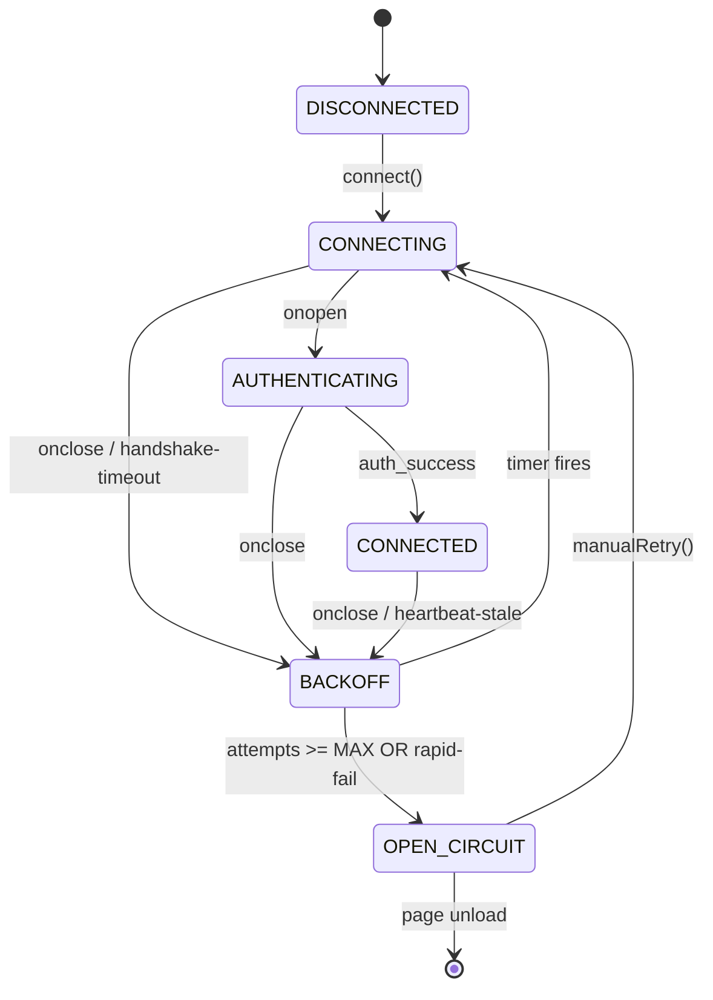

# Design Review — WS Reconnect Circuit-Breaker

**Status**: Synthesis complete. Q1–Q12 FROZEN 2026-05-02.
**Inputs**: expert-brief.md, solution-claude.md, solution-openai.md (this directory).

---

## 1. Problem Restated

`src/fastapi_app/static/js/notifications.js` schedules WebSocket
reconnects with no upper bound. When the network path to `:7999` stays
broken (in the observed incident: an SSH tunnel exhausted file
descriptors and silently RST'd subsequent handshakes), three failure
modes compound:

1. The close handler at `notifications.js:2189` and `:2239` schedules a
   reconnect on every `onclose`.
2. The 90-second health monitor at `notifications.js:878` independently
   schedules a reconnect AND zeros `connectionRetries` to give it a
   "fresh start" — defeating any cap that the close-handler path might
   try to enforce.
3. Each `new WebSocket(url)` consumes a slot in Chromium's per-renderer
   pending-handshake pool (`kMaxPendingWebSocketConnections = 255`,
   `services/network/websocket_throttler.h`). Because the slot is held
   until the URLRequest underlying the handshake terminates, slow-rejecting
   upstreams (SSH tunnel, half-open TCP, intermediate firewall) keep
   slots until 255 are pinned. Symptom flips from
   `WebSocket connection failed:` (transport-level) to
   `WebSocket connection failed: Insufficient resources` (renderer-cap),
   and the page cannot recover without killing the tab.

The Lupin-owned bug is items 1 + 2: reconnect scheduling is distributed
across two callers with shared mutable state, no upper bound, and a
periodic "fresh start" that hides the runaway. Item 3 is the OS/browser
feedback loop that turns the bug from "annoying log spam" into
"unrecoverable tab" within ~16 minutes.

## 2. Synthesized Design

The two reviewer responses converge strongly. The synthesis adopts:

| Concern | Decision |
|--------|----------|
| Per-channel state | Replace the shared `connectionRetries` with one state record per channel (`queue`, `audio`). |
| Single reconnect owner | `onclose` is the only event-driven scheduler. The watchdog re-arms `scheduleReconnect()` ONLY when `readyState === CLOSED` AND no reconnect is already pending. The watchdog NEVER touches the attempt counter. |
| Counter reset rule | Counter zeros only on application-level `auth_success` for the corresponding channel. Never on TCP `open`, never on a wall-clock tick, never from the watchdog. |
| Backoff | Capped exponential with full jitter (Brooker / AWS Architecture Blog). `delay = floor(BASE_MS + random() * (min(CAP_MS, BASE_MS * 2^attempt) - BASE_MS))`. `BASE_MS = 1000`, `CAP_MS = 30_000`. |
| Circuit trip rule | Trip when `attempts >= MAX_ATTEMPTS_PER_CHANNEL` (default 20) OR fast-fail (`>= 5` close events with `wasEverOpen === false` within a 30s rolling window). |
| Circuit shape | Two-state (closed/open). Manual "Retry now" button is the user-driven half-open probe. No half-open auto-probe. |
| Cleanup | On any reconnect, the prior `WebSocket` reference has its four `on*` handlers nulled, `close(1000, "cleanup")` called, then the reference is nulled. This is what releases the 255-slot before the next `new WebSocket()`. |
| Pre-construct guard | Before calling `new WebSocket(url)`, check that there is no live socket in `CONNECTING` or `OPEN` state for that channel. This is the load-bearing line that prevents refilling the 255-slot pool when upstream is slow-rejecting. |
| Generation token | Each `connect()` increments a per-channel monotonic counter. Late-arriving `onclose`/`onerror`/`onopen` callbacks check the token before mutating state. Eliminates double-fire from stale closures. |
| `onerror` policy | `onerror` is logged but NEVER schedules. RFC 6455 §7.1.4 guarantees `error` precedes `close`, so the `close` path is sufficient and double-handling is the bug. |
| Page lifecycle | `visibilitychange=hidden` defers further `connect()` calls until visible. `pageshow.persisted=true` triggers `manualRetry()`. `online` triggers `manualRetry()`. `offline` calls `close()` to release slots while disconnected. `pagehide` calls `close()` (BFCache eligibility). v1 ships with all of these — they are cheap and orthogonal to the state machine. |
| UI surface | A dismissable banner at the top of the notifications UI when either channel is `OPEN_CIRCUIT`. Includes "Retry now" button + (in dev mode) hint about SSH tunnel. |
| Server-side | No new server logic in v1 EXCEPT explicit application close codes for auth failures (4001 = invalid token, 4002 = session conflict, 4003 = subscription denied). These let the client distinguish "permanent failure, do not retry" from "transient, do retry" via `CloseEvent.code`. |
| Configuration | All thresholds live as class-level constants in the new `ws-channel.js` module (`MAX_ATTEMPTS_PER_CHANNEL`, `BACKOFF_BASE_MS`, `BACKOFF_CAP_MS`, `RAPID_FAIL_COUNT`, `RAPID_FAIL_WINDOW_MS`, `HANDSHAKE_TIMEOUT_MS`). No INI plumbing in v1. |

### Disambiguation — Two Unrelated "Circuit Breakers" in the Codebase

The term "circuit breaker" is overloaded across the Lupin codebase. To
prevent confusion at code-search time:

| Concept | File | State name | Domain |
|---------|------|------------|--------|
| **WS reconnect circuit breaker** (THIS milestone) | `src/fastapi_app/static/js/ws-channel.js` | `OPEN_CIRCUIT` (state name), `circuitOpen` (boolean field), `ws-circuit-open` (event) | Browser WebSocket reconnect bounding |
| **Proxy-trust circuit breaker** (pre-existing) | `src/fastapi_app/static/html/auth/admin/js/proxy-dashboard.js` (and backend) | `circuit_breaker_state.status` (object) | Decision-proxy backend trust scoring |

The names do not collide as identifiers (`OPEN_CIRCUIT` vs
`circuit_breaker_state`), but a future grep on "circuit breaker" will
return both. Keep them mentally separate.

### 2.1. Module Boundary

The state machine lives in a new file: `src/fastapi_app/static/js/ws-channel.js`.
Exports a single factory: `createChannel({ url, name, onMessage, onAuthSuccess, onCircuitOpen, onStateChange })`.
NotificationsUI consumes two `WSChannel` instances and routes
domain-level messages into them. The state machine knows nothing about
queue vs audio specifics — that lives in the consumer.

### 2.2. State Machine

```
DISCONNECTED ──connect()──> CONNECTING
CONNECTING ──onopen──>      AUTHENTICATING
AUTHENTICATING ──auth_success──> CONNECTED
CONNECTING/AUTHENTICATING ──onclose/timeout──> BACKOFF
CONNECTED ──onclose/heartbeat-stale──> BACKOFF
BACKOFF ──timer fires──>    CONNECTING
BACKOFF ──budget exhausted──> OPEN_CIRCUIT
OPEN_CIRCUIT ──manualRetry──> CONNECTING
```

Visualization:



## 3. FROZEN Decisions

| ID | Decision | Rationale |
|----|----------|-----------|
| **Q1 FROZEN 2026-05-02** | Per-channel state, not shared. Two `WSChannel` instances inside `NotificationsUI`. | Both reviewers agree. Shared counter is the proximate hide-the-bug mechanism. |
| **Q2 FROZEN 2026-05-02** | Counter resets only on `auth_success`. Never on TCP `open`, never on a timer, never on `online` event. | Both reviewers agree. TCP-open reset masks auth-loop failures (e.g., expired token). |
| **Q3 FROZEN 2026-05-02** | `onclose` is the SOLE reconnect scheduler. The 90s health monitor becomes a watchdog that only fires `scheduleReconnect()` when `readyState === CLOSED` AND no reconnect is pending; never touches the counter. | Both reviewers agree. Resolves the race + the proximate cause of "461 attempts." |
| **Q4 FROZEN 2026-05-02** | Backoff: capped exponential with **full jitter**. `BASE_MS=1000`, `CAP_MS=30_000`. 20 attempts ≈ 6–10 minutes wall-clock. | Both reviewers agree on jitter; chose full over decorrelated per Claude reviewer's analysis (cleaner saturation behavior for single-server case). |
| **Q5 FROZEN 2026-05-02** | `MAX_ATTEMPTS_PER_CHANNEL = 20`. | Both reviewers approve 20. OpenAI suggests 12 for dev — rejected for v1 (one threshold is simpler; revisit in §5 if telemetry shows >1% of sessions hit 20). |
| **Q6 FROZEN 2026-05-02** | Rapid-fail tripwire: `>= 5` close events with `wasEverOpen=false` within a 30-second rolling window opens the circuit immediately, bypassing the 20-attempt budget. | OpenAI proposes 5-in-30s; Claude proposes 3-in-5s. Adopt OpenAI's 5-in-30s for v1 — gentler, fewer false trips during legitimate quick-flap. Tunable. |
| **Q7 FROZEN 2026-05-02** | `readyState` guard before `new WebSocket(url)`. If a prior socket exists and is `CONNECTING` or `OPEN`, the call is a no-op. | Claude reviewer flags this as the load-bearing line for the 255-slot fix. |
| **Q8 FROZEN 2026-05-02** | Generation token per `connect()`. Late callbacks are dropped when the token doesn't match. | Claude reviewer's explicit recommendation. OpenAI implies the same via "single owner" but doesn't enumerate. |
| **Q9 FROZEN 2026-05-02** | Page Lifecycle integration ships in v1, not deferred to v1.1. `visibilitychange`, `pageshow.persisted`, `pagehide`, `online`, `offline`, `freeze`, `resume`. | Page Lifecycle is cheap and the hidden-tab+resume-storm scenario is a real failure mode the user has already hit (tab switching during long sessions). Ship together, not in two passes. |
| **Q10 FROZEN 2026-05-02** | UI banner is global (not per-channel). One banner if either channel is `OPEN_CIRCUIT`. Banner text: `"Connection lost — server unreachable after repeated attempts. Check the SSH tunnel / network, then click Retry now."` Dev-mode-only suffix mentions SSH tunnel and "Too many open files." | Both reviewers agree on banner + retry button. Per-channel banners would clutter; one banner with breaker state visible in the WS-status pills is sufficient. |
| **Q11 FROZEN 2026-05-02** | Server-side: add explicit close codes for auth failures (4001/4002/4003). Do NOT add uvicorn `ws_ping_interval`/`ws_ping_timeout` in v1 — server already sends app-level `sys_ping` every 30s via `WebSocketManager.send_heartbeat_to_all`. Re-evaluate in v2 only if server-side dead-client detection becomes a measured problem. | Both reviewers recommend distinguishable close codes. uvicorn protocol pings would be additive; deferred to keep blast radius minimal. |
| **Q12 FROZEN 2026-05-02** | No feature flag. Direct land + revert-via-git if needed. | Reviewers offer feature flag as a fallback option. We reject because: (a) the risk surface is one JS file plus a small server-side close-code change; (b) the change is a strict superset of correct behavior — the worst regression is "circuit opens too early during legitimate flap" which is observable and tunable; (c) feature flags here would create permanent dual code paths per the `feature_flag_preserves_old_path` memory rule which says: *"A runtime fork via INI flag means BOTH branches stay first-class and maintained forever — never plan A/B then retire the loser."* Rollback is `git revert <commit>`. |

## 4. Differences Between Reviewers and How They Were Resolved

| Topic | Claude reviewer | OpenAI reviewer | Resolution |
|-------|----------------|-----------------|------------|
| Backoff base | 500 ms | 2000 ms | 1000 ms — middle ground; first attempt feels responsive without being flickery |
| Rapid-fail threshold | 3 in 5s | 5 in 30s | 5-in-30s (Q6) — gentler, fewer false trips |
| Page Lifecycle phase | v1 | v1.1 | v1 (Q9) — cheap, orthogonal, addresses real failure mode |
| Generation token | Explicit | Implicit ("single owner") | Explicit (Q8) — robust against the closure-capture-of-stale-ws pattern |
| MAX_ATTEMPTS dev override | Same as prod | 12 for dev | Same value (Q5) — simpler; tuning lever lives in code constant, not env-conditional |

## 5. Out of Scope for v1

- **Multiplexing `/ws/queue` and `/ws/audio` over a single transport.** Both reviewers flag the dual-WS architecture as the deeper issue (Phoenix, signalr, ably all use one transport with channel-namespaced messages). Worth doing eventually; not a v1 prerequisite.
- **`WebSocketStream` for the audio channel.** Chrome-only, useful for backpressure on high-throughput streams. Defer until measured pressure on the audio channel.
- **`SharedWorker` cross-tab connection broker.** Real benefit, real debug cost, intermittent Safari support. Defer.
- **`Server-Sent Events` fallback for proxied/firewalled environments.** Reasonable degraded mode but not v1.
- **Telemetry beacon for circuit-open events.** Useful for tuning Q5 + Q6 in production. Defer to v2 once we have any real traffic.
- **Server-side per-source-IP WS handshake rate limit (Solution D in expert brief).** Defense-in-depth, doesn't fix today's bug. Defer.
- **uvicorn `ws_ping_interval` / `ws_ping_timeout`.** App-level `sys_ping` already covers this surface. Re-evaluate only if dead-client detection becomes a measured problem.

## 6. Risk Surface

| Risk | Mitigation |
|------|------------|
| New code path replaces tested-in-prod path; could regress legitimate-flap recovery | Layer-1 unit tests cover backoff math + state transitions; Layer-3 in-page tests assert recovery from intermittent failures resets the counter |
| `readyState` guard might no-op a legitimate manual-retry click | `manualRetry()` calls `cleanupSocket()` first, which nulls and closes the prior reference, so the guard sees no live socket and proceeds |
| Generation token bug could deadlock a channel | Layer-1 test: drive 100 close/connect cycles and assert state always reaches CONNECTED or OPEN_CIRCUIT, never wedges in BACKOFF without a pending timer |
| Page Lifecycle hooks fire during init before channel exists | Hooks attached AFTER channel construction; init order matters and is asserted in the integration test |
| `onerror` removal might hide a class of failures the close handler doesn't see | RFC 6455 guarantees error precedes close; if a real-world browser violates this, we'll see the `state stuck in CONNECTING` symptom and can revert |
| OPEN_CIRCUIT after Retry-now, immediately retripping | Manual retry resets attempts to 0 AND clears the rapid-fail timestamp window; tested in Layer 1 |
| Two channels open simultaneously could both trip in the same incident, requiring two clicks | Banner is global (Q10); one Retry-now click invokes `manualRetry()` on both channels |
