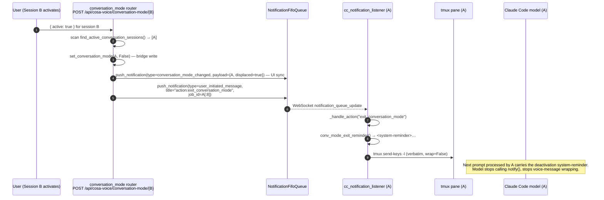

# Conversation-Mode Self-Exit Signal Gap

**Date**: 2026.05.05
**Status**: 🟡 Draft — finding documented, fix not yet planned
**Owner**: [LUPIN]
**Pattern**: Bug fix (asymmetric routing logic) — single phase
**Related**:
- `src/rnd/v0.1.7/2026.04.27-conversation-mode-design.md` (foundation)
- `src/rnd/v0.1.7/2026.04.30-conv-mode-three-layer-enforcement/01-design.md` (three-layer enforcement model that this gap belongs to)
- `src/rnd/v0.1.7/2026.04.29-ws-event-cleanup-to-custom-notification-types/01-design.md` (custom-type routing the action push relies on)

---

## 1. TL;DR

When conversation mode is exited via a **same-session** transition (the active session deactivating itself — UI toggle button, MCP `exit_conversation_mode()`, voice phrase "exit conversation mode"), the bridge file flips to `false` but **no in-context counter-signal reaches the model**. The model continues to honor the conversation-mode contract from prior `<system-reminder>` blocks still resident in its context window — wrapping replies in voice-message format, calling `notify()` after every turn — until those reminders scroll out.

The infrastructure to inject a deactivation reminder **already exists and works correctly** for the displace transition (Session A active → Session B activates → A receives `action:exit_conversation_mode` and the listener injects `conv_mode_exit_reminder()` into A's tmux pane). The router's deactivate branch never fires that same push for the self-exit case.

**Cheap fix**: mirror the displace branch's action push into the deactivate branch with `job_id=session_id[:8]`, plus a small wording tweak to `conv_mode_exit_reminder()` so the body covers both reasons.

---

## 2. Current State — Path That Works (Displace)



### File:line evidence (displace path works)

| Step | Location |
|---|---|
| Router scan + per-displaced action push | `src/cosa/rest/routers/conversation_mode.py:164-225` (`if body.active:` branch) |
| Specifically the action push | `src/cosa/rest/routers/conversation_mode.py:204-219` |
| Listener routes title-prefixed actions | `src/lupin_cli/claude_code/hooks/lib/cc_notification_listener.py:257-262` |
| Listener handler dispatch | `src/lupin_cli/claude_code/hooks/lib/cc_notification_listener.py:281-300` |
| Verbatim tmux injection (`wrap=False`) | `src/lupin_cli/claude_code/hooks/lib/cc_notification_listener.py:302-326` |
| Reminder body builder | `src/lupin_cli/claude_code/hooks/lib/hook_common.py:1118-1152` |

### Tested by

`src/tests/unit/test_conversation_mode_router.py:283-338` (`test_activate_displaces_active_session_pushes_three_events`) — asserts the activate-while-displacing path emits three pushes including the `action:exit_conversation_mode` push at `job_id=other_sid[:8]`.

`src/tests/unit/test_conversation_mode_router.py:370-432` (`test_activate_displaces_multiple_active_sessions`) — asserts all `n` displaced sessions receive their own action push.

`src/tests/smoke/test_cc_notification_listener.py:489-514` (`test_action_exit_conversation_mode_injects_reminder`) — listener-side smoke test confirming `_handle_action("exit_conversation_mode", {})` triggers `_inject_via_tmux` with the reminder text.

`src/tests/unit/test_conv_mode_wrap.py:271-312` — exhaustive coverage of `conv_mode_exit_reminder()` body content.

---

## 3. The Asymmetry — Self-Exit Path

`src/cosa/rest/routers/conversation_mode.py:162-229` has two branches:

| Branch | Lines | When | Pushes |
|---|---|---|---|
| Activate | 164–225 | `body.active == True` | scan + per-displaced `conversation_mode_changed` (UI) + `action:exit_conversation_mode` (listener) + final activate event |
| **Deactivate** | **226–229** | **`body.active == False`** | **`set_conversation_mode(sid, False)` only — no action push** |

Both branches fall through to lines 234–247 which push a single `conversation_mode_changed` event for UI sync. That event is NOT an action — the listener filter at `cc_notification_listener.py:257-262` only routes `user_initiated_message` events whose `title` starts with `"action:"` through `_handle_action`. A `conversation_mode_changed` event is type-routed to UI tabs only and never reaches the listener's action dispatcher.

### Tested-as-intended (this is the gap codified)

`src/tests/unit/test_conversation_mode_router.py:434-477` — `test_deactivate_does_not_scan_or_displace`:

> *"active=false bypasses the lock + scan; only pushes its own deactivate notification."*

Asserts `mock_nq.push_notification.call_count == 1` (only the UI sync event, no action push to the same session's listener). This test was added when the displace path was implemented; the self-exit transition's effect on the model was never separately exercised.

---

## 4. Why the Model Retains the Contract

The three-layer enforcement model from `2026.04.30-conv-mode-three-layer-enforcement/01-design.md` has three injection points, each gating differently on the bridge state:

| Layer | Function | File:line | Bridge-gated? | Behavior after self-exit |
|---|---|---|---|---|
| Voice prompts (listener) | `conv_mode_wrap` | `hook_common.py:1043-1115` | **Yes** — passes through unwrapped when bridge is false | Future voice prompts arrive without the `<voice-message>` envelope ✅ |
| Terminal-typed prompts (UserPromptSubmit hook) | `conv_mode_reminder_block` | `hook_common.py:1155-1192` | **Yes** — returns `""` when bridge is false | Future typed prompts arrive without an additionalContext reminder ✅ |
| Deactivation transition (listener action) | `conv_mode_exit_reminder` | `hook_common.py:1118-1152` | **No** — emits unconditionally, but only fires when listener routes `action:exit_conversation_mode` | **Never triggered on self-exit ❌** |

The first two layers correctly stop emitting "active" reminders the moment the bridge flips. But they only act on **future** prompts. They cannot retract reminders already in the model's context.

The **third layer is the only one that produces a counter-signal** the model can act on, and on the self-exit path it never fires.

So after a self-exit:
- Bridge is `false`
- New prompts arrive clean (no voice-message envelope, no additionalContext reminder)
- Context window still holds N prior turns of `<system-reminder>Conversation mode is active. After your response, call notify(...)…</system-reminder>` blocks
- With nothing telling it to stop, the model honors the most recent contract it can see
- Model keeps wrapping replies and keeps calling `notify()` until the prior reminders scroll out (depends on context size and turn count — could be many turns)

This matches the user-reported symptom: *"Claude wants to hang on to the conversation mode status even after it's been exited."*

---

## 5. Affected Surfaces (Sweep Check)

Per the "sweep for all pattern offenders" rule — every deactivation surface that lands at the deactivate branch carries the gap:

| Surface | Hits the router? | Same-session deactivate? | In-context counter-signal? |
|---|---|---|---|
| UI toggle button on the active session's card | Yes — POST `/api/cosa-voice/conversation-mode/{sid}` `{active:false}` | Yes | **No** ❌ |
| MCP `exit_conversation_mode()` from the active session | Yes — via `_flip_conversation_mode(False)` HTTP path (`cosa_voice_mcp.py:1374-1390`) | Yes | **No** ❌ |
| Voice phrase "exit conversation mode" → model calls MCP tool | Same as MCP path | Yes | **No** ❌ |
| Slash command `/conversation-mode-off` (if wired) | Same as MCP path | Yes | **No** ❌ |
| MCP fallback when HTTP unreachable | No — direct `set_conversation_mode()` bridge write (`cosa_voice_mcp.py:1394`) | Yes | **No** (degraded mode — expected, no broadcast either) |
| Activate-elsewhere displace | Yes (other session activating) | No (different session) | **Yes** ✅ |

The first four are the offenders. The fifth is degraded-mode-by-design (no FastAPI server reachable means no broadcast either; user is on their own). The sixth is the existing working case.

There are no other production sites pushing `action:exit_conversation_mode` aside from the displace branch — confirmed by:

```
grep -rn "action:exit_conversation_mode" src --include="*.py"
```

returning only `src/cosa/rest/routers/conversation_mode.py:208`, the listener handler, the reminder builder, and tests.

---

## 6. Proposed Fix

### 6.1 Symmetric self-exit action push (router-side)

Add the action push to the `else:` branch of `set_conversation_mode_endpoint`:

```python
else:
    ok = set_conversation_mode( session_id, body.active )
    if not ok:
        raise HTTPException( status_code=500, detail=f"Bridge write failed for session_id={session_id}" )

    # Symmetric counter-signal: nudge our own listener to inject the
    # deactivation reminder into our tmux pane, so the model's in-context
    # state catches up to the bridge flip. Mirror of the displace branch's
    # action push at lines 204-219; see 2026.05.05-conv-mode-self-exit-signal-gap/01-design.md.
    try:
        notification_queue.push_notification(
            message            = "",
            type               = "user_initiated_message",
            title              = "action:exit_conversation_mode",
            user_id            = authenticated_user_id,
            sender_id          = build_sender_id_for_cc( session_id ),
            job_id             = session_id[:8],
            suppress_ding      = True,
            response_requested = False,
        )
    except Exception as action_err:
        # Best-effort — log and fall through. Bridge flip is canonical.
        print( f"[CONVERSATION-MODE] ⚠️ Self-exit action push failed for {session_id}: {action_err}" )
```

The UI sync push at lines 234–247 stays unchanged (still fires for both branches — that's correct).

### 6.2 Reminder body wording — generalize for both reasons

`hook_common.py:1144-1151` currently embeds the displace reason directly:

```
Conversation mode has just been deactivated for this session
(displaced by another session activating conversation mode). …
```

Two options:

**Option A — drop the parenthetical** (lowest blast radius):

```
Conversation mode has just been deactivated for this session.
Stop calling `notify()` at the end of your response.
Stop wrapping replies in voice-message format.
Resume normal terminal-only output.
Acknowledge this transition silently — do not announce it to the user.
```

The reason is informational only; the model doesn't need to know which path triggered the deactivation — it just needs to revert. Existing tests in `test_conv_mode_wrap.py:271-312` would update to drop the displace-specific assertion (if any — needs verification).

**Option B — accept a `reason` parameter** (explicit but heavier):

```python
def conv_mode_exit_reminder( reason="self" ):
    if reason == "displaced":
        lead = "Conversation mode has just been deactivated for this session (displaced by another session activating conversation mode)."
    else:
        lead = "Conversation mode has just been deactivated for this session."
    body = f"{lead} Stop calling `notify()` at the end of your response. …"
    return f'<system-reminder>\n{body}\n</system-reminder>'
```

Caller in `cc_notification_listener.py:302-326` would need to know which reason applies. The action notification could carry the reason in its `payload`, e.g. `payload={"reason": "self"|"displaced"}`, which the listener reads when dispatching.

**Recommendation: Option A.** The reason has zero behavioral effect on the model; transparency about the cause is a marginal-value annotation that can always be added later. Going simple now keeps the diff focused.

### 6.3 Test deltas

| Test | Current assertion | Updated assertion |
|---|---|---|
| `test_conversation_mode_router.py::test_deactivate_does_not_scan_or_displace` | `push_notification.call_count == 1` (UI sync only) | `call_count == 2`, second call is `user_initiated_message` + `title="action:exit_conversation_mode"` + `job_id == sid_b[:8]`. Test name probably wants renaming too — `test_deactivate_pushes_ui_sync_and_self_action`. |
| `test_conv_mode_wrap.py::test_*reminder*` (any that match the displace clause verbatim) | exact-string check | softened to substring check on the imperative sentences ("Stop calling `notify()`", "Stop wrapping replies in voice-message format") |
| **NEW** `test_smoke/test_cc_notification_listener.py::test_action_exit_conversation_mode_injects_reminder` | already covers listener-side dispatch generically | no change needed — listener path is already pattern-tested |
| **NEW** integration / e2e | none today | optional: an e2e test exercising "activate → reply once → deactivate → reply once → verify second reply has no notify() call." Likely too flaky to land — the contract is in the model's hands, not the system's. Better covered by the design doc + manual smoke after fix. |

### 6.4 Estimated diff size

- `src/cosa/rest/routers/conversation_mode.py`: ~16 lines added (the action push block)
- `src/lupin_cli/claude_code/hooks/lib/hook_common.py`: 1-2 lines changed (wording tweak per Option A)
- `src/tests/unit/test_conversation_mode_router.py`: ~10 lines changed (assertion update + optional rename)
- `src/tests/unit/test_conv_mode_wrap.py`: ~5 lines changed (string assertion softening — pending verification of exact assertions)

Total: well under 50 lines, single-file-per-concern, isolated to v0.1.7 scope.

---

## 7. Open Questions

1. **Wording — Option A vs B.** Recommendation is A (drop the displace-specific clause). User may prefer B for transcript-readability ("which path triggered the exit"). **Default: A unless told otherwise.**

2. **Should the action push include `payload` for forensic traceability?** Even in Option A, we could include `payload={"reason": "self"|"displaced", "session_id": ...}` so downstream tooling (analytics, replay tooling, or a future Option B re-introduction) can distinguish. Cost is zero — the listener ignores fields it doesn't read. Suggest **yes**, ship it.

3. **MCP fallback path (HTTP unreachable).** When `_flip_conversation_mode(False)` falls through to `set_conversation_mode(sid, False)` direct bridge write at `cosa_voice_mcp.py:1394`, the action push doesn't fire (no router involvement). Should the MCP tool itself synthesize the listener-targeted notification via a different transport? Probably not — degraded mode means the FastAPI server is down, so the listener subprocess is also likely impaired. Document the limitation and move on.

4. **Listener subprocess liveness.** If the listener subprocess has crashed for any reason, the action push fires into the void. The bridge is still flipped correctly. Should the router detect a missing listener and surface a warning to the UI? Out of scope for this fix; existing listener-health logic (if any) handles it.

5. **Idempotency under rapid toggle.** If user spam-clicks the toggle (off → on → off in <1s), is there a race where the model sees stale wrap state? The router's `_conversation_mode_lock` only covers the activate path. Self-exit + immediate re-enter could in theory inject an exit reminder that's followed by an active-state wrapped prompt. The model should handle this fine — the reminder text says "stop wrapping," and the wrap on the next prompt re-establishes. No fix needed unless observed.

---

## 8. Risks / Edge Cases

| Risk | Likelihood | Mitigation |
|---|---|---|
| Action push hits during a turn when the model is already mid-stream → reminder injected into next turn instead of correcting current | High (this is normal — that's how tmux injection works) | Acceptable — there's no way to interrupt a turn mid-stream; correcting the *next* turn is the contract |
| Listener subprocess not running → push silently dropped | Low — listener is spawned at SessionStart | Same as displace path's existing behavior; identical exposure |
| Two near-simultaneous self-exits (e.g. UI button + MCP call) → two reminders injected | Low (would require concurrent surfaces) | Idempotent at model level — duplicate reminders just reinforce the same instruction |
| Reminder body wording changes break some other consumer | Very low | `conv_mode_exit_reminder()` has only one production caller (`cc_notification_listener._inject_exit_conversation_reminder`); test assertions are the only other check |

---

## 9. Out of Scope

- Re-architecting the three-layer enforcement model. The current model is sound; this fix completes its symmetry.
- Adding generic "transition reminder" infrastructure for other state changes (focus mode, voice persona changes, etc.). Each transition has its own ergonomics; coupling them now is premature.
- Migrating from tmux send-keys injection to a more native channel (e.g., a Claude Code SDK injection API). Out of scope; current transport works.
- Multi-worker uvicorn safety for the displace lock (already noted in `2026.04.27-conversation-mode-design.md §11`).

---

## 10. Decision Status

🟡 **Draft — awaiting user direction.**

When the user is ready to plan implementation, the natural next step is `/p-is-p-01-planning` (Pattern: Bug Fix, single phase) followed by `/plan-bug-fix-mode-start` to track per-step progress. This doc is the design artifact; the matching execution log (`90-execution-log.md`) would be created at plan-mode entry.

---

## 11. References (consolidated)

### Source files
- `src/cosa/rest/routers/conversation_mode.py:162-229` — router with the asymmetric branches
- `src/lupin_cli/claude_code/hooks/lib/cc_notification_listener.py:257-326` — listener action dispatch
- `src/lupin_cli/claude_code/hooks/lib/hook_common.py:1043-1192` — three-layer helpers
- `src/lupin_mcp/cosa_voice_mcp.py:1314-1454` — MCP toggle implementation
- `src/lupin_cli/claude_code/hooks/user_prompt_submit.py:75-94` — terminal-typed prompt reminder hook

### Tests
- `src/tests/unit/test_conversation_mode_router.py` — router-side coverage
- `src/tests/unit/test_conv_mode_wrap.py` — `conv_mode_exit_reminder()` body coverage
- `src/tests/smoke/test_cc_notification_listener.py:489-514` — listener-side action handler

### Prior art
- `src/rnd/v0.1.7/2026.04.27-conversation-mode-design.md` — original design
- `src/rnd/v0.1.7/2026.04.30-conv-mode-three-layer-enforcement/01-design.md` — three-layer model
- `src/rnd/v0.1.7/2026.04.29-ws-event-cleanup-to-custom-notification-types/01-design.md` — custom notification type routing
